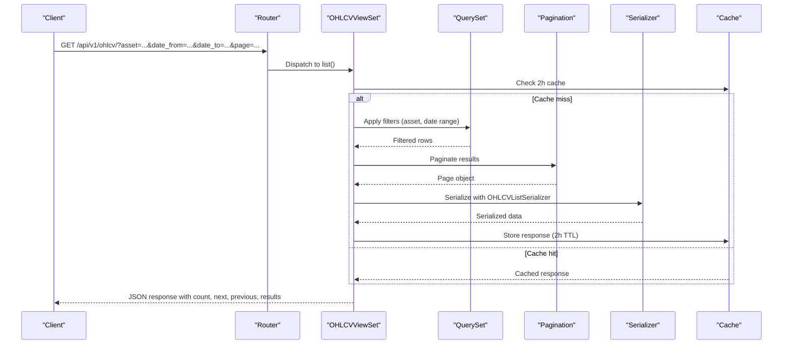
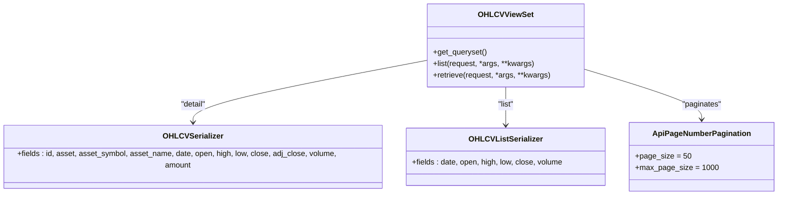

# OHLCV Data API

<cite>
**Referenced Files in This Document**
- [views.py](file://apps/markets/views.py)
- [serializers.py](file://apps/markets/serializers.py)
- [urls.py](file://config/urls.py)
- [pagination.py](file://apps/core/pagination.py)
- [api.md](file://docs/reference/api.md)
</cite>

## Table of Contents
1. [Introduction](#introduction)
2. [Project Structure](#project-structure)
3. [Core Components](#core-components)
4. [Architecture Overview](#architecture-overview)
5. [Detailed Component Analysis](#detailed-component-analysis)
6. [Dependency Analysis](#dependency-analysis)
7. [Performance Considerations](#performance-considerations)
8. [Troubleshooting Guide](#troubleshooting-guide)
9. [Conclusion](#conclusion)

## Introduction
This document describes the REST API for retrieving historical price and volume data via the OHLCV endpoint. It covers HTTP methods, URL patterns, query parameters, response schemas, ordering, pagination, caching behavior, and best practices to retrieve data efficiently without performance issues.

## Project Structure
The OHLCV endpoint is implemented as a read-only viewset under the markets app and exposed through the central API router at /api/v1/.

```mermaid
graph TB
Client["Client"]
Router["DefaultRouter<br/>config/urls.py"]
View["OHLCVViewSet<br/>apps/markets/views.py"]
SerList["OHLCVListSerializer<br/>apps/markets/serializers.py"]
SerDetail["OHLCVSerializer<br/>apps/markets/serializers.py"]
Cache["Django cache_page<br/>2 hours"]
Pagination["ApiPageNumberPagination<br/>apps/core/pagination.py"]
Client --> Router
Router --> View
View --> |list()| Cache
View --> |retrieve()| Cache
View --> Pagination
View --> SerList
View --> SerDetail
```

**Diagram sources**
- [urls.py:74-78](file://config/urls.py#L74-L78)
- [views.py:59-105](file://apps/markets/views.py#L59-L105)
- [serializers.py:32-49](file://apps/markets/serializers.py#L32-L49)
- [pagination.py:1-7](file://apps/core/pagination.py#L1-L7)

**Section sources**
- [urls.py:74-78](file://config/urls.py#L74-L78)
- [urls.py:109-112](file://config/urls.py#L109-L112)

## Core Components
- Endpoint class: OHLCVViewSet (read-only model viewset).
- Serializers:
  - OHLCVListSerializer for list responses (lightweight fields).
  - OHLCVSerializer for detail responses (includes asset metadata and additional fields).
- Filtering and ordering:
  - Asset filtering by primary key.
  - Date range filtering using date_from and date_to.
  - Ordering by date (default descending).
- Pagination: Page-based with default page size and maximum limits.
- Caching: 2-hour server-side cache for list and detail responses.

**Section sources**
- [views.py:59-105](file://apps/markets/views.py#L59-L105)
- [serializers.py:32-49](file://apps/markets/serializers.py#L32-L49)
- [pagination.py:1-7](file://apps/core/pagination.py#L1-L7)
- [api.md:136-187](file://docs/reference/api.md#L136-L187)

## Architecture Overview
The OHLCV endpoint follows a standard DRF pattern:
- Requests arrive at /api/v1/ohlcv/...
- The router dispatches to OHLCVViewSet.
- get_queryset applies optional filters (asset, date_from, date_to).
- Responses are serialized using either OHLCVListSerializer or OHLCVSerializer depending on action.
- Results are paginated using ApiPageNumberPagination.
- Responses are cached for 2 hours.



**Diagram sources**
- [views.py:59-105](file://apps/markets/views.py#L59-L105)
- [serializers.py:32-49](file://apps/markets/serializers.py#L32-L49)
- [pagination.py:1-7](file://apps/core/pagination.py#L1-L7)
- [api.md:136-187](file://docs/reference/api.md#L136-L187)

## Detailed Component Analysis

### Endpoint Definition and Routing
- Base path: /api/v1/
- OHLCV route registered under /ohlcv/
- Full paths:
  - List: GET /api/v1/ohlcv/
  - Detail: GET /api/v1/ohlcv/{id}/

**Section sources**
- [urls.py:74-78](file://config/urls.py#L74-L78)
- [urls.py:109-112](file://config/urls.py#L109-L112)

### HTTP Methods and Behavior
- GET /api/v1/ohlcv/:
  - Returns a paginated list of OHLCV records.
  - Supports filtering by asset and date range.
  - Supports ordering by date.
  - Uses OHLCVListSerializer for compact list output.
  - Cached for 2 hours.
- GET /api/v1/ohlcv/{id}/:
  - Returns a single OHLCV record.
  - Uses OHLCVSerializer for detailed output including asset metadata.
  - Cached for 2 hours.

**Section sources**
- [views.py:59-105](file://apps/markets/views.py#L59-L105)

### Query Parameters
- asset: Filter by asset primary key.
- date_from: Inclusive lower bound for date.
- date_to: Inclusive upper bound for date.
- ordering: Sort by date; prefix with - for descending (default is descending).
- page: Page number (1-based).
- page_size: Number of items per page (default 50, max 1000).

Examples:
- Fetch latest bars for an asset: GET /api/v1/ohlcv/?asset=12&ordering=-date&page_size=50
- Fetch a date range: GET /api/v1/ohlcv/?asset=12&date_from=2024-01-01&date_to=2024-01-31
- Retrieve a specific record: GET /api/v1/ohlcv/123/

**Section sources**
- [views.py:76-97](file://apps/markets/views.py#L76-L97)
- [api.md:136-187](file://docs/reference/api.md#L136-L187)

### Response Schemas
- List response uses OHLCVListSerializer fields:
  - date, open, high, low, close, volume
- Detail response uses OHLCVSerializer fields:
  - id, asset, asset_symbol, asset_name, date, open, high, low, close, adj_close, volume, amount

Notes:
- Lists return a subset of fields optimized for performance.
- Details include asset identifiers and additional financial fields such as adjusted close and turnover amount.

**Section sources**
- [serializers.py:32-49](file://apps/markets/serializers.py#L32-L49)

### Ordering
- Default ordering: newest first (-date).
- You can request ascending order by setting ordering=date.

**Section sources**
- [views.py:66-69](file://apps/markets/views.py#L66-L69)

### Pagination
- Uses ApiPageNumberPagination with:
  - Default page size: 50
  - Override via page_size parameter
  - Maximum page size: 1000
- Response envelope includes count, next, previous, and results.

Best practice:
- Always paginate when fetching large datasets to avoid timeouts and excessive memory usage.

**Section sources**
- [pagination.py:1-7](file://apps/core/pagination.py#L1-L7)
- [api.md:136-187](file://docs/reference/api.md#L136-L187)

### Caching Behavior
- Both list and detail endpoints are cached for 2 hours using Django’s cache_page decorator.
- After market close, historical data does not change within the day, making this safe for most use cases.
- To bypass cache for fresh data, append a unique query parameter (e.g., ?_=<nonce>) or flush the cache backend.

**Section sources**
- [views.py:99-105](file://apps/markets/views.py#L99-L105)
- [api.md:225-239](file://docs/reference/api.md#L225-L239)

### Concrete Usage Examples
- Fetch price history for a specific asset (latest 50 days):
  - GET /api/v1/ohlcv/?asset=12&ordering=-date&page_size=50
- Fetch a date range for an asset:
  - GET /api/v1/ohlcv/?asset=12&date_from=2024-01-01&date_to=2024-01-31&ordering=-date
- Retrieve a single OHLCV record by ID:
  - GET /api/v1/ohlcv/123/

These examples align with the supported query parameters and serializers described above.

**Section sources**
- [views.py:76-97](file://apps/markets/views.py#L76-L97)
- [serializers.py:32-49](file://apps/markets/serializers.py#L32-L49)

## Dependency Analysis
The OHLCV endpoint depends on:
- DRF viewsets and filter backends for routing, filtering, and ordering.
- Custom pagination class for consistent paging behavior.
- Serializers that map model fields to JSON.
- Django cache middleware for response caching.



**Diagram sources**
- [views.py:59-105](file://apps/markets/views.py#L59-L105)
- [serializers.py:32-49](file://apps/markets/serializers.py#L32-L49)
- [pagination.py:1-7](file://apps/core/pagination.py#L1-L7)

**Section sources**
- [views.py:59-105](file://apps/markets/views.py#L59-L105)
- [serializers.py:32-49](file://apps/markets/serializers.py#L32-L49)
- [pagination.py:1-7](file://apps/core/pagination.py#L1-L7)

## Performance Considerations
- Always paginate: Use page and page_size to limit result sets. The default page size is 50 and the maximum is 1000.
- Prefer list serializer: For bulk retrieval, rely on the list endpoint which returns fewer fields and is more efficient.
- Use targeted filters: Narrow results with asset and date ranges to reduce query load.
- Leverage ordering: Order by date to fetch recent data efficiently; descending order is default.
- Respect caching: Expect up to 2-hour staleness for cached responses. If you need fresher data after maintenance or backfills, bypass cache with a unique query parameter.
- Avoid unbounded queries: Do not request very large pages without necessity; consider chunking requests if you need extensive histories.

[No sources needed since this section provides general guidance]

## Troubleshooting Guide
- Unexpectedly stale data:
  - Cause: 2-hour response cache.
  - Resolution: Append a unique query parameter to bypass cache or flush the cache backend after updates.
- Empty results:
  - Verify asset exists and has OHLCV data in the requested date range.
  - Ensure date_from and date_to are valid and inclusive.
- Rate limiting:
  - If you receive 429 Too Many Requests, reduce request frequency or upgrade your tier. See rate limiting documentation for details.
- Large payloads:
  - Increase page_size up to the maximum allowed (1000) and iterate pages using next links.

**Section sources**
- [views.py:99-105](file://apps/markets/views.py#L99-L105)
- [api.md:136-187](file://docs/reference/api.md#L136-L187)
- [api.md:225-239](file://docs/reference/api.md#L225-L239)

## Conclusion
The OHLCV Data API provides a robust, cached, and paginated interface for retrieving historical price and volume data. By using asset and date filters, ordering by date, and adhering to pagination limits, clients can efficiently access large datasets while minimizing server load. The 2-hour cache ensures fast responses for historical data that does not change intraday.

[No sources needed since this section summarizes without analyzing specific files]