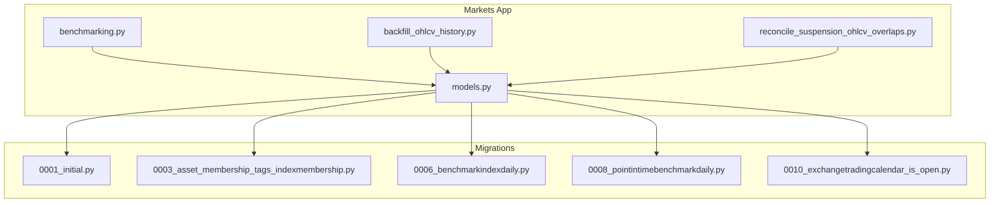
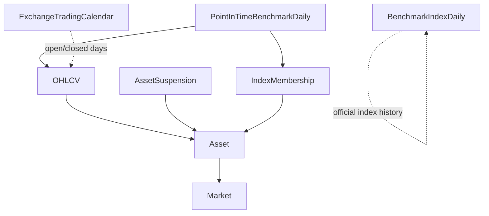
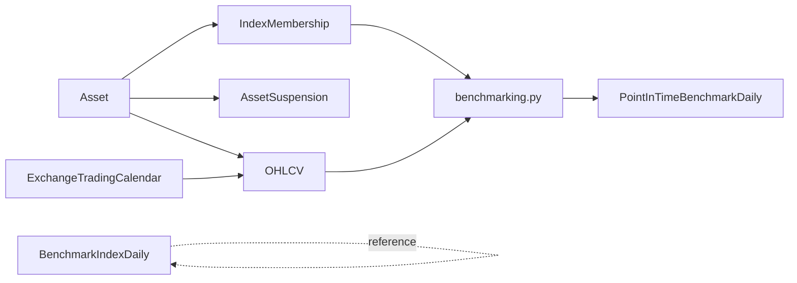

# Core Data Models

<cite>
**Referenced Files in This Document**
- [models.py](file://apps/markets/models.py)
- [0001_initial.py](file://apps/markets/migrations/0001_initial.py)
- [0003_asset_membership_tags_indexmembership.py](file://apps/markets/migrations/0003_asset_membership_tags_indexmembership.py)
- [0006_benchmarkindexdaily.py](file://apps/markets/migrations/0006_benchmarkindexdaily.py)
- [0008_pointintimebenchmarkdaily.py](file://apps/markets/migrations/0008_pointintimebenchmarkdaily.py)
- [0010_exchangetradingcalendar_is_open.py](file://apps/markets/migrations/0010_exchangetradingcalendar_is_open.py)
- [benchmarking.py](file://apps/markets/benchmarking.py)
- [backfill_ohlcv_history.py](file://apps/markets/management/commands/backfill_ohlcv_history.py)
- [reconcile_suspension_ohlcv_overlaps.py](file://apps/markets/management/commands/reconcile_suspension_ohlcv_overlaps.py)
</cite>

## Table of Contents
1. [Introduction](#introduction)
2. [Project Structure](#project-structure)
3. [Core Components](#core-components)
4. [Architecture Overview](#architecture-overview)
5. [Detailed Component Analysis](#detailed-component-analysis)
6. [Dependency Analysis](#dependency-analysis)
7. [Performance Considerations](#performance-considerations)
8. [Troubleshooting Guide](#troubleshooting-guide)
9. [Conclusion](#conclusion)
10. [Appendices](#appendices)

## Introduction
This document describes the core data models that power the Markets application’s asset lifecycle, price history, trading calendar, suspensions, index membership, and benchmark construction. It focuses on:
- Asset model with listing status, membership tags, and relationships to Market
- OHLCV daily price storage with point-in-time integrity constraints and indexing strategies
- ExchangeTradingCalendar for official exchange trading days
- AssetSuspension for trading halts
- IndexMembership for historical benchmark constituent tracking
- BenchmarkIndexDaily for official index history
- PointInTimeBenchmarkDaily for internal union benchmarks used by backtests

It also provides field definitions, relationships, constraints, indexes, business rules, and examples of typical queries and access patterns.

## Project Structure
The Markets app defines all core entities in a single models module and evolves them through migrations. Supporting logic for point-in-time effective universe and union benchmark construction lives in a dedicated module. Management commands orchestrate backfills and reconciliation tasks.

**Diagram sources**
- [models.py:1-226](file://apps/markets/models.py#L1-L226)
- [benchmarking.py:1-462](file://apps/markets/benchmarking.py#L1-L462)
- [0001_initial.py:1-68](file://apps/markets/migrations/0001_initial.py#L1-L68)
- [0003_asset_membership_tags_indexmembership.py:1-38](file://apps/markets/migrations/0003_asset_membership_tags_indexmembership.py#L1-L38)
- [0006_benchmarkindexdaily.py:1-35](file://apps/markets/migrations/0006_benchmarkindexdaily.py#L1-L35)
- [0008_pointintimebenchmarkdaily.py:1-38](file://apps/markets/migrations/0008_pointintimebenchmarkdaily.py#L1-L38)
- [0010_exchangetradingcalendar_is_open.py:1-20](file://apps/markets/migrations/0010_exchangetradingcalendar_is_open.py#L1-L20)

**Section sources**
- [models.py:1-226](file://apps/markets/models.py#L1-L226)
- [0001_initial.py:1-68](file://apps/markets/migrations/0001_initial.py#L1-L68)

## Core Components
- Market: Represents an exchange or market (e.g., SSE, SZSE).
- Asset: Financial instrument with listing status, list/delist dates, and current membership tags.
- OHLCV: Daily open/high/low/close/adjusted close/volume/amount per asset.
- ExchangeTradingCalendar: Official exchange trading days and open/closed flags.
- AssetSuspension: Per-asset suspension records including full-day flags.
- IndexMembership: Historical snapshot of an asset’s membership in indices with optional weights.
- BenchmarkIndexDaily: Official index daily OHLCV series.
- PointInTimeBenchmarkDaily: Internal union benchmark NAV and daily return computed from PIT constituents.

Key relationships:
- Asset belongs to Market.
- OHLCV, AssetSuspension, IndexMembership reference Asset.
- PointInTimeBenchmarkDaily is derived from IndexMembership and OHLCV via benchmarking logic.

Indexes and constraints:
- Unique keys enforce one row per entity/date combinations where applicable.
- Composite indexes optimize common query patterns (asset+date, index_code+trade_date, etc.).

Business rules:
- Effective universe is date-aware and constructed from IndexMembership snapshots as of each trade date.
- OHLCV must not overlap with full-day suspensions; reconciliation tools exist to remove invalid rows.
- Union benchmark uses free-float market-cap weighting when available, otherwise capitalization-based weights.

**Section sources**
- [models.py:4-226](file://apps/markets/models.py#L4-L226)
- [benchmarking.py:93-254](file://apps/markets/benchmarking.py#L93-L254)

## Architecture Overview
The data layer supports both static reference data (Market, Asset) and time-series data (OHLCV, IndexMembership, BenchmarkIndexDaily, PointInTimeBenchmarkDaily), coordinated by the trading calendar and suspension records. The benchmarking module enforces a canonical effective-universe contract and builds the internal union benchmark.

**Diagram sources**
- [models.py:4-226](file://apps/markets/models.py#L4-L226)
- [benchmarking.py:312-428](file://apps/markets/benchmarking.py#L312-L428)

## Detailed Component Analysis

### Market
- Purpose: Canonical identifier for an exchange or market.
- Fields:
  - code: unique market code string
  - name: human-readable market name
- Constraints: code is unique.
- Relationships: One-to-many with Asset.

Typical queries:
- List all markets: select all rows ordered by code.
- Find assets by market: filter Asset by market.code.

**Section sources**
- [models.py:4-18](file://apps/markets/models.py#L4-L18)
- [0001_initial.py:15-26](file://apps/markets/migrations/0001_initial.py#L15-L26)

### Asset
- Purpose: Represents a tradable instrument within a market.
- Fields:
  - market: foreign key to Market
  - symbol: local ticker symbol
  - ts_code: unique external identifier (e.g., “600519.SH”)
  - name: asset name
  - listing_status: ACTIVE or DELISTED
  - list_date: IPO/listing date
  - delist_date: delisting date
  - membership_tags: JSON array of current index memberships (e.g., CSI300, CSIA500)
- Constraints:
  - unique_together: (market, symbol)
  - ts_code is unique
- Relationships:
  - One-to-many with OHLCV, AssetSuspension, IndexMembership
  - Reverse relations: assets, ohlcv_data, suspension_days, index_memberships

Lifecycle management:
- Listing status indicates whether the asset is currently tradable.
- list_date and delist_date define the valid trading window.
- membership_tags reflect current index memberships; historical changes are captured in IndexMembership.

Typical queries:
- Active assets: filter by listing_status = ACTIVE.
- Assets listed between dates: filter by list_date and delist_date ranges.
- Current index members: read membership_tags for quick checks; use IndexMembership for historical analysis.

**Section sources**
- [models.py:19-63](file://apps/markets/models.py#L19-L63)
- [0001_initial.py:27-44](file://apps/markets/migrations/0001_initial.py#L27-L44)
- [0003_asset_membership_tags_indexmembership.py:14-18](file://apps/markets/migrations/0003_asset_membership_tags_indexmembership.py#L14-L18)

### OHLCV
- Purpose: Stores daily price and volume data per asset.
- Fields:
  - asset: foreign key to Asset
  - date: trading date
  - open, high, low, close, adj_close: decimal price fields
  - volume: integer volume
  - amount: turnover amount
- Constraints:
  - unique_together: (asset, date)
- Indexes:
  - Composite index on (asset, date) for efficient per-asset time series retrieval.

Point-in-time integrity:
- OHLCV rows must not exist on full-day suspension dates for the same asset. Reconciliation command can detect and delete such overlaps.
- Backfill process respects historical floor and technical indicator warm-up windows; it may extend repair windows earlier when needed.

Typical queries:
- Latest price for an asset: order by date desc limit 1.
- Date range returns: filter by asset and date range, compute simple returns from close.
- Tradeable assets on a date: distinct asset_ids where OHLCV exists for that date.

**Section sources**
- [models.py:201-226](file://apps/markets/models.py#L201-L226)
- [0001_initial.py:45-66](file://apps/markets/migrations/0001_initial.py#L45-L66)
- [backfill_ohlcv_history.py:318-387](file://apps/markets/management/commands/backfill_ohlcv_history.py#L318-L387)
- [reconcile_suspension_ohlcv_overlaps.py:249-265](file://apps/markets/management/commands/reconcile_suspension_ohlcv_overlaps.py#L249-L265)

### ExchangeTradingCalendar
- Purpose: Official exchange trading days and open/closed flags.
- Fields:
  - exchange_code: short code for the exchange
  - trade_date: trading date
  - is_open: boolean indicating if the exchange was open
  - source: provenance tag
- Constraints:
  - unique_together: (exchange_code, trade_date)
- Indexes:
  - db_index on exchange_code, trade_date
  - composite index on (exchange_code, trade_date)
  - db_index on is_open

Typical queries:
- Trading dates in range: filter by trade_date range and is_open=True.
- Next trading date after a given date: order by trade_date asc filter gt.

**Section sources**
- [models.py:65-85](file://apps/markets/models.py#L65-L85)
- [0010_exchangetradingcalendar_is_open.py:10-20](file://apps/markets/migrations/0010_exchangetradingcalendar_is_open.py#L10-L20)

### AssetSuspension
- Purpose: Records per-asset suspension events, including full-day suspensions.
- Fields:
  - asset: foreign key to Asset
  - trade_date: suspension date
  - suspend_type: type code
  - suspend_timing: timing details
  - is_full_day: flag for full-day suspension
  - source: provenance tag
- Constraints:
  - unique_together: (asset, trade_date)
- Indexes:
  - Composite index on (asset, trade_date)
  - Composite index on (trade_date, is_full_day) for fast full-day filtering

Business rules:
- Full-day suspensions should not have corresponding OHLCV rows; reconciliation tool validates and optionally deletes conflicting OHLCV entries.

Typical queries:
- Full-day suspensions in range: filter by is_full_day=True and date range.
- Overlap detection: intersect suspension dates with OHLCV dates per asset.

**Section sources**
- [models.py:87-115](file://apps/markets/models.py#L87-L115)
- [reconcile_suspension_ohlcv_overlaps.py:249-265](file://apps/markets/management/commands/reconcile_suspension_ohlcv_overlaps.py#L249-L265)

### IndexMembership
- Purpose: Historical snapshot of an asset’s membership in indices with optional weights.
- Fields:
  - asset: foreign key to Asset
  - index_code: index identifier
  - index_name: human-readable name
  - trade_date: snapshot date
  - weight: optional numeric weight
  - source: provenance tag
- Constraints:
  - unique_together: (asset, index_code, trade_date)
- Indexes:
  - Composite index on (index_code, trade_date)
  - Composite index on (asset, index_code)

Business rules:
- Used to build the point-in-time effective universe by selecting the latest snapshot on or before each target date.
- Required index codes vary by date per the canonical contract (CSI300 from start date; CSI A500 added later).

Typical queries:
- Latest index membership for an asset on a date: filter by asset and index_code, order by trade_date desc limit 1.
- Constituents on a date: filter by trade_date equal to target date.

**Section sources**
- [models.py:117-145](file://apps/markets/models.py#L117-L145)
- [0003_asset_membership_tags_indexmembership.py:19-38](file://apps/markets/migrations/0003_asset_membership_tags_indexmembership.py#L19-L38)
- [benchmarking.py:65-90](file://apps/markets/benchmarking.py#L65-L90)

### BenchmarkIndexDaily
- Purpose: Official daily index history used for comparisons.
- Fields:
  - index_code: index identifier
  - index_name: human-readable name
  - trade_date: trading date
  - open, high, low, close: decimal price fields
  - source: provenance tag
- Constraints:
  - unique_together: (index_code, trade_date)
- Indexes:
  - Composite index on (index_code, trade_date)

Typical queries:
- Index series: filter by index_code and date range, order by trade_date.
- Returns: compute simple returns from close across consecutive dates.

**Section sources**
- [models.py:147-171](file://apps/markets/models.py#L147-L171)
- [0006_benchmarkindexdaily.py:10-35](file://apps/markets/migrations/0006_benchmarkindexdaily.py#L10-L35)

### PointInTimeBenchmarkDaily
- Purpose: Internal union benchmark NAV and daily return built from PIT constituents.
- Fields:
  - benchmark_code: fixed code for the union benchmark
  - benchmark_name: human-readable name
  - trade_date: trading date
  - daily_return: weighted return for the day
  - nav: cumulative net asset value
  - constituent_count: number of unique constituents at that date
  - overlap_count: number of assets present in multiple indices
  - weighting_method: method used (free_float_market_cap)
  - metadata: JSON with detailed computation info
  - created_at, updated_at: timestamps
- Constraints:
  - unique_together: (benchmark_code, trade_date)
- Indexes:
  - Composite index on (benchmark_code, trade_date)

Construction rules:
- Uses IndexMembership snapshots as of each trade date to determine constituents.
- Weights derived from fundamentals (free share * close or circ_mv) when available.
- NAV updates multiplicatively using daily returns; missing prices or weights are skipped and recorded in metadata.

Typical queries:
- Benchmark series: filter by benchmark_code and date range, order by trade_date.
- Performance metrics: compute drawdowns or rolling statistics over nav.

**Section sources**
- [models.py:173-200](file://apps/markets/models.py#L173-L200)
- [0008_pointintimebenchmarkdaily.py:10-38](file://apps/markets/migrations/0008_pointintimebenchmarkdaily.py#L10-L38)
- [benchmarking.py:312-428](file://apps/markets/benchmarking.py#L312-L428)

## Dependency Analysis
The following diagram shows how components depend on each other and how data flows into the union benchmark.

**Diagram sources**
- [models.py:4-226](file://apps/markets/models.py#L4-L226)
- [benchmarking.py:312-428](file://apps/markets/benchmarking.py#L312-L428)

**Section sources**
- [models.py:4-226](file://apps/markets/models.py#L4-L226)
- [benchmarking.py:1-462](file://apps/markets/benchmarking.py#L1-L462)

## Performance Considerations
- Index usage:
  - OHLCV: composite index on (asset, date) optimizes per-asset time series queries.
  - IndexMembership: composite indexes on (index_code, trade_date) and (asset, index_code) support efficient PIT lookups and constituent queries.
  - ExchangeTradingCalendar: composite index on (exchange_code, trade_date) and index on is_open speed up calendar scans.
  - PointInTimeBenchmarkDaily: composite index on (benchmark_code, trade_date) enables fast benchmark series retrieval.
- Bulk operations:
  - Union benchmark refresh uses bulk_create with update_conflicts to efficiently write or update rows.
- Query patterns:
  - Use date-bounded filters and ordering to leverage indexes.
  - Avoid scanning entire tables; prefer targeted filters by asset_id, index_code, or benchmark_code.

[No sources needed since this section provides general guidance]

## Troubleshooting Guide
Common issues and resolutions:
- Missing PIT membership coverage:
  - Symptom: errors indicating missing index membership for required dates.
  - Resolution: backfill IndexMembership for required index codes and date ranges.
- OHLCV on full-day suspension:
  - Symptom: data quality reports flag OHLCV rows overlapping full-day suspensions.
  - Resolution: run reconciliation command to verify against external notices and delete invalid OHLCV rows.
- Incomplete OHLCV history:
  - Symptom: gaps in price series affecting indicators or backtests.
  - Resolution: run backfill command with appropriate start/end dates and optional warm-up windows.

Operational commands:
- Backfill OHLCV history: supports CSV-driven repairs, symbols filtering, and warm-up extensions.
- Reconcile suspension/OHLCV overlaps: validates against external sources and optionally deletes conflicting OHLCV rows.

**Section sources**
- [backfill_ohlcv_history.py:29-45](file://apps/markets/management/commands/backfill_ohlcv_history.py#L29-L45)
- [backfill_ohlcv_history.py:318-387](file://apps/markets/management/commands/backfill_ohlcv_history.py#L318-L387)
- [reconcile_suspension_ohlcv_overlaps.py:62-88](file://apps/markets/management/commands/reconcile_suspension_ohlcv_overlaps.py#L62-L88)
- [reconcile_suspension_ohlcv_overlaps.py:249-265](file://apps/markets/management/commands/reconcile_suspension_ohlcv_overlaps.py#L249-L265)

## Conclusion
The Markets data models provide a robust foundation for asset lifecycle management, price history, and benchmark construction. Key design principles include:
- Strict uniqueness constraints to prevent duplicate rows per entity/date combinations
- Comprehensive indexing to support efficient time-series and cross-sectional queries
- Point-in-time integrity enforced via IndexMembership and reconciliation tools
- Canonical effective universe and union benchmark logic ensuring consistent backtesting and analytics

Adhering to these models and processes ensures reliable data quality and reproducible results across the platform.

[No sources needed since this section summarizes without analyzing specific files]

## Appendices

### Field Definitions Summary
- Market: code (unique), name
- Asset: market (FK), symbol, ts_code (unique), name, listing_status, list_date, delist_date, membership_tags (JSON)
- OHLCV: asset (FK), date, open, high, low, close, adj_close, volume, amount
- ExchangeTradingCalendar: exchange_code, trade_date, is_open, source
- AssetSuspension: asset (FK), trade_date, suspend_type, suspend_timing, is_full_day, source
- IndexMembership: asset (FK), index_code, index_name, trade_date, weight, source
- BenchmarkIndexDaily: index_code, index_name, trade_date, open, high, low, close, source
- PointInTimeBenchmarkDaily: benchmark_code, benchmark_name, trade_date, daily_return, nav, constituent_count, overlap_count, weighting_method, metadata, created_at, updated_at

**Section sources**
- [models.py:4-226](file://apps/markets/models.py#L4-L226)

### Typical Queries and Access Patterns
- Retrieve active assets:
  - Filter Asset by listing_status = ACTIVE
- Get OHLCV series for an asset:
  - Filter by asset and date range, order by date
- Determine tradeable assets on a date:
  - Distinct asset_ids from OHLCV where date equals target
- Build PIT constituents for a date:
  - Use benchmarking functions to resolve latest IndexMembership snapshots per index code and union asset ids
- Compute union benchmark NAV:
  - Use benchmarking functions to build rows and bulk-create/update PointInTimeBenchmarkDaily

**Section sources**
- [benchmarking.py:160-254](file://apps/markets/benchmarking.py#L160-L254)
- [benchmarking.py:312-428](file://apps/markets/benchmarking.py#L312-L428)