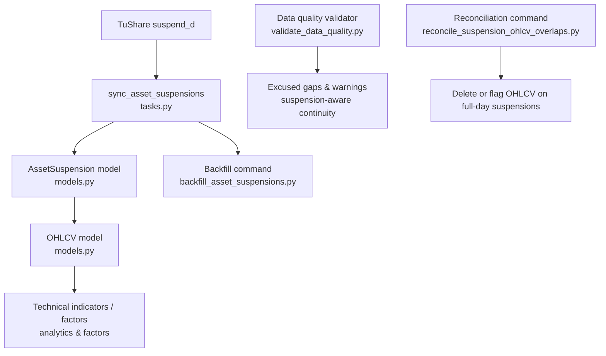
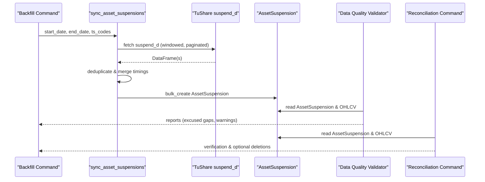
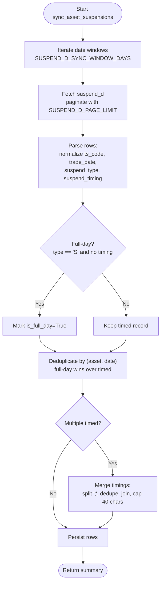
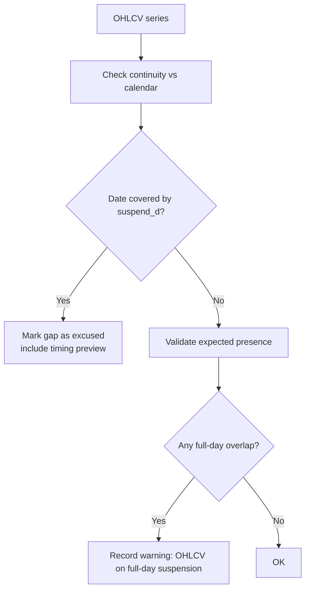
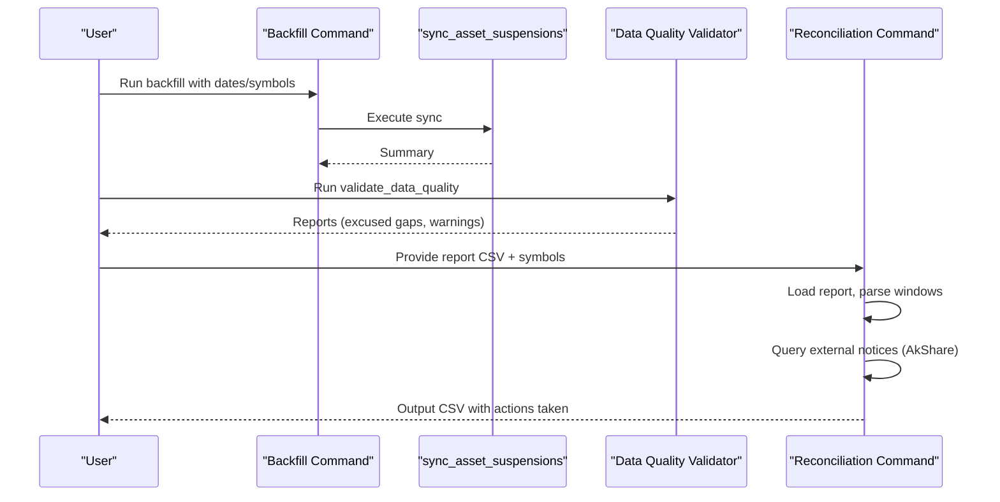
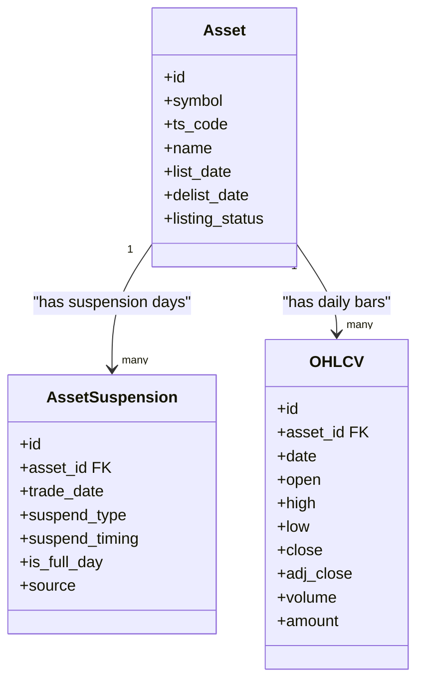
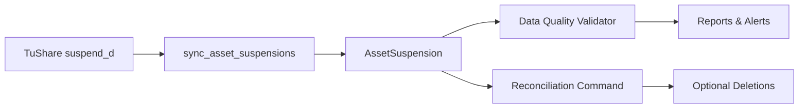

# Asset Suspension Management

<cite>
**Referenced Files in This Document**
- [tasks.py](file://apps/markets/tasks.py)
- [models.py](file://apps/markets/models.py)
- [backfill_asset_suspensions.py](file://apps/markets/management/commands/backfill_asset_suspensions.py)
- [reconcile_suspension_ohlcv_overlaps.py](file://apps/markets/management/commands/reconcile_suspension_ohlcv_overlaps.py)
- [validate_data_quality.py](file://apps/core/management/commands/validate_data_quality.py)
- [tests.py](file://apps/markets/tests.py)
</cite>

## Table of Contents
1. [Introduction](#introduction)
2. [Project Structure](#project-structure)
3. [Core Components](#core-components)
4. [Architecture Overview](#architecture-overview)
5. [Detailed Component Analysis](#detailed-component-analysis)
6. [Dependency Analysis](#dependency-analysis)
7. [Performance Considerations](#performance-considerations)
8. [Troubleshooting Guide](#troubleshooting-guide)
9. [Conclusion](#conclusion)

## Introduction
This document explains how asset suspension management is implemented and used across the system to support temporary trading halts and full-day suspensions. It focuses on the sync_asset_suspensions function, its handling of FULL_DAY_SUSPEND_TYPE versus timed suspensions, deduplication and merge logic for overlapping records, integration with OHLCV data processing for technical analysis and factor calculations, and operational controls such as SUSPEND_D_SYNC_WINDOW_DAYS and SUSPEND_D_PAGE_LIMIT. It also covers monitoring and alerting for unusual suspension patterns through data quality validation and reconciliation tools.

## Project Structure
Suspension management spans several modules:
- Data ingestion and synchronization live in the markets tasks module.
- Persistence models define assets, suspensions, and OHLCV records.
- Management commands backfill suspensions and reconcile conflicts between OHLCV and full-day suspensions.
- Data quality validation reports gaps and anomalies, treating suspension-covered dates as excused where appropriate.

**Diagram sources**
- [tasks.py:355-488](file://apps/markets/tasks.py#L355-L488)
- [models.py:87-115](file://apps/markets/models.py#L87-L115)
- [models.py:201-226](file://apps/markets/models.py#L201-L226)
- [backfill_asset_suspensions.py:1-43](file://apps/markets/management/commands/backfill_asset_suspensions.py#L1-L43)
- [validate_data_quality.py:113-146](file://apps/core/management/commands/validate_data_quality.py#L113-L146)
- [reconcile_suspension_ohlcv_overlaps.py:62-215](file://apps/markets/management/commands/reconcile_suspension_ohlcv_overlaps.py#L62-L215)

**Section sources**
- [tasks.py:355-488](file://apps/markets/tasks.py#L355-L488)
- [models.py:87-115](file://apps/markets/models.py#L87-L115)
- [models.py:201-226](file://apps/markets/models.py#L201-L226)
- [backfill_asset_suspensions.py:1-43](file://apps/markets/management/commands/backfill_asset_suspensions.py#L1-L43)
- [validate_data_quality.py:113-146](file://apps/core/management/commands/validate_data_quality.py#L113-L146)
- [reconcile_suspension_ohlcv_overlaps.py:62-215](file://apps/markets/management/commands/reconcile_suspension_ohlcv_overlaps.py#L62-L215)

## Core Components
- AssetSuspension model stores per-asset daily suspension records, including whether a day is fully suspended and optional timing windows for partial-day suspensions.
- sync_asset_suspensions orchestrates fetching from TuShare’s suspend_d endpoint, paginating results, deduplicating and merging overlapping records, and persisting them efficiently.
- Backfill command provides an interface to run sync_asset_suspensions over historical ranges and filter by symbols.
- Data quality validator treats suspension-covered dates as excused when assessing OHLCV continuity, and flags problematic overlaps where OHLCV exists on full-day suspensions.
- Reconciliation command verifies suspected OHLCV/full-day suspension overlaps against external notices and can delete confirmed invalid OHLCV rows.

Key constants:
- SUSPEND_D_SYNC_WINDOW_DAYS: window size for iterating date ranges during sync.
- SUSPEND_D_PAGE_LIMIT: page size for suspend_d API pagination.
- FULL_DAY_SUSPEND_TYPE: canonical code identifying full-day suspensions.

**Section sources**
- [models.py:87-115](file://apps/markets/models.py#L87-L115)
- [tasks.py:37-39](file://apps/markets/tasks.py#L37-L39)
- [tasks.py:355-488](file://apps/markets/tasks.py#L355-L488)
- [backfill_asset_suspensions.py:1-43](file://apps/markets/management/commands/backfill_asset_suspensions.py#L1-L43)
- [validate_data_quality.py:113-146](file://apps/core/management/commands/validate_data_quality.py#L113-L146)
- [reconcile_suspension_ohlcv_overlaps.py:62-215](file://apps/markets/management/commands/reconcile_suspension_ohlcv_overlaps.py#L62-L215)

## Architecture Overview
The suspension pipeline integrates data ingestion, persistence, and downstream analytics:

**Diagram sources**
- [tasks.py:355-488](file://apps/markets/tasks.py#L355-L488)
- [models.py:87-115](file://apps/markets/models.py#L87-L115)
- [validate_data_quality.py:113-146](file://apps/core/management/commands/validate_data_quality.py#L113-L146)
- [reconcile_suspension_ohlcv_overlaps.py:62-215](file://apps/markets/management/commands/reconcile_suspension_ohlcv_overlaps.py#L62-L215)

## Detailed Component Analysis

### sync_asset_suspensions: Handling Suspension Types and Deduplication
- Date windowing: The function iterates over date ranges using _iter_date_windows with SUSPEND_D_SYNC_WINDOW_DAYS to chunk requests and reduce payload sizes.
- Pagination: For each window, it calls pro.suspend_d with suspend_type='' to retrieve all suspension types, paging via offset and limit=SUSPEND_D_PAGE_LIMIT until fewer rows are returned than the page limit.
- Type resolution: Each row’s suspend_type is normalized; if missing, it defaults to FULL_DAY_SUSPEND_TYPE. A record is considered a full-day suspension when suspend_type equals FULL_DAY_SUSPEND_TYPE and suspend_timing is None.
- Deduplication strategy:
  - Key: (asset.id, trade_date).
  - If multiple rows exist for the same key:
    - Full-day overrides timed: a full-day record replaces any existing timed record.
    - Timed merges: if both are timed, their suspend_timing values are split by semicolon, deduplicated, trimmed, and recombined into a single string capped at 40 characters.
- Persistence: After deduplication, rows are bulk-created with batch_size=2000, and counters track total rows written and full-day rows.

**Diagram sources**
- [tasks.py:383-480](file://apps/markets/tasks.py#L383-L480)

**Section sources**
- [tasks.py:37-39](file://apps/markets/tasks.py#L37-L39)
- [tasks.py:355-488](file://apps/markets/tasks.py#L355-L488)
- [tests.py:545-609](file://apps/markets/tests.py#L545-L609)

### Integration with OHLCV Data Processing
- Excused gaps: The data quality validator excludes dates covered by suspend_d from OHLCV continuity expectations. Missing OHLCV on those dates is reported as excused gaps, with details including timing previews when available.
- Overlap warnings: If OHLCV exists on full-day suspension dates, the validator records a warning indicating an overlap between OHLCV and full-day suspensions.
- Downstream impact: Technical indicators and factor calculations rely on continuous OHLCV series. By marking suspension-covered dates as excused, the validator ensures that continuity checks do not penalize legitimate gaps caused by suspensions.

**Diagram sources**
- [validate_data_quality.py:113-146](file://apps/core/management/commands/validate_data_quality.py#L113-L146)
- [validate_data_quality.py:1224-1242](file://apps/core/management/commands/validate_data_quality.py#L1224-L1242)
- [validate_data_quality.py:1293-1315](file://apps/core/management/commands/validate_data_quality.py#L1293-L1315)

**Section sources**
- [validate_data_quality.py:113-146](file://apps/core/management/commands/validate_data_quality.py#L113-L146)
- [validate_data_quality.py:1224-1242](file://apps/core/management/commands/validate_data_quality.py#L1224-L1242)
- [validate_data_quality.py:1293-1315](file://apps/core/management/commands/validate_data_quality.py#L1293-L1315)

### Backfill and Reconciliation Commands
- Backfill command: Provides a user-friendly interface to run sync_asset_suspensions over a specified date range, optionally filtering by symbol or ts_code. It prints a summary including asset count, window, rows written, and full-day rows.
- Reconciliation command: Reads data quality reports that flagged OHLCV/full-day suspension overlaps, reconstructs overlap dates, queries external notices via AkShare (Baidu), matches entries by stock code and exchange, and optionally deletes confirmed invalid OHLCV rows. Outputs a detailed CSV report.

**Diagram sources**
- [backfill_asset_suspensions.py:1-43](file://apps/markets/management/commands/backfill_asset_suspensions.py#L1-L43)
- [reconcile_suspension_ohlcv_overlaps.py:62-215](file://apps/markets/management/commands/reconcile_suspension_ohlcv_overlaps.py#L62-L215)

**Section sources**
- [backfill_asset_suspensions.py:1-43](file://apps/markets/management/commands/backfill_asset_suspensions.py#L1-L43)
- [reconcile_suspension_ohlcv_overlaps.py:62-215](file://apps/markets/management/commands/reconcile_suspension_ohlcv_overlaps.py#L62-L215)

### Data Model Relationships

**Diagram sources**
- [models.py:19-63](file://apps/markets/models.py#L19-L63)
- [models.py:87-115](file://apps/markets/models.py#L87-L115)
- [models.py:201-226](file://apps/markets/models.py#L201-L226)

**Section sources**
- [models.py:19-63](file://apps/markets/models.py#L19-L63)
- [models.py:87-115](file://apps/markets/models.py#L87-L115)
- [models.py:201-226](file://apps/markets/models.py#L201-L226)

## Dependency Analysis
- sync_asset_suspensions depends on:
  - TuShare API via pro.suspend_d for raw suspension data.
  - Django ORM for querying Assets and persisting AssetSuspension.
  - Configuration constants for windowing and pagination.
- Data quality validator depends on:
  - AssetSuspension and OHLCV models to compute excused gaps and detect overlaps.
- Reconciliation command depends on:
  - External library AkShare to fetch suspension notices.
  - AssetSuspension and OHLCV models to identify and act on overlaps.

**Diagram sources**
- [tasks.py:355-488](file://apps/markets/tasks.py#L355-L488)
- [validate_data_quality.py:113-146](file://apps/core/management/commands/validate_data_quality.py#L113-L146)
- [reconcile_suspension_ohlcv_overlaps.py:62-215](file://apps/markets/management/commands/reconcile_suspension_ohlcv_overlaps.py#L62-L215)

**Section sources**
- [tasks.py:355-488](file://apps/markets/tasks.py#L355-L488)
- [validate_data_quality.py:113-146](file://apps/core/management/commands/validate_data_quality.py#L113-L146)
- [reconcile_suspension_ohlcv_overlaps.py:62-215](file://apps/markets/management/commands/reconcile_suspension_ohlcv_overlaps.py#L62-L215)

## Performance Considerations
- Windowed syncing: SUSPEND_D_SYNC_WINDOW_DAYS limits request payloads and reduces memory pressure by splitting large date ranges into manageable chunks.
- Pagination: SUSPEND_D_PAGE_LIMIT controls page size for suspend_d responses; the loop continues until fewer rows are returned than the limit, ensuring complete retrieval without excessive memory usage.
- Bulk operations: AssetSuspension rows are created in batches of 2000 to minimize database round-trips and improve throughput.
- Deduplication efficiency: In-memory dictionary keyed by (asset.id, trade_date) enables O(1) lookups and merges, with timing strings split and deduplicated only when necessary.

[No sources needed since this section provides general guidance]

## Troubleshooting Guide
- Missing TUSHARE_TOKEN: sync_asset_suspensions raises a configuration error if the token is not set. Ensure environment configuration includes the token before running backfills.
- Rate limiting: The task uses a retry wrapper for provider calls; if rate limits are encountered, logs will indicate retries and sleeps. Adjust window/page settings if frequent throttling occurs.
- Unexpected OHLCV on full-day suspensions: Use the reconciliation command to verify against external notices and optionally delete invalid OHLCV rows. Review the generated CSV for matched reasons and actions taken.
- Excessive timed suspensions: If many overlapping timed suspensions appear, check upstream data sources and ensure deduplication and merge logic is functioning as expected. Validation reports include timing previews to aid diagnosis.

**Section sources**
- [tasks.py:375-377](file://apps/markets/tasks.py#L375-L377)
- [tasks.py:196-216](file://apps/markets/tasks.py#L196-L216)
- [reconcile_suspension_ohlcv_overlaps.py:62-215](file://apps/markets/management/commands/reconcile_suspension_ohlcv_overlaps.py#L62-L215)
- [validate_data_quality.py:1224-1242](file://apps/core/management/commands/validate_data_quality.py#L1224-L1242)

## Conclusion
Asset suspension management in this system robustly handles both full-day and timed suspensions through careful ingestion, deduplication, and merging. The sync_asset_suspensions function leverages windowed and paginated requests to efficiently process large datasets while preserving accuracy. Integration with OHLCV data processing ensures that suspension-covered periods are treated appropriately in continuity checks and downstream analytics. Monitoring and alerting are provided via data quality validation and reconciliation commands, enabling operators to detect and remediate unusual suspension patterns and maintain high-quality datasets for technical analysis and factor calculations.

[No sources needed since this section summarizes without analyzing specific files]