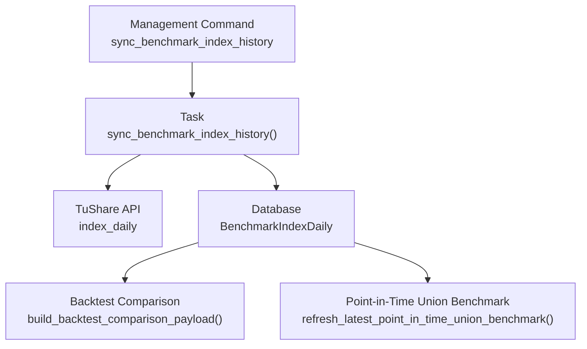
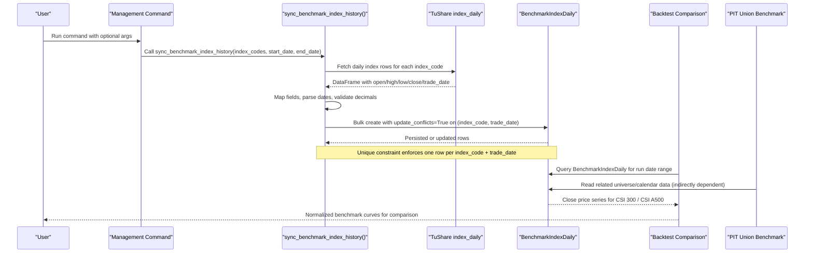
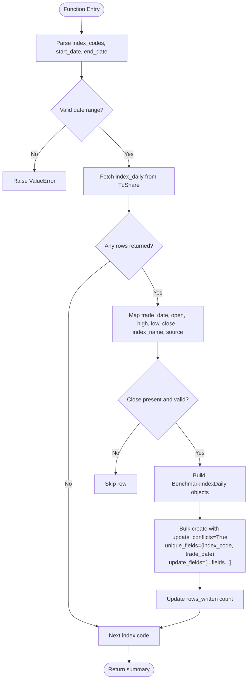
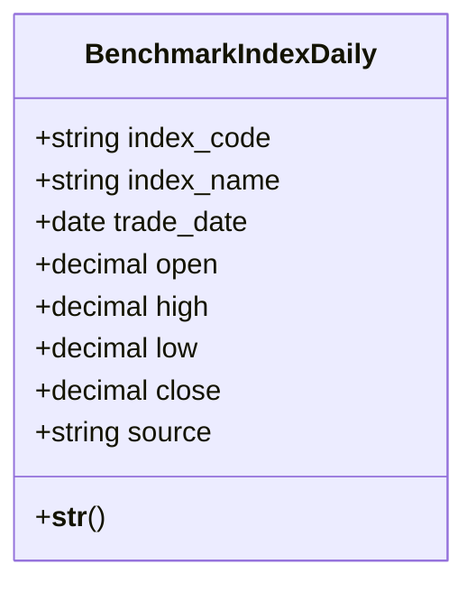
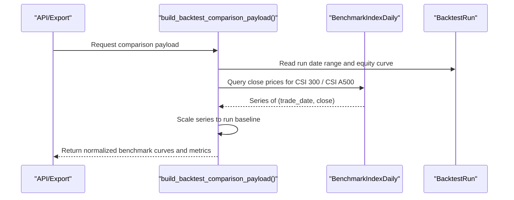
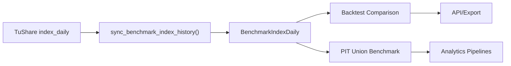

# Benchmark Index History

<cite>
**Referenced Files in This Document**
- [sync_benchmark_index_history.py](file://apps/markets/management/commands/sync_benchmark_index_history.py)
- [tasks.py](file://apps/markets/tasks.py)
- [models.py](file://apps/markets/models.py)
- [benchmarking.py](file://apps/markets/benchmarking.py)
- [comparison.py](file://apps/backtest/comparison.py)
- [validate_data_quality.py](file://apps/core/management/commands/validate_data_quality.py)
</cite>

## Table of Contents
1. [Introduction](#introduction)
2. [Project Structure](#project-structure)
3. [Core Components](#core-components)
4. [Architecture Overview](#architecture-overview)
5. [Detailed Component Analysis](#detailed-component-analysis)
6. [Dependency Analysis](#dependency-analysis)
7. [Performance Considerations](#performance-considerations)
8. [Troubleshooting Guide](#troubleshooting-guide)
9. [Conclusion](#conclusion)

## Introduction
This document explains how daily benchmark index history is synchronized for CSI 300 and CSI A500, and how that data underpins performance comparison and strategy evaluation across backtesting and analytics pipelines. It focuses on the sync_benchmark_index_history function, the mapping from TuShare’s index_daily API to the BenchmarkIndexDaily model, the upsert behavior using update_conflicts with unique constraint enforcement, and the downstream consumers that rely on accurate benchmark series.

## Project Structure
The synchronization flow spans a management command, a background task, database models, and consumer modules:
- Management command: exposes CLI arguments and delegates to the task.
- Task: fetches daily index data from TuShare, maps fields, validates, and persists via bulk upsert.
- Models: define the BenchmarkIndexDaily table and constraints.
- Consumers: backtest comparison and point-in-time union benchmarking read from stored benchmark data.

**Diagram sources**
- [sync_benchmark_index_history.py:6-44](file://apps/markets/management/commands/sync_benchmark_index_history.py#L6-L44)
- [tasks.py:491-574](file://apps/markets/tasks.py#L491-L574)
- [models.py:147-170](file://apps/markets/models.py#L147-L170)
- [comparison.py:112-139](file://apps/backtest/comparison.py#L112-L139)
- [benchmarking.py:395-462](file://apps/markets/benchmarking.py#L395-L462)

**Section sources**
- [sync_benchmark_index_history.py:6-44](file://apps/markets/management/commands/sync_benchmark_index_history.py#L6-L44)
- [tasks.py:491-574](file://apps/markets/tasks.py#L491-L574)
- [models.py:147-170](file://apps/markets/models.py#L147-L170)
- [comparison.py:112-139](file://apps/backtest/comparison.py#L112-L139)
- [benchmarking.py:395-462](file://apps/markets/benchmarking.py#L395-L462)

## Core Components
- Management command: parses optional index codes, start date, end date, and calls the task. It prints a summary including rows written.
- Sync task: resolves date range, queries TuShare index_daily for each configured index code, transforms rows into BenchmarkIndexDaily instances, and performs a bulk upsert with conflict handling.
- Data model: BenchmarkIndexDaily stores official daily index OHLCV-like values with a unique constraint on (index_code, trade_date).
- Consumers:
  - Backtest comparison reads BenchmarkIndexDaily close prices over a run’s date range to build normalized benchmark curves.
  - Point-in-time union benchmarking builds an internal union benchmark series; while it primarily uses membership and OHLCV, it depends on consistent calendar and universe data that the same pipeline maintains.

**Section sources**
- [sync_benchmark_index_history.py:6-44](file://apps/markets/management/commands/sync_benchmark_index_history.py#L6-L44)
- [tasks.py:491-574](file://apps/markets/tasks.py#L491-L574)
- [models.py:147-170](file://apps/markets/models.py#L147-L170)
- [comparison.py:112-139](file://apps/backtest/comparison.py#L112-L139)
- [benchmarking.py:395-462](file://apps/markets/benchmarking.py#L395-L462)

## Architecture Overview
The synchronization architecture ensures idempotent, efficient updates of official benchmark series used for performance comparisons.

**Diagram sources**
- [sync_benchmark_index_history.py:6-44](file://apps/markets/management/commands/sync_benchmark_index_history.py#L6-L44)
- [tasks.py:491-574](file://apps/markets/tasks.py#L491-L574)
- [models.py:147-170](file://apps/markets/models.py#L147-L170)
- [comparison.py:112-139](file://apps/backtest/comparison.py#L112-L139)
- [benchmarking.py:395-462](file://apps/markets/benchmarking.py#L395-L462)

## Detailed Component Analysis

### Management Command: sync_benchmark_index_history
- Purpose: Provide a CLI entry point to synchronize official benchmark index history for CSI 300 and CSI A500.
- Arguments:
  - --index-codes: Comma-separated list of index codes; defaults to CSI 300 and CSI A500.
  - --start-date: Start date in YYYY-MM-DD format.
  - --end-date: End date in YYYY-MM-DD format.
- Behavior: Delegates to the task and prints a success message summarizing index codes, date range, and rows written.

**Section sources**
- [sync_benchmark_index_history.py:6-44](file://apps/markets/management/commands/sync_benchmark_index_history.py#L6-L44)

### Sync Task: sync_benchmark_index_history()
- Date resolution: Defaults to a 30-day lookback if no explicit start date is provided; validates start <= end.
- Data source: Calls TuShare index_daily for each index code within the resolved window.
- Field mapping and validation:
  - trade_date parsed from provider format to Python date.
  - Numeric fields (open, high, low, close) converted safely to Decimal; missing values are allowed where appropriate except close must be present.
  - index_name mapped from a known index code spec.
  - source set to indicate origin.
- Upsert logic:
  - Uses bulk_create with update_conflicts=True.
  - unique_fields=['index_code', 'trade_date'] enforce the model’s unique constraint.
  - update_fields include index_name, open, high, low, close, source so existing rows can be refreshed without duplication.
- Counting:
  - Counts existing rows before and after to estimate rows written, ensuring idempotent reporting even when conflicts occur.

**Diagram sources**
- [tasks.py:491-574](file://apps/markets/tasks.py#L491-L574)
- [models.py:147-170](file://apps/markets/models.py#L147-L170)

**Section sources**
- [tasks.py:491-574](file://apps/markets/tasks.py#L491-L574)
- [models.py:147-170](file://apps/markets/models.py#L147-L170)

### Data Model: BenchmarkIndexDaily
- Fields:
  - index_code: Identifier for the benchmark index.
  - index_name: Human-readable name derived from index code spec.
  - trade_date: Trading day for which the record applies.
  - open, high, low, close: Daily price values; close is required.
  - source: Indicates the data source (e.g., tushare_index_daily).
- Constraints:
  - Unique together on (index_code, trade_date) prevents duplicate entries per index per day.
  - Indexed on (index_code, trade_date) for efficient querying by consumers.

**Diagram sources**
- [models.py:147-170](file://apps/markets/models.py#L147-L170)

**Section sources**
- [models.py:147-170](file://apps/markets/models.py#L147-L170)

### Consumer: Backtest Comparison
- Reads BenchmarkIndexDaily close prices for CSI 300 and CSI A500 over a backtest run’s date range.
- Scales benchmark series to the run’s baseline value to enable direct visual comparison against the strategy equity curve.
- Computes total return and drawdown metrics for display.

**Diagram sources**
- [comparison.py:112-139](file://apps/backtest/comparison.py#L112-L139)
- [comparison.py:177-245](file://apps/backtest/comparison.py#L177-L245)

**Section sources**
- [comparison.py:112-139](file://apps/backtest/comparison.py#L112-L139)
- [comparison.py:177-245](file://apps/backtest/comparison.py#L177-L245)

### Consumer: Point-in-Time Union Benchmark
- Builds an internal union benchmark combining CSI 300 and CSI A500 membership snapshots and OHLCV returns.
- Persists daily NAV and metadata using bulk_create with update_conflicts on (benchmark_code, trade_date).
- While not directly reading BenchmarkIndexDaily, it relies on the same data hygiene and calendar consistency maintained by the broader sync pipeline.

**Section sources**
- [benchmarking.py:312-462](file://apps/markets/benchmarking.py#L312-L462)

## Dependency Analysis
- The sync task depends on:
  - TuShare configuration and rate limiting controls.
  - Safe parsing utilities for dates and decimals.
  - Database constraints to ensure uniqueness and integrity.
- Downstream consumers depend on:
  - Accurate and complete BenchmarkIndexDaily coverage for the relevant date ranges.
  - Consistent trading calendars and asset universes for fair comparisons.

**Diagram sources**
- [tasks.py:491-574](file://apps/markets/tasks.py#L491-L574)
- [models.py:147-170](file://apps/markets/models.py#L147-L170)
- [comparison.py:112-139](file://apps/backtest/comparison.py#L112-L139)
- [benchmarking.py:395-462](file://apps/markets/benchmarking.py#L395-L462)

**Section sources**
- [tasks.py:491-574](file://apps/markets/tasks.py#L491-L574)
- [models.py:147-170](file://apps/markets/models.py#L147-L170)
- [comparison.py:112-139](file://apps/backtest/comparison.py#L112-L139)
- [benchmarking.py:395-462](file://apps/markets/benchmarking.py#L395-L462)

## Performance Considerations
- Batch size: Bulk operations use a batch_size of 2000 for BenchmarkIndexDaily writes to reduce round-trips and improve throughput.
- Conflict handling: update_conflicts=True avoids expensive delete-insert cycles and leverages database-level unique constraints for safe idempotent updates.
- Date windows: The default 30-day window balances freshness with request volume; larger backfills should be chunked to avoid excessive memory usage and long-running tasks.
- Rate limiting: The broader task infrastructure includes retry logic and sleep intervals for TuShare rate limits; apply similar patterns when extending index sync.
- Indexing: The (index_code, trade_date) index accelerates consumer queries for backtest comparisons and validations.

[No sources needed since this section provides general guidance]

## Troubleshooting Guide
- Missing benchmark rows:
  - Validation commands check for gaps in BenchmarkIndexDaily coverage and report missing dates per index code.
  - If gaps exist, re-run the sync command for the affected date range to backfill.
- Duplicate or conflicting rows:
  - The unique_together constraint on (index_code, trade_date) prevents duplicates; conflicts are handled by updating existing rows.
- Incorrect field values:
  - Ensure close values are present and valid; rows with missing close are skipped during mapping.
  - Verify index codes match supported specs; unsupported codes will raise errors early.
- Performance issues:
  - For large backfills, split into smaller windows and monitor database write throughput.
  - Check TuShare token configuration and rate limit behavior.

**Section sources**
- [validate_data_quality.py:987-1047](file://apps/core/management/commands/validate_data_quality.py#L987-L1047)
- [tasks.py:491-574](file://apps/markets/tasks.py#L491-L574)
- [models.py:147-170](file://apps/markets/models.py#L147-L170)

## Conclusion
The sync_benchmark_index_history workflow reliably ingests and upserts daily CSI 300 and CSI A500 index data into BenchmarkIndexDaily, enforcing uniqueness and enabling efficient consumer access. Backtest comparison and analytics pipelines depend on this data for accurate performance benchmarking. Proper configuration, careful date windowing, and adherence to unique constraints ensure robust, scalable synchronization suitable for production environments.