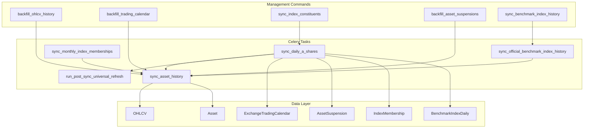
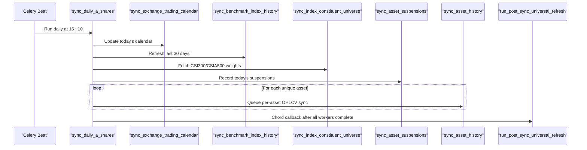
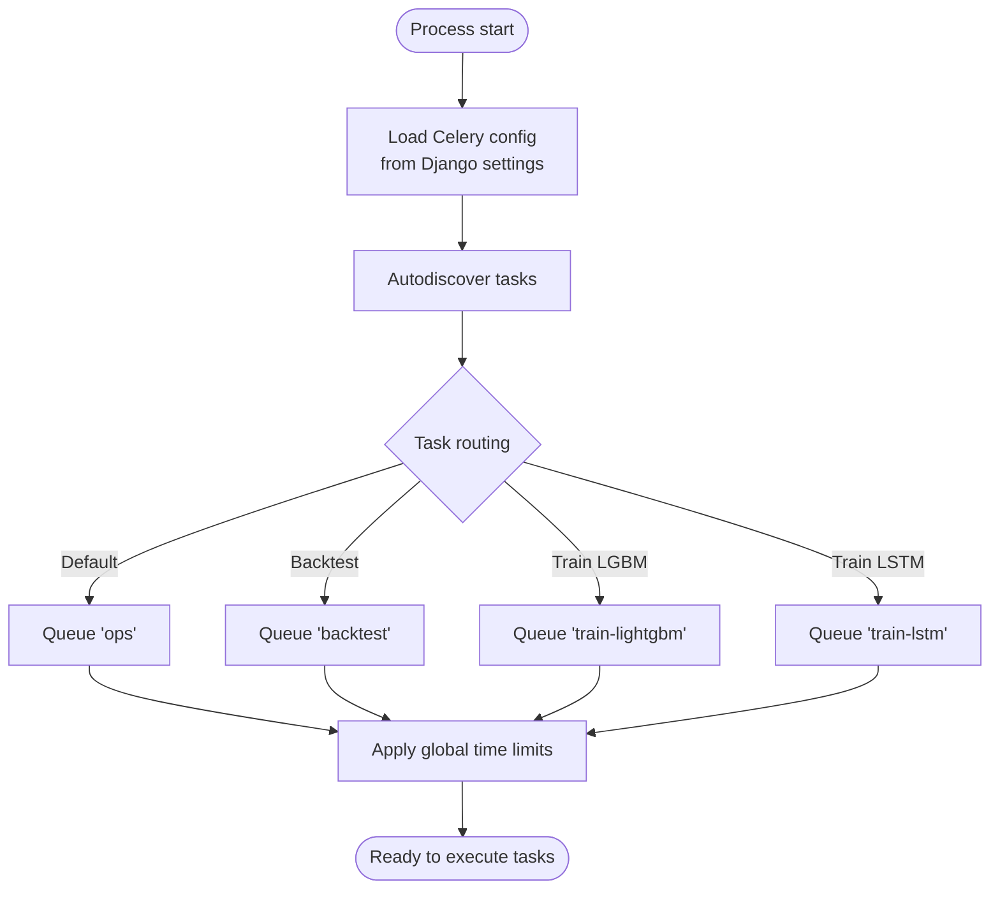
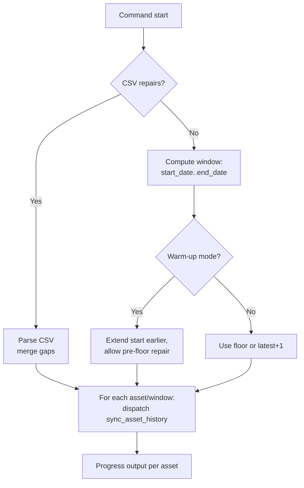
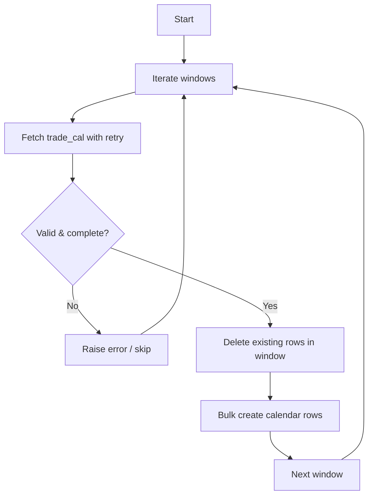
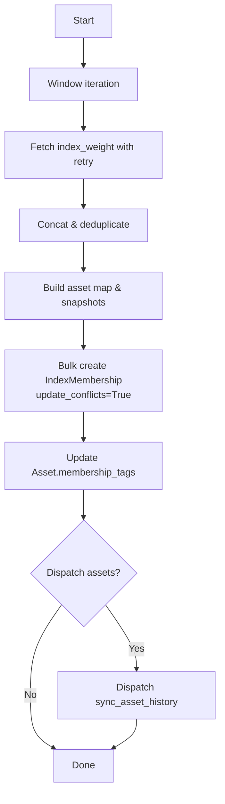
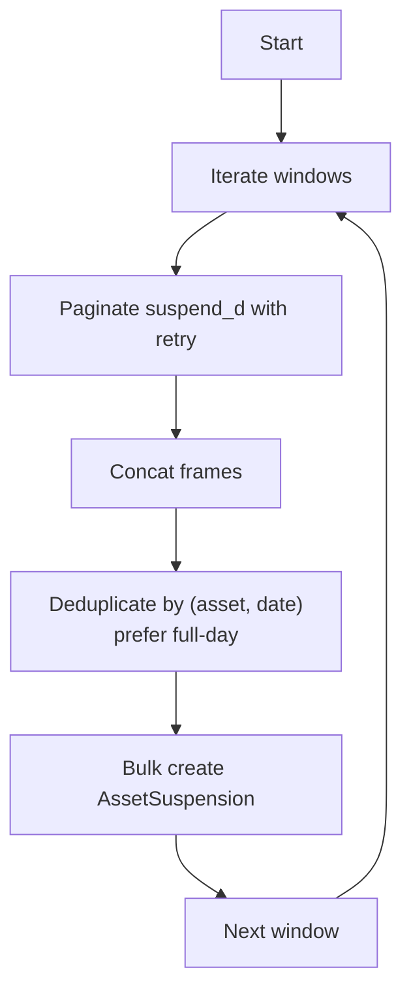
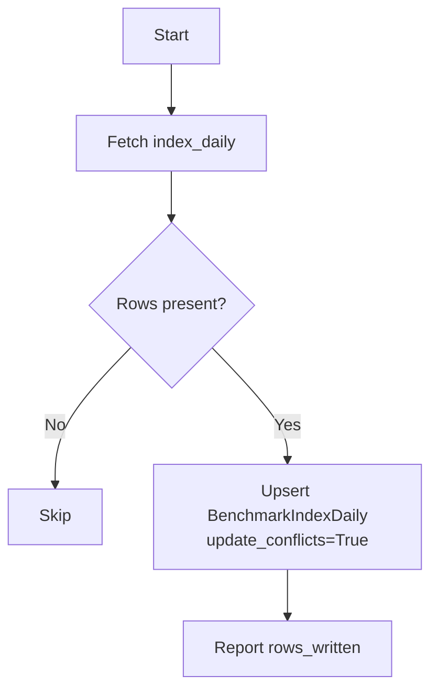
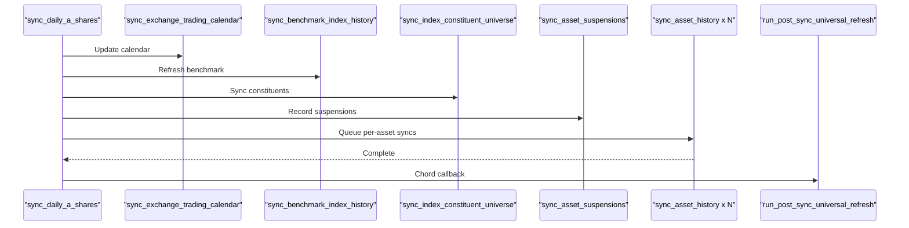
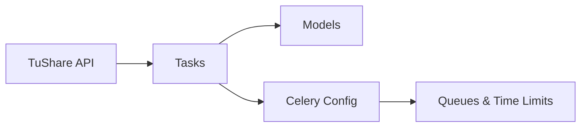

# Data Ingestion Pipeline

<cite>
**Referenced Files in This Document**
- [tasks.py](file://apps/markets/tasks.py)
- [models.py](file://apps/markets/models.py)
- [backfill_ohlcv_history.py](file://apps/markets/management/commands/backfill_ohlcv_history.py)
- [backfill_trading_calendar.py](file://apps/markets/management/commands/backfill_trading_calendar.py)
- [sync_index_constituents.py](file://apps/markets/management/commands/sync_index_constituents.py)
- [backfill_asset_suspensions.py](file://apps/markets/management/commands/backfill_asset_suspensions.py)
- [sync_benchmark_index_history.py](file://apps/markets/management/commands/sync_benchmark_index_history.py)
- [celery.py](file://config/celery.py)
- [base.py](file://config/settings/base.py)
- [celery.md](file://docs/reference/celery.md)
</cite>

## Table of Contents
1. [Introduction](#introduction)
2. [Project Structure](#project-structure)
3. [Core Components](#core-components)
4. [Architecture Overview](#architecture-overview)
5. [Detailed Component Analysis](#detailed-component-analysis)
6. [Dependency Analysis](#dependency-analysis)
7. [Performance Considerations](#performance-considerations)
8. [Troubleshooting Guide](#troubleshooting-guide)
9. [Conclusion](#conclusion)

## Introduction
This document explains the Markets application’s data ingestion pipeline that synchronizes Chinese A-share market data from TuShare into the system. It covers asynchronous processing with Celery, backfill processes for OHLCV historical data, trading calendar updates, index constituent synchronization, management commands for ingestion, error handling and retries, progress tracking, data validation and quality checks, conflict resolution strategies, performance optimizations, and monitoring/logging approaches.

## Project Structure
The ingestion pipeline is implemented as a combination of:
- Management commands to orchestrate backfills and syncs
- Celery tasks to perform asynchronous data fetching and persistence
- Django models to persist assets, calendars, suspensions, index memberships, benchmark series, and OHLCV records

**Diagram sources**
- [tasks.py:891-1021](file://apps/markets/tasks.py#L891-L1021)
- [tasks.py:1043-1122](file://apps/markets/tasks.py#L1043-L1122)
- [tasks.py:1125-1155](file://apps/markets/tasks.py#L1125-L1155)
- [tasks.py:1158-1164](file://apps/markets/tasks.py#L1158-L1164)
- [models.py:19-62](file://apps/markets/models.py#L19-L62)
- [models.py:65-84](file://apps/markets/models.py#L65-L84)
- [models.py:87-114](file://apps/markets/models.py#L87-L114)
- [models.py:117-144](file://apps/markets/models.py#L117-L144)
- [models.py:147-170](file://apps/markets/models.py#L147-L170)
- [models.py:201-225](file://apps/markets/models.py#L201-L225)

**Section sources**
- [tasks.py:891-1166](file://apps/markets/tasks.py#L891-L1166)
- [models.py:1-226](file://apps/markets/models.py#L1-L226)

## Core Components
- Celery configuration and queues:
  - Celery app initialization and auto-discovery of tasks
  - Default queue topology and time limits
- Market data tasks:
  - Daily dispatcher to synchronize calendar, benchmarks, constituents, suspensions, and per-asset OHLCV
  - Per-asset OHLCV sync task with repair windows and floor controls
  - Monthly membership refresh and official benchmark history sync
- Management commands:
  - Backfill OHLCV history (with CSV repairs, warm-up extensions, effective-universe entry warm-up)
  - Backfill trading calendar
  - Sync index constituents
  - Backfill asset suspensions
  - Sync benchmark index history

**Section sources**
- [celery.py:1-17](file://config/celery.py#L1-L17)
- [base.py:174-204](file://config/settings/base.py#L174-L204)
- [celery.md:13-48](file://docs/reference/celery.md#L13-L48)
- [tasks.py:266-352](file://apps/markets/tasks.py#L266-L352)
- [tasks.py:355-488](file://apps/markets/tasks.py#L355-L488)
- [tasks.py:491-574](file://apps/markets/tasks.py#L491-L574)
- [tasks.py:649-888](file://apps/markets/tasks.py#L649-L888)
- [tasks.py:891-1166](file://apps/markets/tasks.py#L891-L1166)
- [backfill_ohlcv_history.py:25-387](file://apps/markets/management/commands/backfill_ohlcv_history.py#L25-L387)
- [backfill_trading_calendar.py:9-32](file://apps/markets/management/commands/backfill_trading_calendar.py#L9-L32)
- [sync_index_constituents.py:9-76](file://apps/markets/management/commands/sync_index_constituents.py#L9-L76)
- [backfill_asset_suspensions.py:11-43](file://apps/markets/management/commands/backfill_asset_suspensions.py#L11-L43)
- [sync_benchmark_index_history.py:6-44](file://apps/markets/management/commands/sync_benchmark_index_history.py#L6-L44)

## Architecture Overview
The daily ingestion flow is orchestrated by a scheduled Celery task that:
- Updates the exchange trading calendar for today
- Refreshes official benchmark index history
- Synchronizes CSI 300 and CSI A500 constituents and their historical weights
- Records asset suspension days
- Dispatches per-asset OHLCV sync tasks for current union constituents and new members
- Queues a post-sync universal refresh to compute cross-asset metrics

**Diagram sources**
- [tasks.py:1043-1122](file://apps/markets/tasks.py#L1043-L1122)
- [tasks.py:266-352](file://apps/markets/tasks.py#L266-L352)
- [tasks.py:491-574](file://apps/markets/tasks.py#L491-L574)
- [tasks.py:649-888](file://apps/markets/tasks.py#L649-L888)
- [tasks.py:891-1021](file://apps/markets/tasks.py#L891-L1021)
- [tasks.py:1024-1040](file://apps/markets/tasks.py#L1024-L1040)

## Detailed Component Analysis

### Celery Background Task Architecture
- Celery app setup and autodiscovery ensure tasks are registered across apps
- Default queue is `ops`; dedicated queues exist for backtests and model training
- Global soft/hard time limits protect workers; specific tasks can override
- Beat schedule triggers daily and monthly sync tasks

**Diagram sources**
- [celery.py:1-17](file://config/celery.py#L1-L17)
- [base.py:174-204](file://config/settings/base.py#L174-L204)
- [celery.md:13-48](file://docs/reference/celery.md#L13-L48)

**Section sources**
- [celery.py:1-17](file://config/celery.py#L1-L17)
- [base.py:174-204](file://config/settings/base.py#L174-L204)
- [celery.md:13-48](file://docs/reference/celery.md#L13-L48)

### OHLCV Historical Data Backfill
- Entry point: `backfill_ohlcv_history` command
- Supports:
  - Full range backfill from the configured historical floor
  - Targeted symbol filtering and asset limits
  - CSV-driven gap repairs with merged contiguous windows
  - Technical indicator warm-up extension allowing pre-floor repair within bounded windows
  - Effective-universe entry warm-up to initialize indicators when assets first enter PIT scope
- Dispatches `sync_asset_history` either inline or queued via Celery

**Diagram sources**
- [backfill_ohlcv_history.py:25-387](file://apps/markets/management/commands/backfill_ohlcv_history.py#L25-L387)
- [tasks.py:891-1021](file://apps/markets/tasks.py#L891-L1021)

**Section sources**
- [backfill_ohlcv_history.py:25-387](file://apps/markets/management/commands/backfill_ohlcv_history.py#L25-L387)
- [tasks.py:891-1021](file://apps/markets/tasks.py#L891-L1021)

### Trading Calendar Backfill
- Command: `backfill_trading_calendar`
- Calls `sync_exchange_trading_calendar` to fetch trade_cal for SSE/SZSE over a date range
- Validates response columns and completeness; enforces expected dates per window
- Deletes existing rows in the window and bulk creates new ones

**Diagram sources**
- [backfill_trading_calendar.py:9-32](file://apps/markets/management/commands/backfill_trading_calendar.py#L9-L32)
- [tasks.py:266-352](file://apps/markets/tasks.py#L266-L352)

**Section sources**
- [backfill_trading_calendar.py:9-32](file://apps/markets/management/commands/backfill_trading_calendar.py#L9-L32)
- [tasks.py:266-352](file://apps/markets/tasks.py#L266-L352)

### Index Constituent Synchronization
- Command: `sync_index_constituents`
- Fetches index_weight snapshots for CSI 300 and CSI A500 in windows
- Persists IndexMembership history and updates Asset membership tags
- Optionally dispatches OHLCV syncs for changed or all constituents
- Tracks latest trade dates and overlap counts

**Diagram sources**
- [sync_index_constituents.py:9-76](file://apps/markets/management/commands/sync_index_constituents.py#L9-L76)
- [tasks.py:649-888](file://apps/markets/tasks.py#L649-L888)

**Section sources**
- [sync_index_constituents.py:9-76](file://apps/markets/management/commands/sync_index_constituents.py#L9-L76)
- [tasks.py:649-888](file://apps/markets/tasks.py#L649-L888)

### Asset Suspension Backfill
- Command: `backfill_asset_suspensions`
- Fetches suspend_d for selected assets or all assets
- Deduplicates and merges timing information; marks full-day suspensions
- Bulk persists AssetSuspension rows

**Diagram sources**
- [backfill_asset_suspensions.py:11-43](file://apps/markets/management/commands/backfill_asset_suspensions.py#L11-L43)
- [tasks.py:355-488](file://apps/markets/tasks.py#L355-L488)

**Section sources**
- [backfill_asset_suspensions.py:11-43](file://apps/markets/management/commands/backfill_asset_suspensions.py#L11-L43)
- [tasks.py:355-488](file://apps/markets/tasks.py#L355-L488)

### Official Benchmark Index History
- Command: `sync_benchmark_index_history`
- Fetches index_daily for configured indices and upserts BenchmarkIndexDaily
- Uses update conflicts to reconcile name and price fields

**Diagram sources**
- [sync_benchmark_index_history.py:6-44](file://apps/markets/management/commands/sync_benchmark_index_history.py#L6-L44)
- [tasks.py:491-574](file://apps/markets/tasks.py#L491-L574)

**Section sources**
- [sync_benchmark_index_history.py:6-44](file://apps/markets/management/commands/sync_benchmark_index_history.py#L6-L44)
- [tasks.py:491-574](file://apps/markets/tasks.py#L491-L574)

### Daily Dispatcher and Post-Sync Refresh
- `sync_daily_a_shares` orchestrates calendar, benchmark, constituents, suspensions, and per-asset OHLCV syncs
- Uses Celery chord to run `run_post_sync_universal_refresh` after all per-asset tasks complete
- `run_post_sync_universal_refresh` triggers PIT benchmark refresh, capital flow snapshots, factor scores, technical indicators, and signals

**Diagram sources**
- [tasks.py:1043-1122](file://apps/markets/tasks.py#L1043-L1122)
- [tasks.py:1024-1040](file://apps/markets/tasks.py#L1024-L1040)

**Section sources**
- [tasks.py:1043-1122](file://apps/markets/tasks.py#L1043-L1122)
- [tasks.py:1024-1040](file://apps/markets/tasks.py#L1024-L1040)

## Dependency Analysis
- External dependency: TuShare API accessed via `ts.pro_api` and endpoints like `trade_cal`, `suspend_d`, `index_daily`, `index_weight`, `pro_bar`
- Internal dependencies:
  - Models: Asset, ExchangeTradingCalendar, AssetSuspension, IndexMembership, BenchmarkIndexDaily, OHLCV
  - Utilities: date parsing, safe numeric conversion, window iteration, retry wrapper
- Celery integration:
  - Tasks use shared_task decorator
  - Chord used to coordinate fan-out/fan-in
  - Beat schedules defined in generated reference

**Diagram sources**
- [tasks.py:1-54](file://apps/markets/tasks.py#L1-L54)
- [tasks.py:266-352](file://apps/markets/tasks.py#L266-L352)
- [tasks.py:355-488](file://apps/markets/tasks.py#L355-L488)
- [tasks.py:491-574](file://apps/markets/tasks.py#L491-L574)
- [tasks.py:649-888](file://apps/markets/tasks.py#L649-L888)
- [tasks.py:891-1166](file://apps/markets/tasks.py#L891-L1166)
- [base.py:174-204](file://config/settings/base.py#L174-L204)

**Section sources**
- [tasks.py:1-54](file://apps/markets/tasks.py#L1-L54)
- [base.py:174-204](file://config/settings/base.py#L174-L204)

## Performance Considerations
- Windowing and batching:
  - Date ranges split into fixed-size windows to respect provider caps and reduce memory pressure
  - Bulk operations with batch_size for database writes
- Conflict resolution:
  - Upserts with update_conflicts for index memberships and benchmark series
  - ignore_conflicts for OHLCV inserts to avoid duplicates
- Rate limiting and retries:
  - Retry wrapper handles provider rate limits with exponential-like sleep and max attempts
  - Small request sleeps between calls where appropriate
- Filtering and scoping:
  - Only process active assets unless explicitly targeting delisted
  - Limit assets and symbols to narrow scope during backfills
- Warm-up windows:
  - Extend OHLCV repair windows backward to satisfy indicator warm-up requirements without unnecessary full-range re-runs

[No sources needed since this section provides general guidance]

## Troubleshooting Guide
- Missing or invalid TuShare token:
  - Several functions raise errors if TUSHARE_TOKEN is not configured
- Provider rate limits:
  - The retry helper logs warnings and retries on rate limit messages; adjust sleep and max retries if necessary
- Incomplete calendar responses:
  - Validation ensures required columns and expected dates; missing dates cause an error to prevent partial replacements
- No data returned:
  - OHLCV sync returns early when no data is found; verify date ranges and listing status
- Progress and diagnostics:
  - Commands print progress per asset/window and summary metrics
  - Use management commands with explicit date ranges and symbol filters to isolate issues
- Monitoring and logging:
  - Celery worker logs capture task execution and exceptions
  - Beat schedule entries provide operational visibility into scheduled runs
  - Generated Celery reference documents queues, time limits, and scheduled tasks

**Section sources**
- [tasks.py:266-352](file://apps/markets/tasks.py#L266-L352)
- [tasks.py:355-488](file://apps/markets/tasks.py#L355-L488)
- [tasks.py:891-1021](file://apps/markets/tasks.py#L891-L1021)
- [backfill_ohlcv_history.py:25-387](file://apps/markets/management/commands/backfill_ohlcv_history.py#L25-L387)
- [celery.md:13-48](file://docs/reference/celery.md#L13-L48)

## Conclusion
The Markets ingestion pipeline combines robust management commands with Celery-backed tasks to keep market data fresh and consistent. It emphasizes safe, idempotent writes, provider resilience, and targeted backfills. By leveraging windowing, bulk operations, conflict resolution, and warm-up-aware repair windows, it balances accuracy with performance. Operational visibility is provided through structured command outputs, Celery logs, and generated references for scheduling and routing.