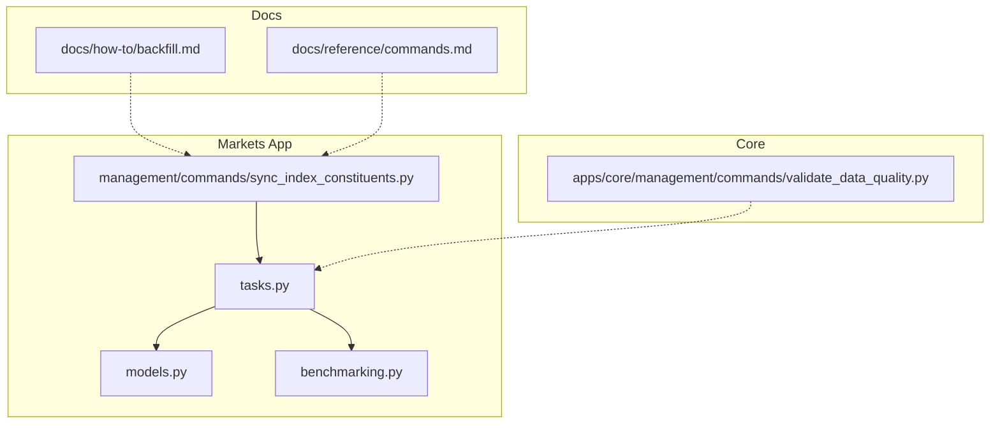
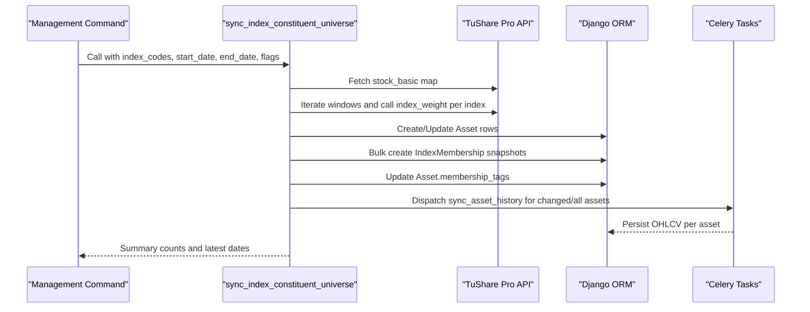
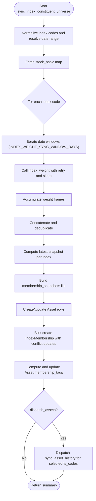
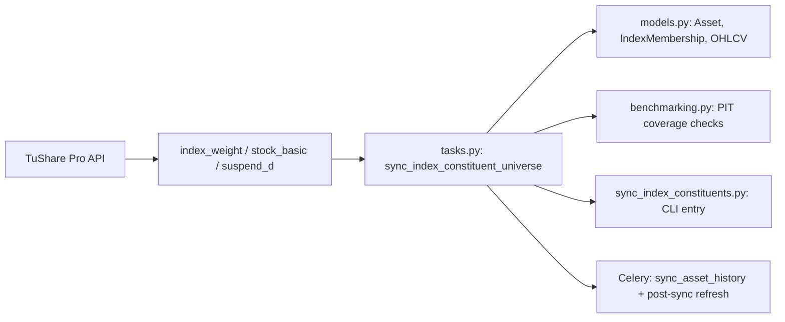

# Index Constituent Synchronization

<cite>
**Referenced Files in This Document**
- [tasks.py](file://apps/markets/tasks.py)
- [models.py](file://apps/markets/models.py)
- [benchmarking.py](file://apps/markets/benchmarking.py)
- [sync_index_constituents.py](file://apps/markets/management/commands/sync_index_constituents.py)
- [backfill.md](file://docs/how-to/backfill.md)
- [commands.md](file://docs/reference/commands.md)
- [validate_data_quality.py](file://apps/core/management/commands/validate_data_quality.py)
- [tests.py](file://apps/markets/tests.py)
</cite>

## Table of Contents
1. [Introduction](#introduction)
2. [Project Structure](#project-structure)
3. [Core Components](#core-components)
4. [Architecture Overview](#architecture-overview)
5. [Detailed Component Analysis](#detailed-component-analysis)
6. [Dependency Analysis](#dependency-analysis)
7. [Performance Considerations](#performance-considerations)
8. [Troubleshooting Guide](#troubleshooting-guide)
9. [Conclusion](#conclusion)

## Introduction
This document explains how the system synchronizes CSI 300 and CSI A500 index constituents to maintain accurate point-in-time membership data, drives asset creation and updates, assigns membership tags, persists historical membership snapshots, and dispatches OHLCV backfills when new or changed constituents are detected. It also covers data quality checks, duplicate handling, and performance considerations for large-scale rebalancing events.

## Project Structure
The synchronization logic is implemented primarily in the markets app:
- Task orchestration and data fetching live in tasks.py.
- Data models for assets, memberships, benchmarks, and OHLCV live in models.py.
- Point-in-time benchmark construction and coverage validation live in benchmarking.py.
- The management command exposes a user-facing interface in sync_index_constituents.py.
- Documentation and usage guidance live in docs/how-to/backfill.md and docs/reference/commands.md.
- Quality reporting utilities live in apps/core/management/commands/validate_data_quality.py.

**Diagram sources**
- [tasks.py:649-888](file://apps/markets/tasks.py#L649-L888)
- [models.py:19-144](file://apps/markets/models.py#L19-L144)
- [benchmarking.py:38-146](file://apps/markets/benchmarking.py#L38-L146)
- [sync_index_constituents.py:46-76](file://apps/markets/management/commands/sync_index_constituents.py#L46-L76)
- [backfill.md:77-95](file://docs/how-to/backfill.md#L77-L95)
- [commands.md:422-444](file://docs/reference/commands.md#L422-L444)
- [validate_data_quality.py:116-127](file://apps/core/management/commands/validate_data_quality.py#L116-L127)

**Section sources**
- [tasks.py:26-53](file://apps/markets/tasks.py#L26-L53)
- [models.py:19-144](file://apps/markets/models.py#L19-L144)
- [benchmarking.py:38-146](file://apps/markets/benchmarking.py#L38-L146)
- [sync_index_constituents.py:46-76](file://apps/markets/management/commands/sync_index_constituents.py#L46-L76)
- [backfill.md:77-95](file://docs/how-to/backfill.md#L77-L95)
- [commands.md:422-444](file://docs/reference/commands.md#L422-L444)
- [validate_data_quality.py:116-127](file://apps/core/management/commands/validate_data_quality.py#L116-L127)

## Core Components
- sync_index_constituent_universe: Orchestrates fetching index weights from TuShare, building point-in-time membership snapshots, creating/updating assets, persisting IndexMembership rows, updating Asset.membership_tags, and dispatching per-asset OHLCV backfills.
- sync_asset_history: Worker task that fetches and persists OHLCV history for a single asset within a computed window.
- Benchmark and PIT utilities: Build internal union benchmarks and validate required point-in-time membership coverage before downstream analytics run.
- Management command: Exposes sync_index_constituents with options to control dispatch behavior and date windows.

Key responsibilities:
- Maintain point-in-time index composition by persisting daily IndexMembership records with weights.
- Keep current Asset.membership_tags aligned with latest CSI 300/CSI A500 membership.
- Dispatch OHLCV backfills only for relevant assets (changed or all), optionally forcing full-floor backfill.
- Enforce API rate limits and response size constraints via windowing and retries.

**Section sources**
- [tasks.py:649-888](file://apps/markets/tasks.py#L649-L888)
- [tasks.py:891-1021](file://apps/markets/tasks.py#L891-L1021)
- [benchmarking.py:38-146](file://apps/markets/benchmarking.py#L38-L146)
- [sync_index_constituents.py:46-76](file://apps/markets/management/commands/sync_index_constituents.py#L46-L76)

## Architecture Overview
The synchronization pipeline integrates data ingestion, persistence, tagging, and dispatch into a cohesive flow.

**Diagram sources**
- [tasks.py:649-888](file://apps/markets/tasks.py#L649-L888)
- [tasks.py:891-1021](file://apps/markets/tasks.py#L891-L1021)
- [sync_index_constituents.py:46-76](file://apps/markets/management/commands/sync_index_constituents.py#L46-L76)

## Detailed Component Analysis

### sync_index_constituent_universe: Role and Flow
Purpose:
- Ingests CSI 300 and CSI A500 constituent lists and weights over a configurable date range.
- Builds point-in-time membership snapshots and persists them as IndexMembership records.
- Ensures Asset entities exist and are kept up to date with symbol, name, listing status, and market.
- Updates Asset.membership_tags to reflect current CSI 300/CSI A500 membership.
- Dispatches OHLCV backfills for newly added or changed constituents, or for all constituents if requested.

Key behaviors:
- Windowed API calls: Uses INDEX_WEIGHT_SYNC_WINDOW_DAYS to chunk requests to respect provider limits and avoid truncation.
- Deduplication: Drops duplicates on trade_date and con_code; uses bulk_create with update_conflicts to handle re-runs safely.
- Tagging: Computes desired managed tags per asset and updates membership_tags only when needed.
- Dispatch selection: Supports dispatch_changed_assets_only to limit fan-out to changed constituents.

**Diagram sources**
- [tasks.py:649-888](file://apps/markets/tasks.py#L649-L888)

**Section sources**
- [tasks.py:649-888](file://apps/markets/tasks.py#L649-L888)

### Weight-Based Constituent Tracking and API Limit Management
- Windowing strategy: The function iterates over small date windows defined by INDEX_WEIGHT_SYNC_WINDOW_DAYS to keep responses under provider caps and avoid truncating earlier dates.
- Retry and pacing: _call_tushare_with_retry handles rate-limit errors with exponential-like sleeps and a maximum retry count, plus a per-request sleep to throttle traffic.
- Deduplication: After concatenating frames, duplicates on trade_date and con_code are removed to ensure one row per asset per day per index.

Operational implications:
- For large ranges (e.g., month-long backfills), many small windows are queried, increasing total API calls but ensuring completeness.
- The window size balances throughput against provider constraints; adjustments should consider typical daily member counts for CSI 300 and CSI A500.

**Section sources**
- [tasks.py:48-53](file://apps/markets/tasks.py#L48-L53)
- [tasks.py:196-225](file://apps/markets/tasks.py#L196-L225)
- [tasks.py:676-731](file://apps/markets/tasks.py#L676-L731)

### Asset Creation and Update Process
- Asset lookup and creation: Existing assets are looked up by ts_code; missing assets are created using market mapping and stock_basic info.
- Field updates: When fields like symbol, name, list_date, delist_date, or listing_status change, the asset is updated in place.
- Market mapping: Markets SSE/SZSE/BSE are ensured to exist prior to asset operations.

Data integrity:
- Market suffixes are mapped to exchange codes to determine correct market assignment.
- Listing status normalization ensures consistent ACTIVE/DELISTED values.

**Section sources**
- [tasks.py:160-163](file://apps/markets/tasks.py#L160-L163)
- [tasks.py:228-263](file://apps/markets/tasks.py#L228-L263)
- [tasks.py:748-796](file://apps/markets/tasks.py#L748-L796)

### Tag Assignment for Index Membership
- Managed tags: Each index has a tag (CSI300, CSIA500). The function computes desired tags per asset based on latest snapshots.
- Current tag maintenance: Only managed tags are considered for changes; non-managed tags are preserved.
- Change detection: Tracks changed_current_ts_codes to enable selective dispatch for changed members only.

Outcome:
- Asset.membership_tags reflects current CSI 300/CSI A500 membership at the end of the sync window.
- Overlap counting identifies assets present in both indices.

**Section sources**
- [tasks.py:26-33](file://apps/markets/tasks.py#L26-L33)
- [tasks.py:838-871](file://apps/markets/tasks.py#L838-L871)

### Historical Membership Snapshot Generation
- Snapshot construction: For each weight row, an IndexMembership record is built with asset, index_code, index_name, trade_date, weight, and source.
- Persistence: Bulk create with update_conflicts ensures idempotent runs; conflicts update index_name, weight, and source while preserving uniqueness on (asset, index_code, trade_date).
- Coverage: Latest snapshot per index is used to compute current constituent counts and overlap metrics.

Quality controls:
- Invalid or missing trade_date entries are skipped.
- Market filtering excludes unsupported suffixes.

**Section sources**
- [models.py:117-144](file://apps/markets/models.py#L117-L144)
- [tasks.py:717-731](file://apps/markets/tasks.py#L717-L731)
- [tasks.py:800-836](file://apps/markets/tasks.py#L800-L836)

### Dispatch Mechanism for OHLCV Backfills
- Selection: If dispatch_assets is enabled, the function dispatches sync_asset_history for either changed constituents or all constituents depending on dispatch_changed_assets_only.
- Warm-up support: Additional signatures are built to extend repair windows for technical indicator warm-ups for new constituents.
- Post-sync refresh: A chord schedules post-sync universal metric refresh after all fan-out tasks complete.

Operational modes:
- Daily dispatcher: Runs calendar, benchmark history, constituent sync without dispatch, then queues unique OHLCV tasks and post-sync refresh.
- Monthly dispatcher: Refreshes memberships over a lookback window and dispatches only changed assets.

**Section sources**
- [tasks.py:577-646](file://apps/markets/tasks.py#L577-L646)
- [tasks.py:1024-1122](file://apps/markets/tasks.py#L1024-L1122)
- [tasks.py:1125-1155](file://apps/markets/tasks.py#L1125-L1155)

### Data Quality Checks and Duplicate Handling
- Duplicate prevention:
  - IndexMembership: Unique constraint on (asset, index_code, trade_date); bulk_create with update_conflicts avoids duplicates on re-runs.
  - Suspension data: Deduplicates by (asset, trade_date) and merges timing information where applicable.
- Validation:
  - Point-in-time membership coverage is enforced before downstream analytics; missing coverage raises a specific error.
  - Data quality reports identify gaps in index membership history, benchmark series, and OHLCV continuity.

Error handling:
- Rate limiting: Provider rate limits trigger retries with configured sleep intervals.
- Missing data: Early returns when no constituents are found; graceful handling of empty responses.

**Section sources**
- [tasks.py:196-217](file://apps/markets/tasks.py#L196-L217)
- [tasks.py:420-479](file://apps/markets/tasks.py#L420-L479)
- [benchmarking.py:38-146](file://apps/markets/benchmarking.py#L38-L146)
- [validate_data_quality.py:116-127](file://apps/core/management/commands/validate_data_quality.py#L116-L127)

### Performance Considerations for Large-Scale Rebalancing
- Windowing: Small windows reduce payload sizes and mitigate provider caps; however, they increase request counts. Tune INDEX_WEIGHT_SYNC_WINDOW_DAYS based on observed daily member counts.
- Batch writes: Bulk creates with batch_size=2000 minimize database round-trips.
- Selective dispatch: Use dispatch_changed_assets_only to limit fan-out during frequent rebalances.
- Chord-based fan-out: Queues per-asset tasks and triggers post-sync refresh only after completion, avoiding premature metric computation.
- Idempotency: Conflict updates and ignore_conflicts patterns make repeated runs safe.

[No sources needed since this section provides general guidance]

## Dependency Analysis
The synchronization process depends on several components and external services:

**Diagram sources**
- [tasks.py:649-888](file://apps/markets/tasks.py#L649-L888)
- [models.py:19-144](file://apps/markets/models.py#L19-L144)
- [benchmarking.py:38-146](file://apps/markets/benchmarking.py#L38-L146)
- [sync_index_constituents.py:46-76](file://apps/markets/management/commands/sync_index_constituents.py#L46-L76)

**Section sources**
- [tasks.py:649-888](file://apps/markets/tasks.py#L649-L888)
- [models.py:19-144](file://apps/markets/models.py#L19-L144)
- [benchmarking.py:38-146](file://apps/markets/benchmarking.py#L38-L146)
- [sync_index_constituents.py:46-76](file://apps/markets/management/commands/sync_index_constituents.py#L46-L76)

## Performance Considerations
- Request throttling: Per-request sleep and retry logic protect against rate limits and transient failures.
- Efficient batching: Bulk operations with appropriate batch sizes reduce overhead.
- Targeted dispatch: Filtering to changed assets reduces unnecessary work during frequent rebalances.
- Warm-up windows: Extending repair windows for new constituents ensures downstream indicators initialize correctly without excessive backfills.

[No sources needed since this section provides general guidance]

## Troubleshooting Guide
Common issues and resolutions:
- Missing TUSHARE_TOKEN: Ensure configuration is set before running sync tasks.
- No constituents returned: Verify index codes and date ranges; check provider availability and logs.
- Missing point-in-time membership coverage: Run sync_index_constituents to backfill IndexMembership before executing model data or analytics commands.
- Data quality gaps: Use validate_data_quality to identify gaps in index membership history, benchmark series, and OHLCV continuity; address upstream fetch failures or suspension-covered gaps appropriately.
- Duplicate or stale tags: Re-run sync_index_constituents to refresh membership_tags; use dispatch_changed_assets_only to limit impact.

Operational tips:
- Use --skip-sync-dispatch to persist membership/tags without dispatching backfills when you want to control chunking explicitly.
- For large backfills, prefer chunked runs and checkpointing where available.

**Section sources**
- [tasks.py:663-668](file://apps/markets/tasks.py#L663-L668)
- [tasks.py:1063-1071](file://apps/markets/tasks.py#L1063-L1071)
- [benchmarking.py:133-146](file://apps/markets/benchmarking.py#L133-L146)
- [validate_data_quality.py:116-127](file://apps/core/management/commands/validate_data_quality.py#L116-L127)
- [backfill.md:77-95](file://docs/how-to/backfill.md#L77-L95)

## Conclusion
The index constituent synchronization system maintains accurate point-in-time CSI 300 and CSI A500 membership through robust data ingestion, deduplication, and persistence. It keeps current membership tags synchronized, generates historical membership snapshots with weights, and intelligently dispatches OHLCV backfills for new or changed constituents. With windowed API calls, retries, and selective dispatch, it scales to large rebalancing events while preserving data quality and operational efficiency.

[No sources needed since this section summarizes without analyzing specific files]