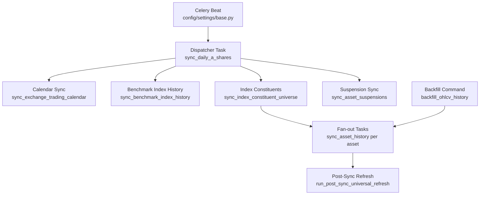
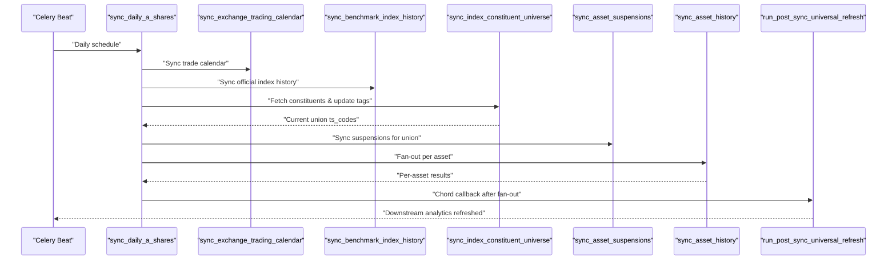
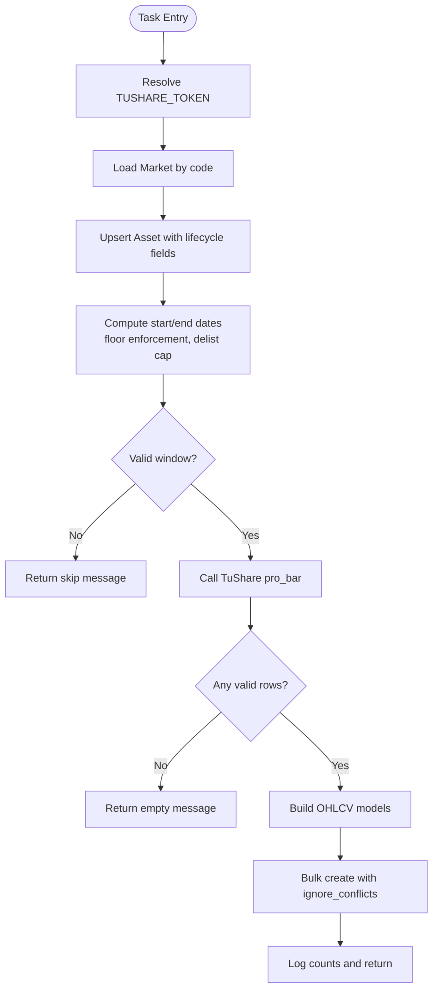
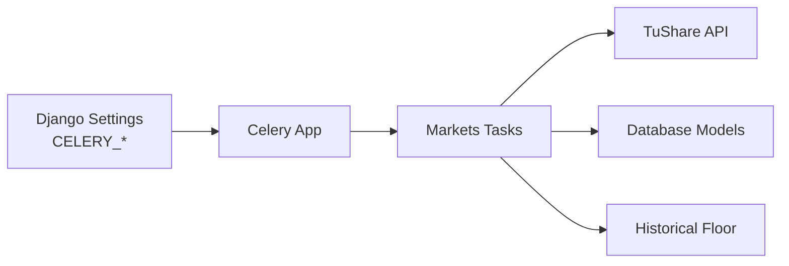

# OHLCV Data Synchronization

<cite>
**Referenced Files in This Document**
- [tasks.py](file://apps/markets/tasks.py)
- [models.py](file://apps/markets/models.py)
- [backfill_ohlcv_history.py](file://apps/markets/management/commands/backfill_ohlcv_history.py)
- [celery.py](file://config/celery.py)
- [base.py](file://config/settings/base.py)
- [date_floor.py](file://apps/core/date_floor.py)
- [metrics.md](file://docs/reference/metrics.md)
- [runbook-sync-failure.md](file://docs/how-to/runbook-sync-failure.md)
</cite>

## Table of Contents
1. [Introduction](#introduction)
2. [Project Structure](#project-structure)
3. [Core Components](#core-components)
4. [Architecture Overview](#architecture-overview)
5. [Detailed Component Analysis](#detailed-component-analysis)
6. [Dependency Analysis](#dependency-analysis)
7. [Performance Considerations](#performance-considerations)
8. [Troubleshooting Guide](#troubleshooting-guide)
9. [Conclusion](#conclusion)

## Introduction
This document explains the end-to-end OHLCV (Open, High, Low, Close, Volume) data synchronization pipeline that ingests daily market data from TuShare into the application database using Celery for asynchronous processing. It covers:
- Background task architecture and scheduling via Celery Beat
- Backfill process for historical price data with date range handling, chunked processing, and error recovery
- The sync_asset_history task implementation including asset lifecycle management, suspension handling, and data validation
- Performance optimizations such as batch operations, rate limiting, and windowing
- Monitoring and logging strategies to track progress and identify data quality issues

## Project Structure
The OHLCV synchronization pipeline spans several modules:
- Task orchestration and worker logic live under apps/markets/tasks.py
- Data models are defined in apps/markets/models.py
- Historical backfill is exposed as a Django management command in apps/markets/management/commands/backfill_ohlcv_history.py
- Celery configuration and scheduled tasks are in config/celery.py and config/settings/base.py
- Date floor enforcement is provided by apps/core/date_floor.py
- Coverage metrics and runbooks provide operational visibility

**Diagram sources**
- [base.py:218-255](file://config/settings/base.py#L218-L255)
- [tasks.py:1043-1122](file://apps/markets/tasks.py#L1043-L1122)
- [tasks.py:266-352](file://apps/markets/tasks.py#L266-L352)
- [tasks.py:491-574](file://apps/markets/tasks.py#L491-L574)
- [tasks.py:649-888](file://apps/markets/tasks.py#L649-L888)
- [tasks.py:355-488](file://apps/markets/tasks.py#L355-L488)
- [tasks.py:891-1021](file://apps/markets/tasks.py#L891-L1021)
- [tasks.py:1024-1040](file://apps/markets/tasks.py#L1024-L1040)
- [backfill_ohlcv_history.py:25-387](file://apps/markets/management/commands/backfill_ohlcv_history.py#L25-L387)

**Section sources**
- [base.py:218-255](file://config/settings/base.py#L218-L255)
- [celery.py:1-17](file://config/celery.py#L1-L17)
- [tasks.py:1043-1122](file://apps/markets/tasks.py#L1043-L1122)
- [backfill_ohlcv_history.py:25-387](file://apps/markets/management/commands/backfill_ohlcv_history.py#L25-L387)

## Core Components
- Celery app initialization and autodiscovery
- Scheduled dispatcher task for daily A-share synchronization
- Asset history synchronization task for individual assets
- Exchange trading calendar synchronization
- Benchmark index history synchronization
- Index constituent universe synchronization and tagging
- Suspension day synchronization
- Post-sync universal refresh orchestrating downstream analytics

**Section sources**
- [celery.py:1-17](file://config/celery.py#L1-L17)
- [base.py:200-255](file://config/settings/base.py#L200-L255)
- [tasks.py:266-352](file://apps/markets/tasks.py#L266-L352)
- [tasks.py:491-574](file://apps/markets/tasks.py#L491-L574)
- [tasks.py:649-888](file://apps/markets/tasks.py#L649-L888)
- [tasks.py:355-488](file://apps/markets/tasks.py#L355-L488)
- [tasks.py:891-1021](file://apps/markets/tasks.py#L891-L1021)
- [tasks.py:1024-1040](file://apps/markets/tasks.py#L1024-L1040)

## Architecture Overview
The pipeline uses Celery Beat to schedule daily ingestion at a fixed time. The dispatcher fetches current constituents from TuShare, updates membership tags, synchronizes calendars and benchmark indices, records suspensions, and then fans out per-asset OHLCV sync tasks. After all fan-out tasks complete, a post-sync refresh triggers downstream analytics such as factor scores, technical indicators, and signals.

**Diagram sources**
- [base.py:218-255](file://config/settings/base.py#L218-L255)
- [tasks.py:1043-1122](file://apps/markets/tasks.py#L1043-L1122)
- [tasks.py:266-352](file://apps/markets/tasks.py#L266-L352)
- [tasks.py:491-574](file://apps/markets/tasks.py#L491-L574)
- [tasks.py:649-888](file://apps/markets/tasks.py#L649-L888)
- [tasks.py:355-488](file://apps/markets/tasks.py#L355-L488)
- [tasks.py:891-1021](file://apps/markets/tasks.py#L891-L1021)
- [tasks.py:1024-1040](file://apps/markets/tasks.py#L1024-L1040)

## Detailed Component Analysis

### Celery Configuration and Scheduling
- Celery app is configured to read settings from Django with a CELERY namespace
- Autodiscovery loads tasks from registered Django apps
- Daily schedules include:
  - Daily A-share sync at a fixed hour
  - Monthly index membership refresh
  - Alert rule checks every five minutes
  - Macro data monthly sync
  - News ingestion and sentiment pipeline
  - Prediction generation tasks

**Section sources**
- [celery.py:1-17](file://config/celery.py#L1-L17)
- [base.py:218-255](file://config/settings/base.py#L218-L255)

### Daily Dispatcher: sync_daily_a_shares
- Orchestrates the full daily ingestion workflow
- Steps:
  - Sync exchange trading calendar for today
  - Sync benchmark index history for last 30 days
  - Fetch CSI 300 + CSI A500 constituents and update asset membership tags
  - Sync asset suspensions for the current union of constituents
  - Build signatures for per-asset OHLCV sync tasks
  - Add warm-up signatures for new constituents requiring indicator prefill
  - Use Celery chord to queue post-sync refresh after all fan-out tasks complete
- Returns summary logs including calendar rows, suspension rows, and dispatched task counts

**Section sources**
- [tasks.py:1043-1122](file://apps/markets/tasks.py#L1043-L1122)

### Exchange Trading Calendar Sync: sync_exchange_trading_calendar
- Iterates over requested exchanges and date windows
- Calls TuShare trade_cal with retry and rate limiting
- Validates response columns and completeness of trade dates
- Deletes existing calendar rows within the window and bulk creates new ones
- Tracks latest trade dates per exchange

**Section sources**
- [tasks.py:266-352](file://apps/markets/tasks.py#L266-L352)

### Benchmark Index History Sync: sync_benchmark_index_history
- Fetches official index daily data for specified codes and date range
- Normalizes fields and persists using bulk_create with conflict updates
- Tracks latest trade dates and updated row counts

**Section sources**
- [tasks.py:491-574](file://apps/markets/tasks.py#L491-L574)

### Index Constituent Universe Sync: sync_index_constituent_universe
- Pulls index weights across small windows to avoid provider truncation
- Builds a union of constituents and updates asset metadata (symbol, name, list/delist dates, listing status)
- Persists historical membership snapshots with upsert semantics
- Updates asset membership_tags based on current managed memberships
- Optionally dispatches OHLCV sync tasks for changed or all constituents

**Section sources**
- [tasks.py:649-888](file://apps/markets/tasks.py#L649-L888)

### Suspension Sync: sync_asset_suspensions
- Paginates suspend_d responses and merges duplicate entries
- Deduplicates by asset and trade date, preferring full-day suspensions
- Merges timing information when partial-day suspensions overlap
- Bulk creates suspension rows and tracks full-day counts

**Section sources**
- [tasks.py:355-488](file://apps/markets/tasks.py#L355-L488)

### Per-Asset OHLCV Sync: sync_asset_history
- Resolves asset lifecycle:
  - Creates or updates Asset with market, symbol, name, list/delist dates, and listing status
- Determines sync window:
  - Enforces historical data floor unless explicitly allowed for repair
  - Uses explicit repair_start_date/repair_end_date if provided
  - Otherwise starts from latest persisted OHLCV date plus one day
  - Caps end date at delist_date if applicable
- Ingests OHLCV via TuShare pro_bar with adjusted close
- Validates and converts fields to Decimal/int; skips invalid rows
- Bulk creates OHLCV rows with ignore_conflicts to ensure idempotency
- Logs processed counts and returns completion messages

**Diagram sources**
- [tasks.py:891-1021](file://apps/markets/tasks.py#L891-L1021)
- [date_floor.py:1-14](file://apps/core/date_floor.py#L1-L14)

**Section sources**
- [tasks.py:891-1021](file://apps/markets/tasks.py#L891-L1021)
- [date_floor.py:1-14](file://apps/core/date_floor.py#L1-L14)

### Post-Sync Universal Refresh: run_post_sync_universal_refresh
- Runs after all per-asset sync tasks complete
- Refreshes point-in-time union benchmark, capital flow snapshots, factor scores, technical indicators, and signals
- Aggregates results and returns a summary string

**Section sources**
- [tasks.py:1024-1040](file://apps/markets/tasks.py#L1024-L1040)

### Backfill Command: backfill_ohlcv_history
- Supports multiple modes:
  - Default mode: backfill from HISTORICAL_DATA_FLOOR to end date for active assets
  - CSV-driven repairs: parse continuity gaps and dispatch targeted repairs
  - Effective-universe entry warmup: compute first effective universe dates and backfill indicator warm-up windows
- Options include:
  - --start-date, --end-date
  - --csv-file, --symbols, --limit-assets
  - --queue to enqueue tasks instead of executing inline
  - --technical-indicator-warmup to extend lookback and allow pre-floor repair
  - --effective-universe-entry-warmup to target assets entering PIT validation scope
- Dispatches sync_asset_history with repair windows and lifecycle parameters

**Section sources**
- [backfill_ohlcv_history.py:25-387](file://apps/markets/management/commands/backfill_ohlcv_history.py#L25-L387)

### Data Models
- Asset: identifies securities with market, symbol, ts_code, name, listing_status, list/delist dates, and membership_tags
- ExchangeTradingCalendar: official exchange open/close days
- AssetSuspension: daily suspension records with type and timing
- IndexMembership: historical index membership snapshots with weight
- BenchmarkIndexDaily: official index daily series used for backtests
- PointInTimeBenchmarkDaily: internal union benchmark for backtesting
- OHLCV: daily Open, High, Low, Close, Adjusted Close, Volume, Amount

**Section sources**
- [models.py:1-226](file://apps/markets/models.py#L1-L226)

## Dependency Analysis
- Celery app depends on Django settings and autodiscovers tasks
- Daily scheduler triggers dispatcher which depends on:
  - TuShare API access (trade_cal, index_weight, suspend_d, index_daily, pro_bar)
  - Database models for persistence
  - Date floor utility for enforcing historical boundaries
- sync_asset_history depends on:
  - Asset and OHLCV models
  - TuShare daily bar endpoint
  - Rate limiting and retry helpers for provider stability

**Diagram sources**
- [celery.py:1-17](file://config/celery.py#L1-L17)
- [base.py:200-255](file://config/settings/base.py#L200-L255)
- [tasks.py:196-226](file://apps/markets/tasks.py#L196-L226)
- [date_floor.py:1-14](file://apps/core/date_floor.py#L1-L14)

**Section sources**
- [celery.py:1-17](file://config/celery.py#L1-L17)
- [base.py:200-255](file://config/settings/base.py#L200-L255)
- [tasks.py:196-226](file://apps/markets/tasks.py#L196-L226)
- [date_floor.py:1-14](file://apps/core/date_floor.py#L1-L14)

## Performance Considerations
- Windowed iteration:
  - Trade calendar, index weights, and suspensions are fetched in bounded windows to respect provider limits and reduce memory usage
- Batch writes:
  - bulk_create with large batch sizes reduces database round-trips
  - update_conflicts and unique_fields enable idempotent upserts where supported
- Rate limiting and retries:
  - _call_tushare_with_retry implements exponential-like sleep and max retries for rate limit errors
  - Request-level sleep between calls to avoid throttling
- Idempotent ingestion:
  - ignore_conflicts during OHLCV bulk_create prevents duplicate inserts
- Efficient queries:
  - in_bulk and select_related minimize N+1 queries when building asset maps
- Warm-up optimization:
  - New constituents receive additional warm-up signatures to prefill technical indicators efficiently

[No sources needed since this section provides general guidance]

## Troubleshooting Guide
- Verify daily pipeline health:
  - Check whether OHLCV, indicators, factors, and predictions advanced to expected trading day
  - Use documented commands to export metrics and compare coverage
- Common failure points:
  - Missing TUSHARE_TOKEN will cause early exits in sync functions
  - Provider rate limits trigger retries; persistent failures may require waiting or reducing concurrency
  - Invalid date ranges or missing calendar dates raise errors to prevent inconsistent state
- Operational steps:
  - Re-run backfill for specific assets or date ranges using the management command
  - Use CSV-based continuity gap repairs to target known missing windows
  - Monitor Celery task inventory and time limits to detect stuck or long-running tasks

**Section sources**
- [runbook-sync-failure.md:1-36](file://docs/how-to/runbook-sync-failure.md#L1-L36)
- [tasks.py:196-226](file://apps/markets/tasks.py#L196-L226)
- [tasks.py:266-352](file://apps/markets/tasks.py#L266-L352)
- [backfill_ohlcv_history.py:25-387](file://apps/markets/management/commands/backfill_ohlcv_history.py#L25-L387)

## Conclusion
The OHLCV synchronization pipeline combines robust scheduling, careful provider integration, and resilient data persistence to maintain high-quality daily market data. By leveraging windowed fetching, batch operations, and idempotent writes, it scales across many assets while respecting external rate limits. The backfill command and suspension handling provide flexibility for historical repairs and lifecycle-aware ingestion. Monitoring through metrics and runbooks enables quick identification and resolution of data quality issues.

[No sources needed since this section summarizes without analyzing specific files]