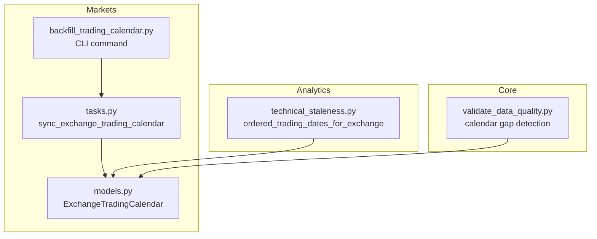
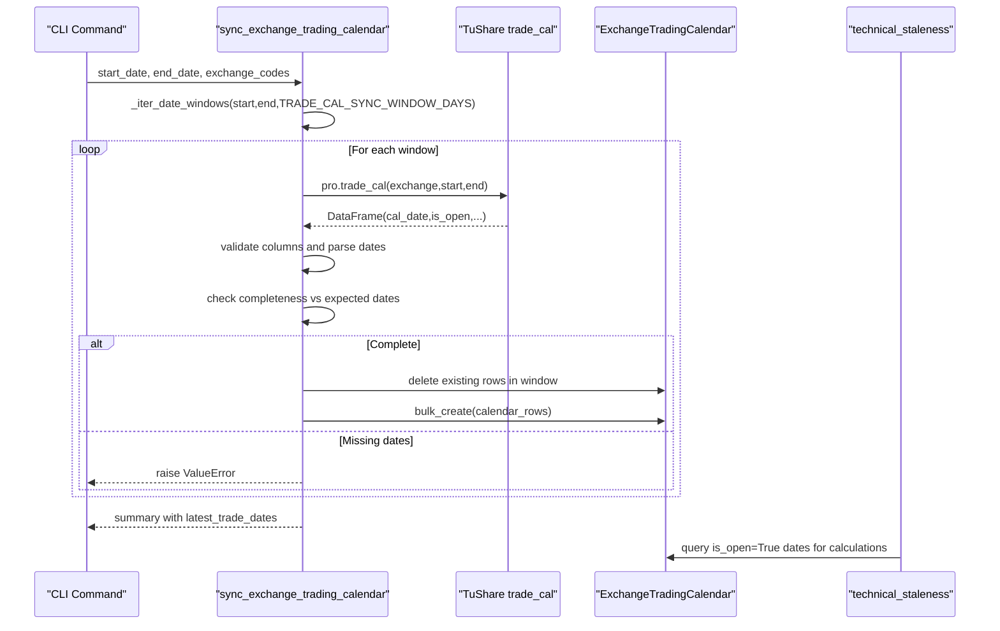
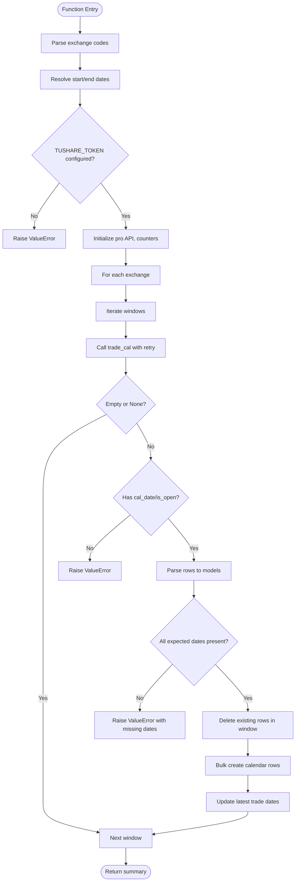
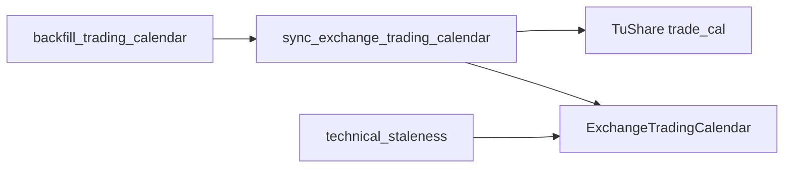

# Trading Calendar Synchronization

<cite>
**Referenced Files in This Document**
- [tasks.py](file://apps/markets/tasks.py)
- [models.py](file://apps/markets/models.py)
- [backfill_trading_calendar.py](file://apps/markets/management/commands/backfill_trading_calendar.py)
- [technical_staleness.py](file://apps/analytics/technical_staleness.py)
- [validate_data_quality.py](file://apps/core/management/commands/validate_data_quality.py)
- [tests.py](file://apps/markets/tests.py)
</cite>

## Table of Contents
1. [Introduction](#introduction)
2. [Project Structure](#project-structure)
3. [Core Components](#core-components)
4. [Architecture Overview](#architecture-overview)
5. [Detailed Component Analysis](#detailed-component-analysis)
6. [Dependency Analysis](#dependency-analysis)
7. [Performance Considerations](#performance-considerations)
8. [Troubleshooting Guide](#troubleshooting-guide)
9. [Conclusion](#conclusion)

## Introduction
This document explains the trading calendar synchronization system that keeps official exchange trading schedules for SSE, SZSE, and BSE up to date. It focuses on how the sync_exchange_trading_calendar function fetches, validates, and persists calendar data using a windowed approach, how it resolves conflicts when updating existing records, and how errors are handled for network issues, API rate limits, and data inconsistencies. It also covers integration points with market data pipelines and how calendar information drives trading day calculations across the platform.

## Project Structure
The trading calendar synchronization is implemented primarily in the markets application:
- The core synchronization logic lives in tasks.py.
- The ExchangeTradingCalendar model defines the persisted schema.
- A management command provides a CLI entry point for backfills.
- Analytics utilities consume the calendar to compute trading dates and staleness checks.
- Data quality validation commands rely on the calendar to detect gaps.

**Diagram sources**
- [tasks.py:266-352](file://apps/markets/tasks.py#L266-L352)
- [models.py:65-84](file://apps/markets/models.py#L65-L84)
- [backfill_trading_calendar.py:9-32](file://apps/markets/management/commands/backfill_trading_calendar.py#L9-L32)
- [technical_staleness.py:80-96](file://apps/analytics/technical_staleness.py#L80-L96)
- [validate_data_quality.py:477-582](file://apps/core/management/commands/validate_data_quality.py#L477-L582)

**Section sources**
- [tasks.py:266-352](file://apps/markets/tasks.py#L266-L352)
- [models.py:65-84](file://apps/markets/models.py#L65-L84)
- [backfill_trading_calendar.py:9-32](file://apps/markets/management/commands/backfill_trading_calendar.py#L9-L32)
- [technical_staleness.py:80-96](file://apps/analytics/technical_staleness.py#L80-L96)
- [validate_data_quality.py:477-582](file://apps/core/management/commands/validate_data_quality.py#L477-L582)

## Core Components
- ExchangeTradingCalendar model: Stores per-exchange trading days and open/close flags. It enforces uniqueness by (exchange_code, trade_date) and indexes key fields for efficient queries.
- sync_exchange_trading_calendar: Orchestrates fetching official calendars from TuShare’s trade_cal, validating completeness, and persisting results.
- Windowing utility _iter_date_windows: Breaks large date ranges into fixed-size windows to handle provider limits and improve reliability.
- Retry wrapper _call_tushare_with_retry: Handles transient network failures and TuShare rate limits with exponential-like retries and sleeps.
- CLI command backfill_trading_calendar: Provides an interface to run backfills over historical ranges for one or more exchanges.

Key behaviors:
- Supports SSE, SZSE, and BSE via normalized exchange codes.
- Uses TRADE_CAL_SYNC_WINDOW_DAYS to chunk requests efficiently.
- Validates that every expected date in each window is present before replacing existing rows.
- Deletes existing rows within the window and bulk-creates new ones to ensure conflict-free updates.
- Tracks latest trade dates per exchange for downstream consumers.

**Section sources**
- [models.py:65-84](file://apps/markets/models.py#L65-L84)
- [tasks.py:36-53](file://apps/markets/tasks.py#L36-L53)
- [tasks.py:196-225](file://apps/markets/tasks.py#L196-L225)
- [tasks.py:266-352](file://apps/markets/tasks.py#L266-L352)
- [backfill_trading_calendar.py:9-32](file://apps/markets/management/commands/backfill_trading_calendar.py#L9-L32)

## Architecture Overview
The synchronization flow integrates external data from TuShare with internal persistence and analytics consumption.

**Diagram sources**
- [tasks.py:266-352](file://apps/markets/tasks.py#L266-L352)
- [technical_staleness.py:80-96](file://apps/analytics/technical_staleness.py#L80-L96)

## Detailed Component Analysis

### sync_exchange_trading_calendar
Responsibilities:
- Normalize exchange codes and resolve date range.
- Iterate windows using TRADE_CAL_SYNC_WINDOW_DAYS.
- Fetch calendar data via TuShare with retry handling.
- Validate response structure and parse dates safely.
- Enforce complete coverage per window; reject partial payloads.
- Replace existing rows within the window atomically by delete then bulk create.
- Track latest open dates per exchange.

Error handling:
- Raises ValueError if TUSHARE_TOKEN is missing.
- Raises ValueError if response lacks required columns.
- Raises ValueError if any expected date is missing in the window.
- Retries on TuShare rate limit errors with configured sleep and max attempts.

Data validation:
- Ensures cal_date and is_open are present.
- Converts is_open to boolean consistently.
- Computes expected set of dates for the window and compares against observed dates.

Conflict resolution:
- Deletes all existing ExchangeTradingCalendar rows for the exchange within the window before inserting new rows, ensuring no duplicates or stale entries remain.

Performance characteristics:
- Window size reduces request payload and simplifies error recovery.
- Bulk operations minimize database round-trips.
- Latest trade date tracking supports downstream freshness checks.

**Diagram sources**
- [tasks.py:266-352](file://apps/markets/tasks.py#L266-L352)
- [tasks.py:196-225](file://apps/markets/tasks.py#L196-L225)

**Section sources**
- [tasks.py:266-352](file://apps/markets/tasks.py#L266-L352)
- [tasks.py:196-225](file://apps/markets/tasks.py#L196-L225)

### ExchangeTradingCalendar Model
Schema highlights:
- Unique constraint on (exchange_code, trade_date).
- Indexed fields for fast lookups by exchange and date.
- Boolean flag is_open indicates whether the exchange was open on that date.
- Source field tracks provenance.

Usage:
- Written by sync_exchange_trading_calendar during backfills and daily syncs.
- Consumed by analytics utilities to derive ordered trading dates and staleness checks.

**Section sources**
- [models.py:65-84](file://apps/markets/models.py#L65-L84)

### CLI Backfill Command
Purpose:
- Exposes a Django management command to backfill official exchange calendars across historical ranges.
- Defaults include the historical data floor and current date, with SSE and SZSE enabled by default.

Behavior:
- Calls sync_exchange_trading_calendar with provided arguments.
- Prints a success summary including exchange codes, window, and rows written.
- Wraps exceptions to surface meaningful errors via CommandError.

**Section sources**
- [backfill_trading_calendar.py:9-32](file://apps/markets/management/commands/backfill_trading_calendar.py#L9-L32)

### Integration with Market Data Pipelines
How calendar data affects calculations:
- Technical indicator staleness and continuity checks use ordered trading dates derived from ExchangeTradingCalendar.
- Functions like ordered_trading_dates_for_exchange query is_open=True dates up to a given end date to build position maps and measure distances between trading days.
- Data quality validation uses the official calendar to identify missing dates and classify gaps as structural or suspicious.

Impact:
- Accurate calendar data ensures correct computation of technical indicators, factor scores, and benchmark comparisons.
- Missing or incorrect calendar entries can cause false staleness warnings or misaligned windows.

**Section sources**
- [technical_staleness.py:80-96](file://apps/analytics/technical_staleness.py#L80-L96)
- [validate_data_quality.py:477-582](file://apps/core/management/commands/validate_data_quality.py#L477-L582)

## Dependency Analysis
The synchronization system depends on:
- External provider: TuShare trade_cal API for official exchange calendars.
- Database: ExchangeTradingCalendar model for persistence.
- Configuration: TUSHARE_TOKEN environment setting.
- Utilities: Date parsing, safe numeric conversion, retry logic, and window iteration.

Coupling and cohesion:
- High cohesion within tasks.py around calendar synchronization.
- Low coupling to other modules except through shared models and configuration.
- Clear separation between fetching, validation, persistence, and consumption layers.

Potential circular dependencies:
- None detected; analytics reads from models without writing back to calendar synchronization.

External integrations:
- TuShare API calls are wrapped with retry logic to handle rate limits and transient failures.

**Diagram sources**
- [tasks.py:266-352](file://apps/markets/tasks.py#L266-L352)
- [technical_staleness.py:80-96](file://apps/analytics/technical_staleness.py#L80-L96)
- [backfill_trading_calendar.py:9-32](file://apps/markets/management/commands/backfill_trading_calendar.py#L9-L32)

**Section sources**
- [tasks.py:266-352](file://apps/markets/tasks.py#L266-L352)
- [technical_staleness.py:80-96](file://apps/analytics/technical_staleness.py#L80-L96)
- [backfill_trading_calendar.py:9-32](file://apps/markets/management/commands/backfill_trading_calendar.py#L9-L32)

## Performance Considerations
- Window size: TRADE_CAL_SYNC_WINDOW_DAYS controls request granularity; smaller windows reduce risk of partial failures and simplify retries.
- Batch writes: Bulk creation with a batch size minimizes database overhead.
- Delete-before-insert: Ensures idempotent updates per window but requires careful range scoping to avoid unintended deletions.
- Rate limiting: Retry wrapper includes sleeps and maximum retries to respect provider constraints.
- Indexing: ExchangeTradingCalendar indexes support efficient queries for trading date sequences used by analytics.

[No sources needed since this section provides general guidance]

## Troubleshooting Guide
Common issues and resolutions:
- Missing TUSHARE_TOKEN: Ensure the environment variable is configured before running backfills or sync tasks.
- Partial calendar payloads: If the provider returns fewer dates than expected for a window, the function raises an error to prevent corrupting existing data. Investigate upstream availability and re-run after resolution.
- API rate limits: The retry wrapper handles rate limit messages with sleeps and retries. If repeated failures occur, narrow the date range or wait for quota reset.
- Network failures: Transient errors are retried; persistent failures should be logged and investigated at the network/provider level.
- Data inconsistencies: Use validate_data_quality to detect missing calendar rows and classify gaps. If gaps are structural (e.g., pre-listing), no action is needed; if suspicious, re-run the owning backfill for that window.

Operational tips:
- Run backfills in manageable windows to isolate failures.
- Monitor latest_trade_dates in summaries to confirm progress.
- Use tests to verify behavior under mocked provider responses.

**Section sources**
- [tasks.py:196-225](file://apps/markets/tasks.py#L196-L225)
- [tasks.py:266-352](file://apps/markets/tasks.py#L266-L352)
- [validate_data_quality.py:477-582](file://apps/core/management/commands/validate_data_quality.py#L477-L582)
- [tests.py:423-531](file://apps/markets/tests.py#L423-L531)

## Conclusion
The trading calendar synchronization system provides a robust, validated, and efficient mechanism to maintain official exchange schedules for SSE, SZSE, and BSE. By using windowed data fetching, strict completeness checks, and atomic replacement of existing records, it ensures data integrity while integrating seamlessly with market data pipelines. Error handling for network issues, rate limits, and data inconsistencies protects against corruption and supports reliable operations. Accurate calendar data underpins trading day calculations across analytics and validation tools, enabling precise indicator computations and high-quality data assessments.