# Markets Application

<cite>
**Referenced Files in This Document**
- [models.py](file://apps/markets/models.py)
- [views.py](file://apps/markets/views.py)
- [serializers.py](file://apps/markets/serializers.py)
- [tasks.py](file://apps/markets/tasks.py)
- [benchmarking.py](file://apps/markets/benchmarking.py)
- [backfill_ohlcv_history.py](file://apps/markets/management/commands/backfill_ohlcv_history.py)
- [sync_index_constituents.py](file://apps/markets/management/commands/sync_index_constituents.py)
- [backfill_asset_list_dates.py](file://apps/markets/management/commands/backfill_asset_list_dates.py)
- [backfill_asset_suspensions.py](file://apps/markets/management/commands/backfill_asset_suspensions.py)
- [sync_benchmark_index_history.py](file://apps/markets/management/commands/sync_benchmark_index_history.py)
- [backfill_trading_calendar.py](file://apps/markets/management/commands/backfill_trading_calendar.py)
- [build_pit_union_benchmark.py](file://apps/markets/management/commands/build_pit_union_benchmark.py)
- [onboard_csi_a500_universe.py](file://apps/markets/management/commands/onboard_csi_a500_universe.py)
</cite>

## Table of Contents
1. [Introduction](#introduction)
2. [Project Structure](#project-structure)
3. [Core Components](#core-components)
4. [Architecture Overview](#architecture-overview)
5. [Detailed Component Analysis](#detailed-component-analysis)
6. [Dependency Analysis](#dependency-analysis)
7. [Performance Considerations](#performance-considerations)
8. [Troubleshooting Guide](#troubleshooting-guide)
9. [Conclusion](#conclusion)
10. [Appendices](#appendices)

## Introduction
The Markets application is the foundational data layer for the FinanceAnalysis platform. It provides canonical asset lifecycle management, OHLCV storage with point-in-time integrity, trading calendar integration, and index membership tracking. It exposes read-only APIs for markets, assets, and OHLCV data, and it orchestrates background tasks and management commands to backfill historical data, maintain benchmark indices, and keep constituent memberships current. The app enforces a strict upstream dependency pattern: it has no internal Django app dependencies beyond core utilities and external data providers, and all other applications consume its models and services as the authoritative source of market reference data and price history.

## Project Structure
The Markets app organizes responsibilities into clear layers:
- Data models define markets, assets, OHLCV, suspensions, calendars, index memberships, and benchmarks.
- Views expose REST endpoints for reading markets, assets, and OHLCV with caching and filtering.
- Tasks implement data ingestion from TuShare, suspension handling, calendar sync, index constituent updates, and benchmark construction.
- Management commands provide operational entry points for backfills and rollouts.
- Benchmarking defines the canonical point-in-time effective universe contract used across the platform.

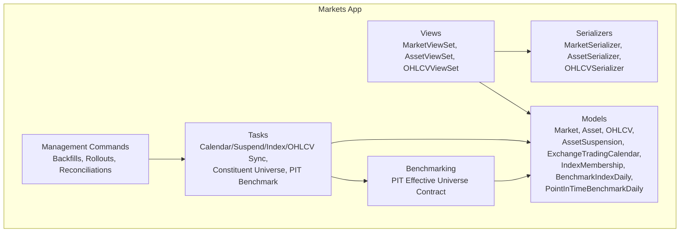

**Diagram sources**
- [models.py:4-226](file://apps/markets/models.py#L4-L226)
- [views.py:16-106](file://apps/markets/views.py#L16-L106)
- [serializers.py:5-50](file://apps/markets/serializers.py#L5-L50)
- [tasks.py:26-800](file://apps/markets/tasks.py#L26-L800)
- [benchmarking.py:1-462](file://apps/markets/benchmarking.py#L1-L462)
- [backfill_ohlcv_history.py:25-387](file://apps/markets/management/commands/backfill_ohlcv_history.py#L25-L387)

**Section sources**
- [models.py:4-226](file://apps/markets/models.py#L4-L226)
- [views.py:16-106](file://apps/markets/views.py#L16-L106)
- [serializers.py:5-50](file://apps/markets/serializers.py#L5-L50)
- [tasks.py:26-800](file://apps/markets/tasks.py#L26-L800)
- [benchmarking.py:1-462](file://apps/markets/benchmarking.py#L1-L462)
- [backfill_ohlcv_history.py:25-387](file://apps/markets/management/commands/backfill_ohlcv_history.py#L25-L387)

## Core Components
- Market: Canonical exchange/market identifiers (e.g., SSE, SZSE, BSE).
- Asset: Stock/fund identity with listing status, list/delist dates, and current index membership tags.
- OHLCV: Daily open/high/low/close/adjusted close/volume/amount per asset with unique (asset, date) constraints.
- AssetSuspension: Daily suspension records including full-day flags and timing metadata.
- ExchangeTradingCalendar: Official exchange trade days and open/close flags.
- IndexMembership: Historical snapshots of index constituents and weights by trade date.
- BenchmarkIndexDaily: Official daily index prices for backtest comparisons.
- PointInTimeBenchmarkDaily: Internal union benchmark computed from PIT membership and fundamentals.

These components form the backbone for downstream analytics, prediction, and backtesting.

**Section sources**
- [models.py:4-226](file://apps/markets/models.py#L4-L226)

## Architecture Overview
The Markets app follows a strict separation between data persistence, API exposure, background processing, and business rules:
- Models persist canonical market and price data.
- Views provide read-only access with caching and filtering.
- Tasks perform robust ingestion from TuShare with retries, windowing, deduplication, and bulk writes.
- Benchmarking enforces the canonical point-in-time effective universe contract that governs which assets are valid at each date.
- Management commands orchestrate backfills, rollouts, and reconciliations.

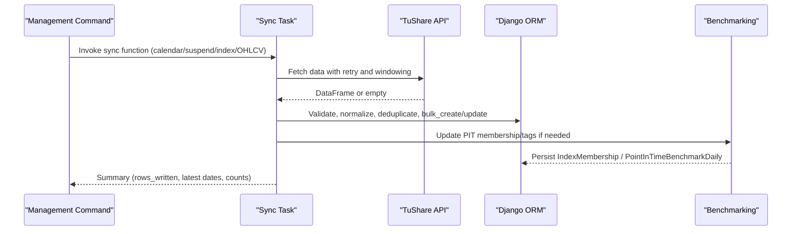

**Diagram sources**
- [tasks.py:266-574](file://apps/markets/tasks.py#L266-L574)
- [benchmarking.py:312-462](file://apps/markets/benchmarking.py#L312-L462)
- [backfill_trading_calendar.py:9-32](file://apps/markets/management/commands/backfill_trading_calendar.py#L9-L32)
- [sync_index_constituents.py:9-76](file://apps/markets/management/commands/sync_index_constituents.py#L9-L76)

## Detailed Component Analysis

### Asset Lifecycle Management
- Listing status transitions are captured via Asset.listing_status and list_date/delist_date sourced from provider data.
- Membership tags on Asset reflect current index memberships derived from latest index_weight snapshots.
- Suspension handling marks trading interruptions and influences continuity checks for OHLCV.

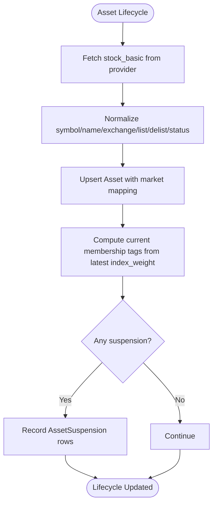

**Diagram sources**
- [tasks.py:236-263](file://apps/markets/tasks.py#L236-L263)
- [tasks.py:649-796](file://apps/markets/tasks.py#L649-L796)
- [models.py:19-63](file://apps/markets/models.py#L19-L63)
- [models.py:87-115](file://apps/markets/models.py#L87-L115)

**Section sources**
- [models.py:19-63](file://apps/markets/models.py#L19-L63)
- [models.py:87-115](file://apps/markets/models.py#L87-L115)
- [tasks.py:236-263](file://apps/markets/tasks.py#L236-L263)
- [tasks.py:649-796](file://apps/markets/tasks.py#L649-L796)

### OHLCV Storage and Point-in-Time Integrity
- OHLCV stores daily price and volume fields with unique (asset, date) constraints.
- Point-in-time integrity is enforced by:
  - Trading calendar validation ensuring only open days are considered.
  - Suspension awareness to avoid treating suspended days as continuous trading.
  - PIT effective universe resolution using IndexMembership snapshots to determine valid constituents at each date.
  - Backfill commands that repair gaps respecting technical indicator warm-up windows and historical floor constraints.

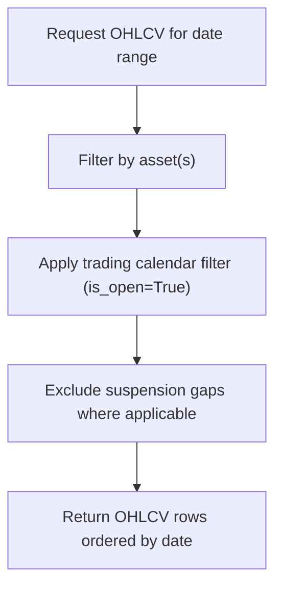

**Diagram sources**
- [models.py:201-226](file://apps/markets/models.py#L201-L226)
- [models.py:65-85](file://apps/markets/models.py#L65-L85)
- [models.py:87-115](file://apps/markets/models.py#L87-L115)
- [views.py:59-106](file://apps/markets/views.py#L59-L106)
- [backfill_ohlcv_history.py:318-387](file://apps/markets/management/commands/backfill_ohlcv_history.py#L318-L387)

**Section sources**
- [models.py:201-226](file://apps/markets/models.py#L201-L226)
- [models.py:65-85](file://apps/markets/models.py#L65-L85)
- [models.py:87-115](file://apps/markets/models.py#L87-L115)
- [views.py:59-106](file://apps/markets/views.py#L59-L106)
- [backfill_ohlcv_history.py:318-387](file://apps/markets/management/commands/backfill_ohlcv_history.py#L318-L387)

### Trading Calendar Integration
- ExchangeTradingCalendar stores official trade days and open flags.
- Backfill validates completeness of calendar responses and refuses partial replacements to preserve integrity.
- Windowed sync ensures large ranges are handled safely with batched writes.

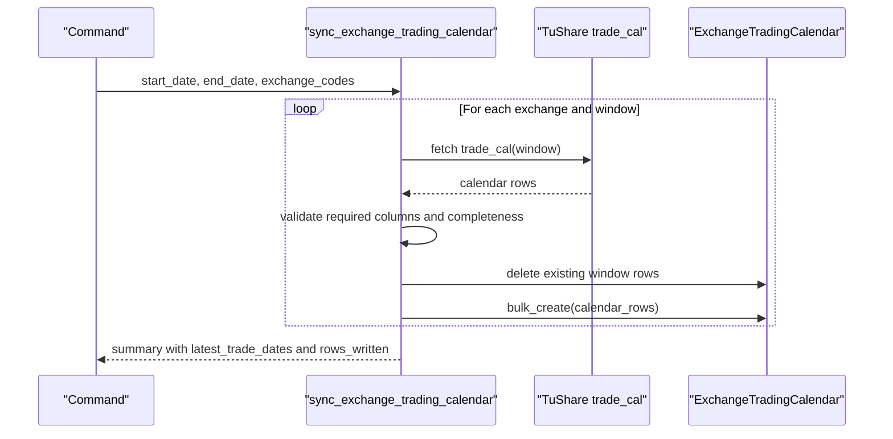

**Diagram sources**
- [tasks.py:266-352](file://apps/markets/tasks.py#L266-L352)
- [backfill_trading_calendar.py:9-32](file://apps/markets/management/commands/backfill_trading_calendar.py#L9-L32)

**Section sources**
- [tasks.py:266-352](file://apps/markets/tasks.py#L266-L352)
- [backfill_trading_calendar.py:9-32](file://apps/markets/management/commands/backfill_trading_calendar.py#L9-L32)

### Index Membership Tracking
- IndexMembership captures historical constituent snapshots and weights per index code and trade date.
- sync_index_constituent_universe pulls index_weight data in small windows to respect provider limits, persists membership history, updates Asset.membership_tags, and can dispatch asset-specific OHLCV backfills.
- The canonical effective universe contract determines required index codes by date and enforces coverage before computations proceed.

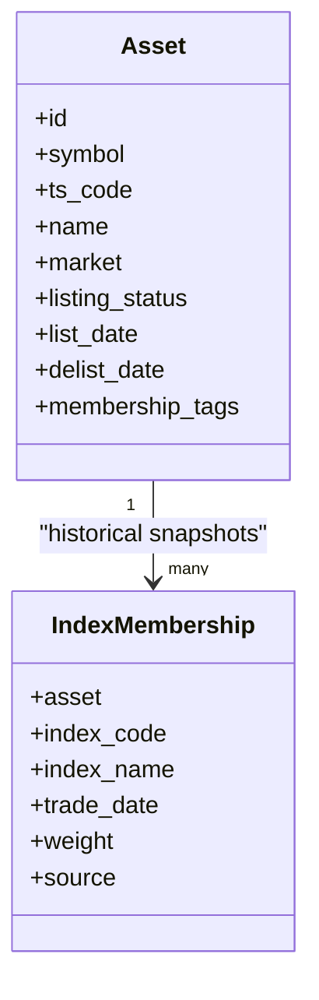

**Diagram sources**
- [models.py:19-63](file://apps/markets/models.py#L19-L63)
- [models.py:117-145](file://apps/markets/models.py#L117-L145)
- [tasks.py:649-800](file://apps/markets/tasks.py#L649-L800)
- [benchmarking.py:65-157](file://apps/markets/benchmarking.py#L65-L157)

**Section sources**
- [models.py:117-145](file://apps/markets/models.py#L117-L145)
- [tasks.py:649-800](file://apps/markets/tasks.py#L649-L800)
- [benchmarking.py:65-157](file://apps/markets/benchmarking.py#L65-L157)

### Backfill Processes
- OHLCV backfill supports:
  - Full-range backfill from historical floor.
  - CSV-driven gap repairs.
  - Technical indicator warm-up prefill extending lookback windows.
  - Effective-universe entry warm-up to initialize indicators when assets enter PIT scope.
- Suspension backfill merges duplicate entries and prioritizes full-day suspensions.
- Benchmark index history backfill upserts official index daily prices.
- CSI A500 rollout orchestrates membership sync, targeted raw backfills, model backfills, retraining, and benchmark suites.

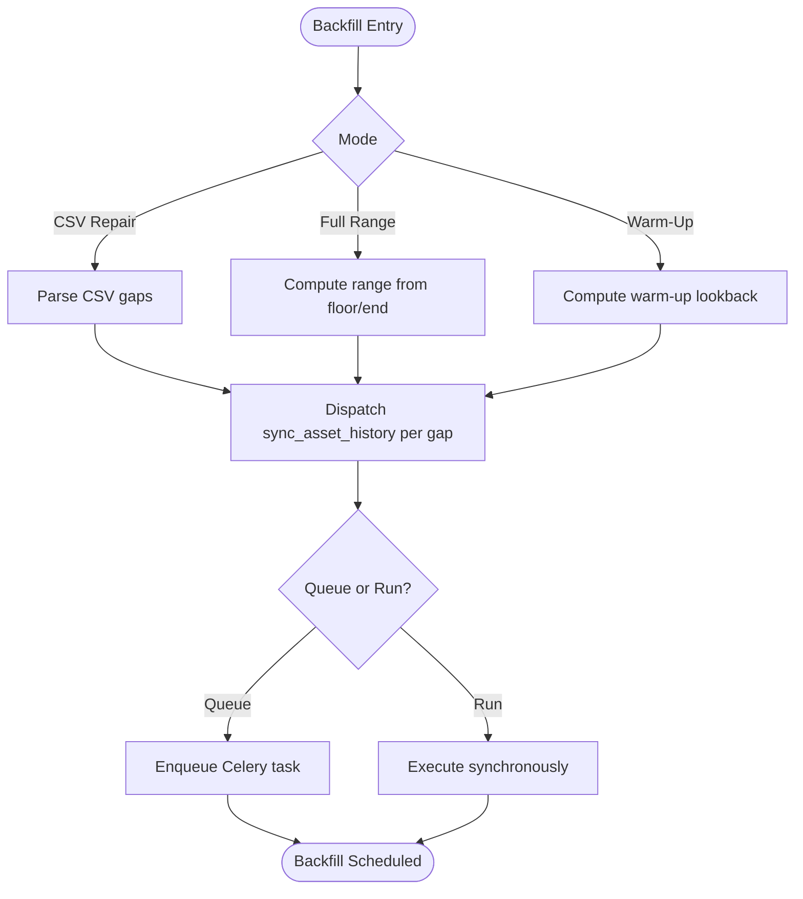

**Diagram sources**
- [backfill_ohlcv_history.py:25-387](file://apps/markets/management/commands/backfill_ohlcv_history.py#L25-L387)
- [tasks.py:577-646](file://apps/markets/tasks.py#L577-L646)

**Section sources**
- [backfill_ohlcv_history.py:25-387](file://apps/markets/management/commands/backfill_ohlcv_history.py#L25-L387)
- [tasks.py:577-646](file://apps/markets/tasks.py#L577-L646)

### Benchmark Index Maintenance and PIT Union
- Official benchmark index history is synced for configured index codes.
- The PIT union benchmark aggregates constituents based on IndexMembership snapshots and computes daily returns and NAV using free-float market cap or circulating market cap when available.
- Refresh supports seed and incremental modes to maintain continuity.

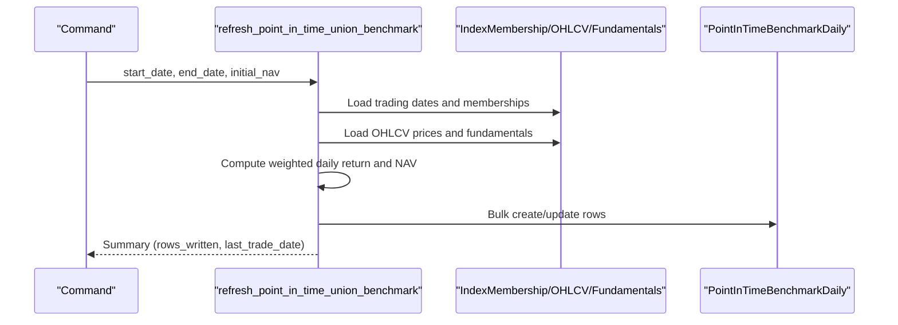

**Diagram sources**
- [benchmarking.py:312-462](file://apps/markets/benchmarking.py#L312-L462)
- [build_pit_union_benchmark.py:9-43](file://apps/markets/management/commands/build_pit_union_benchmark.py#L9-L43)

**Section sources**
- [benchmarking.py:312-462](file://apps/markets/benchmarking.py#L312-L462)
- [build_pit_union_benchmark.py:9-43](file://apps/markets/management/commands/build_pit_union_benchmark.py#L9-L43)

### API Endpoints and Views
- MarketViewSet: Read-only listing and retrieval with 24-hour cache.
- AssetViewSet: Read-only listing/retrieval with filtering by market code and listing status, search by symbol/ts_code/name, ordering, and 2-hour cache.
- OHLCVViewSet: Read-only listing/retrieval with filtering by asset and date range, ordering by date, and 2-hour cache.

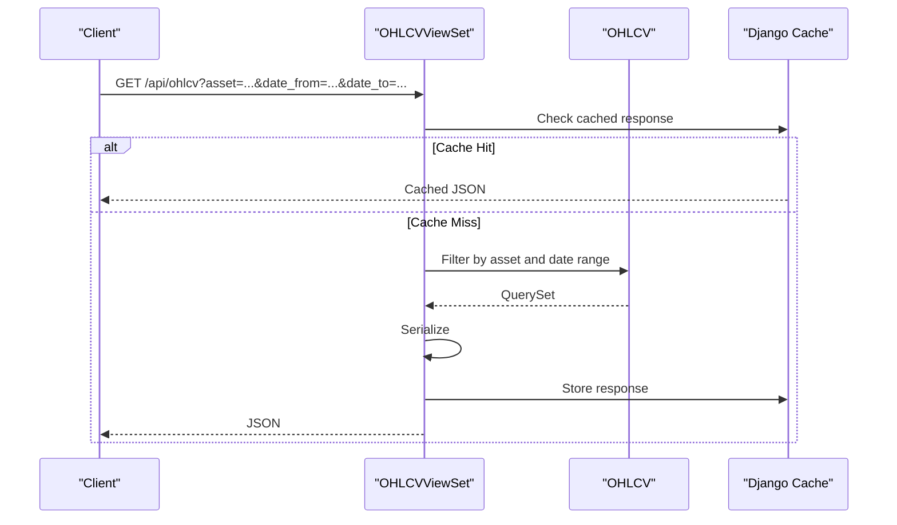

**Diagram sources**
- [views.py:59-106](file://apps/markets/views.py#L59-L106)
- [serializers.py:32-50](file://apps/markets/serializers.py#L32-L50)

**Section sources**
- [views.py:16-106](file://apps/markets/views.py#L16-L106)
- [serializers.py:5-50](file://apps/markets/serializers.py#L5-L50)

### Task Architecture for Background Processing
- Tasks encapsulate data ingestion logic with:
  - Retry wrappers for rate-limited providers.
  - Date window iteration to respect provider limits.
  - Deduplication and merging strategies (e.g., suspension timings).
  - Bulk database operations for performance.
- Tasks integrate with other apps’ tasks for downstream processing (e.g., technical indicators, factor scores), but the Markets app itself does not depend on internal app models except through well-defined interfaces.

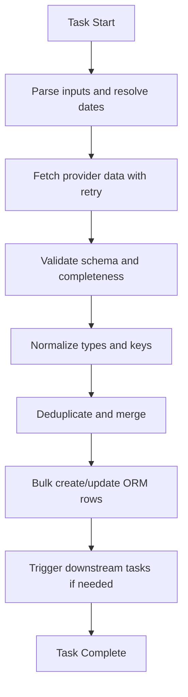

**Diagram sources**
- [tasks.py:196-226](file://apps/markets/tasks.py#L196-L226)
- [tasks.py:355-488](file://apps/markets/tasks.py#L355-L488)
- [tasks.py:491-574](file://apps/markets/tasks.py#L491-L574)

**Section sources**
- [tasks.py:196-226](file://apps/markets/tasks.py#L196-L226)
- [tasks.py:355-488](file://apps/markets/tasks.py#L355-L488)
- [tasks.py:491-574](file://apps/markets/tasks.py#L491-L574)

## Dependency Analysis
- Upstream dependency pattern:
  - Markets app has no internal Django app dependencies beyond core utilities (e.g., date_floor) and external providers (TuShare/AkShare).
  - Other apps depend on Markets for canonical asset reference data, OHLCV history, calendars, and PIT universe contracts.
- Coupling:
  - Tasks depend on models and benchmarking for data integrity and universe resolution.
  - Views depend on serializers and models for API responses.
  - Commands depend on tasks for heavy lifting and on models for queries.

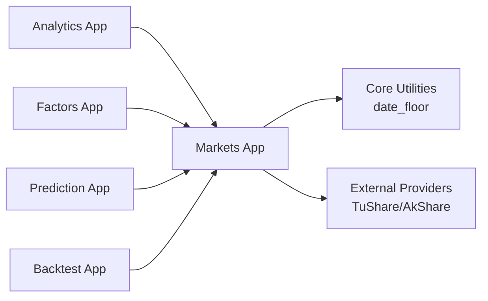

**Diagram sources**
- [tasks.py:14-18](file://apps/markets/tasks.py#L14-L18)
- [benchmarking.py:19-22](file://apps/markets/benchmarking.py#L19-L22)

**Section sources**
- [tasks.py:14-18](file://apps/markets/tasks.py#L14-L18)
- [benchmarking.py:19-22](file://apps/markets/benchmarking.py#L19-L22)

## Performance Considerations
- Use windowed requests to respect provider rate limits and row caps.
- Employ bulk_create with update_conflicts for idempotent upserts.
- Cache API responses for read-heavy endpoints.
- Minimize N+1 queries with select_related and values_list where appropriate.
- Prefer Decimal for financial calculations to avoid floating-point drift.
- Defer heavy work to background tasks and queue mode in commands.

[No sources needed since this section provides general guidance]

## Troubleshooting Guide
- Missing provider token: Ensure TUSHARE_TOKEN is configured; tasks raise explicit errors when absent.
- Incomplete calendar responses: Calendar sync refuses to replace rows if expected trade dates are missing; investigate provider output and adjust windows.
- Rate limiting: Tasks include retry logic with exponential sleep; monitor logs for frequency limit warnings.
- Coverage gaps: PIT membership coverage checks fail fast if required index snapshots are missing; run index constituent sync before computations.
- CSV repair issues: Validate required columns and date ranges; ensure gap_start <= gap_end and supported suffixes.

**Section sources**
- [tasks.py:266-352](file://apps/markets/tasks.py#L266-L352)
- [tasks.py:196-226](file://apps/markets/tasks.py#L196-L226)
- [benchmarking.py:133-146](file://apps/markets/benchmarking.py#L133-L146)
- [backfill_ohlcv_history.py:85-164](file://apps/markets/management/commands/backfill_ohlcv_history.py#L85-L164)

## Conclusion
The Markets application provides a robust, point-in-time aware foundation for the FinanceAnalysis platform. Its models capture asset lifecycles, OHLCV history, suspensions, calendars, and index memberships with strong integrity constraints. Tasks and commands enable reliable backfills and maintenance of benchmark indices and constituent universes. The strict upstream dependency pattern ensures that all downstream apps consume a single source of truth for market data, enabling consistent analytics, predictions, and backtests.

[No sources needed since this section summarizes without analyzing specific files]

## Appendices

### Management Commands Reference
- backfill_ohlcv_history: Backfill OHLCV from floor or repair gaps; supports warm-up and effective-universe entry modes.
- sync_index_constituents: Sync index constituents, persist membership history, update tags, and optionally dispatch asset syncs.
- backfill_asset_list_dates: Backfill Asset.list_date/delist_date/listing_status from TuShare with AkShare fallback.
- backfill_asset_suspensions: Backfill daily suspension data from provider.
- sync_benchmark_index_history: Sync official benchmark index history for configured codes.
- backfill_trading_calendar: Backfill official exchange trading calendar.
- build_pit_union_benchmark: Build or refresh the internal PIT union benchmark.
- onboard_csi_a500_universe: Orchestrate CSI A500 rollout including memberships, backfills, model backfills, retraining, and benchmark suites.

**Section sources**
- [backfill_ohlcv_history.py:25-387](file://apps/markets/management/commands/backfill_ohlcv_history.py#L25-L387)
- [sync_index_constituents.py:9-76](file://apps/markets/management/commands/sync_index_constituents.py#L9-L76)
- [backfill_asset_list_dates.py:83-160](file://apps/markets/management/commands/backfill_asset_list_dates.py#L83-L160)
- [backfill_asset_suspensions.py:11-43](file://apps/markets/management/commands/backfill_asset_suspensions.py#L11-L43)
- [sync_benchmark_index_history.py:6-44](file://apps/markets/management/commands/sync_benchmark_index_history.py#L6-L44)
- [backfill_trading_calendar.py:9-32](file://apps/markets/management/commands/backfill_trading_calendar.py#L9-L32)
- [build_pit_union_benchmark.py:9-43](file://apps/markets/management/commands/build_pit_union_benchmark.py#L9-L43)
- [onboard_csi_a500_universe.py:15-280](file://apps/markets/management/commands/onboard_csi_a500_universe.py#L15-L280)