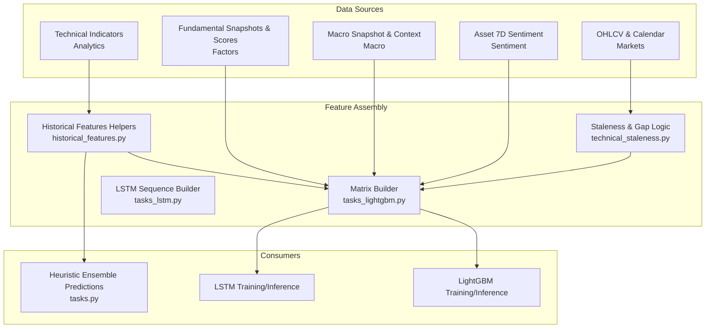
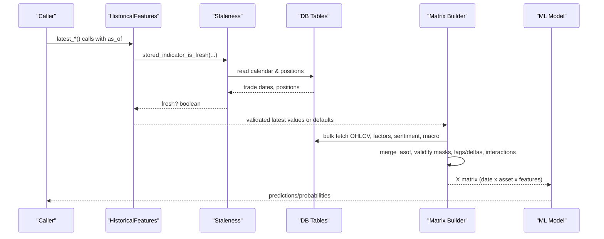
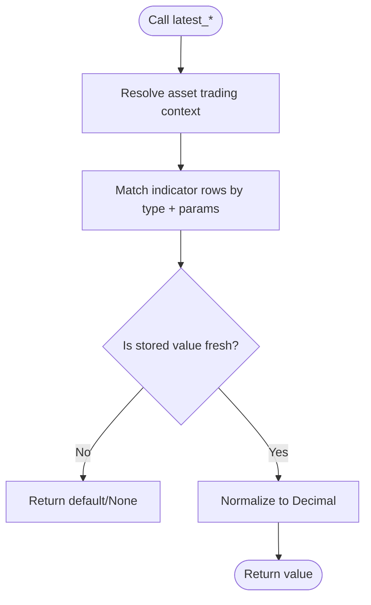
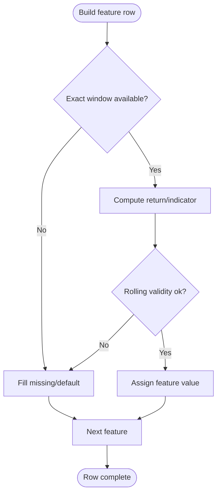
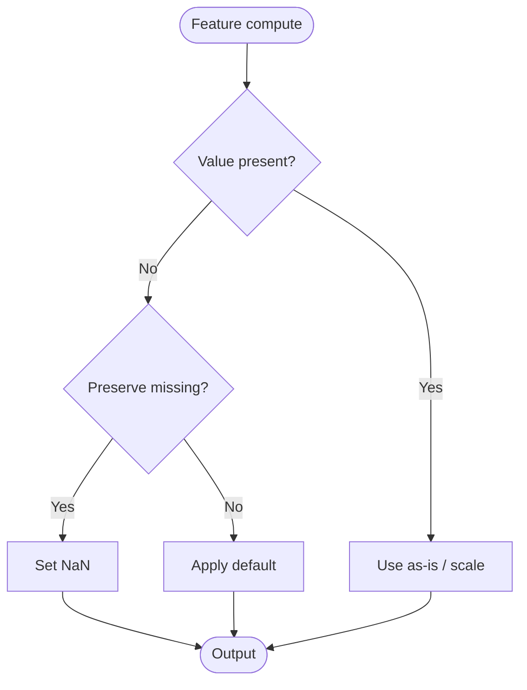
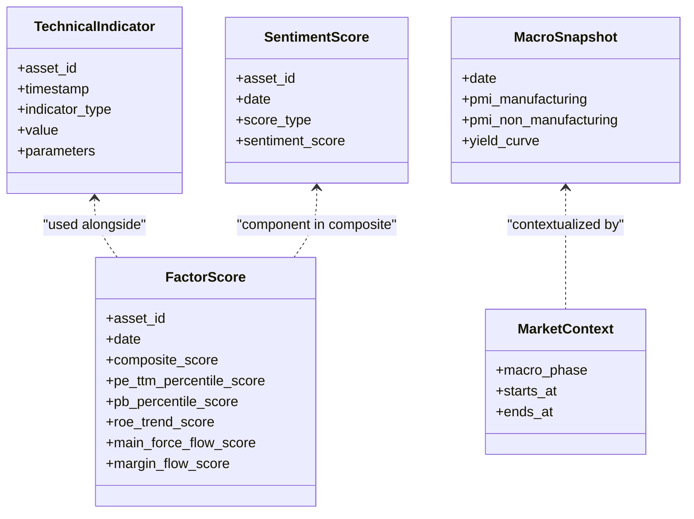
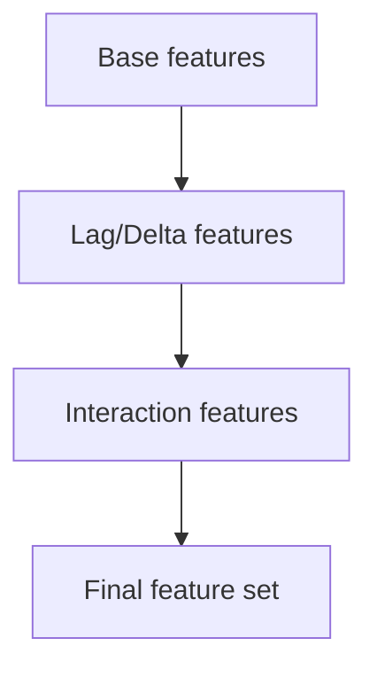
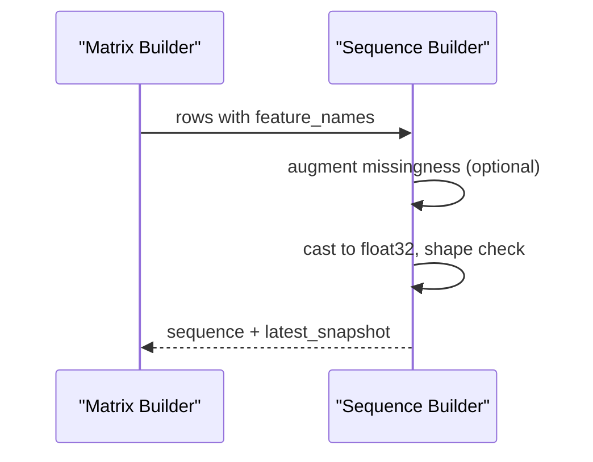
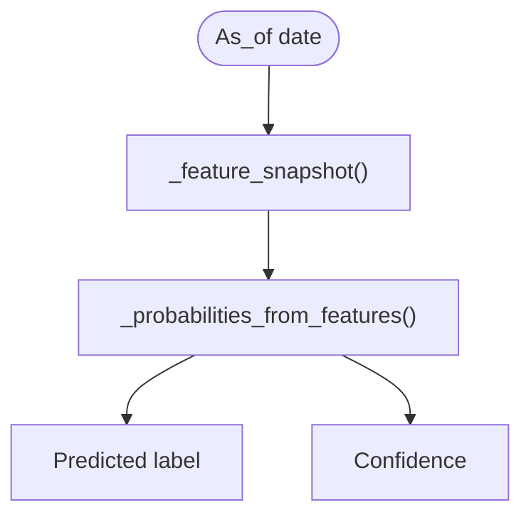
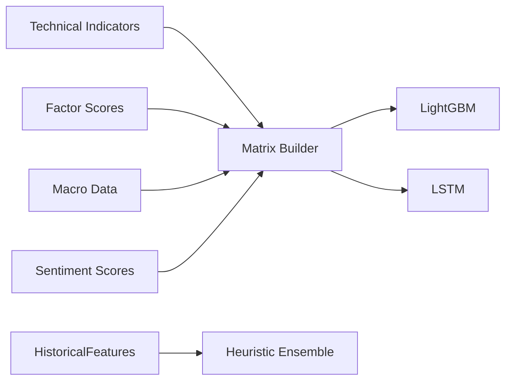

# Feature Engineering Pipeline

<cite>
**Referenced Files in This Document**
- [historical_features.py](file://apps/prediction/historical_features.py)
- [technical_staleness.py](file://apps/analytics/technical_staleness.py)
- [models.py (Analytics)](file://apps/analytics/models.py)
- [models.py (Factors)](file://apps/factors/models.py)
- [fundamental_materialization.py](file://apps/factors/fundamental_materialization.py)
- [models.py (Macro)](file://apps/macro/models.py)
- [models.py (Sentiment)](file://apps/sentiment/models.py)
- [tasks_lightgbm.py](file://apps/prediction/tasks_lightgbm.py)
- [tasks_lstm.py](file://apps/prediction/tasks_lstm.py)
- [tasks.py](file://apps/prediction/tasks.py)
- [metadata.json (3D LightGBM)](file://models/lightgbm/3d_lgb-3d-2024-12-31-core80-v1/metadata.json)
- [metadata.json (7D LightGBM)](file://models/lightgbm/7d_lgb-7d-2024-12-31-core80-v1/metadata.json)
- [metadata.json (30D LightGBM)](file://models/lightgbm/30d_lgb-30d-2024-12-31-core80-v1/metadata.json)
</cite>

## Table of Contents
1. Introduction
2. Project Structure
3. Core Components
4. Architecture Overview
5. Detailed Component Analysis
6. Dependency Analysis
7. Performance Considerations
8. Troubleshooting Guide
9. Conclusion
10. Appendices

## Introduction
This document explains the feature engineering pipeline that constructs input matrices for ML models across 3-day, 7-day, and 30-day horizons. It focuses on how technical indicators, fundamental factors, macro context, and sentiment data are aligned temporally, normalized, and combined into unified feature vectors. It also documents staleness checks, missing data handling, interaction features, and performance optimizations including caching and chunked processing.

## Project Structure
The pipeline spans multiple apps:
- Analytics app provides technical indicators and staleness logic.
- Factors app stores fundamental snapshots and composite factor scores.
- Macro app stores macro snapshots and current market context.
- Sentiment app stores per-asset rolling sentiment scores.
- Prediction app orchestrates feature assembly, matrix creation, and model training/inference.

**Diagram sources**
- [historical_features.py:15-179](file://apps/prediction/historical_features.py#L15-L179)
- [technical_staleness.py:9-190](file://apps/analytics/technical_staleness.py#L9-L190)
- [tasks_lightgbm.py:1162-1700](file://apps/prediction/tasks_lightgbm.py#L1162-L1700)
- [tasks_lstm.py:636-673](file://apps/prediction/tasks_lstm.py#L636-L673)
- [tasks.py:55-79](file://apps/prediction/tasks.py#L55-L79)

**Section sources**
- [historical_features.py:15-179](file://apps/prediction/historical_features.py#L15-L179)
- [technical_staleness.py:9-190](file://apps/analytics/technical_staleness.py#L9-L190)
- [tasks_lightgbm.py:1162-1700](file://apps/prediction/tasks_lightgbm.py#L1162-L1700)
- [tasks_lstm.py:636-673](file://apps/prediction/tasks_lstm.py#L636-L673)
- [tasks.py:55-79](file://apps/prediction/tasks.py#L55-L79)

## Core Components
- HistoricalFeatures helpers: Provide latest values for OHLCV, RSI, momentum, Bollinger Bands, SMA, relative strength score, returns, relative volume, and realized volatility with parameter-aware matching and staleness checks.
- Staleness engine: Enforces indicator freshness based on trading calendars, max gaps, and required lookback windows.
- Matrix builder: Constructs a wide DataFrame per asset over time, merging technical, fundamental, macro, and sentiment series; applies validity masks, lags/deltas, and interaction terms.
- LSTM sequence builder: Converts feature matrices to fixed-length sequences with optional missingness augmentation.
- Heuristic ensemble: Builds a compact feature snapshot and computes horizon-specific probabilities using macro phase adjustments.

**Section sources**
- [historical_features.py:15-397](file://apps/prediction/historical_features.py#L15-L397)
- [technical_staleness.py:9-190](file://apps/analytics/technical_staleness.py#L9-L190)
- [tasks_lightgbm.py:1162-1700](file://apps/prediction/tasks_lightgbm.py#L1162-L1700)
- [tasks_lstm.py:636-673](file://apps/prediction/tasks_lstm.py#L636-L673)
- [tasks.py:55-112](file://apps/prediction/tasks.py#L55-L112)

## Architecture Overview
The pipeline aligns heterogeneous data by trading date and exchange, validates recency and continuity, and produces consistent feature vectors for each horizon.

**Diagram sources**
- [historical_features.py:142-179](file://apps/prediction/historical_features.py#L142-L179)
- [technical_staleness.py:173-190](file://apps/analytics/technical_staleness.py#L173-L190)
- [tasks_lightgbm.py:1162-1700](file://apps/prediction/tasks_lightgbm.py#L1162-L1700)

## Detailed Component Analysis

### HistoricalFeatures class and methods
- Purpose: Retrieve point-in-time values for technical indicators and price/volume metrics with strict parameter matching and staleness enforcement.
- Key behaviors:
  - Parameter-aware matching: Ensures stored indicators match expected parameters (e.g., RSI timeperiod=14).
  - Freshness checks: Uses trading calendar positions and max gap rules to reject stale values.
  - Defaults and normalization: Returns safe numeric defaults when data is missing or invalid.
  - Caching: In-memory cache keyed by asset, as_of, and parameters reduces repeated queries within a run.

**Diagram sources**
- [historical_features.py:36-48](file://apps/prediction/historical_features.py#L36-L48)
- [historical_features.py:86-139](file://apps/prediction/historical_features.py#L86-L139)
- [historical_features.py:142-179](file://apps/prediction/historical_features.py#L142-L179)
- [technical_staleness.py:173-190](file://apps/analytics/technical_staleness.py#L173-L190)

**Section sources**
- [historical_features.py:15-397](file://apps/prediction/historical_features.py#L15-L397)
- [technical_staleness.py:9-190](file://apps/analytics/technical_staleness.py#L9-L190)

### Temporal alignment across horizons (3D, 7D, 30D)
- Horizons are supported via:
  - Exact window availability checks for returns and derived metrics (e.g., 3D, 5D, 10D).
  - Rolling validity masks for indicators requiring continuous windows (e.g., RSI requires recent points without large gaps).
  - Lag and delta features computed at 3D, 5D, 10D to enrich short-term dynamics.
- The matrix builder enforces exact window constraints before assigning values; otherwise, true missingness or configured defaults are used.

**Diagram sources**
- [tasks_lightgbm.py:1435-1455](file://apps/prediction/tasks_lightgbm.py#L1435-L1455)
- [tasks_lightgbm.py:1498-1580](file://apps/prediction/tasks_lightgbm.py#L1498-L1580)
- [tasks_lightgbm.py:1606-1620](file://apps/prediction/tasks_lightgbm.py#L1606-L1620)

**Section sources**
- [tasks_lightgbm.py:1435-1620](file://apps/prediction/tasks_lightgbm.py#L1435-L1620)

### Missing data handling and feature normalization
- True missingness preservation: When enabled, features remain NaN if windows are incomplete or indicators are stale.
- Default fallbacks: Otherwise, defaults are applied (e.g., RSI=50, returns=0, sentiment=0, macro phases mapped to numeric).
- Normalization strategies:
  - Fundamental percentiles and composite scores are already normalized in storage.
  - Macro variables are filled with neutral baselines when absent.
  - Interaction features multiply existing normalized signals.

**Diagram sources**
- [tasks_lightgbm.py:815-835](file://apps/prediction/tasks_lightgbm.py#L815-L835)
- [tasks_lightgbm.py:1631-1697](file://apps/prediction/tasks_lightgbm.py#L1631-L1697)

**Section sources**
- [tasks_lightgbm.py:815-835](file://apps/prediction/tasks_lightgbm.py#L815-L835)
- [tasks_lightgbm.py:1631-1697](file://apps/prediction/tasks_lightgbm.py#L1631-L1697)

### Integration with external apps
- Analytics app (technical indicators):
  - Stores TechnicalIndicator rows with type, timestamp, value, and parameters.
  - Provides staleness and trading calendar utilities.
- Factors app (fundamentals):
  - Stores daily fundamental snapshots and multi-factor scores (composite, capital flow, technical, sentiment components).
  - Materializes fundamentals from raw inputs with backward-as-of merges.
- Macro app (economic context):
  - Stores macro snapshots and active market context phases.
  - Merged as-of to assign macro_phase and economic indicators per date.
- Sentiment app (news analysis):
  - Stores ASSET_7D sentiment scores consumed by models.
  - Aggregated rolling sentiment and 20-day average included.

**Diagram sources**
- [models.py (Analytics):8-43](file://apps/analytics/models.py#L8-L43)
- [models.py (Factors):7-37](file://apps/factors/models.py#L7-L37)
- [models.py (Factors):124-176](file://apps/factors/models.py#L124-L176)
- [models.py (Macro):5-29](file://apps/macro/models.py#L5-L29)
- [models.py (Macro):31-57](file://apps/macro/models.py#L31-L57)
- [models.py (Sentiment):64-108](file://apps/sentiment/models.py#L64-L108)

**Section sources**
- [models.py (Analytics):8-43](file://apps/analytics/models.py#L8-L43)
- [models.py (Factors):7-37](file://apps/factors/models.py#L7-L37)
- [models.py (Factors):124-176](file://apps/factors/models.py#L124-L176)
- [models.py (Macro):5-29](file://apps/macro/models.py#L5-L29)
- [models.py (Macro):31-57](file://apps/macro/models.py#L31-L57)
- [models.py (Sentiment):64-108](file://apps/sentiment/models.py#L64-L108)
- [fundamental_materialization.py:123-165](file://apps/factors/fundamental_materialization.py#L123-L165)

### Feature construction and interaction terms
- Base features include:
  - Technical: RSI, MOM_5D, RS_SCORE, returns (3D/5D/10D), relative volume (5D/20D), realized volatility (5D).
  - Fundamental: PE/PB percentiles, ROE trend, main force flow, margin flow, composite score.
  - Macro: PMI manufacturing/non-manufacturing, yield curve, macro phase.
  - Sentiment: Asset 7D sentiment and its 20-day average.
- Engineered features:
  - Lags and deltas at 3D, 5D, 10D for RSI, momentum, and RS score.
  - Interaction terms such as RSI × relative volume, RSI × macro phase, composite × sentiment, PE percentile × macro phase.

**Diagram sources**
- [tasks_lightgbm.py:1606-1620](file://apps/prediction/tasks_lightgbm.py#L1606-L1620)
- [tasks_lightgbm.py:380-401](file://apps/prediction/tasks_lightgbm.py#L380-L401)

**Section sources**
- [tasks_lightgbm.py:380-401](file://apps/prediction/tasks_lightgbm.py#L380-L401)
- [tasks_lightgbm.py:1606-1620](file://apps/prediction/tasks_lightgbm.py#L1606-L1620)
- [metadata.json (3D LightGBM):65-108](file://models/lightgbm/3d_lgb-3d-2024-12-31-core80-v1/metadata.json#L65-L108)
- [metadata.json (7D LightGBM):65-108](file://models/lightgbm/7d_lgb-7d-2024-12-31-core80-v1/metadata.json#L65-L108)
- [metadata.json (30D LightGBM):65-108](file://models/lightgbm/30d_lgb-30d-2024-12-31-core80-v1/metadata.json#L65-L108)

### LSTM sequence building
- Converts feature matrices into fixed-length sequences per asset.
- Augments missingness features when using LSTM-specific strategy.
- Produces last-step snapshots for runtime inference.

**Diagram sources**
- [tasks_lstm.py:349-368](file://apps/prediction/tasks_lstm.py#L349-L368)
- [tasks_lstm.py:636-673](file://apps/prediction/tasks_lstm.py#L636-L673)

**Section sources**
- [tasks_lstm.py:349-368](file://apps/prediction/tasks_lstm.py#L349-L368)
- [tasks_lstm.py:636-673](file://apps/prediction/tasks_lstm.py#L636-L673)

### Heuristic ensemble feature snapshot
- Assembles a compact feature vector from factor scores, sentiment, and technical indicators.
- Computes horizon-specific up/flat/down probabilities with macro phase adjustments.

**Diagram sources**
- [tasks.py:55-79](file://apps/prediction/tasks.py#L55-L79)
- [tasks.py:82-112](file://apps/prediction/tasks.py#L82-L112)

**Section sources**
- [tasks.py:55-112](file://apps/prediction/tasks.py#L55-L112)

## Dependency Analysis
- Data dependencies:
  - Technical indicators depend on Analytics app storage and staleness rules.
  - Fundamentals depend on Factors app materialization and scoring.
  - Macro depends on Macro app snapshots and active context.
  - Sentiment depends on Sentiment app rolling aggregation.
- Processing dependencies:
  - Matrix builder depends on all above sources and markets calendar.
  - LSTM sequence builder depends on matrix builder output.
  - Heuristic ensemble depends on historical features helpers.

**Diagram sources**
- [tasks_lightgbm.py:1162-1700](file://apps/prediction/tasks_lightgbm.py#L1162-L1700)
- [tasks_lstm.py:636-673](file://apps/prediction/tasks_lstm.py#L636-L673)
- [tasks.py:55-112](file://apps/prediction/tasks.py#L55-L112)

**Section sources**
- [tasks_lightgbm.py:1162-1700](file://apps/prediction/tasks_lightgbm.py#L1162-L1700)
- [tasks_lstm.py:636-673](file://apps/prediction/tasks_lstm.py#L636-L673)
- [tasks.py:55-112](file://apps/prediction/tasks.py#L55-L112)

## Performance Considerations
- Caching:
  - In-memory caches in historical features reduce repeated DB reads within a single run.
  - Runtime caches in backtest tasks avoid recomputation across assets and horizons.
- Chunked processing:
  - Matrix creation iterates asset chunks to limit memory usage during training.
- Efficient joins:
  - Uses pandas merge_asof for time-aligned joins with minimal overhead.
- Validity masks:
  - Precomputes rolling/exact window validity to avoid redundant checks.
- Warmup windows:
  - Extends start dates backward to ensure sufficient history for indicators.

[No sources needed since this section provides general guidance]

## Troubleshooting Guide
- Stale indicators:
  - If stored_indicator_is_fresh returns False due to max gap exceeded, features will be missing or defaulted. Verify indicator recency and calendar coverage.
- Missing windows:
  - Exact window checks may fail near the start of series; expect NaN or defaults until full history is available.
- Parameter mismatches:
  - Ensure stored indicator parameters match expected keys/values; otherwise, matches are rejected.
- Macro context gaps:
  - If no active context exists, macro_phase defaults to a neutral value; verify context records.

**Section sources**
- [technical_staleness.py:9-190](file://apps/analytics/technical_staleness.py#L9-L190)
- [historical_features.py:142-179](file://apps/prediction/historical_features.py#L142-L179)
- [tasks_lightgbm.py:1631-1697](file://apps/prediction/tasks_lightgbm.py#L1631-L1697)

## Conclusion
The pipeline robustly integrates technical, fundamental, macro, and sentiment data into unified feature vectors aligned to trading calendars. It enforces temporal integrity through staleness checks and window validations, supports multiple horizons, and includes engineered interactions for improved modeling. Performance is optimized via caching, chunked processing, and efficient time-aligned joins.

## Appendices

### Feature sets by horizon (selected)
- Common base features include RSI, momentum, returns, relative volume, realized volatility, fundamental percentiles, composite score, macro indicators, and sentiment.
- Engineered features add lags/deltas and interaction terms as documented in metadata.

**Section sources**
- [metadata.json (3D LightGBM):65-108](file://models/lightgbm/3d_lgb-3d-2024-12-31-core80-v1/metadata.json#L65-L108)
- [metadata.json (7D LightGBM):65-108](file://models/lightgbm/7d_lgb-7d-2024-12-31-core80-v1/metadata.json#L65-L108)
- [metadata.json (30D LightGBM):65-108](file://models/lightgbm/30d_lgb-30d-2024-12-31-core80-v1/metadata.json#L65-L108)