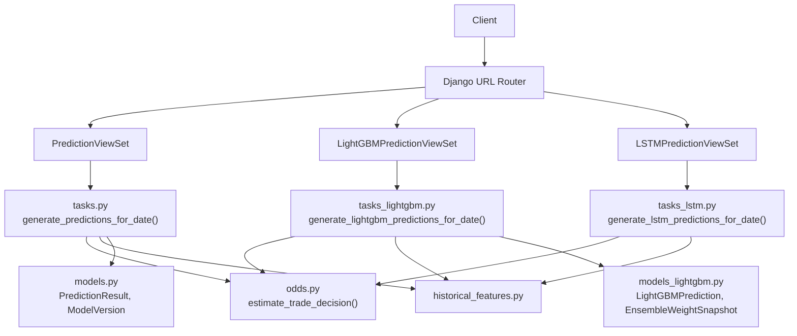
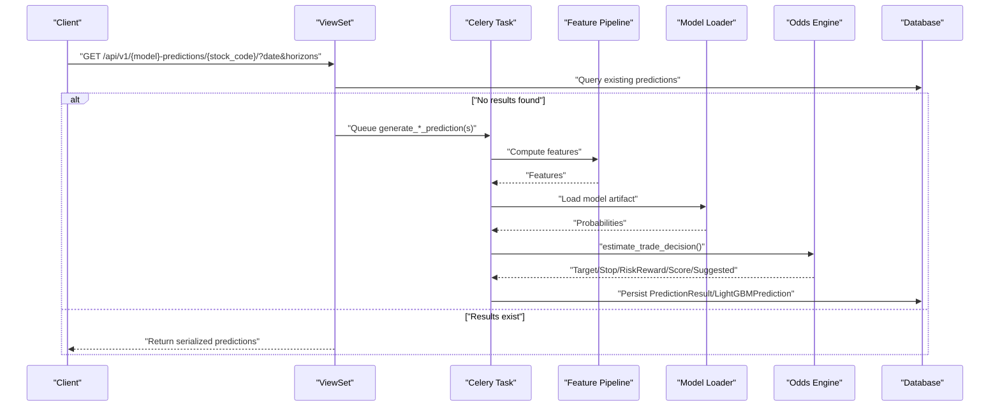
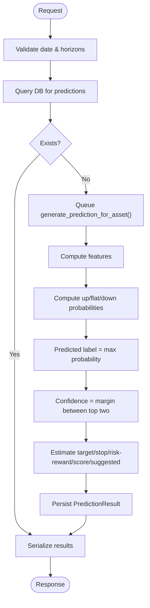
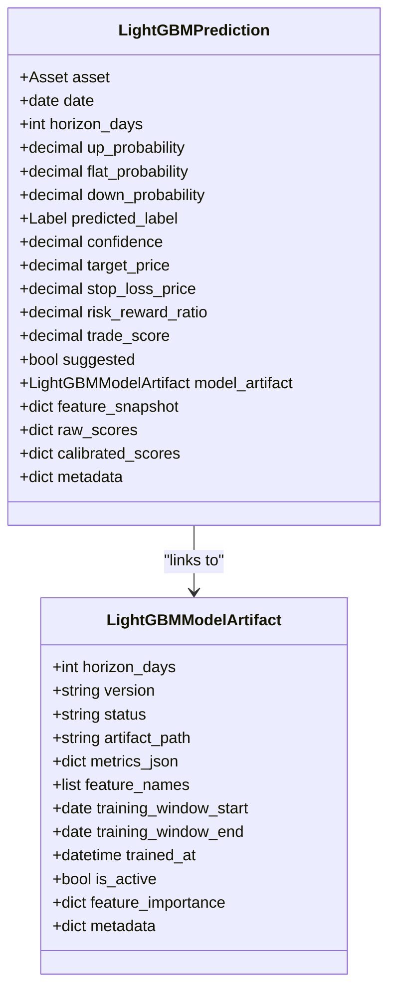
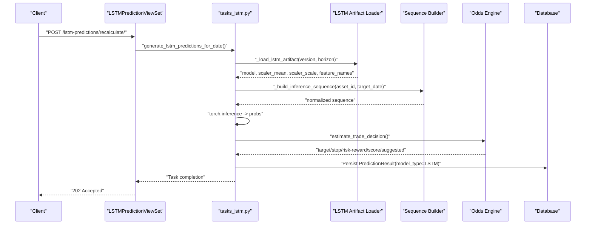
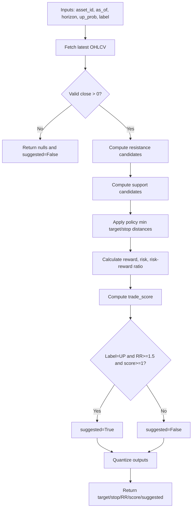
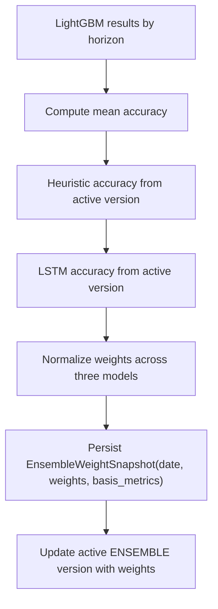
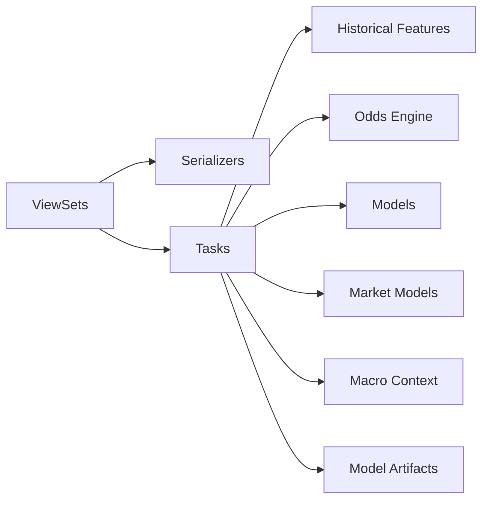

# Model Inference System

<cite>
**Referenced Files in This Document**
- [views.py](file://apps/prediction/views.py)
- [views_lightgbm.py](file://apps/prediction/views_lightgbm.py)
- [views_lstm.py](file://apps/prediction/views_lstm.py)
- [tasks.py](file://apps/prediction/tasks.py)
- [tasks_lightgbm.py](file://apps/prediction/tasks_lightgbm.py)
- [tasks_lstm.py](file://apps/prediction/tasks_lstm.py)
- [odds.py](file://apps/prediction/odds.py)
- [historical_features.py](file://apps/prediction/historical_features.py)
- [models.py](file://apps/prediction/models.py)
- [models_lightgbm.py](file://apps/prediction/models_lightgbm.py)
- [serializers.py](file://apps/prediction/serializers.py)
- [urls.py](file://config/urls.py)
- [throttling.py](file://apps/core/throttling.py)
</cite>

## Table of Contents
1. [Introduction](#introduction)
2. [Project Structure](#project-structure)
3. [Core Components](#core-components)
4. [Architecture Overview](#architecture-overview)
5. [Detailed Component Analysis](#detailed-component-analysis)
6. [Dependency Analysis](#dependency-analysis)
7. [Performance Considerations](#performance-considerations)
8. [Troubleshooting Guide](#troubleshooting-guide)
9. [Conclusion](#conclusion)
10. [Appendices](#appendices)

## Introduction
This document describes the real-time inference system that serves model predictions through REST APIs. It covers prediction endpoints for multiple model types (heuristic ensemble baseline, LightGBM, and LSTM), request validation, feature preprocessing, model loading, odds calculation algorithms, confidence scoring, threshold-based decision logic, ensemble weighting, rate limiting, caching strategies, batch processing, performance monitoring, API response formats, error handling, and client integration patterns.

## Project Structure
The inference system is implemented as a Django application with REST viewsets exposing endpoints under /api/v1/. Prediction results are persisted to database models and can be served synchronously or triggered asynchronously via Celery tasks.

**Diagram sources**
- [urls.py:74-107](file://config/urls.py#L74-L107)
- [views.py:27-161](file://apps/prediction/views.py#L27-L161)
- [views_lightgbm.py:124-269](file://apps/prediction/views_lightgbm.py#L124-L269)
- [views_lstm.py:19-171](file://apps/prediction/views_lstm.py#L19-L171)
- [tasks.py:177-327](file://apps/prediction/tasks.py#L177-L327)
- [tasks_lightgbm.py:121-156](file://apps/prediction/tasks_lightgbm.py#L121-L156)
- [tasks_lstm.py:234-441](file://apps/prediction/tasks_lstm.py#L234-L441)
- [odds.py:60-158](file://apps/prediction/odds.py#L60-L158)
- [historical_features.py:182-397](file://apps/prediction/historical_features.py#L182-L397)
- [models.py:7-107](file://apps/prediction/models.py#L7-L107)
- [models_lightgbm.py:7-137](file://apps/prediction/models_lightgbm.py#L7-L137)

**Section sources**
- [urls.py:74-107](file://config/urls.py#L74-L107)

## Core Components
- Prediction endpoints:
  - Heuristic ensemble baseline: GET per stock, POST batch, POST recalculate.
  - LightGBM: GET per stock, POST train, POST recalculate, POST batch.
  - LSTM: GET per stock, POST train, POST recalculate, POST batch.
- Feature preprocessing:
  - Technical indicators (RSI, BBANDS, SMA), momentum, relative strength score, sentiment, factor scores.
  - Missing data handling and staleness checks.
- Model loading:
  - LightGBM artifacts loaded from disk with in-process cache; GPU acceleration when available.
  - LSTM models loaded from Torch files with scaler metadata.
  - Heuristic baseline uses active ensemble version record.
- Odds and decision engine:
  - Target and stop-loss price estimation using recent OHLCV, Bollinger Bands, moving averages, and policy thresholds.
  - Risk-reward ratio and trade score computed to derive suggested signals.
- Ensemble weighting:
  - Dynamic weights derived from recent accuracy metrics across LightGBM, LSTM, and heuristic baselines.

**Section sources**
- [views.py:27-161](file://apps/prediction/views.py#L27-L161)
- [views_lightgbm.py:124-269](file://apps/prediction/views_lightgbm.py#L124-L269)
- [views_lstm.py:19-171](file://apps/prediction/views_lstm.py#L19-L171)
- [tasks.py:177-327](file://apps/prediction/tasks.py#L177-L327)
- [tasks_lightgbm.py:121-156](file://apps/prediction/tasks_lightgbm.py#L121-L156)
- [tasks_lstm.py:234-441](file://apps/prediction/tasks_lstm.py#L234-L441)
- [odds.py:60-158](file://apps/prediction/odds.py#L60-L158)
- [historical_features.py:182-397](file://apps/prediction/historical_features.py#L182-L397)
- [models.py:7-107](file://apps/prediction/models.py#L7-L107)
- [models_lightgbm.py:7-137](file://apps/prediction/models_lightgbm.py#L7-L137)

## Architecture Overview
The system exposes REST endpoints that either return cached or newly generated predictions. For on-demand generation, views trigger background tasks that compute features, run models, calculate odds, and persist results.

**Diagram sources**
- [views.py:37-97](file://apps/prediction/views.py#L37-L97)
- [views_lightgbm.py:136-193](file://apps/prediction/views_lightgbm.py#L136-L193)
- [views_lstm.py:32-91](file://apps/prediction/views_lstm.py#L32-L91)
- [tasks.py:177-327](file://apps/prediction/tasks.py#L177-L327)
- [tasks_lightgbm.py:121-156](file://apps/prediction/tasks_lightgbm.py#L121-L156)
- [tasks_lstm.py:234-441](file://apps/prediction/tasks_lstm.py#L234-L441)
- [odds.py:60-158](file://apps/prediction/odds.py#L60-L158)

## Detailed Component Analysis

### Heuristic Ensemble Baseline
- Endpoints:
  - GET /api/v1/prediction/{stock_code}/
  - POST /api/v1/prediction/batch/
  - POST /api/v1/prediction/recalculate/
- Behavior:
  - Validates date and horizons; defaults to current date and [3,7,30].
  - If no predictions exist, queues task to generate for asset/date/horizons.
  - Returns grouped results per horizon with probabilities, confidence, labels, target/stop prices, risk-reward, trade score, and suggestion flag.
- Feature preprocessing:
  - Aggregates factor composite and bottom probability, sentiment score, RSI, 5-day momentum, and relative strength score.
  - Adjusts base probabilities by horizon scaling and macro phase context.
- Confidence scoring:
  - Derived from margin between top two class probabilities.
- Odds calculation:
  - Uses recent OHLCV highs/lows, Bollinger Bands, SMAs, and policy thresholds to set target and stop-loss prices.
  - Computes risk-reward ratio and trade score; suggests trades based on label and thresholds.
- Persistence:
  - Stores PredictionResult rows linked to an active ENSEMBLE model version.

**Diagram sources**
- [views.py:37-97](file://apps/prediction/views.py#L37-L97)
- [tasks.py:82-127](file://apps/prediction/tasks.py#L82-L127)
- [odds.py:60-158](file://apps/prediction/odds.py#L60-L158)

**Section sources**
- [views.py:27-161](file://apps/prediction/views.py#L27-L161)
- [tasks.py:177-327](file://apps/prediction/tasks.py#L177-L327)
- [odds.py:60-158](file://apps/prediction/odds.py#L60-L158)
- [models.py:43-107](file://apps/prediction/models.py#L43-L107)

### LightGBM Predictions
- Endpoints:
  - GET /api/v1/lightgbm-predictions/{stock_code}/
  - POST /api/v1/lightgbm-predictions/train/
  - POST /api/v1/lightgbm-predictions/recalculate/
  - POST /api/v1/lightgbm-predictions/batch/
- Behavior:
  - Similar to heuristic baseline but uses trained LightGBM artifacts.
  - Batch and recalculate queue tasks to generate predictions for date/horizons.
- Model loading:
  - Loads model.pkl, scaler.pkl, calibrator.pkl from disk with in-process cache.
  - Supports GPU predict when compatible; falls back to CPU otherwise.
- Feature preprocessing:
  - Builds interaction features and handles missing values according to strategy.
  - Optional feature pruning based on importance snapshots.
- Odds calculation:
  - Reuses estimate_trade_decision for consistent trading signals.
- Persistence:
  - Stores LightGBMPrediction rows with raw and calibrated scores and feature snapshot.

**Diagram sources**
- [models_lightgbm.py:7-137](file://apps/prediction/models_lightgbm.py#L7-L137)

**Section sources**
- [views_lightgbm.py:124-269](file://apps/prediction/views_lightgbm.py#L124-L269)
- [tasks_lightgbm.py:121-156](file://apps/prediction/tasks_lightgbm.py#L121-L156)
- [tasks_lightgbm.py:731-800](file://apps/prediction/tasks_lightgbm.py#L731-L800)
- [models_lightgbm.py:7-137](file://apps/prediction/models_lightgbm.py#L7-L137)

### LSTM Predictions
- Endpoints:
  - GET /api/v1/lstm-predictions/{stock_code}/
  - POST /api/v1/lstm-predictions/train/
  - POST /api/v1/lstm-predictions/recalculate/
  - POST /api/v1/lstm-predictions/batch/
- Behavior:
  - Triggers LSTM-specific tasks for training and inference.
  - Returns grouped results per horizon with probabilities, confidence, labels, and trading signals.
- Model loading:
  - Loads Torch model state dict and scaler parameters from disk.
  - Resolves sequence length and feature names from artifact metadata.
- Feature preprocessing:
  - Builds sequences of fixed length; augments missingness indicators if configured.
  - Normalizes sequences using stored scaler mean/scale.
- Odds calculation:
  - Uses estimate_trade_decision for consistent trading signals.
- Persistence:
  - Stores PredictionResult rows with model_type=LSTM and includes model version name.

**Diagram sources**
- [views_lstm.py:108-117](file://apps/prediction/views_lstm.py#L108-L117)
- [tasks_lstm.py:234-441](file://apps/prediction/tasks_lstm.py#L234-L441)
- [odds.py:60-158](file://apps/prediction/odds.py#L60-L158)

**Section sources**
- [views_lstm.py:19-171](file://apps/prediction/views_lstm.py#L19-L171)
- [tasks_lstm.py:234-441](file://apps/prediction/tasks_lstm.py#L234-L441)
- [models.py:43-107](file://apps/prediction/models.py#L43-L107)

### Odds Calculation Algorithm
- Inputs:
  - Asset ID, as-of date, horizon days, up probability, predicted label, optional policy options.
- Steps:
  - Fetch latest OHLCV bar; validate non-zero close.
  - Compute candidate resistance from recent highs, upper Bollinger Band, and optionally near-round target.
  - Compute candidate support from recent lows, lower Bollinger Band, and moving average support.
  - Apply policy floors/ceilings for target and stop distances.
  - Calculate reward, risk, risk-reward ratio, and trade score.
  - Derive suggested flag based on label and thresholds.
- Outputs:
  - Quantized target_price, stop_loss_price, risk_reward_ratio, trade_score, and suggested boolean.

**Diagram sources**
- [odds.py:60-158](file://apps/prediction/odds.py#L60-L158)

**Section sources**
- [odds.py:60-158](file://apps/prediction/odds.py#L60-L158)

### Ensemble Weighting Strategy
- Mechanism:
  - After LightGBM pipeline runs, aggregate success accuracies across horizons.
  - Combine with heuristic and LSTM accuracies to compute normalized weights.
  - Persist EnsembleWeightSnapshot and update active ENSEMBLE model version with weights.
- Purpose:
  - Enables dynamic weighting for future ensemble decisions based on recent performance.

**Diagram sources**
- [tasks_lightgbm.py:631-729](file://apps/prediction/tasks_lightgbm.py#L631-L729)
- [models_lightgbm.py:97-111](file://apps/prediction/models_lightgbm.py#L97-L111)

**Section sources**
- [tasks_lightgbm.py:631-729](file://apps/prediction/tasks_lightgbm.py#L631-L729)
- [models_lightgbm.py:97-111](file://apps/prediction/models_lightgbm.py#L97-L111)

### Request Validation and Error Handling
- Validation:
  - Date parsing with fallback to current date.
  - Horizons parsed as integers; default to [3,7,30] if invalid.
  - stock_codes must be a non-empty list for batch endpoints.
- Errors:
  - 400 Bad Request for invalid batch inputs.
  - 404 Not Found for unknown assets.
  - 202 Accepted for queued retraining/inference tasks.
- Authentication:
  - All prediction endpoints require authenticated users.

**Section sources**
- [views.py:37-161](file://apps/prediction/views.py#L37-L161)
- [views_lightgbm.py:136-269](file://apps/prediction/views_lightgbm.py#L136-L269)
- [views_lstm.py:32-171](file://apps/prediction/views_lstm.py#L32-L171)

### API Response Formats
- Per-stock responses:
  - stock_code, date, results array with horizon_days, up, flat, down, confidence, predicted_label, target_price, stop_loss_price, risk_reward_ratio, trade_score, suggested, and model_version where applicable.
- Batch responses:
  - date, results grouped by stock_code with horizon-level entries.
- Model versions:
  - id, model_type, version, status, artifact_path, metrics, feature_schema, training windows, trained_at, is_active, metadata, timestamps.

**Section sources**
- [views.py:74-150](file://apps/prediction/views.py#L74-L150)
- [views_lightgbm.py:171-269](file://apps/prediction/views_lightgbm.py#L171-L269)
- [views_lstm.py:69-170](file://apps/prediction/views_lstm.py#L69-L170)
- [serializers.py:6-33](file://apps/prediction/serializers.py#L6-L33)

### Rate Limiting
- Tier-based throttling:
  - Free, Pro, Premium tiers with different daily limits.
  - Anonymous auth endpoints have dedicated throttle scope.
- Integration:
  - Throttles can be applied to prediction endpoints to control request rates per user tier.

**Section sources**
- [throttling.py:5-88](file://apps/core/throttling.py#L5-L88)

### Caching Strategies
- Feature caching:
  - Runtime caches for technical indicators, OHLCV, and trading context within a single request/task.
- Model artifact caching:
  - In-process OrderedDict cache for LightGBM artifacts with configurable max entries.
- Endpoint caching:
  - Feature importance trends endpoint caches aggregated results for one hour.

**Section sources**
- [historical_features.py:15-48](file://apps/prediction/historical_features.py#L15-L48)
- [tasks_lightgbm.py:69-156](file://apps/prediction/tasks_lightgbm.py#L69-L156)
- [views_lightgbm.py:49-121](file://apps/prediction/views_lightgbm.py#L49-L121)

### Batch Processing Capabilities
- Batch endpoints:
  - Accept stock_codes list, optional date, and horizons.
  - Queue generation tasks for all requested stocks and return grouped results after persistence.
- Task-driven generation:
  - Background tasks iterate over effective universe or provided assets and persist predictions per horizon.

**Section sources**
- [views.py:99-150](file://apps/prediction/views.py#L99-L150)
- [views_lightgbm.py:219-269](file://apps/prediction/views_lightgbm.py#L219-L269)
- [views_lstm.py:119-170](file://apps/prediction/views_lstm.py#L119-L170)
- [tasks.py:177-243](file://apps/prediction/tasks.py#L177-L243)

### Performance Monitoring
- Metrics and snapshots:
  - ModelVersion stores metrics and feature schema.
  - EnsembleWeightSnapshot records basis metrics and weights over time.
  - FeatureImportanceSnapshot tracks per-feature importance for interpretability.
- Observability:
  - OpenAPI schema endpoints for API documentation and testing.
  - Task returns indicate processed counts and dates.

**Section sources**
- [models.py:7-31](file://apps/prediction/models.py#L7-L31)
- [models_lightgbm.py:7-137](file://apps/prediction/models_lightgbm.py#L7-L137)
- [urls.py:109-127](file://config/urls.py#L109-L127)

## Dependency Analysis
- ViewSets depend on serializers and tasks for computation and persistence.
- Tasks depend on historical features utilities, market models, and macro context.
- Odds engine depends on OHLCV and technical indicators.
- Model loaders depend on artifact paths and metadata.

**Diagram sources**
- [views.py:27-161](file://apps/prediction/views.py#L27-L161)
- [tasks.py:177-327](file://apps/prediction/tasks.py#L177-L327)
- [historical_features.py:182-397](file://apps/prediction/historical_features.py#L182-L397)
- [odds.py:60-158](file://apps/prediction/odds.py#L60-L158)
- [models.py:7-107](file://apps/prediction/models.py#L7-L107)

**Section sources**
- [views.py:27-161](file://apps/prediction/views.py#L27-L161)
- [tasks.py:177-327](file://apps/prediction/tasks.py#L177-L327)
- [historical_features.py:182-397](file://apps/prediction/historical_features.py#L182-L397)
- [odds.py:60-158](file://apps/prediction/odds.py#L60-L158)
- [models.py:7-107](file://apps/prediction/models.py#L7-L107)

## Performance Considerations
- Use batch endpoints to reduce network overhead and leverage background processing.
- Prefer requesting only needed horizons to minimize computation.
- Leverage feature and model artifact caches to avoid redundant I/O.
- Monitor ensemble weights and model metrics to detect performance drift.
- Apply appropriate rate limits per subscription tier to protect service stability.

## Troubleshooting Guide
- No predictions returned:
  - Check if date is valid and exists in trading calendar.
  - Ensure assets are tradeable and have sufficient historical data.
  - Verify tasks completed successfully and results were persisted.
- Invalid batch request:
  - Ensure stock_codes is a non-empty list and horizons are integers.
- Model not found:
  - Confirm active model versions exist and artifacts are present on disk.
- Stale indicators:
  - Technical indicator freshness checks may return defaults; verify data sync pipelines.

**Section sources**
- [views.py:37-97](file://apps/prediction/views.py#L37-L97)
- [views_lightgbm.py:136-193](file://apps/prediction/views_lightgbm.py#L136-L193)
- [views_lstm.py:32-91](file://apps/prediction/views_lstm.py#L32-L91)
- [historical_features.py:182-397](file://apps/prediction/historical_features.py#L182-L397)

## Conclusion
The inference system provides robust, multi-model prediction services with consistent trading signal generation, dynamic ensemble weighting, and scalable batch processing. Clear API contracts, comprehensive caching, and observability enable reliable integration and ongoing performance management.

## Appendices

### API Endpoints Summary
- Heuristic baseline:
  - GET /api/v1/prediction/{stock_code}/
  - POST /api/v1/prediction/batch/
  - POST /api/v1/prediction/recalculate/
- LightGBM:
  - GET /api/v1/lightgbm-predictions/{stock_code}/
  - POST /api/v1/lightgbm-predictions/train/
  - POST /api/v1/lightgbm-predictions/recalculate/
  - POST /api/v1/lightgbm-predictions/batch/
- LSTM:
  - GET /api/v1/lstm-predictions/{stock_code}/
  - POST /api/v1/lstm-predictions/train/
  - POST /api/v1/lstm-predictions/recalculate/
  - POST /api/v1/lstm-predictions/batch/

**Section sources**
- [urls.py:98-103](file://config/urls.py#L98-L103)
- [views.py:27-161](file://apps/prediction/views.py#L27-L161)
- [views_lightgbm.py:124-269](file://apps/prediction/views_lightgbm.py#L124-L269)
- [views_lstm.py:19-171](file://apps/prediction/views_lstm.py#L19-L171)