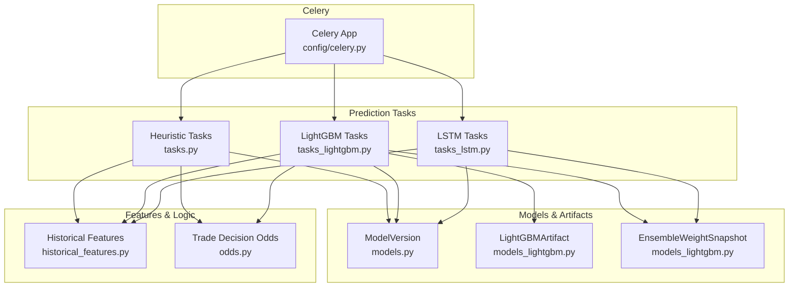
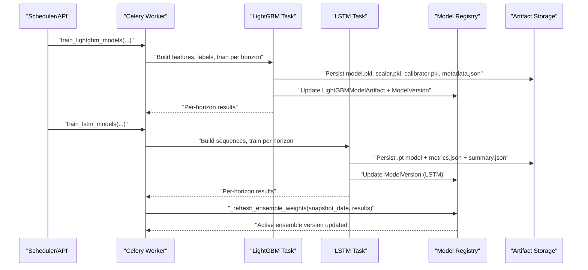
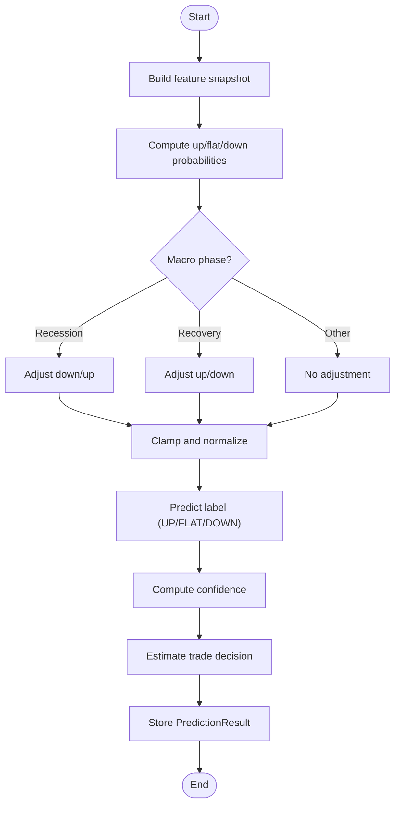
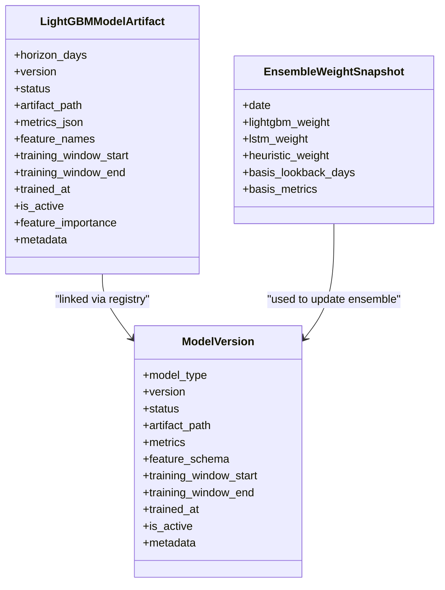
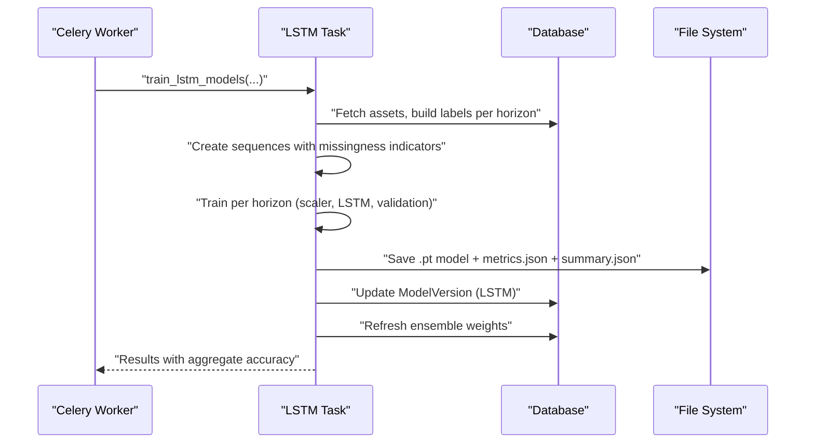
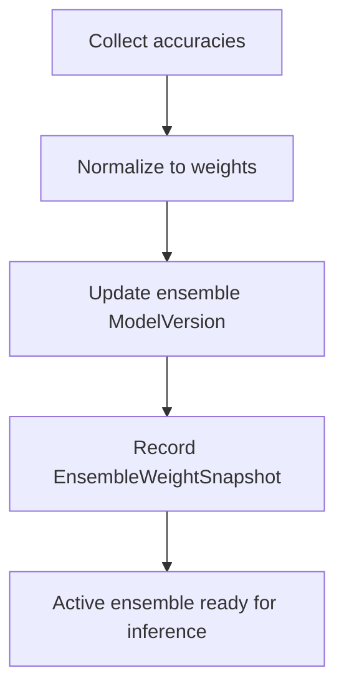
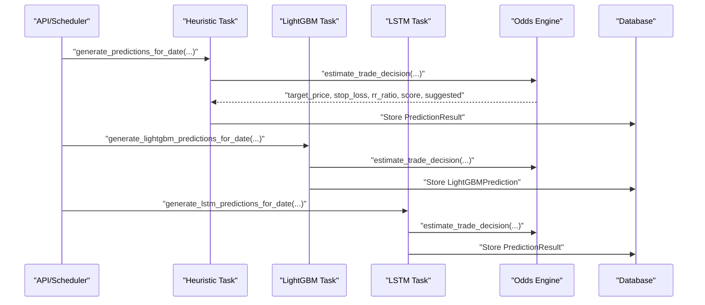
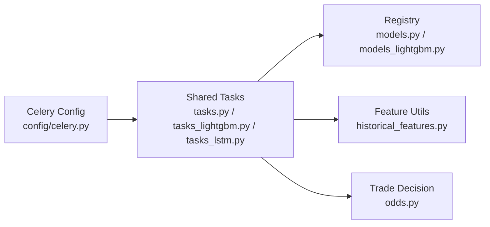

# Model Training Pipeline

<cite>
**Referenced Files in This Document**
- [tasks.py](file://apps/prediction/tasks.py)
- [tasks_lightgbm.py](file://apps/prediction/tasks_lightgbm.py)
- [tasks_lstm.py](file://apps/prediction/tasks_lstm.py)
- [models.py](file://apps/prediction/models.py)
- [models_lightgbm.py](file://apps/prediction/models_lightgbm.py)
- [historical_features.py](file://apps/prediction/historical_features.py)
- [odds.py](file://apps/prediction/odds.py)
- [celery.py](file://config/celery.py)
</cite>

## Table of Contents
1. [Introduction](#introduction)
2. [Project Structure](#project-structure)
3. [Core Components](#core-components)
4. [Architecture Overview](#architecture-overview)
5. [Detailed Component Analysis](#detailed-component-analysis)
6. [Dependency Analysis](#dependency-analysis)
7. [Performance Considerations](#performance-considerations)
8. [Troubleshooting Guide](#troubleshooting-guide)
9. [Conclusion](#conclusion)
10. [Appendices](#appendices)

## Introduction
This document describes the distributed model training and inference pipeline that orchestrates heuristic, LightGBM, and LSTM model training across Celery workers. It covers task architecture, feature engineering, cross-validation and calibration, hyperparameter configuration, artifact serialization, ensemble weight optimization, evaluation metrics, error handling, monitoring hooks, and integration with the model registry for deployment workflows.

The system supports:
- Heuristic baseline predictions using technical indicators, factors, sentiment, and macro context.
- Gradient-boosted tree models (LightGBM) trained per horizon with calibration and optional feature pruning based on importance snapshots.
- Sequence-based deep learning models (LSTM) trained per horizon with missingness-aware features and PyTorch training loops.
- Ensemble orchestration that combines outputs from heuristic, LightGBM, and LSTM models with dynamically updated weights.

## Project Structure
The prediction app contains:
- Task modules for training and inference:
  - Heuristic baseline tasks and utilities
  - LightGBM training, inference, artifacts, and feature engineering
  - LSTM training, inference, artifacts, and sequence construction
- Data models for model versions, predictions, and artifacts
- Feature extraction helpers and trade decision logic
- Celery configuration for distributed execution

**Diagram sources**
- [celery.py:1-17](file://config/celery.py#L1-L17)
- [tasks.py:1-327](file://apps/prediction/tasks.py#L1-L327)
- [tasks_lightgbm.py:1-2304](file://apps/prediction/tasks_lightgbm.py#L1-L2304)
- [tasks_lstm.py:1-967](file://apps/prediction/tasks_lstm.py#L1-L967)
- [models.py:1-107](file://apps/prediction/models.py#L1-L107)
- [models_lightgbm.py:1-137](file://apps/prediction/models_lightgbm.py#L1-L137)
- [historical_features.py:1-397](file://apps/prediction/historical_features.py#L1-L397)
- [odds.py:1-158](file://apps/prediction/odds.py#L1-L158)

**Section sources**
- [celery.py:1-17](file://config/celery.py#L1-L17)
- [tasks.py:1-327](file://apps/prediction/tasks.py#L1-L327)
- [tasks_lightgbm.py:1-2304](file://apps/prediction/tasks_lightgbm.py#L1-L2304)
- [tasks_lstm.py:1-967](file://apps/prediction/tasks_lstm.py#L1-L967)
- [models.py:1-107](file://apps/prediction/models.py#L1-L107)
- [models_lightgbm.py:1-137](file://apps/prediction/models_lightgbm.py#L1-L137)
- [historical_features.py:1-397](file://apps/prediction/historical_features.py#L1-L397)
- [odds.py:1-158](file://apps/prediction/odds.py#L1-L158)

## Core Components
- Heuristic baseline: Computes probabilities from factor scores, sentiment, RSI, momentum, and relative strength; adjusts by macro phase; stores predictions linked to an active ensemble model version.
- LightGBM pipeline: Builds a comprehensive feature matrix, creates labels based on forward returns, trains per-horizon models with scaling and Platt calibration, optionally prunes features via importance snapshots, persists artifacts, updates registry, and refreshes ensemble weights.
- LSTM pipeline: Constructs sequences with missingness indicators, trains per-horizon networks with validation accuracy tracking, persists PyTorch artifacts, updates registry, and refreshes ensemble weights.
- Trade decision engine: Derives target price, stop loss, risk-reward ratio, trade score, and suggestion flags using recent OHLCV, Bollinger Bands, moving averages, and policy thresholds.
- Model registry: Tracks model versions, statuses, artifacts, metrics, feature schemas, training windows, and metadata for all model types.

**Section sources**
- [tasks.py:19-174](file://apps/prediction/tasks.py#L19-L174)
- [tasks_lightgbm.py:163-730](file://apps/prediction/tasks_lightgbm.py#L163-L730)
- [tasks_lstm.py:41-827](file://apps/prediction/tasks_lstm.py#L41-L827)
- [odds.py:60-158](file://apps/prediction/odds.py#L60-L158)
- [models.py:7-107](file://apps/prediction/models.py#L7-L107)
- [models_lightgbm.py:7-137](file://apps/prediction/models_lightgbm.py#L7-L137)

## Architecture Overview
The pipeline is orchestrated by Celery shared tasks that run on worker processes. Each model type has dedicated training and inference tasks. The ensemble layer aggregates results and maintains dynamic weights based on recent performance.

**Diagram sources**
- [tasks_lightgbm.py:1849-2098](file://apps/prediction/tasks_lightgbm.py#L1849-L2098)
- [tasks_lstm.py:592-827](file://apps/prediction/tasks_lstm.py#L592-L827)
- [tasks_lightgbm.py:586-730](file://apps/prediction/tasks_lightgbm.py#L586-L730)
- [models.py:7-31](file://apps/prediction/models.py#L7-L31)
- [models_lightgbm.py:7-38](file://apps/prediction/models_lightgbm.py#L7-L38)

## Detailed Component Analysis

### Heuristic Baseline Training and Prediction
- Feature snapshot: Aggregates composite factor score, bottom probability, sentiment score, RSI, 5-day momentum, and relative strength score.
- Probability computation: Combines signals with horizon-specific scaling and macro-phase adjustments; clamps probabilities and normalizes to sum to one.
- Label and confidence: Predicts UP/FLAT/DOWN based on dominant probability; confidence derived from margin between top two classes.
- Ensemble versioning: Ensures an active ensemble model version exists for the target date and records feature schema and metrics.
- Prediction storage: Persists up/flat/down probabilities, confidence, predicted label, trade decision fields, macro/event tags, feature payload, and metadata.

**Diagram sources**
- [tasks.py:55-127](file://apps/prediction/tasks.py#L55-L127)
- [tasks.py:177-243](file://apps/prediction/tasks.py#L177-L243)
- [odds.py:60-158](file://apps/prediction/odds.py#L60-L158)

**Section sources**
- [tasks.py:55-174](file://apps/prediction/tasks.py#L55-L174)
- [tasks.py:177-327](file://apps/prediction/tasks.py#L177-L327)
- [odds.py:60-158](file://apps/prediction/odds.py#L60-L158)

### LightGBM Training Pipeline
- Feature matrix construction:
  - Pulls OHLCV, technical indicators (RSI, MOM, RS_SCORE, returns, relative volume, realized volatility), factor scores, sentiment, macro context, and market phases.
  - Applies trading-date validity masks and gap checks to ensure indicator freshness.
  - Generates lag and delta features for RSI, momentum, and RS score across multiple windows.
  - Adds interaction features and merges macro/context data via time-aligned joins.
- Label creation:
  - Computes forward returns over each horizon and assigns UP/FLAT/DOWN based on thresholds.
- Training loop:
  - Scales features, trains LightGBM multiclass model, applies Platt calibration or identity fallback.
  - Computes accuracy, extracts feature importance, and persists artifacts (model, scaler, calibrator, metadata).
  - Updates LightGBMModelArtifact and ModelVersion registries; stores feature importance snapshots.
- Optional feature pruning:
  - Uses latest active artifact’s feature importance snapshots to select top features by cumulative importance within min/max bounds.
- Ensemble weight refresh:
  - Aggregates accuracies from LightGBM, heuristic, and LSTM to compute normalized weights and update ensemble version.

**Diagram sources**
- [models_lightgbm.py:7-38](file://apps/prediction/models_lightgbm.py#L7-L38)
- [models.py:7-31](file://apps/prediction/models.py#L7-L31)
- [models_lightgbm.py:97-110](file://apps/prediction/models_lightgbm.py#L97-L110)

**Section sources**
- [tasks_lightgbm.py:1162-1760](file://apps/prediction/tasks_lightgbm.py#L1162-L1760)
- [tasks_lightgbm.py:1763-1843](file://apps/prediction/tasks_lightgbm.py#L1763-L1843)
- [tasks_lightgbm.py:1849-2098](file://apps/prediction/tasks_lightgbm.py#L1849-L2098)
- [tasks_lightgbm.py:477-579](file://apps/prediction/tasks_lightgbm.py#L477-L579)
- [tasks_lightgbm.py:586-730](file://apps/prediction/tasks_lightgbm.py#L586-L730)

### LSTM Training Pipeline
- Sequence construction:
  - Builds sequences of fixed length per asset using base features plus missingness indicators appended for each feature.
  - Aligns labels by horizon and filters incomplete sequences.
- Training loop:
  - Splits into train/validation sets chronologically, fits StandardScaler on flattened sequences, trains LSTM with Adam optimizer and CrossEntropyLoss.
  - Tracks best validation accuracy and saves model state.
- Artifact persistence:
  - Saves PyTorch model state dict, scaler parameters, feature names, sequence length, architecture hyperparameters, and missing value strategy.
  - Writes per-horizon metrics and a summary file.
- Registry and ensemble:
  - Updates ModelVersion for LSTM and refreshes ensemble weights using LightGBM and heuristic accuracies.

**Diagram sources**
- [tasks_lstm.py:109-142](file://apps/prediction/tasks_lstm.py#L109-L142)
- [tasks_lstm.py:473-589](file://apps/prediction/tasks_lstm.py#L473-L589)
- [tasks_lstm.py:592-827](file://apps/prediction/tasks_lstm.py#L592-L827)

**Section sources**
- [tasks_lstm.py:41-142](file://apps/prediction/tasks_lstm.py#L41-L142)
- [tasks_lstm.py:473-589](file://apps/prediction/tasks_lstm.py#L473-L589)
- [tasks_lstm.py:592-827](file://apps/prediction/tasks_lstm.py#L592-L827)

### Ensemble Weight Optimization
- Weight basis:
  - Aggregates recent accuracies from LightGBM, heuristic, and LSTM models.
  - Normalizes to produce weights for each model type.
- Active ensemble version:
  - Creates or updates an ensemble ModelVersion with metrics, feature schema, training window, and metadata including computed weights.
- Snapshot storage:
  - Records daily ensemble weights and basis metrics for retrospective analysis.

**Diagram sources**
- [tasks_lightgbm.py:631-730](file://apps/prediction/tasks_lightgbm.py#L631-L730)
- [tasks.py:129-174](file://apps/prediction/tasks.py#L129-L174)
- [models_lightgbm.py:97-110](file://apps/prediction/models_lightgbm.py#L97-L110)

**Section sources**
- [tasks_lightgbm.py:631-730](file://apps/prediction/tasks_lightgbm.py#L631-L730)
- [tasks.py:129-174](file://apps/prediction/tasks.py#L129-L174)
- [models_lightgbm.py:97-110](file://apps/prediction/models_lightgbm.py#L97-L110)

### Inference and Trade Decision Integration
- Heuristic inference:
  - Computes probabilities per horizon and stores predictions linked to the active ensemble version.
- LightGBM inference:
  - Loads active artifact, extracts features with matching missing-value strategy, scales, predicts, and persists LightGBMPrediction records.
- LSTM inference:
  - Resolves active LSTM model version, builds sequences, normalizes, runs inference, and persists predictions with raw and calibrated scores.
- Trade decision:
  - For each prediction, estimates target price, stop loss, risk-reward ratio, trade score, and suggestion flag using recent OHLCV, Bollinger Bands, moving averages, and policy constraints.

**Diagram sources**
- [tasks.py:177-243](file://apps/prediction/tasks.py#L177-L243)
- [tasks_lightgbm.py:2204-2304](file://apps/prediction/tasks_lightgbm.py#L2204-L2304)
- [tasks_lstm.py:829-967](file://apps/prediction/tasks_lstm.py#L829-L967)
- [odds.py:60-158](file://apps/prediction/odds.py#L60-L158)

**Section sources**
- [tasks.py:177-327](file://apps/prediction/tasks.py#L177-L327)
- [tasks_lightgbm.py:2105-2304](file://apps/prediction/tasks_lightgbm.py#L2105-L2304)
- [tasks_lstm.py:829-967](file://apps/prediction/tasks_lstm.py#L829-L967)
- [odds.py:60-158](file://apps/prediction/odds.py#L60-L158)

## Dependency Analysis
- Celery configuration:
  - Initializes Celery app, loads Django settings under CELERY namespace, and autodiscovers tasks from registered apps.
- Task dependencies:
  - All training and inference tasks are Celery shared tasks executed by workers.
  - Heuristic tasks depend on historical features and odds engine.
  - LightGBM tasks depend on extensive feature engineering, label generation, and artifact management.
  - LSTM tasks depend on sequence building, PyTorch training, and artifact persistence.
- Model registry:
  - ModelVersion tracks all model types and their lifecycle states.
  - LightGBMModelArtifact stores per-horizon artifacts and metrics.
  - EnsembleWeightSnapshot records temporal ensemble weights.

**Diagram sources**
- [celery.py:1-17](file://config/celery.py#L1-L17)
- [tasks.py:1-327](file://apps/prediction/tasks.py#L1-L327)
- [tasks_lightgbm.py:1-2304](file://apps/prediction/tasks_lightgbm.py#L1-L2304)
- [tasks_lstm.py:1-967](file://apps/prediction/tasks_lstm.py#L1-L967)
- [models.py:1-107](file://apps/prediction/models.py#L1-L107)
- [models_lightgbm.py:1-137](file://apps/prediction/models_lightgbm.py#L1-L137)
- [historical_features.py:1-397](file://apps/prediction/historical_features.py#L1-L397)
- [odds.py:1-158](file://apps/prediction/odds.py#L1-L158)

**Section sources**
- [celery.py:1-17](file://config/celery.py#L1-L17)
- [tasks.py:1-327](file://apps/prediction/tasks.py#L1-L327)
- [tasks_lightgbm.py:1-2304](file://apps/prediction/tasks_lightgbm.py#L1-L2304)
- [tasks_lstm.py:1-967](file://apps/prediction/tasks_lstm.py#L1-L967)
- [models.py:1-107](file://apps/prediction/models.py#L1-L107)
- [models_lightgbm.py:1-137](file://apps/prediction/models_lightgbm.py#L1-L137)
- [historical_features.py:1-397](file://apps/prediction/historical_features.py#L1-L397)
- [odds.py:1-158](file://apps/prediction/odds.py#L1-L158)

## Performance Considerations
- Feature caching:
  - Runtime caches reduce repeated database queries for recent OHLCV rows, asset trading context, and feature frames during both training and inference.
- GPU acceleration:
  - LightGBM inference probes for CUDA/GPU device support and uses it when available; LSTM training uses PyTorch device selection with automatic fallback to CPU.
- Data chunking:
  - LSTM training chunks assets to manage memory usage and limits samples per horizon to control dataset size.
- Validation splits:
  - Chronological train/validation splits prevent leakage and enable early stopping via best model state saving.
- Artifact caching:
  - LightGBM artifacts are cached in-process with configurable max entries to speed up repeated inference.

[No sources needed since this section provides general guidance]

## Troubleshooting Guide
- Insufficient data:
  - LightGBM training returns insufficient_data status when training samples fall below threshold.
  - LSTM training returns insufficient_data when not enough sequences are collected or cannot split train/validation.
- Missing indicators:
  - Feature construction validates indicator freshness and gaps; missing values are handled via strategies (legacy fill vs native NaN).
- Model availability:
  - LSTM inference raises an error if no READY model version is available; fallback resolution attempts to find any READY or stub version.
- Error handling:
  - LightGBM training wraps per-horizon training in try/except to capture failures and continue other horizons.
  - Asset existence checks return informative messages when assets are not found.
- Monitoring hooks:
  - Print statements log training progress, version tags, and device selection.
  - Metrics and summaries are persisted to disk and registry for observability.

**Section sources**
- [tasks_lightgbm.py:1952-2098](file://apps/prediction/tasks_lightgbm.py#L1952-L2098)
- [tasks_lstm.py:484-505](file://apps/prediction/tasks_lstm.py#L484-L505)
- [tasks_lstm.py:234-263](file://apps/prediction/tasks_lstm.py#L234-L263)
- [tasks_lightgbm.py:2268-2271](file://apps/prediction/tasks_lightgbm.py#L2268-L2271)
- [tasks_lstm.py:908-911](file://apps/prediction/tasks_lstm.py#L908-L911)

## Conclusion
The pipeline provides a robust, distributed training and inference system for heuristic, LightGBM, and LSTM models. It emphasizes high-quality feature engineering, careful label construction, calibration, artifact management, and ensemble weight optimization. Celery enables scalable execution across workers, while the model registry ensures traceability and deployment readiness. Operational safeguards include data quality checks, error handling, and comprehensive logging and metrics.

[No sources needed since this section summarizes without analyzing specific files]

## Appendices

### Key Entry Points and Tasks
- Heuristic baseline:
  - Train/update ensemble baseline and generate predictions for dates/assets.
- LightGBM:
  - Train models per horizon, generate predictions for dates/assets.
- LSTM:
  - Train models per horizon, generate predictions for dates/assets.

**Section sources**
- [tasks.py:149-174](file://apps/prediction/tasks.py#L149-L174)
- [tasks.py:177-327](file://apps/prediction/tasks.py#L177-L327)
- [tasks_lightgbm.py:1849-2098](file://apps/prediction/tasks_lightgbm.py#L1849-L2098)
- [tasks_lightgbm.py:2204-2304](file://apps/prediction/tasks_lightgbm.py#L2204-L2304)
- [tasks_lstm.py:592-827](file://apps/prediction/tasks_lstm.py#L592-L827)
- [tasks_lstm.py:829-967](file://apps/prediction/tasks_lstm.py#L829-L967)