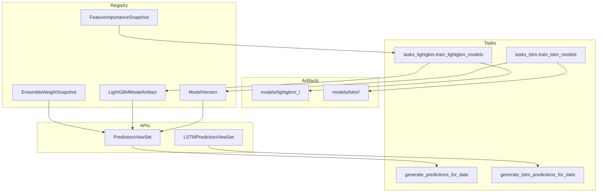
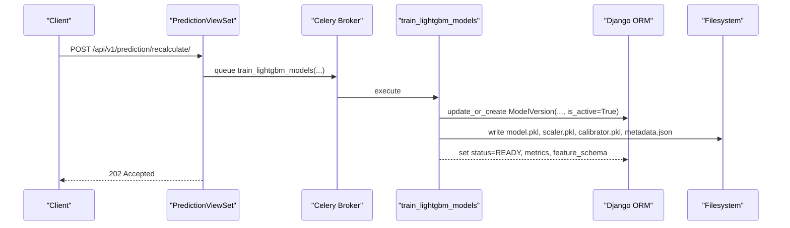
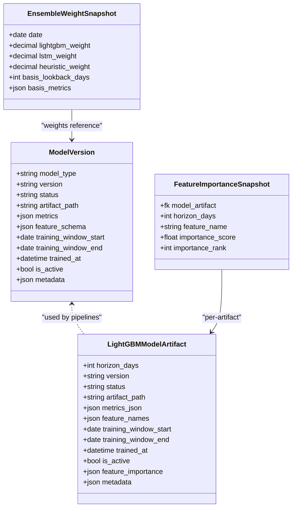
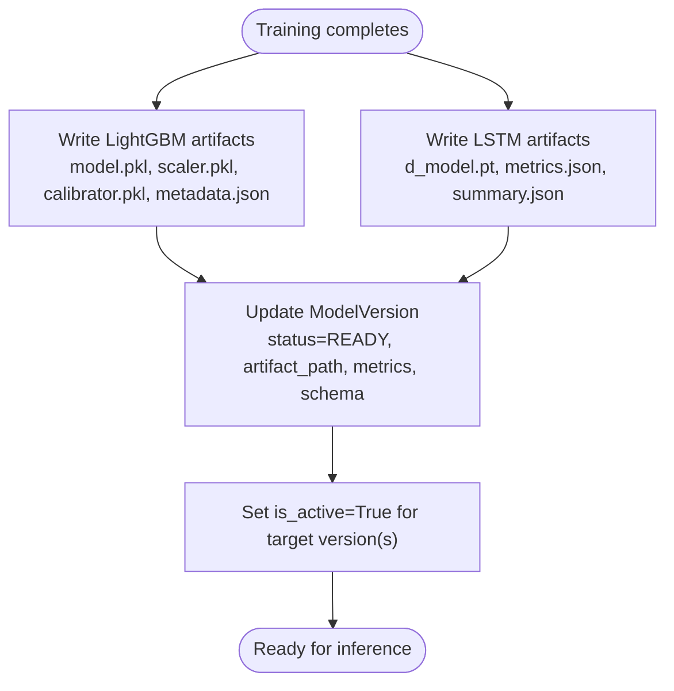
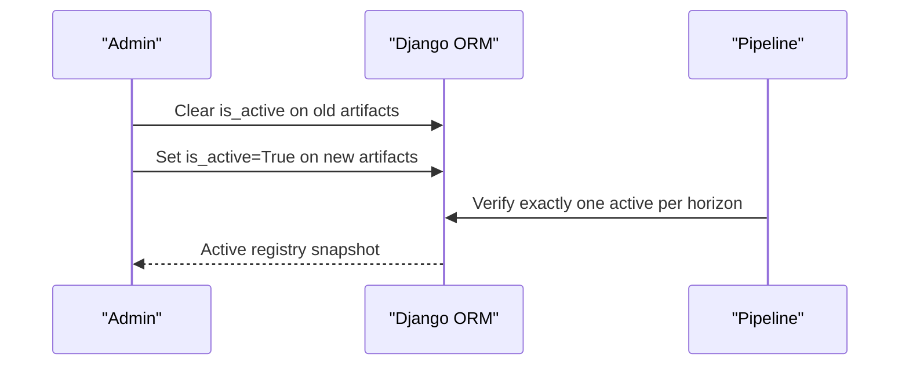
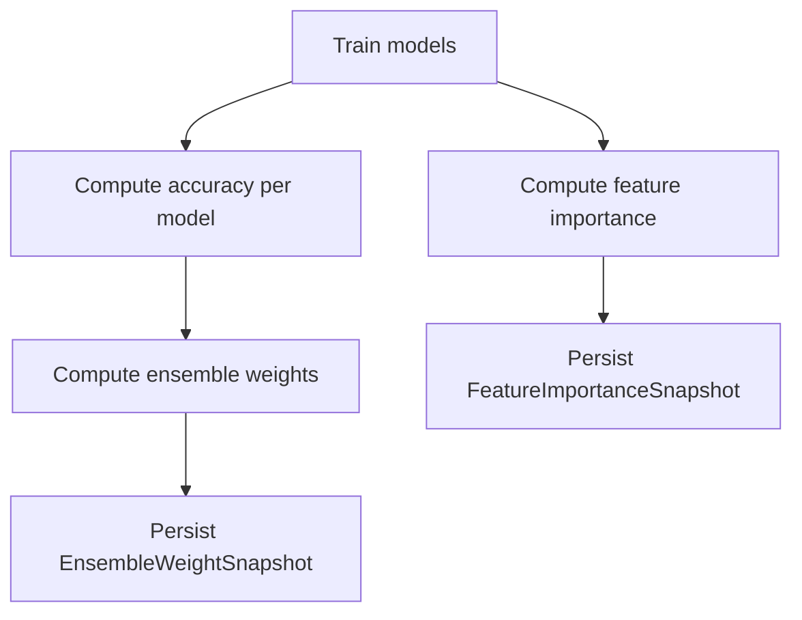
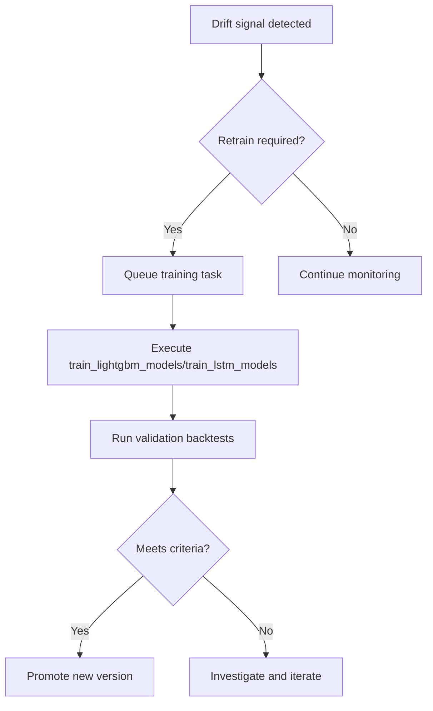
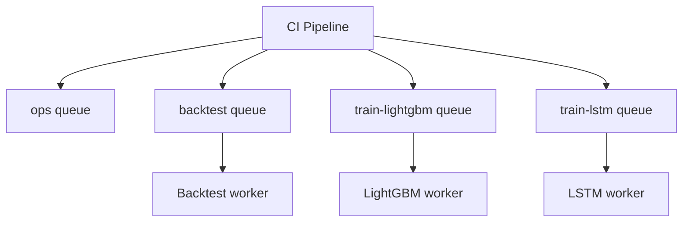
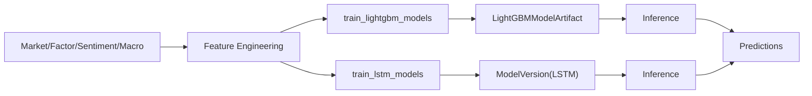
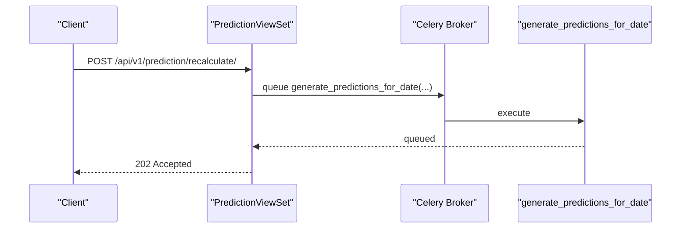

# Model Versioning & Registry

<cite>
**Referenced Files in This Document**
- [models.py](file://apps/prediction/models.py)
- [models_lightgbm.py](file://apps/prediction/models_lightgbm.py)
- [tasks.py](file://apps/prediction/tasks.py)
- [tasks_lightgbm.py](file://apps/prediction/tasks_lightgbm.py)
- [tasks_lstm.py](file://apps/prediction/tasks_lstm.py)
- [views.py](file://apps/prediction/views.py)
- [views_lstm.py](file://apps/prediction/views_lstm.py)
- [base.py](file://config/settings/base.py)
- [metadata.json](file://models/lightgbm/30d_lgb-30d-2024-12-31/metadata.json)
- [summary.json](file://models/lstm/lstm-2024-12-31/summary.json)
- [retrain.md](file://docs/how-to/retrain.md)
- [models.md](file://docs/reference/models.md)
</cite>

## Table of Contents
1. Introduction
2. Project Structure
3. Core Components
4. Architecture Overview
5. Detailed Component Analysis
6. Dependency Analysis
7. Performance Considerations
8. Troubleshooting Guide
9. Conclusion
10. Appendices

## Introduction
This document explains the model versioning and registry system that manages ML model artifacts across their lifecycle. It covers:
- The ModelVersion model, its status transitions, metadata tracking, and artifact path management
- File-based storage under models/lightgbm/ and models/lstm/, including metadata files and binaries
- Activation/deactivation workflows, A/B testing support, and rollback mechanisms
- Model performance comparison tools, drift detection signals, and automated retraining triggers
- Integration with CI/CD via Celery queues and commands, plus audit trails for compliance

## Project Structure
The prediction subsystem owns the registry and training/inference pipelines:
- Database registry: ModelVersion (generic), LightGBMModelArtifact (per-horizon LightGBM deployment), EnsembleWeightSnapshot, FeatureImportanceSnapshot
- On-disk artifacts:
  - models/lightgbm/<horizon>_<version>/ containing model.pkl, scaler.pkl, calibrator.pkl, metadata.json
  - models/lstm/<version>/ containing <horizon>d_model.pt, per-horizon metrics JSON, summary.json
- APIs: REST endpoints to trigger training, recalculation, and retrieval of predictions
- Orchestration: Celery tasks routed to dedicated queues for training and backtesting

**Diagram sources**
- [models.py:7-40](file://apps/prediction/models.py#L7-L40)
- [models_lightgbm.py:7-38](file://apps/prediction/models_lightgbm.py#L7-L38)
- [tasks_lightgbm.py:58-156](file://apps/prediction/tasks_lightgbm.py#L58-L156)
- [tasks_lstm.py:33-34](file://apps/prediction/tasks_lstm.py#L33-L34)
- [views.py:15-24](file://apps/prediction/views.py#L15-L24)
- [views_lstm.py:19-27](file://apps/prediction/views_lstm.py#L19-L27)

**Section sources**
- [models.py:7-40](file://apps/prediction/models.py#L7-L40)
- [models_lightgbm.py:7-38](file://apps/prediction/models_lightgbm.py#L7-L38)
- [tasks_lightgbm.py:58-156](file://apps/prediction/tasks_lightgbm.py#L58-L156)
- [tasks_lstm.py:33-34](file://apps/prediction/tasks_lstm.py#L33-L34)
- [views.py:15-24](file://apps/prediction/views.py#L15-L24)
- [views_lstm.py:19-27](file://apps/prediction/views_lstm.py#L19-L27)

## Core Components
- ModelVersion: Central registry for all model types (LIGHTGBM, LSTM, ENSEMBLE). Tracks status, artifact_path, metrics, feature_schema, training windows, timestamps, is_active flag, and arbitrary metadata.
- LightGBMModelArtifact: Per-horizon registry for LightGBM deployments; one active row per horizon controls which artifact inference loads.
- EnsembleWeightSnapshot: Historical ensemble weights over time based on recent accuracies.
- FeatureImportanceSnapshot: Per-feature importance history for a given artifact, used by pruning and drift analysis.

Key behaviors:
- Status transitions: TRAINING → READY or FAILED; READY can be archived later.
- Activation: is_active toggles control which model is live per horizon (LightGBM) or globally (LSTM/ENSEMBLE).
- Metadata: metrics, feature_schema, training_window_start/end, trained_at, and custom metadata are persisted.
- Artifact paths: stored as absolute or relative paths pointing to disk directories containing serialized models and metadata.

**Section sources**
- [models.py:7-40](file://apps/prediction/models.py#L7-L40)
- [models_lightgbm.py:7-38](file://apps/prediction/models_lightgbm.py#L7-L38)
- [models_lightgbm.py:97-137](file://apps/prediction/models_lightgbm.py#L97-L137)

## Architecture Overview
The system separates concerns between registry, artifact storage, orchestration, and API:
- Training tasks persist artifacts to disk and update registry entries
- Inference tasks load artifacts from disk using registry pointers
- APIs expose training/recalculation endpoints and read-only access to versions and predictions
- Celery queues isolate heavy workloads (training vs backtesting vs ops)

**Diagram sources**
- [views.py:152-161](file://apps/prediction/views.py#L152-L161)
- [tasks_lightgbm.py:586-609](file://apps/prediction/tasks_lightgbm.py#L586-L609)
- [tasks_lightgbm.py:95-119](file://apps/prediction/tasks_lightgbm.py#L95-L119)

**Section sources**
- [base.py:174-200](file://config/settings/base.py#L174-L200)
- [views.py:152-161](file://apps/prediction/views.py#L152-L161)
- [tasks_lightgbm.py:586-609](file://apps/prediction/tasks_lightgbm.py#L586-L609)

## Detailed Component Analysis

### ModelVersion and LightGBMModelArtifact
- ModelVersion supports multiple model types and a strict status enum. It records artifact_path, metrics, feature_schema, training windows, and timestamps. Unique constraint on (model_type, version) ensures version identity.
- LightGBMModelArtifact adds per-horizon granularity with unique (horizon_days, version) and an is_active flag to control deployment per horizon. It also stores metrics_json, feature_names, training_window_start/end, trained_at, feature_importance, and metadata.

Status transitions:
- New artifacts start in TRAINING
- Successful training sets READY
- Failed jobs set FAILED
- Archiving moves to ARCHIVED when no longer needed

Activation and deactivation:
- For LightGBM, exactly one active artifact per horizon is allowed; promotion clears previous active flags
- For LSTM/ENSEMBLE, a single active version is maintained at a time

Metadata and artifact path management:
- artifact_path points to on-disk directory containing serialized artifacts and metadata.json
- metrics and feature_schema enable reproducibility and validation

**Diagram sources**
- [models.py:7-40](file://apps/prediction/models.py#L7-L40)
- [models_lightgbm.py:7-38](file://apps/prediction/models_lightgbm.py#L7-L38)
- [models_lightgbm.py:97-137](file://apps/prediction/models_lightgbm.py#L97-L137)

**Section sources**
- [models.py:7-40](file://apps/prediction/models.py#L7-L40)
- [models_lightgbm.py:7-38](file://apps/prediction/models_lightgbm.py#L7-L38)
- [models_lightgbm.py:97-137](file://apps/prediction/models_lightgbm.py#L97-L137)

### File-Based Model Storage Structure
- LightGBM artifacts:
  - Directory naming: models/lightgbm/<horizon>_<version>/
  - Contents: model.pkl, scaler.pkl, calibrator.pkl, metadata.json
  - metadata.json includes horizon_days, version, feature_names, trained_at, training window, parameters, and pruning details
- LSTM artifacts:
  - Directory naming: models/lstm/<version>/
  - Contents: <horizon>d_model.pt per horizon, per-horizon metrics JSON, summary.json aggregating results

**Diagram sources**
- [tasks_lightgbm.py:95-119](file://apps/prediction/tasks_lightgbm.py#L95-L119)
- [tasks_lstm.py:444-470](file://apps/prediction/tasks_lstm.py#L444-L470)
- [tasks_lightgbm.py:586-609](file://apps/prediction/tasks_lightgbm.py#L586-L609)
- [tasks_lstm.py:767-800](file://apps/prediction/tasks_lstm.py#L767-L800)

**Section sources**
- [tasks_lightgbm.py:95-119](file://apps/prediction/tasks_lightgbm.py#L95-L119)
- [tasks_lstm.py:444-470](file://apps/prediction/tasks_lstm.py#L444-L470)
- [metadata.json:1-112](file://models/lightgbm/30d_lgb-30d-2024-12-31/metadata.json#L1-L112)
- [summary.json:1-41](file://models/lstm/lstm-2024-12-31/summary.json#L1-L41)

### Model Activation/Deactivation Workflow
- Promotion: Set is_active=True on new artifacts; clear is_active on incumbents per horizon (LightGBM) or globally (LSTM/ENSEMBLE)
- Deactivation: Clear is_active on current active rows before activating new ones
- Validation: Use export_documentation_facts to verify active artifacts and statuses

**Diagram sources**
- [retrain.md:227-253](file://docs/how-to/retrain.md#L227-L253)
- [tasks_lightgbm.py:586-609](file://apps/prediction/tasks_lightgbm.py#L586-L609)
- [tasks_lstm.py:767-800](file://apps/prediction/tasks_lstm.py#L767-L800)

**Section sources**
- [retrain.md:227-253](file://docs/how-to/retrain.md#L227-L253)
- [tasks_lightgbm.py:586-609](file://apps/prediction/tasks_lightgbm.py#L586-L609)
- [tasks_lstm.py:767-800](file://apps/prediction/tasks_lstm.py#L767-L800)

### A/B Testing Capabilities
- Multiple versions coexist in the registry and on disk
- A/B testing is achieved by routing traffic to different model versions via:
  - Selective activation per horizon (LightGBM)
  - Query-time filtering by model_version or model_type (e.g., LSTM vs ensemble)
  - Backtest runs comparing outputs from different versions

Operational notes:
- Keep inactive versions archived but retained for rollback
- Use feature_schema and metrics to compare behavior and quality across versions

**Section sources**
- [models_lightgbm.py:7-38](file://apps/prediction/models_lightgbm.py#L7-L38)
- [views.py:15-24](file://apps/prediction/views.py#L15-L24)
- [views_lstm.py:48-67](file://apps/prediction/views_lstm.py#L48-L67)

### Rollback Mechanisms
- Rollback is promotion in reverse: identify last known-good version, deactivate bad artifacts, activate previous generation per horizon
- No deletion of artifacts; retention enables immediate rollback without retraining
- Validate rollback by re-running short validation backtests and exporting registry facts

**Section sources**
- [retrain.md:256-272](file://docs/how-to/retrain.md#L256-L272)
- [models.md:13-21](file://docs/reference/models.md#L13-L21)

### Model Performance Comparison Tools
- EnsembleWeightSnapshot tracks historical weights derived from recent accuracies of LightGBM, LSTM, and heuristic components
- FeatureImportanceSnapshot provides per-feature importance history for artifacts, enabling drift and stability analysis
- Backtest framework compares strategies and sources (heuristic, lightgbm, lstm) to assess performance differences

**Diagram sources**
- [tasks_lightgbm.py:631-729](file://apps/prediction/tasks_lightgbm.py#L631-L729)
- [tasks_lightgbm.py:612-628](file://apps/prediction/tasks_lightgbm.py#L612-L628)

**Section sources**
- [tasks_lightgbm.py:631-729](file://apps/prediction/tasks_lightgbm.py#L631-L729)
- [tasks_lightgbm.py:612-628](file://apps/prediction/tasks_lightgbm.py#L612-L628)

### Drift Detection and Automated Retraining Triggers
- Drift signals:
  - Changes in effective universe composition
  - Feature contract changes (new columns, renamed columns, missing-value strategy shifts)
  - Validation backtests showing divergence versus benchmark
  - Data quality repairs that invalidate prior fits
- Automated triggers:
  - Commands orchestrate retraining after data backfills or universe expansions
  - Celery queues route training tasks to isolated workers for reliability

**Diagram sources**
- [retrain.md:10-23](file://docs/how-to/retrain.md#L10-L23)
- [base.py:174-200](file://config/settings/base.py#L174-L200)

**Section sources**
- [retrain.md:10-23](file://docs/how-to/retrain.md#L10-L23)
- [base.py:174-200](file://config/settings/base.py#L174-L200)

### Integration with CI/CD Pipelines
- Celery configuration defines dedicated queues:
  - ops: default operations
  - backtest: backtesting tasks
  - train-lightgbm: LightGBM training
  - train-lstm: LSTM training
- Task routing ensures predictable execution environments and isolation
- Commands provide repeatable workflows for onboarding, retraining, and benchmarking

**Diagram sources**
- [base.py:174-200](file://config/settings/base.py#L174-L200)

**Section sources**
- [base.py:174-200](file://config/settings/base.py#L174-L200)

### Audit Trail for Regulatory Compliance
- Every artifact has:
  - artifact_path pointing to a versioned directory
  - metadata.json (LightGBM) or summary.json (LSTM) capturing training windows, features, parameters, and metrics
  - Registry entries recording status, trained_at, metrics, feature_schema, and metadata
- EnsembleWeightSnapshot and FeatureImportanceSnapshot provide historical context for decisions
- Exported registry snapshots (via documentation facts) serve as auditable state

**Section sources**
- [metadata.json:1-112](file://models/lightgbm/30d_lgb-30d-2024-12-31/metadata.json#L1-L112)
- [summary.json:1-41](file://models/lstm/lstm-2024-12-31/summary.json#L1-L41)
- [models.md:13-21](file://docs/reference/models.md#L13-L21)
- [tasks_lightgbm.py:612-628](file://apps/prediction/tasks_lightgbm.py#L612-L628)

## Dependency Analysis
- Models depend on market, factor, sentiment, and macro data to produce features and labels
- Tasks depend on libraries like LightGBM, scikit-learn, PyTorch, and pandas
- APIs depend on serializers and tasks to orchestrate training and inference
- Settings define Celery queues and routes for reliable execution

**Diagram sources**
- [tasks_lightgbm.py:41-51](file://apps/prediction/tasks_lightgbm.py#L41-L51)
- [tasks_lstm.py:15-30](file://apps/prediction/tasks_lstm.py#L15-L30)
- [models.py:43-97](file://apps/prediction/models.py#L43-L97)

**Section sources**
- [tasks_lightgbm.py:41-51](file://apps/prediction/tasks_lightgbm.py#L41-L51)
- [tasks_lstm.py:15-30](file://apps/prediction/tasks_lstm.py#L15-L30)
- [models.py:43-97](file://apps/prediction/models.py#L43-L97)

## Performance Considerations
- Caching:
  - LightGBM artifact cache with configurable max entries reduces repeated disk reads
  - Runtime caches for OHLCV rows and asset trading context minimize database queries
- GPU acceleration:
  - Probing and caching GPU device for LightGBM predict when supported
- Sequence handling:
  - LSTM sequences built per asset with chunked processing and DataLoader batching
- Pruning:
  - Snapshot-based feature pruning retains top features by cumulative importance while enforcing min/max bounds

**Section sources**
- [tasks_lightgbm.py:69-75](file://apps/prediction/tasks_lightgbm.py#L69-L75)
- [tasks_lightgbm.py:183-278](file://apps/prediction/tasks_lightgbm.py#L183-L278)
- [tasks_lightgbm.py:477-579](file://apps/prediction/tasks_lightgbm.py#L477-L579)
- [tasks_lstm.py:109-155](file://apps/prediction/tasks_lstm.py#L109-L155)

## Troubleshooting Guide
Common issues and resolutions:
- No active LightGBM artifact for horizon:
  - Ensure exactly one active artifact per horizon exists; promote if necessary
- No READY LSTM model available:
  - Check for READY LSTM versions excluding stub sources; fallback logic may raise errors if none found
- Artifact path resolution failures:
  - Absolute paths may not resolve across machines; retrain to rewrite paths
- Missing features or schema mismatch:
  - Validate feature_schema against current inputs; use pruning plans to align feature sets
- Drift detected:
  - Trigger retraining based on documented triggers; validate with backtests before promotion

**Section sources**
- [tasks_lightgbm.py:586-609](file://apps/prediction/tasks_lightgbm.py#L586-L609)
- [tasks_lstm.py:234-262](file://apps/prediction/tasks_lstm.py#L234-L262)
- [models.md:118-119](file://docs/reference/models.md#L118-L119)
- [retrain.md:10-23](file://docs/how-to/retrain.md#L10-L23)

## Conclusion
The model versioning and registry system provides a robust foundation for managing ML artifacts across their lifecycle. It combines a clear database registry with durable file-based storage, supports activation/deactivation and rollback, enables A/B testing through version coexistence, and integrates with CI/CD via Celery queues. Performance optimizations such as caching and GPU probing, along with feature pruning and ensemble weighting, ensure efficient and reliable operations. Audit trails via metadata and snapshots support regulatory compliance and traceability.

## Appendices

### API Workflows for Retraining and Recalculation
- PredictionViewSet exposes endpoints to trigger retraining and recalculation asynchronously
- LSTMPredictionViewSet provides similar endpoints for LSTM-specific workflows

**Diagram sources**
- [views.py:152-161](file://apps/prediction/views.py#L152-L161)
- [tasks.py:177-243](file://apps/prediction/tasks.py#L177-L243)

**Section sources**
- [views.py:152-161](file://apps/prediction/views.py#L152-L161)
- [views_lstm.py:93-117](file://apps/prediction/views_lstm.py#L93-L117)
- [tasks.py:177-243](file://apps/prediction/tasks.py#L177-L243)