# Prediction Application

<cite>
**Referenced Files in This Document**
- [models.py](file://apps/prediction/models.py)
- [historical_features.py](file://apps/prediction/historical_features.py)
- [odds.py](file://apps/prediction/odds.py)
- [tasks.py](file://apps/prediction/tasks.py)
- [views.py](file://apps/prediction/views.py)
- [models_lightgbm.py](file://apps/prediction/models_lightgbm.py)
- [tasks_lightgbm.py](file://apps/prediction/tasks_lightgbm.py)
- [views_lightgbm.py](file://apps/prediction/views_lightgbm.py)
- [tasks_lstm.py](file://apps/prediction/tasks_lstm.py)
- [views_lstm.py](file://apps/prediction/views_lstm.py)
- [models.py (factors)](file://apps/factors/models.py)
- [models.py (analytics)](file://apps/analytics/models.py)
- [models.py (backtest)](file://apps/backtest/models.py)
</cite>

## Table of Contents
1. [Introduction](#introduction)
2. [Project Structure](#project-structure)
3. [Core Components](#core-components)
4. [Architecture Overview](#architecture-overview)
5. [Detailed Component Analysis](#detailed-component-analysis)
6. [Dependency Analysis](#dependency-analysis)
7. [Performance Considerations](#performance-considerations)
8. [Troubleshooting Guide](#troubleshooting-guide)
9. [Conclusion](#conclusion)

## Introduction
This document explains the Prediction application’s multi-model machine learning pipelines that produce trade-oriented predictions for assets across multiple horizons. It covers:
- The PredictionResult model and its trade decision fields, confidence scoring, and ensemble weighting.
- Heuristic, LightGBM, and LSTM model implementations and how they integrate into a unified prediction surface.
- Feature engineering via HistoricalFeatures and integration with Factors and Analytics apps.
- Odds calculation algorithms that derive target prices, stop-loss levels, risk-reward ratios, and trade scores.
- Model training workflows, artifact versioning, and distributed task architecture using Celery.
- Backtesting interface for strategy validation and monitoring capabilities for model performance tracking.

## Project Structure
The Prediction app is organized around three parallel model backends (heuristic baseline, LightGBM, LSTM), a shared feature pipeline, and an odds engine that converts probabilities into actionable trade decisions. Supporting models track artifacts, predictions, and ensemble weights.

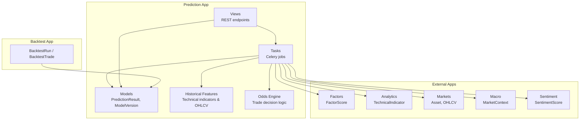

**Diagram sources**
- [views.py:27-162](file://apps/prediction/views.py#L27-L162)
- [tasks.py:149-327](file://apps/prediction/tasks.py#L149-L327)
- [models.py:7-107](file://apps/prediction/models.py#L7-L107)
- [historical_features.py:15-397](file://apps/prediction/historical_features.py#L15-L397)
- [odds.py:60-158](file://apps/prediction/odds.py#L60-L158)
- [models.py (factors):124-176](file://apps/factors/models.py#L124-L176)
- [models.py (analytics):8-43](file://apps/analytics/models.py#L8-L43)
- [models.py (backtest):24-168](file://apps/backtest/models.py#L24-L168)

**Section sources**
- [views.py:27-162](file://apps/prediction/views.py#L27-L162)
- [tasks.py:149-327](file://apps/prediction/tasks.py#L149-L327)
- [models.py:7-107](file://apps/prediction/models.py#L7-L107)
- [historical_features.py:15-397](file://apps/prediction/historical_features.py#L15-L397)
- [odds.py:60-158](file://apps/prediction/odds.py#L60-L158)
- [models.py (factors):124-176](file://apps/factors/models.py#L124-L176)
- [models.py (analytics):8-43](file://apps/analytics/models.py#L8-L43)
- [models.py (backtest):24-168](file://apps/backtest/models.py#L24-L168)

## Core Components
- PredictionResult: Stores per-asset, per-date, per-horizon predictions including up/flat/down probabilities, confidence, predicted label, target price, stop loss, risk-reward ratio, trade score, and suggestion flag. It links to a ModelVersion and captures macro context and feature payloads.
- ModelVersion: Tracks model type (LightGBM, LSTM, Ensemble), version, status, artifact path, metrics, feature schema, training window, and active flag.
- Heuristic baseline: Computes probabilities from factor scores, sentiment, technical indicators, and macro phase; derives labels and confidence; persists as PredictionResult rows.
- LightGBM backend: Trains gradient-boosted trees per horizon with calibration and feature pruning; stores artifacts and predictions; updates ensemble weights.
- LSTM backend: Trains sequence models on feature sequences per horizon; stores PyTorch artifacts; produces calibrated probabilities and predictions.
- Odds engine: Converts probabilities into target price, stop-loss price, risk-reward ratio, trade score, and suggested flag based on recent price action, Bollinger Bands, moving averages, and policy options.

**Section sources**
- [models.py:43-97](file://apps/prediction/models.py#L43-L97)
- [models.py:7-41](file://apps/prediction/models.py#L7-L41)
- [tasks.py:82-127](file://apps/prediction/tasks.py#L82-L127)
- [tasks_lightgbm.py:586-730](file://apps/prediction/tasks_lightgbm.py#L586-L730)
- [tasks_lstm.py:473-589](file://apps/prediction/tasks_lstm.py#L473-L589)
- [odds.py:60-158](file://apps/prediction/odds.py#L60-L158)

## Architecture Overview
The system exposes REST endpoints to trigger training and inference tasks asynchronously. Tasks assemble features from Factors, Analytics, Markets, Macro, and Sentiment apps, compute probabilities via heuristic or ML models, apply odds calculations, and persist results. Backtests consume current artifacts and features at runtime rather than historical stored predictions to ensure consistent evaluation.

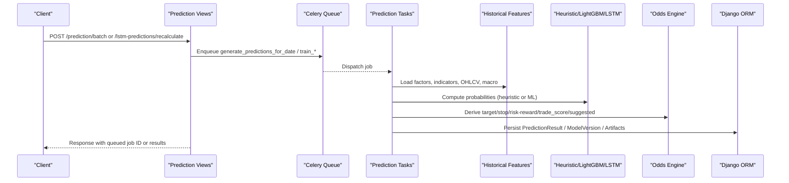

**Diagram sources**
- [views.py:27-162](file://apps/prediction/views.py#L27-L162)
- [tasks.py:149-327](file://apps/prediction/tasks.py#L149-L327)
- [tasks_lightgbm.py:586-730](file://apps/prediction/tasks_lightgbm.py#L586-L730)
- [tasks_lstm.py:592-800](file://apps/prediction/tasks_lstm.py#L592-L800)
- [odds.py:60-158](file://apps/prediction/odds.py#L60-L158)

## Detailed Component Analysis

### PredictionResult and Trade Decisions
- Fields include horizon-specific probabilities (up, flat, down), confidence, predicted label, target price, stop loss, risk-reward ratio, trade score, and suggestion flag.
- Links to ModelVersion to attribute provenance and supports macro phase and event tag tagging for traceability.
- Unique constraints ensure one result per asset/date/horizon/model_version.

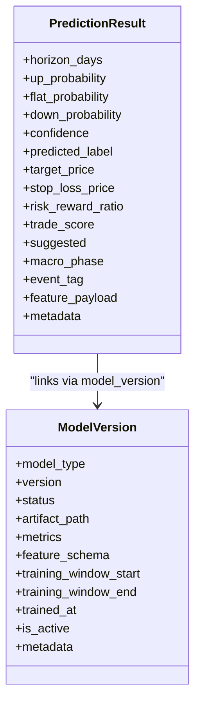

**Diagram sources**
- [models.py:43-97](file://apps/prediction/models.py#L43-L97)
- [models.py:7-41](file://apps/prediction/models.py#L7-L41)

**Section sources**
- [models.py:43-97](file://apps/prediction/models.py#L43-L97)

### Heuristic Model Implementation
- Builds a feature snapshot from FactorScore composite and bottom probability, SentimentScore, RSI, momentum, and RS score.
- Adjusts probabilities by horizon scaling and macro phase shifts; clamps and normalizes to sum to one.
- Derives predicted label as the maximum probability category and confidence as margin between top two probabilities.
- Persists results through Celery tasks and ensures an active ensemble version exists for attribution.

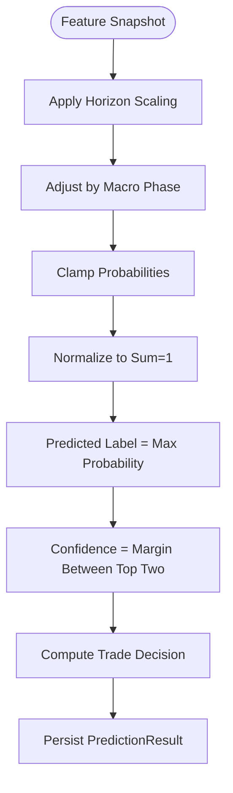

**Diagram sources**
- [tasks.py:55-127](file://apps/prediction/tasks.py#L55-L127)
- [tasks.py:177-243](file://apps/prediction/tasks.py#L177-L243)

**Section sources**
- [tasks.py:55-127](file://apps/prediction/tasks.py#L55-L127)
- [tasks.py:177-243](file://apps/prediction/tasks.py#L177-L243)

### LightGBM Model Implementation
- Feature engineering uses technical indicators, returns, realized volatility, relative volume, factor scores, sentiment, and interaction features.
- Supports missing value strategies and native NaN handling; includes feature pruning based on importance snapshots to retain top features while preserving coverage.
- Training workflow builds sequences/matrices, fits scaler, trains LightGBM with optional GPU acceleration, calibrates probabilities, saves artifacts, registers ModelVersion, and refreshes ensemble weights.
- Inference loads artifacts, constructs features, predicts probabilities, applies odds, and persists LightGBMPrediction rows.

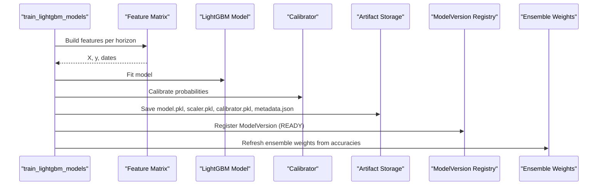

**Diagram sources**
- [tasks_lightgbm.py:586-730](file://apps/prediction/tasks_lightgbm.py#L586-L730)
- [tasks_lightgbm.py:95-156](file://apps/prediction/tasks_lightgbm.py#L95-L156)
- [tasks_lightgbm.py:477-579](file://apps/prediction/tasks_lightgbm.py#L477-L579)

**Section sources**
- [tasks_lightgbm.py:477-579](file://apps/prediction/tasks_lightgbm.py#L477-L579)
- [tasks_lightgbm.py:586-730](file://apps/prediction/tasks_lightgbm.py#L586-L730)
- [models_lightgbm.py:7-137](file://apps/prediction/models_lightgbm.py#L7-L137)

### LSTM Model Implementation
- Constructs sequences from feature matrices with missingness indicators; scales sequences; trains an LSTM classifier with cross-entropy loss; validates accuracy; saves PyTorch artifacts and metrics.
- Inference loads model artifacts, builds sequences for the latest window, normalizes, runs forward pass, computes softmax probabilities, and applies odds to derive trade decisions.
- Persists LSTM predictions in PredictionResult rows linked to LSTM ModelVersion.

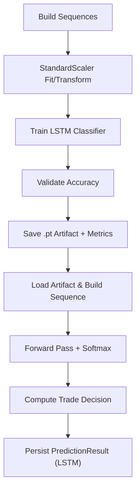

**Diagram sources**
- [tasks_lstm.py:109-142](file://apps/prediction/tasks_lstm.py#L109-L142)
- [tasks_lstm.py:473-589](file://apps/prediction/tasks_lstm.py#L473-L589)
- [tasks_lstm.py:322-441](file://apps/prediction/tasks_lstm.py#L322-L441)

**Section sources**
- [tasks_lstm.py:109-142](file://apps/prediction/tasks_lstm.py#L109-L142)
- [tasks_lstm.py:473-589](file://apps/prediction/tasks_lstm.py#L473-L589)
- [tasks_lstm.py:322-441](file://apps/prediction/tasks_lstm.py#L322-L441)

### Feature Engineering Pipeline (HistoricalFeatures)
- Retrieves technical indicators (RSI, BBANDS, SMA, RS_SCORE) and OHLCV data with staleness checks and parameter compatibility filters.
- Provides helpers for latest values, momentum, returns, realized volatility, and relative volume, all cached per request to reduce database load.
- Ensures trading date alignment and freshness before returning indicator values.

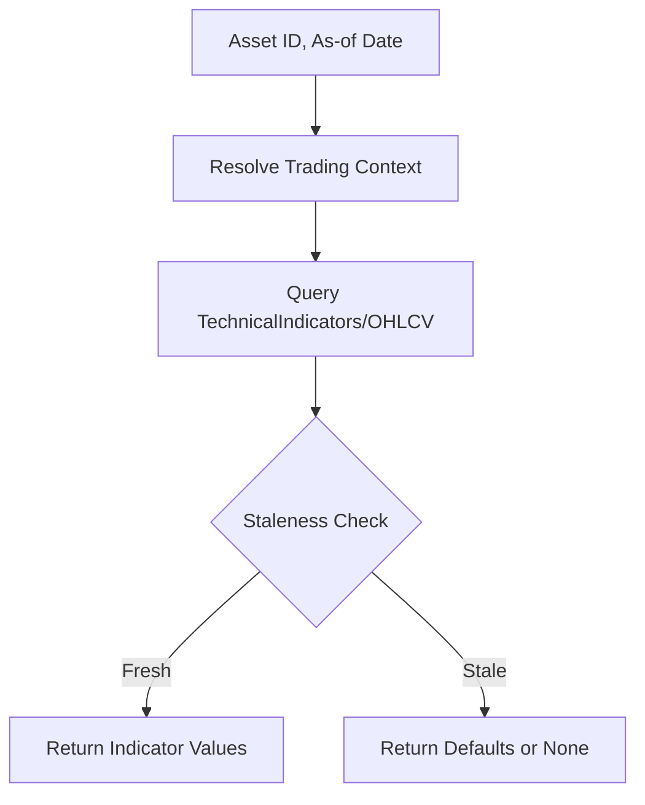

**Diagram sources**
- [historical_features.py:36-48](file://apps/prediction/historical_features.py#L36-L48)
- [historical_features.py:86-139](file://apps/prediction/historical_features.py#L86-L139)
- [historical_features.py:142-179](file://apps/prediction/historical_features.py#L142-L179)
- [historical_features.py:182-397](file://apps/prediction/historical_features.py#L182-L397)

**Section sources**
- [historical_features.py:36-48](file://apps/prediction/historical_features.py#L36-L48)
- [historical_features.py:86-139](file://apps/prediction/historical_features.py#L86-L139)
- [historical_features.py:142-179](file://apps/prediction/historical_features.py#L142-L179)
- [historical_features.py:182-397](file://apps/prediction/historical_features.py#L182-L397)

### Odds Calculation Algorithms
- Uses recent OHLCV highs/lows, Bollinger Bands, and moving averages to identify resistance and support candidates.
- Applies policy options such as minimum target return and minimum stop distance; quantizes prices and ratios.
- Computes reward and risk, derives risk-reward ratio and trade score, and sets suggested flag when thresholds are met.

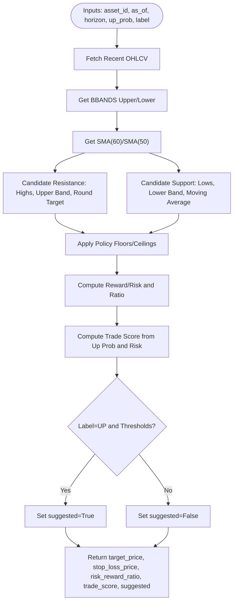

**Diagram sources**
- [odds.py:60-158](file://apps/prediction/odds.py#L60-L158)

**Section sources**
- [odds.py:60-158](file://apps/prediction/odds.py#L60-L158)

### Model Training Workflows and Artifact Versioning
- Heuristic baseline: Ensures an active Ensemble ModelVersion exists for each run; retires legacy stubs; records metrics and feature schema.
- LightGBM: Registers ModelVersion per horizon/version; saves artifacts; stores feature importance snapshots; refreshes ensemble weights based on model accuracies.
- LSTM: Trains per horizon, saves PyTorch artifacts and metrics; registers ModelVersion; aggregates results and accuracy.

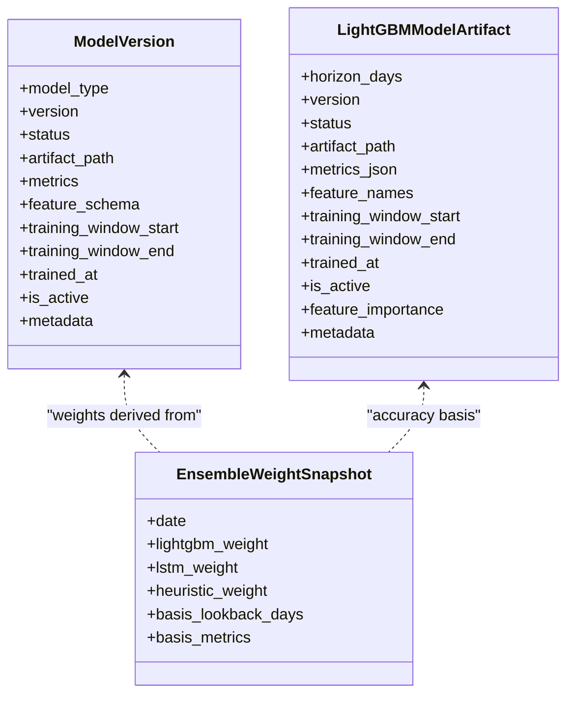

**Diagram sources**
- [models.py:7-41](file://apps/prediction/models.py#L7-L41)
- [models_lightgbm.py:7-137](file://apps/prediction/models_lightgbm.py#L7-L137)
- [tasks_lightgbm.py:586-730](file://apps/prediction/tasks_lightgbm.py#L586-L730)

**Section sources**
- [tasks.py:149-174](file://apps/prediction/tasks.py#L149-L174)
- [tasks_lightgbm.py:586-730](file://apps/prediction/tasks_lightgbm.py#L586-L730)
- [tasks_lstm.py:743-800](file://apps/prediction/tasks_lstm.py#L743-L800)

### Task Architecture for Distributed Training Jobs
- All heavy work is offloaded to Celery shared tasks:
  - Heuristic: generate_predictions_for_date, generate_prediction_for_asset, train_prediction_models.
  - LightGBM: train_lightgbm_models, generate_lightgbm_predictions_for_date, generate_lightgbm_prediction_for_asset.
  - LSTM: train_lstm_models, generate_lstm_predictions_for_date, generate_lstm_prediction_for_asset.
- Views enqueue tasks and return async responses; workers execute jobs independently and persist results.

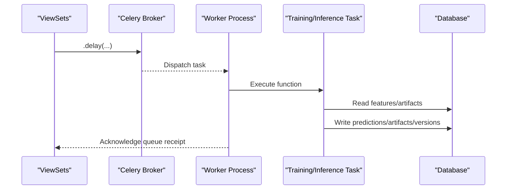

**Diagram sources**
- [views.py:27-162](file://apps/prediction/views.py#L27-L162)
- [views_lightgbm.py:124-282](file://apps/prediction/views_lightgbm.py#L124-L282)
- [views_lstm.py:19-171](file://apps/prediction/views_lstm.py#L19-L171)
- [tasks.py:149-327](file://apps/prediction/tasks.py#L149-L327)
- [tasks_lightgbm.py:586-730](file://apps/prediction/tasks_lightgbm.py#L586-L730)
- [tasks_lstm.py:592-800](file://apps/prediction/tasks_lstm.py#L592-L800)

**Section sources**
- [views.py:27-162](file://apps/prediction/views.py#L27-L162)
- [views_lightgbm.py:124-282](file://apps/prediction/views_lightgbm.py#L124-L282)
- [views_lstm.py:19-171](file://apps/prediction/views_lstm.py#L19-L171)
- [tasks.py:149-327](file://apps/prediction/tasks.py#L149-L327)
- [tasks_lightgbm.py:586-730](file://apps/prediction/tasks_lightgbm.py#L586-L730)
- [tasks_lstm.py:592-800](file://apps/prediction/tasks_lstm.py#L592-L800)

### Integration with Factors and Analytics Apps
- Factors: Composite and bottom probability scores feed heuristic probabilities and influence feature interactions.
- Analytics: Technical indicators (RSI, BBANDS, SMA, RS_SCORE) provide momentum, volatility, and trend signals; staleness checks ensure data freshness.
- MarketContext and SentimentScore adjust probabilities based on macro regime and sentiment.

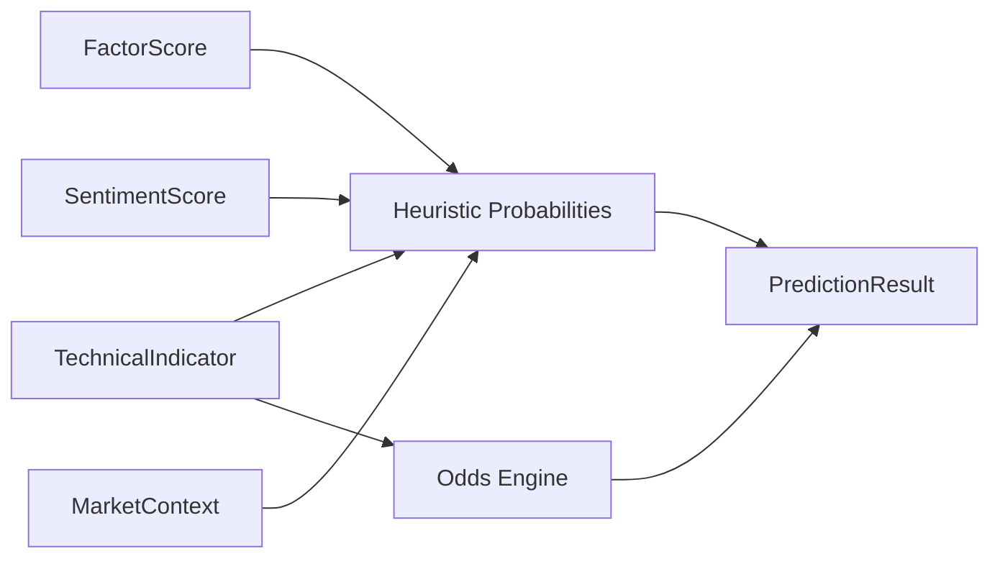

**Diagram sources**
- [tasks.py:55-127](file://apps/prediction/tasks.py#L55-L127)
- [historical_features.py:86-179](file://apps/prediction/historical_features.py#L86-L179)
- [models.py (factors):124-176](file://apps/factors/models.py#L124-L176)
- [models.py (analytics):8-43](file://apps/analytics/models.py#L8-L43)

**Section sources**
- [tasks.py:55-127](file://apps/prediction/tasks.py#L55-L127)
- [historical_features.py:86-179](file://apps/prediction/historical_features.py#L86-L179)
- [models.py (factors):124-176](file://apps/factors/models.py#L124-L176)
- [models.py (analytics):8-43](file://apps/analytics/models.py#L8-L43)

### Backtesting Interface for Strategy Validation
- BacktestRun stores configuration, execution state, and report; BacktestTrade records legs of trades with signal payloads linking to model provenance.
- Backtests recompute candidates at runtime using current artifacts and features, ensuring comparability across runs.
- Endpoints expose lifecycle actions (pause, resume, restart, delete, rerun) and comparison payloads.

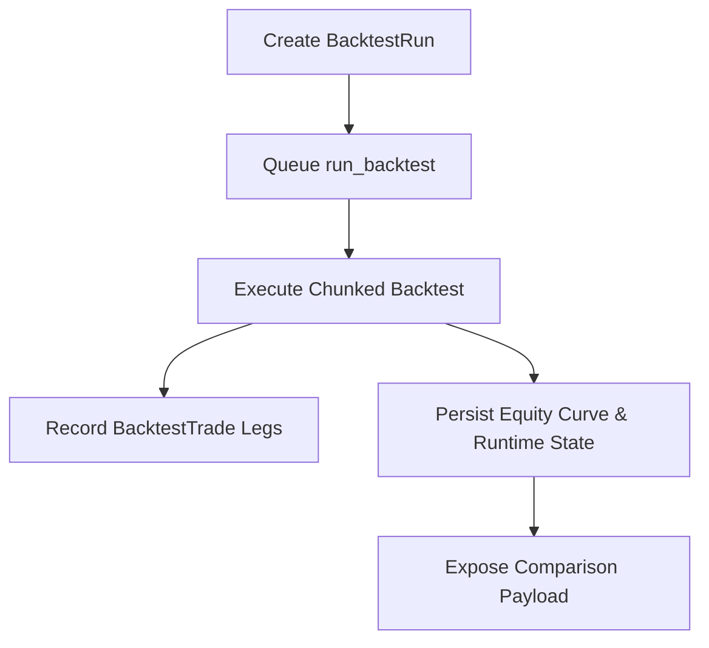

**Diagram sources**
- [models.py (backtest):24-168](file://apps/backtest/models.py#L24-L168)
- [views.py (backtest):1-66](file://apps/backtest/views.py#L1-L66)

**Section sources**
- [models.py (backtest):24-168](file://apps/backtest/models.py#L24-L168)
- [views.py (backtest):1-66](file://apps/backtest/views.py#L1-L66)

### Monitoring Capabilities for Model Performance Tracking
- EnsembleWeightSnapshot tracks daily weights for LightGBM, LSTM, and heuristic models based on recent accuracy metrics.
- FeatureImportanceSnapshot records per-feature importance for LightGBM artifacts, enabling trend analysis and feature drift detection.
- ModelVersion metrics capture accuracy and training windows; artifact paths point to persisted models and metadata.

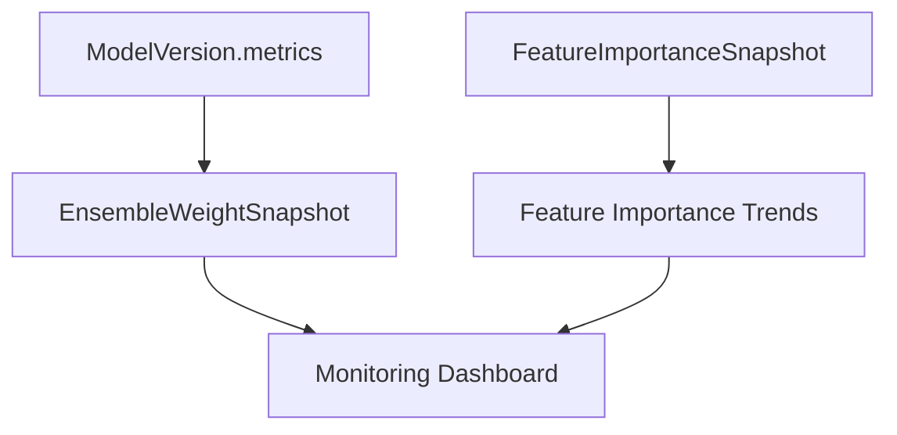

**Diagram sources**
- [models_lightgbm.py:97-137](file://apps/prediction/models_lightgbm.py#L97-L137)
- [tasks_lightgbm.py:631-730](file://apps/prediction/tasks_lightgbm.py#L631-L730)
- [views_lightgbm.py:49-121](file://apps/prediction/views_lightgbm.py#L49-L121)

**Section sources**
- [models_lightgbm.py:97-137](file://apps/prediction/models_lightgbm.py#L97-L137)
- [tasks_lightgbm.py:631-730](file://apps/prediction/tasks_lightgbm.py#L631-L730)
- [views_lightgbm.py:49-121](file://apps/prediction/views_lightgbm.py#L49-L121)

## Dependency Analysis
- Prediction views depend on tasks for asynchronous processing and models for persistence.
- Tasks depend on external apps for features (Factors, Analytics, Markets, Macro, Sentiment).
- LightGBM and LSTM tasks share common utilities for feature matrix creation, labeling, and ensemble weight refresh.
- Backtest depends on current artifacts and features to recompute candidates at runtime.

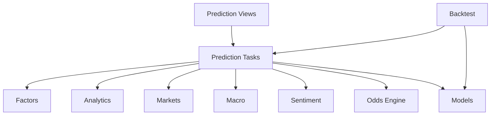

**Diagram sources**
- [views.py:27-162](file://apps/prediction/views.py#L27-L162)
- [tasks.py:149-327](file://apps/prediction/tasks.py#L149-L327)
- [tasks_lightgbm.py:586-730](file://apps/prediction/tasks_lightgbm.py#L586-L730)
- [tasks_lstm.py:592-800](file://apps/prediction/tasks_lstm.py#L592-L800)
- [models.py (backtest):24-168](file://apps/backtest/models.py#L24-L168)

**Section sources**
- [views.py:27-162](file://apps/prediction/views.py#L27-L162)
- [tasks.py:149-327](file://apps/prediction/tasks.py#L149-L327)
- [tasks_lightgbm.py:586-730](file://apps/prediction/tasks_lightgbm.py#L586-L730)
- [tasks_lstm.py:592-800](file://apps/prediction/tasks_lstm.py#L592-L800)
- [models.py (backtest):24-168](file://apps/backtest/models.py#L24-L168)

## Performance Considerations
- Caching: Historical features and LightGBM artifacts use runtime caches to reduce repeated queries and model loads.
- Missing Value Strategies: Native NaN preservation vs legacy neutral fill affects model behavior and feature availability.
- GPU Acceleration: LightGBM inference probes for GPU device types to speed up predictions when available.
- Feature Pruning: Snapshot-based pruning retains top features to balance performance and interpretability.
- Chunked Execution: Backtests and training jobs chunk large datasets to handle long-running tasks robustly.

[No sources needed since this section provides general guidance]

## Troubleshooting Guide
- Stale Indicators: If technical indicators are stale relative to trading dates, functions return defaults or None; verify staleness checks and update pipelines.
- Missing Features: Ensure required parameters match expected parameters; mismatches cause fallback behavior.
- No Active Model Version: For LSTM inference, no READY version raises an error; ensure training completed successfully and versions are registered.
- Insufficient Data: LightGBM and LSTM training may fail if sample counts are too low; check data floors and sequence construction.
- Ensemble Weights: Weights rely on finite accuracies; non-finite values default to safe baselines.

**Section sources**
- [historical_features.py:142-179](file://apps/prediction/historical_features.py#L142-L179)
- [tasks_lstm.py:234-263](file://apps/prediction/tasks_lstm.py#L234-L263)
- [tasks_lightgbm.py:477-579](file://apps/prediction/tasks_lightgbm.py#L477-L579)
- [tasks_lightgbm.py:631-730](file://apps/prediction/tasks_lightgbm.py#L631-L730)

## Conclusion
The Prediction application implements a robust multi-model pipeline combining heuristic, LightGBM, and LSTM approaches to generate trade-oriented predictions. It integrates rich features from Factors and Analytics, applies rigorous odds calculations, and persists results with full provenance via ModelVersion and artifacts. Distributed tasks enable scalable training and inference, while backtesting and monitoring provide strategy validation and performance tracking. Continuous improvements include replacing weaker components, adding new horizons, and enhancing feature usage for stronger predictive power.