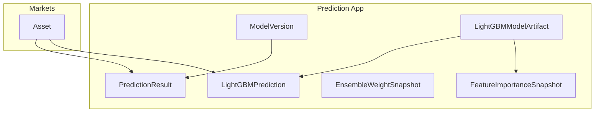
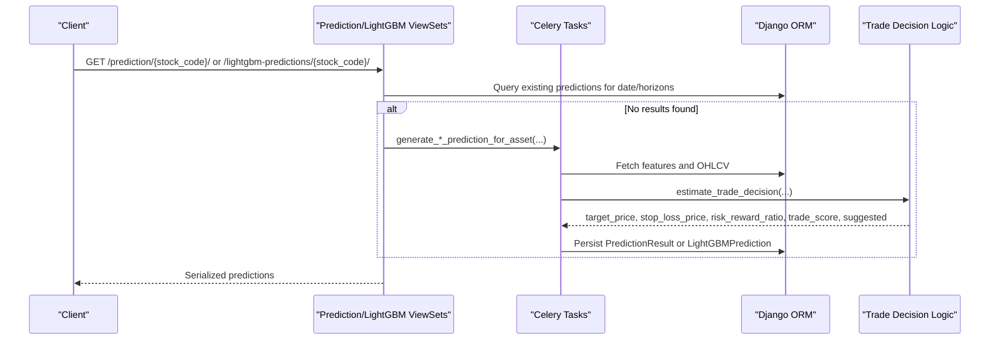
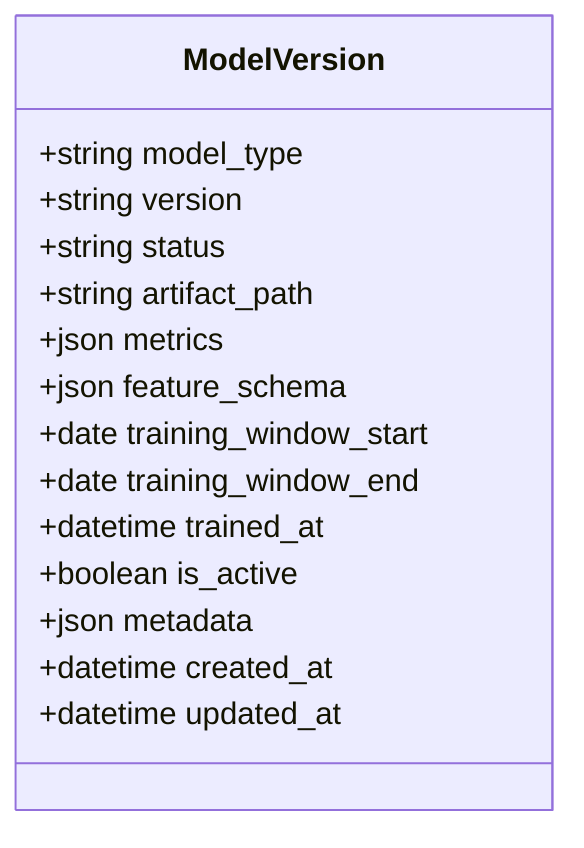
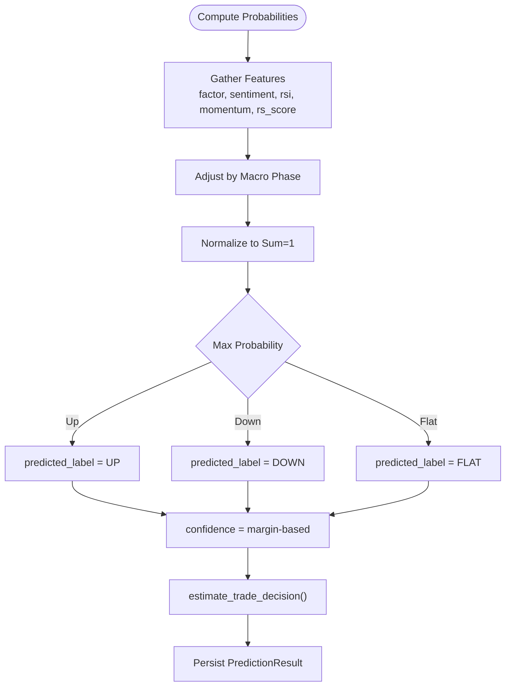
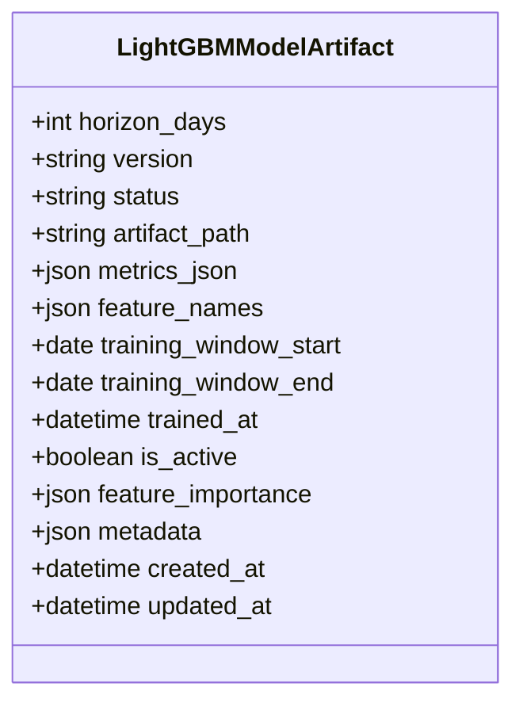
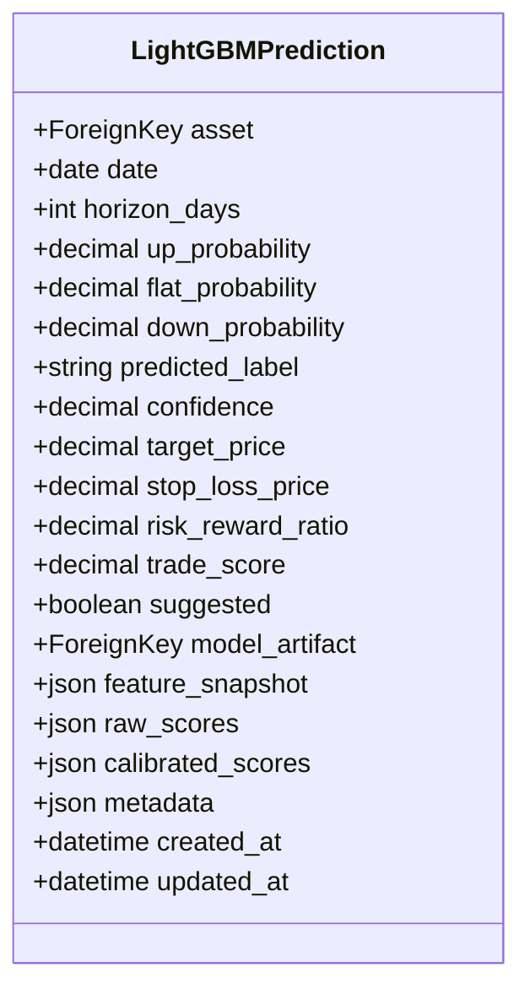
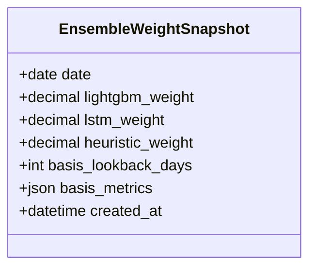
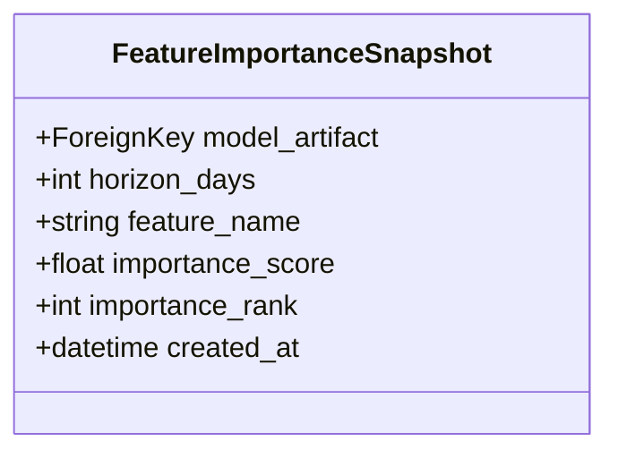
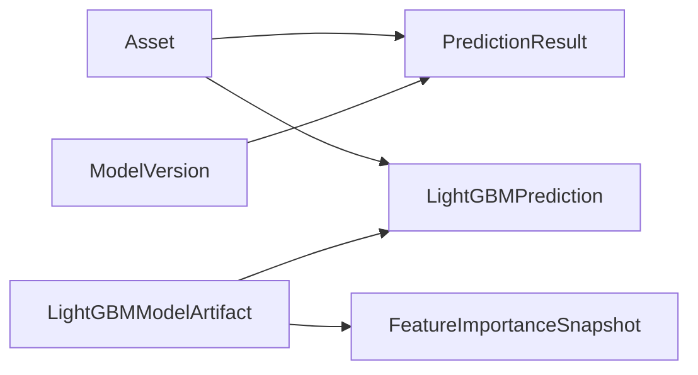

# Prediction Models & Data Structures

<cite>
**Referenced Files in This Document**
- [models.py](file://apps/prediction/models.py)
- [models_lightgbm.py](file://apps/prediction/models_lightgbm.py)
- [serializers.py](file://apps/prediction/serializers.py)
- [serializers_lightgbm.py](file://apps/prediction/serializers_lightgbm.py)
- [views.py](file://apps/prediction/views.py)
- [views_lightgbm.py](file://apps/prediction/views_lightgbm.py)
- [tasks.py](file://apps/prediction/tasks.py)
- [tasks_lightgbm.py](file://apps/prediction/tasks_lightgbm.py)
- [odds.py](file://apps/prediction/odds.py)
- [0001_initial.py](file://apps/prediction/migrations/0001_initial.py)
- [0002_ensembleweightsnapshot_lightgbmmodelartifact_and_more.py](file://apps/prediction/migrations/0002_ensembleweightsnapshot_lightgbmmodelartifact_and_more.py)
- [0003_featureimportancesnapshot.py](file://apps/prediction/migrations/0003_featureimportancesnapshot.py)
- [0004_predictionresult_trade_decision_fields.py](file://apps/prediction/migrations/0004_predictionresult_trade_decision_fields.py)
- [0005_lightgbmprediction_trade_decision_fields.py](file://apps/prediction/migrations/0005_lightgbmprediction_trade_decision_fields.py)
</cite>

## Table of Contents
1. [Introduction](#introduction)
2. [Project Structure](#project-structure)
3. [Core Components](#core-components)
4. [Architecture Overview](#architecture-overview)
5. [Detailed Component Analysis](#detailed-component-analysis)
6. [Dependency Analysis](#dependency-analysis)
7. [Performance Considerations](#performance-considerations)
8. [Troubleshooting Guide](#troubleshooting-guide)
9. [Conclusion](#conclusion)

## Introduction
This document explains the core prediction models and data structures that power the machine learning pipeline for asset return predictions. It focuses on:
- ModelVersion lifecycle states (TRAINING, READY, FAILED, ARCHIVED), artifact management, and metadata tracking
- PredictionResult model including probability calculations (UP/FLAT/DOWN), confidence scoring, trade decision fields (target_price, stop_loss_price, risk_reward_ratio), and horizon-based predictions (3D, 7D, 30D)
- LightGBM-specific models: LightGBMModelArtifact, LightGBMPrediction, EnsembleWeightSnapshot, FeatureImportanceSnapshot
- Database relationships, indexing strategies, and query patterns used to efficiently retrieve predictions and manage model versions

## Project Structure
The prediction subsystem is organized into Django models, serializers, views, and Celery tasks. The key files are:
- Core models: [models.py](file://apps/prediction/models.py), [models_lightgbm.py](file://apps/prediction/models_lightgbm.py)
- API layer: [serializers.py](file://apps/prediction/serializers.py), [serializers_lightgbm.py](file://apps/prediction/serializers_lightgbm.py), [views.py](file://apps/prediction/views.py), [views_lightgbm.py](file://apps/prediction/views_lightgbm.py)
- Inference/training tasks: [tasks.py](file://apps/prediction/tasks.py), [tasks_lightgbm.py](file://apps/prediction/tasks_lightgbm.py)
- Trade decision logic: [odds.py](file://apps/prediction/odds.py)
- Migrations defining schema evolution: [0001_initial.py](file://apps/prediction/migrations/0001_initial.py), [0002_...py](file://apps/prediction/migrations/0002_ensembleweightsnapshot_lightgbmmodelartifact_and_more.py), [0003_featureimportancesnapshot.py](file://apps/prediction/migrations/0003_featureimportancesnapshot.py), [0004_predictionresult_trade_decision_fields.py](file://apps/prediction/migrations/0004_predictionresult_trade_decision_fields.py), [0005_lightgbmprediction_trade_decision_fields.py](file://apps/prediction/migrations/0005_lightgbmprediction_trade_decision_fields.py)

**Diagram sources**
- [models.py:7-97](file://apps/prediction/models.py#L7-L97)
- [models_lightgbm.py:7-137](file://apps/prediction/models_lightgbm.py#L7-L137)

**Section sources**
- [models.py:7-107](file://apps/prediction/models.py#L7-L107)
- [models_lightgbm.py:7-137](file://apps/prediction/models_lightgbm.py#L7-L137)

## Core Components
- ModelVersion: Tracks ML model versions across types (LIGHTGBM, LSTM, ENSEMBLE). Lifecycle states include TRAINING, READY, FAILED, ARCHIVED. Stores artifact paths, metrics, feature schemas, training windows, timestamps, active flag, and arbitrary metadata.
- PredictionResult: Stores heuristic baseline predictions per asset/date/horizon with probabilities (UP/FLAT/DOWN), confidence, predicted label, and trade decision fields (target_price, stop_loss_price, risk_reward_ratio, trade_score, suggested). Links to a ModelVersion and includes macro context and feature payload.
- LightGBMModelArtifact: Registry for trained LightGBM artifacts per horizon and version, with status, artifact path, metrics, feature names, training window, active flag, feature importance summary, and metadata.
- LightGBMPrediction: Daily LightGBM predictions parallel to PredictionResult, including probabilities, label, confidence, trade decision fields, and optional raw/calibrated scores plus feature snapshot.
- EnsembleWeightSnapshot: Time-series of ensemble weights for LightGBM, LSTM, and heuristic components, with basis lookback and metrics.
- FeatureImportanceSnapshot: Per-feature importance history for a LightGBM artifact, enabling trend analysis and feature pruning decisions.

Key database constraints and indexes:
- Unique constraints ensure one version per model type and one artifact per horizon/version.
- Indexes optimize queries by date, horizon, predicted_label, asset combinations, and status/active flags.

**Section sources**
- [models.py:7-97](file://apps/prediction/models.py#L7-L97)
- [models_lightgbm.py:7-137](file://apps/prediction/models_lightgbm.py#L7-L137)
- [0001_initial.py:15-69](file://apps/prediction/migrations/0001_initial.py#L15-L69)
- [0002_ensembleweightsnapshot_lightgbmmodelartifact_and_more.py:14-87](file://apps/prediction/migrations/0002_ensembleweightsnapshot_lightgbmmodelartifact_and_more.py#L14-L87)
- [0003_featureimportancesnapshot.py:13-31](file://apps/prediction/migrations/0003_featureimportancesnapshot.py#L13-L31)
- [0004_predictionresult_trade_decision_fields.py:10-35](file://apps/prediction/migrations/0004_predictionresult_trade_decision_fields.py#L10-L35)
- [0005_lightgbmprediction_trade_decision_fields.py:10-35](file://apps/prediction/migrations/0005_lightgbmprediction_trade_decision_fields.py#L10-L35)

## Architecture Overview
The prediction pipeline has two parallel tracks:
- Heuristic baseline track: generates PredictionResult rows using factor/sentiment/technical features and a simple probability model; links to an ENSEMBLE ModelVersion.
- LightGBM track: trains LightGBMModelArtifact instances per horizon/version, stores feature importance snapshots, and produces LightGBMPrediction rows with calibrated probabilities and trade decision fields.

APIs expose read-only access to model artifacts and predictions, and trigger background tasks for training and recalculation.

**Diagram sources**
- [views.py:37-97](file://apps/prediction/views.py#L37-L97)
- [views_lightgbm.py:136-193](file://apps/prediction/views_lightgbm.py#L136-L193)
- [tasks.py:177-243](file://apps/prediction/tasks.py#L177-L243)
- [tasks_lightgbm.py:586-729](file://apps/prediction/tasks_lightgbm.py#L586-L729)
- [odds.py:60-158](file://apps/prediction/odds.py#L60-L158)

## Detailed Component Analysis

### ModelVersion
- Purpose: Central registry for all model versions (LIGHTGBM, LSTM, ENSEMBLE). Tracks lifecycle state transitions and artifact locations.
- Lifecycle states:
  - TRAINING: Model is being trained or queued.
  - READY: Model is available for inference.
  - FAILED: Training/inference failed; may be retried or archived.
  - ARCHIVED: Retired version kept for historical reference.
- Artifact management: artifact_path points to persisted artifacts (e.g., model binaries, scalers, calibrators). For LightGBM, tasks persist model.pkl, scaler.pkl, calibrator.pkl, and metadata.json under a versioned directory.
- Metadata tracking: JSON fields store metrics, feature_schema, training_window_start/end, trained_at, and arbitrary metadata for provenance and auditability.
- Indexing: db_index on model_type; composite index on (model_type, is_active); unique_together(model_type, version).

**Diagram sources**
- [models.py:7-41](file://apps/prediction/models.py#L7-L41)

**Section sources**
- [models.py:7-41](file://apps/prediction/models.py#L7-L41)
- [0001_initial.py:15-41](file://apps/prediction/migrations/0001_initial.py#L15-L41)

### PredictionResult
- Purpose: Stores baseline heuristic predictions per asset/date/horizon.
- Probability calculations:
  - up_probability, flat_probability, down_probability derived from factor signals, sentiment, momentum, relative strength, and macro phase adjustments. Probabilities are normalized to sum to 1 and clamped within [0,1].
  - predicted_label is UP if up is highest, DOWN if down is highest, otherwise FLAT.
- Confidence scoring:
  - confidence computed from the margin between the top probability and the second-highest probability, then clamped to a reasonable range.
- Horizon-based predictions:
  - Supports D3 (3 days), D7 (7 days), D30 (30 days) via Horizon choices.
- Trade decision fields:
  - target_price, stop_loss_price, risk_reward_ratio, trade_score, suggested are computed by the trade decision engine using recent OHLCV, Bollinger Bands, moving averages, and policy thresholds.
- Relationships and indexing:
  - ForeignKey to Asset and ModelVersion.
  - Indexes on (date, horizon_days, predicted_label) and (asset, date, horizon_days) for efficient retrieval.
  - unique_together(asset, date, horizon_days, model_version) prevents duplicate predictions per version.

**Diagram sources**
- [tasks.py:82-127](file://apps/prediction/tasks.py#L82-L127)
- [tasks.py:196-243](file://apps/prediction/tasks.py#L196-L243)
- [odds.py:60-158](file://apps/prediction/odds.py#L60-L158)

**Section sources**
- [models.py:43-97](file://apps/prediction/models.py#L43-L97)
- [tasks.py:82-127](file://apps/prediction/tasks.py#L82-L127)
- [tasks.py:196-243](file://apps/prediction/tasks.py#L196-L243)
- [odds.py:60-158](file://apps/prediction/odds.py#L60-L158)
- [0001_initial.py:42-69](file://apps/prediction/migrations/0001_initial.py#L42-L69)
- [0004_predictionresult_trade_decision_fields.py:10-35](file://apps/prediction/migrations/0004_predictionresult_trade_decision_fields.py#L10-L35)

### LightGBMModelArtifact
- Purpose: Registry for trained LightGBM artifacts per horizon and version.
- Fields: horizon_days, version, status, artifact_path, metrics_json, feature_names, training_window_start/end, trained_at, is_active, feature_importance (top features), metadata.
- Status lifecycle mirrors ModelVersion (TRAINING, READY, FAILED, ARCHIVED).
- Indexing: db_index on horizon_days; index on (horizon_days, is_active); index on status; unique_together(horizon_days, version).

**Diagram sources**
- [models_lightgbm.py:7-39](file://apps/prediction/models_lightgbm.py#L7-L39)

**Section sources**
- [models_lightgbm.py:7-39](file://apps/prediction/models_lightgbm.py#L7-L39)
- [0002_ensembleweightsnapshot_lightgbmmodelartifact_and_more.py:33-58](file://apps/prediction/migrations/0002_ensembleweightsnapshot_lightgbmmodelartifact_and_more.py#L33-L58)

### LightGBMPrediction
- Purpose: Daily LightGBM-generated predictions parallel to PredictionResult.
- Fields: asset, date, horizon_days, up/flat/down probabilities, predicted_label, confidence, trade decision fields (target_price, stop_loss_price, risk_reward_ratio, trade_score, suggested), model_artifact link, feature_snapshot, raw_scores, calibrated_scores, metadata.
- Indexing: db_index on date and horizon_days; index on (asset, date, horizon_days); unique_together(asset, date, horizon_days, model_artifact).

**Diagram sources**
- [models_lightgbm.py:41-95](file://apps/prediction/models_lightgbm.py#L41-L95)

**Section sources**
- [models_lightgbm.py:41-95](file://apps/prediction/models_lightgbm.py#L41-L95)
- [0002_ensembleweightsnapshot_lightgbmmodelartifact_and_more.py:60-87](file://apps/prediction/migrations/0002_ensembleweightsnapshot_lightgbmmodelartifact_and_more.py#L60-L87)
- [0005_lightgbmprediction_trade_decision_fields.py:10-35](file://apps/prediction/migrations/0005_lightgbmprediction_trade_decision_fields.py#L10-L35)

### EnsembleWeightSnapshot
- Purpose: Tracks daily ensemble weights for LightGBM, LSTM, and heuristic components.
- Fields: date (unique), lightgbm_weight, lstm_weight, heuristic_weight, basis_lookback_days, basis_metrics (accuracy per model over lookback window).
- Used to refresh active ENSEMBLE ModelVersion and inform future weighting strategies.

**Diagram sources**
- [models_lightgbm.py:97-111](file://apps/prediction/models_lightgbm.py#L97-L111)

**Section sources**
- [models_lightgbm.py:97-111](file://apps/prediction/models_lightgbm.py#L97-L111)
- [0002_ensembleweightsnapshot_lightgbmmodelartifact_and_more.py:14-32](file://apps/prediction/migrations/0002_ensembleweightsnapshot_lightgbmmodelartifact_and_more.py#L14-L32)

### FeatureImportanceSnapshot
- Purpose: Historical per-feature importance for a trained LightGBM artifact.
- Fields: model_artifact FK, horizon_days, feature_name, importance_score, importance_rank.
- Indexing: index on (horizon_days, feature_name) and (model_artifact, importance_rank); unique_together(model_artifact, feature_name).
- Enables feature pruning plans based on cumulative importance thresholds and supports trend analysis via API endpoints.

**Diagram sources**
- [models_lightgbm.py:113-137](file://apps/prediction/models_lightgbm.py#L113-L137)

**Section sources**
- [models_lightgbm.py:113-137](file://apps/prediction/models_lightgbm.py#L113-L137)
- [0003_featureimportancesnapshot.py:13-31](file://apps/prediction/migrations/0003_featureimportancesnapshot.py#L13-L31)

## Dependency Analysis
- ModelVersion depends on Asset indirectly through PredictionResult and LightGBMPrediction.
- PredictionResult depends on ModelVersion and Asset.
- LightGBMPrediction depends on LightGBMModelArtifact and Asset.
- FeatureImportanceSnapshot depends on LightGBMModelArtifact.
- EnsembleWeightSnapshot is independent but informs ModelVersion updates during pipeline refresh.

**Diagram sources**
- [models.py:54-81](file://apps/prediction/models.py#L54-L81)
- [models_lightgbm.py:48-75](file://apps/prediction/models_lightgbm.py#L48-L75)
- [models_lightgbm.py:116-121](file://apps/prediction/models_lightgbm.py#L116-L121)

**Section sources**
- [models.py:54-81](file://apps/prediction/models.py#L54-L81)
- [models_lightgbm.py:48-75](file://apps/prediction/models_lightgbm.py#L48-L75)
- [models_lightgbm.py:116-121](file://apps/prediction/models_lightgbm.py#L116-L121)

## Performance Considerations
- Indexing strategy:
  - Frequent filters on date, horizon_days, predicted_label, and asset combinations are supported by explicit indexes.
  - Status and active flags are indexed to quickly locate ready/active models.
- Query patterns:
  - Use select_related('asset', 'model_version') or select_related('asset', 'model_artifact') to reduce N+1 queries when serializing predictions.
  - Batch retrieval grouped by asset symbol minimizes round trips for dashboards and reports.
- Caching:
  - Feature importance trends endpoint caches aggregated results to reduce repeated heavy aggregation.
  - Runtime caches in tasks avoid redundant OHLCV and technical indicator fetches within a single task run.
- Model artifact caching:
  - In-memory cache for LightGBM artifacts improves inference latency with LRU eviction.

[No sources needed since this section provides general guidance]

## Troubleshooting Guide
Common issues and diagnostics:
- Missing predictions:
  - If no results exist for a stock/date/horizon, the view triggers background generation. Check Celery worker logs for task execution and errors.
- Model not ready:
  - Ensure LightGBMModelArtifact or ModelVersion status is READY and is_active is True. Filter by status in API queries if necessary.
- Trade decision fields missing:
  - If latest OHLCV is unavailable or current_close <= 0, trade decision fields will be None and suggested=False. Verify market data availability for the asset/date.
- Probability anomalies:
  - Validate that probabilities are normalized and clamped. Check macro phase adjustments and feature inputs in feature_payload or feature_snapshot.
- Feature importance trends:
  - If no snapshots exist, ensure training completed and snapshots were stored. Use the feature-importance-trends endpoint with appropriate horizon and limit parameters.

**Section sources**
- [views.py:37-97](file://apps/prediction/views.py#L37-L97)
- [views_lightgbm.py:136-193](file://apps/prediction/views_lightgbm.py#L136-L193)
- [tasks.py:177-243](file://apps/prediction/tasks.py#L177-L243)
- [tasks_lightgbm.py:586-729](file://apps/prediction/tasks_lightgbm.py#L586-L729)
- [odds.py:60-158](file://apps/prediction/odds.py#L60-L158)

## Conclusion
The prediction subsystem provides robust, versioned model management and dual-track prediction generation (heuristic baseline and LightGBM). Core entities like ModelVersion, PredictionResult, LightGBMModelArtifact, LightGBMPrediction, EnsembleWeightSnapshot, and FeatureImportanceSnapshot form a cohesive data model supporting lifecycle tracking, artifact persistence, and detailed prediction analytics. Careful indexing and query patterns enable efficient retrieval, while trade decision logic integrates market context to produce actionable targets and risk metrics.