# Sentiment Application

<cite>
**Referenced Files in This Document**
- [models.py](file://apps/sentiment/models.py)
- [providers.py](file://apps/sentiment/providers.py)
- [tasks.py](file://apps/sentiment/tasks.py)
- [views.py](file://apps/sentiment/views.py)
- [serializers.py](file://apps/sentiment/serializers.py)
- [backfill_news.py](file://apps/sentiment/management/commands/backfill_news.py)
- [api.md](file://docs/reference/api.md)
- [factors_models.py](file://apps/factors/models.py)
</cite>

## Table of Contents
1. [Introduction](#introduction)
2. [Project Structure](#project-structure)
3. [Core Components](#core-components)
4. [Architecture Overview](#architecture-overview)
5. [Detailed Component Analysis](#detailed-component-analysis)
6. [Dependency Analysis](#dependency-analysis)
7. [Performance Considerations](#performance-considerations)
8. [Troubleshooting Guide](#troubleshooting-guide)
9. [Conclusion](#conclusion)
10. [Appendices](#appendices)

## Introduction
This document explains the Sentiment application that ingests Chinese-language news, scores sentiment, aggregates signals per asset and market, and exposes APIs for consumption by dashboards and downstream models. It covers:
- The NewsArticle model and how it stores raw articles with provider attribution and concept tags.
- Sentiment scoring at article level and rolling 7-day aggregations for assets and the broader market.
- Concept heat mapping to track trending themes.
- Provider abstraction for multiple news sources with normalization and deduplication.
- Asynchronous task architecture for ingestion, scoring, aggregation, and backfilling historical data.
- Integration with the Factors application where sentiment becomes a factor input influencing composite scores and prediction models.
- Management commands for backfilling historical news and API endpoints for querying sentiment data.

## Project Structure
The Sentiment app is organized around four primary concerns:
- Data models for articles, scores, and concept heat.
- Provider adapters that normalize heterogeneous news feeds into a common item shape.
- Celery tasks that perform ingestion, scoring, aggregation, and backfilling.
- REST views exposing read-only endpoints plus lightweight actions to trigger background work.

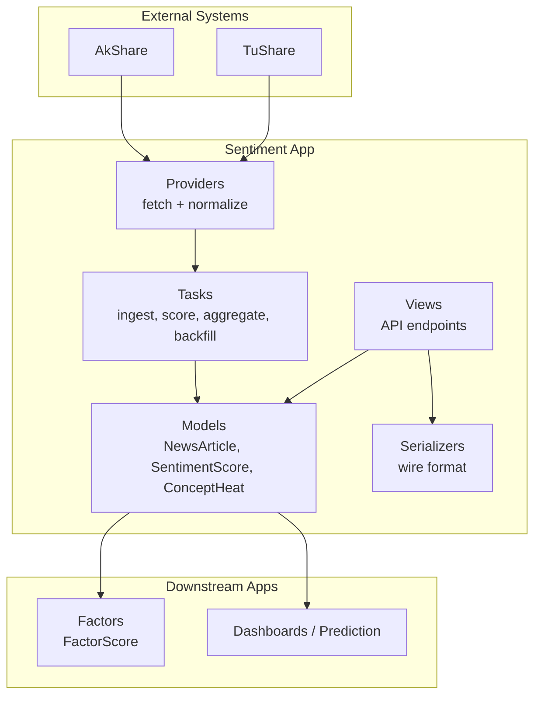

**Diagram sources**
- [models.py:35-125](file://apps/sentiment/models.py#L35-L125)
- [providers.py:221-312](file://apps/sentiment/providers.py#L221-L312)
- [tasks.py:283-565](file://apps/sentiment/tasks.py#L283-L565)
- [views.py:36-122](file://apps/sentiment/views.py#L36-L122)
- [serializers.py:20-54](file://apps/sentiment/serializers.py#L20-L54)
- [factors_models.py:124-176](file://apps/factors/models.py#L124-L176)

**Section sources**
- [models.py:1-125](file://apps/sentiment/models.py#L1-L125)
- [providers.py:1-312](file://apps/sentiment/providers.py#L1-L312)
- [tasks.py:1-565](file://apps/sentiment/tasks.py#L1-L565)
- [views.py:1-122](file://apps/sentiment/views.py#L1-L122)
- [serializers.py:1-54](file://apps/sentiment/serializers.py#L1-L54)

## Core Components
- NewsArticle: Stores normalized news items with source, title, URL (unique), published timestamp, content, summary, language, related assets, concept tags, and metadata. Deduplication relies on URL uniqueness.
- SentimentScore: Holds three scopes in one table distinguished by score_type:
  - ARTICLE: per-article scoring, optional asset link; used for inspection and QA.
  - ASSET_7D: rolling 7-day per-asset aggregation consumed by heuristics and ML models.
  - MARKET_7D: rolling market-wide aggregation for dashboards.
  - Unique constraint across (article, asset, date, score_type) ensures idempotent upserts.
- ConceptHeat: Aggregates inferred concept tags per day to monitor theme activity. Not used by models.

Key behaviors:
- Asset attribution matches articles to assets using name aliases and symbol matching, capped to prevent over-attribution.
- Scoring uses a lexicon-based approach for Chinese financial text, producing positive, neutral, negative components and an overall sentiment score with thresholds for labels.
- Aggregation computes 7-day averages per asset and market, ensuring every listed asset has a row even when no related articles exist.

**Section sources**
- [models.py:35-125](file://apps/sentiment/models.py#L35-L125)
- [tasks.py:97-139](file://apps/sentiment/tasks.py#L97-L139)
- [tasks.py:183-222](file://apps/sentiment/tasks.py#L183-L222)
- [tasks.py:393-521](file://apps/sentiment/tasks.py#L393-L521)

## Architecture Overview
The pipeline consists of ingestion, scoring, aggregation, and exposure layers:

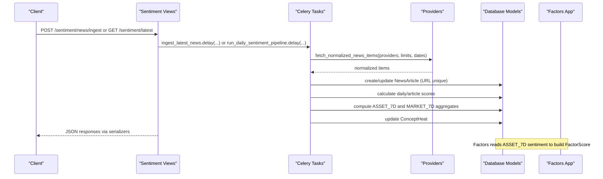

**Diagram sources**
- [views.py:36-98](file://apps/sentiment/views.py#L36-L98)
- [providers.py:221-312](file://apps/sentiment/providers.py#L221-L312)
- [tasks.py:283-565](file://apps/sentiment/tasks.py#L283-L565)
- [factors_models.py:124-176](file://apps/factors/models.py#L124-L176)

## Detailed Component Analysis

### Providers Abstraction
Responsibilities:
- Fetch records from multiple upstream sources (AkShare and TuShare).
- Normalize heterogeneous record shapes into a unified item schema with fields like source, title, summary, content, url, published_at, language, concept_tags, and metadata.
- Handle datetime coercion robustly due to inconsistent formats across providers.
- Generate deterministic synthetic URLs when providers do not supply stable identifiers, enabling deduplication.
- Map provider names to persistent source labels stored with each article.

Supported providers include Eastmoney, Sina, Tonghuashun, and TuShare major/CCTV feeds. A central dispatcher routes to provider-specific normalizers.

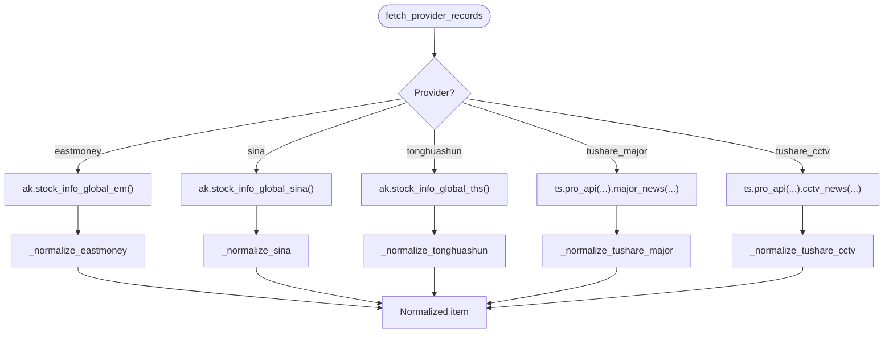

**Diagram sources**
- [providers.py:221-312](file://apps/sentiment/providers.py#L221-L312)

**Section sources**
- [providers.py:1-312](file://apps/sentiment/providers.py#L1-L312)

### Ingestion and Asset Attribution
Ingestion:
- Normalized items are prepared, including asset matching and concept inference.
- Articles are created or updated via URL uniqueness; related assets are linked if matched.
- Metadata captures match details and timestamps for traceability.

Asset attribution:
- Builds an index of active assets with aliases derived from name, symbol, ts_code, stripped legal suffixes, and overrides.
- Matches titles, summaries, and content against aliases, limiting maximum matches per article to avoid over-attribution.

Concept inference:
- Detects concept tags based on keyword sets for sectors and themes.

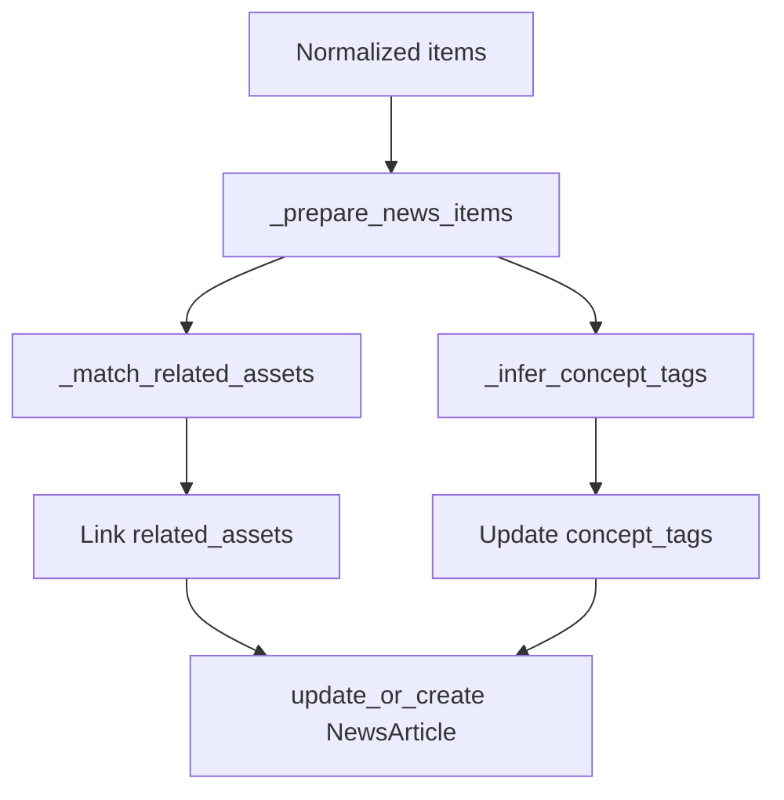

**Diagram sources**
- [tasks.py:224-256](file://apps/sentiment/tasks.py#L224-L256)
- [tasks.py:183-222](file://apps/sentiment/tasks.py#L183-L222)

**Section sources**
- [tasks.py:224-325](file://apps/sentiment/tasks.py#L224-L325)

### Sentiment Scoring and Labeling
Scoring:
- Tokenizes text using jieba when available; otherwise falls back to regex extraction.
- Computes positive, neutral, negative components based on lexicon counts and normalizes to probabilities.
- Derives an overall sentiment score with scaling and clamping.

Labeling:
- Applies thresholds to map sentiment_score to POSITIVE, NEUTRAL, or NEGATIVE.

Important note:
- The scorer is intentionally simple and tends to produce neutral-heavy outputs; neutral should be interpreted as “no evidence” rather than “no signal.”

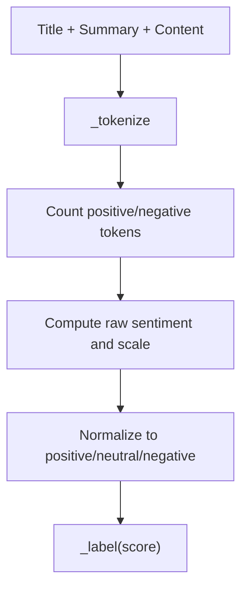

**Diagram sources**
- [tasks.py:97-139](file://apps/sentiment/tasks.py#L97-L139)

**Section sources**
- [tasks.py:97-139](file://apps/sentiment/tasks.py#L97-L139)

### Aggregation and Idempotency
Daily scoring and aggregation:
- For each article published on the target date, creates ARTICLE-level scores and links them to related assets.
- Computes 7-day average sentiment per asset and persists ASSET_7D rows.
- Ensures every historically listed asset has an ASSET_7D row for the target date, defaulting to neutral when no related articles exist.
- Computes MARKET_7D aggregate across all articles in the window.

Idempotency:
- Unique constraints ensure re-running windows upsert without double-counting.

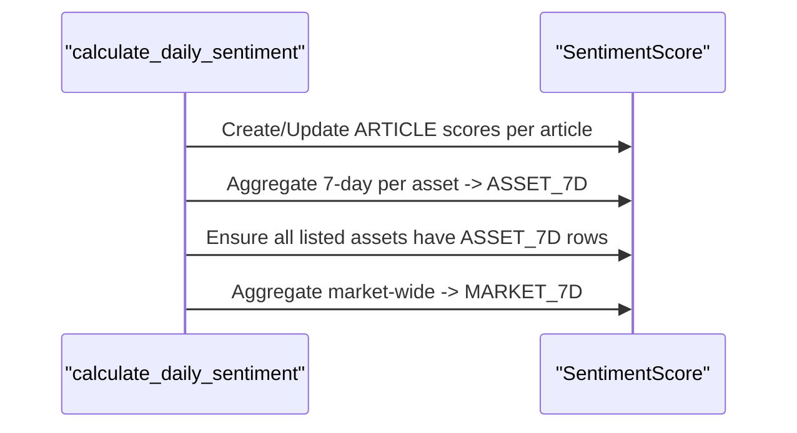

**Diagram sources**
- [tasks.py:393-521](file://apps/sentiment/tasks.py#L393-L521)

**Section sources**
- [tasks.py:393-521](file://apps/sentiment/tasks.py#L393-L521)

### Concept Heat Mapping
Concept heat:
- Counts concept tags per article published on the target date.
- Persists ConceptHeat rows with heat_score and article_count for each concept.

Use case:
- Provides a dashboard surface for monitoring trending themes; not consumed by models.

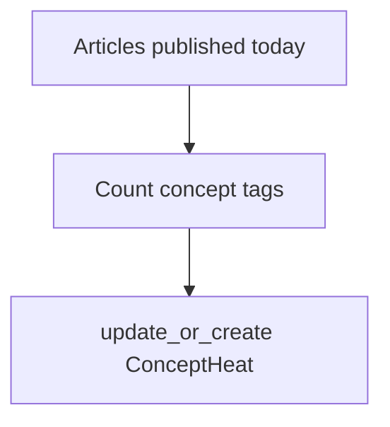

**Diagram sources**
- [tasks.py:524-557](file://apps/sentiment/tasks.py#L524-L557)

**Section sources**
- [tasks.py:524-557](file://apps/sentiment/tasks.py#L524-L557)

### Backfill Procedures
Historical backfill:
- Automatic hourly backfill computes a bounded window between the earliest existing article and a configured floor date, fetching chunks of days.
- Manual command supports explicit start/end datetimes, chunking, retries, throttling, dry-run previews, and optional queueing via Celery.
- Quota errors are detected and treated as retryable to avoid marking days as “no news.”

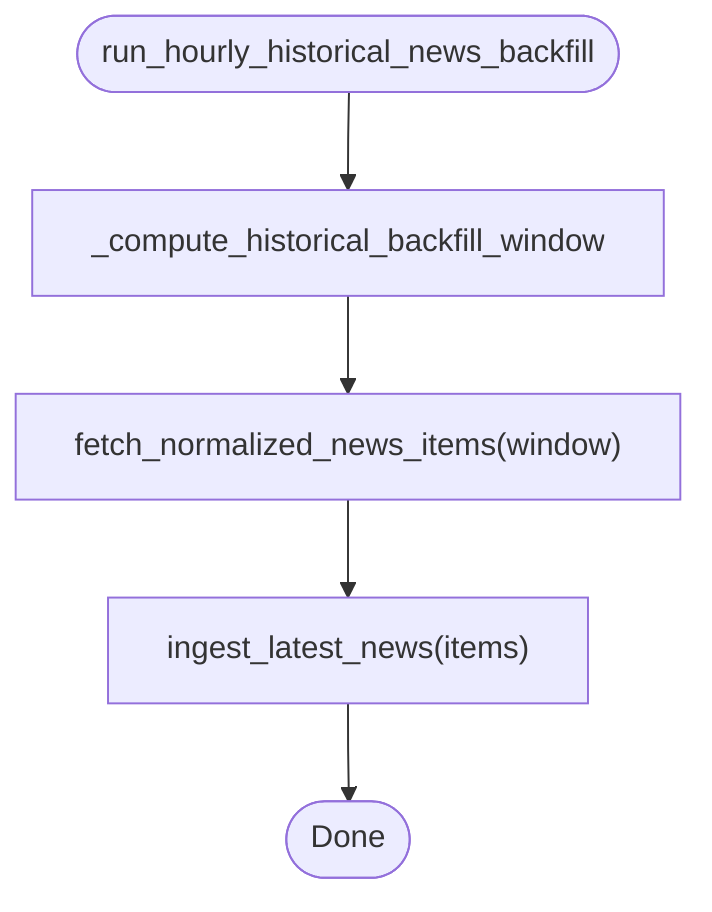

**Diagram sources**
- [tasks.py:353-390](file://apps/sentiment/tasks.py#L353-L390)
- [tasks.py:269-281](file://apps/sentiment/tasks.py#L269-L281)

**Section sources**
- [tasks.py:259-390](file://apps/sentiment/tasks.py#L259-L390)
- [backfill_news.py:1-176](file://apps/sentiment/management/commands/backfill_news.py#L1-L176)

### API Endpoints
Exposed endpoints under /api/v1/sentiment/:
- NewsArticleViewSet: List articles with filtering by source; POST /ingest to queue ingestion.
- SentimentScoreViewSet: List scores with filters for score_type and asset; GET /latest for most recent per scope; POST /recalculate to queue aggregation.
- ConceptHeatViewSet: List concept heat entries; GET /top for latest top concepts.

Authentication and pagination follow global settings; all endpoints require authentication where specified.

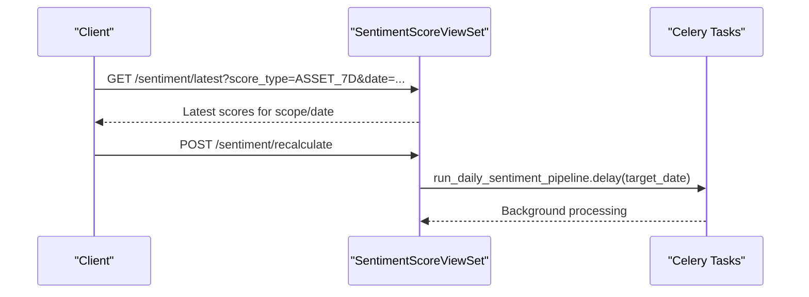

**Diagram sources**
- [views.py:53-98](file://apps/sentiment/views.py#L53-L98)

**Section sources**
- [views.py:36-122](file://apps/sentiment/views.py#L36-L122)
- [api.md:326-343](file://docs/reference/api.md#L326-L343)

### Integration with Factors and Prediction Models
Integration points:
- FactorScore includes a sentiment_score field and configurable sentiment_weight, allowing sentiment to influence composite scoring.
- Tests demonstrate that when ASSET_7D sentiment exists for an asset and date, the factors pipeline can incorporate it into FactorScore calculations.
- Dashboards and prediction pipelines consume FactorScore and related surfaces; sentiment contributes indirectly through factor composition and directly via dashboard fields that expose sentiment values alongside technical indicators and predictions.

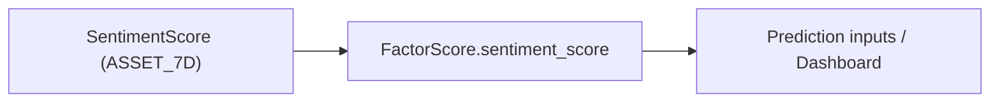

**Diagram sources**
- [factors_models.py:124-176](file://apps/factors/models.py#L124-L176)

**Section sources**
- [factors_models.py:124-176](file://apps/factors/models.py#L124-L176)

## Dependency Analysis
Key dependencies and relationships:
- Providers depend on AkShare and TuShare for data retrieval; they normalize results into a common schema.
- Tasks depend on models for persistence and on markets.Asset for asset matching and listing status checks.
- Views depend on serializers for wire format and on tasks for asynchronous operations.
- Factors depends on SentimentScore (ASSET_7D) to compute FactorScore, which in turn influences prediction surfaces.

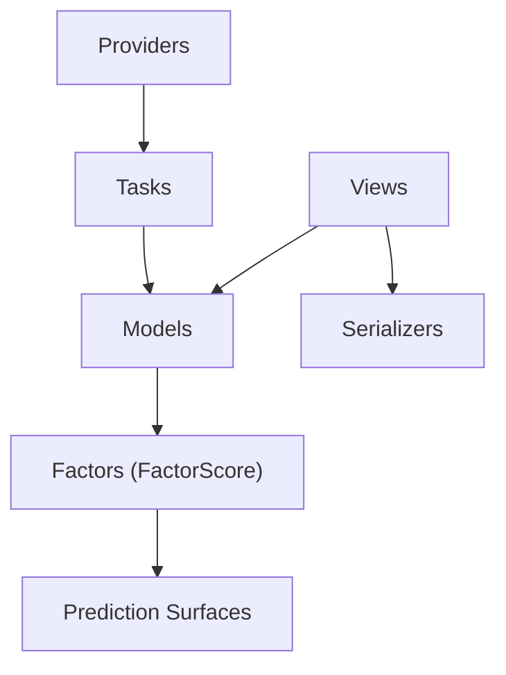

**Diagram sources**
- [providers.py:221-312](file://apps/sentiment/providers.py#L221-L312)
- [tasks.py:283-565](file://apps/sentiment/tasks.py#L283-L565)
- [models.py:35-125](file://apps/sentiment/models.py#L35-L125)
- [views.py:36-122](file://apps/sentiment/views.py#L36-L122)
- [factors_models.py:124-176](file://apps/factors/models.py#L124-L176)

**Section sources**
- [providers.py:221-312](file://apps/sentiment/providers.py#L221-L312)
- [tasks.py:283-565](file://apps/sentiment/tasks.py#L283-L565)
- [models.py:35-125](file://apps/sentiment/models.py#L35-L125)
- [views.py:36-122](file://apps/sentiment/views.py#L36-L122)
- [factors_models.py:124-176](file://apps/factors/models.py#L124-L176)

## Performance Considerations
- Deduplication on URL prevents duplicate ingestion and keeps storage lean.
- Unique constraints on SentimentScore ensure idempotent aggregation runs.
- Asset matching is capped to limit computational overhead and avoid over-attribution.
- Historical backfill uses chunked windows and throttling to respect provider quotas and reduce load.
- Serializers preserve Decimal precision to maintain reproducibility across clients and downstream consumers.

[No sources needed since this section provides general guidance]

## Troubleshooting Guide
Common issues and resolutions:
- Provider quota errors: Detected by specific markers; backfill treats these as retryable and defers rather than marking days empty. Use --max-retries and --sleep-seconds in the backfill command to manage rate limits.
- Missing sentiment for assets: If no related articles exist, ASSET_7D defaults to neutral; verify asset matching logic and concept tags.
- Incorrect dates: Datetime coercion handles various formats but may fall back to current time if parsing fails; validate provider timestamps and ensure timezone awareness.
- Stale data: Use /recalculate to re-run aggregation for a specific date; consider cache behavior for read endpoints.

Operational tips:
- Use --dry-run to preview fetch plans before consuming quota.
- Queue long-running jobs via --queue to offload to Celery workers.
- Monitor logs for provider errors and adjust limits accordingly.

**Section sources**
- [tasks.py:58-66](file://apps/sentiment/tasks.py#L58-L66)
- [backfill_news.py:43-176](file://apps/sentiment/management/commands/backfill_news.py#L43-L176)
- [views.py:94-98](file://apps/sentiment/views.py#L94-L98)

## Conclusion
The Sentiment application provides a robust pipeline for ingesting Chinese-language news, scoring sentiment, and aggregating signals for assets and the broader market. Its provider abstraction enables multi-source data collection with normalization and deduplication. The task-driven architecture supports scalable ingestion and aggregation, while the API offers convenient access for dashboards and downstream systems. Integration with the Factors application allows sentiment to influence composite scores and prediction models, completing the feedback loop from news to actionable insights.

[No sources needed since this section summarizes without analyzing specific files]

## Appendices

### Management Commands
- backfill_news: Supports providers, limits, datetime windows, chunking, throttling, retries, dry-run, queueing, and optional pipeline execution after ingest.

Usage highlights:
- --providers: Comma-separated list of providers.
- --start-at/--end-at: Datetime bounds for fetching.
- --chunk-days: Size of date-range chunks.
- --sleep-seconds: Delay between chunks.
- --max-retries: Retry attempts on rate limit errors.
- --dry-run: Preview without writing.
- --queue: Dispatch via Celery.
- --run-pipeline: Run sentiment and concept calculations post-ingest.

**Section sources**
- [backfill_news.py:43-176](file://apps/sentiment/management/commands/backfill_news.py#L43-L176)

### API Reference
- Base URL: /api/v1/
- Authentication: JWT, API key, or session.
- Pagination: Page number and size parameters.
- Rate limiting: Tier-based with Redis-backed counters.
- Endpoint groups include /sentiment/news/, /sentiment/, and /sentiment/concepts/.

**Section sources**
- [api.md:19-24](file://docs/reference/api.md#L19-L24)
- [api.md:136-185](file://docs/reference/api.md#L136-L185)
- [api.md:188-239](file://docs/reference/api.md#L188-L239)
- [api.md:326-343](file://docs/reference/api.md#L326-L343)