# Users Application

<cite>
**Referenced Files in This Document**
- [models.py](file://apps/users/models.py)
- [views.py](file://apps/users/views.py)
- [serializers.py](file://apps/users/serializers.py)
- [middleware.py](file://apps/users/middleware.py)
- [signals.py](file://apps/users/signals.py)
- [admin.py](file://apps/users/admin.py)
- [urls.py](file://config/urls.py)
- [base.py](file://config/settings/base.py)
- [throttling.py](file://apps/core/throttling.py)
</cite>

## Table of Contents
1. Introduction
2. Project Structure
3. Core Components
4. Architecture Overview
5. Detailed Component Analysis
6. Dependency Analysis
7. Performance Considerations
8. Troubleshooting Guide
9. Conclusion

## Introduction
The Users application provides authentication, authorization, subscription management, and usage metering for the platform. It extends Django’s built-in User model with a profile, tracks subscriptions (including Stripe identifiers), records API usage for analytics and rate limiting, and exposes REST endpoints for user registration, email verification, password reset, profile management, subscription queries, and usage statistics. The app integrates with Django REST Framework, SimpleJWT for token-based authentication, and a tiered throttling system to enforce per-tier request limits.

## Project Structure
The Users application is organized as a standard Django app under apps/users:
- models.py: Defines UserProfile, Subscription, APIUsage, and SubscriptionTier.
- views.py: Implements registration, email verification, password reset, profile management, subscription listing, and usage stats.
- serializers.py: Validates and transforms input/output for all user-related endpoints.
- middleware.py: Tracks API usage for every /api/v1/ request.
- signals.py: Auto-creates and syncs UserProfile on User lifecycle events.
- admin.py: Admin configuration for users, profiles, subscriptions, and usage logs.

Integration points:
- URLs are registered in config/urls.py for both viewsets and standalone views.
- Authentication, permissions, throttling, and schema settings are configured in config/settings/base.py.
- Tier-based throttling logic lives in apps/core/throttling.py.

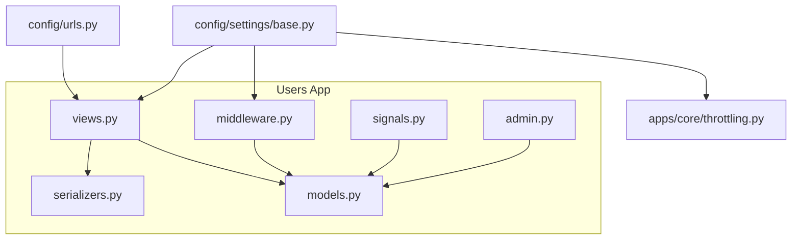

**Diagram sources**
- [views.py:1-284](file://apps/users/views.py#L1-L284)
- [models.py:1-186](file://apps/users/models.py#L1-L186)
- [serializers.py:1-217](file://apps/users/serializers.py#L1-L217)
- [middleware.py:1-34](file://apps/users/middleware.py#L1-L34)
- [signals.py:1-23](file://apps/users/signals.py#L1-L23)
- [admin.py:1-91](file://apps/users/admin.py#L1-L91)
- [urls.py:1-129](file://config/urls.py#L1-L129)
- [base.py:264-301](file://config/settings/base.py#L264-L301)
- [throttling.py:1-88](file://apps/core/throttling.py#L1-L88)

**Section sources**
- [urls.py:74-129](file://config/urls.py#L74-L129)
- [base.py:64-99](file://config/settings/base.py#L64-L99)
- [base.py:264-301](file://config/settings/base.py#L264-L301)

## Core Components
- User Profile: Extends Django’s User with phone number, company, email verification state, and derived subscription tier properties.
- Subscription: Manages SaaS tiers (Free, Pro, Premium), Stripe IDs, active status, dates, auto-renew flags, and helper methods like cancel and is_expired.
- API Usage: Records endpoint, method, timestamp, response status, and IP address for each API call; supports analytics and per-user limits.
- Serializers: Validate registration, password reset flows, profile updates, subscription data, and usage logs.
- Views: Provide endpoints for registration, email verification, password reset, profile CRUD, subscription listing, and usage statistics.
- Middleware: Persists API usage for all /api/v1/ requests.
- Signals: Ensure a UserProfile exists for every User and stays in sync.

Key responsibilities:
- Authentication flow via JWT tokens with scoped throttling for auth endpoints.
- Permission enforcement using DRF IsAuthenticated or IsAuthenticatedOrReadOnly.
- Tier-based rate limiting based on current subscription tier.
- Audit trail through APIUsage records.

**Section sources**
- [models.py:7-186](file://apps/users/models.py#L7-L186)
- [serializers.py:8-217](file://apps/users/serializers.py#L8-L217)
- [views.py:44-284](file://apps/users/views.py#L44-L284)
- [middleware.py:6-34](file://apps/users/middleware.py#L6-L34)
- [signals.py:7-23](file://apps/users/signals.py#L7-L23)

## Architecture Overview
The Users application follows a layered architecture:
- Request layer: DRF views handle HTTP requests and delegate to serializers and services.
- Business layer: Models encapsulate domain logic (subscription tier calculation, expiration checks).
- Cross-cutting concerns: Middleware records usage; throttling enforces per-tier limits; signals maintain data consistency.

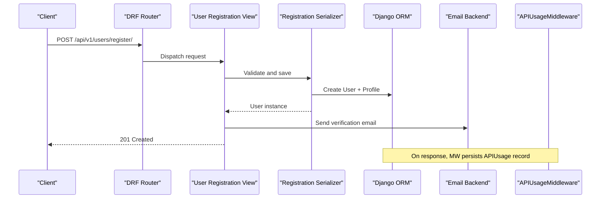

**Diagram sources**
- [views.py:44-71](file://apps/users/views.py#L44-L71)
- [serializers.py:45-110](file://apps/users/serializers.py#L45-L110)
- [middleware.py:11-33](file://apps/users/middleware.py#L11-L33)

## Detailed Component Analysis

### Data Models
- UserProfile: One-to-one with User; includes phone_number, company, email_verified, email_verification_token, timestamps; computed properties for subscription_tier, is_premium, is_pro.
- Subscription: ForeignKey to User; fields for tier, Stripe IDs, active flag, start/end dates, auto_renew; indexes for performance; helpers for expiration and cancellation.
- APIUsage: ForeignKey to User (nullable); endpoint, method, timestamp (indexed), response_status, ip_address; indexes for user+timestamp and endpoint+timestamp.

Complexity notes:
- Queries for active subscription use filters on is_active and end_date; indexes improve performance.
- APIUsage writes occur on every API request; indexes ensure efficient analytics queries.

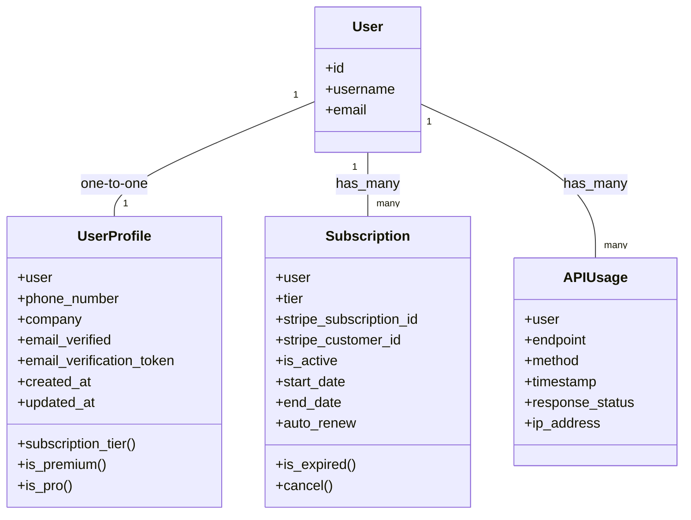

**Diagram sources**
- [models.py:13-186](file://apps/users/models.py#L13-L186)

**Section sources**
- [models.py:7-186](file://apps/users/models.py#L7-L186)

### Authentication Flow
- Token Obtain/Refresh/Verify: Scoped views apply AuthEndpointRateThrottle to protect login traffic.
- JWT configuration: Access token lifetime, refresh rotation, blacklist after rotation, algorithm, header types, and signing key are set in settings.
- Permissions: Default permission is IsAuthenticatedOrReadOnly; specific views enforce IsAuthenticated where needed.

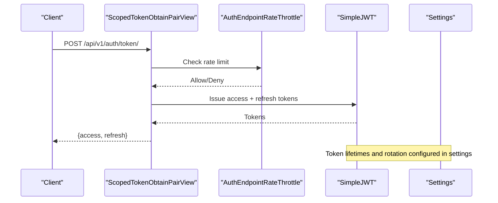

**Diagram sources**
- [views.py:32-41](file://apps/users/views.py#L32-L41)
- [base.py:303-321](file://config/settings/base.py#L303-L321)
- [throttling.py:5-15](file://apps/core/throttling.py#L5-L15)

**Section sources**
- [views.py:32-41](file://apps/users/views.py#L32-L41)
- [base.py:264-321](file://config/settings/base.py#L264-L321)

### User Registration and Email Verification
- Registration: Creates User and UserProfile, generates verification token, sends verification email, returns user data.
- Email verification: Validates token, marks email as verified, clears token.

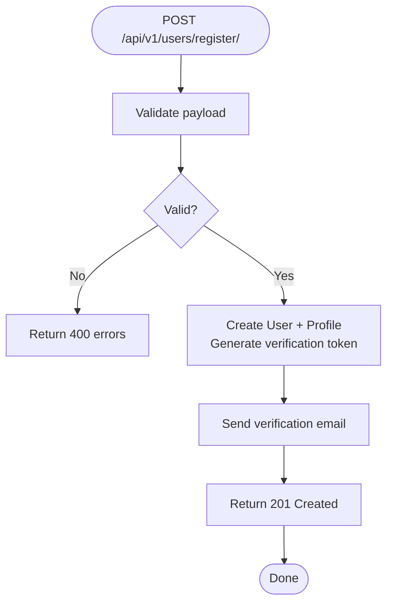

**Diagram sources**
- [views.py:44-71](file://apps/users/views.py#L44-L71)
- [serializers.py:45-110](file://apps/users/serializers.py#L45-L110)

**Section sources**
- [views.py:44-94](file://apps/users/views.py#L44-L94)
- [serializers.py:45-110](file://apps/users/serializers.py#L45-L110)

### Password Reset Flow
- Request: Accepts email, generates reset token if user exists, sends reset link, always responds success to prevent enumeration.
- Confirm: Validates token and passwords, sets new password, clears token.

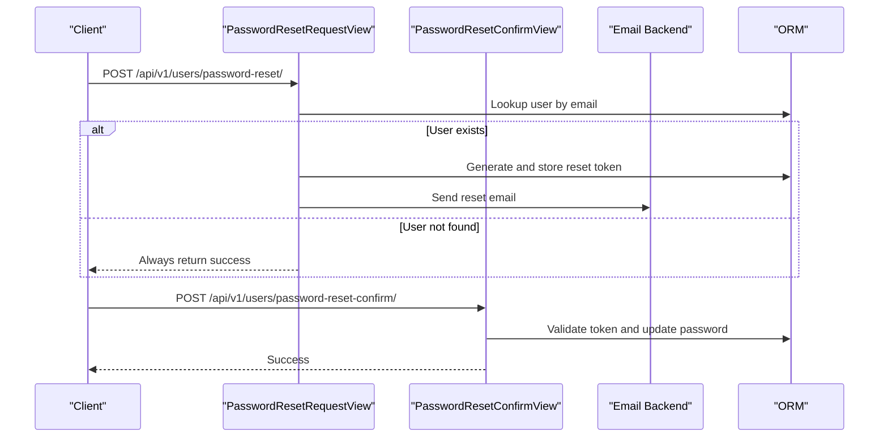

**Diagram sources**
- [views.py:97-157](file://apps/users/views.py#L97-L157)
- [serializers.py:174-217](file://apps/users/serializers.py#L174-L217)

**Section sources**
- [views.py:97-157](file://apps/users/views.py#L97-L157)
- [serializers.py:174-217](file://apps/users/serializers.py#L174-L217)

### Profile Management
- GET/PUT/PATCH /api/v1/users/profile/me/: Returns combined user and profile data; allows partial or full updates.
- Permissions: Requires authentication.

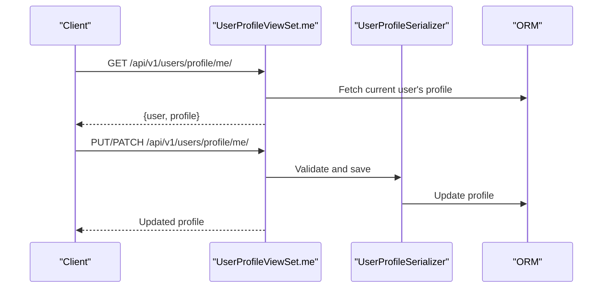

**Diagram sources**
- [views.py:160-192](file://apps/users/views.py#L160-L192)
- [serializers.py:8-26](file://apps/users/serializers.py#L8-L26)

**Section sources**
- [views.py:160-192](file://apps/users/views.py#L160-L192)
- [serializers.py:8-26](file://apps/users/serializers.py#L8-L26)

### Subscription Management
- Read-only endpoints list user subscriptions and provide current active subscription.
- Active subscription determined by is_active and end_date; defaults to Free tier when none active.
- Integration points: stripe_subscription_id and stripe_customer_id stored for billing reconciliation.

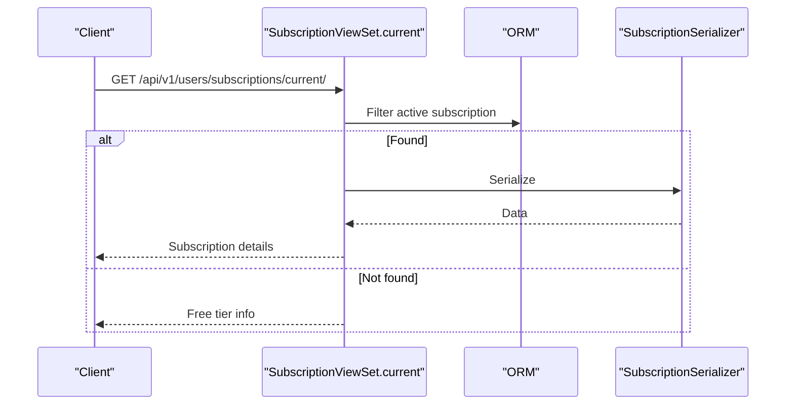

**Diagram sources**
- [views.py:194-223](file://apps/users/views.py#L194-L223)
- [serializers.py:113-140](file://apps/users/serializers.py#L113-L140)

**Section sources**
- [views.py:194-223](file://apps/users/views.py#L194-L223)
- [serializers.py:113-140](file://apps/users/serializers.py#L113-L140)

### Usage Metering and Analytics
- Middleware records every /api/v1/ request with user, endpoint, method, status, and IP.
- Usage stats endpoint aggregates daily/monthly counts and top endpoints; computes remaining quota based on tier limits.

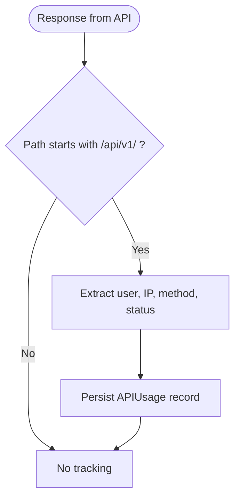

**Diagram sources**
- [middleware.py:11-33](file://apps/users/middleware.py#L11-L33)

**Section sources**
- [middleware.py:6-34](file://apps/users/middleware.py#L6-L34)
- [views.py:226-284](file://apps/users/views.py#L226-L284)

### Signals for User Event Handling
- post_save on User creates UserProfile automatically when a new User is created.
- post_save on User ensures UserProfile is saved whenever User is saved.

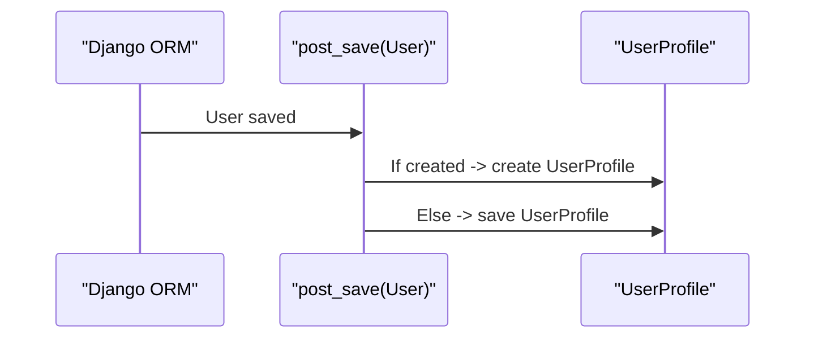

**Diagram sources**
- [signals.py:7-23](file://apps/users/signals.py#L7-L23)

**Section sources**
- [signals.py:7-23](file://apps/users/signals.py#L7-L23)

### API Endpoints Summary
- POST /api/v1/users/register/: Register a new user and send verification email.
- POST /api/v1/users/verify-email/: Verify email using token.
- POST /api/v1/users/password-reset/: Request password reset link.
- POST /api/v1/users/password-reset-confirm/: Confirm password reset with token.
- GET/PUT/PATCH /api/v1/users/profile/me/: Manage current user profile.
- GET /api/v1/users/subscriptions/: List user subscriptions.
- GET /api/v1/users/subscriptions/current/: Get current active subscription.
- GET /api/v1/users/usage/: List API usage entries.
- GET /api/v1/users/usage/stats/: Get usage statistics and quotas.
- POST /api/v1/auth/token/: Obtain JWT tokens.
- POST /api/v1/auth/token/refresh/: Refresh JWT token.
- POST /api/v1/auth/token/verify/: Verify JWT token.

**Section sources**
- [urls.py:109-129](file://config/urls.py#L109-L129)
- [views.py:44-284](file://apps/users/views.py#L44-L284)

## Dependency Analysis
- Views depend on serializers for validation and transformation.
- Views depend on models for business logic and persistence.
- Middleware depends on models to persist usage logs.
- Settings configure authentication classes, permissions, throttling, and JWT behavior.
- Throttling depends on subscription tier to compute per-user limits.

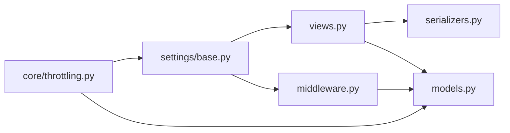

**Diagram sources**
- [views.py:1-284](file://apps/users/views.py#L1-L284)
- [serializers.py:1-217](file://apps/users/serializers.py#L1-L217)
- [models.py:1-186](file://apps/users/models.py#L1-L186)
- [middleware.py:1-34](file://apps/users/middleware.py#L1-L34)
- [base.py:264-321](file://config/settings/base.py#L264-L321)
- [throttling.py:1-88](file://apps/core/throttling.py#L1-L88)

**Section sources**
- [base.py:264-321](file://config/settings/base.py#L264-L321)
- [throttling.py:17-88](file://apps/core/throttling.py#L17-L88)

## Performance Considerations
- Database indexes:
  - Subscription(user, is_active) and Subscription(stripe_subscription_id) optimize active subscription lookups and Stripe reconciliations.
  - APIUsage(user, timestamp) and APIUsage(endpoint, timestamp) accelerate analytics and per-user usage queries.
- Throttling:
  - Tier-based throttling uses Redis-backed cache keys that include user ID and tier, ensuring accurate per-tier limits.
  - Auth endpoints have a separate throttle scope to avoid impacting public API limits during login bursts.
- Query efficiency:
  - Current subscription query filters by is_active and end_date; consider adding database-level constraints or materialized views if growth requires.
  - Usage stats aggregate recent data; ensure appropriate time bounds and indexing to keep queries fast.

[No sources needed since this section provides general guidance]

## Troubleshooting Guide
Common issues and resolutions:
- Email verification fails:
  - Ensure token matches a non-expired UserProfile entry; verify email backend configuration and FRONTEND_URL for correct links.
- Password reset does not work:
  - Confirm token exists and has not been used; check that password meets validators; verify DEFAULT_FROM_EMAIL and email host settings.
- Rate limited unexpectedly:
  - Check user’s subscription tier and corresponding throttle scope; confirm Redis connectivity for cache-backed throttling.
- Usage stats missing or delayed:
  - Verify APIUsageMiddleware is enabled and processing /api/v1/ paths; check database write permissions and indexes.

Security considerations:
- Password reset endpoints do not reveal whether an email exists to prevent enumeration.
- JWT tokens rotate refresh tokens and blacklist after rotation; ensure SECRET_KEY is strong and unique in production.
- Sensitive fields (Stripe IDs) are read-only in serializers to prevent client-side tampering.

Compliance requirements:
- Store minimal personal data in profiles; mask or redact sensitive fields in logs.
- Retain APIUsage records according to retention policies; consider anonymizing IP addresses where required.
- Enforce least privilege in admin actions; audit changes to subscriptions and user statuses.

**Section sources**
- [views.py:74-157](file://apps/users/views.py#L74-L157)
- [serializers.py:159-217](file://apps/users/serializers.py#L159-L217)
- [base.py:303-321](file://config/settings/base.py#L303-L321)
- [middleware.py:11-33](file://apps/users/middleware.py#L11-L33)

## Conclusion
The Users application delivers a robust foundation for identity, subscription management, and usage analytics. It leverages Django’s auth system, DRF, and SimpleJWT to provide secure, scalable APIs. Tier-based throttling and comprehensive usage logging support fair usage and observability. With clear separation of concerns across models, serializers, views, middleware, and signals, the app remains maintainable and extensible for future features such as advanced billing integrations and enhanced compliance controls.