# Architecture Deep Dive

<cite>
**Referenced Files in This Document**
- [README.md](file://README.md)
- [TECHNICAL_GUIDE.md](file://TECHNICAL_GUIDE.md)
- [docker-compose.yml](file://docker-compose.yml)
- [compose/local/django/Dockerfile](file://compose/local/django/Dockerfile)
- [config/settings/base.py](file://config/settings/base.py)
- [config/urls.py](file://config/urls.py)
- [config/celery.py](file://config/celery.py)
- [config/routing.py](file://config/routing.py)
- [apps/markets/models.py](file://apps/markets/models.py)
- [apps/analytics/models.py](file://apps/analytics/models.py)
- [apps/factors/models.py](file://apps/factors/models.py)
- [apps/macro/models.py](file://apps/macro/models.py)
- [apps/sentiment/models.py](file://apps/sentiment/models.py)
- [apps/prediction/models.py](file://apps/prediction/models.py)
- [apps/backtest/models.py](file://apps/backtest/models.py)
</cite>

## Table of Contents
1. Introduction
2. Project Structure
3. Core Components
4. Architecture Overview
5. Detailed Component Analysis
6. Dependency Analysis
7. Performance Considerations
8. Troubleshooting Guide
9. Conclusion
10. Appendices

## Introduction
FinanceAnalysis is a Django-based platform for analyzing Chinese A-share markets over the CSI 300 and CSI A500 universes. It ingests market, fundamental, macro, and news data; derives technical and factor features; runs heuristic, LightGBM, and LSTM prediction models; and backtests trading strategies against point-in-time benchmarks. The system exposes a REST API (Django REST Framework), WebSocket alerts (Channels over Redis), and a React dashboard that proxies to the backend. Celery with Beat drives scheduled ingestion, feature derivation, predictions, and backtests across dedicated queues.

Key design principles:
- Strict upstream → derived ordering across ten Django applications.
- Point-in-time integrity enforced by canonical universe rules and historical membership snapshots.
- Separation between raw data (markets, fundamentals, macro, sentiment articles) and derived features (technical indicators, factor scores, predictions).
- Resilient async processing via Celery queues and chunked execution for long-running jobs.

**Section sources**
- [README.md:48-114](file://README.md#L48-L114)
- [TECHNICAL_GUIDE.md:25-72](file://TECHNICAL_GUIDE.md#L25-L72)

## Project Structure
The repository organizes functionality into ten Django apps with a strict dependency order. At runtime:
- PostgreSQL stores all persistent data.
- Redis provides caching, Channels layer, and Celery broker/backend.
- Docker Compose orchestrates Django, Celery worker, and Celery Beat containers.
- URLs route REST endpoints under /api/v1/ and mount admin and OpenAPI schema.

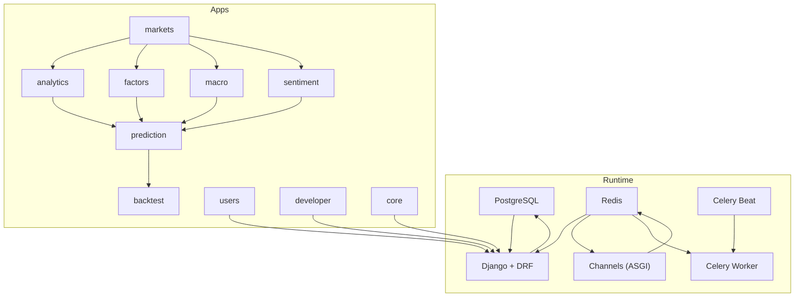

**Diagram sources**
- [docker-compose.yml:1-39](file://docker-compose.yml#L1-L39)
- [config/settings/base.py:64-88](file://config/settings/base.py#L64-L88)
- [config/settings/base.py:174-255](file://config/settings/base.py#L174-L255)
- [config/urls.py:74-128](file://config/urls.py#L74-L128)

**Section sources**
- [docker-compose.yml:1-39](file://docker-compose.yml#L1-L39)
- [compose/local/django/Dockerfile:1-53](file://compose/local/django/Dockerfile#L1-L53)
- [config/settings/base.py:64-88](file://config/settings/base.py#L64-L88)
- [config/settings/base.py:122-126](file://config/settings/base.py#L122-L126)
- [config/settings/base.py:174-255](file://config/settings/base.py#L174-L255)
- [config/settings/base.py:264-339](file://config/settings/base.py#L264-L339)
- [config/urls.py:74-128](file://config/urls.py#L74-L128)

## Core Components
- core: Pagination, throttling tiers, historical floor enforcement, validation helpers, documentation generation.
- markets: Universe foundation—assets, OHLCV, trading calendar, suspensions, index membership, benchmark indices, point-in-time union benchmark.
- analytics: Stored technical indicators, signal events, alerts, screeners, dashboard DTOs.
- factors: Fundamentals, money flow, margin detail, capital flow, composite factor scores.
- macro: Monthly macro surface and inferred market regime context.
- sentiment: News ingestion, article scoring, rolling asset/market sentiment aggregation, concept heat.
- prediction: Heuristic, LightGBM, LSTM models; trade decisions; model registry and ensemble weights.
- backtest: Run engine, trades ledger, comparison curves, benchmark export, chunked resume.
- users: Authentication, subscriptions, usage metering.
- developer: API key portal and public changelog.

These components form a pipeline where markets feeds analytics, factors, macro, and sentiment; those layers feed prediction; prediction feeds backtest; and all surfaces are exposed through REST and WebSocket APIs consumed by the React dashboard.

**Section sources**
- [README.md:50-63](file://README.md#L50-L63)
- [config/settings/base.py:64-88](file://config/settings/base.py#L64-L88)

## Architecture Overview
The system enforces a strict upstream → derived ordering:
- Raw data: markets, factors (fundamentals/money flow/margin), macro, sentiment (articles).
- Derived features: analytics (technical indicators/signals), factors (composite scores), macro (market context).
- Prediction: heuristic, LightGBM, LSTM using shared stored features and context.
- Backtest: runtime candidate generation and execution against point-in-time benchmarks.

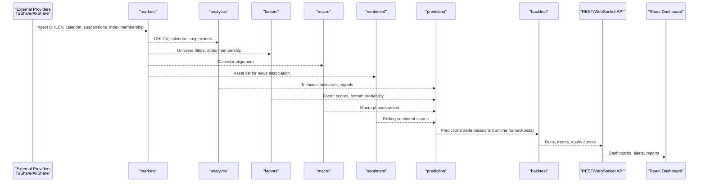

**Diagram sources**
- [README.md:65-90](file://README.md#L65-L90)
- [config/settings/base.py:218-255](file://config/settings/base.py#L218-L255)
- [config/urls.py:74-128](file://config/urls.py#L74-L128)

**Section sources**
- [README.md:65-90](file://README.md#L65-L90)
- [config/settings/base.py:218-255](file://config/settings/base.py#L218-L255)

## Detailed Component Analysis

### Data Integrity and Point-in-Time Universe
- Canonical rule: before a cutoff date, use CSI 300 only; after, use CSI 300 ∪ CSI A500.
- Historical membership snapshots ensure cross-sections reflect constituents at each date.
- Point-in-time union benchmark supports fair backtesting and avoids survivorship bias.

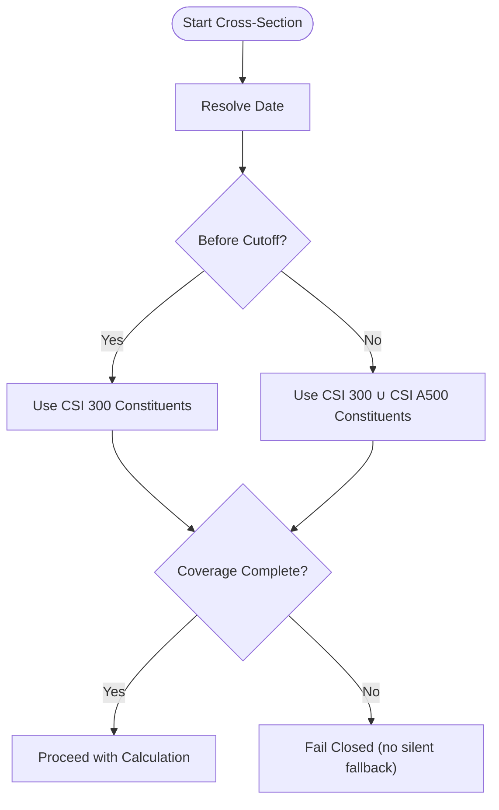

**Diagram sources**
- [README.md:92-105](file://README.md#L92-L105)
- [TECHNICAL_GUIDE.md:25-72](file://TECHNICAL_GUIDE.md#L25-L72)
- [apps/markets/models.py:117-144](file://apps/markets/models.py#L117-L144)
- [apps/markets/models.py:173-199](file://apps/markets/models.py#L173-L199)

**Section sources**
- [README.md:92-105](file://README.md#L92-L105)
- [TECHNICAL_GUIDE.md:25-72](file://TECHNICAL_GUIDE.md#L25-L72)
- [apps/markets/models.py:117-144](file://apps/markets/models.py#L117-L144)
- [apps/markets/models.py:173-199](file://apps/markets/models.py#L173-L199)

### Markets Layer
Stores foundational data: assets, OHLCV, trading calendar, suspensions, index membership, benchmark indices, and point-in-time union benchmark. These are the authoritative inputs for downstream feature computation and backtesting.

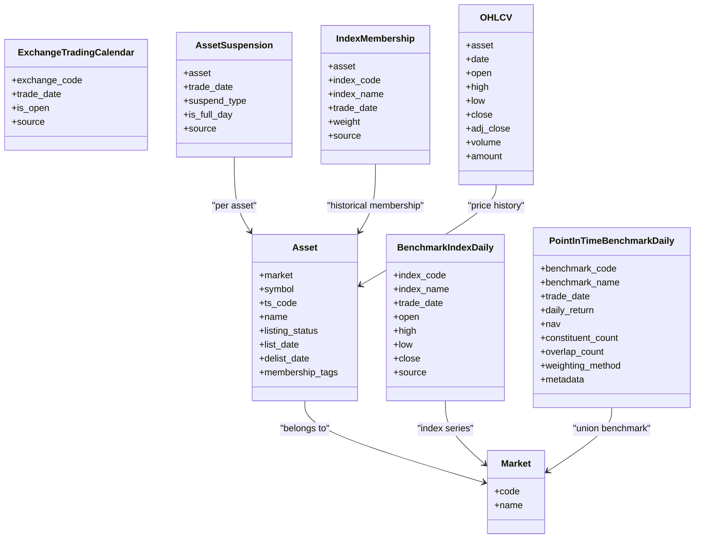

**Diagram sources**
- [apps/markets/models.py:4-63](file://apps/markets/models.py#L4-L63)
- [apps/markets/models.py:65-85](file://apps/markets/models.py#L65-L85)
- [apps/markets/models.py:87-115](file://apps/markets/models.py#L87-L115)
- [apps/markets/models.py:117-144](file://apps/markets/models.py#L117-L144)
- [apps/markets/models.py:147-199](file://apps/markets/models.py#L147-L199)
- [apps/markets/models.py:201-226](file://apps/markets/models.py#L201-L226)

**Section sources**
- [apps/markets/models.py:4-63](file://apps/markets/models.py#L4-L63)
- [apps/markets/models.py:65-85](file://apps/markets/models.py#L65-L85)
- [apps/markets/models.py:87-115](file://apps/markets/models.py#L87-L115)
- [apps/markets/models.py:117-144](file://apps/markets/models.py#L117-L144)
- [apps/markets/models.py:147-199](file://apps/markets/models.py#L147-L199)
- [apps/markets/models.py:201-226](file://apps/markets/models.py#L201-L226)

### Analytics Layer
Stores technical indicators and signal events used by dashboards, alerts, and downstream prediction/backtest logic. Indicators include RSI, MACD, Bollinger Bands, moving averages, momentum, and volume metrics. Signal events capture technical patterns like golden/death crosses, breakouts, volume spikes, and oversold combinations.

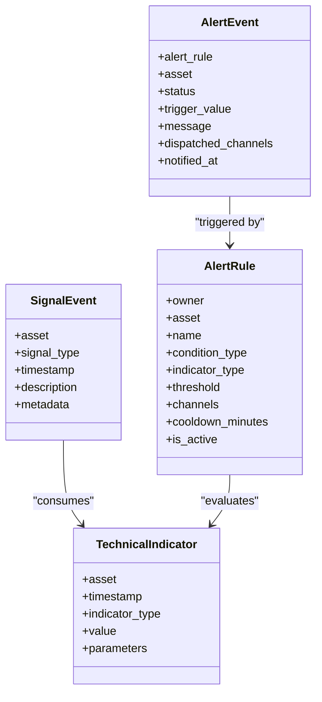

**Diagram sources**
- [apps/analytics/models.py:8-46](file://apps/analytics/models.py#L8-L46)
- [apps/analytics/models.py:87-146](file://apps/analytics/models.py#L87-L146)
- [apps/analytics/models.py:148-196](file://apps/analytics/models.py#L148-L196)
- [apps/analytics/models.py:198-255](file://apps/analytics/models.py#L198-L255)

**Section sources**
- [apps/analytics/models.py:8-46](file://apps/analytics/models.py#L8-L46)
- [apps/analytics/models.py:87-146](file://apps/analytics/models.py#L87-L146)
- [apps/analytics/models.py:148-196](file://apps/analytics/models.py#L148-L196)
- [apps/analytics/models.py:198-255](file://apps/analytics/models.py#L198-L255)

### Factors Layer
Aggregates fundamentals, money flow, margin detail, and capital flow into daily factor scores. Composite scoring combines financial, capital flow, technical reversal, and sentiment components with explicit weights.

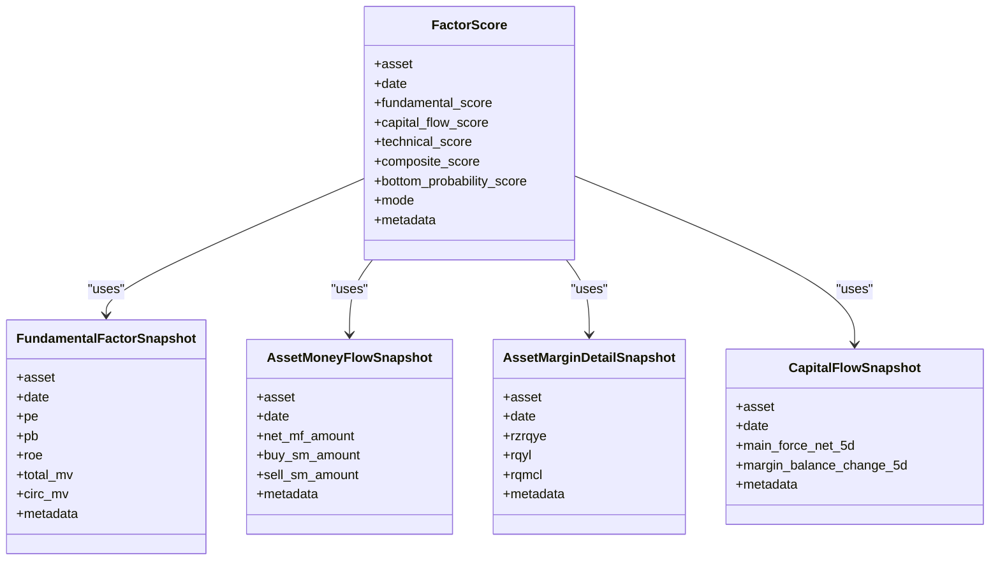

**Diagram sources**
- [apps/factors/models.py:7-37](file://apps/factors/models.py#L7-L37)
- [apps/factors/models.py:39-68](file://apps/factors/models.py#L39-L68)
- [apps/factors/models.py:70-98](file://apps/factors/models.py#L70-L98)
- [apps/factors/models.py:100-122](file://apps/factors/models.py#L100-L122)
- [apps/factors/models.py:124-176](file://apps/factors/models.py#L124-L176)

**Section sources**
- [apps/factors/models.py:7-37](file://apps/factors/models.py#L7-L37)
- [apps/factors/models.py:39-68](file://apps/factors/models.py#L39-L68)
- [apps/factors/models.py:70-98](file://apps/factors/models.py#L70-L98)
- [apps/factors/models.py:100-122](file://apps/factors/models.py#L100-L122)
- [apps/factors/models.py:124-176](file://apps/factors/models.py#L124-L176)

### Macro Layer
Stores monthly macro snapshots (yield curve, PMI, CPI/PPI) and inferred market context phases. Context is resolved by date ranges for as-of correctness in prediction and backtesting.

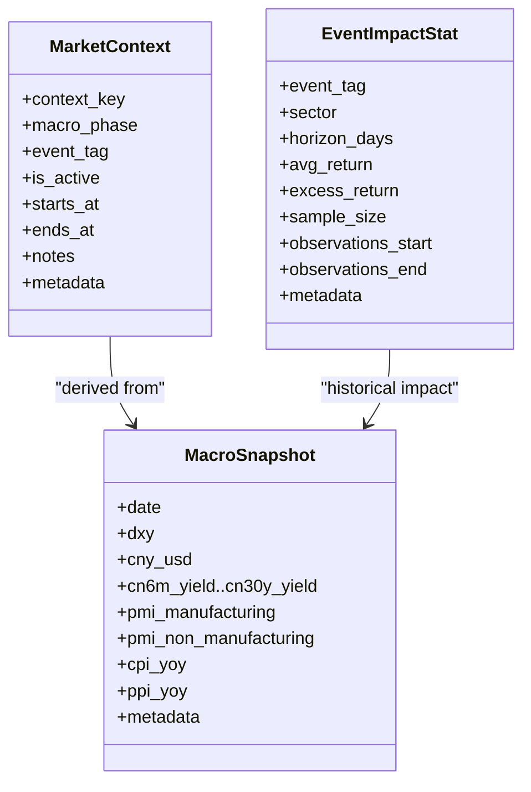

**Diagram sources**
- [apps/macro/models.py:5-29](file://apps/macro/models.py#L5-L29)
- [apps/macro/models.py:31-57](file://apps/macro/models.py#L31-L57)
- [apps/macro/models.py:59-77](file://apps/macro/models.py#L59-L77)

**Section sources**
- [apps/macro/models.py:5-29](file://apps/macro/models.py#L5-L29)
- [apps/macro/models.py:31-57](file://apps/macro/models.py#L31-L57)
- [apps/macro/models.py:59-77](file://apps/macro/models.py#L59-L77)

### Sentiment Layer
Captures raw news articles and aggregates sentiment at article, per-asset rolling, and market levels. Concept heat tracks theme activity.

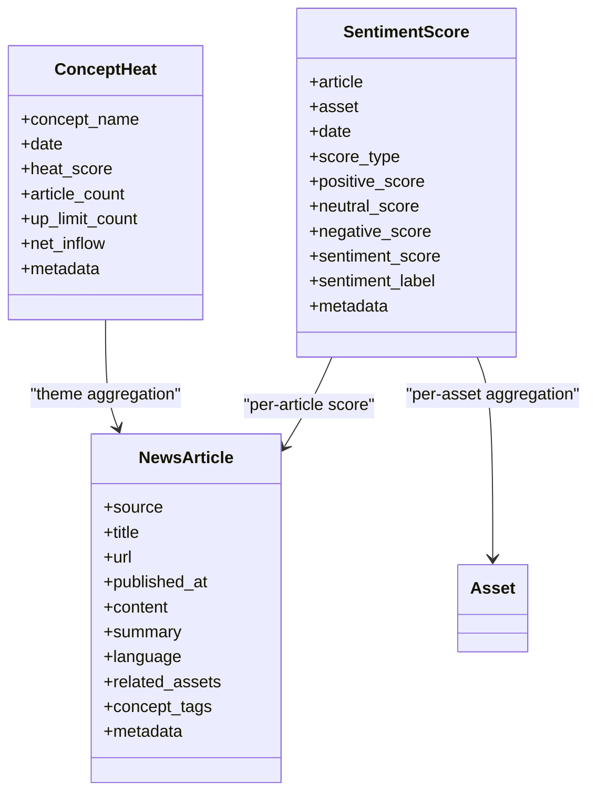

**Diagram sources**
- [apps/sentiment/models.py:35-62](file://apps/sentiment/models.py#L35-L62)
- [apps/sentiment/models.py:64-108](file://apps/sentiment/models.py#L64-L108)
- [apps/sentiment/models.py:110-125](file://apps/sentiment/models.py#L110-L125)

**Section sources**
- [apps/sentiment/models.py:35-62](file://apps/sentiment/models.py#L35-L62)
- [apps/sentiment/models.py:64-108](file://apps/sentiment/models.py#L64-L108)
- [apps/sentiment/models.py:110-125](file://apps/sentiment/models.py#L110-L125)

### Prediction Layer
Stores model versions, predictions, and artifacts. Includes heuristic, LightGBM, and LSTM models with ensemble weights and feature importance snapshots. Trade decision fields enrich predictions with target/stop-loss and suggested flags.

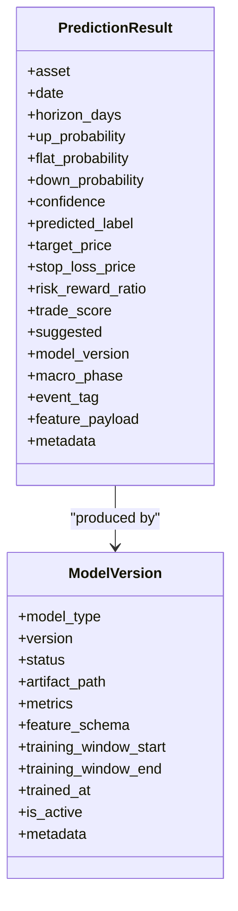

**Diagram sources**
- [apps/prediction/models.py:7-41](file://apps/prediction/models.py#L7-L41)
- [apps/prediction/models.py:43-98](file://apps/prediction/models.py#L43-L98)

**Section sources**
- [apps/prediction/models.py:7-41](file://apps/prediction/models.py#L7-L41)
- [apps/prediction/models.py:43-98](file://apps/prediction/models.py#L43-L98)

### Backtest Layer
Tracks run lifecycle, parameters, report, and trades. Supports chunked execution with resume state and detailed trade legs with signal payloads for auditability.

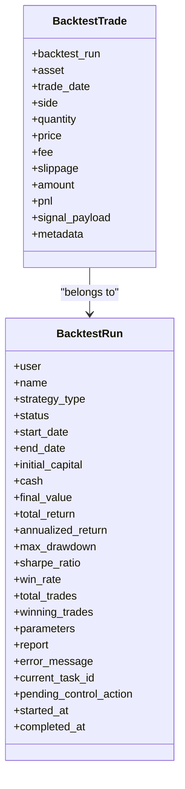

**Diagram sources**
- [apps/backtest/models.py:24-118](file://apps/backtest/models.py#L24-L118)
- [apps/backtest/models.py:120-168](file://apps/backtest/models.py#L120-L168)

**Section sources**
- [apps/backtest/models.py:24-118](file://apps/backtest/models.py#L24-L118)
- [apps/backtest/models.py:120-168](file://apps/backtest/models.py#L120-L168)

## Dependency Analysis
Application dependency order reflects data flow:
- core → users → markets → analytics → factors → macro → sentiment → prediction → backtest → developer.
- Celery routes tasks to dedicated queues: ops, backtest, train-lightgbm, train-lstm.
- Channels uses Redis for WebSocket routing; DRF uses JWT and API key authentication.

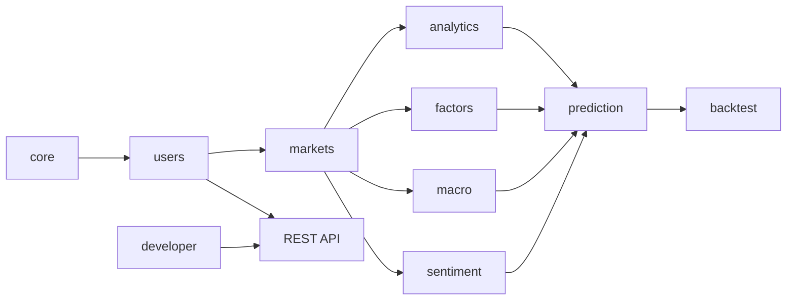

**Diagram sources**
- [config/settings/base.py:64-88](file://config/settings/base.py#L64-L88)
- [config/settings/base.py:174-203](file://config/settings/base.py#L174-L203)
- [config/urls.py:74-128](file://config/urls.py#L74-L128)

**Section sources**
- [config/settings/base.py:64-88](file://config/settings/base.py#L64-L88)
- [config/settings/base.py:174-203](file://config/settings/base.py#L174-L203)
- [config/urls.py:74-128](file://config/urls.py#L74-L128)

## Performance Considerations
- Point-in-time guards prevent stale or incomplete windows from corrupting features and predictions.
- Gap-tolerant vs exact-window metrics balance robustness with precision; missing rows fall back to documented neutral values rather than silently reusing stale data.
- Chunked backtest execution enables long runs to survive worker restarts and soft time limits.
- Feature pruning reduces model size while retaining important features based on latest importance snapshots.
- Separate queues isolate heavy workloads (backtests, training) from operational tasks.

[No sources needed since this section provides general guidance]

## Troubleshooting Guide
Common issues and mitigations:
- Stale derived data: Refuse stale rows; rebuild RS_SCORE slices and signal events when windows become invalid.
- Provider blackouts: Use primary/fallback providers for macro and news; schedule retries and sleep intervals.
- Stuck tasks: Monitor current_task_id and pending_control_action on BacktestRun; detect orphaned runs via task health checks.
- Missing OHLCV or non-positive close: Predictions return null targets/stops and suggested=false; backtest holds positions until valid closes appear.
- Universe coverage gaps: Fail closed when point-in-time membership coverage is missing; do not widen silently.

**Section sources**
- [TECHNICAL_GUIDE.md:117-224](file://TECHNICAL_GUIDE.md#L117-L224)
- [apps/backtest/models.py:24-118](file://apps/backtest/models.py#L24-L118)
- [config/settings/base.py:205-217](file://config/settings/base.py#L205-L217)

## Conclusion
FinanceAnalysis implements a disciplined, upstream → derived architecture that prioritizes point-in-time integrity, separation of raw and derived data, and resilient async processing. The stack combines Django REST Framework for APIs, Channels for live alerts, Celery for scheduling and background jobs, PostgreSQL for persistence, and Redis for caching and messaging. The React dashboard integrates via proxied REST and WebSocket endpoints. With clear contracts for freshness, universe membership, and model governance, the platform supports reliable daily predictions and reproducible backtests.

[No sources needed since this section summarizes without analyzing specific files]

## Appendices

### Technology Stack Summary
- Backend: Django + Django REST Framework + Channels + Celery + Celery Beat
- Database: PostgreSQL
- Cache/Message Broker: Redis
- Containerization: Docker Compose with separate services for Django, Celery Worker, and Celery Beat
- Frontend: React dashboard proxying /api and /ws to backend

**Section sources**
- [README.md:107-114](file://README.md#L107-L114)
- [docker-compose.yml:1-39](file://docker-compose.yml#L1-L39)
- [compose/local/django/Dockerfile:1-53](file://compose/local/django/Dockerfile#L1-L53)
- [config/settings/base.py:174-255](file://config/settings/base.py#L174-L255)
- [config/settings/base.py:264-339](file://config/settings/base.py#L264-L339)
- [config/urls.py:74-128](file://config/urls.py#L74-L128)