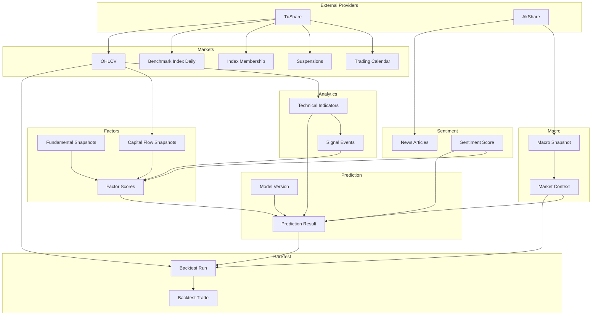
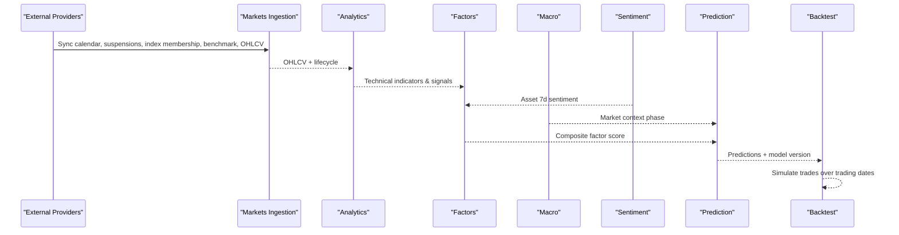
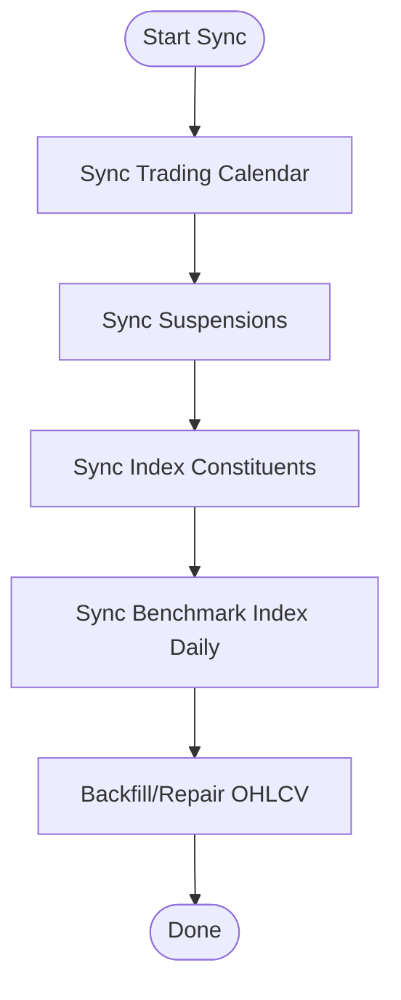
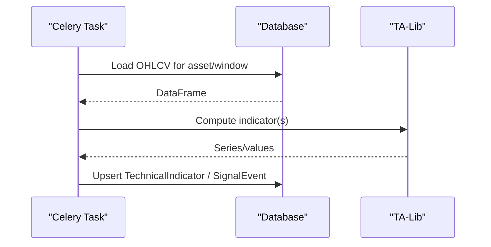
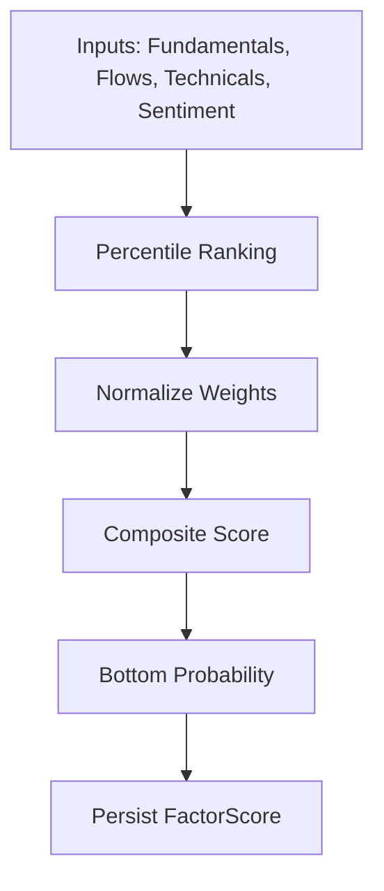
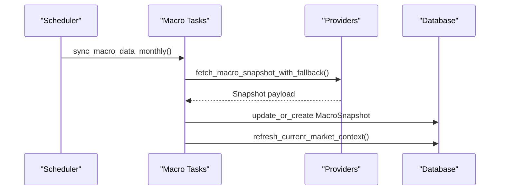
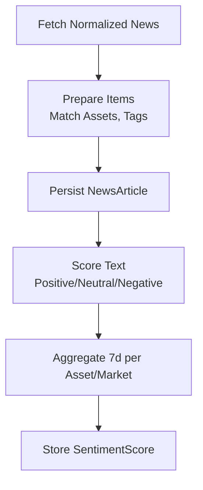
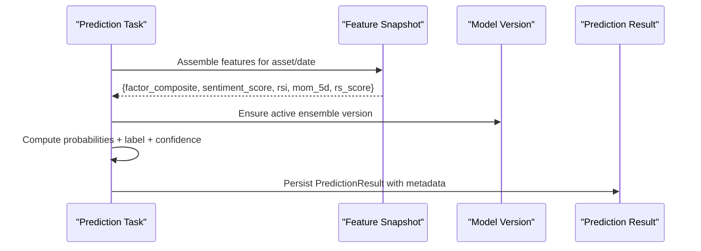
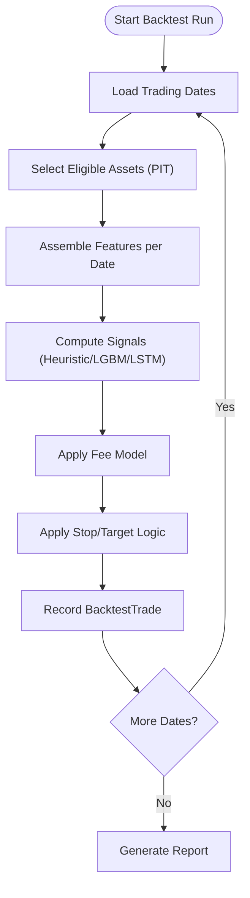
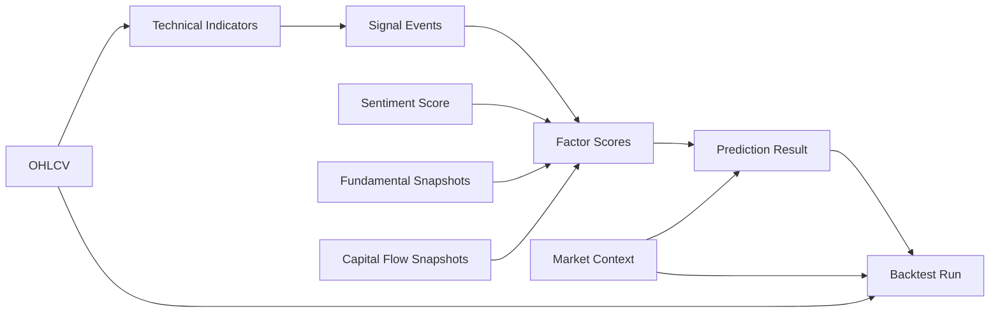

# Data Flow Patterns

<cite>
**Referenced Files in This Document**
- [tasks.py](file://apps/markets/tasks.py)
- [backfill_ohlcv_history.py](file://apps/markets/management/commands/backfill_ohlcv_history.py)
- [models.py](file://apps/markets/models.py)
- [tasks.py](file://apps/analytics/tasks.py)
- [backfill_technical_indicators.py](file://apps/analytics/management/commands/backfill_technical_indicators.py)
- [tasks.py](file://apps/factors/tasks.py)
- [tasks.py](file://apps/macro/tasks.py)
- [tasks.py](file://apps/sentiment/tasks.py)
- [tasks.py](file://apps/prediction/tasks.py)
- [tasks.py](file://apps/backtest/tasks.py)
- [validate_data_quality.py](file://apps/core/management/commands/validate_data_quality.py)
</cite>

## Table of Contents
1. Introduction
2. Project Structure
3. Core Components
4. Architecture Overview
5. Detailed Component Analysis
6. Dependency Analysis
7. Performance Considerations
8. Troubleshooting Guide
9. Conclusion
10. Appendices

## Introduction
This document explains the end-to-end data flow patterns in the FinanceAnalysis platform, from external market and macro providers through raw storage to derived features, predictions, and backtesting. It details how each stage consumes upstream data, produces derived outputs with versioning and lineage tracking, and handles errors, retries, validation, and monitoring. The pipeline is organized into sequential stages: markets → analytics/factors/macro/sentiment → prediction → backtest.

## Project Structure
The platform is organized by feature apps that own their data models, tasks, and management commands:
- markets: raw OHLCV, calendars, suspensions, index membership, benchmarks
- analytics: technical indicators and signals
- factors: composite factor scores combining fundamentals, flows, technicals, sentiment
- macro: macro snapshots and market context phases
- sentiment: news ingestion, scoring, aggregation
- prediction: heuristic ensemble predictions and model versioning
- backtest: event-driven simulation using live artifacts and features
- core: data quality validation and utilities

**Diagram sources**
- [tasks.py](file://apps/markets/tasks.py)
- [tasks.py](file://apps/analytics/tasks.py)
- [tasks.py](file://apps/factors/tasks.py)
- [tasks.py](file://apps/macro/tasks.py)
- [tasks.py](file://apps/sentiment/tasks.py)
- [tasks.py](file://apps/prediction/tasks.py)
- [tasks.py](file://apps/backtest/tasks.py)

**Section sources**
- [tasks.py](file://apps/markets/tasks.py)
- [models.py](file://apps/markets/models.py)

## Core Components
- Markets ingestion: calendar, suspensions, index constituents, benchmark history, OHLCV backfill and repair
- Analytics: technical indicator computation and signal events (e.g., RSI, MACD, BBANDS, SMA/EMA, STOCH, ADX, OBV, Fibonacci)
- Factors: composite scoring from fundamentals, capital flows, technical reversal, sentiment
- Macro: monthly macro snapshot sync with provider fallback and market phase inference
- Sentiment: news ingestion, lexicon-based scoring, asset attribution, 7-day aggregation
- Prediction: feature snapshot assembly, heuristic probabilities, model versioning, trade decision estimation
- Backtest: chunked, resumable simulation with point-in-time universe, fees, exits, and metrics

**Section sources**
- [tasks.py](file://apps/markets/tasks.py)
- [backfill_ohlcv_history.py](file://apps/markets/management/commands/backfill_ohlcv_history.py)
- [tasks.py](file://apps/analytics/tasks.py)
- [backfill_technical_indicators.py](file://apps/analytics/management/commands/backfill_technical_indicators.py)
- [tasks.py](file://apps/factors/tasks.py)
- [tasks.py](file://apps/macro/tasks.py)
- [tasks.py](file://apps/sentiment/tasks.py)
- [tasks.py](file://apps/prediction/tasks.py)
- [tasks.py](file://apps/backtest/tasks.py)

## Architecture Overview
The pipeline processes data in discrete stages with explicit dependencies and versioning:
- Stage 1: Markets ingests raw data from TuShare/AkShare into canonical tables (calendar, suspensions, index membership, benchmark daily, OHLCV).
- Stage 2: Analytics computes technical indicators and signals from OHLCV; factors combine fundamentals, flows, technicals, and sentiment into composite scores; macro provides market context phases.
- Stage 3: Prediction assembles a feature snapshot per asset/date, applies heuristics or ML models, and persists predictions with model version metadata.
- Stage 4: Backtest simulates strategies using live artifacts and features, producing trades and reports.

**Diagram sources**
- [tasks.py](file://apps/markets/tasks.py)
- [tasks.py](file://apps/analytics/tasks.py)
- [tasks.py](file://apps/factors/tasks.py)
- [tasks.py](file://apps/macro/tasks.py)
- [tasks.py](file://apps/sentiment/tasks.py)
- [tasks.py](file://apps/prediction/tasks.py)
- [tasks.py](file://apps/backtest/tasks.py)

## Detailed Component Analysis

### Markets: Raw Data Ingestion and Storage
- Trading calendar: windowed sync from TuShare trade_cal with strict completeness checks and bulk writes.
- Suspensions: paginated fetch, deduplication, full-day vs timed handling, bulk create.
- Index membership: windowed index_weight fetches, latest constituent tagging, upsert assets and memberships.
- Benchmark index daily: daily OHLC for indices with upsert on unique key.
- OHLCV backfill: command supports CSV repairs, effective-universe entry warm-up, technical-indicator warm-up windows, and queueing via Celery tasks.

**Diagram sources**
- [tasks.py](file://apps/markets/tasks.py)
- [backfill_ohlcv_history.py](file://apps/markets/management/commands/backfill_ohlcv_history.py)

**Section sources**
- [tasks.py](file://apps/markets/tasks.py)
- [backfill_ohlcv_history.py](file://apps/markets/management/commands/backfill_ohlcv_history.py)
- [models.py](file://apps/markets/models.py)

### Analytics: Technical Indicators and Signals
- Indicator computation uses TA-Lib on OHLCV series; each task checks staleness via trailing indicator freshness helpers before recomputation.
- Stores TechnicalIndicator rows with parameters and values; supports multiple periods for SMA/EMA and multi-band outputs for BBANDS.
- Signal events capture crossover and alignment patterns (golden/death cross, MA alignment).

**Diagram sources**
- [tasks.py](file://apps/analytics/tasks.py)
- [backfill_technical_indicators.py](file://apps/analytics/management/commands/backfill_technical_indicators.py)

**Section sources**
- [tasks.py](file://apps/analytics/tasks.py)
- [backfill_technical_indicators.py](file://apps/analytics/management/commands/backfill_technical_indicators.py)

### Factors: Composite Scoring
- Aggregates fundamental snapshots, capital flow snapshots, technical reversal scores, and sentiment scores into composite scores and bottom-probability estimates.
- Uses percentile rankers for valuation and flow fields; normalizes weights and enforces bounds.
- Persists FactorScore with mode COMPOSITE and detailed component scores plus metadata.

**Diagram sources**
- [tasks.py](file://apps/factors/tasks.py)

**Section sources**
- [tasks.py](file://apps/factors/tasks.py)

### Macro: Monthly Snapshots and Market Context
- Fetches macro data using primary provider with AkShare fallback; stores MacroSnapshot and updates current MarketContext with inferred macro phase.
- Phase inference uses PMI, yield curve slope, and CPI thresholds.

**Diagram sources**
- [tasks.py](file://apps/macro/tasks.py)

**Section sources**
- [tasks.py](file://apps/macro/tasks.py)

### Sentiment: News Ingestion, Scoring, Aggregation
- Ingests normalized news items, deduplicates by URL, attributes articles to assets via name aliases, and infers concept tags.
- Lexicon-based scoring produces positive/neutral/negative distributions and a sentiment score; aggregates to ASSET_7D and MARKET_7D scopes.
- Handles provider quota errors gracefully without marking days as empty.

**Diagram sources**
- [tasks.py](file://apps/sentiment/tasks.py)

**Section sources**
- [tasks.py](file://apps/sentiment/tasks.py)

### Prediction: Feature Assembly and Model Versioning
- Builds a feature snapshot per asset/date from factor scores, sentiment, RSI, momentum, and RS score.
- Computes up/flat/down probabilities with horizon scaling and macro phase adjustments; derives predicted label, confidence, and trade decision.
- Ensures an active ModelVersion exists for the date and persists PredictionResult with feature payload and metadata.

**Diagram sources**
- [tasks.py](file://apps/prediction/tasks.py)

**Section sources**
- [tasks.py](file://apps/prediction/tasks.py)

### Backtest: Event-Driven Simulation
- Generates candidates at runtime from active artifacts and feature tables; never reads stored historical predictions to avoid look-ahead bias.
- Processes trading dates in chunks, persists progress, and closes positions before opening new ones on the same day.
- Applies structured CN A-share fee model, conservative exit logic, and caches process-level data bounded by environment variables.

**Diagram sources**
- [tasks.py](file://apps/backtest/tasks.py)

**Section sources**
- [tasks.py](file://apps/backtest/tasks.py)

## Dependency Analysis
- Downstream consumers depend on upstream data availability and recency:
  - Analytics depends on OHLCV and calendar/suspension coverage.
  - Factors depend on fundamentals, flows, technicals, and sentiment.
  - Prediction depends on factor scores, sentiment, technicals, and macro context.
  - Backtest depends on OHLCV, predictions/signals, and macro context.
- Point-in-time constraints ensure no future leakage; effective universe selection filters assets by listing/delist windows and suspensions.

**Diagram sources**
- [tasks.py](file://apps/analytics/tasks.py)
- [tasks.py](file://apps/factors/tasks.py)
- [tasks.py](file://apps/macro/tasks.py)
- [tasks.py](file://apps/sentiment/tasks.py)
- [tasks.py](file://apps/prediction/tasks.py)
- [tasks.py](file://apps/backtest/tasks.py)

**Section sources**
- [tasks.py](file://apps/backtest/tasks.py)
- [tasks.py](file://apps/prediction/tasks.py)

## Performance Considerations
- Batch processing:
  - Markets uses windowed loops and bulk creates with large batch sizes for calendar, suspensions, index membership, and benchmark daily.
  - Analytics backfill deletes and inserts in atomic chunks with configurable chunk size and checkpoint resume.
  - Factors use bulk create with conflict resolution for FactorScore.
  - Backtest chunks trading days and uses process-level caches for trading dates, price maps, and matrix signals.
- Real-time streaming:
  - WebSocket consumers exist in analytics routing/consumers for live indicator updates; however, most heavy computations are scheduled as Celery tasks.
- Caching and idempotency:
  - Staleness checks prevent redundant indicator recomputation.
  - Backtest caches are bounded and cleared between unrelated batches.

[No sources needed since this section provides general guidance]

## Troubleshooting Guide
- Provider rate limits and quotas:
  - Markets retry loop handles TuShare frequency limits with exponential-style sleeps and max retries.
  - Sentiment treats provider quota errors as retryable and avoids marking days as empty.
- Data gaps and continuity:
  - Markets validates calendar completeness and raises on missing dates; suspensions are considered when computing expected OHLCV coverage.
  - Validation command generates detailed gap reports for OHLCV, fundamentals, flows, indicators, and macro/context coverage.
- Database resilience:
  - Backfill commands implement database operation retries and connection resets on transient errors.
- Monitoring points:
  - Use the data quality validation command to produce CSV/JSON reports covering continuity gaps, anomalies, null reasons, and cross-sectional audits.
  - Backtest runtime metrics track inference backend, batch sizes, and timing breakdowns.

**Section sources**
- [tasks.py](file://apps/markets/tasks.py)
- [tasks.py](file://apps/sentiment/tasks.py)
- [backfill_technical_indicators.py](file://apps/analytics/management/commands/backfill_technical_indicators.py)
- [validate_data_quality.py](file://apps/core/management/commands/validate_data_quality.py)
- [tasks.py](file://apps/backtest/tasks.py)

## Conclusion
The FinanceAnalysis platform implements a robust, staged data pipeline with strong versioning, lineage, and quality controls. Raw market data is standardized and enriched through technical indicators, factor scoring, sentiment aggregation, and macro context, culminating in predictions and backtests that respect point-in-time constraints. Error handling and retries are embedded at each stage, while comprehensive validation and monitoring enable operational reliability and reproducibility.

[No sources needed since this section summarizes without analyzing specific files]

## Appendices

### Data Transformation Examples
- OHLCV to technical indicators:
  - RSI computed from close series; stored with timeperiod parameter.
  - MACD computed from close series; stored with fast/slow/signal parameters.
  - BBANDS computed from close series; upper/middle/lower stored in parameters.
  - SMA/EMA computed across multiple periods; stored per period.
  - STOCH, ADX, OBV, Fibonacci retracement levels computed and persisted.
- Technical indicators to factor scoring:
  - Technical reversal score combines RSI thresholds, BBANDS proximity, oversold signals, and volume confirmation.
  - Composite score aggregates fundamental, flow, technical, and sentiment components with normalized weights.
- Factor scores and sentiment to predictions:
  - Feature snapshot includes factor composite/bottom probability, sentiment score, RSI, 5-day momentum, and RS score.
  - Heuristic probabilities scale by horizon and adjust by macro phase; labels and confidence derived from probabilities.
- Predictions to backtest:
  - Candidates generated at runtime from active artifacts and features; trades recorded with fees and exits applied.

**Section sources**
- [tasks.py](file://apps/analytics/tasks.py)
- [backfill_technical_indicators.py](file://apps/analytics/management/commands/backfill_technical_indicators.py)
- [tasks.py](file://apps/factors/tasks.py)
- [tasks.py](file://apps/prediction/tasks.py)
- [tasks.py](file://apps/backtest/tasks.py)