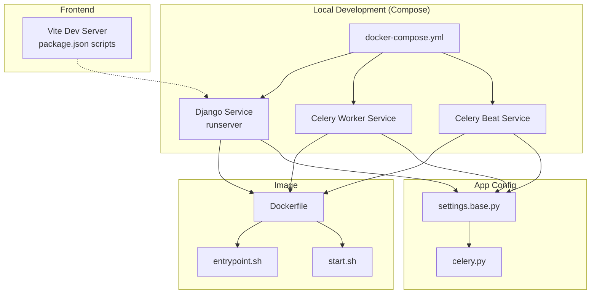
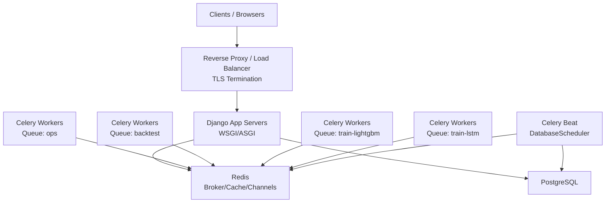
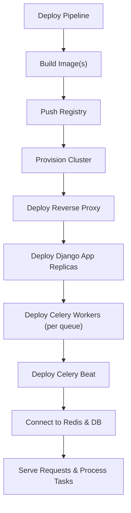
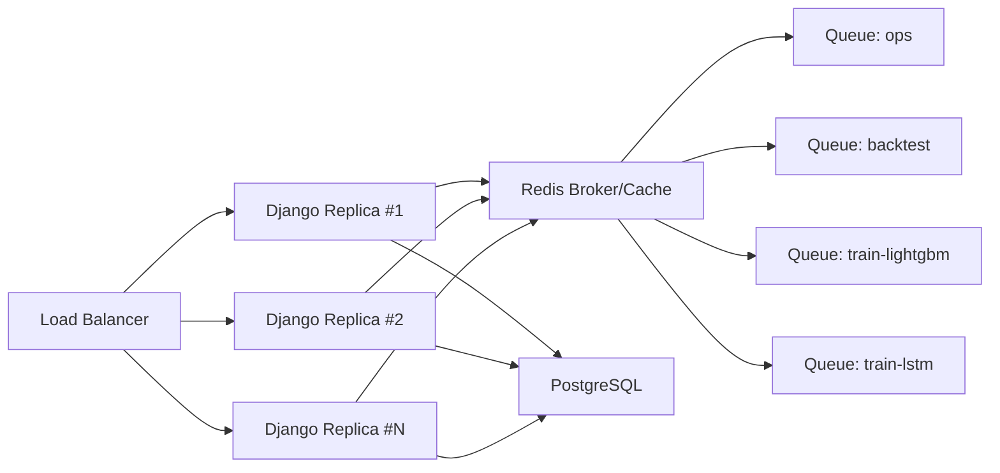
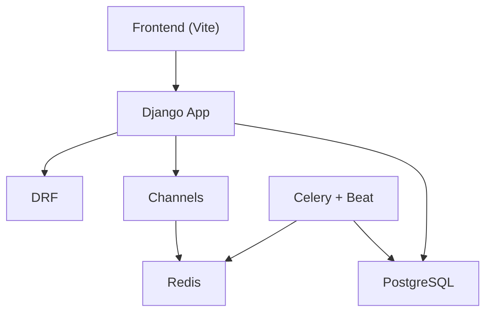

# Deployment Topology

<cite>
**Referenced Files in This Document**
- [docker-compose.yml](file://docker-compose.yml)
- [Dockerfile](file://compose/local/django/Dockerfile)
- [entrypoint.sh](file://compose/local/django/entrypoint.sh)
- [start.sh](file://compose/local/django/start.sh)
- [base.py](file://config/settings/base.py)
- [production.py](file://config/settings/production.py)
- [celery.py](file://config/celery.py)
- [run_celery_worker.sh](file://scripts/run_celery_worker.sh)
- [run_celery_beat.sh](file://scripts/run_celery_beat.sh)
- [run_backend.sh](file://scripts/run_backend.sh)
- [package.json](file://frontend/package.json)
</cite>

## Table of Contents
1. [Introduction](#introduction)
2. [Project Structure](#project-structure)
3. [Core Components](#core-components)
4. [Architecture Overview](#architecture-overview)
5. [Detailed Component Analysis](#detailed-component-analysis)
6. [Dependency Analysis](#dependency-analysis)
7. [Performance Considerations](#performance-considerations)
8. [Troubleshooting Guide](#troubleshooting-guide)
9. [Conclusion](#conclusion)
10. [Appendices](#appendices)

## Introduction
This document defines deployment topology options for the FinanceAnalysis platform, covering:
- Recommended local development setup using Docker Compose with hot-reloading for backend and frontend
- Production deployment topology with separate containers for web server, Celery workers, beat scheduler, and background task processors
- Horizontal scaling strategy including worker autoscaling and database connection pooling
- Load balancing, reverse proxy configuration, and SSL termination strategies
- CI/CD pipeline integration, automated testing in deployment environments, and rollback procedures
- Security considerations including network isolation, secret management, and access control between services
- Resource allocation, monitoring setup, and operational procedures across different deployment scales

## Project Structure
The project ships a Docker Compose file that orchestrates three primary services for local development:
- Django application (web server)
- Celery worker (background tasks)
- Celery beat (scheduled tasks)

A shared Docker image is built from a Python base image, installs system dependencies (including TA-Lib), copies project code, and exposes entrypoints to run the server, worker, and beat processes. The Django settings define Celery queues, schedules, caching, channels, and authentication. Frontend tooling uses Vite for development and builds.



**Diagram sources**
- [docker-compose.yml:1-39](file://docker-compose.yml#L1-L39)
- [Dockerfile:1-53](file://compose/local/django/Dockerfile#L1-L53)
- [entrypoint.sh:1-14](file://compose/local/django/entrypoint.sh#L1-L14)
- [start.sh:1-7](file://compose/local/django/start.sh#L1-L7)
- [base.py:174-255](file://config/settings/base.py#L174-L255)
- [celery.py:1-17](file://config/celery.py#L1-L17)
- [package.json:6-11](file://frontend/package.json#L6-L11)

**Section sources**
- [docker-compose.yml:1-39](file://docker-compose.yml#L1-L39)
- [Dockerfile:1-53](file://compose/local/django/Dockerfile#L1-L53)
- [entrypoint.sh:1-14](file://compose/local/django/entrypoint.sh#L1-L14)
- [start.sh:1-7](file://compose/local/django/start.sh#L1-L7)
- [base.py:174-255](file://config/settings/base.py#L174-L255)
- [celery.py:1-17](file://config/celery.py#L1-L17)
- [package.json:6-11](file://frontend/package.json#L6-L11)

## Core Components
- Web server: Django runserver in development; intended to be replaced by a production WSGI/ASGI server behind a reverse proxy.
- Background processing: Celery worker(s) consuming multiple queues (ops, backtest, train-lightgbm, train-lstm).
- Scheduler: Celery beat using a database-backed scheduler to dispatch periodic tasks.
- Caching and channels: Redis used for cache and WebSocket channel layer.
- Authentication and API: JWT and API key authentication with rate limiting via DRF throttling.
- Frontend: Vite dev server for hot-reloading; static assets served by Django in development.

Key configuration highlights:
- Celery broker/result backend via environment variable
- Task routing to dedicated queues
- Scheduled tasks via django-celery-beat DatabaseScheduler
- Redis-based cache and channels
- Environment-driven settings for secrets and endpoints

**Section sources**
- [base.py:174-255](file://config/settings/base.py#L174-L255)
- [base.py:264-301](file://config/settings/base.py#L264-L301)
- [base.py:323-339](file://config/settings/base.py#L323-L339)
- [celery.py:1-17](file://config/celery.py#L1-L17)

## Architecture Overview
Recommended production topology separates concerns into distinct containers/services:
- Reverse proxy/load balancer (e.g., Nginx/Traefik) handling TLS termination, request routing, and static asset serving
- Django application servers (WSGI/ASGI) behind the proxy
- Celery workers scaled horizontally per queue type
- Celery beat as a single or highly-available scheduler instance
- Shared Redis for broker, result backend, cache, and channels
- PostgreSQL for persistent data



[No sources needed since this diagram shows conceptual architecture, not specific code structure]

## Detailed Component Analysis

### Local Development Topology (Docker Compose + Hot Reload)
- Services:
  - Django service runs the development server with live reload via mounted source volumes
  - Celery worker and beat services use the same image and environment
- Entry points:
  - Entrypoint performs migrations and collects static files before exec-ing the command
  - Start script invokes the development server on all interfaces
- Frontend:
  - Vite dev server provides hot module replacement; can run alongside the backend during development

```mermaid
sequenceDiagram
participant Dev as "Developer Machine"
participant Compose as "Docker Compose"
participant Django as "Django Service"
participant Worker as "Celery Worker"
participant Beat as "Celery Beat"
participant FE as "Vite Dev Server"
Dev->>Compose : docker compose up
Compose->>Django : start.sh -> runserver
Compose->>Worker : celery worker
Compose->>Beat : celery beat
Dev->>FE : npm run dev
Note over Django,Worker,Beat : Source volumes enable hot reload
```

**Diagram sources**
- [docker-compose.yml:1-39](file://docker-compose.yml#L1-L39)
- [entrypoint.sh:1-14](file://compose/local/django/entrypoint.sh#L1-L14)
- [start.sh:1-7](file://compose/local/django/start.sh#L1-L7)
- [package.json:6-11](file://frontend/package.json#L6-L11)

**Section sources**
- [docker-compose.yml:1-39](file://docker-compose.yml#L1-L39)
- [entrypoint.sh:1-14](file://compose/local/django/entrypoint.sh#L1-L14)
- [start.sh:1-7](file://compose/local/django/start.sh#L1-L7)
- [package.json:6-11](file://frontend/package.json#L6-L11)

### Production Topology (Separate Containers)
- Web servers: Run a production-grade ASGI/WSGI server (e.g., Uvicorn/Gunicorn) behind a reverse proxy. Expose only internal ports to the app network.
- Celery workers: One container per queue or multi-queue workers with concurrency tuned per workload. Use the provided worker script to configure queues and concurrency.
- Celery beat: Single instance or clustered with leader election; uses database scheduler for persistence.
- Data plane: Redis for broker/cache/channels; PostgreSQL for persistence.
- Static assets: Served by the reverse proxy or CDN after collectstatic.



[No sources needed since this diagram shows conceptual workflow, not actual code structure]

**Section sources**
- [base.py:174-255](file://config/settings/base.py#L174-L255)
- [run_celery_worker.sh:1-28](file://scripts/run_celery_worker.sh#L1-L28)
- [run_celery_beat.sh:1-12](file://scripts/run_celery_beat.sh#L1-L12)

### Horizontal Scaling Strategy
- Worker autoscaling:
  - Scale out Celery worker replicas per queue based on queue depth and CPU/memory utilization
  - Use queue-specific workers to isolate heavy workloads (backtest, training)
  - Tune concurrency per worker via environment variables exposed by the worker script
- Application scaling:
  - Run multiple Django app replicas behind the load balancer
  - Ensure stateless requests; store sessions/tokens externally if needed
- Database connection pooling:
  - Enable connection pooling at the application level or via a proxy (e.g., PgBouncer)
  - Configure pool sizes to match replica count and expected concurrency
- Redis scaling:
  - Use managed Redis with appropriate memory limits and persistence
  - Separate logical databases or namespaces for broker, cache, and channels if supported



[No sources needed since this diagram shows conceptual scaling model, not specific code structure]

**Section sources**
- [run_celery_worker.sh:1-28](file://scripts/run_celery_worker.sh#L1-L28)
- [base.py:174-203](file://config/settings/base.py#L174-L203)

### Load Balancing, Reverse Proxy, and SSL Termination
- Place a reverse proxy in front of Django to handle:
  - TLS termination (HTTPS)
  - Request routing (API vs. admin vs. docs)
  - Rate limiting and security headers
  - Static asset caching and compression
- Configure upstreams to point to Django app replicas
- Use health checks to remove unhealthy instances
- For WebSocket support (channels), ensure proxy supports HTTP upgrade

[No sources needed since this section provides general guidance]

### CI/CD Pipeline Integration, Automated Testing, and Rollbacks
- Build stages:
  - Lint and type-check frontend and backend
  - Install dependencies and build images
- Test stages:
  - Run unit tests, integration tests against ephemeral services (DB, Redis)
  - Smoke tests against a staging environment
- Deploy stages:
  - Push images to registry
  - Update deployments with rolling updates
- Rollback procedures:
  - Keep previous image tags
  - Re-deploy prior version on failure detection
  - Feature flags to toggle risky changes

[No sources needed since this section provides general guidance]

### Security Considerations
- Network isolation:
  - Restrict inter-service communication to necessary ports
  - Use private networks for DB and Redis
- Secret management:
  - Store secrets in environment variables or a secrets manager
  - Avoid committing secrets to repository
- Access control:
  - Enforce JWT/API key authentication for API endpoints
  - Limit admin access and enforce strong credentials
- TLS:
  - Terminate TLS at the reverse proxy
  - Use secure ciphers and modern protocols

[No sources needed since this section provides general guidance]

## Dependency Analysis
The runtime depends on:
- Django and DRF for API and admin
- Channels and Redis for real-time features and caching
- Celery and django-celery-beat for background and scheduled tasks
- PostgreSQL driver for database connectivity
- Frontend toolchain for building and serving UI assets



**Diagram sources**
- [base.py:174-255](file://config/settings/base.py#L174-L255)
- [base.py:323-339](file://config/settings/base.py#L323-L339)
- [celery.py:1-17](file://config/celery.py#L1-L17)
- [package.json:6-11](file://frontend/package.json#L6-L11)

**Section sources**
- [base.py:174-255](file://config/settings/base.py#L174-L255)
- [base.py:323-339](file://config/settings/base.py#L323-L339)
- [celery.py:1-17](file://config/celery.py#L1-L17)
- [package.json:6-11](file://frontend/package.json#L6-L11)

## Performance Considerations
- Connection pooling:
  - Configure database connection pools to match concurrent connections
  - Consider a connection pooler for high-concurrency deployments
- Worker tuning:
  - Set concurrency per queue based on CPU cores and task characteristics
  - Monitor queue depths and adjust worker counts accordingly
- Caching:
  - Use Redis for caching and channels; size memory appropriately
- Static assets:
  - Collect and serve static files via reverse proxy or CDN
- Timeouts and retries:
  - Tune task time limits and retry policies for long-running jobs

[No sources needed since this section provides general guidance]

## Troubleshooting Guide
Common issues and where to look:
- Migration failures:
  - Entrypoint runs migrations before starting the server; check logs for migration errors
- Celery connectivity:
  - Verify broker URL and Redis availability; check worker logs for connection errors
- Scheduled tasks not running:
  - Confirm beat is running and connected to the database scheduler
- Frontend hot reload:
  - Ensure Vite dev server is running and backend is accessible from the frontend dev server

Operational tips:
- Inspect container logs for each service
- Validate environment variables for broker, cache, and database URLs
- Use health checks to detect unhealthy components

**Section sources**
- [entrypoint.sh:1-14](file://compose/local/django/entrypoint.sh#L1-L14)
- [base.py:174-203](file://config/settings/base.py#L174-L203)
- [run_celery_beat.sh:1-12](file://scripts/run_celery_beat.sh#L1-L12)

## Conclusion
The FinanceAnalysis platform supports a flexible deployment model:
- Local development via Docker Compose with hot reloading for both backend and frontend
- Production-ready topology with clear separation of web servers, background workers, and scheduler
- Horizontal scaling through worker autoscaling and application replicas
- Robust configuration for queues, scheduling, caching, and authentication
- Guidance for load balancing, SSL, CI/CD, security, and operations across scales

[No sources needed since this section summarizes without analyzing specific files]

## Appendices

### Local Development Quick Start
- Start services with Docker Compose to run Django, Celery worker, and beat
- Run the frontend dev server for hot reloading
- Entrypoint handles migrations and static collection automatically

**Section sources**
- [docker-compose.yml:1-39](file://docker-compose.yml#L1-L39)
- [entrypoint.sh:1-14](file://compose/local/django/entrypoint.sh#L1-L14)
- [start.sh:1-7](file://compose/local/django/start.sh#L1-L7)
- [package.json:6-11](file://frontend/package.json#L6-L11)

### Production Configuration Notes
- Extend production settings for hardened configurations
- Replace development server with a production WSGI/ASGI server
- Configure reverse proxy for TLS and routing
- Ensure Redis and PostgreSQL are provisioned and secured

**Section sources**
- [production.py:1-4](file://config/settings/production.py#L1-L4)
- [base.py:174-255](file://config/settings/base.py#L174-L255)