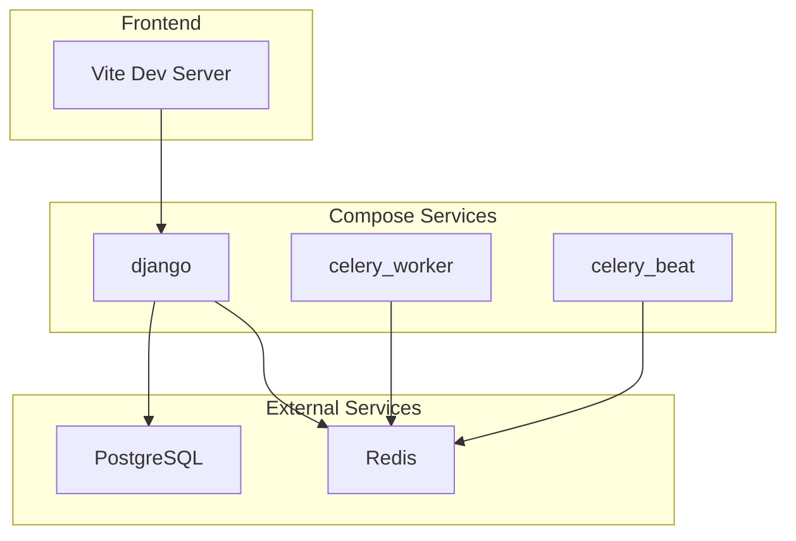
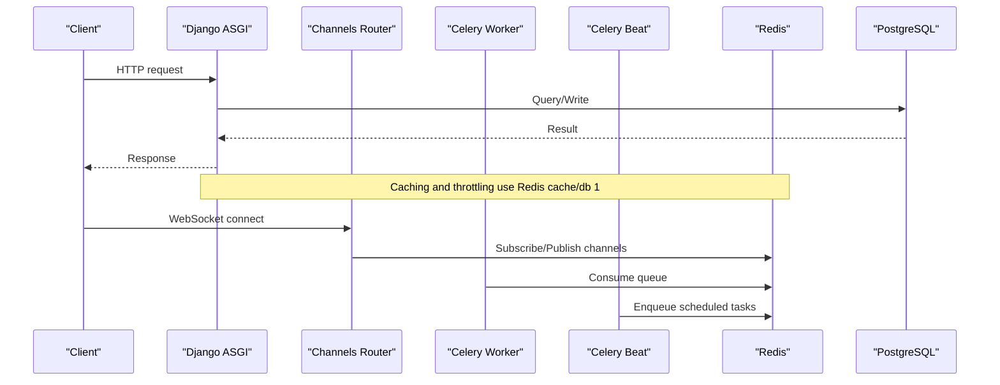
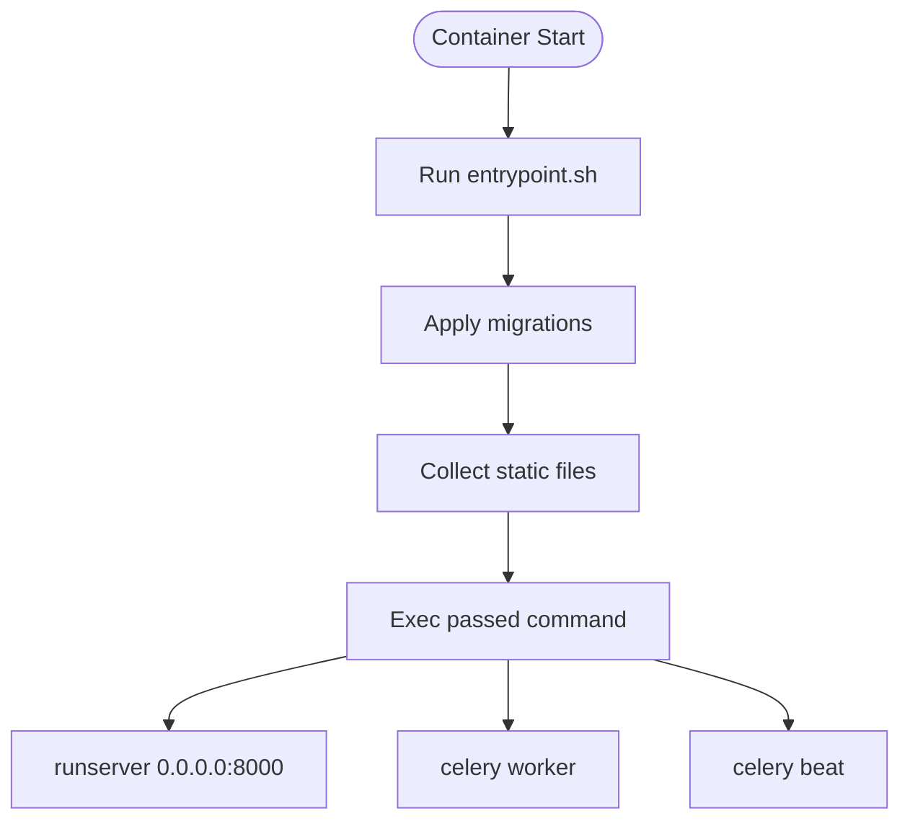
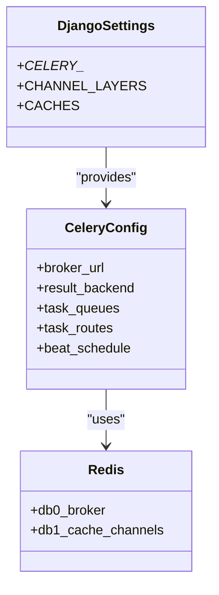
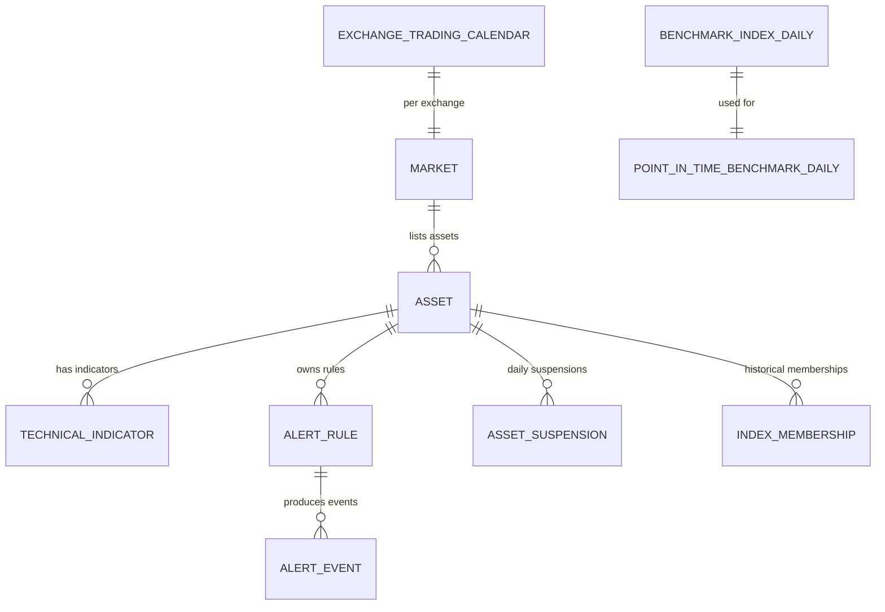
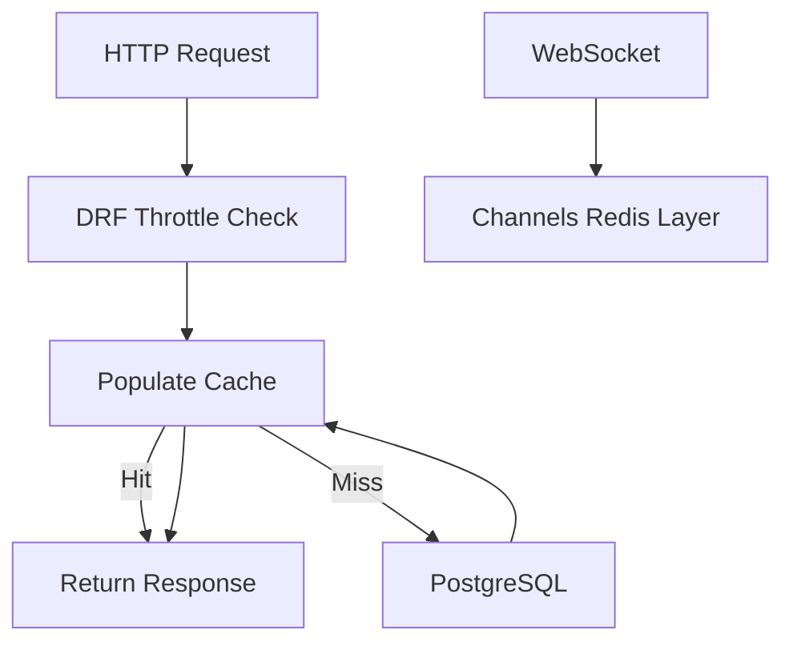
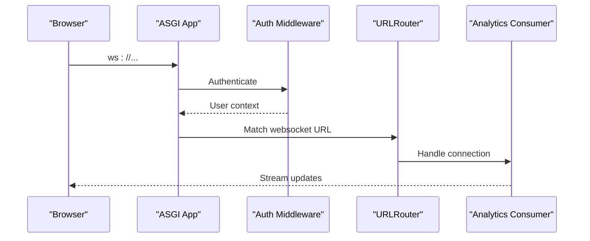
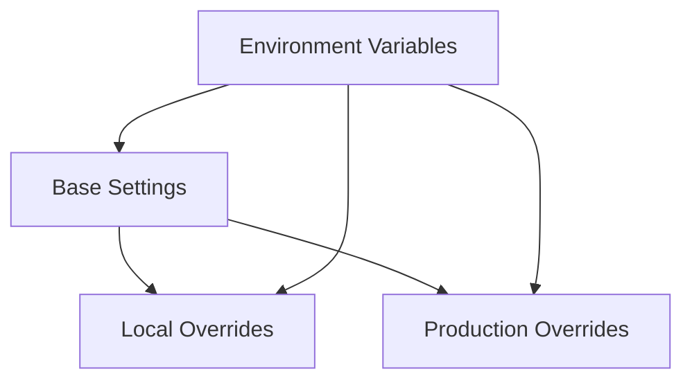
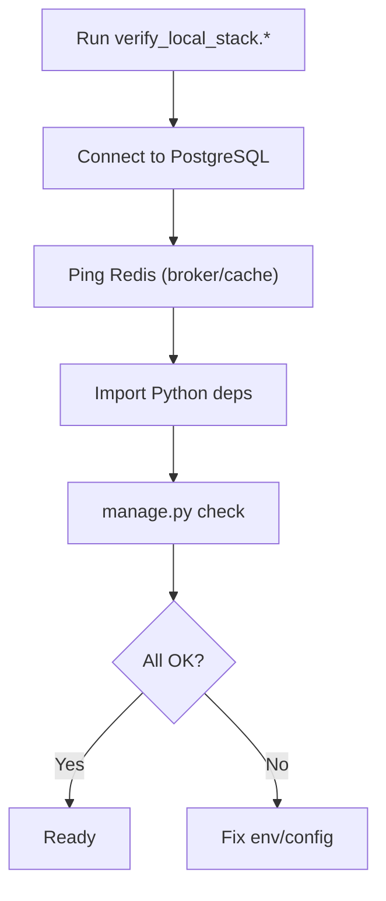
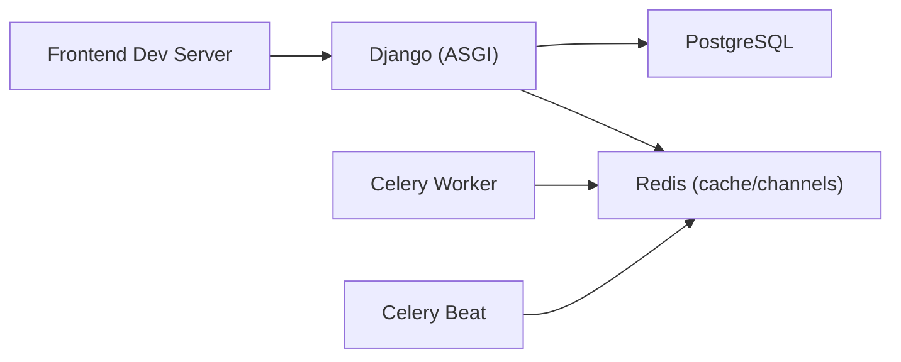

# Infrastructure Components

<cite>
**Referenced Files in This Document**
- [docker-compose.yml](file://docker-compose.yml)
- [Dockerfile](file://compose/local/django/Dockerfile)
- [entrypoint.sh](file://compose/local/django/entrypoint.sh)
- [start.sh](file://compose/local/django/start.sh)
- [base.py](file://config/settings/base.py)
- [local.py](file://config/settings/local.py)
- [production.py](file://config/settings/production.py)
- [celery.py](file://config/celery.py)
- [asgi.py](file://config/asgi.py)
- [routing.py](file://config/routing.py)
- [models.py (analytics)](file://apps/analytics/models.py)
- [models.py (markets)](file://apps/markets/models.py)
- [verify_local_stack.sh](file://scripts/verify_local_stack.sh)
- [verify_local_stack.ps1](file://scripts/verify_local_stack.ps1)
- [smoke_api_check.sh](file://scripts/smoke_api_check.sh)
- [local-setup.md](file://docs/how-to/local-setup.md)
- [testing.md](file://docs/how-to/testing.md)
</cite>

## Table of Contents
1. Introduction
2. Project Structure
3. Core Components
4. Architecture Overview
5. Detailed Component Analysis
6. Dependency Analysis
7. Performance Considerations
8. Troubleshooting Guide
9. Conclusion
10. Appendices

## Introduction
This document describes the infrastructure components that support the FinanceAnalysis platform. It focuses on containerized deployment with Docker Compose, service orchestration for Django, Celery workers and scheduler, PostgreSQL database, and Redis used as both a message broker and cache/channel layer. It also covers database schema design and indexing strategies, caching and session considerations, monitoring and health checks, scaling considerations, environment-specific configuration, and backup and disaster recovery guidance.

## Project Structure
The repository organizes infrastructure around:
- A Docker Compose file defining Django, Celery worker, and Celery Beat services.
- A local Django container image built from a Dockerfile that installs system dependencies, Python packages, and entrypoint scripts.
- Django settings split into base, local, and production modules.
- ASGI routing to serve HTTP and WebSocket traffic via Channels.
- Celery configuration for task queues and scheduled jobs.
- Database models with explicit indexes for performance.
- Scripts to verify local stack connectivity and smoke-test API endpoints.

**Diagram sources**
- [docker-compose.yml:1-39](file://docker-compose.yml#L1-L39)
- [base.py:174-203](file://config/settings/base.py#L174-L203)
- [base.py:323-339](file://config/settings/base.py#L323-L339)

**Section sources**
- [docker-compose.yml:1-39](file://docker-compose.yml#L1-L39)
- [Dockerfile:1-53](file://compose/local/django/Dockerfile#L1-L53)
- [base.py:122-125](file://config/settings/base.py#L122-L125)
- [base.py:174-203](file://config/settings/base.py#L174-L203)
- [base.py:323-339](file://config/settings/base.py#L323-L339)

## Core Components
- Containerized Django application with migrations and static files applied at startup.
- Celery worker and beat processes using Redis as broker and result backend.
- PostgreSQL as the primary data store with explicit indexes on high-cardinality and query-heavy fields.
- Redis for caching, rate limiting/throttling counters, and the Channels WebSocket channel layer.
- ASGI entrypoint serving both HTTP and WebSocket routes through Channels.
- Local verification scripts to probe PostgreSQL and Redis readiness and validate Python dependencies.

**Section sources**
- [entrypoint.sh:1-13](file://compose/local/django/entrypoint.sh#L1-L13)
- [start.sh:1-7](file://compose/local/django/start.sh#L1-L7)
- [celery.py:1-17](file://config/celery.py#L1-L17)
- [base.py:174-203](file://config/settings/base.py#L174-L203)
- [base.py:323-339](file://config/settings/base.py#L323-L339)
- [asgi.py:1-28](file://config/asgi.py#L1-L28)
- [verify_local_stack.sh:1-47](file://scripts/verify_local_stack.sh#L1-L47)
- [verify_local_stack.ps1:1-84](file://scripts/verify_local_stack.ps1#L1-L84)

## Architecture Overview
The runtime architecture consists of:
- Django ASGI server handling HTTP requests and WebSocket connections.
- Celery workers consuming tasks from dedicated queues routed by name.
- Celery Beat scheduling periodic tasks against the same broker.
- PostgreSQL storing domain entities with carefully chosen indexes.
- Redis providing three roles: Celery broker/result backend, Django cache, and Channels channel layer.

**Diagram sources**
- [asgi.py:20-27](file://config/asgi.py#L20-L27)
- [routing.py:1-14](file://config/routing.py#L1-L14)
- [base.py:174-203](file://config/settings/base.py#L174-L203)
- [base.py:323-339](file://config/settings/base.py#L323-L339)

## Detailed Component Analysis

### Docker Compose and Container Lifecycle
- The Compose file defines three services sharing the same image: Django web, Celery worker, and Celery Beat. Each runs with the project volume mounted and environment loaded from .env.
- The container image installs TA-Lib C library, Python dependencies, and copies entrypoint/start scripts.
- The entrypoint performs migrations and collects static files before executing the provided command.
- The Django service starts the development server bound to all interfaces.

**Diagram sources**
- [docker-compose.yml:1-39](file://docker-compose.yml#L1-L39)
- [Dockerfile:1-53](file://compose/local/django/Dockerfile#L1-L53)
- [entrypoint.sh:1-13](file://compose/local/django/entrypoint.sh#L1-L13)
- [start.sh:1-7](file://compose/local/django/start.sh#L1-L7)

**Section sources**
- [docker-compose.yml:1-39](file://docker-compose.yml#L1-L39)
- [Dockerfile:1-53](file://compose/local/django/Dockerfile#L1-L53)
- [entrypoint.sh:1-13](file://compose/local/django/entrypoint.sh#L1-L13)
- [start.sh:1-7](file://compose/local/django/start.sh#L1-L7)

### Message Broker and Task Queues (Redis + Celery)
- Celery is configured to use Redis as both broker and result backend.
- Dedicated queues are defined for operations, backtests, and model training (LightGBM and LSTM).
- Task routing maps specific tasks to their respective queues.
- Celery Beat uses a database-backed scheduler to run periodic tasks such as market syncs, alert checks, macro data syncs, news ingestion, and prediction generation.

**Diagram sources**
- [base.py:174-203](file://config/settings/base.py#L174-L203)
- [base.py:323-339](file://config/settings/base.py#L323-L339)
- [celery.py:1-17](file://config/celery.py#L1-L17)

**Section sources**
- [base.py:174-203](file://config/settings/base.py#L174-L203)
- [celery.py:1-17](file://config/celery.py#L1-L17)

### Database Schema Design and Indexing Strategy (PostgreSQL)
Key models and their indexing approaches:
- TechnicalIndicator: indexed by asset, timestamp, indicator_type; unique constraint on asset/timestamp/type/parameters to prevent duplicates.
- ScreenerTemplate: indexed by owner/is_public and screener_type for fast filtering.
- AlertRule: indexed by owner/is_active and asset/is_active to optimize active rule evaluation.
- AlertEvent: indexed by alert_rule/created_at and status/created_at for event history queries.
- Market/Asset: unique constraints on codes and symbols; Asset has listing lifecycle dates and membership tags.
- ExchangeTradingCalendar: composite index on exchange_code/trade_date; unique per date per exchange.
- AssetSuspension: indexed by asset/trade_date and trade_date/is_full_day; unique per asset/date.
- IndexMembership: composite index on index_code/trade_date and asset/index_code; unique per asset/index/date.
- BenchmarkIndexDaily: composite index on index_code/trade_date; unique per index/date.
- PointInTimeBenchmarkDaily: composite index on benchmark_code/trade_date; unique per benchmark/date.

These indexes align with common query patterns: time-series lookups by asset or index, active rule evaluation, and historical membership snapshots.

**Diagram sources**
- [models.py (analytics):8-43](file://apps/analytics/models.py#L8-L43)
- [models.py (analytics):48-82](file://apps/analytics/models.py#L48-L82)
- [models.py (analytics):87-143](file://apps/analytics/models.py#L87-L143)
- [models.py (analytics):148-193](file://apps/analytics/models.py#L148-L193)
- [models.py (markets):19-63](file://apps/markets/models.py#L19-L63)
- [models.py (markets):65-82](file://apps/markets/models.py#L65-L82)
- [models.py (markets):87-112](file://apps/markets/models.py#L87-L112)
- [models.py (markets):117-142](file://apps/markets/models.py#L117-L142)
- [models.py (markets):147-168](file://apps/markets/models.py#L147-L168)
- [models.py (markets):173-197](file://apps/markets/models.py#L173-L197)

**Section sources**
- [models.py (analytics):8-43](file://apps/analytics/models.py#L8-L43)
- [models.py (analytics):48-82](file://apps/analytics/models.py#L48-L82)
- [models.py (analytics):87-143](file://apps/analytics/models.py#L87-L143)
- [models.py (analytics):148-193](file://apps/analytics/models.py#L148-L193)
- [models.py (markets):19-63](file://apps/markets/models.py#L19-L63)
- [models.py (markets):65-82](file://apps/markets/models.py#L65-L82)
- [models.py (markets):87-112](file://apps/markets/models.py#L87-L112)
- [models.py (markets):117-142](file://apps/markets/models.py#L117-L142)
- [models.py (markets):147-168](file://apps/markets/models.py#L147-L168)
- [models.py (markets):173-197](file://apps/markets/models.py#L173-L197)

### Caching Layer and Session Storage (Redis)
- Django cache backend is configured to use Redis at a dedicated database number.
- Channels channel layer also uses Redis for cross-process WebSocket pub/sub.
- DRF throttling relies on cache-backed counters; authentication tokens and refresh rotation are managed via JWT settings.
- For sessions, Django’s default session engine uses the database unless overridden; ensure consistent cache behavior for throttling and caching regardless of session backend.

**Diagram sources**
- [base.py:264-301](file://config/settings/base.py#L264-L301)
- [base.py:303-321](file://config/settings/base.py#L303-L321)
- [base.py:323-339](file://config/settings/base.py#L323-L339)

**Section sources**
- [base.py:264-301](file://config/settings/base.py#L264-L301)
- [base.py:303-321](file://config/settings/base.py#L303-L321)
- [base.py:323-339](file://config/settings/base.py#L323-L339)

### WebSocket and ASGI Routing
- The ASGI application exposes both HTTP and WebSocket protocols.
- WebSocket routes are centralized under apps.analytics.routing and wrapped with authentication middleware.
- This enables real-time features such as alert streams while reusing Django’s auth stack.

**Diagram sources**
- [asgi.py:20-27](file://config/asgi.py#L20-L27)
- [routing.py:1-14](file://config/routing.py#L1-L14)

**Section sources**
- [asgi.py:1-28](file://config/asgi.py#L1-L28)
- [routing.py:1-14](file://config/routing.py#L1-L14)

### Environment-Specific Configuration
- Base settings define defaults for databases, caching, channels, Celery, and REST framework.
- Local settings enable debug mode, set a local secret key, and configure allowed hosts and email backend suitable for development.
- Production settings module exists but currently defers to base; add production overrides there when deploying.
- Environment variables drive external service URLs and feature toggles.

**Diagram sources**
- [base.py:122-125](file://config/settings/base.py#L122-L125)
- [base.py:174-203](file://config/settings/base.py#L174-L203)
- [base.py:323-339](file://config/settings/base.py#L323-L339)
- [local.py:1-20](file://config/settings/local.py#L1-L20)
- [production.py:1-4](file://config/settings/production.py#L1-L4)

**Section sources**
- [base.py:122-125](file://config/settings/base.py#L122-L125)
- [base.py:174-203](file://config/settings/base.py#L174-L203)
- [base.py:323-339](file://config/settings/base.py#L323-L339)
- [local.py:1-20](file://config/settings/local.py#L1-L20)
- [production.py:1-4](file://config/settings/production.py#L1-L4)

### Monitoring, Health Checks, and Smoke Tests
- Local stack verification scripts probe PostgreSQL and Redis using Python drivers and report readiness.
- A smoke test script calls representative API endpoints to assert data availability and basic functionality.
- These tools help detect misconfiguration early (e.g., wrong Redis credentials or unreachable database).

**Diagram sources**
- [verify_local_stack.sh:1-47](file://scripts/verify_local_stack.sh#L1-L47)
- [verify_local_stack.ps1:1-84](file://scripts/verify_local_stack.ps1#L1-L84)
- [smoke_api_check.sh:70-84](file://scripts/smoke_api_check.sh#L70-L84)

**Section sources**
- [verify_local_stack.sh:1-47](file://scripts/verify_local_stack.sh#L1-L47)
- [verify_local_stack.ps1:1-84](file://scripts/verify_local_stack.ps1#L1-L84)
- [smoke_api_check.sh:70-84](file://scripts/smoke_api_check.sh#L70-L84)

### Scaling Considerations
- Horizontal scaling:
  - Add more Celery worker containers behind the same Redis broker to increase throughput for backtests and training tasks.
  - Scale Django horizontally behind a reverse proxy; ensure sticky sessions if using in-memory session storage or configure a shared session backend.
- Vertical scaling:
  - Increase PostgreSQL resources for heavy analytical queries and large datasets.
  - Tune Redis memory limits and eviction policy to avoid dropping keys under load.
- Queue isolation:
  - Keep dedicated queues for backtests and model training to prevent contention with operational tasks.
- Statelessness:
  - Keep Django stateless; rely on PostgreSQL and Redis for persistent state.

[No sources needed since this section provides general guidance]

### Backup, Recovery, and Data Retention
- PostgreSQL:
  - Use logical backups (e.g., pg_dump) for application schemas and data; schedule regular dumps aligned with business needs.
  - Maintain point-in-time recovery by enabling WAL archiving where supported.
- Redis:
  - Treat Redis as ephemeral for caches and broker; do not rely on it for durable persistence.
  - If using Redis for any critical state, enable RDB/AOF and back up those files separately.
- Retention policies:
  - Define retention windows for logs, metrics, and transient data (e.g., alert events, temporary artifacts).
  - Archive or purge old data via management commands or scheduled tasks to control growth.
- Disaster recovery:
  - Document restore procedures for PostgreSQL and any persisted artifacts.
  - Test restores periodically to validate integrity and recovery time objectives.

[No sources needed since this section provides general guidance]

## Dependency Analysis
The following diagram shows how services depend on each other and on external infrastructure.

**Diagram sources**
- [docker-compose.yml:1-39](file://docker-compose.yml#L1-L39)
- [base.py:122-125](file://config/settings/base.py#L122-L125)
- [base.py:174-203](file://config/settings/base.py#L174-L203)
- [base.py:323-339](file://config/settings/base.py#L323-L339)

**Section sources**
- [docker-compose.yml:1-39](file://docker-compose.yml#L1-L39)
- [base.py:122-125](file://config/settings/base.py#L122-L125)
- [base.py:174-203](file://config/settings/base.py#L174-L203)
- [base.py:323-339](file://config/settings/base.py#L323-L339)

## Performance Considerations
- Database:
  - Leverage existing composite indexes for time-series and membership queries.
  - Monitor slow queries and consider additional indexes for new access patterns.
- Caching:
  - Use Redis cache for expensive computations and response caching; ensure appropriate TTLs.
  - Be mindful of cache invalidation strategies when data changes frequently.
- Queues:
  - Route long-running tasks to isolated queues to avoid starving short-lived operations.
  - Tune worker concurrency and task time limits based on workload characteristics.
- Redis:
  - Set maxmemory and an appropriate eviction policy to protect broker and cache stability.
  - Separate databases for broker and cache/channels to reduce interference.

[No sources needed since this section provides general guidance]

## Troubleshooting Guide
Common issues and diagnostics:
- Redis authentication failures:
  - Symptoms include throttle errors and WebSocket channel layer failures.
  - Verify Redis URL shape and credentials; the local setup documentation explains ACL username vs requirepass differences.
- Connectivity:
  - Use the local stack verification scripts to confirm PostgreSQL and Redis reachability and dependency imports.
- API health:
  - Run the smoke API check to validate endpoint responses and data presence.

**Section sources**
- [testing.md:218-254](file://docs/how-to/testing.md#L218-L254)
- [local-setup.md:241-296](file://docs/how-to/local-setup.md#L241-L296)
- [verify_local_stack.sh:1-47](file://scripts/verify_local_stack.sh#L1-L47)
- [verify_local_stack.ps1:1-84](file://scripts/verify_local_stack.ps1#L1-L84)
- [smoke_api_check.sh:70-84](file://scripts/smoke_api_check.sh#L70-L84)

## Conclusion
The FinanceAnalysis platform uses a clear separation of concerns across Django, Celery, PostgreSQL, and Redis. The Docker Compose setup orchestrates core services, while Redis serves multiple roles efficiently. Database models are designed with targeted indexes to support analytical workloads. Verification and smoke testing scripts streamline local troubleshooting. For production, extend the settings module, plan backups and retention, and scale horizontally where appropriate.

## Appendices

### Service Orchestration Summary
- Django: ASGI server with HTTP and WebSocket support.
- Celery Worker: Consumes tasks from dedicated queues.
- Celery Beat: Schedules periodic tasks via database-backed scheduler.
- PostgreSQL: Primary relational store with strong indexing strategy.
- Redis: Broker, cache, and channel layer.

**Section sources**
- [docker-compose.yml:1-39](file://docker-compose.yml#L1-L39)
- [base.py:174-203](file://config/settings/base.py#L174-L203)
- [base.py:323-339](file://config/settings/base.py#L323-L339)