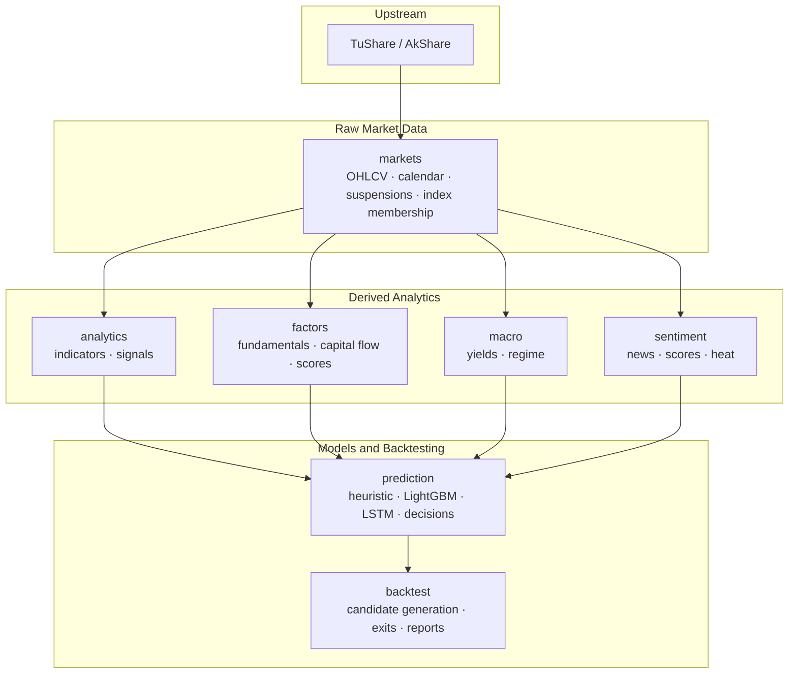
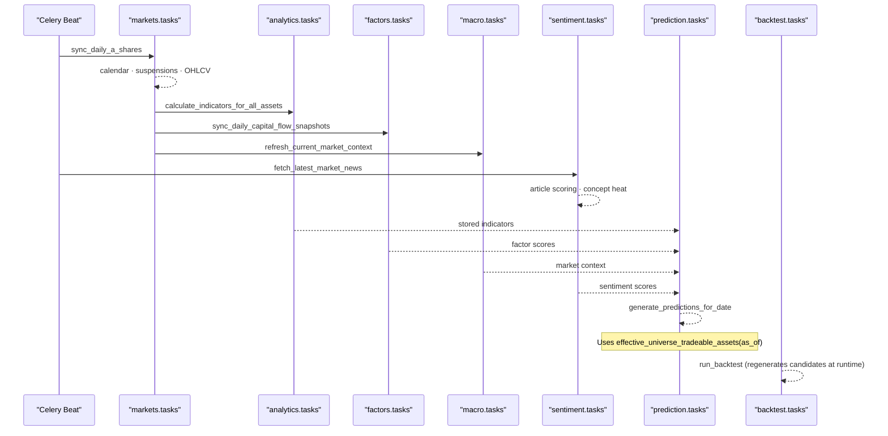
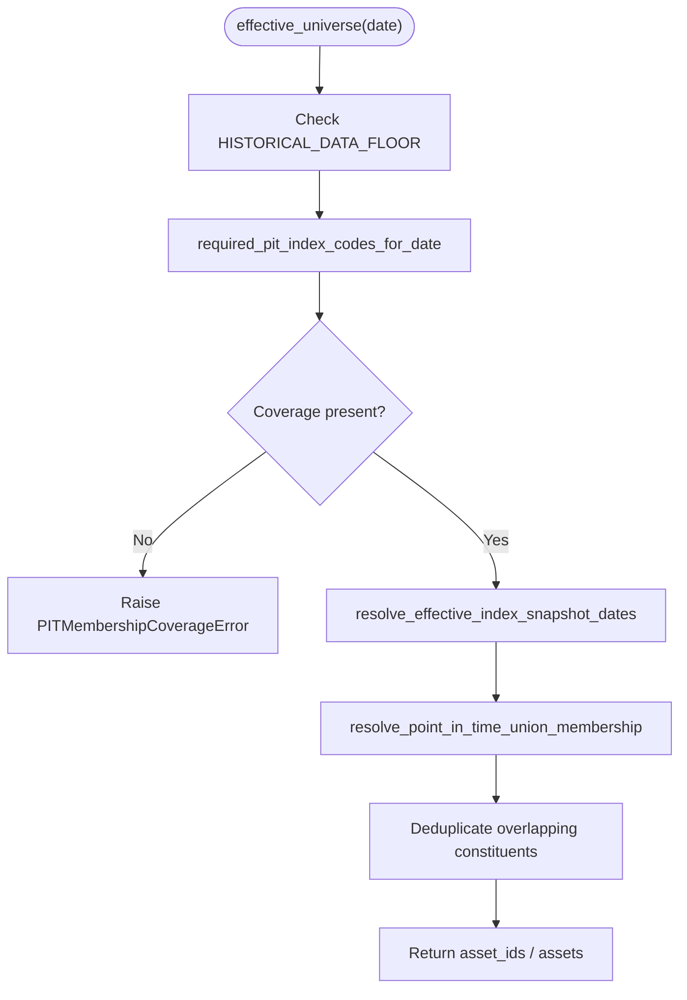
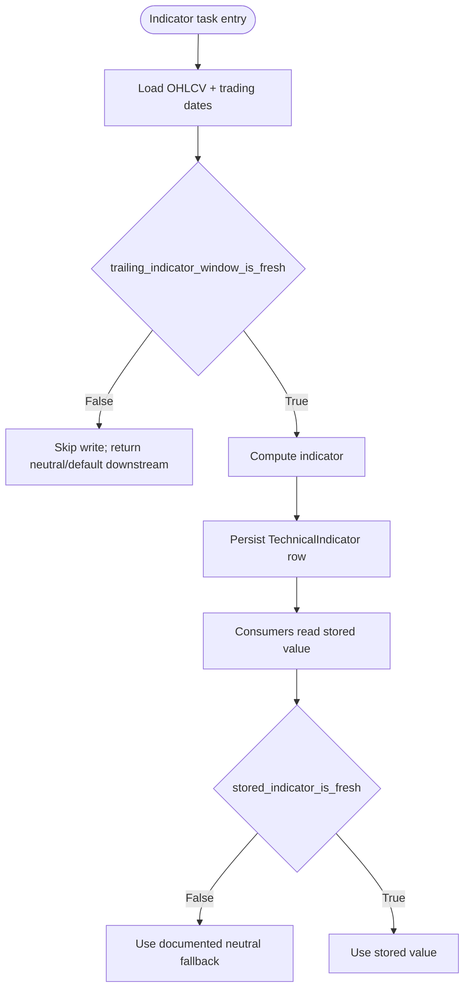
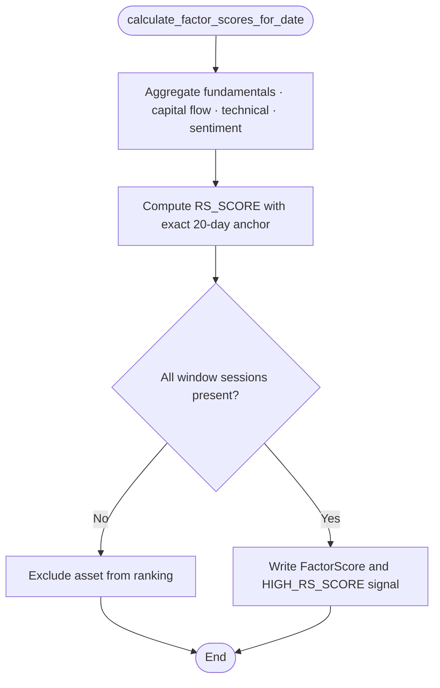
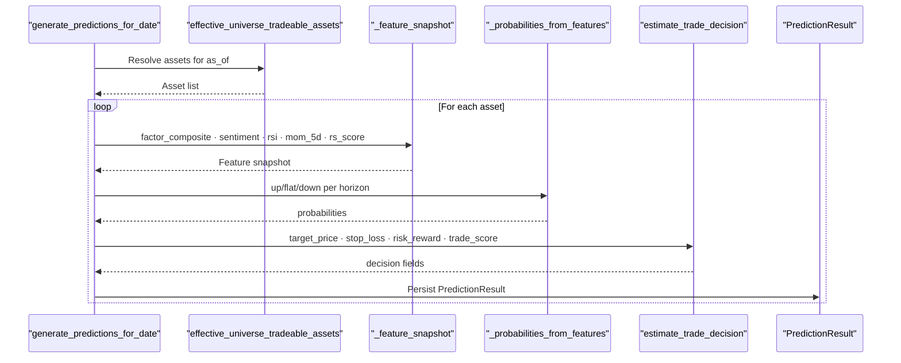
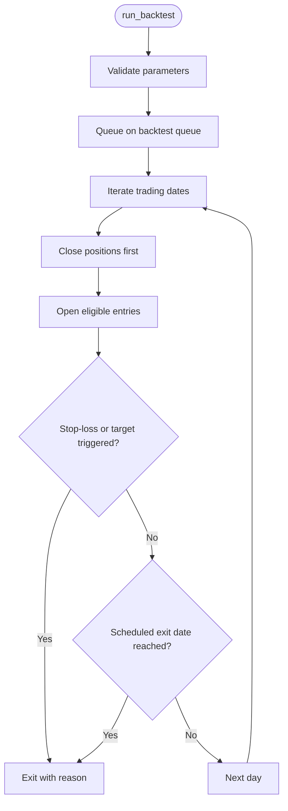
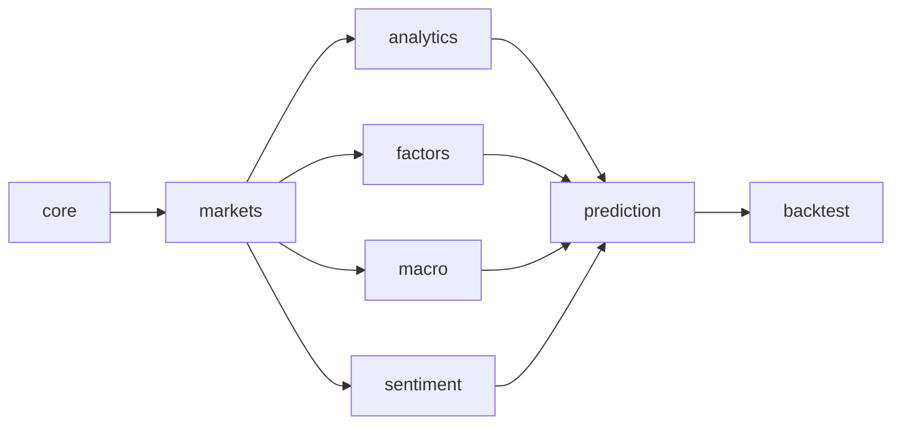
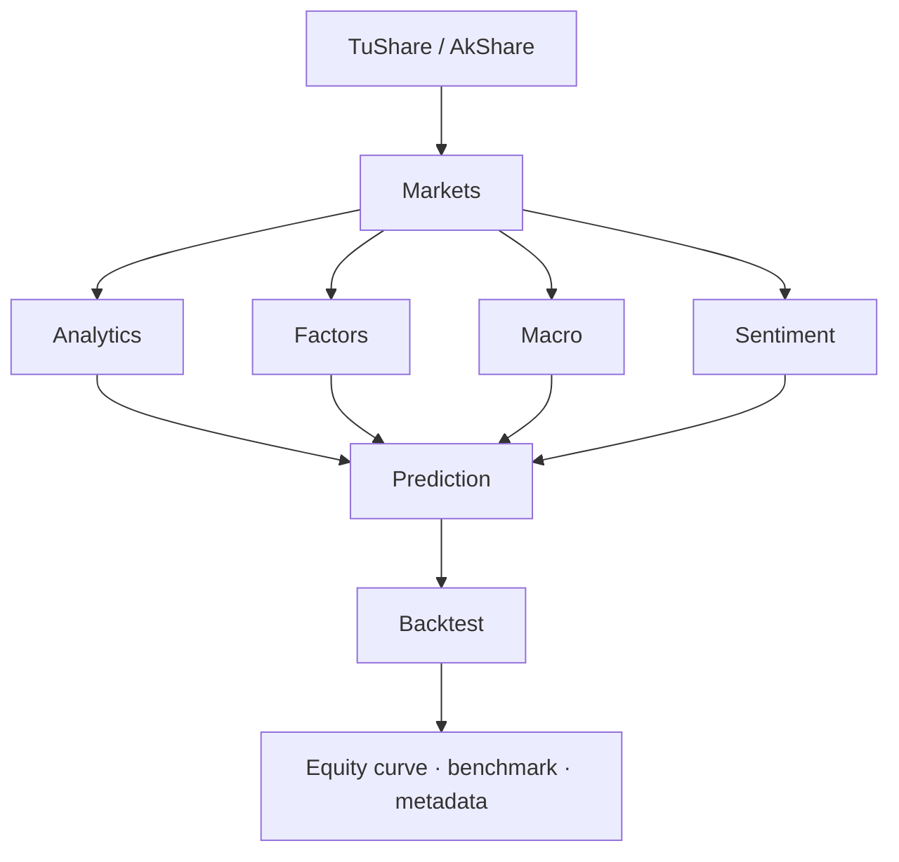

# System Design Principles

<cite>
**Referenced Files in This Document**
- [README.md](file://README.md)
- [TECHNICAL_GUIDE.md](file://TECHNICAL_GUIDE.md)
- [config/settings/base.py](file://config/settings/base.py)
- [apps/core/date_floor.py](file://apps/core/date_floor.py)
- [apps/markets/benchmarking.py](file://apps/markets/benchmarking.py)
- [apps/markets/models.py](file://apps/markets/models.py)
- [apps/analytics/technical_staleness.py](file://apps/analytics/technical_staleness.py)
- [apps/analytics/tasks.py](file://apps/analytics/tasks.py)
- [apps/factors/tasks.py](file://apps/factors/tasks.py)
- [apps/prediction/tasks.py](file://apps/prediction/tasks.py)
- [apps/backtest/tasks.py](file://apps/backtest/tasks.py)
- [docs/how-to/runbook-stale-data.md](file://docs/how-to/runbook-stale-data.md)
- [docs/reference/celery.md](file://docs/reference/celery.md)
</cite>

## Table of Contents
1. Introduction
2. Project Structure
3. Core Components
4. Architecture Overview
5. Detailed Component Analysis
6. Dependency Analysis
7. Performance Considerations
8. Troubleshooting Guide
9. Conclusion

## Introduction
This document explains the system design principles that keep FinanceAnalysis temporally correct, auditable, and safe against common financial data pitfalls such as look-ahead bias and survivorship bias. The platform enforces a strict upstream-to-derived ordering so that every cross-sectional calculation, training sample filter, backtest candidate pool, benchmark build, and daily prediction resolves to what was known at the time. It separates raw market data from derived analytical features, uses point-in-time membership for universe construction, implements a modular monolith with clear app boundaries, and relies on an event-driven Celery pipeline with staleness policies and freshness tracking to ensure reliability.

## Project Structure
FinanceAnalysis is organized as a Django modular monolith with ten apps that follow a strict dependency order: core → markets → analytics/factors/macro/sentiment → prediction → backtest. The README documents this ordering and the high-level data flow from providers through storage into derived layers and finally into predictions and backtests.

**Diagram sources**
- [README.md:48-90](file://README.md#L48-L90)

**Section sources**
- [README.md:48-90](file://README.md#L48-L90)

## Core Components
- Point-in-time effective universe contract: A single rule governs all cross-sectional logic, training filters, backtest pools, benchmarks, and predictions. Before a date, only CSI 300 is used; after a launch date, the union of CSI 300 and CSI A500 is used. Missing coverage fails closed rather than widening silently.
- Stored analytics vs runtime-computed features: Technical indicators and factor scores are stored once and reused by heuristic, LightGBM, LSTM, and backtests. Backtests regenerate candidates at runtime to avoid dependence on patchy historical prediction coverage and to always use the currently active model artifact.
- Technical freshness policy: Staleness is refused rather than tolerated. Each indicator family has explicit maximum trading-day gaps and exact-window requirements. Consumers check both age and internal gaps using official trading calendars.
- Macro snapshot semantics: Monthly rows normalized to month start; derived context is resolved as-of to avoid future leakage.
- Model lifecycle and artifacts: Per-horizon deployment state, version tags, missing-value contracts, pruning rules, and plausible accuracy bounds are enforced and audited.
- Backtest engine semantics: Close-before-open execution, conservative exits, asymmetric fees, chunked long runs, and deterministic cost models.

**Section sources**
- [TECHNICAL_GUIDE.md:25-73](file://TECHNICAL_GUIDE.md#L25-L73)
- [TECHNICAL_GUIDE.md:75-115](file://TECHNICAL_GUIDE.md#L75-L115)
- [TECHNICAL_GUIDE.md:117-225](file://TECHNICAL_GUIDE.md#L117-L225)
- [TECHNICAL_GUIDE.md:227-261](file://TECHNICAL_GUIDE.md#L227-L261)
- [TECHNICAL_GUIDE.md:264-551](file://TECHNICAL_GUIDE.md#L264-L551)
- [TECHNICAL_GUIDE.md:553-662](file://TECHNICAL_GUIDE.md#L553-L662)
- [TECHNICAL_GUIDE.md:664-800](file://TECHNICAL_GUIDE.md#L664-L800)

## Architecture Overview
The platform enforces temporal integrity through three architectural pillars:

1. Strict upstream-to-derived ordering
   - Raw OHLCV, calendar, and suspensions are ingested first.
   - Derived layers (indicators, factors, macro, sentiment) depend only on earlier layers.
   - Prediction and backtest consume derived layers under point-in-time constraints.

2. Point-in-time data model
   - Index membership snapshots resolve constituents as they were on each date.
   - Effective universe functions enforce required coverage and fail fast when missing.
   - Benchmarks are built from PIT unions with metadata about snapshot dates and overlaps.

3. Event-driven processing with Celery
   - Daily schedules orchestrate ingestion, derivation, prediction, and alerts.
   - Long-running or CPU-heavy tasks run on dedicated queues with explicit routing.
   - Freshness checks gate writes and reads to prevent stale data consumption.

**Diagram sources**
- [config/settings/base.py:218-255](file://config/settings/base.py#L218-L255)
- [docs/reference/celery.md:34-48](file://docs/reference/celery.md#L34-L48)
- [apps/markets/tasks.py:14-20](file://apps/markets/tasks.py#L14-L20)
- [apps/analytics/tasks.py:594-615](file://apps/analytics/tasks.py#L594-L615)
- [apps/prediction/tasks.py:177-243](file://apps/prediction/tasks.py#L177-L243)
- [apps/backtest/tasks.py:23-37](file://apps/backtest/tasks.py#L23-L37)

**Section sources**
- [config/settings/base.py:174-255](file://config/settings/base.py#L174-L255)
- [docs/reference/celery.md:13-48](file://docs/reference/celery.md#L13-L48)

## Detailed Component Analysis

### Point-in-Time Universe and Benchmarking
The canonical effective universe function enforces the shared date-aware membership rule. It requires CSI 300 from a start date and adds CSI A500 from a launch date. Coverage gaps raise explicit errors instead of silently widening to all assets. The PIT union builds benchmarks using the latest available membership snapshot per index code, deduplicates overlapping constituents, and records metadata including snapshot dates and overlap counts.

**Diagram sources**
- [apps/markets/benchmarking.py:93-147](file://apps/markets/benchmarking.py#L93-L147)
- [apps/markets/benchmarking.py:149-213](file://apps/markets/benchmarking.py#L149-L213)
- [apps/core/date_floor.py:6-14](file://apps/core/date_floor.py#L6-L14)

**Section sources**
- [apps/markets/benchmarking.py:1-147](file://apps/markets/benchmarking.py#L1-L147)
- [apps/markets/benchmarking.py:149-283](file://apps/markets/benchmarking.py#L149-L283)
- [apps/core/date_floor.py:6-14](file://apps/core/date_floor.py#L6-L14)

### Stored Analytics and Freshness Guards
Technical indicators are computed via Celery tasks and persisted. Every computation path validates freshness before writing or consuming values. Freshness is based on official trading days, not calendar days, and uses per-indicator gap tolerances and exact-window requirements.

**Diagram sources**
- [apps/analytics/tasks.py:67-110](file://apps/analytics/tasks.py#L67-L110)
- [apps/analytics/tasks.py:112-160](file://apps/analytics/tasks.py#L112-L160)
- [apps/analytics/tasks.py:163-228](file://apps/analytics/tasks.py#L163-L228)
- [apps/analytics/technical_staleness.py:64-78](file://apps/analytics/technical_staleness.py#L64-L78)
- [apps/analytics/technical_staleness.py:122-190](file://apps/analytics/technical_staleness.py#L122-L190)

**Section sources**
- [apps/analytics/tasks.py:67-615](file://apps/analytics/tasks.py#L67-L615)
- [apps/analytics/technical_staleness.py:1-190](file://apps/analytics/technical_staleness.py#L1-L190)

### Factor Scoring and Cross-Sectional RS_SCORE
Factor scoring aggregates fundamentals, capital flow, technical reversal, and sentiment components. RS_SCORE is a strict cross-sectional ranking that requires an exact 20-trading-day anchor and excludes any asset missing interior sessions. Historical reruns delete and rebuild slices to remove previously stored stale rows.

**Diagram sources**
- [TECHNICAL_GUIDE.md:301-365](file://TECHNICAL_GUIDE.md#L301-L365)
- [apps/analytics/technical_staleness.py:71-78](file://apps/analytics/technical_staleness.py#L71-L78)
- [apps/analytics/tasks.py:633-737](file://apps/analytics/tasks.py#L633-L737)

**Section sources**
- [TECHNICAL_GUIDE.md:301-365](file://TECHNICAL_GUIDE.md#L301-L365)
- [apps/analytics/tasks.py:633-737](file://apps/analytics/tasks.py#L633-L737)

### Prediction Pipeline and Trade Decisions
Daily predictions assemble feature snapshots from stored indicators, factor scores, sentiment, and macro context. Probabilities are adjusted by macro phase and horizon scale, then converted into labels and trade decisions. Trade decisions compute target and stop levels from recent price structure and Bollinger/SMA supports/resistances, with quantization and minimum risk floors.

**Diagram sources**
- [apps/prediction/tasks.py:55-112](file://apps/prediction/tasks.py#L55-L112)
- [apps/prediction/tasks.py:177-243](file://apps/prediction/tasks.py#L177-L243)
- [TECHNICAL_GUIDE.md:264-300](file://TECHNICAL_GUIDE.md#L264-L300)
- [TECHNICAL_GUIDE.md:461-551](file://TECHNICAL_GUIDE.md#L461-L551)

**Section sources**
- [apps/prediction/tasks.py:55-243](file://apps/prediction/tasks.py#L55-L243)
- [TECHNICAL_GUIDE.md:264-300](file://TECHNICAL_GUIDE.md#L264-L300)
- [TECHNICAL_GUIDE.md:461-551](file://TECHNICAL_GUIDE.md#L461-L551)

### Backtest Engine Semantics
Backtests do not depend on stored predictions. They regenerate candidates at runtime using the active model artifact and the same feature paths used by live inference. Execution closes positions before opening new ones, applies conservative exits when both stop-loss and target could trigger, and uses asymmetric CN A-share fees. Long runs chunk progress and resume via runtime state.

**Diagram sources**
- [apps/backtest/tasks.py:23-37](file://apps/backtest/tasks.py#L23-L37)
- [TECHNICAL_GUIDE.md:664-800](file://TECHNICAL_GUIDE.md#L664-L800)

**Section sources**
- [apps/backtest/tasks.py:23-37](file://apps/backtest/tasks.py#L23-L37)
- [TECHNICAL_GUIDE.md:664-800](file://TECHNICAL_GUIDE.md#L664-L800)

### Modular Monolith App Boundaries and Dependencies
The platform’s apps form a layered dependency graph. Core provides pagination, throttling, and historical floor utilities. Markets owns raw market data and point-in-time membership. Analytics, factors, macro, and sentiment derive features from markets. Prediction consumes derived features and produces predictions. Backtest consumes predictions and derived features but regenerates candidates at runtime.

**Diagram sources**
- [README.md:48-90](file://README.md#L48-L90)

**Section sources**
- [README.md:48-90](file://README.md#L48-L90)

## Dependency Analysis
- Direct dependencies:
  - Prediction depends on stored indicators, factor scores, sentiment scores, and macro context.
  - Backtest depends on current model artifacts and derived features, but recomputes candidates at runtime.
  - Analytics depends on OHLCV and trading calendar for indicator freshness.
  - Markets depends on provider APIs and persists calendar, suspensions, OHLCV, and index membership.
- Indirect dependencies:
  - Daily predictions depend on timely completion of indicator, factor, sentiment, and macro pipelines.
  - Backtests depend on PIT union benchmarks and consistent universe membership.
- External integrations:
  - TuShare/AkShare for raw data.
  - Redis for Celery broker/cache and Channels WebSocket layer.
  - PostgreSQL for primary persistence.

**Diagram sources**
- [README.md:65-90](file://README.md#L65-L90)
- [config/settings/base.py:174-255](file://config/settings/base.py#L174-L255)

**Section sources**
- [README.md:65-90](file://README.md#L65-L90)
- [config/settings/base.py:174-255](file://config/settings/base.py#L174-L255)

## Performance Considerations
- Batch writes: Bulk create with update conflicts reduces database round-trips during backfills and daily syncs.
- Chunked execution: Long-running backtests and warm-up windows split work into manageable chunks and persist runtime state for resumption.
- Cache and queues: Redis serves as cache, Celery broker, and Channels layer; dedicated queues isolate heavy workloads.
- Gap-tolerant metrics: Moving averages allow bounded interior gaps to reduce unnecessary recomputation while preserving correctness.
- Exact-window metrics: Returns and realized volatility require aligned anchors to avoid silent reuse of stale windows.

[No sources needed since this section provides general guidance]

## Troubleshooting Guide
- Stale data remediation: Repair upstream first (OHLCV, calendar, suspensions), then re-run owning backfills, then re-trigger daily tasks to propagate repairs forward.
- Sync failure runbook: Verify scheduled chain health, check latest coverage columns, and confirm OHLCV, indicators, factors, and predictions advanced to expected trading days.
- Celery diagnostics: Consult generated task inventory, queue topology, time limits, and beat schedule to identify stuck or misrouted tasks.

**Section sources**
- [docs/how-to/runbook-stale-data.md:168-220](file://docs/how-to/runbook-stale-data.md#L168-L220)
- [docs/how-to/runbook-sync-failure.md:1-36](file://docs/how-to/runbook-sync-failure.md#L1-L36)
- [docs/reference/celery.md:13-98](file://docs/reference/celery.md#L13-L98)

## Conclusion
FinanceAnalysis prevents look-ahead bias and survivorship bias by enforcing a strict upstream-to-derived ordering, resolving point-in-time membership, separating raw market data from derived features, and gating reads/writes with staleness policies. The modular monolith architecture isolates responsibilities across apps, while Celery orchestrates asynchronous processing with clear queues and schedules. Together, these principles produce temporally accurate analytics, robust predictions, and reliable backtests suitable for rigorous financial analysis.

[No sources needed since this section summarizes without analyzing specific files]