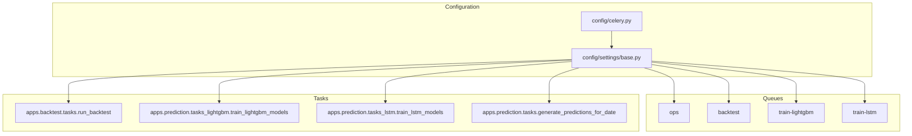
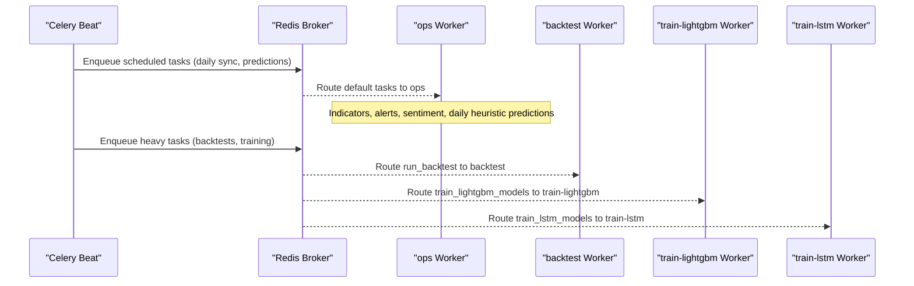
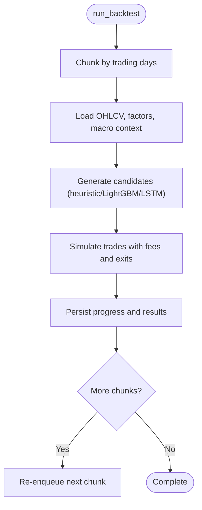
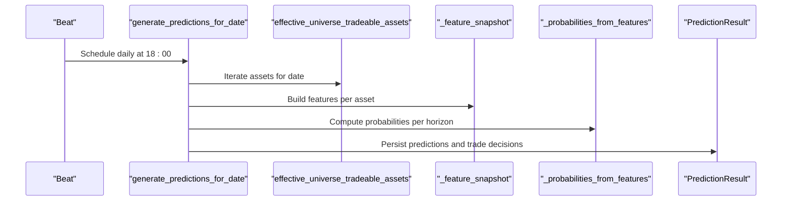
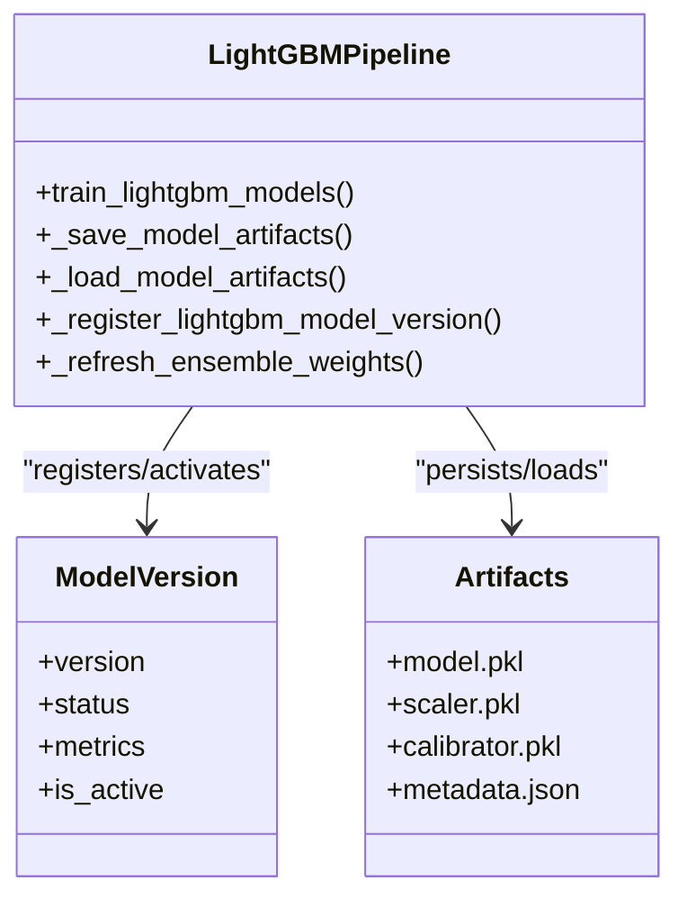
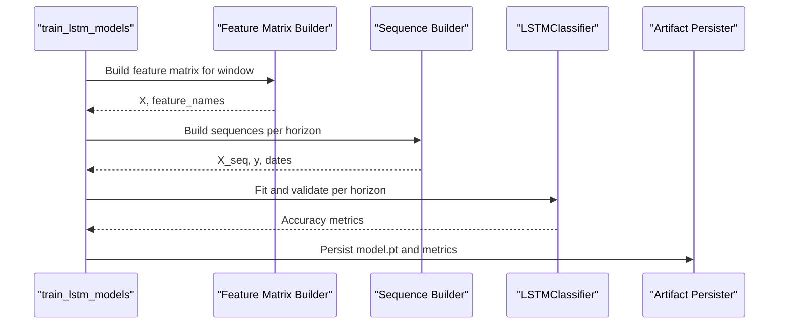
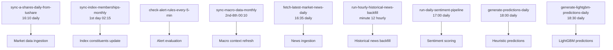
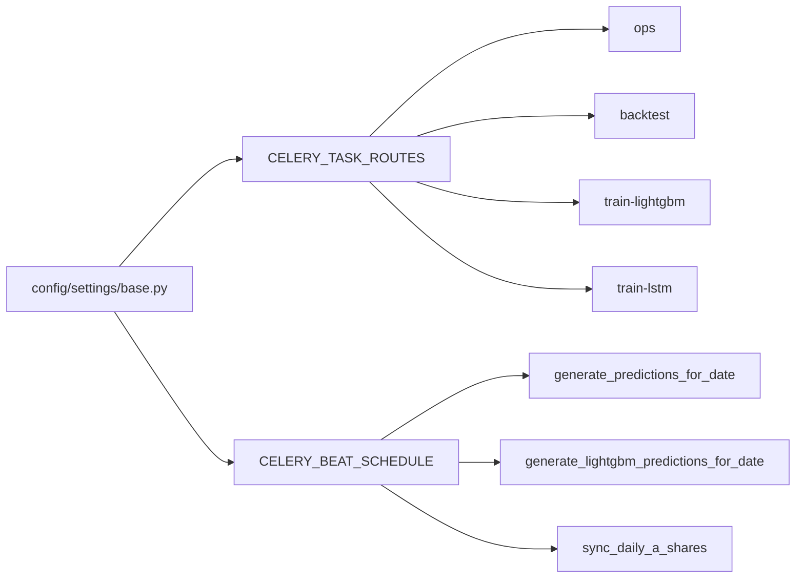

# Background Tasks & Scheduling

<cite>
**Referenced Files in This Document**
- [celery.py](file://config/celery.py)
- [base.py](file://config/settings/base.py)
- [tasks.py](file://apps/backtest/tasks.py)
- [tasks.py](file://apps/prediction/tasks.py)
- [tasks_lightgbm.py](file://apps/prediction/tasks_lightgbm.py)
- [tasks_lstm.py](file://apps/prediction/tasks_lstm.py)
- [rebuild_lightgbm_pipeline.py](file://apps/prediction/management/commands/rebuild_lightgbm_pipeline.py)
- [sync_benchmark_index_history.py](file://apps/markets/management/commands/sync_benchmark_index_history.py)
- [celery.md](file://docs/reference/celery.md)
</cite>

## Table of Contents
1. [Introduction](#introduction)
2. [Project Structure](#project-structure)
3. [Core Components](#core-components)
4. [Architecture Overview](#architecture-overview)
5. [Detailed Component Analysis](#detailed-component-analysis)
6. [Dependency Analysis](#dependency-analysis)
7. [Performance Considerations](#performance-considerations)
8. [Troubleshooting Guide](#troubleshooting-guide)
9. [Conclusion](#conclusion)
10. [Appendices](#appendices)

## Introduction
This document explains the background task processing system built on Celery and Django Celery Beat. It covers:
- Four specialized queues: ops, backtest, train-lightgbm, train-lstm
- Task routing, time limits, and default behaviors
- Scheduled jobs for daily data synchronization, model retraining pipelines, and maintenance tasks
- Management commands for data backfill, model retraining, validation, and system maintenance
- Guidance for creating new tasks, debugging failures, scaling workers, monitoring health, prioritization, resource allocation, and performance optimization for long-running financial computations

## Project Structure
The background task system is configured centrally and consumed by feature apps:
- Celery app initialization and auto-discovery live in config/celery.py
- Queue topology, routes, time limits, and Beat schedule are defined in config/settings/base.py
- Feature-specific tasks live under apps/*/tasks.py (e.g., prediction, backtest, analytics, markets, macro, sentiment)
- Management commands orchestrate backfills and retraining workflows

**Diagram sources**
- [celery.py:1-17](file://config/celery.py#L1-L17)
- [base.py:174-255](file://config/settings/base.py#L174-L255)

**Section sources**
- [celery.py:1-17](file://config/celery.py#L1-L17)
- [base.py:174-255](file://config/settings/base.py#L174-L255)

## Core Components
- Celery app: initialized with Django settings namespace and auto-discovery of task modules
- Queues: ops (default), backtest, train-lightgbm, train-lstm
- Routing: explicit mapping for heavy tasks to dedicated queues
- Time limits: global soft and hard limits; tasks can override per-task
- Beat scheduler: database-backed scheduler running periodic syncs, predictions, and maintenance tasks

Key configuration highlights:
- Default queue and routing key set to ops
- Explicit routes for backtest and training tasks
- Global time limits: soft 60s, hard 300s
- Beat entries for daily market data sync, index membership updates, alert checks, macro data sync, news ingestion, sentiment pipeline, and daily predictions

**Section sources**
- [base.py:174-255](file://config/settings/base.py#L174-L255)
- [celery.md:13-48](file://docs/reference/celery.md#L13-L48)

## Architecture Overview
The system separates workloads across queues to isolate CPU-heavy or long-running tasks from operational ones. Beat schedules recurring jobs that feed data into the system and trigger downstream tasks.

**Diagram sources**
- [base.py:182-200](file://config/settings/base.py#L182-L200)
- [base.py:218-255](file://config/settings/base.py#L218-L255)

## Detailed Component Analysis

### Queue Topology and Routing
- Default queue: ops
- Dedicated queues:
  - backtest: long-running strategy validation
  - train-lightgbm: LightGBM model training
  - train-lstm: LSTM model training
- Routing rules map specific tasks to their queues via CELERY_TASK_ROUTES

Operational guidance:
- Start separate worker processes per queue to isolate resources and scale independently
- Use routing keys to match queue names when launching workers

**Section sources**
- [base.py:182-200](file://config/settings/base.py#L182-L200)
- [celery.md:13-31](file://docs/reference/celery.md#L13-L31)

### Backtest Execution Engine
- The backtest engine converts parameter sets into equity curves, trade ledgers, and reports
- Long runs are chunked and resumable by persisting runtime state and re-queuing continuation
- Process-level caches bound trading dates, price maps, and matrix signals to reduce repeated computation
- Fee models support structured CN A-share defaults and legacy flat fee modes
- Prediction inputs can come from heuristic, LightGBM, or LSTM sources during backtesting

**Diagram sources**
- [tasks.py:1-37](file://apps/backtest/tasks.py#L1-L37)
- [tasks.py:106-159](file://apps/backtest/tasks.py#L106-L159)
- [tasks.py:338-446](file://apps/backtest/tasks.py#L338-L446)

**Section sources**
- [tasks.py:1-37](file://apps/backtest/tasks.py#L1-L37)
- [tasks.py:106-159](file://apps/backtest/tasks.py#L106-L159)
- [tasks.py:338-446](file://apps/backtest/tasks.py#L338-L446)

### Heuristic Predictions Pipeline
- Daily generation computes up/flat/down probabilities using factor scores, sentiment, momentum, and technical indicators
- Macro context influences probability adjustments
- Results are persisted with confidence and trade decision fields

**Diagram sources**
- [base.py:247-250](file://config/settings/base.py#L247-L250)
- [tasks.py:177-243](file://apps/prediction/tasks.py#L177-L243)

**Section sources**
- [tasks.py:177-243](file://apps/prediction/tasks.py#L177-L243)

### LightGBM Training and Inference
- Training builds sequences, fits scalers, trains models per horizon, and persists artifacts with metadata
- Model versions are registered and activated; ensemble weights are refreshed based on accuracy metrics
- Inference supports GPU acceleration where available and caches artifacts for performance

**Diagram sources**
- [tasks_lightgbm.py:95-156](file://apps/prediction/tasks_lightgbm.py#L95-L156)
- [tasks_lightgbm.py:586-629](file://apps/prediction/tasks_lightgbm.py#L586-L629)
- [tasks_lightgbm.py:631-729](file://apps/prediction/tasks_lightgbm.py#L631-L729)

**Section sources**
- [tasks_lightgbm.py:95-156](file://apps/prediction/tasks_lightgbm.py#L95-L156)
- [tasks_lightgbm.py:586-629](file://apps/prediction/tasks_lightgbm.py#L586-L629)
- [tasks_lightgbm.py:631-729](file://apps/prediction/tasks_lightgbm.py#L631-L729)

### LSTM Training and Inference
- Training constructs sequences from feature matrices, trains an LSTM classifier per horizon, and saves model artifacts with scaler parameters
- Inference loads the active model version, builds sequences, normalizes inputs, and predicts class probabilities
- Missingness handling includes indicator features for LSTM-specific strategies

**Diagram sources**
- [tasks_lstm.py:44-62](file://apps/prediction/tasks_lstm.py#L44-L62)
- [tasks_lstm.py:473-589](file://apps/prediction/tasks_lstm.py#L473-L589)
- [tasks_lstm.py:592-800](file://apps/prediction/tasks_lstm.py#L592-L800)

**Section sources**
- [tasks_lstm.py:44-62](file://apps/prediction/tasks_lstm.py#L44-L62)
- [tasks_lstm.py:473-589](file://apps/prediction/tasks_lstm.py#L473-L589)
- [tasks_lstm.py:592-800](file://apps/prediction/tasks_lstm.py#L592-L800)

### Scheduled Jobs (Celery Beat)
- Daily A-shares sync, monthly index memberships, alert rule checks, macro data sync, news fetching, sentiment pipeline, and daily predictions
- All entries use crontab expressions and are stored in the database via Django Celery Beat

**Diagram sources**
- [base.py:218-255](file://config/settings/base.py#L218-L255)
- [celery.md:34-48](file://docs/reference/celery.md#L34-L48)

**Section sources**
- [base.py:218-255](file://config/settings/base.py#L218-L255)
- [celery.md:34-48](file://docs/reference/celery.md#L34-L48)

### Management Commands
- Rebuild LightGBM pipeline: orchestrates model data backfill and retraining across horizons with optional snapshot pruning and version tagging
- Sync benchmark index history: triggers official benchmark index history synchronization with configurable index codes and date ranges

Usage patterns:
- Provide start/end dates and horizons for targeted retraining
- Skip backfill steps when data is already current
- Validate PIT membership coverage before retraining windows

**Section sources**
- [rebuild_lightgbm_pipeline.py:15-145](file://apps/prediction/management/commands/rebuild_lightgbm_pipeline.py#L15-L145)
- [sync_benchmark_index_history.py:1-44](file://apps/markets/management/commands/sync_benchmark_index_history.py#L1-L44)

## Dependency Analysis
- Configuration drives routing and scheduling:
  - CELERY_TASK_DEFAULT_QUEUE and CELERY_TASK_QUEUES define available queues
  - CELERY_TASK_ROUTES map specific tasks to queues
  - CELERY_BEAT_SCHEDULE defines periodic tasks
- Tasks depend on feature modules:
  - Backtest depends on prediction utilities and market data
  - Training tasks depend on feature engineering and artifact persistence
  - Scheduled tasks depend on data providers and market models

**Diagram sources**
- [base.py:182-200](file://config/settings/base.py#L182-L200)
- [base.py:218-255](file://config/settings/base.py#L218-L255)

**Section sources**
- [base.py:182-200](file://config/settings/base.py#L182-L200)
- [base.py:218-255](file://config/settings/base.py#L218-L255)

## Performance Considerations
- Time limits:
  - Global soft limit: 60 seconds
  - Global hard limit: 300 seconds
  - Tasks may override these values if needed
- Caching:
  - Backtest process-level caches bound trading dates, price maps, and matrix signals
  - LightGBM artifact cache reduces repeated model loading
  - LSTM inference caches sequence frames and asset IDs per target date
- Batch processing:
  - Backtest chunks trading days to enable resumption and memory control
  - LSTM training batches sequences and uses DataLoader for efficient iteration
- Resource isolation:
  - Separate workers per queue prevent contention between ops, backtests, and training
- GPU acceleration:
  - LightGBM inference probes for GPU device and uses it when available
  - LSTM training selects CUDA if available

Recommendations:
- Scale workers per queue based on workload characteristics
- Tune chunk sizes and batch sizes for long-running tasks
- Monitor artifact cache hit rates and adjust max entries
- Use snapshot pruning for LightGBM to reduce feature dimensionality when appropriate

**Section sources**
- [base.py:201-203](file://config/settings/base.py#L201-L203)
- [tasks.py:106-159](file://apps/backtest/tasks.py#L106-L159)
- [tasks_lightgbm.py:69-76](file://apps/prediction/tasks_lightgbm.py#L69-L76)
- [tasks_lightgbm.py:202-278](file://apps/prediction/tasks_lightgbm.py#L202-L278)
- [tasks_lstm.py:171-231](file://apps/prediction/tasks_lstm.py#L171-L231)
- [tasks_lstm.py:711-741](file://apps/prediction/tasks_lstm.py#L711-L741)

## Troubleshooting Guide
Common issues and resolutions:
- Task timeouts:
  - Check global time limits and per-task overrides
  - Inspect logs for soft/hard limit violations
- Queue backlog:
  - Verify workers are running for each queue
  - Scale workers horizontally for high-volume queues
- Failed scheduled tasks:
  - Review Beat schedule entries and crontab expressions
  - Ensure broker connectivity and database scheduler availability
- Model artifacts missing:
  - Confirm artifact paths exist and are readable
  - Validate model version registration and activation status
- Data staleness:
  - Run daily sync tasks and verify latest dates
  - Use management commands to backfill historical data

Debugging steps:
- Inspect task registry and routes to confirm correct routing
- Check Beat entries and last run times
- Validate environment variables for broker URLs and Redis connections
- Use management commands to trigger targeted backfills or retraining

**Section sources**
- [base.py:174-203](file://config/settings/base.py#L174-L203)
- [celery.md:25-48](file://docs/reference/celery.md#L25-L48)

## Conclusion
The background task system uses Celery with four dedicated queues to isolate operational, backtesting, and training workloads. Celery Beat schedules daily synchronization, predictions, and maintenance tasks. Management commands provide robust workflows for backfilling data and retraining models. Proper scaling, caching, and resource isolation ensure reliable operation for long-running financial computations.

## Appendices

### Creating a New Task
Steps:
- Define a shared_task in an app module
- Add routing if the task should run on a non-default queue
- Optionally set per-task time limits
- Register any necessary Beat schedule if periodic
- Test locally with a worker for the target queue

Guidance:
- Keep tasks idempotent and chunked for long-running work
- Use process-level caches judiciously to avoid memory growth
- Persist intermediate state for resumability

### Monitoring Task Health
- Monitor queue lengths and worker utilization per queue
- Track task success/failure rates and durations
- Inspect Beat schedule execution history and errors
- Alert on broker disconnections or database scheduler issues

### Prioritization and Resource Allocation
- Use separate queues to prioritize critical operations
- Allocate more workers to high-throughput queues
- Limit concurrent tasks per worker to prevent resource exhaustion
- Use chunking and batching to balance throughput and latency

[No sources needed since this section provides general guidance]