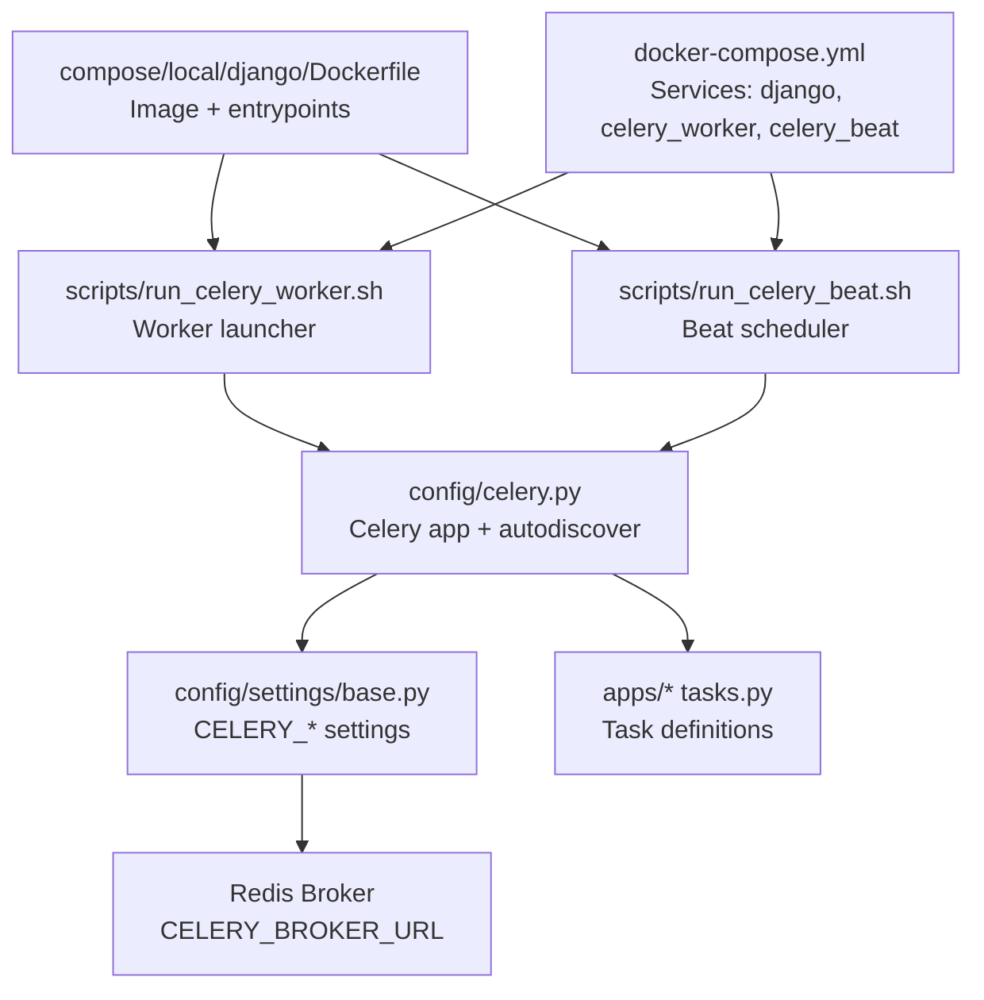
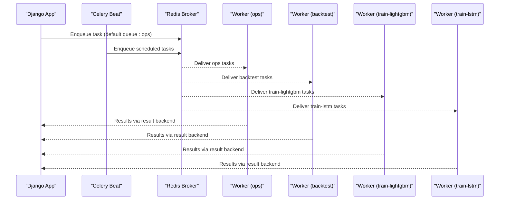
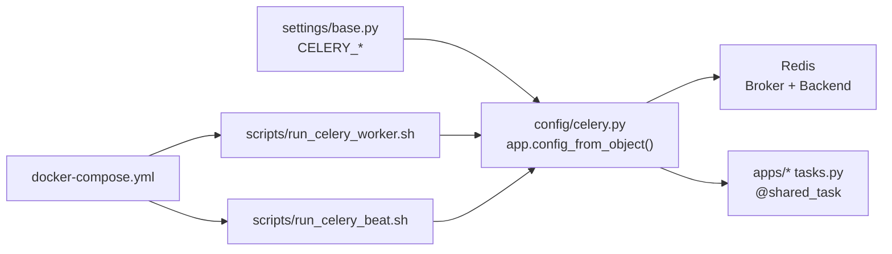

# Celery Architecture & Configuration

<cite>
**Referenced Files in This Document**
- [celery.py](file://config/celery.py)
- [base.py](file://config/settings/base.py)
- [production.py](file://config/settings/production.py)
- [tasks.py](file://apps/backtest/tasks.py)
- [tasks_lightgbm.py](file://apps/prediction/tasks_lightgbm.py)
- [tasks_lstm.py](file://apps/prediction/tasks_lstm.py)
- [tasks.py](file://apps/factors/tasks.py)
- [start-celeryworker](file://compose/local/django/start-celeryworker)
- [run_celery_worker.sh](file://scripts/run_celery_worker.sh)
- [run_celery_beat.sh](file://scripts/run_celery_beat.sh)
- [Dockerfile](file://compose/local/django/Dockerfile)
- [docker-compose.yml](file://docker-compose.yml)
</cite>

## Table of Contents
1. [Introduction](#introduction)
2. [Project Structure](#project-structure)
3. [Core Components](#core-components)
4. [Architecture Overview](#architecture-overview)
5. [Detailed Component Analysis](#detailed-component-analysis)
6. [Dependency Analysis](#dependency-analysis)
7. [Performance Considerations](#performance-considerations)
8. [Troubleshooting Guide](#troubleshooting-guide)
9. [Conclusion](#conclusion)

## Introduction
This document explains the Celery task processing architecture used by the project. It covers how the Celery application is initialized, how configuration flows from Django settings using the CELERY_ namespace, and how tasks are automatically discovered across all registered Django apps. It also documents the four specialized queues (ops, backtest, train-lightgbm, train-lstm), worker process management, Redis-based message broker configuration, container orchestration with Docker Compose, scaling strategies per queue, resource allocation guidance, monitoring recommendations, environment-specific settings, and troubleshooting connectivity issues.

## Project Structure
The Celery subsystem spans a small set of focused files:
- Application initialization and auto-discovery live under config/celery.py.
- All Celery configuration is centralized in config/settings/base.py under the CELERY_ namespace.
- Task modules are distributed across apps (for example, backtesting, prediction training, and operational syncs).
- Worker and beat entrypoints are provided as shell scripts and Dockerized via compose/local/django.
- Container orchestration is defined in docker-compose.yml.

**Diagram sources**
- [celery.py:1-17](file://config/celery.py#L1-L17)
- [base.py:174-203](file://config/settings/base.py#L174-L203)
- [run_celery_worker.sh:1-28](file://scripts/run_celery_worker.sh#L1-L28)
- [run_celery_beat.sh:1-12](file://scripts/run_celery_beat.sh#L1-L12)
- [Dockerfile:1-53](file://compose/local/django/Dockerfile#L1-L53)
- [docker-compose.yml:1-39](file://docker-compose.yml#L1-L39)

**Section sources**
- [celery.py:1-17](file://config/celery.py#L1-L17)
- [base.py:174-203](file://config/settings/base.py#L174-L203)
- [docker-compose.yml:1-39](file://docker-compose.yml#L1-L39)

## Core Components
- Celery app initialization: The Celery app is created and configured to read settings from Django’s settings module using the CELERY_ namespace. It then auto-discovers tasks from all installed Django apps.
- Queues and routing: Four queues are declared (ops, backtest, train-lightgbm, train-lstm). Default queue and routing key are set to ops. Specific tasks are routed to dedicated queues via CELERY_TASK_ROUTES.
- Time limits and scheduling: Global soft/hard time limits are defined. Beat schedules are configured for periodic tasks using django-celery-beat with a database-backed scheduler.
- Broker and results backend: Redis is used as both broker and result backend. Connection retry on startup is enabled.

Key behaviors:
- Automatic task discovery ensures any task decorated with shared_task in installed apps is registered without explicit imports.
- Routing rules ensure long-running or CPU-intensive tasks run on isolated workers consuming specific queues.

**Section sources**
- [celery.py:1-17](file://config/celery.py#L1-L17)
- [base.py:174-203](file://config/settings/base.py#L174-L203)

## Architecture Overview
The system uses a producer-consumer model:
- Producers (Django views, management commands, scheduled tasks) enqueue jobs onto queues.
- Consumers (Celery workers) consume messages from queues and execute tasks.
- Scheduler (Celery Beat) triggers periodic tasks based on cron-like schedules stored in the database.
- Redis acts as the message broker and result backend.

**Diagram sources**
- [base.py:174-203](file://config/settings/base.py#L174-L203)
- [run_celery_worker.sh:1-28](file://scripts/run_celery_worker.sh#L1-L28)
- [run_celery_beat.sh:1-12](file://scripts/run_celery_beat.sh#L1-L12)

## Detailed Component Analysis

### Celery App Initialization and Auto-Discovery
- The Celery app is instantiated with an application name and configured to load settings from Django using the CELERY_ namespace.
- After loading settings, it calls autodiscover_tasks to register tasks from all installed apps.

Operational implications:
- Any new app adding tasks will be picked up automatically once added to INSTALLED_APPS.
- Ensure each app’s tasks module is importable at startup to avoid missing registrations.

**Section sources**
- [celery.py:1-17](file://config/celery.py#L1-L17)

### Configuration via Django Settings (CELERY_ Namespace)
All Celery-related configuration is centralized under the CELERY_ prefix in base settings:
- Broker URL and result backend point to Redis.
- Accept content and serializers are set to JSON.
- Default queue and routing key are set to ops.
- Four queues are explicitly declared.
- Task routing maps specific tasks to their dedicated queues.
- Global time limits are set; some tasks override these values.
- Beat scheduler is configured to use the database-backed scheduler.

Environment variables:
- Broker URL can be overridden via CELERY_BROKER_URL.
- Other environment-driven settings exist for data floors, provider behavior, and feature toggles that indirectly affect task execution.

**Section sources**
- [base.py:174-203](file://config/settings/base.py#L174-L203)

### Queue Topology and Routing
Queues:
- ops: default queue for operational tasks such as daily syncs, indicator updates, sentiment pipelines, and daily predictions.
- backtest: dedicated queue for long-running backtests.
- train-lightgbm: dedicated queue for LightGBM model training.
- train-lstm: dedicated queue for LSTM model training.

Routing:
- Backtest task is routed to the backtest queue.
- LightGBM training task is routed to train-lightgbm.
- LSTM training task is routed to train-lstm.
- All other tasks default to ops unless otherwise specified.

Implications:
- Workers must be started with the correct -Q flags to consume specific queues.
- Misrouted tasks will not execute if no worker is listening on the target queue.

**Section sources**
- [base.py:174-203](file://config/settings/base.py#L174-L203)

### Task Modules and Responsibilities
- Backtesting tasks: Implement chunked, resumable backtests with process-level caches and robust fee modeling. They integrate with prediction artifacts and may call into LightGBM/LSTM inference paths during simulation.
- LightGBM training tasks: Manage artifact persistence, feature engineering, optional GPU acceleration probing, and ensemble weight refresh.
- LSTM training tasks: Build sequences, train PyTorch models, persist artifacts, and manage versioning and metrics.
- Operational tasks: Include factor score calculations and capital flow synchronization, among others.

These tasks are discovered automatically when their modules are imported by installed apps.

**Section sources**
- [tasks.py:1-800](file://apps/backtest/tasks.py#L1-L800)
- [tasks_lightgbm.py:1-800](file://apps/prediction/tasks_lightgbm.py#L1-L800)
- [tasks_lstm.py:1-800](file://apps/prediction/tasks_lstm.py#L1-L800)
- [tasks.py:1-461](file://apps/factors/tasks.py#L1-L461)

### Worker Process Management
Workers are launched via:
- scripts/run_celery_worker.sh: Reads environment variables to configure log level, queues, concurrency, hostname, and pool behavior. Defaults to ops queue and supports comma-separated queue lists.
- compose/local/django/start-celeryworker: Minimal entrypoint invoking Celery worker against the configured app.

Containerization:
- The Dockerfile installs dependencies and copies entrypoint scripts for worker and beat.
- docker-compose.yml defines services for Django, Celery worker, and Celery Beat, each mounting the project directory and loading environment variables.

Scaling guidance:
- Start one worker per queue type to isolate workloads.
- Use multiple workers per queue by launching additional processes with different hostnames and concurrency levels.
- On Windows, prefer multiple solo workers due to pool limitations.

**Section sources**
- [run_celery_worker.sh:1-28](file://scripts/run_celery_worker.sh#L1-L28)
- [start-celeryworker:1-7](file://compose/local/django/start-celeryworker#L1-L7)
- [Dockerfile:1-53](file://compose/local/django/Dockerfile#L1-L53)
- [docker-compose.yml:1-39](file://docker-compose.yml#L1-L39)

### Message Broker Configuration (Redis)
- Broker URL defaults to a local Redis instance on port 6379, database 0.
- Result backend shares the same Redis URL.
- Connection retry on startup is enabled to tolerate temporary unavailability.
- Content serialization is JSON for interoperability and safety.

Production considerations:
- Override CELERY_BROKER_URL to point to a managed Redis service.
- Secure Redis with authentication and network policies.
- Monitor Redis memory usage and latency; consider separate databases or instances for broker vs cache.

**Section sources**
- [base.py:174-183](file://config/settings/base.py#L174-L183)

### Container Orchestration Setup
- Services:
  - django: Runs the web application.
  - celery_worker: Runs Celery workers using the shared image and entrypoint.
  - celery_beat: Runs the scheduler with database-backed scheduling.
- Environment:
  - Each service loads .env via env_file for consistent configuration.
- Volumes:
  - Project directory is mounted for development convenience.

Best practices:
- Separate worker containers per queue in production for isolation and independent scaling.
- Use health checks and restart policies for resilience.
- Pin versions and use multi-stage builds for smaller images.

**Section sources**
- [docker-compose.yml:1-39](file://docker-compose.yml#L1-L39)
- [Dockerfile:1-53](file://compose/local/django/Dockerfile#L1-L53)

### Scaling Workers Per Queue and Resource Allocation
Recommended baseline:
- ops: 1–2 workers with moderate concurrency; handles frequent, shorter tasks.
- backtest: 1+ workers with higher concurrency; CPU-bound and long-running.
- train-lightgbm: 1+ workers; allocate more CPU/memory; consider GPU-capable nodes if supported.
- train-lstm: 1+ workers; allocate GPU resources where available; tune batch sizes and sequence lengths.

Concurrency tuning:
- Use CELERY_WORKER_CONCURRENCY to control parallelism per worker.
- On Linux, prefork pool is typical; on Windows, solo pool serializes tasks within a worker—prefer multiple workers instead of high concurrency.
- Cap native threading libraries (OpenBLAS, MKL, NumExpr) to avoid oversubscription.

Queue isolation:
- Run separate worker processes per queue to prevent contention between short ops tasks and long backtests/training jobs.

Monitoring:
- Track queue lengths, task durations, and failure rates.
- Set appropriate soft/hard time limits; adjust per-task overrides as needed.

[No sources needed since this section provides general guidance]

### Monitoring Worker Health
- Use Celery Flower or similar tools to monitor queues, workers, and task status.
- Log levels can be tuned via CELERY_LOG_LEVEL.
- Persist logs externally for analysis.
- Integrate metrics collection (e.g., Prometheus) to track broker connections, task throughput, and error rates.

[No sources needed since this section provides general guidance]

### Common Configuration Patterns and Environment-Specific Settings
- Centralize all Celery settings under CELERY_ in base settings; override per environment via environment variables or environment-specific settings modules.
- Production settings module exists and inherits from base; add production-only overrides there.
- Use environment variables for sensitive or environment-dependent values (broker URLs, timeouts, feature toggles).

**Section sources**
- [production.py:1-4](file://config/settings/production.py#L1-L4)
- [base.py:174-203](file://config/settings/base.py#L174-L203)

### Troubleshooting Celery Connectivity Issues
Symptoms:
- Tasks never start or workers fail to connect.
- Results are not returned.

Checks:
- Verify CELERY_BROKER_URL points to a reachable Redis instance.
- Confirm Redis is running and accessible from worker containers.
- Ensure firewall/network policies allow traffic to Redis.
- Check connection retry behavior and logs for transient failures.
- Validate that workers are started with the correct -Q queues matching task routing.

Resolution steps:
- Restart workers after updating broker configuration.
- Test connectivity to Redis from the worker environment.
- Inspect logs for authentication errors or timeout exceptions.
- If using managed Redis, verify credentials and endpoint correctness.

**Section sources**
- [base.py:174-183](file://config/settings/base.py#L174-L183)
- [run_celery_worker.sh:1-28](file://scripts/run_celery_worker.sh#L1-L28)

## Dependency Analysis
The Celery subsystem depends on:
- Django settings for configuration.
- Redis for messaging and results.
- Installed Django apps for task discovery.
- Shell scripts and Docker infrastructure for deployment.

**Diagram sources**
- [base.py:174-203](file://config/settings/base.py#L174-L203)
- [celery.py:1-17](file://config/celery.py#L1-L17)
- [run_celery_worker.sh:1-28](file://scripts/run_celery_worker.sh#L1-L28)
- [run_celery_beat.sh:1-12](file://scripts/run_celery_beat.sh#L1-L12)
- [docker-compose.yml:1-39](file://docker-compose.yml#L1-L39)

**Section sources**
- [base.py:174-203](file://config/settings/base.py#L174-L203)
- [celery.py:1-17](file://config/celery.py#L1-L17)

## Performance Considerations
- Queue isolation prevents ops tasks from being delayed by long-running backtests or training jobs.
- Tune concurrency per queue based on workload characteristics:
  - ops: moderate concurrency.
  - backtest: higher concurrency; consider CPU affinity and thread limits.
  - train-lightgbm/train-lstm: allocate sufficient CPU/GPU and memory; tune batch sizes and sequence lengths.
- Use process-level caches judiciously; clear between unrelated batches to bound memory.
- Monitor Redis memory and latency; consider separate instances for broker vs cache.
- Adjust time limits per task where necessary; global defaults provide a baseline.

[No sources needed since this section provides general guidance]

## Troubleshooting Guide
Common issues and resolutions:
- No tasks executing:
  - Ensure workers are started with the correct queues (-Q).
  - Verify task routing matches queue names.
  - Check that tasks are discoverable (installed apps include the relevant modules).
- Tasks timing out:
  - Review global and per-task time limits.
  - Increase limits for long-running tasks like backtests.
- Broker connectivity errors:
  - Validate Redis URL and network access.
  - Check authentication and security groups.
- High memory usage:
  - Reduce concurrency or increase worker count.
  - Clear process-level caches between batches.
- Inconsistent results:
  - Ensure deterministic inputs and pinned model versions.
  - Validate feature extraction and model artifact paths.

**Section sources**
- [run_celery_worker.sh:1-28](file://scripts/run_celery_worker.sh#L1-L28)
- [base.py:174-203](file://config/settings/base.py#L174-L203)

## Conclusion
The project’s Celery architecture cleanly separates concerns through dedicated queues and routing, enabling scalable and resilient task processing. Configuration is centralized and environment-driven, while automatic task discovery simplifies maintenance. By starting appropriate workers per queue, tuning concurrency and resources, and monitoring health, teams can reliably operate backtests, model training, and operational pipelines. Redis provides a robust broker and result backend, and Docker Compose streamlines local and containerized deployments.