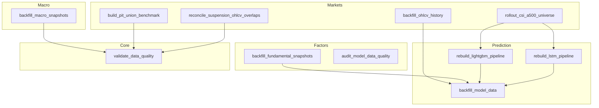
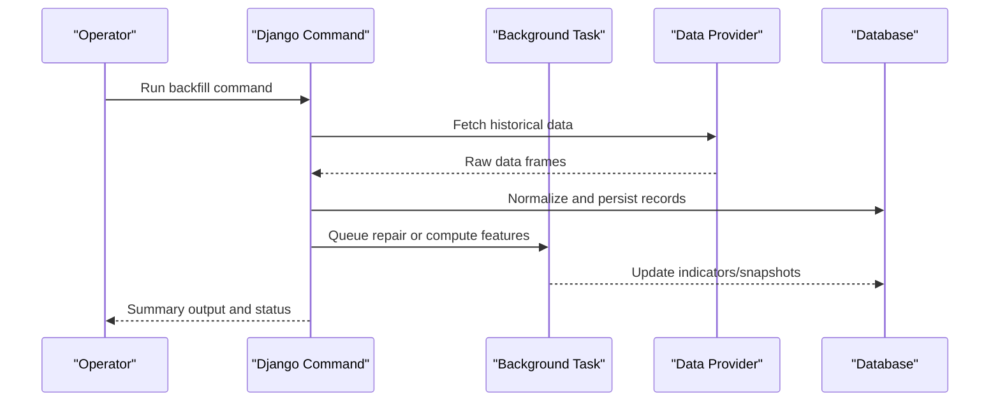
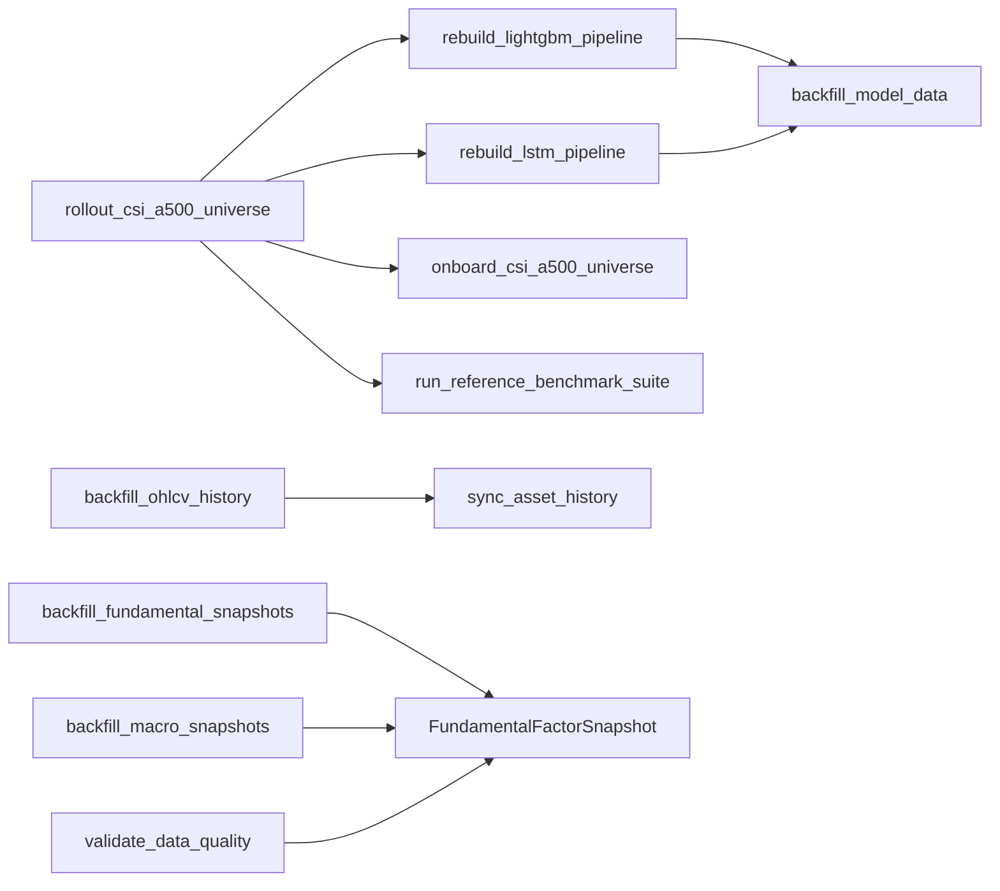

# Management Commands & Operational Tools

<cite>
**Referenced Files in This Document**
- [backfill_ohlcv_history.py](file://apps/markets/management/commands/backfill_ohlcv_history.py)
- [backfill_fundamental_snapshots.py](file://apps/factors/management/commands/backfill_fundamental_snapshots.py)
- [backfill_macro_snapshots.py](file://apps/macro/management/commands/backfill_macro_snapshots.py)
- [rebuild_lightgbm_pipeline.py](file://apps/prediction/management/commands/rebuild_lightgbm_pipeline.py)
- [rebuild_lstm_pipeline.py](file://apps/prediction/management/commands/rebuild_lstm_pipeline.py)
- [validate_data_quality.py](file://apps/core/management/commands/validate_data_quality.py)
- [audit_model_data_quality.py](file://apps/factors/management/commands/audit_model_data_quality.py)
- [build_pit_union_benchmark.py](file://apps/markets/management/commands/build_pit_union_benchmark.py)
- [rollout_csi_a500_universe.py](file://apps/markets/management/commands/rollout_csi_a500_universe.py)
- [reconcile_suspension_ohlcv_overlaps.py](file://apps/markets/management/commands/reconcile_suspension_ohlcv_overlaps.py)
- [backfill_model_data.py](file://apps/prediction/management/commands/backfill_model_data.py)
</cite>

## Table of Contents
1. [Introduction](#introduction)
2. [Project Structure](#project-structure)
3. [Core Components](#core-components)
4. [Architecture Overview](#architecture-overview)
5. [Detailed Component Analysis](#detailed-component-analysis)
6. [Dependency Analysis](#dependency-analysis)
7. [Performance Considerations](#performance-considerations)
8. [Troubleshooting Guide](#troubleshooting-guide)
9. [Conclusion](#conclusion)
10. [Appendices](#appendices)

## Introduction
This document provides a comprehensive operational guide to the system’s management commands for data backfilling, model retraining, validation, and utility workflows. It focuses on:
- Data backfill commands for historical OHLCV, fundamental snapshots, and macro snapshots
- Model retraining commands for LightGBM and LSTM pipelines
- Validation and audit commands for data quality and model-data health checks
- Utility commands for benchmark building, CSI A500 universe rollout, and suspension/OHLCV reconciliation
- Command parameters, usage examples, expected outputs, error handling, production guidance, logging, and monitoring

## Project Structure
Management commands are organized by feature area under Django apps:
- Markets: OHLCV backfill, benchmark building, universe rollout, suspension reconciliation
- Factors: Fundamental snapshot backfill, model data quality audit
- Macro: Macro snapshot backfill
- Prediction: Model data backfill, LightGBM/LSTM pipeline rebuilds
- Core: Data quality validation

**Diagram sources**
- [backfill_ohlcv_history.py:25-46](file://apps/markets/management/commands/backfill_ohlcv_history.py#L25-L46)
- [backfill_fundamental_snapshots.py:40-53](file://apps/factors/management/commands/backfill_fundamental_snapshots.py#L40-L53)
- [backfill_macro_snapshots.py:121-129](file://apps/macro/management/commands/backfill_macro_snapshots.py#L121-L129)
- [backfill_model_data.py:41-52](file://apps/prediction/management/commands/backfill_model_data.py#L41-L52)
- [rebuild_lightgbm_pipeline.py:15-57](file://apps/prediction/management/commands/rebuild_lightgbm_pipeline.py#L15-L57)
- [rebuild_lstm_pipeline.py:15-70](file://apps/prediction/management/commands/rebuild_lstm_pipeline.py#L15-L70)
- [validate_data_quality.py:426-448](file://apps/core/management/commands/validate_data_quality.py#L426-L448)
- [build_pit_union_benchmark.py:9-16](file://apps/markets/management/commands/build_pit_union_benchmark.py#L9-L16)
- [rollout_csi_a500_universe.py:14-56](file://apps/markets/management/commands/rollout_csi_a500_universe.py#L14-L56)
- [reconcile_suspension_ohlcv_overlaps.py:62-71](file://apps/markets/management/commands/reconcile_suspension_ohlcv_overlaps.py#L62-L71)

**Section sources**
- [backfill_ohlcv_history.py:25-46](file://apps/markets/management/commands/backfill_ohlcv_history.py#L25-L46)
- [backfill_fundamental_snapshots.py:40-53](file://apps/factors/management/commands/backfill_fundamental_snapshots.py#L40-L53)
- [backfill_macro_snapshots.py:121-129](file://apps/macro/management/commands/backfill_macro_snapshots.py#L121-L129)
- [backfill_model_data.py:41-52](file://apps/prediction/management/commands/backfill_model_data.py#L41-L52)
- [rebuild_lightgbm_pipeline.py:15-57](file://apps/prediction/management/commands/rebuild_lightgbm_pipeline.py#L15-L57)
- [rebuild_lstm_pipeline.py:15-70](file://apps/prediction/management/commands/rebuild_lstm_pipeline.py#L15-L70)
- [validate_data_quality.py:426-448](file://apps/core/management/commands/validate_data_quality.py#L426-L448)
- [build_pit_union_benchmark.py:9-16](file://apps/markets/management/commands/build_pit_union_benchmark.py#L9-L16)
- [rollout_csi_a500_universe.py:14-56](file://apps/markets/management/commands/rollout_csi_a500_universe.py#L14-L56)
- [reconcile_suspension_ohlcv_overlaps.py:62-71](file://apps/markets/management/commands/reconcile_suspension_ohlcv_overlaps.py#L62-L71)

## Core Components
This section summarizes the key command families and their responsibilities:
- Data backfill: Populate historical OHLCV, fundamental snapshots, and macro snapshots from upstream providers (e.g., TuShare), with optional CSV-based repair windows and fallback sources.
- Model retraining: Rebuild LightGBM and LSTM prediction pipelines over specified training windows, optionally skipping backfills or applying snapshot pruning.
- Validation and audits: Validate data quality across tables and fields; audit default/null buckets for model inputs; produce actionable reports.
- Utilities: Build point-in-time union benchmarks; orchestrate safe CSI A500 universe rollout including onboarding, retrains, and post-expansion benchmarks; reconcile suspension/OHLCV overlaps using external notices.

**Section sources**
- [backfill_ohlcv_history.py:25-46](file://apps/markets/management/commands/backfill_ohlcv_history.py#L25-L46)
- [backfill_fundamental_snapshots.py:40-53](file://apps/factors/management/commands/backfill_fundamental_snapshots.py#L40-L53)
- [backfill_macro_snapshots.py:121-129](file://apps/macro/management/commands/backfill_macro_snapshots.py#L121-L129)
- [rebuild_lightgbm_pipeline.py:15-57](file://apps/prediction/management/commands/rebuild_lightgbm_pipeline.py#L15-L57)
- [rebuild_lstm_pipeline.py:15-70](file://apps/prediction/management/commands/rebuild_lstm_pipeline.py#L15-L70)
- [validate_data_quality.py:426-448](file://apps/core/management/commands/validate_data_quality.py#L426-L448)
- [audit_model_data_quality.py:22-30](file://apps/factors/management/commands/audit_model_data_quality.py#L22-L30)
- [build_pit_union_benchmark.py:9-16](file://apps/markets/management/commands/build_pit_union_benchmark.py#L9-L16)
- [rollout_csi_a500_universe.py:14-56](file://apps/markets/management/commands/rollout_csi_a500_universe.py#L14-L56)
- [reconcile_suspension_ohlcv_overlaps.py:62-71](file://apps/markets/management/commands/reconcile_suspension_ohlcv_overlaps.py#L62-L71)

## Architecture Overview
The command layer orchestrates data ingestion, feature computation, model training, and validation through shared services and tasks. Key flows include:
- OHLCV backfill dispatches asset repairs via tasks, supporting CSV-driven gap repair and technical indicator warm-up windows.
- Fundamental snapshot backfill fetches daily_basic and fina_indicator data, materializes rows, and upserts into storage.
- Macro snapshot backfill aggregates monthly indicators, yields, FX rates, and persists them with metadata and retry tracking; it can fall back to alternative sources.
- Model data backfill computes sentiment scores, RS_SCORE indicators, and factor scores with checkpointing and PIT membership coverage checks.
- Pipeline rebuild commands validate training windows, optionally run backfills, then train models and emit structured results.
- Validation command writes detailed CSV/JSON reports and can alert on critical issues.
- Universe rollout orchestrates onboarding, fixed-window retrains, and compact post-expansion benchmarks.
- Suspension reconciliation verifies OHLCV/full-day suspension overlaps against external notices and optionally deletes confirmed rows.

**Diagram sources**
- [backfill_ohlcv_history.py:165-191](file://apps/markets/management/commands/backfill_ohlcv_history.py#L165-L191)
- [backfill_fundamental_snapshots.py:128-171](file://apps/factors/management/commands/backfill_fundamental_snapshots.py#L128-L171)
- [backfill_macro_snapshots.py:487-603](file://apps/macro/management/commands/backfill_macro_snapshots.py#L487-L603)
- [backfill_model_data.py:53-107](file://apps/prediction/management/commands/backfill_model_data.py#L53-L107)
- [rebuild_lightgbm_pipeline.py:84-145](file://apps/prediction/management/commands/rebuild_lightgbm_pipeline.py#L84-L145)
- [rebuild_lstm_pipeline.py:97-173](file://apps/prediction/management/commands/rebuild_lstm_pipeline.py#L97-L173)

## Detailed Component Analysis

### Data Backfill Commands

#### backfill_ohlcv_history
Purpose:
- Backfill OHLCV history from a configured floor date using provider APIs, with support for CSV-based continuity gap repairs and technical indicator warm-up windows.

Key parameters:
- start-date, end-date: Date range for backfill
- csv-file: Path to continuity report CSV specifying gap windows per asset
- symbols: Filter by symbol/ts_code
- limit-assets: Limit number of assets processed
- queue: Dispatch repairs asynchronously via task
- technical-indicator-warmup: Extend repair window earlier to initialize technical indicators
- effective-universe-entry-warmup: Backfill warm-up windows ending on each asset’s first effective-universe date

Usage example:
- python manage.py backfill_ohlcv_history --start-date 2020-01-01 --end-date 2024-12-31 --symbols SH600519,SZ000001 --queue
- python manage.py backfill_ohlcv_history --csv-file ~/continuity_report.csv --limit-assets 50 --queue

Expected outputs:
- Progress lines per asset/gap window indicating queued or executed status
- Success summary with counts and ranges

Error handling:
- Invalid dates raise command errors
- Missing or malformed CSV columns raise errors
- Unsupported market suffixes raise errors
- Pre-floor restrictions enforced unless warm-up flags allow extension

Production guidance:
- Use --queue for large-scale backfills to avoid long-running processes
- Combine with technical-indicator-warmup when initializing indicators for new assets
- Monitor task queues for dispatched repairs

Logging and monitoring:
- Console progress lines include asset codes, gap windows, and result status
- Task execution logs should be monitored via Celery worker logs

**Section sources**
- [backfill_ohlcv_history.py:25-46](file://apps/markets/management/commands/backfill_ohlcv_history.py#L25-L46)
- [backfill_ohlcv_history.py:85-141](file://apps/markets/management/commands/backfill_ohlcv_history.py#L85-L141)
- [backfill_ohlcv_history.py:165-191](file://apps/markets/management/commands/backfill_ohlcv_history.py#L165-L191)
- [backfill_ohlcv_history.py:193-225](file://apps/markets/management/commands/backfill_ohlcv_history.py#L193-L225)
- [backfill_ohlcv_history.py:227-316](file://apps/markets/management/commands/backfill_ohlcv_history.py#L227-L316)
- [backfill_ohlcv_history.py:318-387](file://apps/markets/management/commands/backfill_ohlcv_history.py#L318-L387)

#### backfill_fundamental_snapshots
Purpose:
- Backfill FundamentalFactorSnapshot rows from TuShare daily_basic and fina_indicator onto trading dates, with optional repair for stale ROE announcements.

Key parameters:
- start-date, end-date: Inclusive date range
- symbols: Filter by symbol/ts_code
- limit-assets: Limit number of assets
- repair-same-announcement-roe: Reprocess assets with stale same-announcement ROE rows

Usage example:
- python manage.py backfill_fundamental_snapshots --start-date 2020-01-01 --end-date 2024-12-31 --symbols SH600519 --repair-same-announcement-roe

Expected outputs:
- Per-asset progress and upserted row counts
- Final summary with processed assets and inserted/updated rows

Error handling:
- Missing TUSHARE_TOKEN raises error
- Invalid date ranges raise errors
- Rate limiting handled with retries and sleeps

Production guidance:
- Configure request and retry sleep settings for rate limits
- Use repair flag when upstream announcements change but stored rows lag

Logging and monitoring:
- Console logs show per-asset processing and upsert counts
- Watch for rate-limit warnings and retry attempts

**Section sources**
- [backfill_fundamental_snapshots.py:40-53](file://apps/factors/management/commands/backfill_fundamental_snapshots.py#L40-L53)
- [backfill_fundamental_snapshots.py:54-126](file://apps/factors/management/commands/backfill_fundamental_snapshots.py#L54-L126)
- [backfill_fundamental_snapshots.py:128-171](file://apps/factors/management/commands/backfill_fundamental_snapshots.py#L128-L171)
- [backfill_fundamental_snapshots.py:173-211](file://apps/factors/management/commands/backfill_fundamental_snapshots.py#L173-L211)
- [backfill_fundamental_snapshots.py:213-265](file://apps/factors/management/commands/backfill_fundamental_snapshots.py#L213-L265)

#### backfill_macro_snapshots
Purpose:
- Backfill MacroSnapshot monthly data from TuShare plus historical ChinaBond yield CSV, with AkShare fallback for missing fields.

Key parameters:
- start-date, end-date: Inclusive date range
- disable-fallback: Prevent using AkShare fallback
- resume-yields: Resume yield backfill from last completed month per field

Usage example:
- python manage.py backfill_macro_snapshots --start-date 2020-01-01 --end-date 2024-12-31 --resume-yields

Expected outputs:
- Created/updated counts, CSV yield updates, yield updates, fallback usage, and range summary

Error handling:
- Missing TUSHARE_TOKEN raises error
- Missing CSV files raise errors
- Date range validation enforced

Production guidance:
- Use resume-yields to continue interrupted yield backfills
- Configure CSV paths via settings if needed
- Monitor fallback usage to ensure data completeness

Logging and monitoring:
- Console logs include created/updated counts and fallback details
- Metadata tracks source and retry information per field

**Section sources**
- [backfill_macro_snapshots.py:121-129](file://apps/macro/management/commands/backfill_macro_snapshots.py#L121-L129)
- [backfill_macro_snapshots.py:130-174](file://apps/macro/management/commands/backfill_macro_snapshots.py#L130-L174)
- [backfill_macro_snapshots.py:224-266](file://apps/macro/management/commands/backfill_macro_snapshots.py#L224-L266)
- [backfill_macro_snapshots.py:268-312](file://apps/macro/management/commands/backfill_macro_snapshots.py#L268-L312)
- [backfill_macro_snapshots.py:313-362](file://apps/macro/management/commands/backfill_macro_snapshots.py#L313-L362)
- [backfill_macro_snapshots.py:364-485](file://apps/macro/management/commands/backfill_macro_snapshots.py#L364-L485)
- [backfill_macro_snapshots.py:487-603](file://apps/macro/management/commands/backfill_macro_snapshots.py#L487-L603)

### Model Retraining Commands

#### rebuild_lightgbm_pipeline
Purpose:
- Backfill features and retrain 3/7/30-day LightGBM models end-to-end.

Key parameters:
- start-date, end-date: Training window
- horizons: Comma-separated subset of 3,7,30
- skip-backfill: Skip model data backfill and retrain directly
- skip-sentiment: Pass through to backfill_model_data to skip sentiment recomputation
- version-tag: Optional suffix to preserve existing artifact families
- use-snapshot-pruning: Prune features from latest active FeatureImportanceSnapshot before retraining

Usage example:
- python manage.py rebuild_lightgbm_pipeline --start-date 2020-01-01 --end-date 2024-12-31 --horizons 3,7,30 --version-tag v1

Expected outputs:
- JSON results per horizon with status
- Success message upon completion

Error handling:
- Invalid dates or horizons raise errors
- PIT membership coverage errors halt the process
- Failed horizons cause command failure

Production guidance:
- Use version-tag to maintain artifact lineage
- Enable snapshot pruning to optimize feature sets
- Ensure backfill is complete or pass skip-backfill only when confident

Logging and monitoring:
- Console logs indicate retrain window, horizons, and options
- JSON results provide structured status per horizon

**Section sources**
- [rebuild_lightgbm_pipeline.py:15-57](file://apps/prediction/management/commands/rebuild_lightgbm_pipeline.py#L15-L57)
- [rebuild_lightgbm_pipeline.py:59-83](file://apps/prediction/management/commands/rebuild_lightgbm_pipeline.py#L59-L83)
- [rebuild_lightgbm_pipeline.py:84-145](file://apps/prediction/management/commands/rebuild_lightgbm_pipeline.py#L84-L145)

#### rebuild_lstm_pipeline
Purpose:
- Backfill features and retrain 3/7/30-day LSTM models end-to-end.

Key parameters:
- start-date, end-date: Training window
- horizons: Comma-separated subset of 3,7,30
- sequence-length: LSTM lookback window length in trading rows
- asset-chunk-size: Number of assets processed per chunk to control memory
- max-samples-per-horizon: Upper bound of sequence samples per horizon
- skip-backfill: Skip model data backfill
- skip-sentiment: Pass through to backfill_model_data to skip sentiment recomputation
- version-tag: Optional suffix to preserve existing artifact families

Usage example:
- python manage.py rebuild_lstm_pipeline --start-date 2020-01-01 --end-date 2024-12-31 --horizons 7,30 --sequence-length 20 --max-samples-per-horizon 30000

Expected outputs:
- JSON results per horizon with status
- Success message upon completion

Error handling:
- Invalid dates or horizons raise errors
- Sequence length and chunk size constraints enforced
- PIT membership coverage errors halt the process
- Failed horizons cause command failure

Production guidance:
- Tune sequence_length, asset_chunk_size, and max_samples_per_horizon for memory constraints
- Use version-tag to track model artifacts
- Ensure backfill is complete or pass skip-backfill only when confident

Logging and monitoring:
- Console logs indicate retrain window, horizons, and options
- JSON results provide structured status per horizon

**Section sources**
- [rebuild_lstm_pipeline.py:15-70](file://apps/prediction/management/commands/rebuild_lstm_pipeline.py#L15-L70)
- [rebuild_lstm_pipeline.py:72-96](file://apps/prediction/management/commands/rebuild_lstm_pipeline.py#L72-L96)
- [rebuild_lstm_pipeline.py:97-173](file://apps/prediction/management/commands/rebuild_lstm_pipeline.py#L97-L173)

### Validation and Audit Commands

#### validate_data_quality
Purpose:
- Validate historical data quality and write actionable reports without mutating model data.

Key parameters:
- start-date, end-date: Validation window
- symbols: Comma-separated symbols or ts_codes; defaults to active assets
- include-delisted: Include delisted assets
- effective-universe-only: Restrict validation to PIT effective universe during window
- output-dir: Directory for reports
- technical-indicators: Indicator types to validate
- cross-section-audit-dates: Dates to audit cross-sectional participants
- macro-max-age-days: Max age for macro snapshots
- max-detail-rows: Limit detail rows written
- only-report: Select specific report filenames to write
- fundamental-reconciliation-sample-size: Sample size for second-layer reconciliation
- fundamental-reconciliation-seed: Seed for deterministic sampling
- technical-indicator-reconciliation-sample-size: Sample size for TechnicalIndicator replay
- technical-indicator-reconciliation-seed: Seed for deterministic sampling
- alert: Email summary on critical issues
- alert-recipients: Recipients list
- fail-on-critical: Raise error if critical issues found

Usage example:
- python manage.py validate_data_quality --start-date 2020-01-01 --end-date 2024-12-31 --output-dir ./reports/dq_run --alert

Expected outputs:
- CSV/JSON reports detailing gaps, anomalies, and coverage
- Console summary with critical issue count and detail rows written/dropped

Error handling:
- Invalid dates raise errors
- No trading calendar rows raise errors
- Only-report values validated against supported reports
- Critical issues can trigger alerts or command failure

Production guidance:
- Use effective-universe-only for focused validation on relevant assets
- Set max-detail-rows to control report size
- Enable alert for critical issues in production

Logging and monitoring:
- Console logs include critical issue counts and report path
- Reports provide granular diagnostics for remediation

**Section sources**
- [validate_data_quality.py:426-448](file://apps/core/management/commands/validate_data_quality.py#L426-L448)
- [validate_data_quality.py:449-722](file://apps/core/management/commands/validate_data_quality.py#L449-L722)

#### audit_model_data_quality
Purpose:
- Audit default/null model-data buckets for a historical date range without modifying data.

Key parameters:
- start-date, end-date: Required inclusive range
- symbol: Optional asset symbol or ts_code for diagnostic
- sample-size: Maximum rows to print for suspicious samples

Usage example:
- python manage.py audit_model_data_quality --start-date 2024-01-01 --end-date 2024-12-31 --symbol SH600519 --sample-size 5

Expected outputs:
- Console summaries for FactorScore, FundamentalFactorSnapshot, CapitalFlowSnapshot, and TechnicalIndicator RS_SCORE
- Optional symbol diagnostic with recent rows

Error handling:
- Invalid dates raise errors

Production guidance:
- Use symbol diagnostic to investigate specific assets
- Adjust sample-size to balance detail vs verbosity

Logging and monitoring:
- Console logs provide counts and samples for quick diagnosis

**Section sources**
- [audit_model_data_quality.py:22-30](file://apps/factors/management/commands/audit_model_data_quality.py#L22-L30)
- [audit_model_data_quality.py:31-48](file://apps/factors/management/commands/audit_model_data_quality.py#L31-L48)
- [audit_model_data_quality.py:55-119](file://apps/factors/management/commands/audit_model_data_quality.py#L55-L119)
- [audit_model_data_quality.py:120-162](file://apps/factors/management/commands/audit_model_data_quality.py#L120-L162)
- [audit_model_data_quality.py:163-240](file://apps/factors/management/commands/audit_model_data_quality.py#L163-L240)

### Utility Commands

#### build_pit_union_benchmark
Purpose:
- Build or refresh the internal point-in-time CSI300 + CSI A500 union benchmark.

Key parameters:
- start-date, end-date: Inclusive range
- initial-nav: Initial NAV used for the first benchmark row

Usage example:
- python manage.py build_pit_union_benchmark --start-date 2020-01-01 --end-date 2024-12-31 --initial-nav 100000

Expected outputs:
- Summary with benchmark code, rows written, and date range

Error handling:
- Invalid dates raise errors

Production guidance:
- Use to refresh benchmarks after universe changes or data corrections

Logging and monitoring:
- Console logs include benchmark code and rows written

**Section sources**
- [build_pit_union_benchmark.py:9-16](file://apps/markets/management/commands/build_pit_union_benchmark.py#L9-L16)
- [build_pit_union_benchmark.py:17-43](file://apps/markets/management/commands/build_pit_union_benchmark.py#L17-L43)

#### rollout_csi_a500_universe
Purpose:
- Run the safe CSI A500 rollout workflow: onboarding with pre/post benchmarks disabled, fixed-window LightGBM/LSTM retrains, and compact post-expansion benchmark suites.

Key parameters:
- start-date, end-date: Raw backfill window
- index-codes: Comma-separated index codes
- report-label, report-root-dir: Report organization
- skip-onboarding, skip-retrain, skip-post-benchmarks: Phase toggles
- skip-sentiment: Pass through to backfill_model_data
- horizons: Subset of 3,7,30
- retrain-start-date, retrain-end-date: Fixed-window retrain range
- lightgbm-version-tag, lightgbm-use-snapshot-pruning: LightGBM options
- lstm-sequence-length, lstm-asset-chunk-size, lstm-max-samples-per-horizon: LSTM options
- benchmark-sources, benchmark-top-n, benchmark-holding-period-days, benchmark-capital-fraction-per-entry, benchmark-min-up-probability, benchmark-name-prefix, benchmark-launch-mode: Post-benchmark suite configuration
- post-benchmark-train-start-date, post-benchmark-train-end-date, post-benchmark-test-start-date, post-benchmark-test-end-date: Benchmark windows

Usage example:
- python manage.py rollout_csi_a500_universe --start-date 2020-01-01 --end-date 2024-12-31 --horizons 3,7,30 --retrain-start-date 2016-06-01 --retrain-end-date 2024-12-31

Expected outputs:
- Manifest JSON summarizing phases, windows, and outputs
- Console logs for each phase and benchmark suite

Error handling:
- Invalid dates or horizons raise errors
- Window validations enforced per phase

Production guidance:
- Use skip flags to isolate phases for testing
- Configure benchmark launch mode to queue or inline based on workload
- Review manifest for auditability

Logging and monitoring:
- Console logs indicate phase execution and benchmark suite generation
- Manifest provides traceable configuration and outputs

**Section sources**
- [rollout_csi_a500_universe.py:14-56](file://apps/markets/management/commands/rollout_csi_a500_universe.py#L14-L56)
- [rollout_csi_a500_universe.py:58-112](file://apps/markets/management/commands/rollout_csi_a500_universe.py#L58-L112)
- [rollout_csi_a500_universe.py:113-138](file://apps/markets/management/commands/rollout_csi_a500_universe.py#L113-L138)
- [rollout_csi_a500_universe.py:139-258](file://apps/markets/management/commands/rollout_csi_a500_universe.py#L139-L258)

#### reconcile_suspension_ohlcv_overlaps
Purpose:
- Verify OHLCV/full-day suspension overlaps against AkShare Baidu suspension notices and optionally delete confirmed OHLCV rows.

Key parameters:
- csv-file: Input report file from validation containing overlap issues
- symbols: Filter by symbol/ts_code
- output-file: Output reconciliation results CSV
- baidu-cookie: Optional cookie for AkShare requests
- execute: Delete confirmed OHLCV rows (dry-run otherwise)

Usage example:
- python manage.py reconcile_suspension_ohlcv_overlaps --csv-file ./reports/data_quality_xxx/ohlcv_on_full_day_suspension.csv --execute

Expected outputs:
- CSV results with verification status, actions taken, and reasons
- Console summary with counts and output file path

Error handling:
- Missing csv-file raises error
- akshare not installed raises error
- Asset missing in database or mismatched overlap counts handled gracefully

Production guidance:
- Run in dry-run mode first to review actions
- Provide baidu-cookie if required by AkShare environment
- Use symbols filter to focus on specific assets

Logging and monitoring:
- Console logs include mismatch counts, fetch errors, verified dates, and deleted rows
- Output CSV provides detailed per-row decisions

**Section sources**
- [reconcile_suspension_ohlcv_overlaps.py:62-71](file://apps/markets/management/commands/reconcile_suspension_ohlcv_overlaps.py#L62-L71)
- [reconcile_suspension_ohlcv_overlaps.py:72-215](file://apps/markets/management/commands/reconcile_suspension_ohlcv_overlaps.py#L72-L215)
- [reconcile_suspension_ohlcv_overlaps.py:217-344](file://apps/markets/management/commands/reconcile_suspension_ohlcv_overlaps.py#L217-L344)

#### backfill_model_data
Purpose:
- Backfill model input data over a historical date range for heuristic and LightGBM pipelines, including sentiment, RS_SCORE, and factor scores.

Key parameters:
- start-date, end-date: Required inclusive range
- sentiment-weight: Weight for sentiment component
- skip-sentiment: Skip sentiment recomputation
- checkpoint-file, resume-from-checkpoint: Resume backfill from saved state

Usage example:
- python manage.py backfill_model_data --start-date 2020-01-01 --end-date 2024-12-31 --checkpoint-file ./checkpoints/model_backfill.json --resume-from-checkpoint

Expected outputs:
- Stage timing summary and completion messages
- Checkpoint file updated with stage progress

Error handling:
- Missing or invalid dates raise errors
- No OHLCV trading dates in range raise errors
- Checkpoint mismatch raises error

Production guidance:
- Use checkpointing for long backfills to enable resumption
- Skip sentiment if upstream news is unavailable or not needed
- Monitor stage timings to identify bottlenecks

Logging and monitoring:
- Console logs show stage progress and timing
- Checkpoint file provides durable state for resumption

**Section sources**
- [backfill_model_data.py:41-52](file://apps/prediction/management/commands/backfill_model_data.py#L41-L52)
- [backfill_model_data.py:53-107](file://apps/prediction/management/commands/backfill_model_data.py#L53-L107)
- [backfill_model_data.py:109-238](file://apps/prediction/management/commands/backfill_model_data.py#L109-L238)
- [backfill_model_data.py:249-283](file://apps/prediction/management/commands/backfill_model_data.py#L249-L283)
- [backfill_model_data.py:285-365](file://apps/prediction/management/commands/backfill_model_data.py#L285-L365)
- [backfill_model_data.py:366-488](file://apps/prediction/management/commands/backfill_model_data.py#L366-L488)
- [backfill_model_data.py:490-641](file://apps/prediction/management/commands/backfill_model_data.py#L490-L641)

## Dependency Analysis
Command interdependencies and shared services:
- backfill_model_data is invoked by rebuild_lightgbm_pipeline and rebuild_lstm_pipeline when not skipping backfill
- rollout_csi_a500_universe orchestrates onboard_csi_a500_universe, rebuild_lightgbm_pipeline, rebuild_lstm_pipeline, and run_reference_benchmark_suite
- validate_data_quality reads from multiple tables and can trigger alerts
- backfill_ohlcv_history dispatches sync_asset_history tasks for repairs
- backfill_fundamental_snapshots and backfill_macro_snapshots depend on provider APIs and may use fallback sources

**Diagram sources**
- [rebuild_lightgbm_pipeline.py:110-118](file://apps/prediction/management/commands/rebuild_lightgbm_pipeline.py#L110-L118)
- [rebuild_lstm_pipeline.py:135-143](file://apps/prediction/management/commands/rebuild_lstm_pipeline.py#L135-L143)
- [rollout_csi_a500_universe.py:159-205](file://apps/markets/management/commands/rollout_csi_a500_universe.py#L159-L205)
- [backfill_ohlcv_history.py:165-191](file://apps/markets/management/commands/backfill_ohlcv_history.py#L165-L191)
- [backfill_fundamental_snapshots.py:128-171](file://apps/factors/management/commands/backfill_fundamental_snapshots.py#L128-L171)
- [backfill_macro_snapshots.py:487-603](file://apps/macro/management/commands/backfill_macro_snapshots.py#L487-L603)
- [validate_data_quality.py:449-722](file://apps/core/management/commands/validate_data_quality.py#L449-L722)

**Section sources**
- [rebuild_lightgbm_pipeline.py:110-118](file://apps/prediction/management/commands/rebuild_lightgbm_pipeline.py#L110-L118)
- [rebuild_lstm_pipeline.py:135-143](file://apps/prediction/management/commands/rebuild_lstm_pipeline.py#L135-L143)
- [rollout_csi_a500_universe.py:159-205](file://apps/markets/management/commands/rollout_csi_a500_universe.py#L159-L205)
- [backfill_ohlcv_history.py:165-191](file://apps/markets/management/commands/backfill_ohlcv_history.py#L165-L191)
- [backfill_fundamental_snapshots.py:128-171](file://apps/factors/management/commands/backfill_fundamental_snapshots.py#L128-L171)
- [backfill_macro_snapshots.py:487-603](file://apps/macro/management/commands/backfill_macro_snapshots.py#L487-L603)
- [validate_data_quality.py:449-722](file://apps/core/management/commands/validate_data_quality.py#L449-L722)

## Performance Considerations
- Batch operations: Bulk creates and updates reduce database overhead (e.g., FundamentalFactorSnapshot upserts, SentimentScore bulk inserts).
- Chunking: LSTM retraining supports asset_chunk_size to control memory usage; adjust based on available resources.
- Sampling: Validation and reconciliation commands support sample sizes to limit processing time and output volume.
- Queuing: OHLCV backfill and benchmark suites can be queued to offload heavy workloads.
- Resumability: backfill_model_data uses checkpoints to resume interrupted runs; macro yield backfill supports resume-yields per field.
- Rate limiting: Fundamental and macro backfills implement retries and sleeps to handle provider rate limits.

[No sources needed since this section provides general guidance]

## Troubleshooting Guide
Common issues and resolutions:
- Missing provider tokens: Ensure TUSHARE_TOKEN is configured for fundamental and macro backfills.
- Invalid date ranges: Validate start-date and end-date ordering and floor constraints.
- No trading calendar rows: Ensure ExchangeTradingCalendar has entries for the requested range.
- Rate limit errors: Increase retry sleep or reduce batch sizes; monitor console warnings.
- Checkpoint mismatches: Verify checkpoint file matches requested backfill window when resuming.
- AkShare dependency: Install akshare for suspension reconciliation; provide baidu-cookie if required.
- Critical data quality issues: Use validate_data_quality with alert and fail-on-critical to enforce standards.

**Section sources**
- [backfill_fundamental_snapshots.py:54-77](file://apps/factors/management/commands/backfill_fundamental_snapshots.py#L54-L77)
- [backfill_macro_snapshots.py:313-317](file://apps/macro/management/commands/backfill_macro_snapshots.py#L313-L317)
- [validate_data_quality.py:477-481](file://apps/core/management/commands/validate_data_quality.py#L477-L481)
- [backfill_model_data.py:134-153](file://apps/prediction/management/commands/backfill_model_data.py#L134-L153)
- [reconcile_suspension_ohlcv_overlaps.py:72-80](file://apps/markets/management/commands/reconcile_suspension_ohlcv_overlaps.py#L72-L80)

## Conclusion
The management commands provide a robust toolkit for maintaining data integrity, retraining prediction models, and validating system health. By leveraging parameters for filtering, queuing, resumability, and reporting, operators can efficiently manage large-scale data operations in production environments. Proper logging, monitoring, and error handling ensure reliable execution and actionable diagnostics.

[No sources needed since this section summarizes without analyzing specific files]

## Appendices

### Production Runbook Highlights
- Always validate date ranges and floor constraints before running backfills or retrains.
- Use --queue for long-running tasks to avoid blocking sessions.
- Configure appropriate chunk sizes and sample limits to balance performance and resource usage.
- Monitor provider rate limits and adjust retry/sleep settings accordingly.
- Use checkpoints and resume flags for resilient long-running backfills.
- Review validation reports regularly and address critical issues promptly.

[No sources needed since this section provides general guidance]