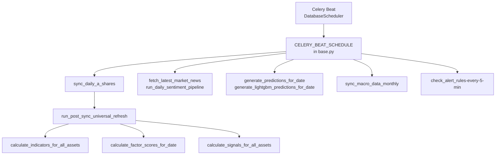
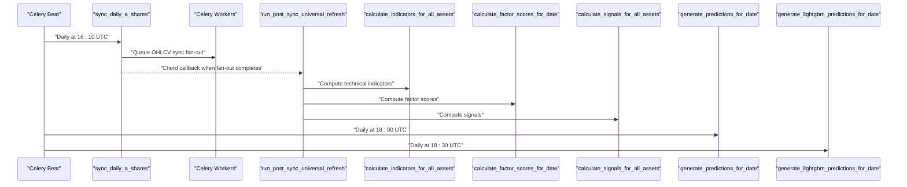
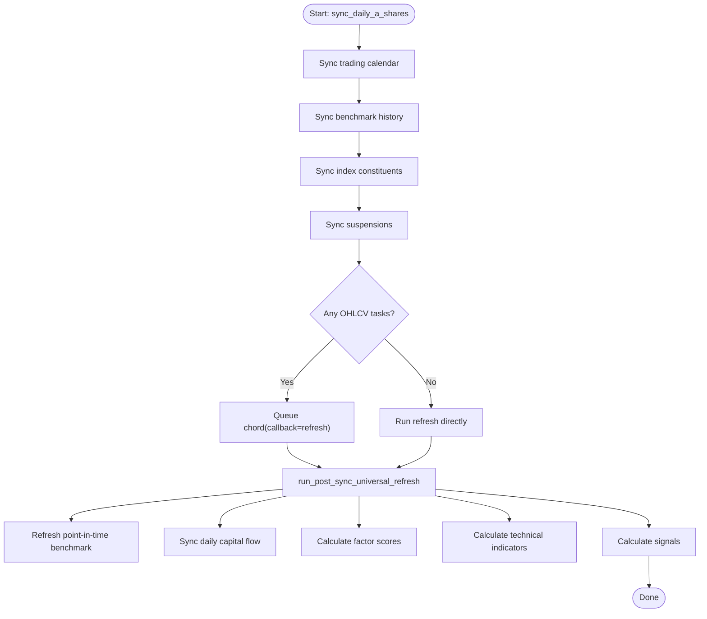
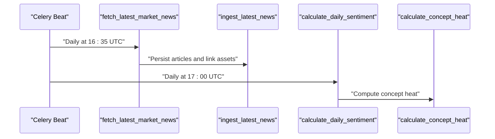
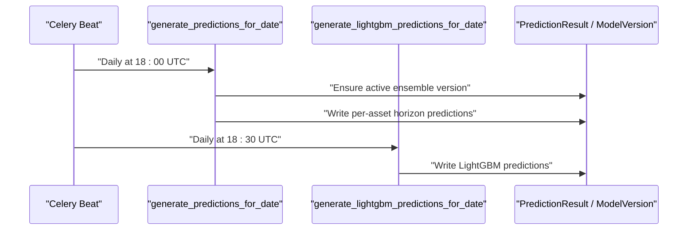
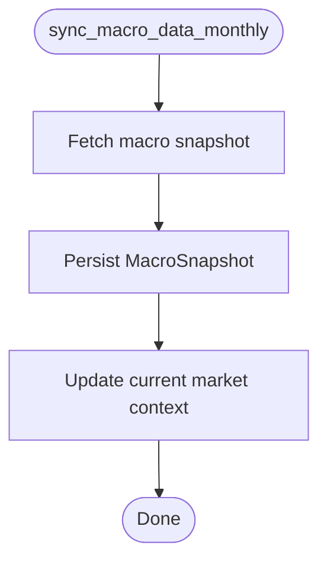
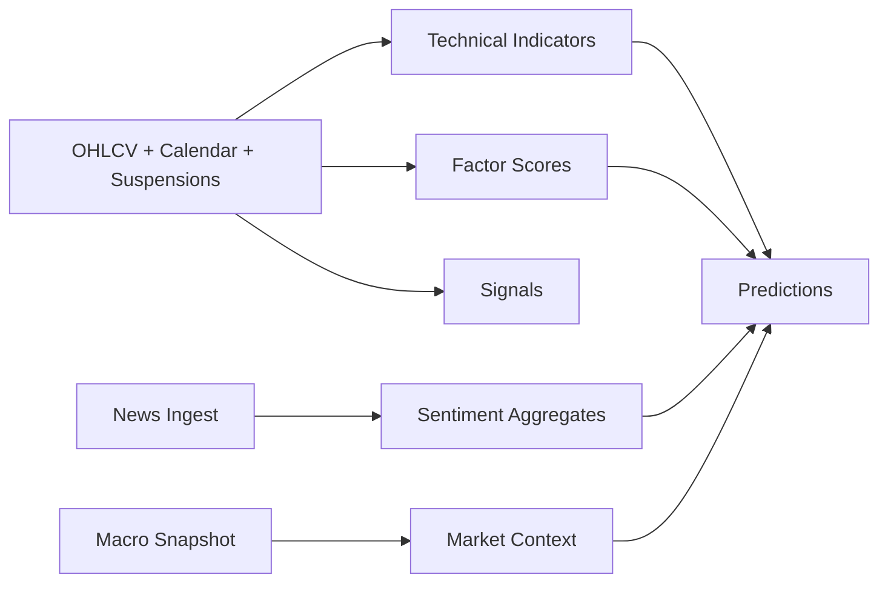

# Scheduled Jobs & Cron Tasks

<cite>
**Referenced Files in This Document**
- [celery.py](file://config/celery.py)
- [base.py](file://config/settings/base.py)
- [celery.md](file://docs/reference/celery.md)
- [run_celery_beat.sh](file://scripts/run_celery_beat.sh)
- [tasks.py](file://apps/markets/tasks.py)
- [tasks.py](file://apps/sentiment/tasks.py)
- [tasks.py](file://apps/prediction/tasks.py)
- [tasks.py](file://apps/macro/tasks.py)
- [tasks.py](file://apps/analytics/tasks.py)
- [0011_remove_scheduled_model_retraining_tasks.py](file://apps/markets/migrations/0011_remove_scheduled_model_retraining_tasks.py)
- [0007_remove_obsolete_daily_beat_rows.py](file://apps/markets/migrations/0007_remove_obsolete_daily_beat_rows.py)
- [retrain.md](file://docs/how-to/retrain.md)
- [runbook-sync-failure.md](file://docs/how-to/runbook-sync-failure.md)
- [runbook-stale-data.md](file://docs/how-to/runbook-stale-data.md)
- [backfill.md](file://docs/how-to/backfill.md)
- [views.py](file://apps/prediction/views.py)
</cite>

## Table of Contents
1. Introduction
2. Project Structure
3. Core Components
4. Architecture Overview
5. Detailed Component Analysis
6. Dependency Analysis
7. Performance Considerations
8. Troubleshooting Guide
9. Conclusion
10. Appendices

## Introduction
This document explains how scheduled jobs are orchestrated with Celery Beat to keep market data fresh, run periodic model retraining and prediction pipelines, and perform maintenance tasks such as database optimization and cleanup. It covers scheduling patterns, cron expressions, time zone considerations, job dependencies, execution ordering, failure recovery, monitoring, and operational guidance for creating new scheduled jobs and adjusting schedules under load.

## Project Structure
Scheduled jobs are defined in Django settings and executed by a Celery Beat process using the Django-based scheduler. The project uses:
- A Celery app configured via Django settings
- A Beat schedule that triggers daily, hourly, and monthly tasks
- Task modules per domain (markets, sentiment, prediction, macro, analytics)
- Scripts to start Beat with a persistent PID file and database-backed scheduler

**Diagram sources**
- [base.py:218-255](file://config/settings/base.py#L218-L255)
- [tasks.py:1043-1166](file://apps/markets/tasks.py#L1043-L1166)
- [tasks.py:594-615](file://apps/analytics/tasks.py#L594-L615)

**Section sources**
- [celery.py:1-17](file://config/celery.py#L1-L17)
- [base.py:218-255](file://config/settings/base.py#L218-L255)
- [run_celery_beat.sh:1-12](file://scripts/run_celery_beat.sh#L1-L12)
- [celery.md:13-48](file://docs/reference/celery.md#L13-L48)

## Core Components
- Daily market synchronization: fetches trading calendars, benchmark history, index constituents, suspensions, and queues OHLCV syncs; then runs post-sync refresh for indicators, factors, signals, and point-in-time benchmarks.
- News ingestion and sentiment pipeline: ingests latest news, scores articles, aggregates 7-day asset and market sentiment, and computes concept heat.
- Prediction pipeline: generates heuristic predictions and LightGBM predictions on a fixed daily cadence, using latest indicators, factors, sentiment, and macro context.
- Macro data synchronization: monthly macro snapshot ingestion and current market context inference.
- Alerting: frequent alert rule checks against indicators.

Key scheduling entries include daily A-share sync, monthly index membership updates, monthly macro sync, daily news ingestion, daily sentiment pipeline, daily predictions, and every-5-minute alert checks.

**Section sources**
- [base.py:218-255](file://config/settings/base.py#L218-L255)
- [celery.md:34-48](file://docs/reference/celery.md#L34-L48)
- [tasks.py:1043-1166](file://apps/markets/tasks.py#L1043-L1166)
- [tasks.py:328-390](file://apps/sentiment/tasks.py#L328-L390)
- [tasks.py:561-564](file://apps/sentiment/tasks.py#L561-L564)
- [tasks.py:177-243](file://apps/prediction/tasks.py#L177-L243)
- [tasks.py:91-131](file://apps/macro/tasks.py#L91-L131)
- [tasks.py:594-615](file://apps/analytics/tasks.py#L594-L615)

## Architecture Overview
The daily pipeline is a choreographed sequence of scheduled tasks and task-dispatched sub-tasks. Market data ingestion fans out per asset, then a chord callback triggers a universal refresh that computes derived metrics in a defined order. Sentiment and macro data feed into predictions, which run after indicators and factors are ready.

**Diagram sources**
- [base.py:218-255](file://config/settings/base.py#L218-L255)
- [tasks.py:1043-1166](file://apps/markets/tasks.py#L1043-L1166)
- [tasks.py:594-615](file://apps/analytics/tasks.py#L594-L615)
- [tasks.py:177-243](file://apps/prediction/tasks.py#L177-L243)

## Detailed Component Analysis

### Daily Market Data Synchronization
- Entry: scheduled daily at 16:10 UTC.
- Responsibilities:
  - Sync exchange trading calendar for the target date.
  - Sync benchmark index history over a recent window.
  - Sync index constituent universe and compute union of assets.
  - Sync asset suspension days.
  - Queue unique OHLCV sync tasks per asset.
  - After all fan-out tasks complete, trigger a universal refresh that recomputes point-in-time benchmark, capital flow snapshots, factor scores, technical indicators, and signals.
- Execution pattern:
  - Uses a chord to ensure the post-sync refresh runs only after all asset-level sync tasks finish.
  - If no signatures are queued, the refresh still runs directly for the target date.

**Diagram sources**
- [tasks.py:1043-1166](file://apps/markets/tasks.py#L1043-L1166)

**Section sources**
- [base.py:218-222](file://config/settings/base.py#L218-L222)
- [tasks.py:1043-1166](file://apps/markets/tasks.py#L1043-L1166)

### News Ingestion and Sentiment Pipeline
- Entry: scheduled daily at 16:35 UTC for news fetch; 17:00 UTC for sentiment pipeline; hourly historical backfill at minute 12.
- Responsibilities:
  - Fetch normalized news items from configured providers.
  - Ingest articles with deduplication by URL and link related assets via name matching.
  - Score articles and aggregate 7-day sentiment per asset and market-wide.
  - Compute concept heat from inferred tags.
  - Historical backfill advances through history in bounded chunks until reaching a floor.
- Failure handling:
  - Provider quota errors are treated as retryable conditions rather than failures.

**Diagram sources**
- [base.py:235-245](file://config/settings/base.py#L235-L245)
- [tasks.py:328-390](file://apps/sentiment/tasks.py#L328-L390)
- [tasks.py:561-564](file://apps/sentiment/tasks.py#L561-L564)

**Section sources**
- [base.py:235-245](file://config/settings/base.py#L235-L245)
- [tasks.py:328-390](file://apps/sentiment/tasks.py#L328-L390)
- [tasks.py:561-564](file://apps/sentiment/tasks.py#L561-L564)

### Prediction Pipelines
- Entries:
  - Heuristic predictions daily at 18:00 UTC.
  - LightGBM predictions daily at 18:30 UTC.
- Responsibilities:
  - Build feature snapshots from factors, sentiment, and technical indicators.
  - Compute probabilities per horizon and derive trade decisions.
  - Persist prediction results with model version metadata.
  - Ensure an active ensemble model version exists for the target date.
- Dependencies:
  - Requires indicators, factors, sentiment, and macro context to be up to date.

**Diagram sources**
- [base.py:247-254](file://config/settings/base.py#L247-L254)
- [tasks.py:177-243](file://apps/prediction/tasks.py#L177-L243)

**Section sources**
- [base.py:247-254](file://config/settings/base.py#L247-L254)
- [tasks.py:177-243](file://apps/prediction/tasks.py#L177-L243)

### Macro Data Synchronization and Market Context
- Entry: monthly on days 2–8 at 00:10 UTC.
- Responsibilities:
  - Fetch macro snapshot using primary provider with fallback.
  - Persist monthly snapshot fields including yield curve terms.
  - Update current market context based on inferred phase from macro indicators.

**Diagram sources**
- [base.py:231-234](file://config/settings/base.py#L231-L234)
- [tasks.py:91-131](file://apps/macro/tasks.py#L91-L131)

**Section sources**
- [base.py:231-234](file://config/settings/base.py#L231-L234)
- [tasks.py:91-131](file://apps/macro/tasks.py#L91-L131)

### Alert Rules Checking
- Entry: every 5 minutes.
- Responsibilities:
  - Evaluate alert rules against latest indicators and signals.
  - Trigger notifications or downstream actions as configured.

**Section sources**
- [base.py:227-230](file://config/settings/base.py#L227-L230)
- [celery.md:38-38](file://docs/reference/celery.md#L38-L38)

### Maintenance Tasks and Cleanup
- Monthly index membership refresh:
  - Runs on the first day of each month at 02:15 UTC.
  - Updates benchmark memberships and dispatches sync tasks only for changed assets.
- Historical news backfill:
  - Runs hourly at minute 12.
  - Advances through historical windows until reaching a configured floor.
- Database optimization and validation:
  - Backfill commands use idempotent upserts and checkpointing.
  - Validation commands detect gaps and staleness across indicator families.

**Section sources**
- [base.py:223-226](file://config/settings/base.py#L223-L226)
- [base.py:239-242](file://config/settings/base.py#L239-L242)
- [tasks.py:1125-1155](file://apps/markets/tasks.py#L1125-L1155)
- [tasks.py:353-390](file://apps/sentiment/tasks.py#L353-L390)
- [backfill.md:280-326](file://docs/how-to/backfill.md#L280-L326)

## Dependency Analysis
The daily pipeline enforces strict dependency ordering:
- Market data ingestion must precede derived metrics computation.
- Derived metrics (indicators, factors, signals) must be computed before predictions.
- Predictions depend on sentiment and macro context being available for the target date.

**Diagram sources**
- [tasks.py:1043-1166](file://apps/markets/tasks.py#L1043-L1166)
- [tasks.py:594-615](file://apps/analytics/tasks.py#L594-L615)
- [tasks.py:177-243](file://apps/prediction/tasks.py#L177-L243)

**Section sources**
- [runbook-stale-data.md:168-220](file://docs/how-to/runbook-stale-data.md#L168-L220)
- [runbook-sync-failure.md:8-22](file://docs/how-to/runbook-sync-failure.md#L8-L22)

## Performance Considerations
- Queue topology:
  - Default queue `ops` handles periodic syncs, indicators, sentiment, and daily predictions.
  - Long-running CPU-heavy backtests run on dedicated queue `backtest`.
  - Training tasks run on separate queues (`train-lightgbm`, `train-lstm`).
- Time limits:
  - Global defaults protect the ops queue from stuck tasks.
  - Backtest tasks override soft/hard limits to allow long runs without premature termination.
- Resource contention:
  - Use separate queues for heavy workloads to avoid starving daily syncs.
  - Scale workers per queue according to workload characteristics.
- Idempotency:
  - Backfills and syncs are idempotent; safe to rerun for affected ranges.

**Section sources**
- [celery.md:13-31](file://docs/reference/celery.md#L13-L31)
- [celery.md:51-108](file://docs/reference/celery.md#L51-L108)
- [runbook-sync-failure.md:116-126](file://docs/how-to/runbook-sync-failure.md#L116-L126)

## Troubleshooting Guide
- Verify pipeline health:
  - Check coverage tables to confirm OHLCV, indicators, factors, and predictions advanced to the expected trading day.
- Recover failed stages:
  - Re-run upstream backfills first, then downstream owners in dependency order.
  - Re-trigger daily tasks for missed dates instead of waiting for the next schedule.
- Handle timeouts:
  - Distinguish between timeout and hang; inspect global vs per-task limits.
- Provider blackouts:
  - Throttled providers are treated as retryable; narrow ranges and resume from checkpoints.
- Stale data remediation:
  - Repair upstream data first; then recompute derived series; finally re-run daily tasks for affected dates.

**Section sources**
- [runbook-sync-failure.md:8-36](file://docs/how-to/runbook-sync-failure.md#L8-L36)
- [runbook-sync-failure.md:84-126](file://docs/how-to/runbook-sync-failure.md#L84-L126)
- [runbook-stale-data.md:168-220](file://docs/how-to/runbook-stale-data.md#L168-L220)
- [backfill.md:280-326](file://docs/how-to/backfill.md#L280-L326)

## Conclusion
The system uses Celery Beat with a clear, documented schedule to maintain market data freshness, drive sentiment and prediction pipelines, and perform monthly maintenance. Dependencies are enforced through task orchestration and explicit scheduling spacing. Operational tools and runbooks provide robust recovery paths for failures, provider issues, and stale data. For high-load periods, queue separation and time limit overrides help balance throughput and reliability.

## Appendices

### Creating New Scheduled Jobs
- Add a new entry to the Beat schedule in settings.
- Implement the task in the appropriate module.
- Ensure dependencies are respected by scheduling timing and task chaining.
- Validate with the generated reference documentation.

**Section sources**
- [base.py:218-255](file://config/settings/base.py#L218-L255)
- [celery.md:34-48](file://docs/reference/celery.md#L34-L48)

### Monitoring Job Execution History
- Use management commands to export metrics and diff changes.
- Inspect coverage tables to verify data freshness.
- Review task logs and queue status for failures or stalls.

**Section sources**
- [runbook-sync-failure.md:24-33](file://docs/how-to/runbook-sync-failure.md#L24-L33)
- [runbook-provider-blackout.md:195-206](file://docs/how-to/runbook-provider-blackout.md#L195-L206)

### Adjusting Schedules Based on Operational Requirements
- Modify crontab expressions in settings to shift times or frequencies.
- Consider market close times and timezone alignment (UTC).
- Remove obsolete entries via migrations if needed.

**Section sources**
- [base.py:218-255](file://config/settings/base.py#L218-L255)
- [0007_remove_obsolete_daily_beat_rows.py:1-64](file://apps/markets/migrations/0007_remove_obsolete_daily_beat_rows.py#L1-L64)

### Retrain Guidance and Model Versioning
- Retraining can be triggered via management commands or API actions.
- Active model versions are managed and updated during retrain flows.
- Pruning behavior depends on feature importance snapshots.

**Section sources**
- [views.py:152-161](file://apps/prediction/views.py#L152-L161)
- [retrain.md:99-140](file://docs/how-to/retrain.md#L99-L140)
- [tasks.py:149-174](file://apps/prediction/tasks.py#L149-L174)