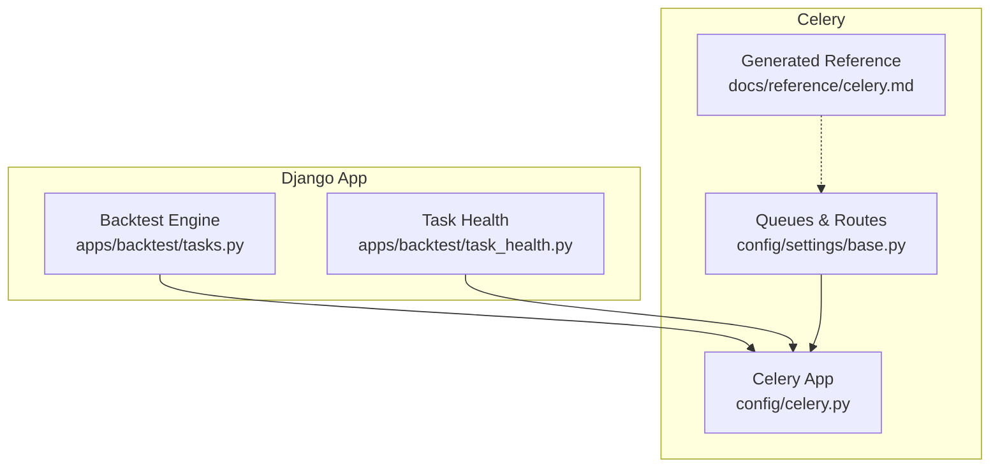
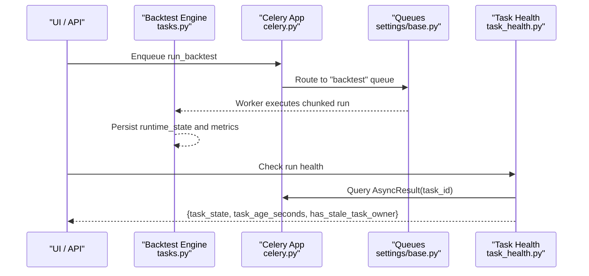
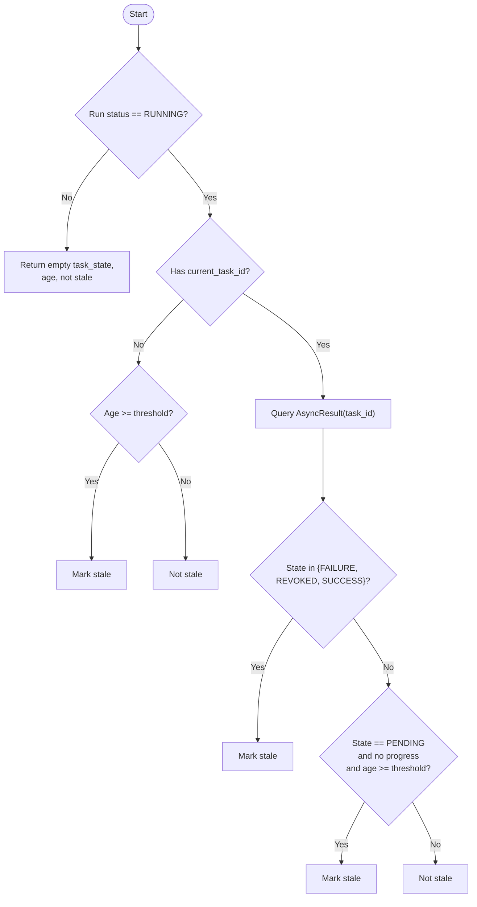
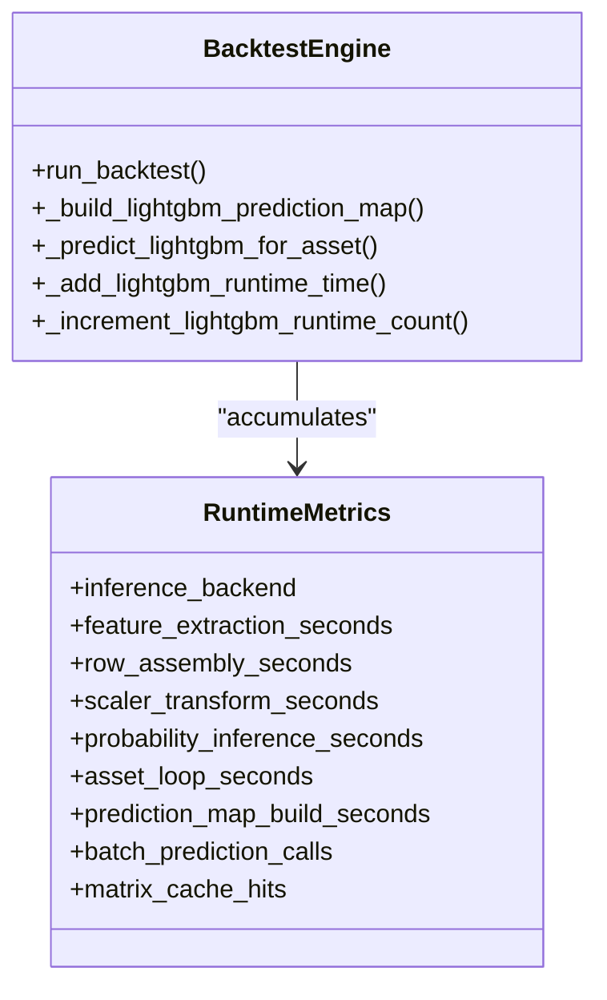
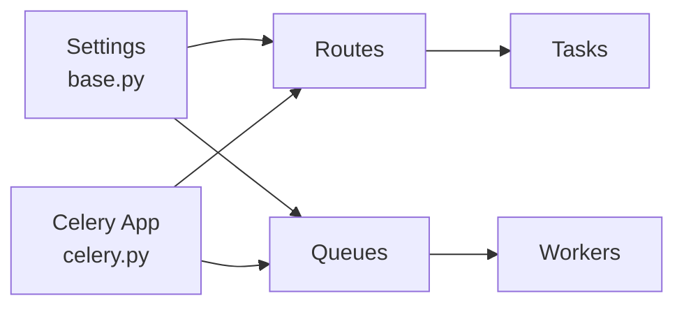
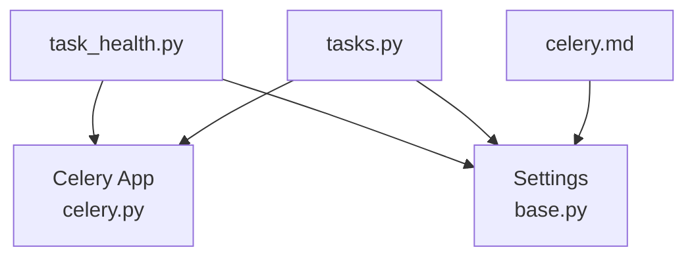

# Task Monitoring & Debugging

<cite>
**Referenced Files in This Document**
- [task_health.py](file://apps/backtest/task_health.py)
- [tasks.py](file://apps/backtest/tasks.py)
- [celery.py](file://config/celery.py)
- [base.py](file://config/settings/base.py)
- [celery.md](file://docs/reference/celery.md)
- [local-setup.md](file://docs/how-to/local-setup.md)
- [runbook-sync-failure.md](file://docs/how-to/runbook-sync-failure.md)
- [metrics.md](file://docs/reference/metrics.md)
- [export_documentation_facts.py](file://apps/core/management/commands/export_documentation_facts.py)
</cite>

## Table of Contents
1. Introduction
2. Project Structure
3. Core Components
4. Architecture Overview
5. Detailed Component Analysis
6. Dependency Analysis
7. Performance Considerations
8. Troubleshooting Guide
9. Conclusion
10. Appendices

## Introduction
This document explains how to monitor and debug background tasks in the system, with a focus on task health detection for long-running backtests, Celery queue topology, worker status, execution times, logging strategies, error reporting, performance profiling, alerting, capacity planning, load testing, and optimization for long-running financial computations.

## Project Structure
The monitoring and debugging surface is built around:
- A Celery application that discovers tasks and routes them to dedicated queues.
- A backtest engine that runs chunked, resumable jobs and records runtime metrics.
- A task health utility that detects orphaned or stale backtest runs by inspecting Celery task state and run progress.
- Generated reference material describing queues, time limits, and scheduled jobs.

**Diagram sources**
- [celery.py:1-17](file://config/celery.py#L1-L17)
- [base.py:174-200](file://config/settings/base.py#L174-L200)
- [tasks.py:1-37](file://apps/backtest/tasks.py#L1-L37)
- [task_health.py:1-32](file://apps/backtest/task_health.py#L1-L32)
- [celery.md:13-31](file://docs/reference/celery.md#L13-L31)

**Section sources**
- [celery.py:1-17](file://config/celery.py#L1-L17)
- [base.py:174-200](file://config/settings/base.py#L174-L200)
- [celery.md:13-31](file://docs/reference/celery.md#L13-L31)

## Core Components
- Celery app and queues: The Celery app is configured to read settings from Django under a CELERY namespace and auto-discover tasks. Queues are defined for ops, backtest, train-lightgbm, and train-lstm, with explicit routing for heavy tasks.
- Backtest engine: Long-running backtests are chunked and resumable, persisting runtime state so they survive worker restarts and soft time limits. They collect per-phase timing metrics (feature extraction, row assembly, scaler transform, inference, asset loop).
- Task health: Detects stale or orphaned backtest runs by combining Celery task state with run progress and age thresholds.

Key responsibilities:
- Queue isolation ensures backtests and training jobs do not starve daily ops workloads.
- Chunking and resume enable robustness against timeouts and worker failures.
- Runtime metrics capture where time is spent during prediction and matrix building.

**Section sources**
- [celery.py:1-17](file://config/celery.py#L1-L17)
- [base.py:174-200](file://config/settings/base.py#L174-L200)
- [tasks.py:162-231](file://apps/backtest/tasks.py#L162-L231)
- [task_health.py:33-95](file://apps/backtest/task_health.py#L33-L95)

## Architecture Overview
The system uses Celery to schedule and execute background work across isolated queues. The backtest engine performs chunked computation and writes progress into its report. Task health inspects Celery’s AsyncResult to determine whether a RUNNING backtest is actually making progress or is orphaned.

**Diagram sources**
- [celery.py:1-17](file://config/celery.py#L1-L17)
- [base.py:174-200](file://config/settings/base.py#L174-L200)
- [tasks.py:162-231](file://apps/backtest/tasks.py#L162-L231)
- [task_health.py:45-95](file://apps/backtest/task_health.py#L45-L95)

## Detailed Component Analysis

### Task Health Detection (task_health.py)
Purpose: Identify backtest runs that appear RUNNING but are effectively stuck because their owning Celery task reached a terminal state or has been pending too long without progress.

Key logic:
- Determine a reference timestamp for age calculation based on updated_at or started_at depending on presence of runtime progress.
- If no current task id exists, mark stale if age exceeds threshold.
- If a task id exists, query Celery AsyncResult to get task state.
- Mark stale if task state is terminal (FAILURE, REVOKED, SUCCESS) while run remains RUNNING.
- For PENDING tasks, treat as stale only when there is no runtime progress and age exceeds threshold.

**Diagram sources**
- [task_health.py:45-95](file://apps/backtest/task_health.py#L45-L95)

Operational notes:
- Staleness threshold is configurable via a setting attribute; default is provided.
- The function returns structured diagnostics including task state, age in seconds, and a boolean flag indicating staleness.

**Section sources**
- [task_health.py:33-95](file://apps/backtest/task_health.py#L33-L95)

### Backtest Execution and Metrics (tasks.py)
Purpose: Execute long-running backtests in chunks, record runtime metrics, and support resumption after interruptions.

Highlights:
- Chunking: Runs process a bounded number of trading days per chunk and persist runtime_state to resume later.
- Time limits: Global defaults apply unless overridden; backtest overrides are documented in generated references.
- Metrics collection: Per-phase timings for feature extraction, row assembly, scaler transform, probability inference, and asset loop are accumulated and serialized into the run’s report.

**Diagram sources**
- [tasks.py:162-231](file://apps/backtest/tasks.py#L162-L231)
- [tasks.py:681-829](file://apps/backtest/tasks.py#L681-L829)

**Section sources**
- [tasks.py:162-231](file://apps/backtest/tasks.py#L162-L231)
- [tasks.py:681-829](file://apps/backtest/tasks.py#L681-L829)

### Celery Configuration and Queues
Purpose: Define broker, result backend, queues, and routing to isolate workloads and control execution semantics.

Key points:
- Broker and result backend use Redis.
- Four queues: ops (default), backtest, train-lightgbm, train-lstm.
- Explicit routing sends backtests and training jobs to dedicated queues.
- Auto-discovery loads tasks from all registered apps.

**Diagram sources**
- [base.py:174-200](file://config/settings/base.py#L174-L200)
- [celery.py:1-17](file://config/celery.py#L1-L17)

**Section sources**
- [base.py:174-200](file://config/settings/base.py#L174-L200)
- [celery.py:1-17](file://config/celery.py#L1-L17)
- [celery.md:13-31](file://docs/reference/celery.md#L13-L31)

### Monitoring Tools and Workflows
- Celery Flower: Use it to observe workers, queues, task states, and durations. Confirm that separate workers consume each queue as intended.
- Beat schedule: Review scheduled entries to ensure periodic tasks (syncs, predictions, alerts) are firing as expected.
- Coverage metrics: Regenerate coverage metrics to verify data freshness across tables and detect stalls early.

Practical checks:
- Verify workers are running for each queue.
- Inspect queue lengths and task durations in Flower.
- Compare Latest columns in coverage metrics to confirm pipeline progression.

**Section sources**
- [local-setup.md:334-400](file://docs/how-to/local-setup.md#L334-L400)
- [celery.md:34-48](file://docs/reference/celery.md#L34-L48)
- [metrics.md:13-53](file://docs/reference/metrics.md#L13-L53)

## Dependency Analysis
- Backtest tasks depend on Celery app for execution and on settings for queue configuration.
- Task health depends on Celery AsyncResult and Django settings to compute staleness.
- Generated documentation depends on introspection of Celery app registry, routes, and beat schedule.

**Diagram sources**
- [task_health.py:24-30](file://apps/backtest/task_health.py#L24-L30)
- [tasks.py:48-69](file://apps/backtest/tasks.py#L48-L69)
- [base.py:174-200](file://config/settings/base.py#L174-L200)
- [celery.py:1-17](file://config/celery.py#L1-L17)

**Section sources**
- [task_health.py:24-30](file://apps/backtest/task_health.py#L24-L30)
- [tasks.py:48-69](file://apps/backtest/tasks.py#L48-L69)
- [celery.md:13-31](file://docs/reference/celery.md#L13-L31)

## Performance Considerations
- Queue isolation: Keep backtests and training jobs off the ops queue to avoid starving daily syncs and predictions.
- Chunk size tuning: Adjust chunk sizes to balance resilience and throughput for long windows.
- Inference backend selection: Choose appropriate LightGBM inference backend for your environment; batch modes can improve throughput.
- Process-level caches: Clear caches between unrelated batches to bound memory usage.
- Time limits: Understand global and per-task limits; backtests override defaults. Soft limit exceptions indicate throttling rather than hangs.

[No sources needed since this section provides general guidance]

## Troubleshooting Guide
Common symptoms and actions:
- Task never appears in logs: Wrong queue or no consumer worker. Ensure a worker is listening on the correct queue.
- SoftTimeLimitExceeded on ops tasks: Reduce date range or run as a management command instead of a task.
- SoftTimeLimitExceeded on run_backtest: Reduce window or rely on chunking to resume across chunks.
- Hard time limit exceeded: Worker killed the task; the run row may remain RUNNING—use task health to detect and remediate.
- Predictions stopped: Missing active model artifact for a horizon or artifact path does not resolve.

Diagnostic steps:
- Use Flower to inspect worker status, queue lengths, and task durations.
- Regenerate coverage metrics to confirm data freshness and identify stalled pipelines.
- Use task health to detect stale or orphaned backtest runs and decide whether to restart or fail them.

**Section sources**
- [runbook-sync-failure.md:128-141](file://docs/how-to/runbook-sync-failure.md#L128-L141)
- [local-setup.md:334-400](file://docs/how-to/local-setup.md#L334-L400)
- [celery.md:25-31](file://docs/reference/celery.md#L25-L31)
- [metrics.md:13-53](file://docs/reference/metrics.md#L13-L53)

## Conclusion
Robust monitoring and debugging of background tasks hinge on three pillars:
- Isolated queues and dedicated workers to prevent contention.
- Chunked, resumable execution with detailed runtime metrics to localize performance issues.
- Proactive staleness detection to identify orphaned or stuck runs quickly.

Combine these with Flower for live observability, generated coverage metrics for early warning, and runbooks for rapid incident response.

[No sources needed since this section summarizes without analyzing specific files]

## Appendices

### Capacity Planning and Load Testing
- Scale horizontally by running multiple workers per queue as needed.
- Use separate workers for backtests and training to protect ops throughput.
- Validate concurrency and native thread settings per platform to avoid oversubscription.
- Measure peak memory and CPU usage during representative backtest windows; adjust chunk sizes and cache bounds accordingly.

[No sources needed since this section provides general guidance]

### Alerting Mechanisms
- Data quality alerts: Use validation commands with alert flags to notify on critical findings.
- Pipeline freshness: Track Latest columns in coverage metrics; alert when they stop advancing.
- Task failures: Monitor Celery task states in Flower and set up alerts for repeated failures or prolonged PENDING states without progress.

**Section sources**
- [runbook-stale-data.md:249-262](file://docs/how-to/runbook-stale-data.md#L249-L262)
- [metrics.md:13-53](file://docs/reference/metrics.md#L13-L53)