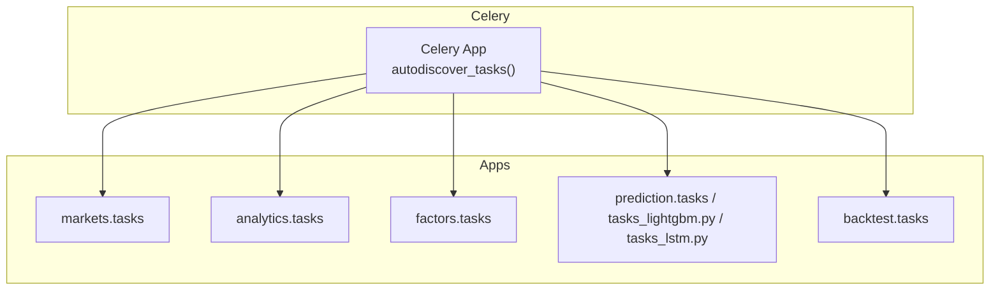
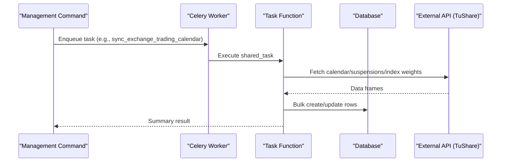
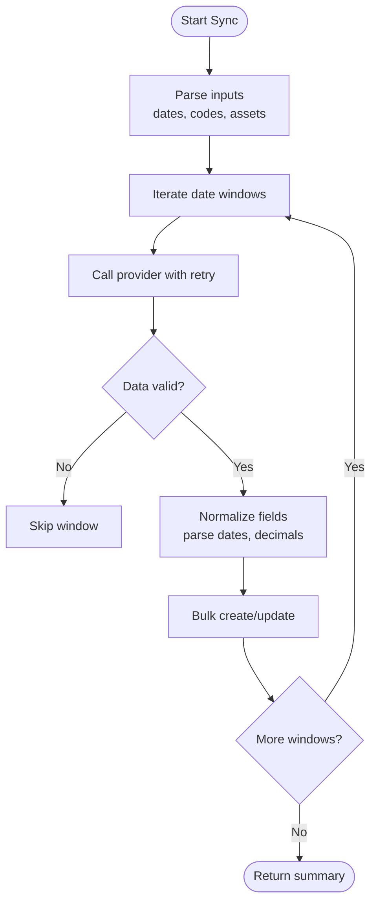
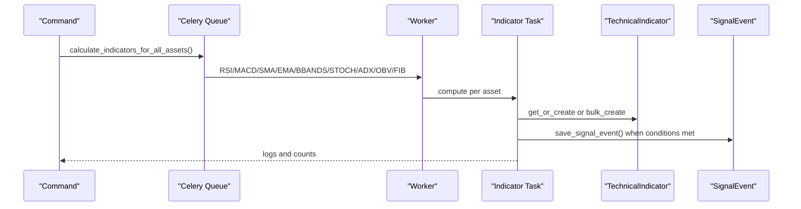
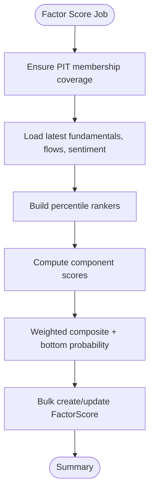
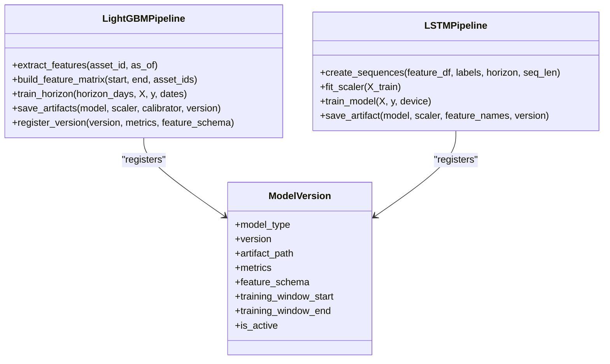
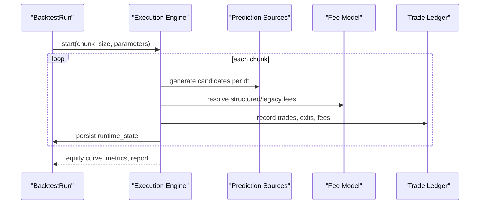
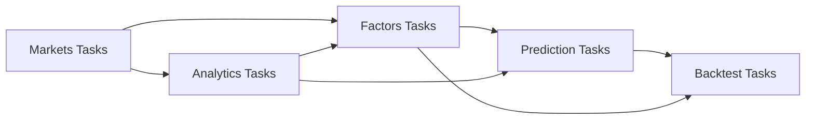

# Task Types & Implementation Patterns

<cite>
**Referenced Files in This Document**
- [celery.py](file://config/celery.py)
- [tasks.py](file://apps/markets/tasks.py)
- [backfill_ohlcv_history.py](file://apps/markets/management/commands/backfill_ohlcv_history.py)
- [tasks.py](file://apps/analytics/tasks.py)
- [backfill_technical_indicators.py](file://apps/analytics/management/commands/backfill_technical_indicators.py)
- [tasks.py](file://apps/factors/tasks.py)
- [backfill_fundamental_snapshots.py](file://apps/factors/management/commands/backfill_fundamental_snapshots.py)
- [tasks.py](file://apps/prediction/tasks.py)
- [tasks_lightgbm.py](file://apps/prediction/tasks_lightgbm.py)
- [tasks_lstm.py](file://apps/prediction/tasks_lstm.py)
- [tasks.py](file://apps/backtest/tasks.py)
</cite>

## Table of Contents
1. [Introduction](#introduction)
2. [Project Structure](#project-structure)
3. [Core Components](#core-components)
4. [Architecture Overview](#architecture-overview)
5. [Detailed Component Analysis](#detailed-component-analysis)
6. [Dependency Analysis](#dependency-analysis)
7. [Performance Considerations](#performance-considerations)
8. [Troubleshooting Guide](#troubleshooting-guide)
9. [Conclusion](#conclusion)

## Introduction
This document explains the background task types implemented in the FinanceAnalysis platform and how they are orchestrated, executed, and monitored. It covers:
- Market data synchronization tasks (OHLCV backfill, asset lifecycle updates, trading calendar maintenance)
- Analytics tasks (technical indicator computation, signal generation, alert evaluation)
- Factor calculation tasks (fundamental analysis, capital flow tracking, composite scoring)
- Machine learning tasks (LightGBM and LSTM training pipelines, feature engineering, artifact versioning)
- Backtesting tasks (strategy validation, performance metrics, result comparison)

It also documents implementation patterns, error handling strategies, retry policies, and progress tracking mechanisms used across these tasks.

## Project Structure
The platform uses Django with Celery for asynchronous task execution. Each app owns its tasks and management commands that orchestrate long-running or batch jobs. The Celery application is configured to autodiscover tasks from all installed apps.

**Diagram sources**
- [celery.py:1-17](file://config/celery.py#L1-L17)

**Section sources**
- [celery.py:1-17](file://config/celery.py#L1-L17)

## Core Components
- Market data synchronization:
  - Trading calendar sync, asset suspension sync, benchmark index history, constituent universe updates, OHLCV backfill dispatch.
- Analytics:
  - Per-asset technical indicators (RSI, MACD, Bollinger Bands, SMA/EMA, Stochastic, ADX, OBV, Fibonacci), signal events (MA crosses, momentum ranking).
- Factors:
  - Fundamental snapshots, capital flow snapshots, composite factor scores combining fundamentals, flows, technicals, and sentiment.
- Machine learning:
  - LightGBM training/inference with artifacts, scaler/calibrator persistence, feature importance pruning, ensemble weight refresh.
  - LSTM training/inference with sequence construction, PyTorch model artifacts, missingness-aware features.
- Backtesting:
  - Chunked, resumable strategy simulation with configurable fees, macro context adjustments, candidate generation at runtime, trade ledger and report outputs.

**Section sources**
- [tasks.py:266-353](file://apps/markets/tasks.py#L266-L353)
- [tasks.py:355-488](file://apps/markets/tasks.py#L355-L488)
- [tasks.py:491-574](file://apps/markets/tasks.py#L491-L574)
- [tasks.py:649-800](file://apps/markets/tasks.py#L649-L800)
- [tasks.py:28-615](file://apps/analytics/tasks.py#L28-L615)
- [tasks.py:256-461](file://apps/factors/tasks.py#L256-L461)
- [tasks_lightgbm.py:78-157](file://apps/prediction/tasks_lightgbm.py#L78-L157)
- [tasks_lstm.py:41-80](file://apps/prediction/tasks_lstm.py#L41-L80)
- [tasks.py:1-800](file://apps/backtest/tasks.py#L1-L800)

## Architecture Overview
High-level flow from command invocation through Celery to workers and data stores.

**Diagram sources**
- [tasks.py:266-353](file://apps/markets/tasks.py#L266-L353)
- [tasks.py:355-488](file://apps/markets/tasks.py#L355-L488)
- [tasks.py:649-800](file://apps/markets/tasks.py#L649-L800)

## Detailed Component Analysis

### Market Data Synchronization Tasks
Responsibilities:
- Exchange trading calendar maintenance
- Asset suspension windows
- Benchmark index daily history
- Index constituents and asset lifecycle updates
- OHLCV backfill orchestration

Key patterns:
- Windowed iteration over date ranges to respect provider limits
- Retry wrapper for rate-limited external APIs
- Bulk writes with upsert semantics where supported
- Warm-up windows for technical indicators via repair ranges

**Diagram sources**
- [tasks.py:266-353](file://apps/markets/tasks.py#L266-L353)
- [tasks.py:355-488](file://apps/markets/tasks.py#L355-L488)
- [tasks.py:491-574](file://apps/markets/tasks.py#L491-L574)
- [tasks.py:649-800](file://apps/markets/tasks.py#L649-L800)

Implementation highlights:
- Trading calendar sync deletes and replaces per-window rows after validating completeness.
- Suspension sync deduplicates and merges timing details; full-day suspensions take precedence.
- Benchmark index history uses upsert on unique key (index_code, trade_date).
- Constituent universe fetches index weights in small windows, builds membership snapshots, creates/updates assets, and tags assets by index membership.

Error handling and retries:
- Provider calls wrapped with a retry helper that sleeps on rate-limit errors and enforces max retries.
- Strict validation on required columns before persisting calendar rows.

Progress tracking:
- Commands dispatch per-asset repairs and print progress counters.
- OHLCV backfill supports CSV-driven gap repair and warm-up prefill options.

**Section sources**
- [tasks.py:196-226](file://apps/markets/tasks.py#L196-L226)
- [tasks.py:266-353](file://apps/markets/tasks.py#L266-L353)
- [tasks.py:355-488](file://apps/markets/tasks.py#L355-L488)
- [tasks.py:491-574](file://apps/markets/tasks.py#L491-L574)
- [tasks.py:649-800](file://apps/markets/tasks.py#L649-L800)
- [backfill_ohlcv_history.py:25-46](file://apps/markets/management/commands/backfill_ohlcv_history.py#L25-L46)
- [backfill_ohlcv_history.py:165-191](file://apps/markets/management/commands/backfill_ohlcv_history.py#L165-L191)
- [backfill_ohlcv_history.py:318-387](file://apps/markets/management/commands/backfill_ohlcv_history.py#L318-L387)

### Analytics Tasks
Responsibilities:
- Compute technical indicators per asset
- Generate signal events (e.g., MA golden/death crosses, high RS score)
- Evaluate staleness to avoid redundant recomputation

Key patterns:
- Use OHLCV-backed DataFrames and TA-Lib functions
- Staleness checks based on trading date positions and latest official trade date
- Batch creation with ignore conflicts for signals and indicators
- Central dispatcher queuing per-indicator tasks for all assets

**Diagram sources**
- [tasks.py:593-615](file://apps/analytics/tasks.py#L593-L615)
- [tasks.py:622-737](file://apps/analytics/tasks.py#L622-L737)

Implementation highlights:
- Indicator tasks check trailing window freshness before computing.
- Signal events are idempotent via get_or_create on unique constraints.
- RS score ranking persists top-cutoff signals and indicator rows in bulk.

Error handling and retries:
- Graceful skips when insufficient data or NaN results.
- Database operations protected by chunked transactions and retries in the backfill command.

Progress tracking:
- Backfill command supports checkpoint files and resume-from-checkpoint with per-asset status and chunk completion tracking.

**Section sources**
- [tasks.py:28-615](file://apps/analytics/tasks.py#L28-L615)
- [tasks.py:622-737](file://apps/analytics/tasks.py#L622-L737)
- [backfill_technical_indicators.py:92-241](file://apps/analytics/management/commands/backfill_technical_indicators.py#L92-L241)
- [backfill_technical_indicators.py:264-393](file://apps/analytics/management/commands/backfill_technical_indicators.py#L264-L393)
- [backfill_technical_indicators.py:395-425](file://apps/analytics/management/commands/backfill_technical_indicators.py#L395-L425)

### Factor Calculation Tasks
Responsibilities:
- Daily capital flow snapshot sync
- Composite factor score calculation combining fundamentals, flows, technicals, and sentiment
- Percentile ranking and weighted aggregation

Key patterns:
- Point-in-time union coverage ensured before scoring
- Latest snapshots retrieved per asset efficiently
- Decimal arithmetic for precise percentile ranks and averages
- Bulk create with update_conflicts for idempotency

**Diagram sources**
- [tasks.py:284-461](file://apps/factors/tasks.py#L284-L461)

Implementation highlights:
- Capital flow sync delegates to the dedicated management command path.
- Technical reversal score integrates RSI, BBands lower band proximity, oversold signals, and volume confirmation.
- Sentiment mapping normalizes [-1,1] to [0,1].

Error handling and retries:
- Robust parsing and defaulting for missing values.
- Bulk operations use update_conflicts to handle re-runs safely.

Progress tracking:
- Returns created vs updated counts and asset totals.

**Section sources**
- [tasks.py:256-281](file://apps/factors/tasks.py#L256-L281)
- [tasks.py:284-461](file://apps/factors/tasks.py#L284-L461)
- [backfill_fundamental_snapshots.py:40-126](file://apps/factors/management/commands/backfill_fundamental_snapshots.py#L40-L126)
- [backfill_fundamental_snapshots.py:128-171](file://apps/factors/management/commands/backfill_fundamental_snapshots.py#L128-L171)
- [backfill_fundamental_snapshots.py:213-265](file://apps/factors/management/commands/backfill_fundamental_snapshots.py#L213-L265)

### Machine Learning Tasks
Responsibilities:
- LightGBM training pipeline with feature engineering, scaling, calibration, artifact persistence, and active version management
- LSTM training pipeline with sequence construction, PyTorch model artifacts, and metrics
- Ensemble weight refresh and heuristic baseline predictions

Key patterns:
- Feature extraction with lag windows and interaction terms
- Missing value strategies (legacy neutral fill vs native NaN)
- Snapshot-based feature pruning using importance snapshots
- GPU detection and fallback for LightGBM inference
- ModelVersion registry with active flag and metadata

**Diagram sources**
- [tasks_lightgbm.py:78-157](file://apps/prediction/tasks_lightgbm.py#L78-L157)
- [tasks_lightgbm.py:586-629](file://apps/prediction/tasks_lightgbm.py#L586-L629)
- [tasks_lstm.py:41-80](file://apps/prediction/tasks_lstm.py#L41-L80)
- [tasks_lstm.py:444-470](file://apps/prediction/tasks_lstm.py#L444-L470)

Implementation highlights:
- LightGBM:
  - Artifact cache with bounded entries
  - Optional snapshot pruning to retain top features by cumulative importance
  - Calibrated probabilities via sklearn CalibratedClassifierCV or identity fallback
  - Active version deactivation for other versions of same type/horizon prefix
- LSTM:
  - Missingness indicators appended to feature set
  - Sequence building with per-asset groups and label mapping
  - Training loop with best model state saving and metrics JSON

Error handling and retries:
- Graceful handling of missing data and NaN propagation
- Device probing for GPU with fallback to CPU
- Version resolution with explicit fallback chain for inference

Progress tracking:
- Summary JSON per run with accuracy by horizon and aggregate metrics
- ModelVersion records include trained_at, metrics, and metadata

**Section sources**
- [tasks_lightgbm.py:78-157](file://apps/prediction/tasks_lightgbm.py#L78-L157)
- [tasks_lightgbm.py:249-278](file://apps/prediction/tasks_lightgbm.py#L249-L278)
- [tasks_lightgbm.py:395-408](file://apps/prediction/tasks_lightgbm.py#L395-L408)
- [tasks_lightgbm.py:477-579](file://apps/prediction/tasks_lightgbm.py#L477-L579)
- [tasks_lightgbm.py:586-629](file://apps/prediction/tasks_lightgbm.py#L586-L629)
- [tasks_lightgbm.py:631-729](file://apps/prediction/tasks_lightgbm.py#L631-L729)
- [tasks_lstm.py:109-141](file://apps/prediction/tasks_lstm.py#L109-L141)
- [tasks_lstm.py:234-319](file://apps/prediction/tasks_lstm.py#L234-L319)
- [tasks_lstm.py:371-441](file://apps/prediction/tasks_lstm.py#L371-L441)
- [tasks_lstm.py:473-589](file://apps/prediction/tasks_lstm.py#L473-L589)
- [tasks_lstm.py:592-800](file://apps/prediction/tasks_lstm.py#L592-L800)
- [tasks.py:149-174](file://apps/prediction/tasks.py#L149-L174)
- [tasks.py:177-243](file://apps/prediction/tasks.py#L177-L243)

### Backtesting Tasks
Responsibilities:
- Strategy validation over historical windows
- Performance metrics calculation and trade ledger generation
- Result comparison across runs

Key patterns:
- Chunked execution with persistent runtime state for resuming
- Process-level caches for trading dates, price maps, and matrix signals
- Configurable fee models (structured CN A-share vs legacy flat fee)
- Candidate generation at runtime from heuristics, LightGBM, and LSTM artifacts
- Macro context adjustments to position sizing and thresholds

**Diagram sources**
- [tasks.py:1-800](file://apps/backtest/tasks.py#L1-L800)

Implementation highlights:
- Fee configuration supports per-component rates and minimums; stamp duty applies only on sells.
- Matrix signal caching keyed by scope, prediction source, date, horizon, model identity, and policy.
- Eligible universe selection respects point-in-time membership and excludes suspended assets.

Error handling and retries:
- Conservative exit logic avoids fabricated prices; missing closes defer exits to later bars.
- Database transaction usage and safe decimal conversions.

Progress tracking:
- Runtime state persisted per chunk enables restart after worker failures.
- Clear process caches between unrelated batches to bound memory.

**Section sources**
- [tasks.py:338-478](file://apps/backtest/tasks.py#L338-L478)
- [tasks.py:520-564](file://apps/backtest/tasks.py#L520-L564)
- [tasks.py:567-611](file://apps/backtest/tasks.py#L567-L611)
- [tasks.py:614-678](file://apps/backtest/tasks.py#L614-L678)
- [tasks.py:681-800](file://apps/backtest/tasks.py#L681-L800)

## Dependency Analysis
Cross-app dependencies among tasks:
- Markets tasks depend on TuShare and write to markets models; they trigger analytics warm-up and factor syncs.
- Analytics tasks depend on OHLCV and write TechnicalIndicator and SignalEvent rows consumed by factors and predictions.
- Factors tasks depend on fundamentals, flows, sentiment, and technicals to produce composite scores used by predictions and backtests.
- Prediction tasks depend on factors, sentiment, and technicals to build feature snapshots and generate predictions.
- Backtest tasks depend on prediction artifacts and factors, and simulate trades using market data.

**Diagram sources**
- [tasks.py:14-18](file://apps/markets/tasks.py#L14-L18)
- [tasks.py:17-26](file://apps/analytics/tasks.py#L17-L26)
- [tasks.py:14-19](file://apps/factors/tasks.py#L14-L19)
- [tasks.py:8-16](file://apps/prediction/tasks.py#L8-L16)
- [tasks.py:54-68](file://apps/backtest/tasks.py#L54-L68)

**Section sources**
- [tasks.py:14-18](file://apps/markets/tasks.py#L14-L18)
- [tasks.py:17-26](file://apps/analytics/tasks.py#L17-L26)
- [tasks.py:14-19](file://apps/factors/tasks.py#L14-L19)
- [tasks.py:8-16](file://apps/prediction/tasks.py#L8-L16)
- [tasks.py:54-68](file://apps/backtest/tasks.py#L54-L68)

## Performance Considerations
- Windowed data fetching to respect provider limits and reduce memory pressure.
- Bulk database operations with appropriate batch sizes and upsert semantics.
- Process-level caches for trading dates, price maps, and matrix signals in backtesting.
- Artifact caching for ML models and scalers to avoid repeated disk loads.
- GPU probing and fallback for LightGBM inference to maximize throughput when available.
- Staleness checks to skip redundant computations in analytics.

[No sources needed since this section provides general guidance]

## Troubleshooting Guide
Common issues and remedies:
- Provider rate limits:
  - Use built-in retry wrappers with exponential or fixed sleep intervals; ensure max retries are sufficient for transient throttling.
- Missing or incomplete calendar data:
  - Calendar sync validates completeness per window and refuses partial replacements; re-run with corrected windows.
- Insufficient history for indicators:
  - Use warm-up prefill flags to extend lookback windows; verify effective-universe entry warm-up for new constituents.
- Database connectivity:
  - Backfill commands implement database operation retries with connection resets; consider increasing retry delays for unstable environments.
- No active ML model for inference:
  - Ensure ModelVersion records exist with READY status; training tasks activate the newest version and deactivate stale ones.

**Section sources**
- [tasks.py:196-226](file://apps/markets/tasks.py#L196-L226)
- [tasks.py:296-333](file://apps/markets/tasks.py#L296-L333)
- [backfill_technical_indicators.py:395-413](file://apps/analytics/management/commands/backfill_technical_indicators.py#L395-L413)
- [tasks_lstm.py:234-262](file://apps/prediction/tasks_lstm.py#L234-L262)

## Conclusion
The FinanceAnalysis platform implements a robust, modular task ecosystem powered by Celery. Market data synchronization ensures foundational data quality; analytics and factors transform raw data into actionable signals and scores; machine learning pipelines train and version models with careful feature engineering and artifact management; backtesting validates strategies under realistic market conditions. Consistent patterns such as windowed processing, bulk writes, staleness checks, retry wrappers, and checkpointing enable reliable, scalable, and maintainable operations across diverse workloads.

[No sources needed since this section summarizes without analyzing specific files]