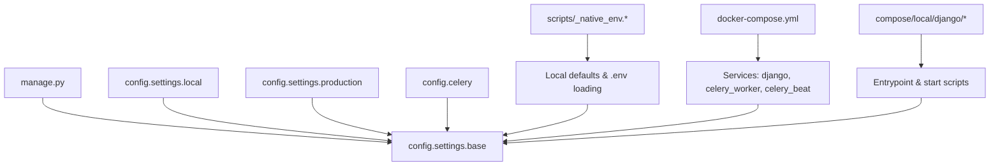
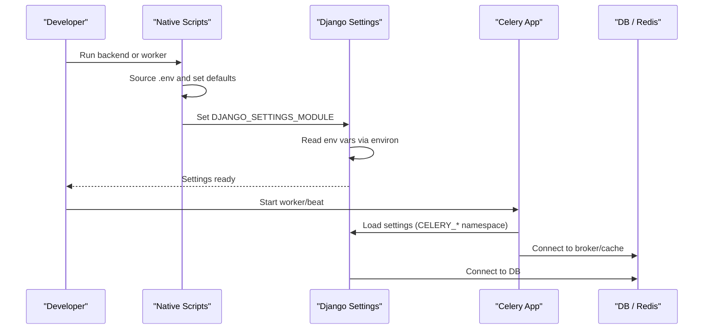
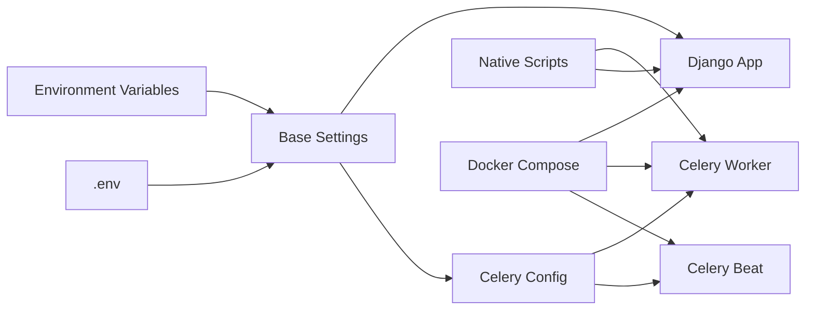
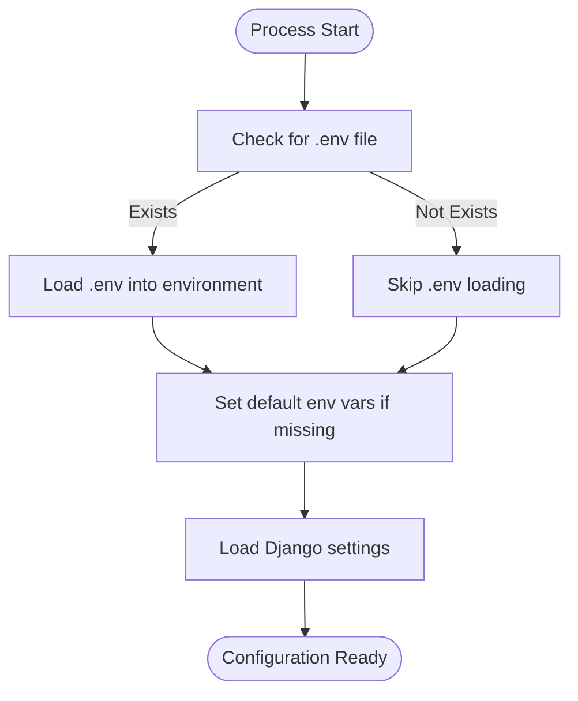
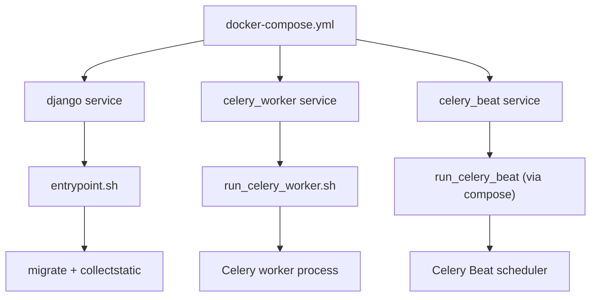

# Configuration Reference

<cite>
**Referenced Files in This Document**
- [base.py](file://config/settings/base.py)
- [local.py](file://config/settings/local.py)
- [production.py](file://config/settings/production.py)
- [celery.py](file://config/celery.py)
- [_native_env.sh](file://scripts/_native_env.sh)
- [_native_env.ps1](file://scripts/_native_env.ps1)
- [run_celery_worker.sh](file://scripts/run_celery_worker.sh)
- [run_backend.sh](file://scripts/run_backend.sh)
- [docker-compose.yml](file://docker-compose.yml)
- [Dockerfile](file://compose/local/django/Dockerfile)
- [entrypoint.sh](file://compose/local/django/entrypoint.sh)
- [start.sh](file://compose/local/django/start.sh)
- [manage.py](file://manage.py)
- [env.md](file://docs/reference/env.md)
</cite>

## Table of Contents
1. Introduction
2. Project Structure
3. Core Components
4. Architecture Overview
5. Detailed Component Analysis
6. Dependency Analysis
7. Performance Considerations
8. Troubleshooting Guide
9. Conclusion
10. Appendices

## Introduction
This document is a comprehensive configuration reference for FinanceAnalysis. It explains how settings are loaded, the environment variables that control behavior, and how to configure databases, Redis, Celery workers and beat, third-party integrations, feature flags, performance tuning, and security. It also provides environment-specific templates (local vs production), validation rules, best practices, secret management guidance, auditing tips, and troubleshooting steps for common configuration issues.

## Project Structure
FinanceAnalysis uses Django’s layered settings with environment-driven configuration:
- Base settings define defaults and read environment variables via django-environ.
- Local overrides enable debug mode and permissive hosts for development.
- Production inherits from base and should add hardened settings.
- Celery reads its configuration from Django settings using a CELERY_ namespace.
- Native scripts set sensible defaults for local execution and load .env when present.
- Docker Compose wires services and env_file to inject runtime configuration.

**Diagram sources**
- [manage.py:8-22](file://manage.py#L8-L22)
- [base.py:13-28](file://config/settings/base.py#L13-L28)
- [local.py:1-19](file://config/settings/local.py#L1-L19)
- [production.py:1-4](file://config/settings/production.py#L1-L4)
- [celery.py:1-17](file://config/celery.py#L1-L17)
- [_native_env.sh:72-84](file://scripts/_native_env.sh#L72-L84)
- [_native_env.ps1:111-159](file://scripts/_native_env.ps1#L111-L159)
- [docker-compose.yml:1-39](file://docker-compose.yml#L1-L39)
- [entrypoint.sh:1-14](file://compose/local/django/entrypoint.sh#L1-L14)
- [start.sh:1-7](file://compose/local/django/start.sh#L1-L7)

**Section sources**
- [base.py:13-28](file://config/settings/base.py#L13-L28)
- [local.py:1-19](file://config/settings/local.py#L1-L19)
- [production.py:1-4](file://config/settings/production.py#L1-L4)
- [celery.py:1-17](file://config/celery.py#L1-L17)
- [_native_env.sh:72-84](file://scripts/_native_env.sh#L72-L84)
- [_native_env.ps1:111-159](file://scripts/_native_env.ps1#L111-L159)
- [docker-compose.yml:1-39](file://docker-compose.yml#L1-L39)
- [entrypoint.sh:1-14](file://compose/local/django/entrypoint.sh#L1-L14)
- [start.sh:1-7](file://compose/local/django/start.sh#L1-L7)
- [manage.py:8-22](file://manage.py#L8-L22)

## Core Components
- Environment variable loading:
  - Django settings use django-environ to read environment variables with typed defaults.
  - The .env file is optionally read based on DJANGO_READ_DOT_ENV_FILE.
  - Native scripts source .env and set default values for critical variables like broker URL and result backend.
- Database:
  - DATABASE_URL configures the default database; atomic requests enabled by default.
- Caching and Channels:
  - Redis-backed cache and channel layer both use REDIS_URL.
- Celery:
  - Broker and result backend default to Redis; queues and routing defined in base settings.
  - Celery worker script supports queue selection, concurrency, hostname suffixing, and log level.
- Email:
  - Console backend by default; configurable host, port, TLS, and credentials.
- Security and Authentication:
  - JWT signing key sourced from DJANGO_SECRET_KEY; local setting provides a safe default for dev.
  - Allowed hosts configured per environment.
- Feature flags and data pipelines:
  - Macro sync providers, backfill windows/retries/sleeps, news backfill toggles and chunk sizes, capital flow lookback days, historical data floor.
- Frontend integration:
  - FRONTEND_URL used by backend for frontend references.
- API documentation:
  - Spectacular settings include title, version, schema options, and authentication schemes.

**Section sources**
- [base.py:23-31](file://config/settings/base.py#L23-L31)
- [base.py:122-125](file://config/settings/base.py#L122-L125)
- [base.py:323-339](file://config/settings/base.py#L323-L339)
- [base.py:174-255](file://config/settings/base.py#L174-L255)
- [base.py:341-393](file://config/settings/base.py#L341-L393)
- [base.py:303-321](file://config/settings/base.py#L303-L321)
- [local.py:1-19](file://config/settings/local.py#L1-L19)
- [_native_env.sh:72-84](file://scripts/_native_env.sh#L72-L84)
- [_native_env.ps1:111-159](file://scripts/_native_env.ps1#L111-L159)
- [run_celery_worker.sh:1-28](file://scripts/run_celery_worker.sh#L1-L28)
- [env.md:15-51](file://docs/reference/env.md#L15-L51)

## Architecture Overview
The application loads configuration in layers:
- manage.py sets DJANGO_SETTINGS_MODULE and enables .env reading if present.
- Base settings initialize environment parsing and define all core settings.
- Local overrides enable debug and permissive hosts for development.
- Production inherits base and should harden secrets and security.
- Celery app imports Django settings and auto-discovers tasks.
- Native scripts provide local defaults and ensure required tools exist.
- Docker Compose runs Django, Celery worker, and Celery Beat with shared env_file.

**Diagram sources**
- [manage.py:8-22](file://manage.py#L8-L22)
- [_native_env.sh:72-84](file://scripts/_native_env.sh#L72-L84)
- [_native_env.ps1:111-159](file://scripts/_native_env.ps1#L111-L159)
- [base.py:13-28](file://config/settings/base.py#L13-L28)
- [celery.py:1-17](file://config/celery.py#L1-L17)

## Detailed Component Analysis

### Environment Variables Reference
All environment variables consumed by settings are documented in the generated reference. Key categories include:
- Application and security: DJANGO_DEBUG, DJANGO_SECRET_KEY, DJANGO_ALLOWED_HOSTS, EMAIL_*
- Database: DATABASE_URL
- Cache and channels: REDIS_URL
- Celery: CELERY_BROKER_URL, plus worker/runtime variables in scripts
- Data pipeline features: HISTORICAL_DATA_FLOOR, MACRO_SYNC_* provider and timing, NEWS_BACKFILL_* toggles and limits, CAPITAL_FLOW_DAILY_SYNC_LOOKBACK_DAYS
- Frontend: FRONTEND_URL
- Alerts: ALERTS_ENABLE_SMS, SMS_WEBHOOK_URL

Use the generated table for exact types, defaults, and locations where each variable is read.

**Section sources**
- [env.md:15-51](file://docs/reference/env.md#L15-L51)
- [base.py:23-31](file://config/settings/base.py#L23-L31)
- [base.py:122-125](file://config/settings/base.py#L122-L125)
- [base.py:174-255](file://config/settings/base.py#L174-L255)
- [base.py:323-339](file://config/settings/base.py#L323-L339)
- [base.py:341-393](file://config/settings/base.py#L341-L393)
- [local.py:1-19](file://config/settings/local.py#L1-L19)

### Configuration File Structure
- Base settings:
  - Central place for defaults and environment-driven configuration.
  - Defines apps, middleware, URLs, templates, WSGI/ASGI, database, password validators, static files, i18n, Celery, REST framework, JWT, caching, channels, email, Spectacular, frontend URL, alerts.
- Local settings:
  - Enables DEBUG, sets a local SECRET_KEY default, and allows common localhost hosts.
  - Overrides email backend to console for development.
- Production settings:
  - Inherits from base; extend with hardened secrets, secure hosts, and production-grade email and caching.

Best practice: keep secrets out of code; rely on environment variables and external secret stores. Use production.py only for non-secret overrides that differ from base.

**Section sources**
- [base.py:62-119](file://config/settings/base.py#L62-L119)
- [base.py:122-125](file://config/settings/base.py#L122-L125)
- [base.py:147-172](file://config/settings/base.py#L147-L172)
- [base.py:174-255](file://config/settings/base.py#L174-L255)
- [base.py:264-321](file://config/settings/base.py#L264-L321)
- [base.py:323-393](file://config/settings/base.py#L323-L393)
- [local.py:1-19](file://config/settings/local.py#L1-L19)
- [production.py:1-4](file://config/settings/production.py#L1-L4)

### Database Configuration
- DATABASE_URL must be set; it configures the default database connection.
- Atomic requests are enabled by default for request-scoped transactions.
- Validation: ensure the URL points to a reachable PostgreSQL instance; verify credentials and network access.

Example usage patterns:
- Local: point to a local PostgreSQL service exposed on standard ports.
- Production: use a managed database URL with strong credentials and SSL/TLS parameters if supported.

**Section sources**
- [base.py:122-125](file://config/settings/base.py#L122-L125)
- [env.md:15-51](file://docs/reference/env.md#L15-L51)

### Redis Connection Settings
- REDIS_URL configures both the default cache and the Channels layer.
- Default location is a Redis server on localhost; adjust for remote or containerized deployments.
- Ensure firewall/network policies allow connections from Django and Celery processes.

Validation tips:
- Confirm connectivity from both web and worker processes.
- Verify correct database index and credentials if embedded in URL.

**Section sources**
- [base.py:323-339](file://config/settings/base.py#L323-L339)
- [env.md:15-51](file://docs/reference/env.md#L15-L51)

### Celery Worker Parameters
- Broker and result backend:
  - Defaults to Redis; can be overridden via CELERY_BROKER_URL.
- Queues and routing:
  - Default queue is ops; specialized queues for backtest and model training tasks.
  - Task-to-queue routing is defined in base settings.
- Time limits:
  - Hard and soft time limits are set to protect long-running tasks.
- Worker runtime:
  - Queue selection, concurrency, hostname suffix, and log level are controlled by script variables.

Operational notes:
- Use separate worker instances per queue for isolation.
- Tune concurrency based on CPU and task characteristics.
- Monitor task durations against time limits.

**Section sources**
- [base.py:174-203](file://config/settings/base.py#L174-L203)
- [base.py:204-255](file://config/settings/base.py#L204-L255)
- [run_celery_worker.sh:1-28](file://scripts/run_celery_worker.sh#L1-L28)
- [_native_env.sh:72-84](file://scripts/_native_env.sh#L72-L84)
- [_native_env.ps1:111-159](file://scripts/_native_env.ps1#L111-L159)

### Third-Party Service Integrations
- Tushare token:
  - TUSHARE_TOKEN controls access to market data APIs.
- Macro data providers:
  - Primary and fallback providers configurable; sleep intervals and retry/backfill windows adjustable.
- News backfill:
  - Provider, chunk size, floor date, and limit per provider are configurable.
- Capital flow sync:
  - Lookback window for daily sync is configurable.

Security note: treat tokens and provider credentials as secrets; never commit them to version control.

**Section sources**
- [base.py:30-31](file://config/settings/base.py#L30-L31)
- [base.py:204-217](file://config/settings/base.py#L204-L217)
- [env.md:15-51](file://docs/reference/env.md#L15-L51)

### Feature Flags
- NEWS_BACKFILL_ENABLED toggles news backfill operations.
- ALERTS_ENABLE_SMS toggles SMS alerting.
- Historical data floor and macro/news backfill windows act as feature gates for data processing scope.

Usage:
- Enable/disable features without code changes by flipping boolean flags in environment.
- Combine with provider-specific flags to control data ingestion paths.

**Section sources**
- [base.py:204-217](file://config/settings/base.py#L204-L217)
- [base.py:399-403](file://config/settings/base.py#L399-L403)
- [env.md:15-51](file://docs/reference/env.md#L15-L51)

### Performance Tuning Parameters
- Celery time limits:
  - Hard and soft limits protect workers from hanging tasks.
- Backfill and sync pacing:
  - Sleep intervals and retry delays prevent rate limiting and overload.
- Cache sizes:
  - Backtest and LightGBM artifact caches have max entries; tune based on memory and workload.
- Concurrency:
  - Adjust worker concurrency per queue to match CPU and task IO patterns.

Recommendations:
- Profile task durations and adjust time limits accordingly.
- Increase cache sizes if memory permits; monitor eviction rates.
- Stagger heavy backfills to avoid peak traffic.

**Section sources**
- [base.py:174-203](file://config/settings/base.py#L174-L203)
- [base.py:204-217](file://config/settings/base.py#L204-L217)
- [run_celery_worker.sh:1-28](file://scripts/run_celery_worker.sh#L1-L28)

### Security Settings
- Debug mode:
  - Keep DEBUG off in production; local overrides enable it for development.
- Secret key:
  - DJANGO_SECRET_KEY must be unique and secret; local provides a safe default only for development.
- Allowed hosts:
  - Restrict ALLOWED_HOSTS to known domains in production.
- Email:
  - Use a proper SMTP backend in production; do not leave console backend active.
- JWT:
  - Signing key derived from DJANGO_SECRET_KEY; ensure strong key generation.

Best practices:
- Rotate secrets regularly.
- Enforce least privilege for database and Redis credentials.
- Validate environment at startup to catch misconfiguration early.

**Section sources**
- [local.py:1-19](file://config/settings/local.py#L1-L19)
- [base.py:303-321](file://config/settings/base.py#L303-L321)
- [base.py:341-393](file://config/settings/base.py#L341-L393)
- [env.md:15-51](file://docs/reference/env.md#L15-L51)

### Templates for Different Deployment Environments
- Local environment:
  - Use local settings; enable debug; set localhost hosts; console email backend; local Redis and PostgreSQL endpoints.
- Production environment:
  - Inherit base settings; set secure DJANGO_SECRET_KEY; restrict ALLOWED_HOSTS; configure production email backend; point to managed database and Redis; consider additional security headers and logging.

Environment-specific overrides:
- Prefer environment variables over file edits to keep secrets out of code.
- Use docker-compose env_file or platform secret managers to inject production values.

**Section sources**
- [local.py:1-19](file://config/settings/local.py#L1-L19)
- [production.py:1-4](file://config/settings/production.py#L1-L4)
- [docker-compose.yml:1-39](file://docker-compose.yml#L1-L39)

### Validation Rules and Best Practices
- Required variables:
  - DATABASE_URL is required; ensure it is set before starting services.
- Type safety:
  - Boolean, integer, float, and list variables are parsed by django-environ; invalid values will raise errors at startup.
- Defaults:
  - Many variables have sensible defaults; override only when necessary.
- Secrets:
  - Never commit secrets; use environment injection or secret stores.
- Auditing:
  - Log configuration changes via change management; track environment diffs across environments.

**Section sources**
- [env.md:15-51](file://docs/reference/env.md#L15-L51)
- [base.py:23-31](file://config/settings/base.py#L23-L31)

### Secret Management, Auditing, and Change Management
- Secret management:
  - Store DJANGO_SECRET_KEY, database credentials, Redis passwords, and provider tokens in secure vaults or platform secret managers.
  - Inject secrets into containers via environment variables; avoid embedding in images or configs.
- Auditing:
  - Maintain an inventory of environment variables and their purposes; update the generated env reference when new variables are added.
  - Track changes to settings files and environment variables through version control and deployment logs.
- Change management:
  - Promote configuration changes through environments (dev → staging → prod) with approvals.
  - Use feature flags to roll out risky changes incrementally.

[No sources needed since this section provides general guidance]

## Dependency Analysis
Configuration dependencies span multiple components:
- Django settings depend on environment variables and optional .env file.
- Celery depends on Django settings for broker, queues, and scheduling.
- Scripts depend on native environment setup and .env presence.
- Docker Compose orchestrates services and shares environment files.

**Diagram sources**
- [base.py:13-28](file://config/settings/base.py#L13-L28)
- [celery.py:1-17](file://config/celery.py#L1-L17)
- [_native_env.sh:72-84](file://scripts/_native_env.sh#L72-L84)
- [_native_env.ps1:111-159](file://scripts/_native_env.ps1#L111-L159)
- [docker-compose.yml:1-39](file://docker-compose.yml#L1-L39)

**Section sources**
- [base.py:13-28](file://config/settings/base.py#L13-L28)
- [celery.py:1-17](file://config/celery.py#L1-L17)
- [_native_env.sh:72-84](file://scripts/_native_env.sh#L72-L84)
- [_native_env.ps1:111-159](file://scripts/_native_env.ps1#L111-L159)
- [docker-compose.yml:1-39](file://docker-compose.yml#L1-L39)

## Performance Considerations
- Tune Celery concurrency per queue based on CPU cores and task IO profile.
- Adjust backfill sleep intervals and retry counts to balance throughput and provider rate limits.
- Increase cache sizes for backtest and model artifacts if memory allows; monitor memory usage.
- Use appropriate time limits to fail slow tasks and free resources.
- Separate queues for compute-heavy tasks (training) and operational tasks (ops).

[No sources needed since this section provides general guidance]

## Troubleshooting Guide
Common configuration issues and resolutions:
- Missing DATABASE_URL:
  - Error occurs at startup; set DATABASE_URL to a valid PostgreSQL connection string.
- Incorrect REDIS_URL:
  - Cache and Channels fail to connect; verify Redis host, port, and credentials.
- Wrong DJANGO_SETTINGS_MODULE:
  - Native scripts default to local settings; ensure it matches your environment.
- Celery broker unreachable:
  - Check CELERY_BROKER_URL and network access; ensure Redis is running and accessible.
- Debug enabled in production:
  - Disable DEBUG and set secure SECRET_KEY and ALLOWED_HOSTS.
- Email not sending:
  - Switch from console backend to SMTP and configure EMAIL_* variables.
- WSL environment issues:
  - Ensure Python and Celery binaries are native to WSL; recreate .venv inside WSL filesystem.

Verification:
- Use provided verification scripts to probe database and Redis connectivity and print redacted configuration values.

**Section sources**
- [env.md:15-51](file://docs/reference/env.md#L15-L51)
- [_native_env.sh:72-84](file://scripts/_native_env.sh#L72-L84)
- [_native_env.ps1:111-159](file://scripts/_native_env.ps1#L111-L159)
- [run_celery_worker.sh:1-28](file://scripts/run_celery_worker.sh#L1-L28)
- [verify_local_stack.sh:1-47](file://scripts/verify_local_stack.sh#L1-L47)
- [verify_local_stack.ps1:1-100](file://scripts/verify_local_stack.ps1#L1-L100)

## Conclusion
FinanceAnalysis centralizes configuration in Django settings with environment variables, enabling consistent behavior across local and production environments. By following the guidance in this reference—setting required variables, tuning performance parameters, securing secrets, and validating configuration—you can reliably deploy and operate the system. Use the generated environment reference to discover all available variables and their defaults, and adopt the recommended practices for secret management, auditing, and change control.

[No sources needed since this section summarizes without analyzing specific files]

## Appendices

### Environment Loading Flow

**Diagram sources**
- [_native_env.sh:72-84](file://scripts/_native_env.sh#L72-L84)
- [_native_env.ps1:111-159](file://scripts/_native_env.ps1#L111-L159)
- [manage.py:8-22](file://manage.py#L8-L22)
- [base.py:23-28](file://config/settings/base.py#L23-L28)

### Docker and Script Integration

**Diagram sources**
- [docker-compose.yml:1-39](file://docker-compose.yml#L1-L39)
- [entrypoint.sh:1-14](file://compose/local/django/entrypoint.sh#L1-L14)
- [run_celery_worker.sh:1-28](file://scripts/run_celery_worker.sh#L1-L28)