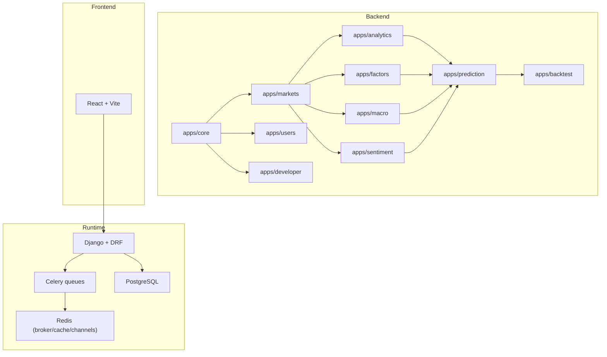
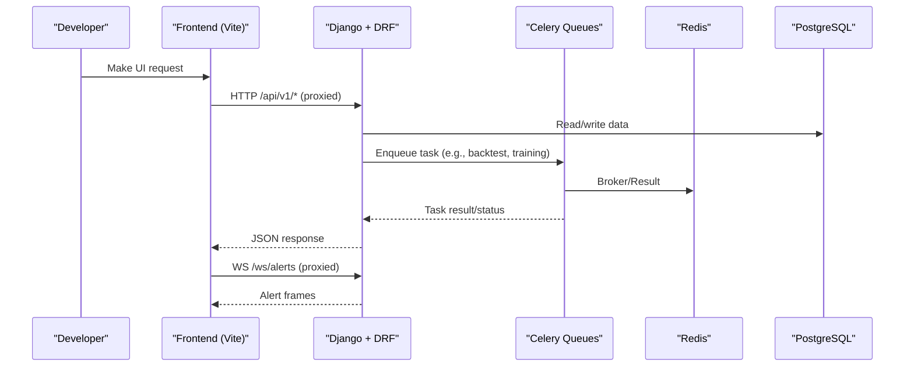
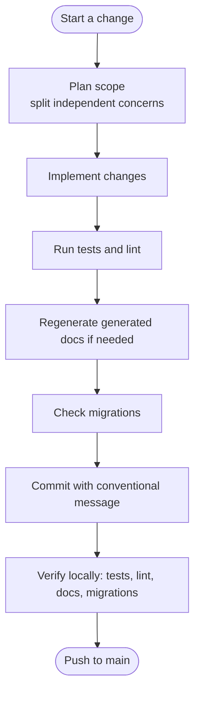
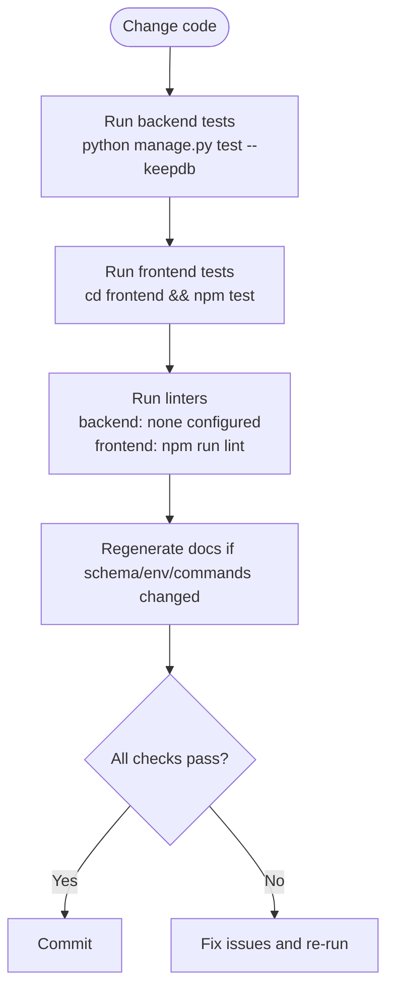
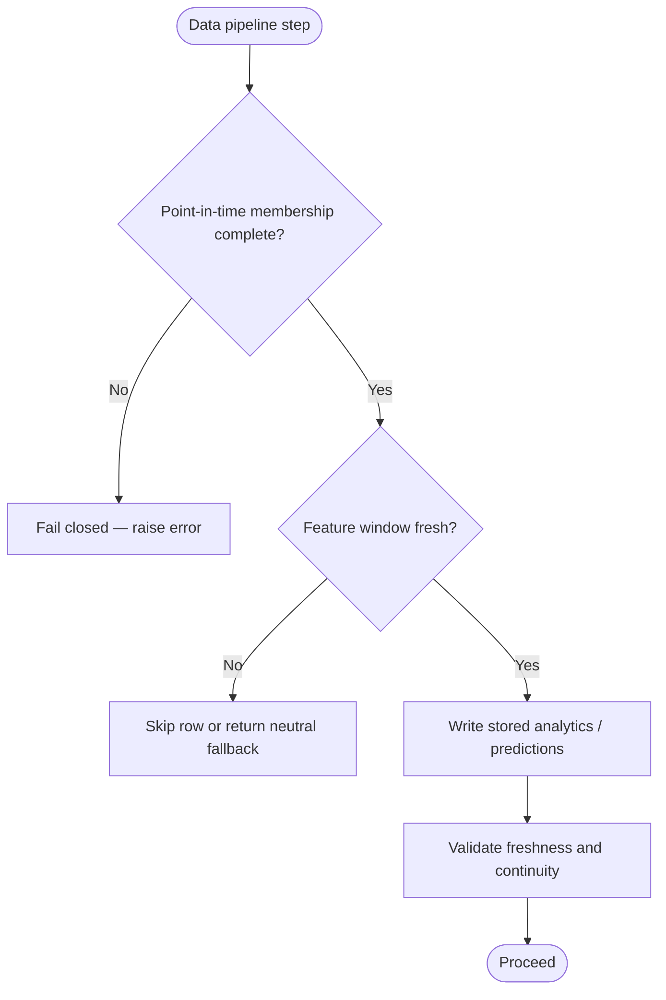
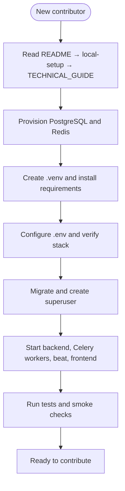
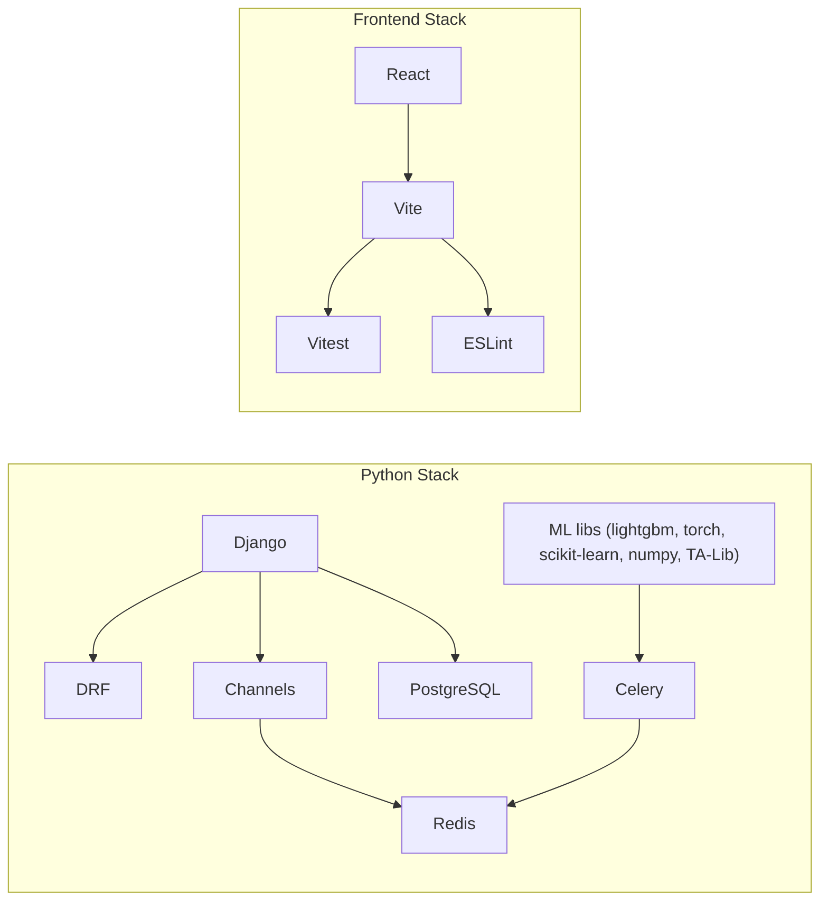

# Contributing Guide

<cite>
**Referenced Files in This Document**
- [CONTRIBUTING.md](file://CONTRIBUTING.md)
- [README.md](file://README.md)
- [BACKLOG.md](file://BACKLOG.md)
- [TECHNICAL_GUIDE.md](file://TECHNICAL_GUIDE.md)
- [docs/how-to/testing.md](file://docs/how-to/testing.md)
- [docs/how-to/local-setup.md](file://docs/how-to/local-setup.md)
- [frontend/README.md](file://frontend/README.md)
- [frontend/package.json](file://frontend/package.json)
- [frontend/eslint.config.js](file://frontend/eslint.config.js)
- [requirements/base.txt](file://requirements/base.txt)
- [config/settings/base.py](file://config/settings/base.py)
</cite>

## Table of Contents
1. Introduction
2. Project Structure
3. Core Components
4. Architecture Overview
5. Detailed Component Analysis
6. Dependency Analysis
7. Performance Considerations
8. Troubleshooting Guide
9. Conclusion
10. Appendices

## Introduction
This guide consolidates the development workflow, code standards, testing practices, documentation maintenance, release and versioning strategy, bug reporting, feature requests, onboarding, environment setup, debugging techniques, and community guidelines for FinanceAnalysis. It is intended for new and returning contributors who need a clear path to contribute safely and effectively.

FinanceAnalysis is a Django-based platform with a React frontend that ingests market, fundamental, macro, and news data; derives technical and factor features; runs prediction models; and backtests strategies against point-in-time benchmarks. The repository is private and proprietary.

**Section sources**
- [README.md:1-36](file://README.md#L1-L36)
- [README.md:187-190](file://README.md#L187-L190)

## Project Structure
The project is organized into ten Django apps plus a frontend, Celery workers, and shared configuration. Apps follow an upstream-to-derived ordering to keep data dependencies explicit.

**Diagram sources**
- [README.md:48-64](file://README.md#L48-L64)
- [config/settings/base.py:64-88](file://config/settings/base.py#L64-L88)
- [config/settings/base.py:174-200](file://config/settings/base.py#L174-L200)

**Section sources**
- [README.md:48-64](file://README.md#L48-L64)
- [config/settings/base.py:64-88](file://config/settings/base.py#L64-L88)

## Core Components
- Branching and commits: Work happens on main using Conventional Commits. There are no protected branches or PR templates; discipline replaces automated gates.
- Documentation ownership: Generated sheets must be regenerated after changes; authored docs are hand-written and reviewed.
- Code conventions: Python style by consistency; TypeScript uses ESLint recommended rules.
- Tests: Required for behavior changes; backend uses Django test runner, frontend uses Vitest.
- Migrations: One logical change per migration; check clean before committing.
- Model artifacts: Tracked in git; never overwrite existing artifact directories; regenerate model registry docs.
- Definition of done: Run tests, lint, generated docs check, migrations check, and ensure commit hygiene.

**Section sources**
- [CONTRIBUTING.md:12-93](file://CONTRIBUTING.md#L12-L93)
- [CONTRIBUTING.md:95-186](file://CONTRIBUTING.md#L95-L186)
- [CONTRIBUTING.md:188-233](file://CONTRIBUTING.md#L188-L233)
- [CONTRIBUTING.md:235-275](file://CONTRIBUTING.md#L235-L275)
- [CONTRIBUTING.md:277-316](file://CONTRIBUTING.md#L277-L316)

## Architecture Overview
The runtime stack includes Django serving REST API and admin, Channels over Redis for WebSocket alerts, PostgreSQL as primary store, and Celery Beat driving scheduled tasks across four queues. The React dashboard proxies API and WebSocket calls to the backend.

**Diagram sources**
- [README.md:107-114](file://README.md#L107-L114)
- [config/settings/base.py:174-200](file://config/settings/base.py#L174-L200)
- [frontend/README.md:39-64](file://frontend/README.md#L39-L64)

## Detailed Component Analysis

### Development Workflow and Branch Management
- Single branch workflow: All work is committed to main. There is no protected-branch policy or PR template.
- Commit discipline: Use Conventional Commits with imperative summaries, explain why in the body, split unrelated changes into separate commits, and describe the staged diff rather than your session.
- Prohibited items: Do not commit .env, reports/, downloaded installers, or scratch notes.

**Section sources**
- [CONTRIBUTING.md:12-93](file://CONTRIBUTING.md#L12-L93)
- [CONTRIBUTING.md:235-316](file://CONTRIBUTING.md#L235-L316)

### Code Standards and Formatting
- Python: No formatter/linter configured; follow surrounding code style (4-space indent, single quotes in app code, module-level docstrings explaining purpose, Decimal for money/prices/probabilities/ratios, explicit choices, point-in-time lookups, indexes where appropriate).
- TypeScript/JavaScript: ESLint recommended rules via typescript-eslint and React plugins; run `npm run lint`.
- Frontend scripts invoke binaries directly to avoid Windows path issues; use npm scripts, not npx.

**Section sources**
- [CONTRIBUTING.md:188-233](file://CONTRIBUTING.md#L188-L233)
- [frontend/eslint.config.js:1-24](file://frontend/eslint.config.js#L1-L24)
- [frontend/README.md:22-35](file://frontend/README.md#L22-L35)
- [frontend/package.json:6-11](file://frontend/package.json#L6-L11)

### Testing Guidelines
- Backend: Use Django’s test runner with `--keepdb` to avoid interactive prompts and speed up repeated runs. Organize tests by area classes and patch collaborators at import sites.
- Frontend: Use Vitest with jsdom; tests mock the API layer and do not require a running backend.
- Known non-hermetic tests are documented; do not add to that list without justification.

**Section sources**
- [docs/how-to/testing.md:1-43](file://docs/how-to/testing.md#L1-L43)
- [docs/how-to/testing.md:59-127](file://docs/how-to/testing.md#L59-L127)
- [docs/how-to/testing.md:129-147](file://docs/how-to/testing.md#L129-L147)
- [docs/how-to/testing.md:303-342](file://docs/how-to/testing.md#L303-L342)

### Documentation Maintenance
- Generated sheets: Must be regenerated after any change affecting metrics, commands, Celery routes, env variables, or model registry. Regenerate and review diffs; verify with `--check`.
- Authored docs: README is orientation only; TECHNICAL_GUIDE explains contracts and rationale; how-to guides document procedures; backlog tracks unfinished or broken items; changelog records shipped releases.
- Where facts go: Numbers from the database belong in generated sheets; formulas and thresholds in TECHNICAL_GUIDE; procedures in how-to; failures and remedies in runbooks.

**Section sources**
- [CONTRIBUTING.md:95-186](file://CONTRIBUTING.md#L95-L186)
- [README.md:13-44](file://README.md#L13-L44)
- [TECHNICAL_GUIDE.md:1-21](file://TECHNICAL_GUIDE.md#L1-L21)

### Backward Compatibility and Data Integrity
- Point-in-time universe contract governs all cross-sectional calculations; missing coverage fails closed rather than silently widening.
- Freshness policy refuses stale rows; exact-window metrics require aligned anchors and zero gap tolerance.
- RS_SCORE requires exact 20-trading-day windows; historical reruns delete and rebuild affected slices.
- Stored analytics serve both inspection and runtime feature paths; backfill completeness matters.

**Section sources**
- [TECHNICAL_GUIDE.md:25-72](file://TECHNICAL_GUIDE.md#L25-L72)
- [TECHNICAL_GUIDE.md:117-224](file://TECHNICAL_GUIDE.md#L117-L224)

### Release Process, Versioning, and Changelog
- Releases are recorded in CHANGELOG with Objective, Implemented Features, Current Notes, Key Files, and Focused Coverage Added.
- Draft audits remain in BACKLOG until they are conclusions; do not commit incomplete version sections.
- Version tags for model artifacts follow horizon and training date; retraining against the same cutoff requires a distinct tag to preserve rollback and auditability.

**Section sources**
- [CONTRIBUTING.md:161-185](file://CONTRIBUTING.md#L161-L185)
- [TECHNICAL_GUIDE.md:574-591](file://TECHNICAL_GUIDE.md#L574-L591)

### Bug Reporting, Feature Requests, and Backlog
- Open defects and deferred ideas live in BACKLOG; move items to CHANGELOG when resolved.
- Non-hermetic tests and known issues are documented there; investigate root causes before fixing symptoms.
- For infrastructure gaps (no CI, no production deployment), track in BACKLOG and consider minimal pipelines to catch drift.

**Section sources**
- [BACKLOG.md:1-10](file://BACKLOG.md#L1-L10)
- [BACKLOG.md:114-165](file://BACKLOG.md#L114-L165)
- [BACKLOG.md:358-369](file://BACKLOG.md#L358-L369)

### Onboarding and Environment Setup
- New contributors should read README, local setup, and TECHNICAL_GUIDE in order; then consult generated sheets and BACKLOG.
- Local stack requires Python, PostgreSQL, Redis, Node.js, TA-Lib, and Git; provision services outside the repo.
- Use provided scripts to verify connectivity, migrate, create superuser, and start backend, Celery workers, beat, and frontend.

**Section sources**
- [CONTRIBUTING.md:319-334](file://CONTRIBUTING.md#L319-L334)
- [docs/how-to/local-setup.md:10-23](file://docs/how-to/local-setup.md#L10-L23)
- [docs/how-to/local-setup.md:27-133](file://docs/how-to/local-setup.md#L27-L133)
- [docs/how-to/local-setup.md:190-278](file://docs/how-to/local-setup.md#L190-L278)
- [docs/how-to/local-setup.md:297-331](file://docs/how-to/local-setup.md#L297-L331)

### Debugging Techniques
- Use `verify_local_stack.sh/.ps1` to probe PostgreSQL and Redis through Python drivers; credentials are redacted in output.
- For test failures, categorize by exception type first; many failures share one root cause (e.g., Redis credential).
- When adding management commands or Celery tasks, ensure arguments have help text and time limits are set appropriately; generated docs will reflect them.
- Frontend dev server proxies `/api` and `/ws`; ensure backend is reachable on 127.0.0.1:8000.

**Section sources**
- [docs/how-to/local-setup.md:59-133](file://docs/how-to/local-setup.md#L59-L133)
- [docs/how-to/testing.md:188-281](file://docs/how-to/testing.md#L188-L281)
- [CONTRIBUTING.md:211-232](file://CONTRIBUTING.md#L211-L232)
- [frontend/README.md:39-64](file://frontend/README.md#L39-L64)

### Intellectual Property, Licensing, and Community Guidelines
- The project is private and proprietary; all rights reserved. Contributions should respect licensing and confidentiality.
- Community collaboration follows the repository’s internal conventions: disciplined commits, generated documentation, and clear separation between generated and authored content.

**Section sources**
- [README.md:187-190](file://README.md#L187-L190)
- [CONTRIBUTING.md:1-16](file://CONTRIBUTING.md#L1-L16)

## Dependency Analysis
Key runtime and tooling dependencies include Django, DRF, Channels, Celery, Redis, PostgreSQL, and ML libraries. Frontend uses React, Vite, Vitest, and ESLint.

**Diagram sources**
- [requirements/base.txt:1-23](file://requirements/base.txt#L1-L23)
- [frontend/package.json:13-38](file://frontend/package.json#L13-L38)
- [config/settings/base.py:64-88](file://config/settings/base.py#L64-L88)
- [config/settings/base.py:174-200](file://config/settings/base.py#L174-L200)

**Section sources**
- [requirements/base.txt:1-23](file://requirements/base.txt#L1-L23)
- [frontend/package.json:13-38](file://frontend/package.json#L13-L38)
- [config/settings/base.py:64-88](file://config/settings/base.py#L64-L88)
- [config/settings/base.py:174-200](file://config/settings/base.py#L174-L200)

## Performance Considerations
- Celery workers consume only the queues they are told to; ensure dedicated workers for backtest and training queues.
- On Windows, Celery defaults to solo pool; parallelism comes from multiple workers with native thread caps.
- Long backtests chunk by trading days and resume via runtime state; adjust time limits per task as needed.
- Avoid silent staleness; freshness guards prevent degraded performance from stale data consumption.

**Section sources**
- [docs/how-to/local-setup.md:334-408](file://docs/how-to/local-setup.md#L334-L408)
- [TECHNICAL_GUIDE.md:117-224](file://TECHNICAL_GUIDE.md#L117-L224)

## Troubleshooting Guide
Common issues and resolutions:
- Redis authentication errors: Verify URL shape and ACL user; use verification scripts; correct REDIS_URL, CELERY_BROKER_URL, and CELERY_RESULT_BACKEND.
- Test discovery failures: Ensure apps/__init__.py exists; bare test command now discovers all tests.
- Missing local fixtures: Some tests depend on gitignored files; build fixtures in temp directories for reproducibility.
- Stale migrations: Resolve pending migrations so makemigrations --check passes.

**Section sources**
- [docs/how-to/testing.md:150-185](file://docs/how-to/testing.md#L150-L185)
- [docs/how-to/testing.md:218-281](file://docs/how-to/testing.md#L218-L281)
- [BACKLOG.md:197-217](file://BACKLOG.md#L197-L217)

## Conclusion
Contributing to FinanceAnalysis centers on disciplined commits, rigorous testing, generated documentation, and careful handling of point-in-time data and freshness. Follow the defined workflows to maintain backward compatibility, ensure reliable builds, and keep the repository a trustworthy source of truth for both humans and machines.

## Appendices

### Quick Commands Reference
- Backend tests: `python manage.py test --keepdb`
- Frontend tests: `cd frontend && npm test`
- Frontend lint: `cd frontend && npm run lint`
- Generate docs: `python manage.py export_documentation_facts`
- Check docs drift: `python manage.py export_documentation_facts --check`
- Check migrations: `python manage.py makemigrations --check`

**Section sources**
- [docs/how-to/testing.md:327-342](file://docs/how-to/testing.md#L327-L342)
- [CONTRIBUTING.md:111-129](file://CONTRIBUTING.md#L111-L129)
- [CONTRIBUTING.md:263-275](file://CONTRIBUTING.md#L263-L275)