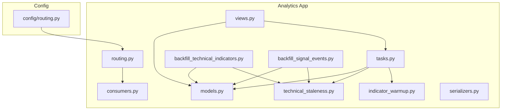
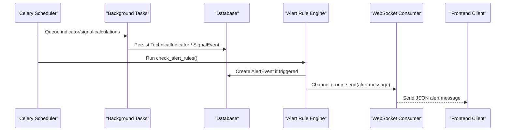
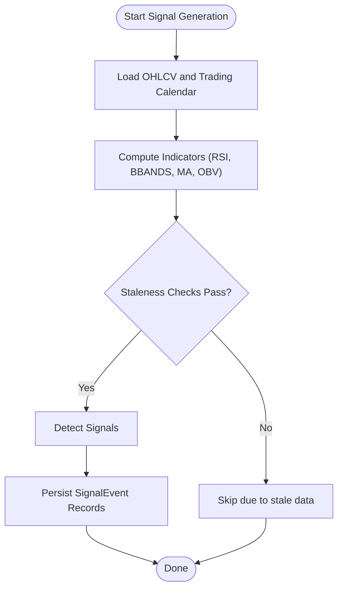
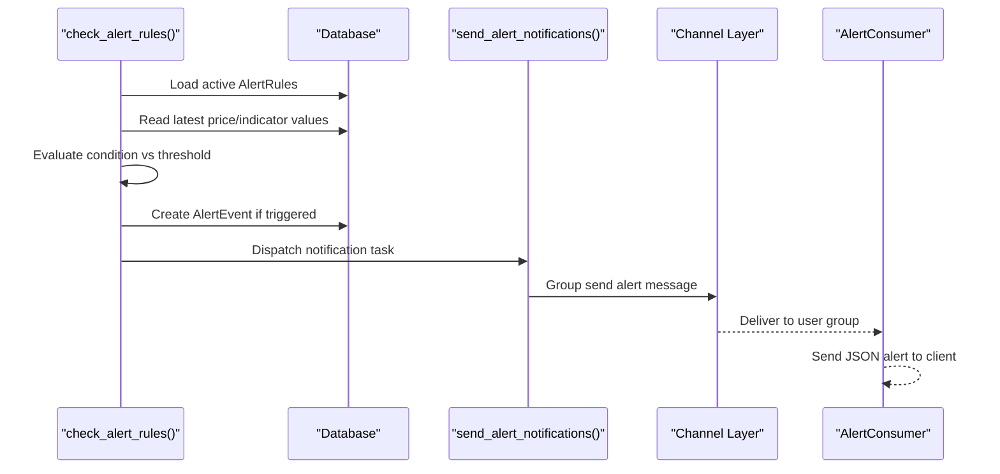
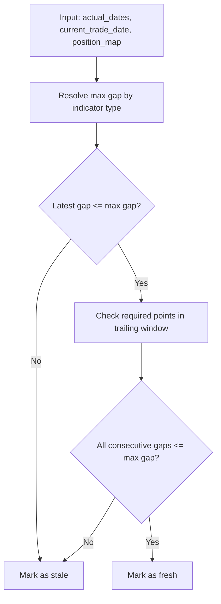
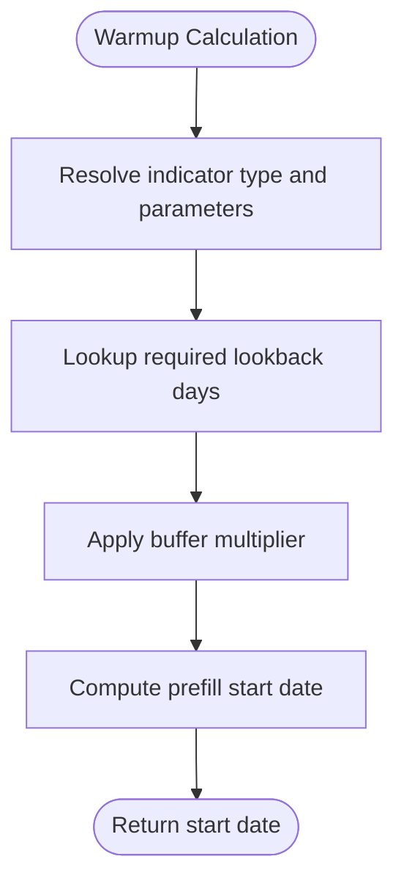
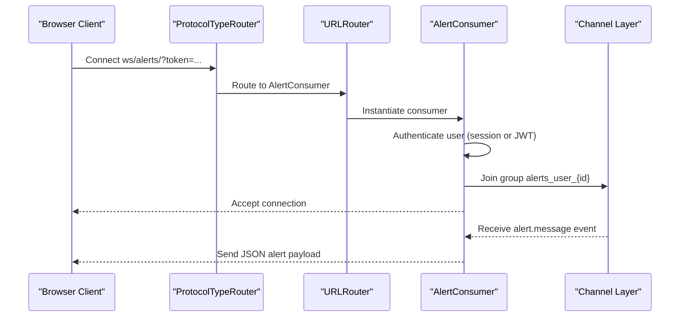
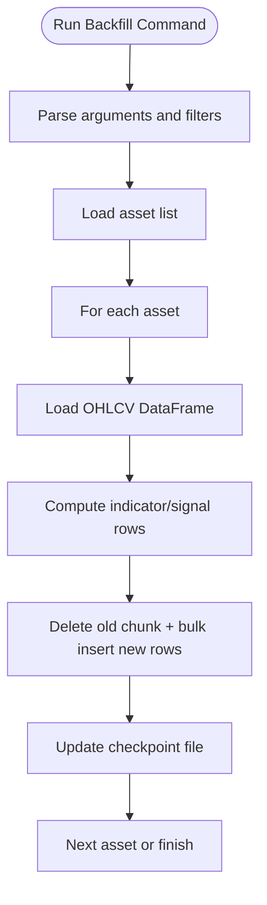
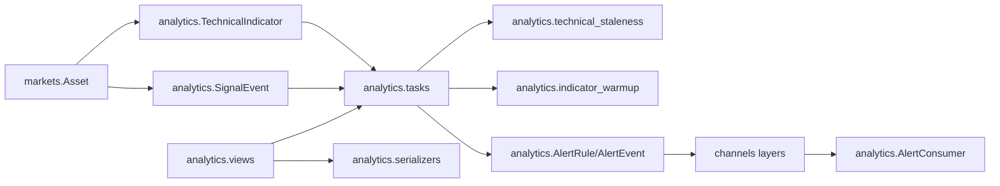

# Analytics Application

<cite>
**Referenced Files in This Document**
- [models.py](file://apps/analytics/models.py)
- [consumers.py](file://apps/analytics/consumers.py)
- [routing.py](file://apps/analytics/routing.py)
- [technical_staleness.py](file://apps/analytics/technical_staleness.py)
- [indicator_warmup.py](file://apps/analytics/indicator_warmup.py)
- [tasks.py](file://apps/analytics/tasks.py)
- [views.py](file://apps/analytics/views.py)
- [serializers.py](file://apps/analytics/serializers.py)
- [backfill_technical_indicators.py](file://apps/analytics/management/commands/backfill_technical_indicators.py)
- [backfill_signal_events.py](file://apps/analytics/management/commands/backfill_signal_events.py)
- [config_routing.py](file://config/routing.py)
</cite>

## Table of Contents
1. [Introduction](#introduction)
2. [Project Structure](#project-structure)
3. [Core Components](#core-components)
4. [Architecture Overview](#architecture-overview)
5. [Detailed Component Analysis](#detailed-component-analysis)
6. [Dependency Analysis](#dependency-analysis)
7. [Performance Considerations](#performance-considerations)
8. [Troubleshooting Guide](#troubleshooting-guide)
9. [Conclusion](#conclusion)
10. [Appendices](#appendices)

## Introduction
This document explains the Analytics application that computes technical indicators, generates trading signals, and delivers real-time alerts. It covers:
- The TechnicalIndicator model for storing computed values such as RSI, MACD, Bollinger Bands, and moving averages with precision control.
- The signal event system that identifies opportunities from indicator combinations and threshold crossings.
- The alert rule engine that monitors conditions and triggers notifications via email, SMS, and WebSocket streams.
- Staleness policies that determine when indicators need recalculation based on data freshness and time-based rules.
- The indicator warmup system that ensures sufficient history before computing indicators.
- Real-time WebSocket consumer architecture and routing configuration for live alert delivery.
- Management commands for backfilling historical indicators and signals, and monitoring staleness across datasets.

## Project Structure
The analytics app is organized around models, background tasks, management commands, a WebSocket consumer, and staleness/warmup utilities.

**Diagram sources**
- [config_routing.py:1-14](file://config/routing.py#L1-L14)
- [routing.py:1-9](file://apps/analytics/routing.py#L1-L9)
- [consumers.py:1-59](file://apps/analytics/consumers.py#L1-L59)
- [tasks.py:1-1317](file://apps/analytics/tasks.py#L1-L1317)
- [models.py:1-255](file://apps/analytics/models.py#L1-L255)
- [technical_staleness.py:1-190](file://apps/analytics/technical_staleness.py#L1-L190)
- [indicator_warmup.py:1-143](file://apps/analytics/indicator_warmup.py#L1-L143)
- [views.py:1-934](file://apps/analytics/views.py#L1-L934)
- [serializers.py:1-150](file://apps/analytics/serializers.py#L1-L150)
- [backfill_technical_indicators.py:1-646](file://apps/analytics/management/commands/backfill_technical_indicators.py#L1-L646)
- [backfill_signal_events.py:1-751](file://apps/analytics/management/commands/backfill_signal_events.py#L1-L751)

**Section sources**
- [models.py:1-255](file://apps/analytics/models.py#L1-L255)
- [tasks.py:1-1317](file://apps/analytics/tasks.py#L1-L1317)
- [consumers.py:1-59](file://apps/analytics/consumers.py#L1-L59)
- [routing.py:1-9](file://apps/analytics/routing.py#L1-L9)
- [technical_staleness.py:1-190](file://apps/analytics/technical_staleness.py#L1-L190)
- [indicator_warmup.py:1-143](file://apps/analytics/indicator_warmup.py#L1-L143)
- [views.py:1-934](file://apps/analytics/views.py#L1-L934)
- [serializers.py:1-150](file://apps/analytics/serializers.py#L1-L150)
- [backfill_technical_indicators.py:1-646](file://apps/analytics/management/commands/backfill_technical_indicators.py#L1-L646)
- [backfill_signal_events.py:1-751](file://apps/analytics/management/commands/backfill_signal_events.py#L1-L751)
- [config_routing.py:1-14](file://config/routing.py#L1-L14)

## Core Components
- TechnicalIndicator stores per-asset, per-timestamp indicator values with parameters and high-precision decimals.
- SignalEvent records derived trading signals (e.g., golden/death crosses, Bollinger Band breakouts, momentum shifts).
- AlertRule defines user-owned thresholds over price or indicators; AlertEvent logs each trigger and dispatch status.
- Background tasks compute indicators and signals using TA-Lib and persist results.
- Staleness utilities enforce freshness windows and required lookbacks to avoid stale computations.
- Warmup utilities define minimum history requirements per indicator type.
- WebSocket consumer streams alert events to authenticated users.
- Views expose APIs for querying indicators, screeners, and triggering recalculations.

**Section sources**
- [models.py:8-46](file://apps/analytics/models.py#L8-L46)
- [models.py:198-255](file://apps/analytics/models.py#L198-L255)
- [models.py:87-196](file://apps/analytics/models.py#L87-L196)
- [tasks.py:67-615](file://apps/analytics/tasks.py#L67-L615)
- [technical_staleness.py:9-190](file://apps/analytics/technical_staleness.py#L9-L190)
- [indicator_warmup.py:4-143](file://apps/analytics/indicator_warmup.py#L4-L143)
- [consumers.py:18-59](file://apps/analytics/consumers.py#L18-L59)
- [views.py:424-735](file://apps/analytics/views.py#L424-L735)

## Architecture Overview
The system follows a pipeline:
- OHLCV data feeds into background tasks that compute indicators and signals.
- Indicators are stored in TechnicalIndicator; signals are stored in SignalEvent.
- An alert rule engine periodically evaluates active rules against latest prices/indicators and creates AlertEvent records.
- Notifications are dispatched via email, SMS webhook, or WebSocket channel layer groups.
- A WebSocket consumer authenticates clients and broadcasts alert messages to user-specific groups.

**Diagram sources**
- [tasks.py:1146-1159](file://apps/analytics/tasks.py#L1146-L1159)
- [tasks.py:1283-1317](file://apps/analytics/tasks.py#L1283-L1317)
- [consumers.py:18-59](file://apps/analytics/consumers.py#L18-L59)
- [models.py:87-196](file://apps/analytics/models.py#L87-L196)
- [models.py:198-255](file://apps/analytics/models.py#L198-L255)

## Detailed Component Analysis

### TechnicalIndicator Model
TechnicalIndicator captures:
- Asset association and timestamp.
- Indicator type (e.g., RSI, MACD, BBANDS, SMA, EMA).
- High-precision value field with decimal places for accuracy.
- Parameters JSON for variant configurations (e.g., timeperiods, deviations).
- Indexes and unique constraints to support efficient queries and deduplication by asset/timestamp/type/parameters.

Precision control is enforced through Decimal fields and quantization during backfills.

**Section sources**
- [models.py:8-46](file://apps/analytics/models.py#L8-L46)
- [backfill_technical_indicators.py:78-90](file://apps/analytics/management/commands/backfill_technical_indicators.py#L78-L90)

### Signal Event System
SignalEvent stores derived trading signals including:
- Moving average crossovers and alignments.
- Bollinger Band squeeze and breakout signals.
- Volume spikes and volume-price divergence.
- Momentum thresholds and oversold combination patterns.

Signals are generated by both batch backfill commands and background tasks, ensuring idempotent persistence.

**Diagram sources**
- [backfill_signal_events.py:372-751](file://apps/analytics/management/commands/backfill_signal_events.py#L372-L751)
- [tasks.py:740-1159](file://apps/analytics/tasks.py#L740-L1159)
- [technical_staleness.py:122-190](file://apps/analytics/technical_staleness.py#L122-L190)

**Section sources**
- [models.py:198-255](file://apps/analytics/models.py#L198-L255)
- [backfill_signal_events.py:25-40](file://apps/analytics/management/commands/backfill_signal_events.py#L25-L40)
- [backfill_signal_events.py:372-751](file://apps/analytics/management/commands/backfill_signal_events.py#L372-L751)
- [tasks.py:740-1159](file://apps/analytics/tasks.py#L740-L1159)

### Alert Rule Engine
AlertRule supports:
- Conditions on price above/below or indicator above/below thresholds.
- Cooldown periods to limit repeated alerts.
- Notification channels: email, SMS webhook, and WebSocket.

AlertEvent records each trigger with status tracking and metadata. The engine runs periodically to evaluate active rules and dispatch notifications.

**Diagram sources**
- [tasks.py:1186-1317](file://apps/analytics/tasks.py#L1186-L1317)
- [consumers.py:18-59](file://apps/analytics/consumers.py#L18-L59)
- [models.py:87-196](file://apps/analytics/models.py#L87-L196)

**Section sources**
- [models.py:87-196](file://apps/analytics/models.py#L87-L196)
- [tasks.py:1186-1317](file://apps/analytics/tasks.py#L1186-L1317)

### Staleness Policies
Staleness logic enforces:
- Maximum allowed gaps between actual data dates and current trade date per indicator type.
- Required trailing window points for reliable computation.
- Exact trading window availability checks for multi-day comparisons.

Policies ensure indicators are only used when sufficiently fresh and complete.

**Diagram sources**
- [technical_staleness.py:9-190](file://apps/analytics/technical_staleness.py#L9-L190)

**Section sources**
- [technical_staleness.py:9-190](file://apps/analytics/technical_staleness.py#L9-L190)

### Indicator Warmup System
Warmup defines minimum lookback trading days per indicator type and calculates prefill start dates to ensure stable initial computations. It handles parameterized variants (e.g., EMA/SMA timeperiods, MACD fast/slow/signal periods, STOCH periods).

**Diagram sources**
- [indicator_warmup.py:4-143](file://apps/analytics/indicator_warmup.py#L4-L143)

**Section sources**
- [indicator_warmup.py:4-143](file://apps/analytics/indicator_warmup.py#L4-L143)

### Real-Time WebSocket Consumer and Routing
The WebSocket consumer authenticates users via session or JWT token, joins a user-scoped group, and sends alert messages. Routing wires the WebSocket endpoint and integrates authentication middleware.

**Diagram sources**
- [config_routing.py:1-14](file://config/routing.py#L1-L14)
- [routing.py:1-9](file://apps/analytics/routing.py#L1-L9)
- [consumers.py:18-59](file://apps/analytics/consumers.py#L18-L59)

**Section sources**
- [consumers.py:18-59](file://apps/analytics/consumers.py#L18-L59)
- [routing.py:1-9](file://apps/analytics/routing.py#L1-L9)
- [config_routing.py:1-14](file://config/routing.py#L1-L14)

### Management Commands: Backfill Indicators and Signals
Backfill commands process assets in chunks, compute indicators/signals using TA-Lib, and persist results with robust retry and checkpointing. They support filtering by symbols, limiting assets, and resuming interrupted runs.

Key capabilities:
- Chunked delete/insert transactions for performance and safety.
- Checkpoint files to resume partial runs.
- Database operation retries with exponential backoff.
- Precise decimal quantization for indicator values.

**Diagram sources**
- [backfill_technical_indicators.py:92-646](file://apps/analytics/management/commands/backfill_technical_indicators.py#L92-L646)
- [backfill_signal_events.py:74-751](file://apps/analytics/management/commands/backfill_signal_events.py#L74-L751)

**Section sources**
- [backfill_technical_indicators.py:92-646](file://apps/analytics/management/commands/backfill_technical_indicators.py#L92-L646)
- [backfill_signal_events.py:74-751](file://apps/analytics/management/commands/backfill_signal_events.py#L74-L751)

## Dependency Analysis
- Models depend on Asset from markets for relationships.
- Tasks depend on TA-Lib for indicator computation and on staleness/warmup utilities for freshness checks.
- Consumers depend on Channels and Django REST JWT for authentication and messaging.
- Views integrate with serializers and tasks to expose APIs and trigger computations.
- Routing wires WebSocket endpoints through AuthMiddlewareStack.

**Diagram sources**
- [models.py:8-46](file://apps/analytics/models.py#L8-L46)
- [models.py:198-255](file://apps/analytics/models.py#L198-L255)
- [tasks.py:1-1317](file://apps/analytics/tasks.py#L1-L1317)
- [technical_staleness.py:1-190](file://apps/analytics/technical_staleness.py#L1-L190)
- [indicator_warmup.py:1-143](file://apps/analytics/indicator_warmup.py#L1-L143)
- [consumers.py:1-59](file://apps/analytics/consumers.py#L1-L59)
- [views.py:1-934](file://apps/analytics/views.py#L1-L934)
- [serializers.py:1-150](file://apps/analytics/serializers.py#L1-L150)

**Section sources**
- [models.py:8-46](file://apps/analytics/models.py#L8-L46)
- [models.py:198-255](file://apps/analytics/models.py#L198-L255)
- [tasks.py:1-1317](file://apps/analytics/tasks.py#L1-L1317)
- [technical_staleness.py:1-190](file://apps/analytics/technical_staleness.py#L1-L190)
- [indicator_warmup.py:1-143](file://apps/analytics/indicator_warmup.py#L1-L143)
- [consumers.py:1-59](file://apps/analytics/consumers.py#L1-L59)
- [views.py:1-934](file://apps/analytics/views.py#L1-L934)
- [serializers.py:1-150](file://apps/analytics/serializers.py#L1-L150)

## Performance Considerations
- Use chunked processing in backfill commands to manage memory and transaction size.
- Bulk create/delete operations reduce database overhead.
- Staleness checks prevent unnecessary recomputation on stale or incomplete data.
- Warmup lookbacks ensure stable initial values without excessive history.
- Caching in views reduces repeated heavy queries for dashboards and lists.
- Channel layer group messaging scales alert delivery to multiple clients efficiently.

[No sources needed since this section provides general guidance]

## Troubleshooting Guide
Common issues and resolutions:
- Stale indicators: Verify trading calendar coverage and ensure OHLCV data is up to date; staleness functions will skip computations if gaps exceed thresholds.
- Missing signals: Confirm exact trading window availability and required lookback points; some signals require precise multi-day continuity.
- WebSocket not receiving alerts: Ensure user authentication succeeds and group membership is established; verify channel layer configuration and group names.
- Backfill interruptions: Use checkpoint files to resume; validate window and options match previous runs.
- Alert cooldown: Rules may be suppressed by cooldown_minutes; adjust cooldown or wait until next evaluation cycle.

**Section sources**
- [technical_staleness.py:122-190](file://apps/analytics/technical_staleness.py#L122-L190)
- [backfill_technical_indicators.py:264-393](file://apps/analytics/management/commands/backfill_technical_indicators.py#L264-L393)
- [backfill_signal_events.py:241-355](file://apps/analytics/management/commands/backfill_signal_events.py#L241-L355)
- [consumers.py:23-59](file://apps/analytics/consumers.py#L23-L59)
- [tasks.py:1179-1317](file://apps/analytics/tasks.py#L1179-L1317)

## Conclusion
The Analytics application provides a robust pipeline for computing technical indicators, generating actionable trading signals, and delivering timely alerts. Staleness and warmup mechanisms ensure reliability, while background tasks and WebSocket streaming enable scalable real-time operations. Management commands facilitate comprehensive backfills and maintenance workflows.

[No sources needed since this section summarizes without analyzing specific files]

## Appendices

### API and Serialization
- TechnicalIndicatorViewSet exposes filtered queries and specialized actions (top/bottom RSI, trending strong, overbought/oversold stochastics, Fibonacci levels, recalculate).
- Serializers provide structured responses for indicators, screeners, alerts, and signals.

**Section sources**
- [views.py:424-735](file://apps/analytics/views.py#L424-L735)
- [serializers.py:1-150](file://apps/analytics/serializers.py#L1-L150)