# Backtest Application

<cite>
**Referenced Files in This Document**
- [models.py](file://apps/backtest/models.py)
- [tasks.py](file://apps/backtest/tasks.py)
- [comparison.py](file://apps/backtest/comparison.py)
- [task_health.py](file://apps/backtest/task_health.py)
- [views.py](file://apps/backtest/views.py)
- [serializers.py](file://apps/backtest/serializers.py)
- [run_core_backtest_matrix.py](file://apps/backtest/management/commands/run_core_backtest_matrix.py)
- [run_validation_backtests.py](file://apps/backtest/management/commands/run_validation_backtests.py)
- [export_backtest_runs.py](file://apps/backtest/management/commands/export_backtest_runs.py)
- [run_reference_benchmark_suite.py](file://apps/backtest/management/commands/run_reference_benchmark_suite.py)
- [odds.py](file://apps/prediction/odds.py)
- [TECHNICAL_GUIDE.md](file://TECHNICAL_GUIDE.md)
</cite>

## Table of Contents
1. Introduction
2. Project Structure
3. Core Components
4. Architecture Overview
5. Detailed Component Analysis
6. Dependency Analysis
7. Performance Considerations
8. Troubleshooting Guide
9. Conclusion
10. Appendices

## Introduction
This document explains the Backtest application that validates trading strategies against historical data. It covers the persistence model for simulation results, the execution engine that simulates trades with realistic costs and exits, performance metrics calculation, benchmark comparison, task health monitoring, management commands for running matrices and validation suites, and integration with prediction models and the API.

## Project Structure
The backtest feature is implemented as a Django app under apps/backtest with:
- Data models for runs and trades
- A Celery-based execution engine
- Comparison utilities for benchmarks
- Task health detection for long-running chunked jobs
- REST API views and serializers
- Management commands to orchestrate matrix runs, validation sweeps, and exports

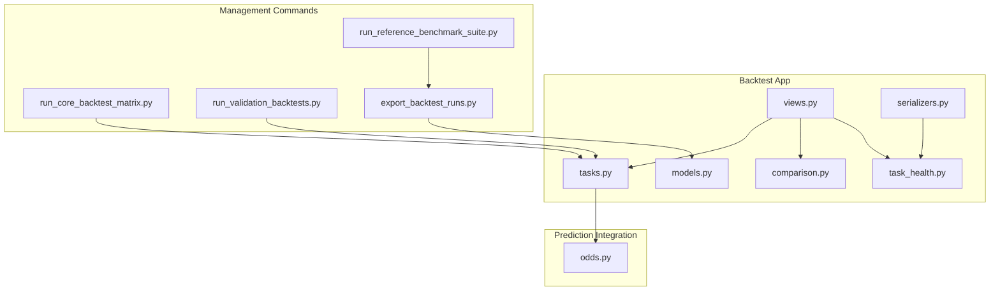

**Diagram sources**
- [models.py:24-168](file://apps/backtest/models.py#L24-L168)
- [tasks.py:2299-2578](file://apps/backtest/tasks.py#L2299-L2578)
- [comparison.py:177-245](file://apps/backtest/comparison.py#L177-L245)
- [task_health.py:45-95](file://apps/backtest/task_health.py#L45-L95)
- [views.py:75-208](file://apps/backtest/views.py#L75-L208)
- [serializers.py:48-299](file://apps/backtest/serializers.py#L48-L299)
- [run_core_backtest_matrix.py:103-461](file://apps/backtest/management/commands/run_core_backtest_matrix.py#L103-L461)
- [run_validation_backtests.py:37-144](file://apps/backtest/management/commands/run_validation_backtests.py#L37-L144)
- [export_backtest_runs.py:132-193](file://apps/backtest/management/commands/export_backtest_runs.py#L132-L193)
- [run_reference_benchmark_suite.py:31-124](file://apps/backtest/management/commands/run_reference_benchmark_suite.py#L31-L124)
- [odds.py:138-158](file://apps/prediction/odds.py#L138-L158)

**Section sources**
- [models.py:24-168](file://apps/backtest/models.py#L24-L168)
- [tasks.py:1-37](file://apps/backtest/tasks.py#L1-L37)
- [views.py:1-18](file://apps/backtest/views.py#L1-L18)

## Core Components
- BacktestRun stores run configuration, lifecycle state, and summary metrics.
- BacktestTrade records each leg (buy/sell) with fees, slippage, PnL, and signal payload.
- Execution engine processes daily bars, selects candidates, opens/closes positions, and computes metrics.
- Exit strategy supports scheduled exits and optional stop-loss/target-price checks.
- Comparison module builds normalized equity curves vs CSI 300 and CSI A500.
- Task health detects stale or orphaned tasks for chunked runs.
- API exposes run lifecycle control, trade ledger, and comparison curves.
- Management commands create and run core matrices, rolling validations, and export results.

**Section sources**
- [models.py:24-168](file://apps/backtest/models.py#L24-L168)
- [tasks.py:2299-2578](file://apps/backtest/tasks.py#L2299-L2578)
- [comparison.py:177-245](file://apps/backtest/comparison.py#L177-L245)
- [task_health.py:45-95](file://apps/backtest/task_health.py#L45-L95)
- [views.py:75-208](file://apps/backtest/views.py#L75-L208)
- [serializers.py:48-299](file://apps/backtest/serializers.py#L48-L299)
- [run_core_backtest_matrix.py:103-461](file://apps/backtest/management/commands/run_core_backtest_matrix.py#L103-L461)
- [run_validation_backtests.py:37-144](file://apps/backtest/management/commands/run_validation_backtests.py#L37-L144)
- [export_backtest_runs.py:132-193](file://apps/backtest/management/commands/export_backtest_runs.py#L132-L193)
- [run_reference_benchmark_suite.py:31-124](file://apps/backtest/management/commands/run_reference_benchmark_suite.py#L31-L124)

## Architecture Overview
The system uses an event-driven, chunked execution model:
- API creates BacktestRun and enqueues a Celery task.
- The task executes in chunks, persisting runtime state to resume after interruptions.
- Each day: close positions (with exit logic), optionally open new positions from ranked candidates, compute portfolio equity.
- At completion, compute metrics and write report; comparison module normalizes curves against benchmarks.
- Task health monitors detect stale tasks and help recover or pause runs.

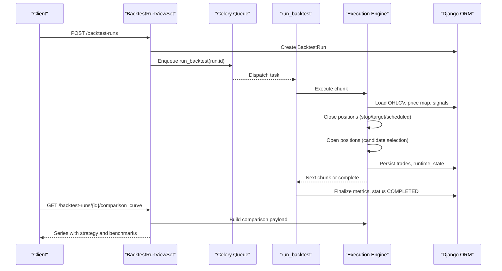

**Diagram sources**
- [views.py:90-101](file://apps/backtest/views.py#L90-L101)
- [tasks.py:2299-2578](file://apps/backtest/tasks.py#L2299-L2578)
- [comparison.py:177-245](file://apps/backtest/comparison.py#L177-L245)

## Detailed Component Analysis

### BacktestRun and BacktestTrade Models
- BacktestRun tracks lifecycle (PENDING, RUNNING, PAUSED, COMPLETED, FAILED), user attribution, date range, capital, and key metrics (total_return, annualized_return, max_drawdown, sharpe_ratio, win_rate). Parameters and report are JSON fields to keep schema stable while strategy surface evolves.
- BacktestTrade records legs with asset, side, quantity, price, fee, slippage, amount, pnl, and signal_payload capturing why an entry occurred.

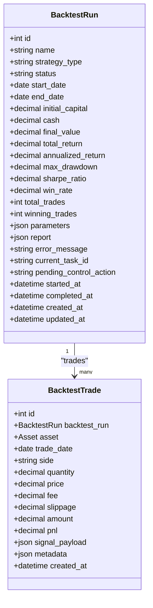

**Diagram sources**
- [models.py:24-168](file://apps/backtest/models.py#L24-L168)

**Section sources**
- [models.py:24-168](file://apps/backtest/models.py#L24-L168)

### Strategy Execution Engine
Key behaviors:
- Candidates are generated at runtime from active artifacts/features per trading date.
- Each session closes before opening on the same date to free capital and slots.
- Long runs are chunked by configurable trading days and resume via runtime_state.
- Exits prefer conservative outcomes when only daily close is available.
- Fees use CN A-share schedule by default (asymmetric stamp duty on sells), with legacy flat fee mode supported.

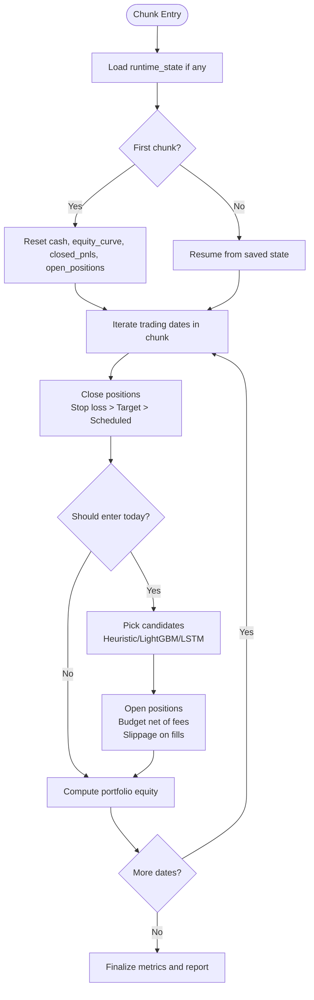

**Diagram sources**
- [tasks.py:2397-2449](file://apps/backtest/tasks.py#L2397-L2449)
- [tasks.py:1927-1974](file://apps/backtest/tasks.py#L1927-L1974)
- [tasks.py:2000-2113](file://apps/backtest/tasks.py#L2000-L2113)
- [tasks.py:2198-2220](file://apps/backtest/tasks.py#L2198-L2220)

**Section sources**
- [tasks.py:1-37](file://apps/backtest/tasks.py#L1-L37)
- [tasks.py:338-483](file://apps/backtest/tasks.py#L338-L483)
- [tasks.py:2397-2449](file://apps/backtest/tasks.py#L2397-L2449)
- [TECHNICAL_GUIDE.md:750-781](file://TECHNICAL_GUIDE.md#L750-L781)

### Exit Strategy System
Exit order when enabled:
1. Stop-loss triggered if close <= stop_loss_price.
2. Target-price triggered if close >= target_price.
3. Scheduled exit reached.
4. Otherwise position remains open until next valid close.

If sell close is missing or non-positive, the position stays open and retries later.

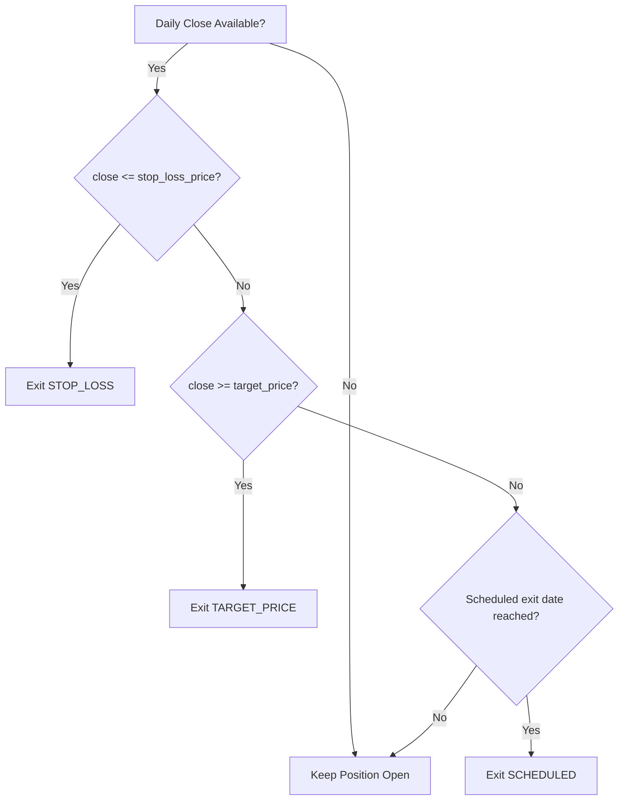

**Diagram sources**
- [tasks.py:1927-1974](file://apps/backtest/tasks.py#L1927-L1974)
- [TECHNICAL_GUIDE.md:728-749](file://TECHNICAL_GUIDE.md#L728-L749)

**Section sources**
- [tasks.py:1927-1974](file://apps/backtest/tasks.py#L1927-L1974)
- [TECHNICAL_GUIDE.md:728-749](file://TECHNICAL_GUIDE.md#L728-L749)

### Performance Metrics Calculation
Metrics computed at completion:
- Total return: (final_value - initial_capital) / initial_capital.
- Annualized return: based on calendar days over the run window.
- Maximum drawdown: peak-to-trough decline over equity curve.
- Sharpe ratio: annualized using daily returns and population standard deviation over 252 trading days.
- Win rate: proportion of closed positions with positive realized PnL.

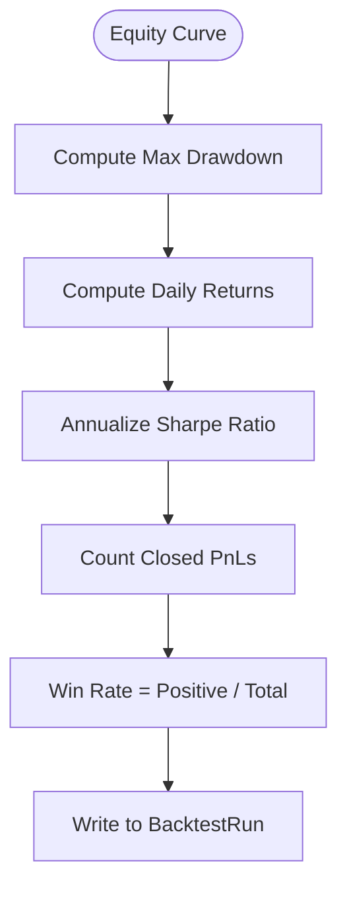

**Diagram sources**
- [tasks.py:2124-2147](file://apps/backtest/tasks.py#L2124-L2147)
- [tasks.py:2501-2569](file://apps/backtest/tasks.py#L2501-L2569)
- [TECHNICAL_GUIDE.md:791-806](file://TECHNICAL_GUIDE.md#L791-L806)

**Section sources**
- [tasks.py:2124-2147](file://apps/backtest/tasks.py#L2124-L2147)
- [tasks.py:2501-2569](file://apps/backtest/tasks.py#L2501-L2569)
- [TECHNICAL_GUIDE.md:791-806](file://TECHNICAL_GUIDE.md#L791-L806)

### Comparison Framework
Builds normalized series for:
- Selected run’s equity curve.
- Optional compare run and additional compare runs.
- Benchmarks: CSI 300 and CSI A500.

Normalization scales all series to the selected run’s first value for point-by-point comparison.

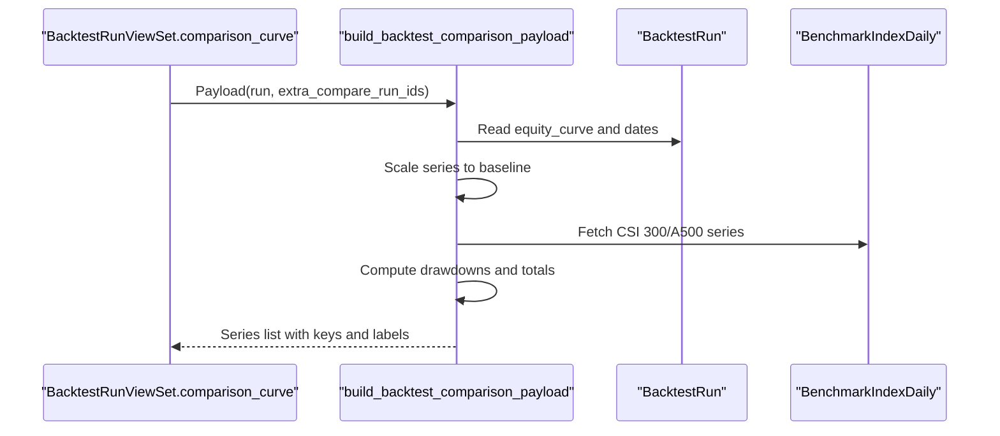

**Diagram sources**
- [views.py:204-208](file://apps/backtest/views.py#L204-L208)
- [comparison.py:177-245](file://apps/backtest/comparison.py#L177-L245)

**Section sources**
- [comparison.py:177-245](file://apps/backtest/comparison.py#L177-L245)
- [views.py:204-208](file://apps/backtest/views.py#L204-L208)

### Task Health Monitoring
Detects whether a RUNNING run has a live worker:
- Checks Celery task state via current_task_id.
- Distinguishes legitimate PENDING continuations (with progress) from orphaned tasks (no progress beyond threshold).
- Provides stale owner flag used by API to decide immediate vs deferred actions.

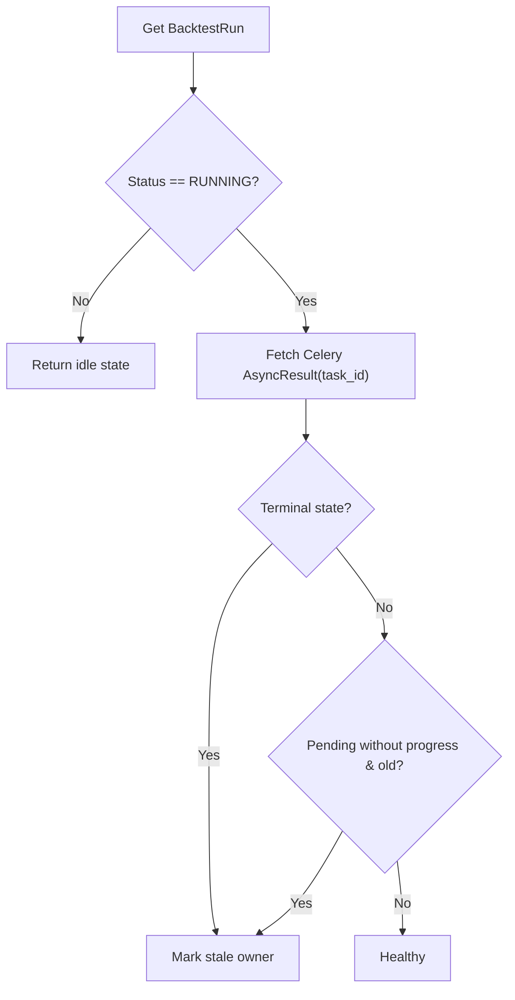

**Diagram sources**
- [task_health.py:45-95](file://apps/backtest/task_health.py#L45-L95)

**Section sources**
- [task_health.py:45-95](file://apps/backtest/task_health.py#L45-L95)

### Management Commands
- run_core_backtest_matrix: Creates a cross-product of variants and sources across date windows; can queue or execute inline; exports compact reports and manifest.
- run_validation_backtests: Generates rolling out-of-sample windows for heuristic/LightGBM/LSTM; queues or runs inline.
- export_backtest_runs: Exports run summaries, configs, model references, and optional detail CSVs including trades and macro context.
- run_reference_benchmark_suite: Wraps validation runs and exports a self-describing bundle with manifests and artifact metadata.

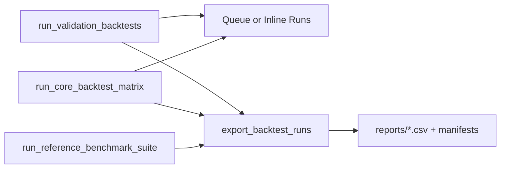

**Diagram sources**
- [run_core_backtest_matrix.py:103-461](file://apps/backtest/management/commands/run_core_backtest_matrix.py#L103-L461)
- [run_validation_backtests.py:37-144](file://apps/backtest/management/commands/run_validation_backtests.py#L37-L144)
- [export_backtest_runs.py:132-193](file://apps/backtest/management/commands/export_backtest_runs.py#L132-L193)
- [run_reference_benchmark_suite.py:31-124](file://apps/backtest/management/commands/run_reference_benchmark_suite.py#L31-L124)

**Section sources**
- [run_core_backtest_matrix.py:103-461](file://apps/backtest/management/commands/run_core_backtest_matrix.py#L103-L461)
- [run_validation_backtests.py:37-144](file://apps/backtest/management/commands/run_validation_backtests.py#L37-L144)
- [export_backtest_runs.py:132-193](file://apps/backtest/management/commands/export_backtest_runs.py#L132-L193)
- [run_reference_benchmark_suite.py:31-124](file://apps/backtest/management/commands/run_reference_benchmark_suite.py#L31-L124)

### Prediction Model Integration
- Candidate generation uses heuristic, LightGBM, or LSTM sources at runtime from active artifacts and features.
- Trade decision policy can adjust targets/stops and influence suggested entries via risk-reward and trade score.
- LightGBM inference backend and batch size can be configured per run; process caches optimize repeated predictions within a matrix.

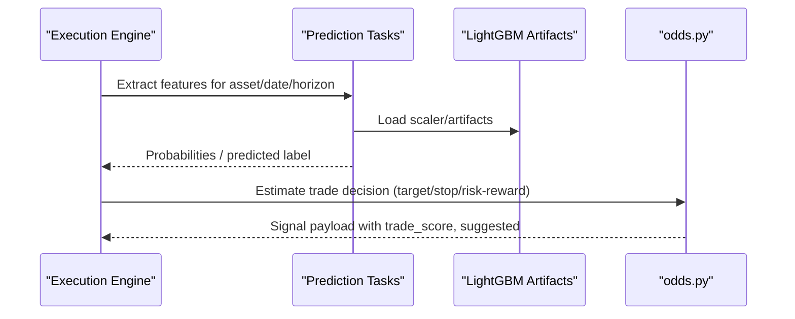

**Diagram sources**
- [tasks.py:681-719](file://apps/backtest/tasks.py#L681-L719)
- [tasks.py:722-800](file://apps/backtest/tasks.py#L722-L800)
- [odds.py:138-158](file://apps/prediction/odds.py#L138-L158)

**Section sources**
- [tasks.py:681-719](file://apps/backtest/tasks.py#L681-L719)
- [tasks.py:722-800](file://apps/backtest/tasks.py#L722-L800)
- [odds.py:138-158](file://apps/prediction/odds.py#L138-L158)

### API for Accessing Backtest Results
- BacktestRunViewSet supports create/list/retrieve plus lifecycle actions: pause, resume, restart, delete, rerun. Actions are intent-based and applied at chunk boundaries.
- Trades endpoint lists executed legs for a run.
- Comparison curve endpoint returns normalized series for strategy and benchmarks.

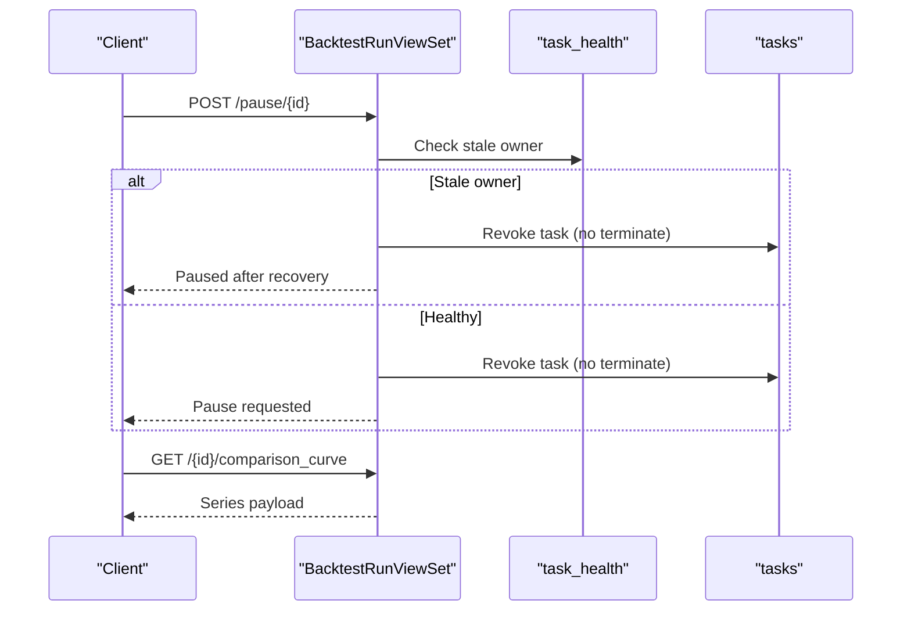

**Diagram sources**
- [views.py:134-165](file://apps/backtest/views.py#L134-L165)
- [views.py:198-208](file://apps/backtest/views.py#L198-L208)
- [task_health.py:45-95](file://apps/backtest/task_health.py#L45-L95)

**Section sources**
- [views.py:75-208](file://apps/backtest/views.py#L75-L208)
- [serializers.py:48-299](file://apps/backtest/serializers.py#L48-L299)

## Dependency Analysis
- Execution depends on market data (OHLCV), benchmark indices, and prediction artifacts.
- Serializer enforces parameter contracts and guards incompatible fee modes.
- Export command reads bounded ID ranges because strategy surface lives in JSON parameters.

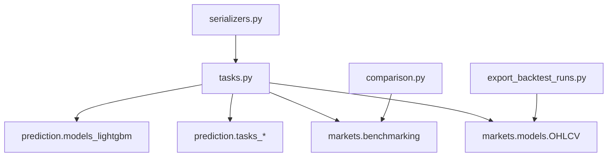

**Diagram sources**
- [tasks.py:54-69](file://apps/backtest/tasks.py#L54-L69)
- [serializers.py:86-299](file://apps/backtest/serializers.py#L86-L299)
- [export_backtest_runs.py:162-193](file://apps/backtest/management/commands/export_backtest_runs.py#L162-L193)
- [comparison.py:13-18](file://apps/backtest/comparison.py#L13-L18)

**Section sources**
- [tasks.py:54-69](file://apps/backtest/tasks.py#L54-L69)
- [serializers.py:86-299](file://apps/backtest/serializers.py#L86-L299)
- [export_backtest_runs.py:162-193](file://apps/backtest/management/commands/export_backtest_runs.py#L162-L193)
- [comparison.py:13-18](file://apps/backtest/comparison.py#L13-L18)

## Performance Considerations
- Chunked execution with configurable chunk size avoids timeouts and enables resume.
- Process-level caches for trading dates, price maps, and matrix signals reduce cold-start costs; clear between unrelated batches.
- LightGBM inference backend selection (cpu_serial, cpu_batched, windows_gpu) and batch size significantly impact throughput.
- Asymmetric fee modeling prevents overstating short-holding profitability.

[No sources needed since this section provides general guidance]

## Troubleshooting Guide
Common issues and remedies:
- Stale task ownership: Use task health to detect dead workers; API pause/restart handles recovery.
- Missing OHLCV data: Engine raises an error if fewer than two trading days exist in the range.
- Incompatible parameters: Serializers reject mixed fee modes and invalid numeric ranges; fix parameters before creating runs.
- No equity curve for comparison: Ensure run completes and report contains equity_curve.

**Section sources**
- [task_health.py:45-95](file://apps/backtest/task_health.py#L45-L95)
- [tasks.py:2360-2363](file://apps/backtest/tasks.py#L2360-L2363)
- [serializers.py:164-183](file://apps/backtest/serializers.py#L164-L183)
- [comparison.py:194-201](file://apps/backtest/comparison.py#L194-L201)

## Conclusion
The Backtest application provides a robust, resumable simulation engine with realistic cost modeling, flexible exit strategies, comprehensive metrics, and strong tooling for matrix runs, validation sweeps, and result export. Its API and task health system support safe operation of long-running experiments, while the comparison framework enables meaningful benchmarking against established indices.

[No sources needed since this section summarizes without analyzing specific files]

## Appendices

### Key Parameter Surface (Selected)
- prediction_source: heuristic, lightgbm, lstm
- candidate_mode: top_n, trade_score
- horizon_days: 3, 7, 30
- top_n, up_threshold, holding_period_days
- capital_fraction_per_entry
- fee_rate or structured fee parameters (commission, exchange, regulatory, transfer, stamp duty)
- slippage_bps
- enable_stop_target_exit
- entry_weekdays
- trade_decision_policy (min_target_return_pct, min_stop_distance_pct, include_near_round_target)
- compare_backtest_run_id

**Section sources**
- [serializers.py:86-299](file://apps/backtest/serializers.py#L86-L299)
- [tasks.py:338-483](file://apps/backtest/tasks.py#L338-L483)
- [TECHNICAL_GUIDE.md:716-781](file://TECHNICAL_GUIDE.md#L716-L781)