# Core Applications

<cite>
**Referenced Files in This Document**
- [README.md](file://README.md)
- [base.py](file://config/settings/base.py)
- [apps/__init__.py](file://apps/__init__.py)
- [pagination.py](file://apps/core/pagination.py)
- [models.py (markets)](file://apps/markets/models.py)
- [tasks.py (markets)](file://apps/markets/tasks.py)
- [models.py (analytics)](file://apps/analytics/models.py)
- [tasks.py (analytics)](file://apps/analytics/tasks.py)
- [models.py (factors)](file://apps/factors/models.py)
- [tasks.py (factors)](file://apps/factors/tasks.py)
- [models.py (macro)](file://apps/macro/models.py)
- [models.py (sentiment)](file://apps/sentiment/models.py)
- [models.py (prediction)](file://apps/prediction/models.py)
- [tasks.py (prediction)](file://apps/prediction/tasks.py)
- [models.py (backtest)](file://apps/backtest/models.py)
- [models.py (users)](file://apps/users/models.py)
- [models.py (developer)](file://apps/developer/models.py)
</cite>

## Table of Contents
1. [Introduction](#introduction)
2. [Project Structure](#project-structure)
3. [Core Components](#core-components)
4. [Architecture Overview](#architecture-overview)
5. [Detailed Component Analysis](#detailed-component-analysis)
6. [Dependency Analysis](#dependency-analysis)
7. [Performance Considerations](#performance-considerations)
8. [Troubleshooting Guide](#troubleshooting-guide)
9. [Conclusion](#conclusion)

## Introduction
This document explains the modular architecture of the FinanceAnalysis platform, focusing on its ten Django applications and their strict upstream → derived ordering. The system ingests market, fundamental, macro, and news data; derives technical indicators and factor scores; runs heuristic and ML predictions; and validates strategies via backtesting. Inter-app communication is intentionally mediated through the database layer to enforce a clean data flow: upstream apps publish canonical data, and derived apps consume it without direct imports beyond shared models where necessary.

The platform exposes a REST API, WebSocket alerts, and a React dashboard, with Celery orchestrating scheduled pipelines across multiple queues.

**Section sources**
- [README.md:48-114](file://README.md#L48-L114)
- [base.py:64-88](file://config/settings/base.py#L64-L88)

## Project Structure
At runtime, Django loads the following apps in a defined order that reflects the data dependency graph: core, users, markets, analytics, factors, macro, sentiment, prediction, backtest, developer. The `INSTALLED_APPS` list encodes this ordering, ensuring migrations and app registry initialization respect the intended hierarchy.

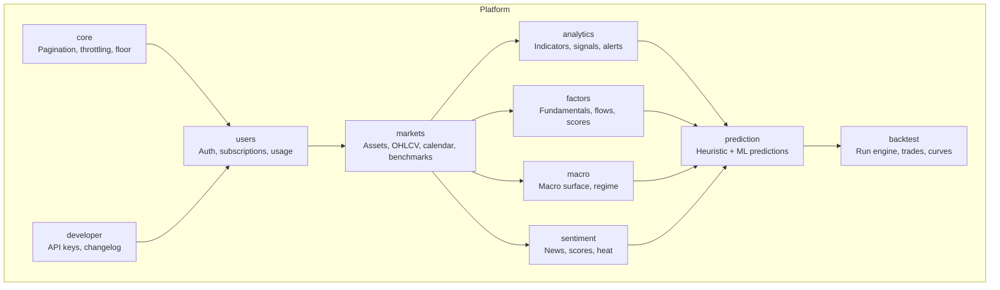

**Diagram sources**
- [base.py:64-88](file://config/settings/base.py#L64-L88)

**Section sources**
- [base.py:64-88](file://config/settings/base.py#L64-L88)
- [apps/__init__.py:1-14](file://apps/__init__.py#L1-L14)

## Core Components
- core: Shared pagination, tiered throttling, historical floor enforcement, and documentation export utilities.
- users: Authentication, subscription tiers, and API usage metering.
- markets: Foundation data for assets, OHLCV, trading calendars, suspensions, index membership, and point-in-time benchmarks.
- analytics: Technical indicators, signal events, alert rules/events, screeners, and WebSocket alert broadcasting.
- factors: Fundamental snapshots, money flow, margin detail, capital flow, and composite factor scores.
- macro: Macro snapshots, market context (regime), and event impact statistics.
- sentiment: News ingestion, per-article and rolling asset/market sentiment scores, concept heat.
- prediction: Heuristic ensemble baseline and model registry; generates trade decisions and probabilities.
- backtest: Strategy run engine, trade ledger, performance metrics, and comparison reports.
- developer: Secure API key management and public changelog.

**Section sources**
- [README.md:48-63](file://README.md#L48-L63)
- [base.py:266-301](file://config/settings/base.py#L266-L301)
- [pagination.py:1-7](file://apps/core/pagination.py#L1-L7)

## Architecture Overview
The platform enforces a strict upstream → derived data flow. Derived apps read canonical tables created by upstream apps rather than importing each other’s logic directly. This ensures reproducibility, auditability, and clear ownership of data.

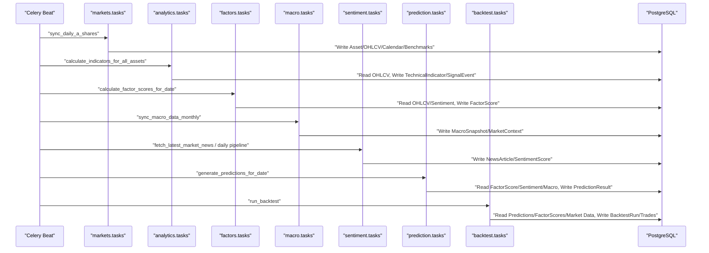

**Diagram sources**
- [base.py:218-255](file://config/settings/base.py#L218-L255)
- [tasks.py (markets):1-20](file://apps/markets/tasks.py#L1-L20)
- [tasks.py (analytics):1-27](file://apps/analytics/tasks.py#L1-L27)
- [tasks.py (factors):1-20](file://apps/factors/tasks.py#L1-L20)
- [tasks.py (prediction):1-17](file://apps/prediction/tasks.py#L1-L17)

## Detailed Component Analysis

### Markets (foundation data)
Responsibilities:
- Maintain Market, Asset, ExchangeTradingCalendar, AssetSuspension, IndexMembership, BenchmarkIndexDaily, PointInTimeBenchmarkDaily, and OHLCV.
- Provide point-in-time universe construction and benchmarking utilities used downstream.

Key behaviors:
- Daily sync of A-share OHLCV, index memberships, and trading calendar.
- Refreshes point-in-time union benchmark for consistent backtesting.

Data dependencies:
- Upstream-only writes; consumed by analytics, factors, macro, sentiment, prediction, and backtest via ORM reads.

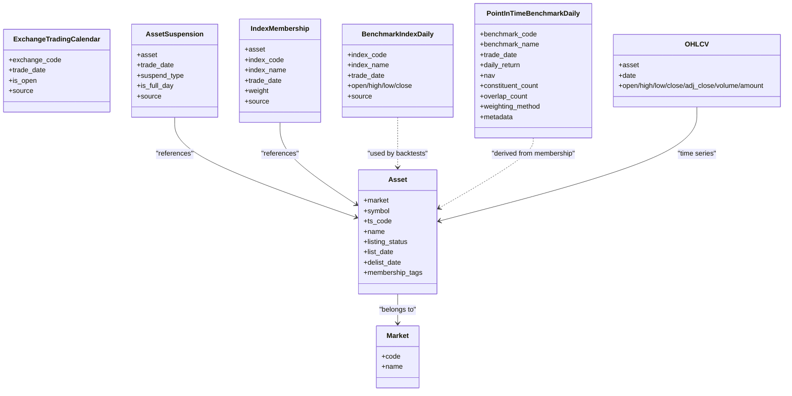

**Diagram sources**
- [models.py (markets):1-226](file://apps/markets/models.py#L1-L226)

**Section sources**
- [models.py (markets):1-226](file://apps/markets/models.py#L1-L226)
- [tasks.py (markets):1-20](file://apps/markets/tasks.py#L1-L20)

### Analytics (technical indicators and signals)
Responsibilities:
- Compute and store technical indicators (e.g., RSI, MACD, Bollinger Bands).
- Generate signal events (golden/death crosses, breakouts, momentum, reversals).
- Manage alert rules and events; broadcast alerts via WebSocket channels.

Data dependencies:
- Reads OHLCV and trading dates from markets.
- Writes TechnicalIndicator and SignalEvent consumed by factors and prediction.

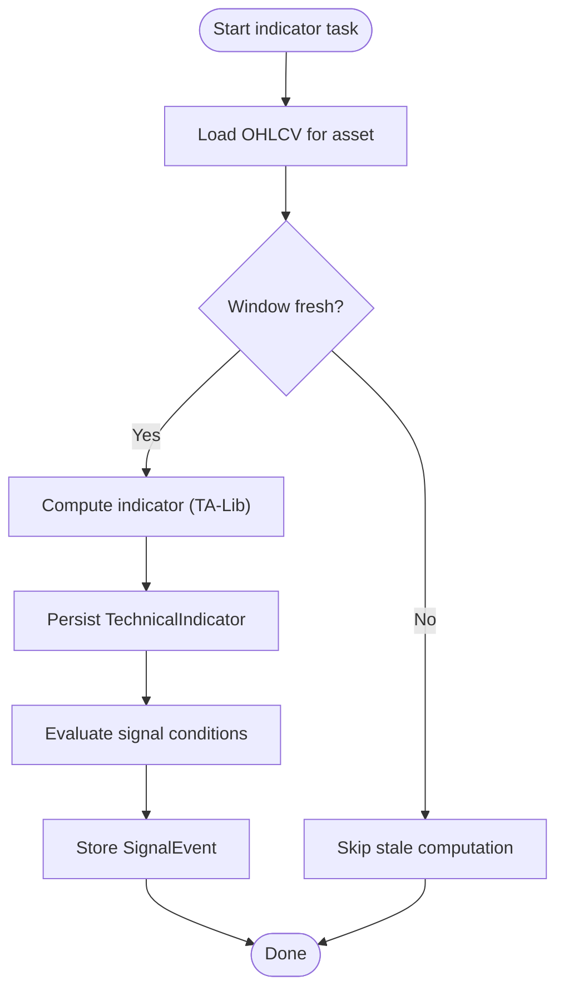

**Diagram sources**
- [tasks.py (analytics):28-66](file://apps/analytics/tasks.py#L28-L66)
- [tasks.py (analytics):67-110](file://apps/analytics/tasks.py#L67-L110)
- [models.py (analytics):8-45](file://apps/analytics/models.py#L8-L45)
- [models.py (analytics):198-255](file://apps/analytics/models.py#L198-L255)

**Section sources**
- [models.py (analytics):8-45](file://apps/analytics/models.py#L8-L45)
- [models.py (analytics):198-255](file://apps/analytics/models.py#L198-L255)
- [tasks.py (analytics):28-66](file://apps/analytics/tasks.py#L28-L66)
- [tasks.py (analytics):67-110](file://apps/analytics/tasks.py#L67-L110)

### Factors (fundamental analysis)
Responsibilities:
- Materialize fundamental snapshots, money flow, margin details, and capital flow.
- Compute multi-factor scores (technical, fundamental, composite) and bottom probability.

Data dependencies:
- Reads OHLCV and SignalEvent from analytics/markets.
- Reads SentimentScore from sentiment.
- Writes FactorScore consumed by prediction and backtest.

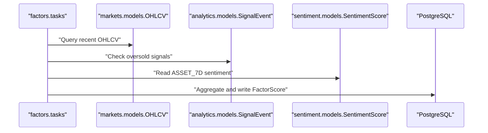

**Diagram sources**
- [tasks.py (factors):72-99](file://apps/factors/tasks.py#L72-L99)
- [tasks.py (factors):101-192](file://apps/factors/tasks.py#L101-L192)
- [models.py (factors):7-37](file://apps/factors/models.py#L7-L37)
- [models.py (factors):124-176](file://apps/factors/models.py#L124-L176)

**Section sources**
- [models.py (factors):7-37](file://apps/factors/models.py#L7-L37)
- [models.py (factors):124-176](file://apps/factors/models.py#L124-L176)
- [tasks.py (factors):72-99](file://apps/factors/tasks.py#L72-L99)
- [tasks.py (factors):101-192](file://apps/factors/tasks.py#L101-L192)

### Macro (economic indicators)
Responsibilities:
- Store macro snapshots (yields, PMI, CPI/PPI) and infer current market context/regime.
- Track event impact statistics for tagged macro/policy events.

Data dependencies:
- Read-only for downstream consumers (prediction uses current macro phase).

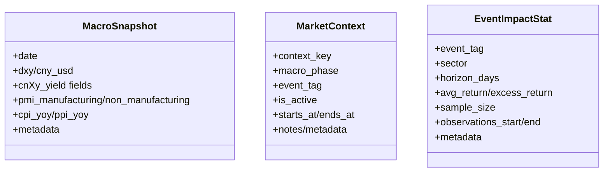

**Diagram sources**
- [models.py (macro):1-77](file://apps/macro/models.py#L1-L77)

**Section sources**
- [models.py (macro):1-77](file://apps/macro/models.py#L1-L77)

### Sentiment (news analysis)
Responsibilities:
- Ingest news articles from multiple providers.
- Produce per-article and rolling asset/market sentiment scores.
- Aggregate concept heat for theme monitoring.

Data dependencies:
- Writes NewsArticle and SentimentScore consumed by factors and prediction.

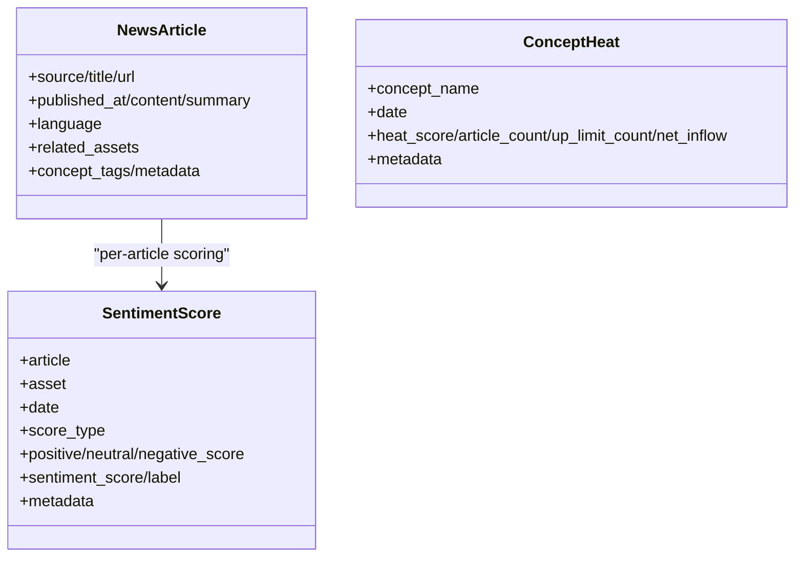

**Diagram sources**
- [models.py (sentiment):1-125](file://apps/sentiment/models.py#L1-L125)

**Section sources**
- [models.py (sentiment):1-125](file://apps/sentiment/models.py#L1-L125)

### Prediction (ML and heuristic models)
Responsibilities:
- Maintain model versions and artifacts.
- Generate heuristic ensemble predictions and trade decisions using features from factors, sentiment, and macro.
- Persist prediction results with horizons and labels.

Data dependencies:
- Reads FactorScore, SentimentScore, MarketContext, and technical features.
- Writes PredictionResult consumed by backtest.

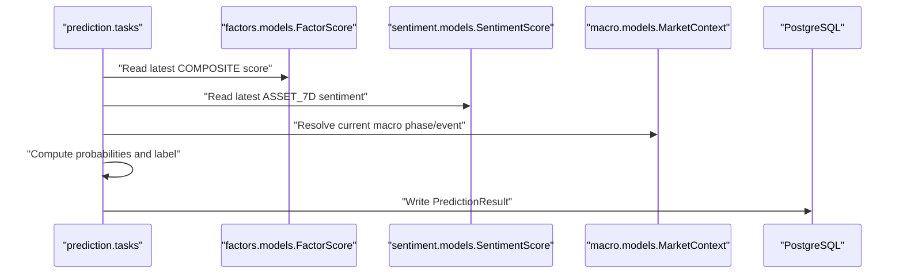

**Diagram sources**
- [tasks.py (prediction):33-79](file://apps/prediction/tasks.py#L33-L79)
- [tasks.py (prediction):82-127](file://apps/prediction/tasks.py#L82-L127)
- [models.py (prediction):7-41](file://apps/prediction/models.py#L7-L41)
- [models.py (prediction):43-98](file://apps/prediction/models.py#L43-L98)

**Section sources**
- [models.py (prediction):7-41](file://apps/prediction/models.py#L7-L41)
- [models.py (prediction):43-98](file://apps/prediction/models.py#L43-L98)
- [tasks.py (prediction):33-79](file://apps/prediction/tasks.py#L33-L79)
- [tasks.py (prediction):82-127](file://apps/prediction/tasks.py#L82-L127)

### Backtest (strategy validation)
Responsibilities:
- Execute strategy runs with configurable parameters stored in JSON.
- Record trades, performance metrics, and reports; support pause/restart/delete lifecycle.
- Attribute runs to model versions via trade signal payloads.

Data dependencies:
- Reads Predictions, FactorScores, Market data; writes BacktestRun and BacktestTrade.

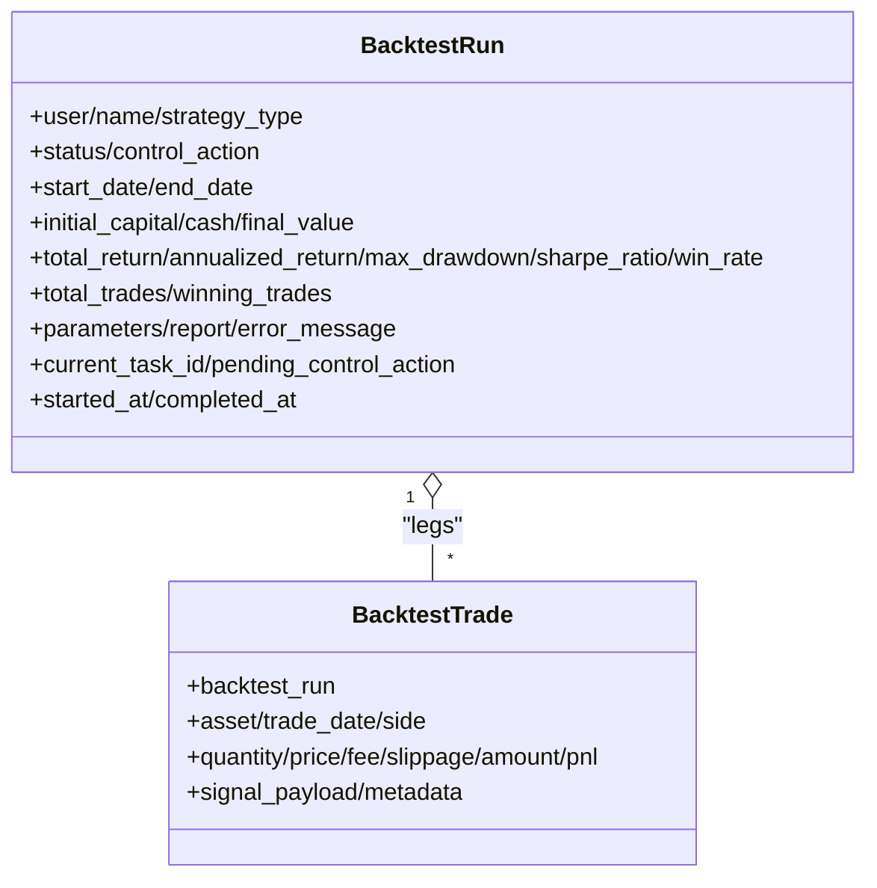

**Diagram sources**
- [models.py (backtest):24-118](file://apps/backtest/models.py#L24-L118)
- [models.py (backtest):120-168](file://apps/backtest/models.py#L120-L168)

**Section sources**
- [models.py (backtest):24-118](file://apps/backtest/models.py#L24-L118)
- [models.py (backtest):120-168](file://apps/backtest/models.py#L120-L168)

### Users (authentication and subscriptions)
Responsibilities:
- Extend Django User with profile, subscription tiers, and API usage tracking.
- Enforce rate limits via middleware and DRF throttlers.

Data dependencies:
- Used by developer keys and API access control.

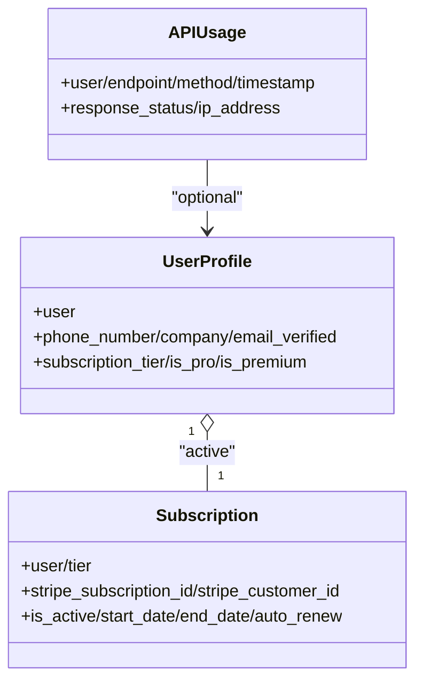

**Diagram sources**
- [models.py (users):13-66](file://apps/users/models.py#L13-L66)
- [models.py (users):68-138](file://apps/users/models.py#L68-L138)
- [models.py (users):140-186](file://apps/users/models.py#L140-L186)

**Section sources**
- [models.py (users):13-66](file://apps/users/models.py#L13-L66)
- [models.py (users):68-138](file://apps/users/models.py#L68-L138)
- [models.py (users):140-186](file://apps/users/models.py#L140-L186)

### Developer (API tools)
Responsibilities:
- Issue secure API keys with hashed storage and prefix display.
- Maintain a public changelog for API versioning.

Data dependencies:
- Tied to users; consumed by authentication middleware and DRF schema.

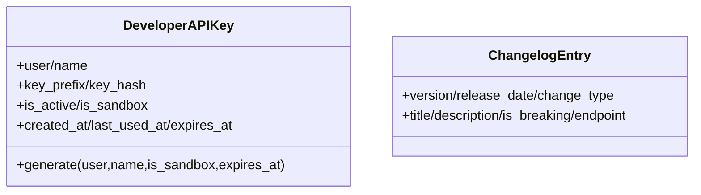

**Diagram sources**
- [models.py (developer):10-101](file://apps/developer/models.py#L10-L101)
- [models.py (developer):103-156](file://apps/developer/models.py#L103-L156)

**Section sources**
- [models.py (developer):10-101](file://apps/developer/models.py#L10-L101)
- [models.py (developer):103-156](file://apps/developer/models.py#L103-L156)

## Dependency Analysis
Inter-app communication follows a strict pattern:
- Direct Python imports between apps are minimized; derived apps import only the upstream models they need (e.g., analytics imports Asset from markets).
- Cross-app data flow occurs through database reads/writes orchestrated by Celery tasks and management commands.
- Shared constants and configuration live in settings (queues, schedules, environment variables), not in app code.

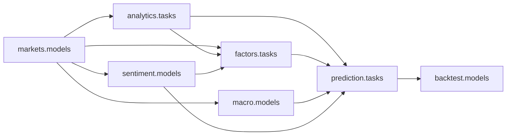

**Diagram sources**
- [tasks.py (analytics):14-27](file://apps/analytics/tasks.py#L14-L27)
- [tasks.py (factors):14-19](file://apps/factors/tasks.py#L14-L19)
- [tasks.py (prediction):8-17](file://apps/prediction/tasks.py#L8-L17)

**Section sources**
- [base.py:218-255](file://config/settings/base.py#L218-L255)
- [tasks.py (analytics):14-27](file://apps/analytics/tasks.py#L14-L27)
- [tasks.py (factors):14-19](file://apps/factors/tasks.py#L14-L19)
- [tasks.py (prediction):8-17](file://apps/prediction/tasks.py#L8-L17)

## Performance Considerations
- Use batched queries and distinct lookups when aggregating per-asset data to reduce N+1 issues.
- Prefer filtering by date ranges and indexes present on frequently queried columns (e.g., asset/date combinations).
- Leverage Celery queues to isolate heavy workloads (backtest, training) from operational tasks.
- Avoid recomputation by checking staleness windows before recalculating indicators or signals.

[No sources needed since this section provides general guidance]

## Troubleshooting Guide
Common issues and remedies:
- Stale technical indicators: Ensure trailing window freshness checks pass; re-run warmup if OHLCV gaps exist.
- Missing universe coverage: Validate point-in-time membership coverage before running predictions or backtests; failures should be closed when coverage is absent.
- Task routing errors: Confirm Celery workers subscribe to the correct queues (ops, backtest, train-lightgbm, train-lstm).
- API throttling: Verify user tier and throttle classes; adjust rates if needed.

**Section sources**
- [tasks.py (analytics):77-85](file://apps/analytics/tasks.py#L77-L85)
- [base.py:218-255](file://config/settings/base.py#L218-L255)
- [base.py:266-301](file://config/settings/base.py#L266-L301)

## Conclusion
FinanceAnalysis implements a disciplined, database-mediated architecture where upstream apps provide canonical data and derived apps compute higher-level insights. This separation ensures clarity, testability, and maintainability across markets, analytics, factors, macro, sentiment, prediction, backtest, users, and developer capabilities. Scheduled pipelines orchestrate data movement and processing, while REST and WebSocket surfaces expose results to clients.

[No sources needed since this section summarizes without analyzing specific files]