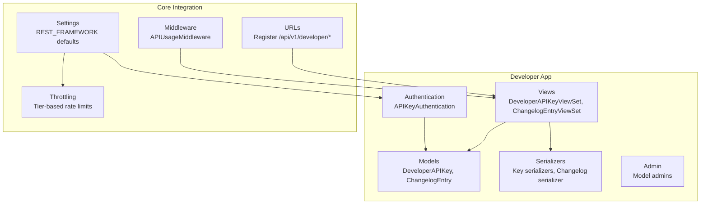
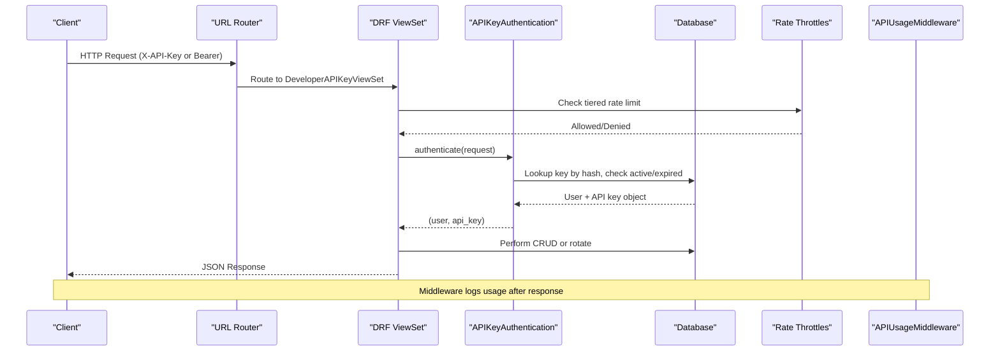
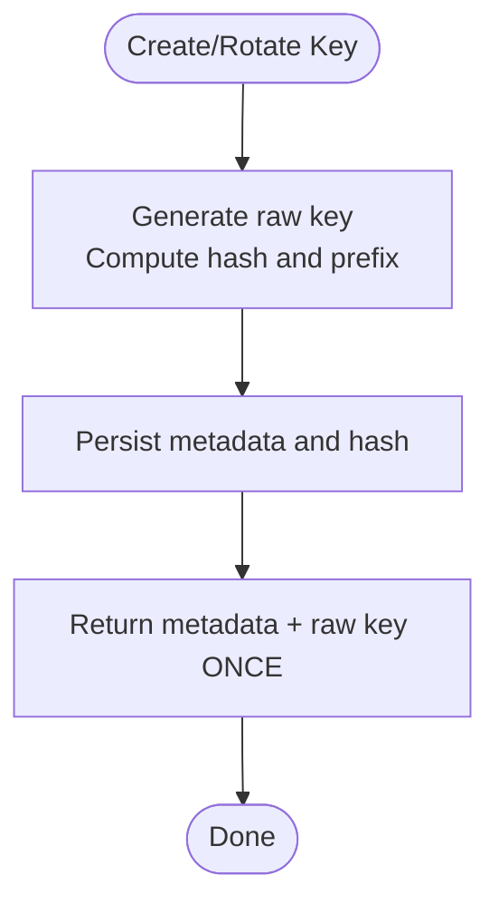
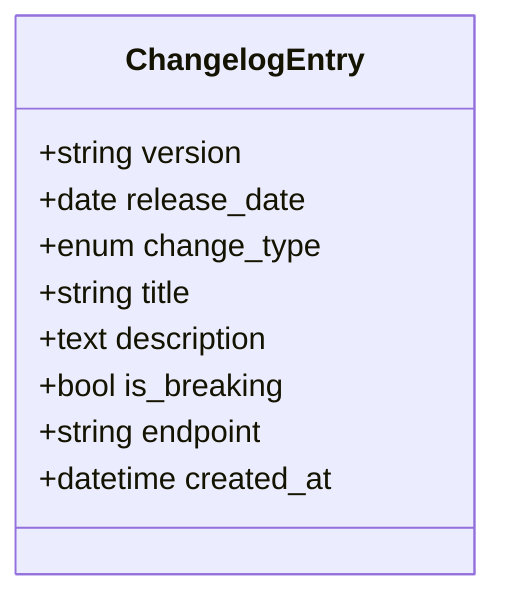
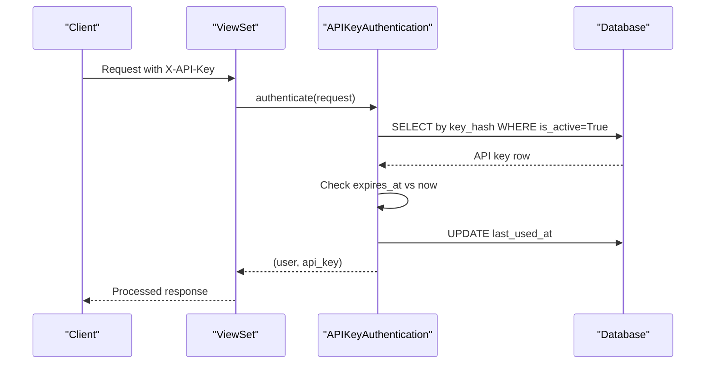
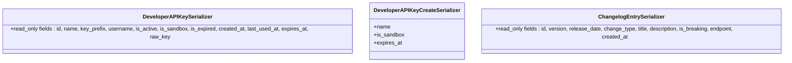
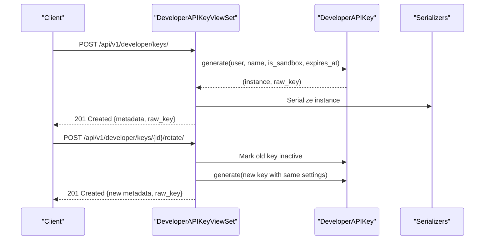
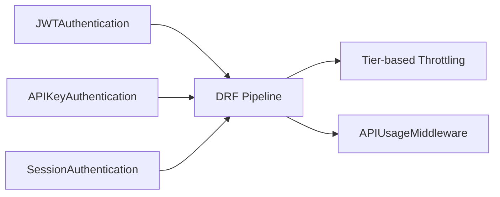
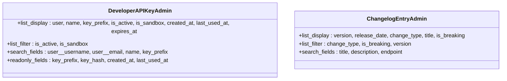
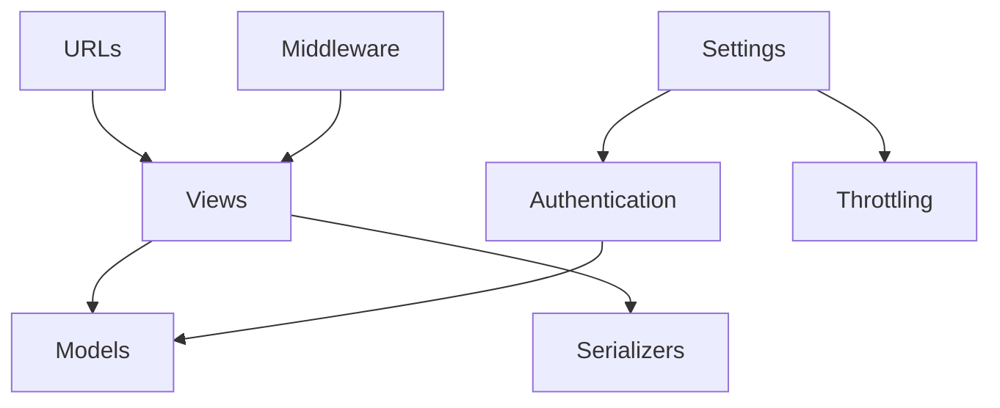

# Developer Application

<cite>
**Referenced Files in This Document**
- [models.py](file://apps/developer/models.py)
- [views.py](file://apps/developer/views.py)
- [serializers.py](file://apps/developer/serializers.py)
- [authentication.py](file://apps/developer/authentication.py)
- [admin.py](file://apps/developer/admin.py)
- [urls.py](file://config/urls.py)
- [base.py](file://config/settings/base.py)
- [throttling.py](file://apps/core/throttling.py)
- [middleware.py](file://apps/users/middleware.py)
</cite>

## Table of Contents
1. Introduction
2. Project Structure
3. Core Components
4. Architecture Overview
5. Detailed Component Analysis
6. Dependency Analysis
7. Performance Considerations
8. Troubleshooting Guide
9. Conclusion

## Introduction
The Developer application provides tools and interfaces for API consumers and system administrators. It implements a secure API key management system, a public changelog for API versioning, developer-facing authentication via an API key header, consistent response serialization, and administrative controls to manage keys and monitor usage patterns. It integrates with the main REST framework pipeline and the global throttling and usage tracking infrastructure.

## Project Structure
The Developer app is organized into standard Django components:
- Models define API keys and changelog entries.
- Views expose REST endpoints for key lifecycle operations and changelog retrieval.
- Serializers format request/response payloads consistently.
- Authentication defines how requests are validated using an API key header.
- Admin registers models for operational management.
- URLs register routes under /api/v1/developer/.
- Settings configure default authentication classes, throttling tiers, and OpenAPI documentation.

**Diagram sources**
- [urls.py:106-107](file://config/urls.py#L106-L107)
- [base.py:266-301](file://config/settings/base.py#L266-L301)
- [views.py:13-100](file://apps/developer/views.py#L13-L100)
- [authentication.py:10-53](file://apps/developer/authentication.py#L10-L53)
- [models.py:10-156](file://apps/developer/models.py#L10-L156)
- [serializers.py:6-68](file://apps/developer/serializers.py#L6-L68)
- [throttling.py:17-88](file://apps/core/throttling.py#L17-L88)
- [middleware.py:6-34](file://apps/users/middleware.py#L6-L34)

**Section sources**
- [urls.py:106-107](file://config/urls.py#L106-L107)
- [base.py:266-301](file://config/settings/base.py#L266-L301)

## Core Components
- API Key Management: Secure generation, rotation, and revocation of developer API keys with optional sandbox mode and expiration. Keys are stored as hashes; only the prefix and metadata are persisted.
- Public Changelog: Read-only endpoint listing API changes, including breaking change flags and affected endpoints.
- Authentication: Validates requests via an X-API-Key header, checks active status and expiration, and updates last-used timestamps.
- Serialization: Consistent JSON responses for keys and changelog entries, with read-only fields and safe exposure of non-sensitive data.
- Admin Interface: Operational views to list, filter, search, and inspect keys and changelog entries.

**Section sources**
- [models.py:10-156](file://apps/developer/models.py#L10-L156)
- [views.py:13-100](file://apps/developer/views.py#L13-L100)
- [serializers.py:6-68](file://apps/developer/serializers.py#L6-L68)
- [authentication.py:10-53](file://apps/developer/authentication.py#L10-L53)
- [admin.py:1-21](file://apps/developer/admin.py#L1-L21)

## Architecture Overview
The Developer app plugs into the Django REST Framework pipeline:
- Requests arrive at /api/v1/developer/* routes registered in the root URL configuration.
- Default authentication classes include JWT and the custom API key authenticator.
- Throttling applies per-tier daily limits.
- Usage middleware records API calls for analytics.
- Views use serializers to return standardized responses.

**Diagram sources**
- [urls.py:106-107](file://config/urls.py#L106-L107)
- [base.py:266-301](file://config/settings/base.py#L266-L301)
- [authentication.py:24-49](file://apps/developer/authentication.py#L24-L49)
- [views.py:13-84](file://apps/developer/views.py#L13-L84)
- [throttling.py:17-88](file://apps/core/throttling.py#L17-L88)
- [middleware.py:11-31](file://apps/users/middleware.py#L11-L31)

## Detailed Component Analysis

### API Key Lifecycle and Security
- Creation: Generates a unique key string, stores only its SHA-256 hash and a short prefix, returns the raw key once in the response.
- Rotation: Revokes the current key and issues a replacement with the same settings, returning the new raw key once.
- Revocation: Marks a key inactive without deleting it, preserving audit history.
- Expiration and Sandbox: Supports optional expiration dates and sandbox mode for restricted access.

**Diagram sources**
- [models.py:81-100](file://apps/developer/models.py#L81-L100)
- [views.py:39-54](file://apps/developer/views.py#L39-L54)
- [views.py:63-83](file://apps/developer/views.py#L63-L83)

**Section sources**
- [models.py:10-100](file://apps/developer/models.py#L10-L100)
- [views.py:39-83](file://apps/developer/views.py#L39-L83)
- [serializers.py:6-50](file://apps/developer/serializers.py#L6-L50)

### Public Changelog
- Purpose: Provides external developers with a versioned record of API changes, including breaking changes and affected endpoints.
- Access: Publicly readable with filtering by version, change type, and breaking flag.

**Diagram sources**
- [models.py:103-156](file://apps/developer/models.py#L103-L156)

**Section sources**
- [models.py:103-156](file://apps/developer/models.py#L103-L156)
- [views.py:86-100](file://apps/developer/views.py#L86-L100)
- [serializers.py:53-68](file://apps/developer/serializers.py#L53-L68)

### Authentication Flow with API Key
- Header: Requests must include X-API-Key.
- Validation: Hashes the provided key, looks up active keys, verifies expiration, and updates last-used timestamp.
- Integration: Registered as a default authentication class alongside JWT and session authentication.

**Diagram sources**
- [authentication.py:24-49](file://apps/developer/authentication.py#L24-L49)
- [base.py:281-285](file://config/settings/base.py#L281-L285)

**Section sources**
- [authentication.py:10-53](file://apps/developer/authentication.py#L10-L53)
- [base.py:281-285](file://config/settings/base.py#L281-L285)

### Serializers and Response Formatting
- Key Serializer: Exposes safe fields such as name, prefix, username, status flags, timestamps, and a write-once raw_key field injected by the view.
- Create Serializer: Validates input for key creation including name, sandbox flag, and optional expiration.
- Changelog Serializer: Exposes all changelog fields as read-only.

**Diagram sources**
- [serializers.py:6-68](file://apps/developer/serializers.py#L6-L68)

**Section sources**
- [serializers.py:6-68](file://apps/developer/serializers.py#L6-L68)

### View Functions and Endpoints
- DeveloperAPIKeyViewSet:
  - List: Returns active keys owned by the authenticated user.
  - Create: Issues a new key and returns metadata plus the raw key once.
  - Retrieve: Returns key metadata without sensitive data.
  - Destroy: Soft-revokes a key by marking it inactive.
  - Rotate: Revokes the current key and issues a replacement, returning the new raw key once.
- ChangelogEntryViewSet:
  - List/Retrieve: Public read-only access to API changelog entries with filters and search.

**Diagram sources**
- [views.py:13-84](file://apps/developer/views.py#L13-L84)
- [models.py:81-100](file://apps/developer/models.py#L81-L100)
- [serializers.py:6-50](file://apps/developer/serializers.py#L6-L50)

**Section sources**
- [views.py:13-100](file://apps/developer/views.py#L13-L100)

### Integration with Main Authentication System
- Default authentication classes include JWT, API key, and session authentication.
- OpenAPI schema documents both JWT and API key security schemes.
- Throttling tiers apply based on subscription level; anonymous and auth endpoints have dedicated throttle scopes.

**Diagram sources**
- [base.py:281-301](file://config/settings/base.py#L281-L301)
- [base.py:352-388](file://config/settings/base.py#L352-L388)
- [throttling.py:17-88](file://apps/core/throttling.py#L17-L88)
- [middleware.py:6-34](file://apps/users/middleware.py#L6-L34)

**Section sources**
- [base.py:281-301](file://config/settings/base.py#L281-L301)
- [base.py:352-388](file://config/settings/base.py#L352-L388)

### Admin Interface for Managing Keys and Monitoring Usage
- DeveloperAPIKeyAdmin: Lists, filters, searches, and inspects keys with readonly fields for sensitive data and timestamps.
- ChangelogEntryAdmin: Lists and filters changelog entries by type, version, and breaking status.

**Diagram sources**
- [admin.py:6-21](file://apps/developer/admin.py#L6-L21)

**Section sources**
- [admin.py:1-21](file://apps/developer/admin.py#L1-L21)

## Dependency Analysis
- Views depend on models for data persistence and on serializers for I/O formatting.
- Authentication depends on models to validate keys and update usage timestamps.
- URLs register viewsets under /api/v1/developer/.
- Settings configure default authentication and throttling behavior globally.
- Middleware tracks API usage across all /api/v1/ endpoints.

**Diagram sources**
- [views.py:13-100](file://apps/developer/views.py#L13-L100)
- [models.py:10-156](file://apps/developer/models.py#L10-L156)
- [serializers.py:6-68](file://apps/developer/serializers.py#L6-L68)
- [authentication.py:10-53](file://apps/developer/authentication.py#L10-L53)
- [urls.py:106-107](file://config/urls.py#L106-L107)
- [base.py:266-301](file://config/settings/base.py#L266-L301)
- [middleware.py:6-34](file://apps/users/middleware.py#L6-L34)

**Section sources**
- [urls.py:106-107](file://config/urls.py#L106-L107)
- [base.py:266-301](file://config/settings/base.py#L266-L301)

## Performance Considerations
- Use select_related in authentication to reduce queries when fetching user context.
- Avoid storing raw keys; store only hashes and prefixes to minimize storage and risk.
- Leverage indexes on key_hash and user+is_active for fast lookups.
- Apply tier-based throttling to protect backend resources and ensure fair usage.
- Update last-used timestamps asynchronously or with minimal overhead to avoid blocking request handling.

[No sources needed since this section provides general guidance]

## Troubleshooting Guide
- Invalid or revoked API key: Ensure the X-API-Key header matches a key that exists, is active, and not expired.
- Expired API key: Renew or rotate the key before expiration; verify expires_at settings during creation.
- Rate limiting exceeded: Review subscription tier and adjust usage or upgrade plan; check throttle scopes for auth endpoints.
- Missing usage logs: Confirm APIUsageMiddleware is enabled and requests hit /api/v1/ paths.

**Section sources**
- [authentication.py:24-49](file://apps/developer/authentication.py#L24-L49)
- [throttling.py:17-88](file://apps/core/throttling.py#L17-L88)
- [middleware.py:11-31](file://apps/users/middleware.py#L11-L31)

## Conclusion
The Developer application delivers a robust, secure, and extensible set of tools for managing API keys and exposing a public changelog. Its integration with the main authentication pipeline, throttling, and usage tracking ensures secure access and operational visibility. The admin interface supports efficient management and monitoring, while serializers provide consistent responses for third-party integrations.

[No sources needed since this section summarizes without analyzing specific files]