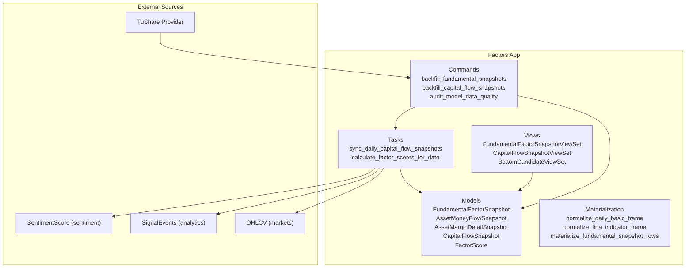
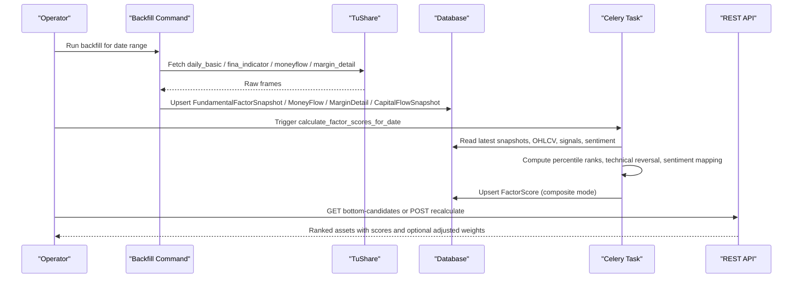
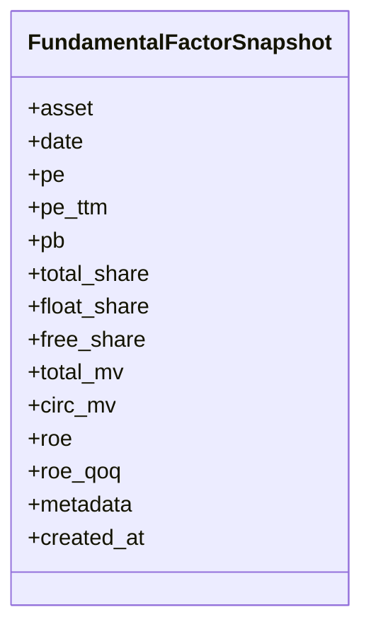
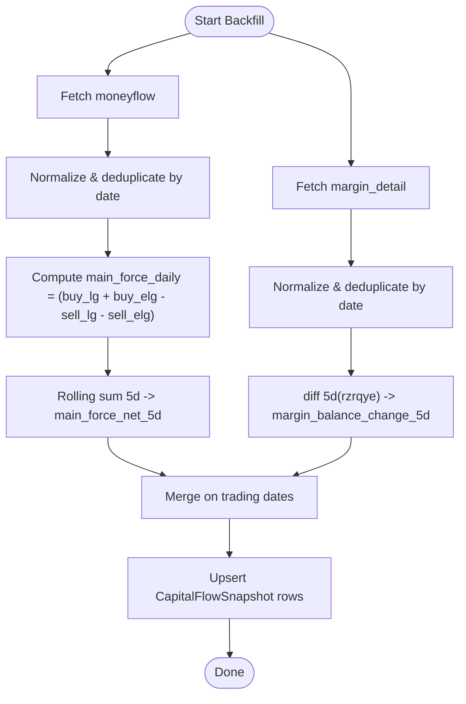
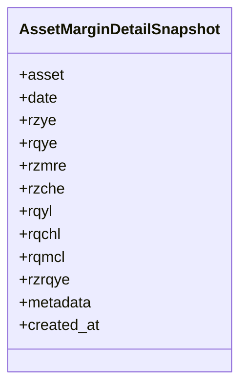
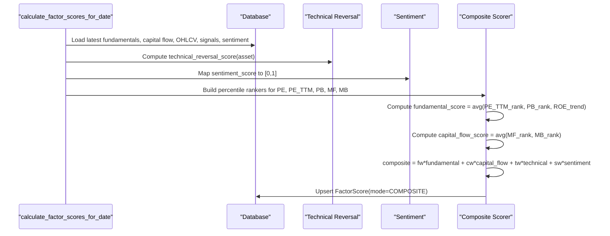
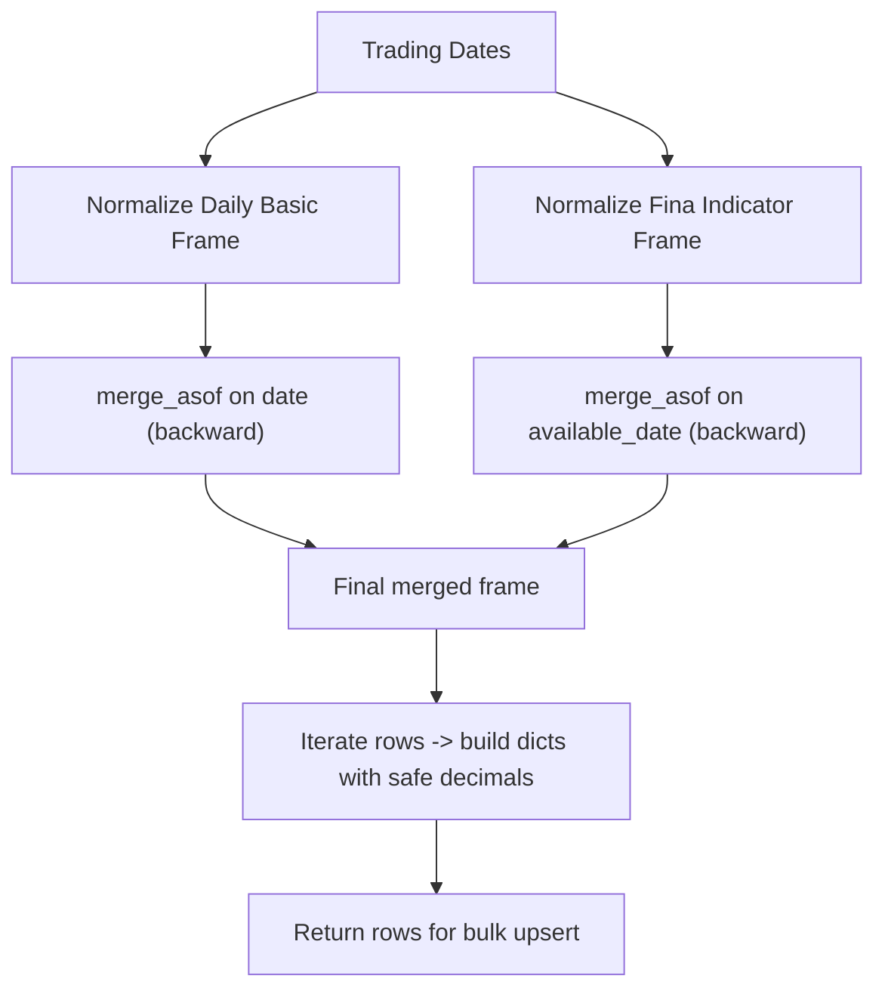
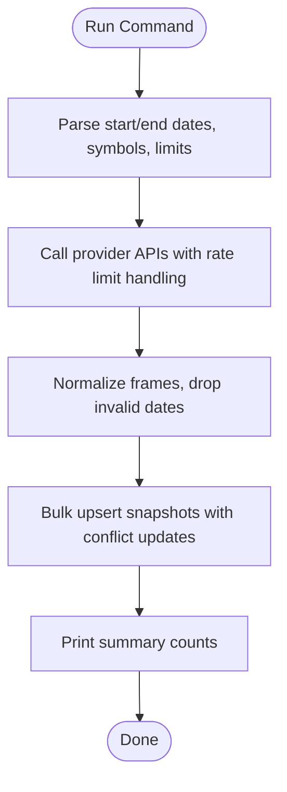
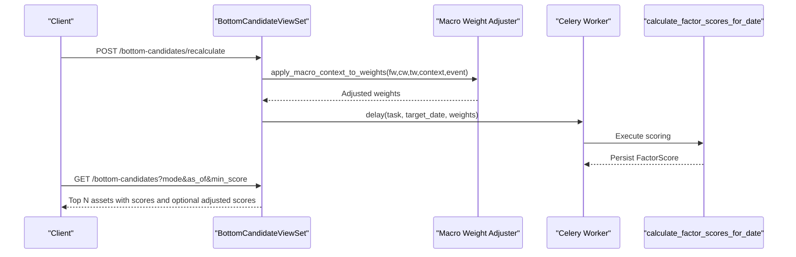
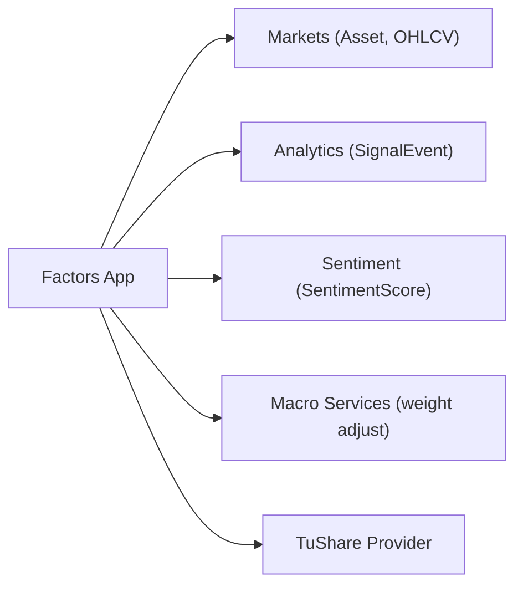

# Factors Application

<cite>
**Referenced Files in This Document**
- [models.py](file://apps/factors/models.py)
- [fundamental_materialization.py](file://apps/factors/fundamental_materialization.py)
- [tasks.py](file://apps/factors/tasks.py)
- [backfill_fundamental_snapshots.py](file://apps/factors/management/commands/backfill_fundamental_snapshots.py)
- [backfill_capital_flow_snapshots.py](file://apps/factors/management/commands/backfill_capital_flow_snapshots.py)
- [audit_model_data_quality.py](file://apps/factors/management/commands/audit_model_data_quality.py)
- [views.py](file://apps/factors/views.py)
- [serializers.py](file://apps/factors/serializers.py)
- [README.md](file://README.md)
</cite>

## Table of Contents
1. [Introduction](#introduction)
2. [Project Structure](#project-structure)
3. [Core Components](#core-components)
4. [Architecture Overview](#architecture-overview)
5. [Detailed Component Analysis](#detailed-component-analysis)
6. [Dependency Analysis](#dependency-analysis)
7. [Performance Considerations](#performance-considerations)
8. [Troubleshooting Guide](#troubleshooting-guide)
9. [Conclusion](#conclusion)
10. [Appendices](#appendices)

## Introduction
The Factors application provides fundamental analysis and composite factor scoring for Chinese A-share assets. It ingests raw financial data, transforms it into standardized factors, tracks capital flows and margin activity, computes technical reversal signals, and combines these inputs into unified scores with configurable weights. The system exposes REST endpoints to query snapshots and bottom candidates, and offers management commands to backfill historical data and audit data quality.

## Project Structure
The Factors app is organized around:
- Data models that store daily snapshots and final scores
- A materialization layer that normalizes and merges provider data into consistent features
- Background tasks that compute capital flow summaries and composite factor scores
- Management commands to backfill fundamentals, money flow, margin detail, and capital flow snapshots
- API views to expose snapshots and bottom candidate lists, including on-demand recalculation

**Diagram sources**
- [models.py:7-176](file://apps/factors/models.py#L7-L176)
- [fundamental_materialization.py:61-190](file://apps/factors/fundamental_materialization.py#L61-L190)
- [tasks.py:256-461](file://apps/factors/tasks.py#L256-L461)
- [backfill_fundamental_snapshots.py:40-265](file://apps/factors/management/commands/backfill_fundamental_snapshots.py#L40-L265)
- [backfill_capital_flow_snapshots.py:57-392](file://apps/factors/management/commands/backfill_capital_flow_snapshots.py#L57-L392)
- [views.py:29-218](file://apps/factors/views.py#L29-L218)

**Section sources**
- [README.md:48-90](file://README.md#L48-L90)

## Core Components
- Fundamental snapshot model stores daily valuation and size metrics plus quarterly profitability indicators.
- Capital flow tracking stores per-stock money flow and margin detail snapshots, and a derived capital flow summary used in scoring.
- Factor score model stores component percentile scores, group scores, configurable weights, and the final composite and bottom probability scores.
- Materialization functions normalize provider data and merge daily basics with quarterly indicators onto trading dates.
- Tasks compute capital flow summaries and run the composite scoring pipeline.
- Commands backfill historical data from providers and audit data quality.
- Views expose snapshots and bottom candidates, and trigger recalculation via Celery.

**Section sources**
- [models.py:7-176](file://apps/factors/models.py#L7-L176)
- [fundamental_materialization.py:20-190](file://apps/factors/fundamental_materialization.py#L20-L190)
- [tasks.py:22-461](file://apps/factors/tasks.py#L22-L461)
- [backfill_fundamental_snapshots.py:40-265](file://apps/factors/management/commands/backfill_fundamental_snapshots.py#L40-L265)
- [backfill_capital_flow_snapshots.py:57-392](file://apps/factors/management/commands/backfill_capital_flow_snapshots.py#L57-L392)
- [views.py:29-218](file://apps/factors/views.py#L29-L218)

## Architecture Overview
The system follows a layered architecture:
- Ingestion layer: Management commands fetch raw data from TuShare and persist normalized snapshots.
- Feature layer: Materialization merges daily and quarterly data; capital flow command derives rolling and diff features.
- Scoring layer: Tasks compute percentile ranks, technical reversal scores, sentiment mapping, and combine them using configurable weights.
- Exposure layer: Views serve snapshots and bottom candidates, optionally applying macro context adjustments to weights.

**Diagram sources**
- [backfill_fundamental_snapshots.py:54-171](file://apps/factors/management/commands/backfill_fundamental_snapshots.py#L54-L171)
- [backfill_capital_flow_snapshots.py:66-372](file://apps/factors/management/commands/backfill_capital_flow_snapshots.py#L66-L372)
- [tasks.py:256-461](file://apps/factors/tasks.py#L256-L461)
- [views.py:45-218](file://apps/factors/views.py#L45-L218)

## Detailed Component Analysis

### Fundamental Snapshot Models
The fundamental snapshot model captures daily valuation and size metrics alongside quarterly profitability. Key fields include PE, PE TTM, PB, share counts, market values, ROE, and quarter-over-quarter ROE change. Each row is unique per asset and date, with indexes optimized for time-series queries.

**Diagram sources**
- [models.py:7-37](file://apps/factors/models.py#L7-L37)

**Section sources**
- [models.py:7-37](file://apps/factors/models.py#L7-L37)

### Capital Flow Tracking System
Capital flow tracking persists raw per-stock daily money flow and margin detail snapshots, then derives two key indicators:
- Main force net flow over a rolling 5-day window computed from large and extra-large buy/sell amounts.
- Margin balance change over a 5-day difference using total margin balance.

These are stored in a dedicated capital flow snapshot model and used in scoring.

**Diagram sources**
- [backfill_capital_flow_snapshots.py:190-372](file://apps/factors/management/commands/backfill_capital_flow_snapshots.py#L190-L372)

**Section sources**
- [models.py:39-122](file://apps/factors/models.py#L39-L122)
- [backfill_capital_flow_snapshots.py:190-372](file://apps/factors/management/commands/backfill_capital_flow_snapshots.py#L190-L372)

### Margin Details Snapshot
The margin details snapshot stores financing and securities lending balances and daily flows. These fields support derivation of margin balance changes used in capital flow scoring.

**Diagram sources**
- [models.py:70-98](file://apps/factors/models.py#L70-L98)

**Section sources**
- [models.py:70-98](file://apps/factors/models.py#L70-L98)

### Composite Factor Scoring Engine
The scoring engine computes:
- Percentile ranks for valuation metrics (PE, PE TTM, PB), inverted so lower multiples score higher.
- ROE trend score derived from quarter-over-quarter ROE change mapped into [0,1].
- Capital flow scores from percentile ranks of main force net flow and margin balance change.
- Technical reversal score based on RSI thresholds, Bollinger Band proximity, oversold signals, and volume confirmation.
- Sentiment score mapped from [-1,1] to [0,1].
- Group scores: fundamental, capital flow, technical, and sentiment.
- Composite score as weighted sum of group scores with normalized weights.
- Bottom probability score clamped to [0,1].

Weights are configurable and can be adjusted via macro context before calculation.

**Diagram sources**
- [tasks.py:283-461](file://apps/factors/tasks.py#L283-L461)

**Section sources**
- [tasks.py:40-254](file://apps/factors/tasks.py#L40-L254)
- [tasks.py:283-461](file://apps/factors/tasks.py#L283-L461)
- [models.py:124-176](file://apps/factors/models.py#L124-L176)

### Fundamental Materialization Process
The materialization process:
- Normalizes daily basic data, ensuring consistent date formats and column presence.
- Normalizes quarterly financial indicators, deduplicating by report end date and computing ROE quarter-over-quarter changes.
- Merges daily and quarterly series onto trading dates using backward-looking joins so each trading day has the most recent available fundamentals.
- Converts values to safe decimals and produces rows ready for upsert into the fundamental snapshot model.

**Diagram sources**
- [fundamental_materialization.py:61-190](file://apps/factors/fundamental_materialization.py#L61-L190)

**Section sources**
- [fundamental_materialization.py:20-190](file://apps/factors/fundamental_materialization.py#L20-L190)

### Management Commands
- Backfill fundamental snapshots: Fetches daily_basic and fina_indicator from TuShare, normalizes, and upserts FundamentalFactorSnapshot rows for trading dates within a configured range. Supports symbol filtering, asset limits, and repair logic for stale ROE rows.
- Backfill capital flow snapshots: Fetches moneyflow and margin_detail, persists raw snapshots, derives main force net flow and margin balance change, and upserts CapitalFlowSnapshot rows.
- Audit model data quality: Reports coverage and null rates for factor scores, fundamentals, capital flow, and technical RS scores; supports symbol diagnostics.

**Diagram sources**
- [backfill_fundamental_snapshots.py:40-265](file://apps/factors/management/commands/backfill_fundamental_snapshots.py#L40-L265)
- [backfill_capital_flow_snapshots.py:57-392](file://apps/factors/management/commands/backfill_capital_flow_snapshots.py#L57-L392)
- [audit_model_data_quality.py:22-240](file://apps/factors/management/commands/audit_model_data_quality.py#L22-L240)

**Section sources**
- [backfill_fundamental_snapshots.py:40-265](file://apps/factors/management/commands/backfill_fundamental_snapshots.py#L40-L265)
- [backfill_capital_flow_snapshots.py:57-392](file://apps/factors/management/commands/backfill_capital_flow_snapshots.py#L57-L392)
- [audit_model_data_quality.py:22-240](file://apps/factors/management/commands/audit_model_data_quality.py#L22-L240)

### API Surface and Recalculation
- FundamentalFactorSnapshotViewSet and CapitalFlowSnapshotViewSet expose read-only access to snapshots.
- BottomCandidateViewSet lists bottom candidates by date and mode, supports minimum score filtering, and optional macro context weight adjustment.
- Recalculate action triggers asynchronous factor score computation with provided or macro-adjusted weights.

**Diagram sources**
- [views.py:45-218](file://apps/factors/views.py#L45-L218)
- [tasks.py:256-461](file://apps/factors/tasks.py#L256-L461)

**Section sources**
- [views.py:29-218](file://apps/factors/views.py#L29-L218)
- [serializers.py:6-45](file://apps/factors/serializers.py#L6-L45)

## Dependency Analysis
The Factors app depends on:
- Markets app for Asset and OHLCV data
- Analytics app for SignalEvent (oversold signals)
- Sentiment app for SentimentScore
- Macro services for weight adjustments via macro context
- External provider TuShare for raw data ingestion

**Diagram sources**
- [tasks.py:14-19](file://apps/factors/tasks.py#L14-L19)
- [views.py:17-18](file://apps/factors/views.py#L17-L18)
- [backfill_fundamental_snapshots.py:5-18](file://apps/factors/management/commands/backfill_fundamental_snapshots.py#L5-L18)
- [backfill_capital_flow_snapshots.py:6-16](file://apps/factors/management/commands/backfill_capital_flow_snapshots.py#L6-L16)

**Section sources**
- [tasks.py:14-19](file://apps/factors/tasks.py#L14-L19)
- [views.py:17-18](file://apps/factors/views.py#L17-L18)

## Performance Considerations
- Batched database operations: Bulk create with conflict resolution reduces round-trips and ensures idempotent upserts.
- Windowed provider calls: Date windows prevent oversized requests and respect provider rate limits.
- Efficient lookups: Indexes on asset/date and composite score ordering optimize queries for bottom candidate lists.
- Lookback sizing: Technical indicators use bounded lookback windows to control memory and CPU usage during scoring.
- Decimal precision: Safe decimal conversion avoids floating-point drift and maintains consistent numeric behavior.

[No sources needed since this section provides general guidance]

## Troubleshooting Guide
Common issues and diagnostics:
- Missing fundamentals: Use the fundamental backfill command to reprocess assets; check metadata for ann_date and report_end_date consistency.
- Stale ROE rows: The backfill command includes repair logic to detect and reprocess same-announcement ROE rows when upstream data improves.
- Capital flow gaps: Re-run capital flow backfill; verify moneyflow and margin_detail availability and deduplication by date.
- Default technical scores: Audit command highlights assets where technical_score remains at default values; investigate missing OHLCV or signal events.
- Symbol-specific diagnosis: Audit command supports symbol filters to inspect exact rows and recent history for targeted troubleshooting.

**Section sources**
- [backfill_fundamental_snapshots.py:173-211](file://apps/factors/management/commands/backfill_fundamental_snapshots.py#L173-L211)
- [audit_model_data_quality.py:55-240](file://apps/factors/management/commands/audit_model_data_quality.py#L55-L240)

## Conclusion
The Factors application integrates fundamental, capital flow, technical, and sentiment signals into a unified scoring framework. Robust materialization ensures clean feature construction from disparate sources, while configurable weights allow dynamic adaptation to market regimes. Management commands provide reliable backfill and auditing capabilities, and the API enables both querying and on-demand recalculation of bottom candidates.

[No sources needed since this section summarizes without analyzing specific files]

## Appendices

### Data Quality Audit Summary
The audit command reports:
- FactorScore coverage and source breakdown
- Null and default value buckets for key score fields
- Fundamental snapshot coverage including ROE and report keys
- Capital flow snapshot coverage for main force and margin indicators
- TechnicalIndicator RS_SCORE distribution

**Section sources**
- [audit_model_data_quality.py:22-161](file://apps/factors/management/commands/audit_model_data_quality.py#L22-L161)

### Relationship Between Fundamental Factors and Technical Indicators
- Fundamental factors contribute to the fundamental group score through valuation percentiles and ROE trend.
- Technical indicators contribute via a technical reversal score built from RSI, Bollinger Bands, oversold signals, and volume confirmation.
- Both groups feed into the composite score with configurable weights, enabling balanced multi-factor decisions.

**Section sources**
- [tasks.py:124-239](file://apps/factors/tasks.py#L124-L239)
- [tasks.py:321-398](file://apps/factors/tasks.py#L321-L398)