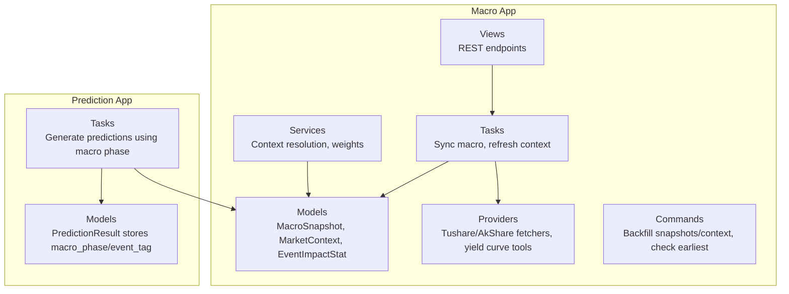
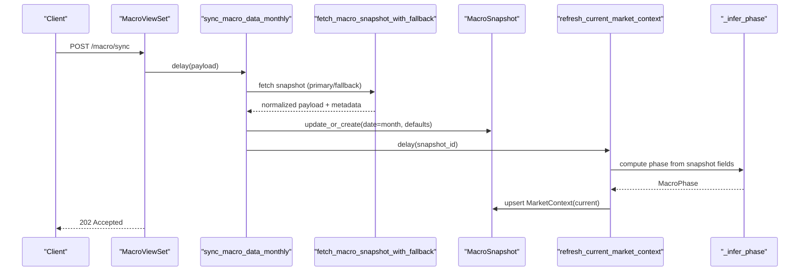
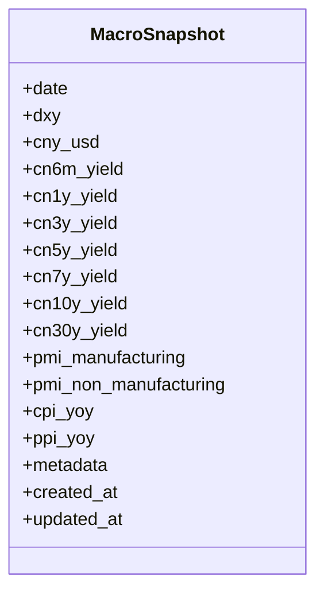
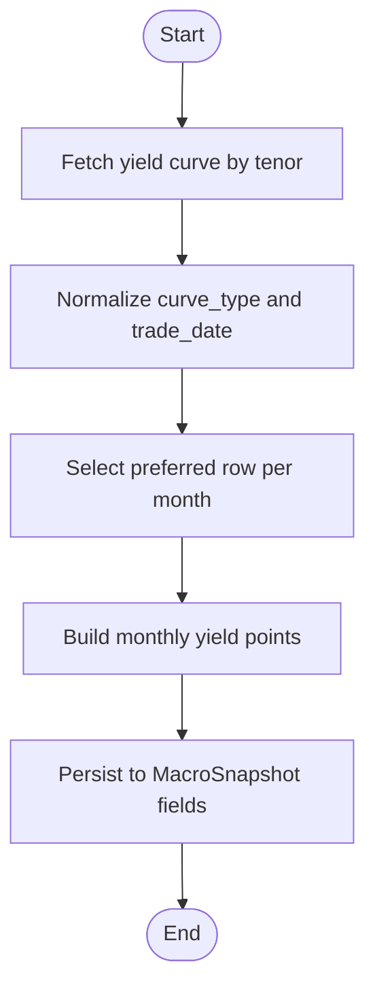
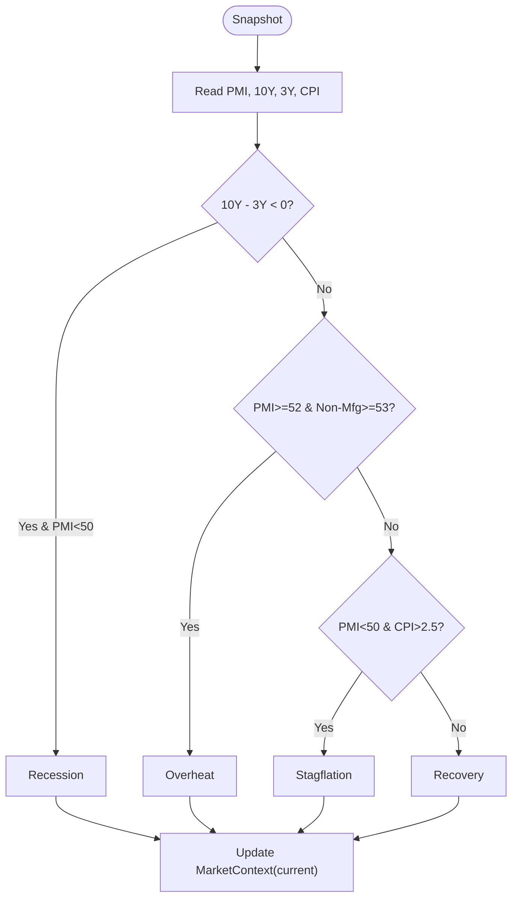
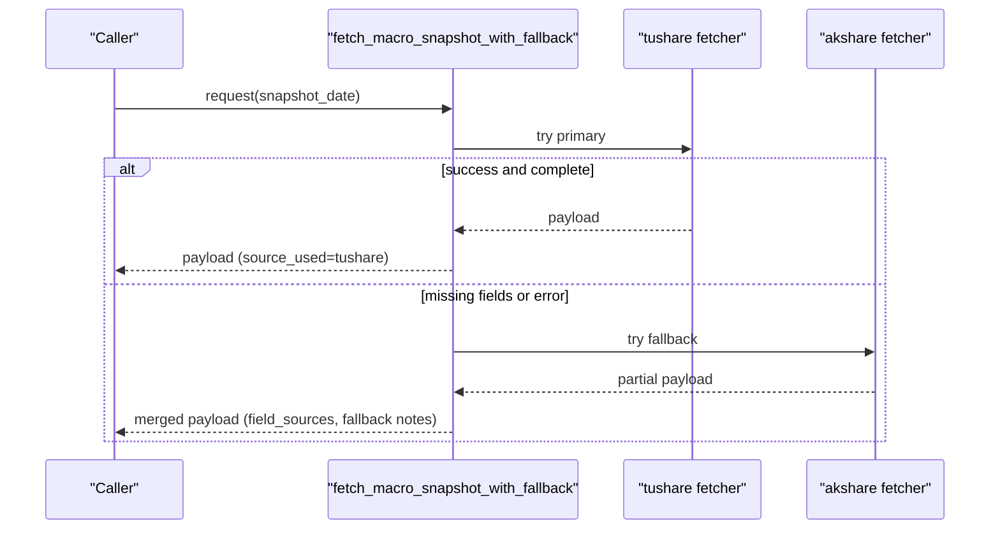
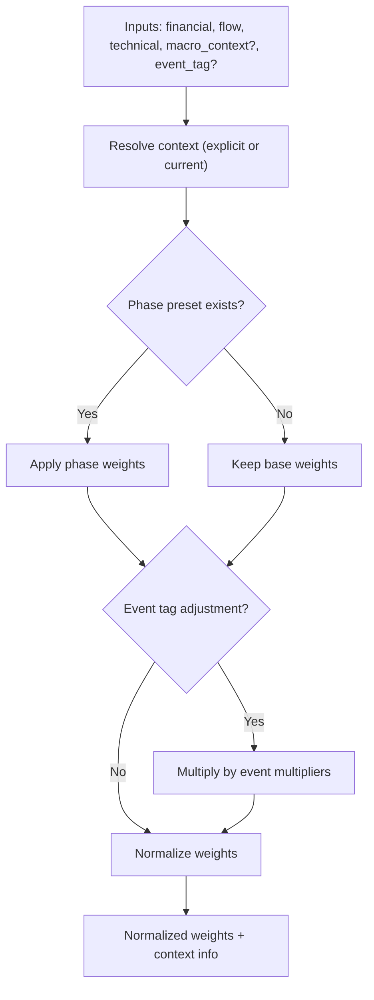
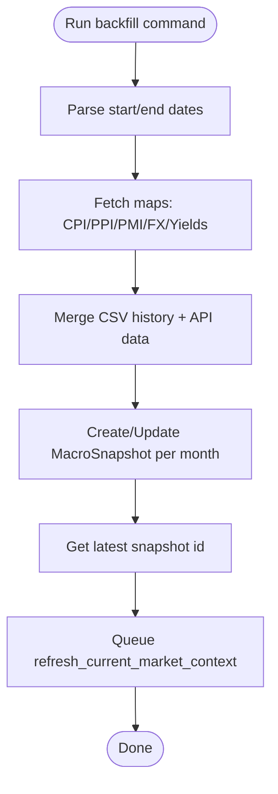
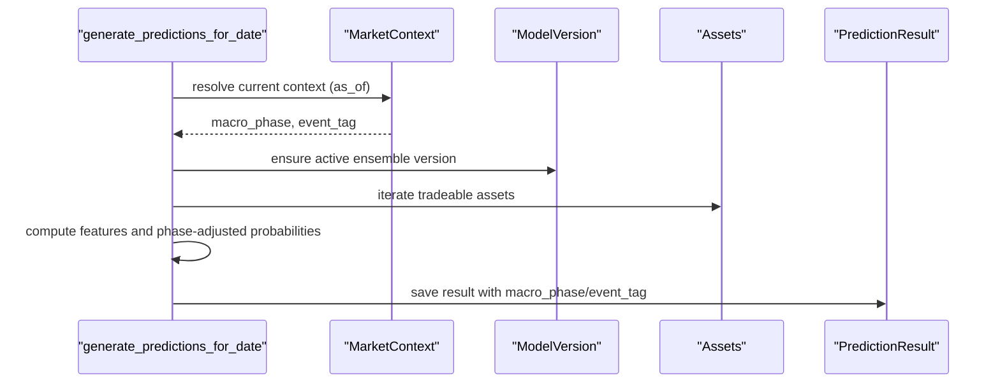
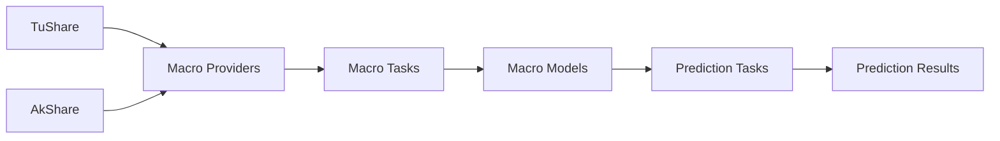

# Macro Application

<cite>
**Referenced Files in This Document**
- [models.py](file://apps/macro/models.py)
- [providers.py](file://apps/macro/providers.py)
- [services.py](file://apps/macro/services.py)
- [tasks.py](file://apps/macro/tasks.py)
- [views.py](file://apps/macro/views.py)
- [serializers.py](file://apps/macro/serializers.py)
- [backfill_macro_snapshots.py](file://apps/macro/management/commands/backfill_macro_snapshots.py)
- [backfill_market_context.py](file://apps/macro/management/commands/backfill_market_context.py)
- [check_earliest_data.py](file://apps/macro/management/commands/check_earliest_data.py)
- [tasks.py](file://apps/prediction/tasks.py)
- [models.py](file://apps/prediction/models.py)
</cite>

## Table of Contents
1. [Introduction](#introduction)
2. [Project Structure](#project-structure)
3. [Core Components](#core-components)
4. [Architecture Overview](#architecture-overview)
5. [Detailed Component Analysis](#detailed-component-analysis)
6. [Dependency Analysis](#dependency-analysis)
7. [Performance Considerations](#performance-considerations)
8. [Troubleshooting Guide](#troubleshooting-guide)
9. [Conclusion](#conclusion)
10. [Appendices](#appendices)

## Introduction
This document explains the Macro application that manages macroeconomic indicators and market regime analysis for forecasting. It covers:
- The MacroSnapshot model for monthly economic data including interest rates, inflation, GDP proxies, and monetary policy indicators.
- Yield surface modeling that tracks the term structure of interest rates and curve dynamics.
- Market context inference that classifies current economic regimes (recovery, overheat, stagflation, recession).
- A provider abstraction layer with fallback mechanisms across multiple macro data sources.
- Services that process raw macro data into standardized indicators and regime classifications.
- Management commands to backfill snapshots and market context history.
- Integration with prediction models that use macro factors for regime-aware forecasting.

## Project Structure
The Macro application is organized as a Django app with clear separation of concerns:
- Data models store snapshots, market context, and event impact statistics.
- Providers fetch macro data from external sources with normalization and fallback logic.
- Tasks orchestrate synchronization and market context updates via Celery.
- Services provide reusable utilities for context resolution and weight adjustments.
- Views expose REST endpoints and trigger background jobs.
- Serializers define API contracts.
- Management commands support historical backfills and diagnostics.

**Diagram sources**
- [models.py:5-77](file://apps/macro/models.py#L5-L77)
- [providers.py:10-664](file://apps/macro/providers.py#L10-L664)
- [services.py:6-90](file://apps/macro/services.py#L6-L90)
- [tasks.py:11-151](file://apps/macro/tasks.py#L11-L151)
- [views.py:14-60](file://apps/macro/views.py#L14-L60)
- [backfill_macro_snapshots.py:121-603](file://apps/macro/management/commands/backfill_macro_snapshots.py#L121-L603)
- [backfill_market_context.py:18-58](file://apps/macro/management/commands/backfill_market_context.py#L18-L58)
- [check_earliest_data.py:13-49](file://apps/macro/management/commands/check_earliest_data.py#L13-L49)
- [tasks.py:33-200](file://apps/prediction/tasks.py#L33-L200)
- [models.py:43-97](file://apps/prediction/models.py#L43-L97)

**Section sources**
- [models.py:5-77](file://apps/macro/models.py#L5-L77)
- [providers.py:10-664](file://apps/macro/providers.py#L10-L664)
- [services.py:6-90](file://apps/macro/services.py#L6-L90)
- [tasks.py:11-151](file://apps/macro/tasks.py#L11-L151)
- [views.py:14-60](file://apps/macro/views.py#L14-L60)
- [serializers.py:6-36](file://apps/macro/serializers.py#L6-L36)
- [backfill_macro_snapshots.py:121-603](file://apps/macro/management/commands/backfill_macro_snapshots.py#L121-L603)
- [backfill_market_context.py:18-58](file://apps/macro/management/commands/backfill_market_context.py#L18-L58)
- [check_earliest_data.py:13-49](file://apps/macro/management/commands/check_earliest_data.py#L13-L49)
- [tasks.py:33-200](file://apps/prediction/tasks.py#L33-L200)
- [models.py:43-97](file://apps/prediction/models.py#L43-L97)

## Core Components
- MacroSnapshot stores monthly macro indicators such as DXY, CNY/USD, China yield curve points (6M to 30Y), PMI manufacturing/non-manufacturing, CPI YoY, PPI YoY, plus metadata for provenance and errors.
- MarketContext captures the active macro phase (recovery, overheat, stagflation, recession), optional event tag, and temporal boundaries.
- EventImpactStat records historical return impacts for tagged events by sector and horizon.

Key responsibilities:
- Persist monthly macro snapshots with rich metadata about sources and field-level provenance.
- Maintain a single active market context per date window, updated automatically from macro data.
- Provide APIs and tasks to sync, refresh, and query macro state.

**Section sources**
- [models.py:5-77](file://apps/macro/models.py#L5-L77)
- [serializers.py:6-36](file://apps/macro/serializers.py#L6-L36)

## Architecture Overview
The system integrates data ingestion, normalization, persistence, and downstream usage:

**Diagram sources**
- [views.py:21-24](file://apps/macro/views.py#L21-L24)
- [tasks.py:91-151](file://apps/macro/tasks.py#L91-L151)
- [providers.py:540-615](file://apps/macro/providers.py#L540-L615)
- [models.py:31-57](file://apps/macro/models.py#L31-L57)

## Detailed Component Analysis

### MacroSnapshot Model
- Stores monthly macro data with unique date key and indexed ordering.
- Captures FX (DXY, CNY/USD), China yield curve tenors (6M–30Y), PMI, inflation metrics (CPI/PPI YoY), and JSON metadata for source tracking and error logs.
- Supports time-series queries and efficient retrieval by date.

**Diagram sources**
- [models.py:5-29](file://apps/macro/models.py#L5-L29)

**Section sources**
- [models.py:5-29](file://apps/macro/models.py#L5-L29)
- [serializers.py:6-15](file://apps/macro/serializers.py#L6-L15)

### Yield Surface Modeling
- Tracks the term structure via tenor-specific yield fields (6M to 30Y).
- Normalizes and selects preferred yield rows by curve type and trade date, building monthly points per tenor.
- Backfill supports both live API windows and historical CSVs to extend coverage before API availability.

**Diagram sources**
- [providers.py:179-228](file://apps/macro/providers.py#L179-L228)
- [providers.py:416-447](file://apps/macro/providers.py#L416-L447)
- [backfill_macro_snapshots.py:224-266](file://apps/macro/management/commands/backfill_macro_snapshots.py#L224-L266)
- [backfill_macro_snapshots.py:313-362](file://apps/macro/management/commands/backfill_macro_snapshots.py#L313-L362)

**Section sources**
- [providers.py:179-228](file://apps/macro/providers.py#L179-L228)
- [providers.py:416-447](file://apps/macro/providers.py#L416-L447)
- [backfill_macro_snapshots.py:224-266](file://apps/macro/management/commands/backfill_macro_snapshots.py#L224-L266)
- [backfill_macro_snapshots.py:313-362](file://apps/macro/management/commands/backfill_macro_snapshots.py#L313-L362)

### Market Context Inference System
- Infers macro phase from PMI, yield slope (10Y minus 3Y), and CPI thresholds.
- Updates the active MarketContext per snapshot date, closing previous periods and setting ends_at boundaries.
- Provides helpers to resolve explicit or current context and adjust feature weights by phase and event tags.

**Diagram sources**
- [tasks.py:11-35](file://apps/macro/tasks.py#L11-L35)
- [tasks.py:37-88](file://apps/macro/tasks.py#L37-L88)
- [services.py:51-90](file://apps/macro/services.py#L51-L90)

**Section sources**
- [tasks.py:11-88](file://apps/macro/tasks.py#L11-L88)
- [services.py:51-90](file://apps/macro/services.py#L51-L90)

### Provider Abstraction Layer
- Primary source: TuShare (yield curve, CPI, PPI, PMI, FX daily).
- Fallback source: AkShare (partial coverage; used when primary missing fields or fails).
- Robust normalization for quotes, curve types, and dates; retry wrappers with configurable attempts and sleep; detailed metadata capturing field sources, retries, and errors.

**Diagram sources**
- [providers.py:540-615](file://apps/macro/providers.py#L540-L615)
- [providers.py:359-485](file://apps/macro/providers.py#L359-L485)
- [providers.py:488-537](file://apps/macro/providers.py#L488-L537)

**Section sources**
- [providers.py:359-615](file://apps/macro/providers.py#L359-L615)

### Services Layer
- Resolves macro context from explicit parameters or active current context.
- Applies phase-based weight presets and event-tag adjustments to financial/flow/technical weights, normalizing them to sum to one.

**Diagram sources**
- [services.py:6-90](file://apps/macro/services.py#L6-L90)

**Section sources**
- [services.py:6-90](file://apps/macro/services.py#L6-L90)

### Management Commands
- Backfill MacroSnapshots:
  - Iterates monthly windows, pulls TuShare data with retries, merges with historical CSV yields and CNY/USD series, applies AkShare fallback for latest month if needed, persists snapshots, and triggers context refresh.
- Backfill MarketContext:
  - Replays inference over historical snapshots to create/update MarketContext entries with correct start/end dates.
- Check Earliest Data:
  - Probes source availability and local database ranges for macro and OHLCV data.

**Diagram sources**
- [backfill_macro_snapshots.py:121-603](file://apps/macro/management/commands/backfill_macro_snapshots.py#L121-L603)
- [backfill_market_context.py:18-58](file://apps/macro/management/commands/backfill_market_context.py#L18-L58)
- [check_earliest_data.py:13-49](file://apps/macro/management/commands/check_earliest_data.py#L13-L49)

**Section sources**
- [backfill_macro_snapshots.py:121-603](file://apps/macro/management/commands/backfill_macro_snapshots.py#L121-L603)
- [backfill_market_context.py:18-58](file://apps/macro/management/commands/backfill_market_context.py#L18-L58)
- [check_earliest_data.py:13-49](file://apps/macro/management/commands/check_earliest_data.py#L13-L49)

### API and Serialization
- MacroSnapshotViewSet: list snapshots, queue sync task.
- MarketContextViewSet: list contexts, get current, queue refresh.
- EventImpactStatViewSet: list stats filtered by event_tag.
- Serializers expose all relevant fields and display helpers.

**Section sources**
- [views.py:14-60](file://apps/macro/views.py#L14-L60)
- [serializers.py:6-36](file://apps/macro/serializers.py#L6-L36)

### Integration with Prediction Models
- Prediction tasks resolve macro phase and event tag at prediction time (current or as-of).
- Probabilities are adjusted based on macro phase (e.g., recession/down bias; recovery/up bias).
- Prediction results persist macro_phase and event_tag alongside probabilities and features.

**Diagram sources**
- [tasks.py:33-53](file://apps/prediction/tasks.py#L33-L53)
- [tasks.py:82-112](file://apps/prediction/tasks.py#L82-L112)
- [tasks.py:177-200](file://apps/prediction/tasks.py#L177-L200)
- [models.py:43-97](file://apps/prediction/models.py#L43-L97)

**Section sources**
- [tasks.py:33-112](file://apps/prediction/tasks.py#L33-L112)
- [tasks.py:177-200](file://apps/prediction/tasks.py#L177-L200)
- [models.py:43-97](file://apps/prediction/models.py#L43-L97)

## Dependency Analysis
- Macro app depends on:
  - External providers (TuShare, AkShare) for data ingestion.
  - Celery tasks for async processing.
  - Django ORM for persistence.
- Prediction app depends on:
  - Macro MarketContext for regime-aware probability adjustments.
  - Other apps (factors, sentiment, markets) for feature construction.

**Diagram sources**
- [providers.py:540-615](file://apps/macro/providers.py#L540-L615)
- [tasks.py:91-151](file://apps/macro/tasks.py#L91-L151)
- [models.py:31-57](file://apps/macro/models.py#L31-L57)
- [tasks.py:33-112](file://apps/prediction/tasks.py#L33-L112)
- [models.py:43-97](file://apps/prediction/models.py#L43-L97)

**Section sources**
- [providers.py:540-615](file://apps/macro/providers.py#L540-L615)
- [tasks.py:91-151](file://apps/macro/tasks.py#L91-L151)
- [models.py:31-57](file://apps/macro/models.py#L31-L57)
- [tasks.py:33-112](file://apps/prediction/tasks.py#L33-L112)
- [models.py:43-97](file://apps/prediction/models.py#L43-L97)

## Performance Considerations
- Use windowed fetching for yield curves and FX to respect rate limits and reduce payload sizes.
- Leverage retry wrappers with exponential backoff and configurable sleeps to handle transient failures.
- Prefer monthly aggregation to minimize writes and queries.
- Resume capabilities in backfill avoid reprocessing completed tenors.
- Metadata-driven provenance enables targeted re-runs without full recomputation.

[No sources needed since this section provides general guidance]

## Troubleshooting Guide
Common issues and remedies:
- Missing fields in latest snapshot:
  - Inspect metadata for field_sources, fallback_source, and fallback_fields to identify which fields were filled by fallback.
  - Verify provider configuration (tokens, network) and consider enabling/disabling fallback via settings.
- Yield curve gaps:
  - Check yield_sources and curve_type in metadata; confirm required_curve_type filtering.
  - Use resume-yields flag to continue from last successful tenor.
- No active market context:
  - Ensure at least one MacroSnapshot with PMI manufacturing exists; run backfill commands to populate history.
  - Trigger refresh_current_market_context manually via API or management command.
- Earliest data constraints:
  - Use check_earliest_data to compare source availability vs local DB ranges and project floor date.

**Section sources**
- [providers.py:231-357](file://apps/macro/providers.py#L231-L357)
- [providers.py:618-664](file://apps/macro/providers.py#L618-L664)
- [backfill_macro_snapshots.py:121-603](file://apps/macro/management/commands/backfill_macro_snapshots.py#L121-L603)
- [backfill_market_context.py:18-58](file://apps/macro/management/commands/backfill_market_context.py#L18-L58)
- [check_earliest_data.py:13-49](file://apps/macro/management/commands/check_earliest_data.py#L13-L49)

## Conclusion
The Macro application provides a robust pipeline for collecting, normalizing, and storing macroeconomic indicators, inferring market regimes, and feeding those signals into prediction models. Its provider abstraction with fallbacks, comprehensive metadata, and resilient backfill tools ensure high data quality and continuity. The integration with prediction tasks makes forecasts regime-aware, improving decision-making under varying macro conditions.

[No sources needed since this section summarizes without analyzing specific files]

## Appendices

### API Quick Reference
- MacroSnapshotViewSet:
  - List: GET /api/macro/macro-snapshots/
  - Sync: POST /api/macro/macro-snapshots/sync/
- MarketContextViewSet:
  - List: GET /api/macro/market-contexts/
  - Current: GET /api/macro/market-contexts/current/
  - Refresh: POST /api/macro/market-contexts/refresh/
- EventImpactStatViewSet:
  - List: GET /api/macro/event-impact-stats/?event_tag=...

**Section sources**
- [views.py:14-60](file://apps/macro/views.py#L14-L60)
- [serializers.py:6-36](file://apps/macro/serializers.py#L6-L36)