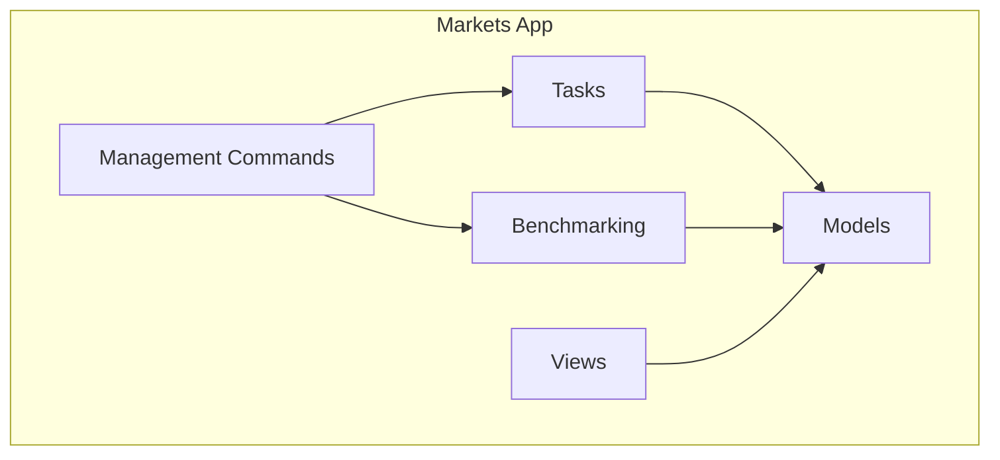
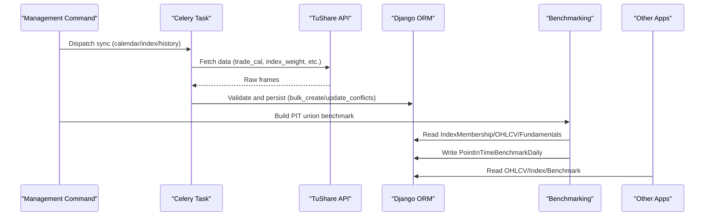
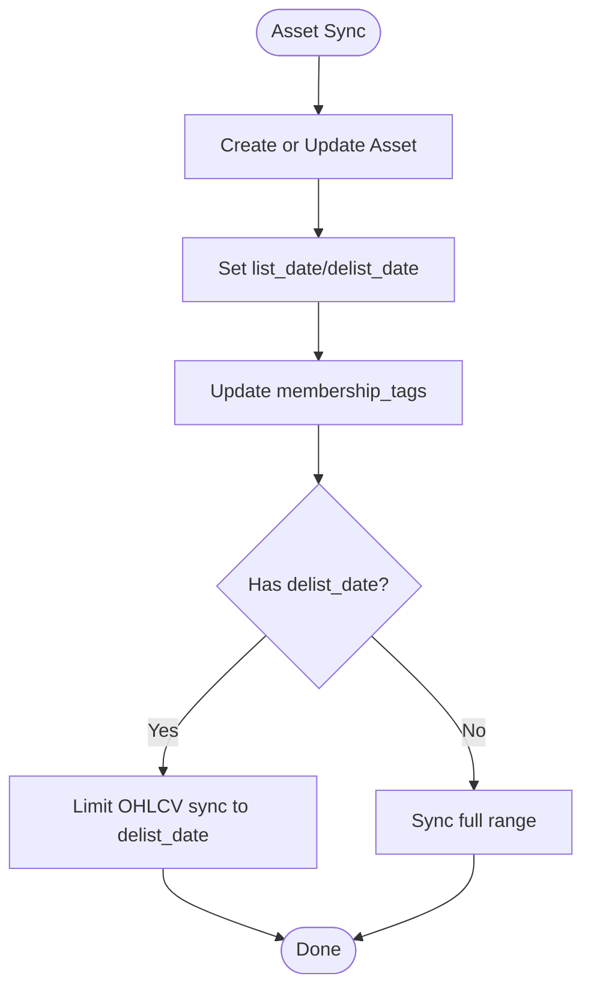
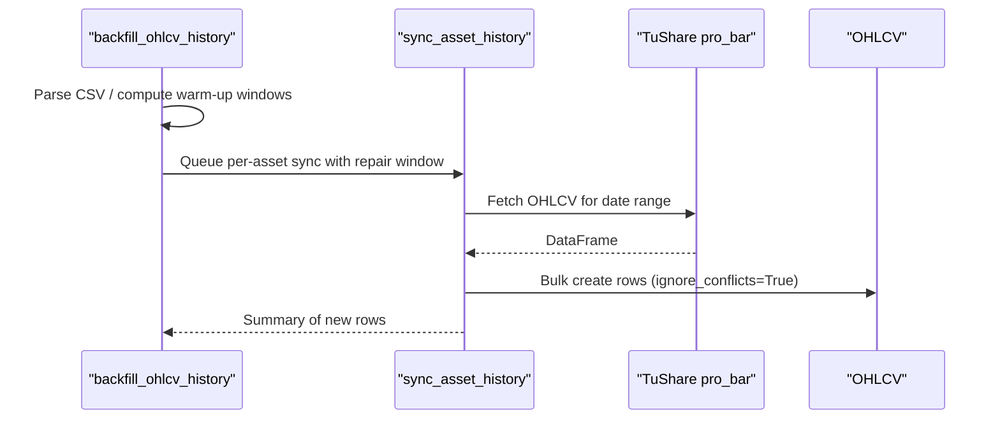
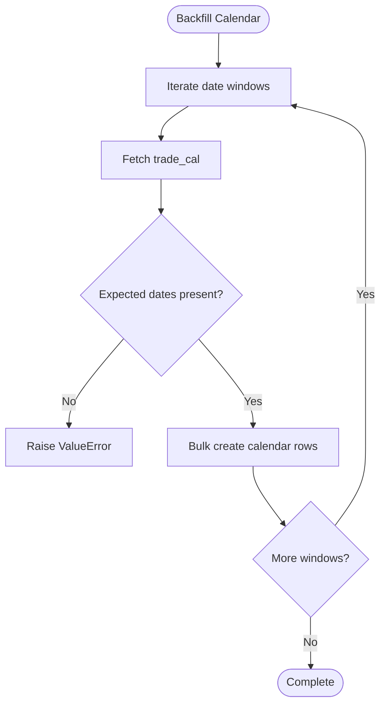
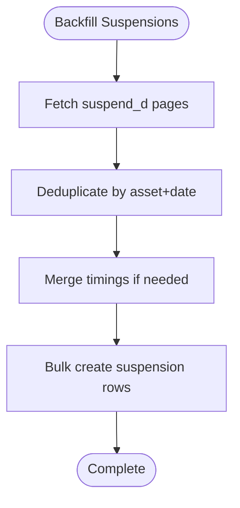
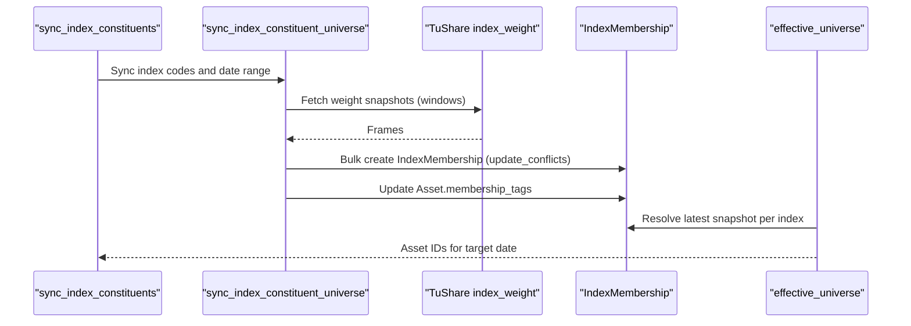
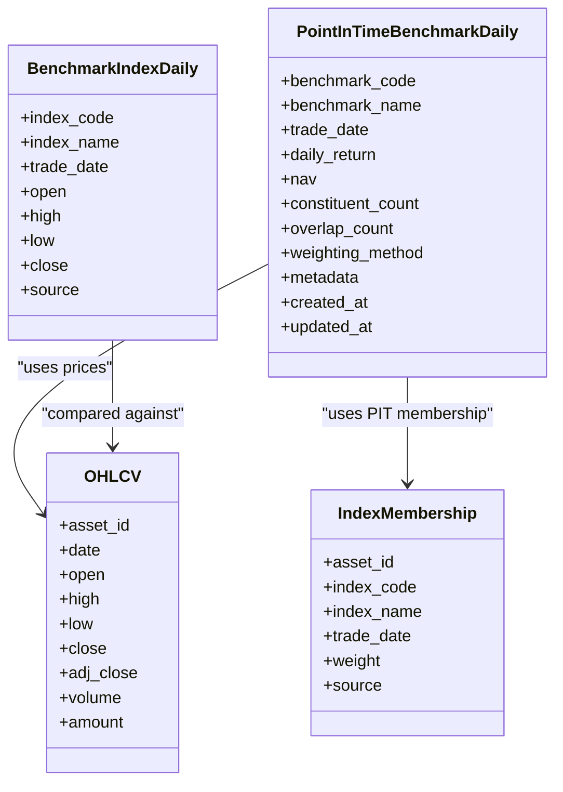
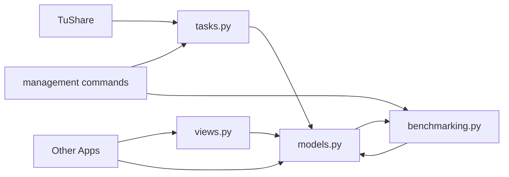

# Markets Application

<cite>
**Referenced Files in This Document**
- [models.py](file://apps/markets/models.py)
- [benchmarking.py](file://apps/markets/benchmarking.py)
- [tasks.py](file://apps/markets/tasks.py)
- [views.py](file://apps/markets/views.py)
- [serializers.py](file://apps/markets/serializers.py)
- [backfill_ohlcv_history.py](file://apps/markets/management/commands/backfill_ohlcv_history.py)
- [sync_index_constituents.py](file://apps/markets/management/commands/sync_index_constituents.py)
- [build_pit_union_benchmark.py](file://apps/markets/management/commands/build_pit_union_benchmark.py)
- [backfill_trading_calendar.py](file://apps/markets/management/commands/backfill_trading_calendar.py)
- [sync_benchmark_index_history.py](file://apps/markets/management/commands/sync_benchmark_index_history.py)
- [backfill_asset_suspensions.py](file://apps/markets/management/commands/backfill_asset_suspensions.py)
</cite>

## Table of Contents
1. [Introduction](#introduction)
2. [Project Structure](#project-structure)
3. [Core Components](#core-components)
4. [Architecture Overview](#architecture-overview)
5. [Detailed Component Analysis](#detailed-component-analysis)
6. [Dependency Analysis](#dependency-analysis)
7. [Performance Considerations](#performance-considerations)
8. [Troubleshooting Guide](#troubleshooting-guide)
9. [Conclusion](#conclusion)
10. [Appendices](#appendices)

## Introduction
The Markets application is the foundational data layer for FinanceAnalysis. It ingests, validates, and stores raw market data from upstream providers (TuShare), including asset master data, OHLCV price series, exchange calendars, suspensions, index constituents, official benchmark indices, and internal point-in-time union benchmarks. All other applications consume this app as a strict upstream source of truth for market data.

Key responsibilities:
- Maintain canonical asset lifecycle (listing to delisting) with membership tags and historical snapshots.
- Store daily OHLCV price history per asset with validated fields and temporal integrity.
- Track exchange trading days and asset suspension windows to ensure accurate time alignment.
- Persist official index history for backtesting comparisons.
- Build internal point-in-time union benchmarks combining CSI 300 and CSI A500 with free-float market cap weighting.
- Provide management commands to backfill and sync data, enforce coverage, and refresh derived metrics.

## Project Structure
The Markets app is organized around models, background tasks, benchmarking logic, API views, and management commands:
- Models define core entities: Market, Asset, OHLCV, ExchangeTradingCalendar, AssetSuspension, IndexMembership, BenchmarkIndexDaily, PointInTimeBenchmarkDaily.
- Tasks implement ingestion pipelines from TuShare and orchestrate fan-out workloads.
- Benchmarking defines the canonical effective universe contract and builds PIT union benchmarks.
- Views expose read-only APIs for markets, assets, and OHLCV.
- Management commands provide operational entry points for backfills and syncs.

**Diagram sources**
- [models.py:1-226](file://apps/markets/models.py#L1-L226)
- [tasks.py:1-1166](file://apps/markets/tasks.py#L1-L1166)
- [benchmarking.py:1-462](file://apps/markets/benchmarking.py#L1-L462)
- [views.py:1-106](file://apps/markets/views.py#L1-L106)
- [backfill_ohlcv_history.py:1-387](file://apps/markets/management/commands/backfill_ohlcv_history.py#L1-L387)

**Section sources**
- [models.py:1-226](file://apps/markets/models.py#L1-L226)
- [tasks.py:1-1166](file://apps/markets/tasks.py#L1-L1166)
- [benchmarking.py:1-462](file://apps/markets/benchmarking.py#L1-L462)
- [views.py:1-106](file://apps/markets/views.py#L1-L106)
- [backfill_ohlcv_history.py:1-387](file://apps/markets/management/commands/backfill_ohlcv_history.py#L1-L387)

## Core Components
This section documents the core data models and their roles in maintaining temporal consistency and data quality.

- Market: Canonical identifier for exchanges (e.g., SSE, SZSE, BSE).
- Asset: Represents tradable instruments with listing status, list/delist dates, and current membership tags.
- OHLCV: Daily price series per asset with open/high/low/close/adj_close/volume/amount; unique per asset-date.
- ExchangeTradingCalendar: Official exchange open/close days used for date alignment and gap detection.
- AssetSuspension: Per-asset suspension records indicating trading halts and timing; supports full-day flags.
- IndexMembership: Historical snapshot of index constituents and weights by trade date; enables point-in-time queries.
- BenchmarkIndexDaily: Official index daily history used for backtest comparisons.
- PointInTimeBenchmarkDaily: Internal union benchmark computed from CSI 300 + CSI A500 using free-float market cap weighting.

Data quality enforcement:
- Unique constraints on asset-date pairs and index-date pairs prevent duplicates.
- Validation of required fields during ingestion ensures completeness.
- Coverage checks fail fast when PIT membership is missing for requested dates.

**Section sources**
- [models.py:4-226](file://apps/markets/models.py#L4-L226)

## Architecture Overview
The Markets app follows a strict upstream data flow pattern:
- Ingestion: Background tasks pull data from TuShare (trade_cal, suspend_d, index_weight, index_daily, pro_bar).
- Persistence: Data is stored in canonical models with validation and deduplication.
- Derivation: Benchmarking computes PIT union benchmarks based on latest available memberships and fundamentals.
- Consumption: Other apps read from Markets via APIs or direct model access; they must not write market data.

**Diagram sources**
- [tasks.py:266-574](file://apps/markets/tasks.py#L266-L574)
- [tasks.py:649-888](file://apps/markets/tasks.py#L649-L888)
- [tasks.py:891-1166](file://apps/markets/tasks.py#L891-L1166)
- [benchmarking.py:312-462](file://apps/markets/benchmarking.py#L312-L462)

## Detailed Component Analysis

### Asset Lifecycle Management
Assets track listing status and dates, enabling correct inclusion/exclusion across time:
- ListingStatus choices: Active and Delisted.
- list_date and delist_date sourced from provider metadata.
- membership_tags reflect current managed index memberships (CSI300, CSIA500).

Lifecycle operations:
- Creation/Update: During constituent sync, assets are created or updated with latest metadata.
- Delisting: When delist_date is set, OHLCV sync stops at that date.
- Tags: Updated monthly or on changes to maintain current union membership.

**Diagram sources**
- [tasks.py:754-796](file://apps/markets/tasks.py#L754-L796)
- [tasks.py:950-967](file://apps/markets/tasks.py#L950-L967)

**Section sources**
- [models.py:19-63](file://apps/markets/models.py#L19-L63)
- [tasks.py:754-796](file://apps/markets/tasks.py#L754-L796)
- [tasks.py:950-967](file://apps/markets/tasks.py#L950-L967)

### OHLCV Price Data Storage
OHLCV stores daily price series with validated numeric fields and amounts:
- Unique constraint per asset-date prevents duplicates.
- Ingestion uses bulk_create with ignore_conflicts for idempotency.
- Suspension handling excludes suspended days from continuity gaps where applicable.

Backfill workflow:
- Command parses CSV repairs or computes effective-universe warm-up windows.
- Dispatches per-asset sync tasks with repair windows and listing metadata.
- Enforces historical floor unless explicitly allowed for warm-up prefill.

**Diagram sources**
- [backfill_ohlcv_history.py:85-191](file://apps/markets/management/commands/backfill_ohlcv_history.py#L85-L191)
- [tasks.py:891-1021](file://apps/markets/tasks.py#L891-L1021)

**Section sources**
- [models.py:201-226](file://apps/markets/models.py#L201-L226)
- [backfill_ohlcv_history.py:1-387](file://apps/markets/management/commands/backfill_ohlcv_history.py#L1-L387)
- [tasks.py:891-1021](file://apps/markets/tasks.py#L891-L1021)

### Exchange Trading Calendar
ExchangeTradingCalendar captures official open/close days per exchange:
- Backfilled from trade_cal with windowed requests to avoid truncation.
- Validates expected calendar dates and refuses partial replacements.
- Used by downstream processes to align OHLCV and benchmark calculations.

**Diagram sources**
- [tasks.py:266-352](file://apps/markets/tasks.py#L266-L352)

**Section sources**
- [models.py:65-85](file://apps/markets/models.py#L65-L85)
- [tasks.py:266-352](file://apps/markets/tasks.py#L266-L352)
- [backfill_trading_calendar.py:1-32](file://apps/markets/management/commands/backfill_trading_calendar.py#L1-L32)

### Asset Suspension Handling
AssetSuspension records daily suspension events with type and timing:
- Supports full-day and timed suspensions; merges timings and prefers full-day flags.
- Backfilled in windows with pagination and deduplication.
- Used to reconcile overlaps with OHLCV continuity gaps.

**Diagram sources**
- [tasks.py:355-488](file://apps/markets/tasks.py#L355-L488)

**Section sources**
- [models.py:87-115](file://apps/markets/models.py#L87-L115)
- [tasks.py:355-488](file://apps/markets/tasks.py#L355-L488)
- [backfill_asset_suspensions.py:1-43](file://apps/markets/management/commands/backfill_asset_suspensions.py#L1-L43)

### IndexMembership and Point-in-Time Integrity
IndexMembership stores historical index constituents and weights:
- Backfilled from index_weight with small windows to respect provider limits.
- Membership tags on Asset reflect current managed indices (CSI300, CSIA500).
- Effective universe resolution uses latest available snapshot per index for each target date.

Coverage enforcement:
- required_pit_index_codes_for_date enforces CSI 300 from 2010-01-04 and CSI A500 from 2024-09-23.
- pit_membership_coverage_gaps identifies missing snapshots; ensure_pit_membership_coverage fails fast.

**Diagram sources**
- [tasks.py:649-888](file://apps/markets/tasks.py#L649-L888)
- [benchmarking.py:65-157](file://apps/markets/benchmarking.py#L65-L157)

**Section sources**
- [models.py:117-145](file://apps/markets/models.py#L117-L145)
- [tasks.py:649-888](file://apps/markets/tasks.py#L649-L888)
- [benchmarking.py:65-157](file://apps/markets/benchmarking.py#L65-L157)
- [sync_index_constituents.py:1-76](file://apps/markets/management/commands/sync_index_constituents.py#L1-L76)

### BenchmarkIndexDaily and Internal Union Benchmarks
BenchmarkIndexDaily stores official index daily history:
- Backfilled from index_daily with upsert semantics.
- Used for external benchmark comparisons in backtests.

Internal PIT union benchmark:
- Combines CSI 300 and CSI A500 constituents at each date using free-float market cap weighting.
- Weights derived from latest fundamental snapshots (free_share * close or circ_mv).
- Stored in PointInTimeBenchmarkDaily with NAV progression and metadata.

**Diagram sources**
- [models.py:147-199](file://apps/markets/models.py#L147-L199)
- [benchmarking.py:285-462](file://apps/markets/benchmarking.py#L285-L462)

**Section sources**
- [models.py:147-199](file://apps/markets/models.py#L147-L199)
- [tasks.py:491-574](file://apps/markets/tasks.py#L491-L574)
- [benchmarking.py:285-462](file://apps/markets/benchmarking.py#L285-L462)
- [build_pit_union_benchmark.py:1-43](file://apps/markets/management/commands/build_pit_union_benchmark.py#L1-L43)

### API Exposure
Read-only APIs expose markets, assets, and OHLCV:
- MarketViewSet: List/retrieve markets with caching.
- AssetViewSet: Filter by market code and listing status; search by symbol/ts_code/name.
- OHLCVViewSet: Filter by asset and date range; order by date descending.

Caching strategies reduce load for frequently accessed endpoints.

**Section sources**
- [views.py:16-106](file://apps/markets/views.py#L16-L106)
- [serializers.py:5-50](file://apps/markets/serializers.py#L5-L50)

## Dependency Analysis
The Markets app has clear dependency boundaries:
- Upstream: TuShare provider via tasks; configuration via settings.
- Downstream: Other apps consume OHLCV, IndexMembership, and benchmarks via models or APIs.
- Internal: Benchmarking depends on IndexMembership, OHLCV, and FundamentalFactorSnapshot.

**Diagram sources**
- [tasks.py:1-1166](file://apps/markets/tasks.py#L1-L1166)
- [models.py:1-226](file://apps/markets/models.py#L1-L226)
- [benchmarking.py:1-462](file://apps/markets/benchmarking.py#L1-L462)
- [views.py:1-106](file://apps/markets/views.py#L1-L106)

**Section sources**
- [tasks.py:1-1166](file://apps/markets/tasks.py#L1-L1166)
- [models.py:1-226](file://apps/markets/models.py#L1-L226)
- [benchmarking.py:1-462](file://apps/markets/benchmarking.py#L1-L462)

## Performance Considerations
- Batch operations: bulk_create with batch_size optimizes writes for large datasets.
- Windowed requests: Date windows prevent provider limits and reduce memory pressure.
- Deduplication: update_conflicts and ignore_conflicts ensure idempotent updates.
- Caching: ViewSets cache frequent reads to reduce database load.
- Fan-out: Celery chords coordinate post-sync refreshes after asset sync completes.

[No sources needed since this section provides general guidance]

## Troubleshooting Guide
Common issues and resolutions:
- Missing PIT membership coverage: Ensure IndexMembership backfill covers required dates; use sync_index_constituents with appropriate ranges.
- Rate limiting from provider: Tasks include retry logic with sleep intervals; adjust window sizes if necessary.
- Invalid date ranges: Commands validate start/end dates; ensure end >= start and within supported ranges.
- Partial calendar responses: Calendar backfill raises errors if expected dates are missing; re-run with corrected windows.

Operational commands:
- backfill_ohlcv_history: Repair gaps or prefill warm-up windows for technical indicators.
- sync_index_constituents: Refresh constituents and dispatch asset syncs.
- build_pit_union_benchmark: Rebuild internal union benchmark over a date range.
- backfill_trading_calendar: Populate exchange calendars.
- sync_benchmark_index_history: Update official index history.
- backfill_asset_suspensions: Backfill suspension records.

**Section sources**
- [backfill_ohlcv_history.py:29-45](file://apps/markets/management/commands/backfill_ohlcv_history.py#L29-L45)
- [sync_index_constituents.py:12-38](file://apps/markets/management/commands/sync_index_constituents.py#L12-L38)
- [build_pit_union_benchmark.py:12-16](file://apps/markets/management/commands/build_pit_union_benchmark.py#L12-L16)
- [backfill_trading_calendar.py:12-16](file://apps/markets/management/commands/backfill_trading_calendar.py#L12-L16)
- [sync_benchmark_index_history.py:9-27](file://apps/markets/management/commands/sync_benchmark_index_history.py#L9-L27)
- [backfill_asset_suspensions.py:14-18](file://apps/markets/management/commands/backfill_asset_suspensions.py#L14-L18)

## Conclusion
The Markets application provides a robust, validated foundation for market data in FinanceAnalysis. Its strict upstream data flow, comprehensive lifecycle management, and point-in-time integrity ensure accurate financial analysis and backtesting. Management commands enable efficient backfills and syncs, while benchmarking constructs reliable internal unions for performance evaluation.

[No sources needed since this section summarizes without analyzing specific files]

## Appendices

### Management Commands Reference
- backfill_ohlcv_history: Backfill OHLCV from floor date or CSV repairs; supports technical indicator warm-up and effective-universe entry warm-up.
- sync_index_constituents: Sync CSI 300 + CSI A500 constituents; persist membership history; dispatch asset syncs.
- build_pit_union_benchmark: Build or refresh internal PIT union benchmark over a date range.
- backfill_trading_calendar: Backfill exchange trading calendar from trade_cal.
- sync_benchmark_index_history: Sync official benchmark index history from index_daily.
- backfill_asset_suspensions: Backfill asset suspension data from suspend_d.

**Section sources**
- [backfill_ohlcv_history.py:25-45](file://apps/markets/management/commands/backfill_ohlcv_history.py#L25-L45)
- [sync_index_constituents.py:9-38](file://apps/markets/management/commands/sync_index_constituents.py#L9-L38)
- [build_pit_union_benchmark.py:9-16](file://apps/markets/management/commands/build_pit_union_benchmark.py#L9-L16)
- [backfill_trading_calendar.py:9-16](file://apps/markets/management/commands/backfill_trading_calendar.py#L9-L16)
- [sync_benchmark_index_history.py:6-27](file://apps/markets/management/commands/sync_benchmark_index_history.py#L6-L27)
- [backfill_asset_suspensions.py:11-18](file://apps/markets/management/commands/backfill_asset_suspensions.py#L11-L18)