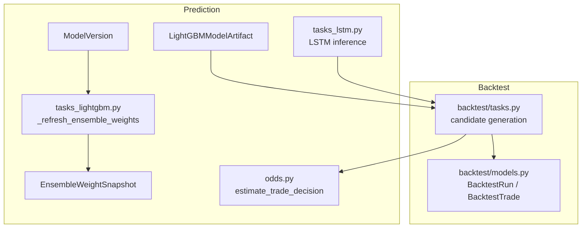
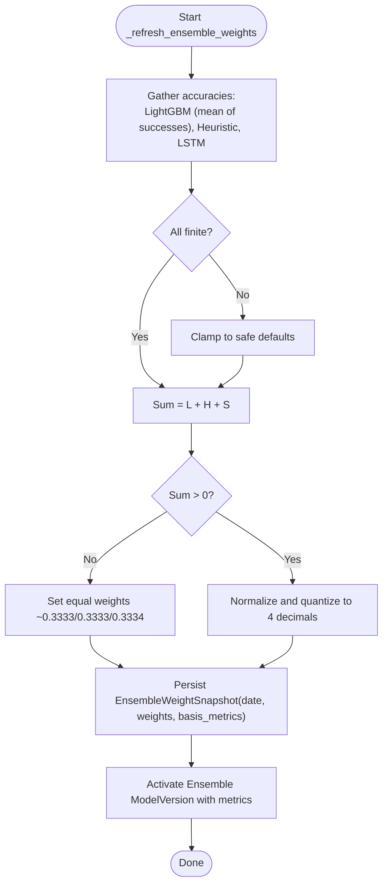
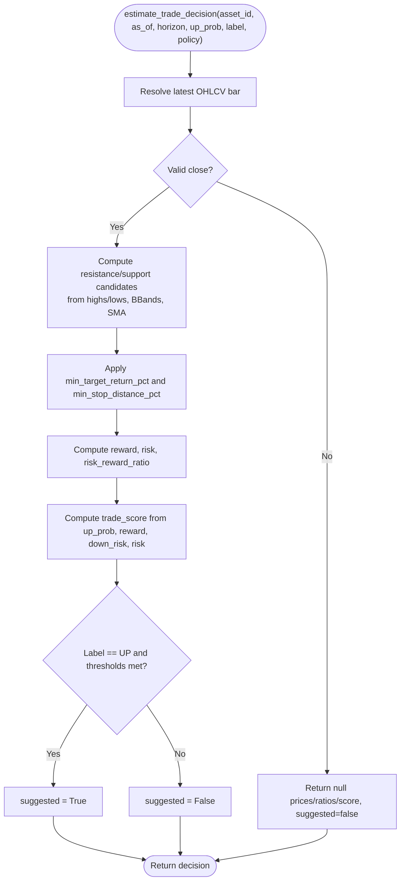
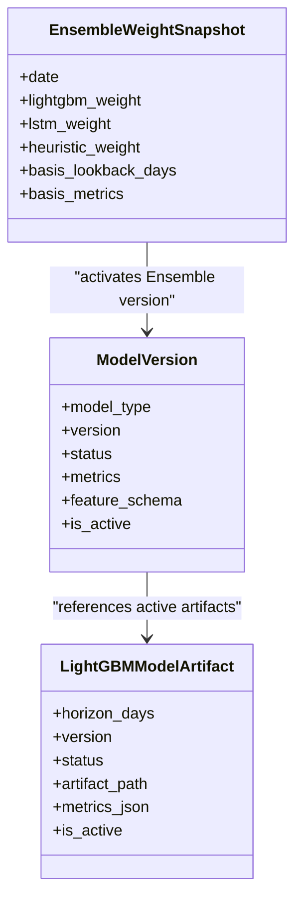
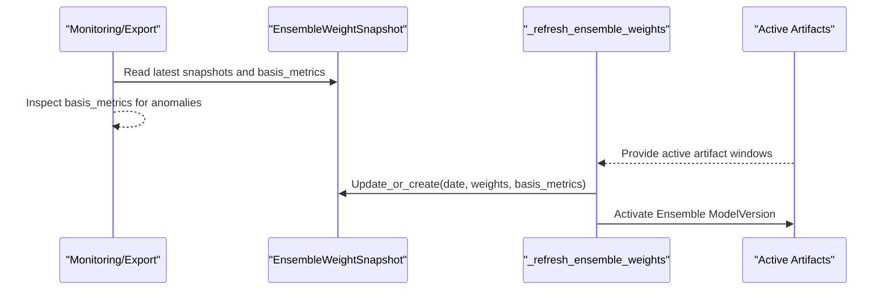
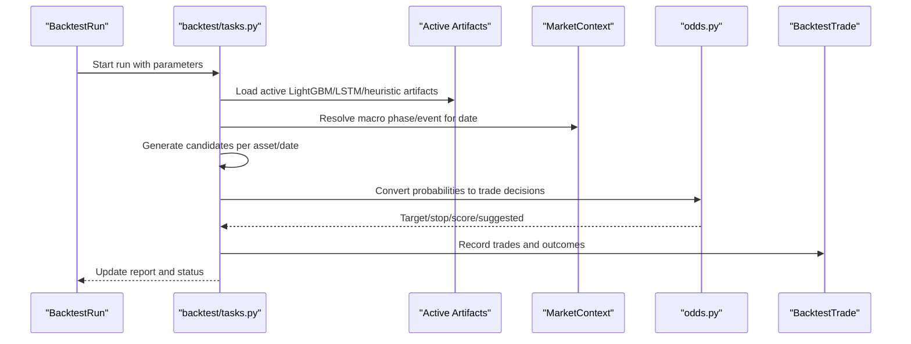
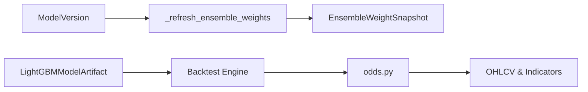

# Ensemble Weighting System

<cite>
**Referenced Files in This Document**
- [models.py](file://apps/prediction/models.py)
- [models_lightgbm.py](file://apps/prediction/models_lightgbm.py)
- [odds.py](file://apps/prediction/odds.py)
- [tasks_lightgbm.py](file://apps/prediction/tasks_lightgbm.py)
- [tasks_lstm.py](file://apps/prediction/tasks_lstm.py)
- [tasks.py](file://apps/backtest/tasks.py)
- [models.py](file://apps/backtest/models.py)
- [TECHNICAL_GUIDE.md](file://TECHNICAL_GUIDE.md)
- [BACKLOG.md](file://BACKLOG.md)
- [export_documentation_facts.py](file://apps/core/management/commands/export_documentation_facts.py)
</cite>

## Table of Contents
1. [Introduction](#introduction)
2. [Project Structure](#project-structure)
3. [Core Components](#core-components)
4. [Architecture Overview](#architecture-overview)
5. [Detailed Component Analysis](#detailed-component-analysis)
6. [Dependency Analysis](#dependency-analysis)
7. [Performance Considerations](#performance-considerations)
8. [Troubleshooting Guide](#troubleshooting-guide)
9. [Conclusion](#conclusion)
10. [Appendices](#appendices)

## Introduction
This document explains the ensemble weighting system that combines predictions from three model families: heuristic, LightGBM, and LSTM. It covers how dynamic weights are tracked over time via the EnsembleWeightSnapshot model, how raw probabilities are converted into calibrated trading signals with risk-aware thresholds, how weights are optimized using rolling performance metrics and market context, how ensemble outputs are aggregated while preserving uncertainty, and how performance monitoring triggers weight rebalancing. It also documents configuration options for ensemble strategies and their integration with backtesting for strategy validation.

## Project Structure
The ensemble system spans several modules:
- Prediction models define persistent artifacts, predictions, and ensemble snapshots.
- Odds conversion transforms probabilities into actionable trade decisions with target/stop levels and scores.
- Task pipelines compute model-specific predictions and refresh ensemble weights based on recent accuracy.
- Backtest engine recomputes candidates at runtime using active artifacts and integrates macro context and fee models.



**Diagram sources**
- [models.py:7-31](file://apps/prediction/models.py#L7-L31)
- [models_lightgbm.py:7-38](file://apps/prediction/models_lightgbm.py#L7-L38)
- [models_lightgbm.py:97-110](file://apps/prediction/models_lightgbm.py#L97-L110)
- [odds.py:60-158](file://apps/prediction/odds.py#L60-L158)
- [tasks_lightgbm.py:631-729](file://apps/prediction/tasks_lightgbm.py#L631-L729)
- [tasks_lstm.py:184-200](file://apps/prediction/tasks_lstm.py#L184-L200)
- [tasks.py:1-37](file://apps/backtest/tasks.py#L1-L37)
- [models.py:24-117](file://apps/backtest/models.py#L24-L117)

**Section sources**
- [models.py:7-31](file://apps/prediction/models.py#L7-L31)
- [models_lightgbm.py:7-38](file://apps/prediction/models_lightgbm.py#L7-L38)
- [models_lightgbm.py:97-110](file://apps/prediction/models_lightgbm.py#L97-L110)
- [odds.py:60-158](file://apps/prediction/odds.py#L60-L158)
- [tasks_lightgbm.py:631-729](file://apps/prediction/tasks_lightgbm.py#L631-L729)
- [tasks_lstm.py:184-200](file://apps/prediction/tasks_lstm.py#L184-L200)
- [tasks.py:1-37](file://apps/backtest/tasks.py#L1-L37)
- [models.py:24-117](file://apps/backtest/models.py#L24-L117)

## Core Components
- EnsembleWeightSnapshot: Stores daily ensemble weights (LightGBM, LSTM, heuristic), lookback window length, and basis metrics used to derive weights.
- ModelVersion and LightGBMModelArtifact: Registry of trained models and artifacts; active versions drive inference and weight computation.
- Odds conversion: Converts per-model up-probability into target price, stop loss, risk-reward ratio, trade score, and a binary suggestion flag.
- Weight refresh: Computes rolling accuracies across models and writes normalized weights to EnsembleWeightSnapshot and an active Ensemble ModelVersion.
- Backtest integration: Recomputes candidates at runtime using active artifacts, applies macro context adjustments, and enforces fees and exit logic.

**Section sources**
- [models_lightgbm.py:97-110](file://apps/prediction/models_lightgbm.py#L97-L110)
- [models.py:7-31](file://apps/prediction/models.py#L7-L31)
- [models_lightgbm.py:7-38](file://apps/prediction/models_lightgbm.py#L7-L38)
- [odds.py:60-158](file://apps/prediction/odds.py#L60-L158)
- [tasks_lightgbm.py:631-729](file://apps/prediction/tasks_lightgbm.py#L631-L729)
- [tasks.py:1-37](file://apps/backtest/tasks.py#L1-L37)

## Architecture Overview
The ensemble pipeline operates in two phases:
- Training and retraining: Each model family produces predictions and metrics; the weight refresh function aggregates recent accuracies and updates ensemble weights and the active ensemble version.
- Inference and backtesting: The backtest engine recomputes candidate signals per date using active artifacts, converts probabilities to trade decisions, and simulates trades with realistic fees and exits.

```mermaid
sequenceDiagram
participant Retrain as "Retraining Tasks"
participant Weights as "_refresh_ensemble_weights"
participant DB as "Django Models"
participant BT as "Backtest Engine"
participant Odds as "estimate_trade_decision"
Retrain->>Weights : Provide per-model accuracies
Weights->>DB : Write EnsembleWeightSnapshot(date, weights, basis_metrics)
Weights->>DB : Activate Ensemble ModelVersion with metrics
Note over We,DB : Snapshot is retrospective; active version marks latest ensemble state
BT->>BT : For each trading day, generate candidates from active artifacts
BT->>Odds : Convert up_probability to target/stop/score/suggested
Odds-->>BT : Trade decision payload
BT->>DB : Record BacktestRun and BacktestTrade ledger
```

**Diagram sources**
- [tasks_lightgbm.py:631-729](file://apps/prediction/tasks_lightgbm.py#L631-L729)
- [odds.py:60-158](file://apps/prediction/odds.py#L60-L158)
- [tasks.py:1-37](file://apps/backtest/tasks.py#L1-L37)
- [models_lightgbm.py:97-110](file://apps/prediction/models_lightgbm.py#L97-L110)
- [models.py:7-31](file://apps/prediction/models.py#L7-L31)

## Detailed Component Analysis

### EnsembleWeightSnapshot and Weight Optimization
- Purpose: Track daily ensemble weights and the underlying basis metrics used to compute them.
- Inputs: Recent accuracies for LightGBM, LSTM, and heuristic models.
- Algorithm:
  - Compute mean accuracy for LightGBM from successful results; use stored metrics for heuristic and LSTM.
  - Normalize to sum to 1; quantize to four decimals.
  - Fallback to near-equal weights when no usable accuracy exists.
  - Persist snapshot and activate corresponding Ensemble ModelVersion.
- Lookback: Fixed at 60 days for basis metrics.



**Diagram sources**
- [tasks_lightgbm.py:631-729](file://apps/prediction/tasks_lightgbm.py#L631-L729)

**Section sources**
- [tasks_lightgbm.py:631-729](file://apps/prediction/tasks_lightgbm.py#L631-L729)
- [models_lightgbm.py:97-110](file://apps/prediction/models_lightgbm.py#L97-L110)
- [TECHNICAL_GUIDE.md:436-454](file://TECHNICAL_GUIDE.md#L436-L454)

### Odds Calculation and Risk Assessment
- Purpose: Convert raw model probabilities into calibrated trading signals with explicit risk controls.
- Inputs: Asset ID, as-of date, horizon days, up_probability, predicted_label, optional policy options.
- Logic:
  - Resolve latest OHLCV bar; if missing or invalid close, return null targets and suggested=false.
  - Build resistance candidates from recent highs, Bollinger upper band, and optionally a rounded ceiling near current price.
  - Build support candidates from recent lows, Bollinger lower band, and moving average support.
  - Apply policy floors/ceilings for target and stop distances.
  - Compute reward/risk and trade_score; mark suggested only if label is UP and thresholds met.
- Outputs: target_price, stop_loss_price, risk_reward_ratio, trade_score, suggested.



**Diagram sources**
- [odds.py:60-158](file://apps/prediction/odds.py#L60-L158)

**Section sources**
- [odds.py:60-158](file://apps/prediction/odds.py#L60-L158)
- [TECHNICAL_GUIDE.md:461-493](file://TECHNICAL_GUIDE.md#L461-L493)

### Ensemble Prediction Aggregation and Uncertainty
- Aggregation method: Weights are derived from recent model accuracies and applied to combine model contributions. The active Ensemble ModelVersion carries aggregate metrics and feature schema for reporting.
- Uncertainty: Per-model probabilities are preserved; odds conversion uses up_probability explicitly in trade_score and thresholding, providing a direct measure of confidence for signal selection.
- Monitoring: EnsembleWeightSnapshot records basis_metrics (per-model accuracy) enabling retrospective analysis of why certain weights were chosen.



**Diagram sources**
- [models_lightgbm.py:97-110](file://apps/prediction/models_lightgbm.py#L97-L110)
- [models.py:7-31](file://apps/prediction/models.py#L7-L31)
- [models_lightgbm.py:7-38](file://apps/prediction/models_lightgbm.py#L7-L38)

**Section sources**
- [tasks_lightgbm.py:631-729](file://apps/prediction/tasks_lightgbm.py#L631-L729)
- [models_lightgbm.py:97-110](file://apps/prediction/models_lightgbm.py#L97-L110)
- [models.py:7-31](file://apps/prediction/models.py#L7-L31)

### Performance Monitoring and Rebalancing Triggers
- Monitoring: EnsembleWeightSnapshot captures basis_metrics and weights per date; export commands surface recent snapshots for review.
- Rebalancing: Triggered by retraining tasks that call weight refresh; ensures weights reflect the most recent 60-day accuracy profile.
- Caveats: Historical snapshots may encode inflated accuracy if leaked artifacts were active; always inspect basis columns before trusting a snapshot.



**Diagram sources**
- [export_documentation_facts.py:473-502](file://apps/core/management/commands/export_documentation_facts.py#L473-L502)
- [tasks_lightgbm.py:631-729](file://apps/prediction/tasks_lightgbm.py#L631-L729)

**Section sources**
- [export_documentation_facts.py:473-502](file://apps/core/management/commands/export_documentation_facts.py#L473-L502)
- [BACKLOG.md:242-249](file://BACKLOG.md#L242-L249)
- [tasks_lightgbm.py:631-729](file://apps/prediction/tasks_lightgbm.py#L631-L729)

### Configuration Options for Ensemble Strategies
- Backtest parameters live in BacktestRun.parameters and include:
  - prediction_source: heuristic, lightgbm, lstm
  - lightgbm_inference_backend: auto, cpu_serial, cpu_batched, windows_gpu
  - lightgbm_batch_size: integer batch size for LightGBM inference
  - trade_decision_policy: include_near_round_target, min_target_return_pct, min_stop_distance_pct
  - trade_score_scope: independent or combined
  - candidate_mode: top_n or trade_score
  - top_n_metric and horizon mapping
  - enable_stop_target_exit, use_macro_context
  - chunk_trading_days for resumable runs
- Validation: Serializers enforce allowed values and types for these parameters.

**Section sources**
- [tasks.py:90-131](file://apps/backtest/tasks.py#L90-L131)
- [tasks.py:614-678](file://apps/backtest/tasks.py#L614-L678)
- [models.py:24-117](file://apps/backtest/models.py#L24-L117)

### Integration with Backtesting for Strategy Validation
- Candidate generation: Backtest engine recomputes candidates per trading date using active artifacts and features, ensuring comparability across runs.
- Macro context: Resolves MarketContext for each date and applies multipliers to influence candidate strength.
- Fees and exits: Applies CN A-share fee schedule and conservative exit semantics (stop preferred over target on same bar).
- Persistence: Records BacktestRun and BacktestTrade rows with detailed signal payloads for auditability.



**Diagram sources**
- [tasks.py:1-37](file://apps/backtest/tasks.py#L1-L37)
- [tasks.py:567-611](file://apps/backtest/tasks.py#L567-L611)
- [odds.py:60-158](file://apps/prediction/odds.py#L60-L158)
- [models.py:24-117](file://apps/backtest/models.py#L24-L117)

**Section sources**
- [tasks.py:1-37](file://apps/backtest/tasks.py#L1-L37)
- [tasks.py:567-611](file://apps/backtest/tasks.py#L567-L611)
- [odds.py:60-158](file://apps/prediction/odds.py#L60-L158)
- [models.py:24-117](file://apps/backtest/models.py#L24-L117)

## Dependency Analysis
- ModelVersion and LightGBMModelArtifact provide the registry for active models and artifacts consumed by both training and backtesting.
- EnsembleWeightSnapshot depends on recent accuracies from all three model families and persists normalized weights and basis metrics.
- Backtest engine depends on active artifacts and macro context; it does not read historical predictions to avoid leakage and ensure fair comparisons.
- Odds conversion depends on OHLCV and technical indicators to set risk-aware targets and stops.



**Diagram sources**
- [models.py:7-31](file://apps/prediction/models.py#L7-L31)
- [models_lightgbm.py:7-38](file://apps/prediction/models_lightgbm.py#L7-L38)
- [tasks_lightgbm.py:631-729](file://apps/prediction/tasks_lightgbm.py#L631-L729)
- [tasks.py:1-37](file://apps/backtest/tasks.py#L1-L37)
- [odds.py:60-158](file://apps/prediction/odds.py#L60-L158)

**Section sources**
- [models.py:7-31](file://apps/prediction/models.py#L7-L31)
- [models_lightgbm.py:7-38](file://apps/prediction/models_lightgbm.py#L7-L38)
- [tasks_lightgbm.py:631-729](file://apps/prediction/tasks_lightgbm.py#L631-L729)
- [tasks.py:1-37](file://apps/backtest/tasks.py#L1-L37)
- [odds.py:60-158](file://apps/prediction/odds.py#L60-L158)

## Performance Considerations
- Batched LightGBM inference: Supports cpu_serial, cpu_batched, and windows_gpu backends with configurable batch sizes to optimize throughput.
- Process-level caches: Trading dates, price maps, and matrix signals are cached with bounded entries to reduce repeated I/O during long runs.
- Chunked execution: Backtests execute in chunks and persist runtime_state to survive worker restarts and soft limits.
- Memory controls: Feature extraction and sequence building are chunked to bound peak memory usage during training and inference.

[No sources needed since this section provides general guidance]

## Troubleshooting Guide
- Leaked artifacts affecting weights: Historical EnsembleWeightSnapshot rows may carry inflated accuracy due to data leakage; inspect basis_metrics before trusting weights.
- Stuck backtest runs: Use task health utilities to identify and resolve runs stuck in RUNNING state.
- Non-portable artifact paths: Absolute paths in artifacts may not resolve across environments; prefer relative paths or re-registration steps.

**Section sources**
- [BACKLOG.md:242-269](file://BACKLOG.md#L242-L269)

## Conclusion
The ensemble weighting system combines heuristic, LightGBM, and LSTM predictions through a transparent, performance-driven mechanism. EnsembleWeightSnapshot provides auditable, time-stamped weights grounded in recent accuracy, while odds conversion translates probabilities into risk-aware trading signals. The backtest engine integrates these components with realistic market frictions and macro context, enabling robust strategy validation and continuous improvement.

[No sources needed since this section summarizes without analyzing specific files]

## Appendices

### Key Data Models Summary
- ModelVersion: Tracks model type, version, status, metrics, feature schema, and activation.
- LightGBMModelArtifact: Stores artifact path, metrics, feature names, training windows, and activation.
- EnsembleWeightSnapshot: Stores daily ensemble weights, lookback window, and basis metrics.
- BacktestRun and BacktestTrade: Capture run configuration, results, and trade ledger with signal payloads.

**Section sources**
- [models.py:7-31](file://apps/prediction/models.py#L7-L31)
- [models_lightgbm.py:7-38](file://apps/prediction/models_lightgbm.py#L7-L38)
- [models_lightgbm.py:97-110](file://apps/prediction/models_lightgbm.py#L97-L110)
- [models.py:24-117](file://apps/backtest/models.py#L24-L117)