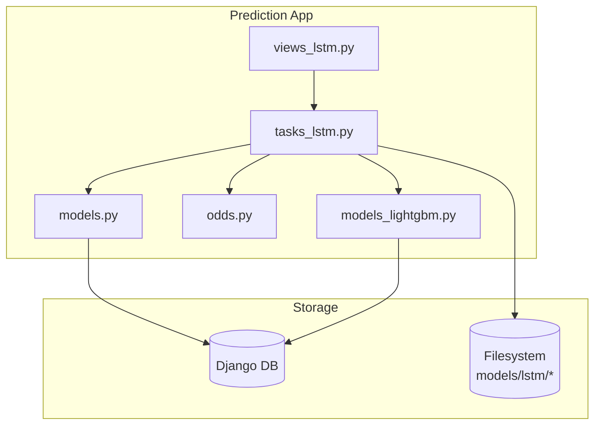
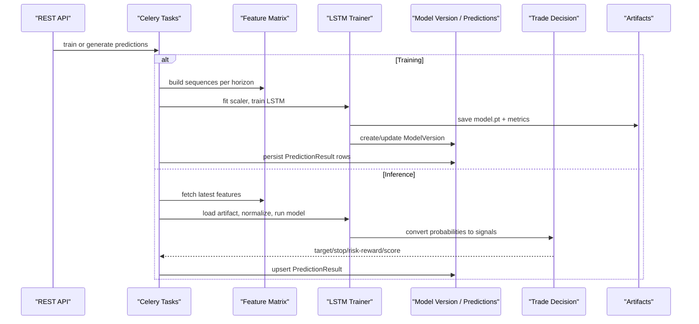
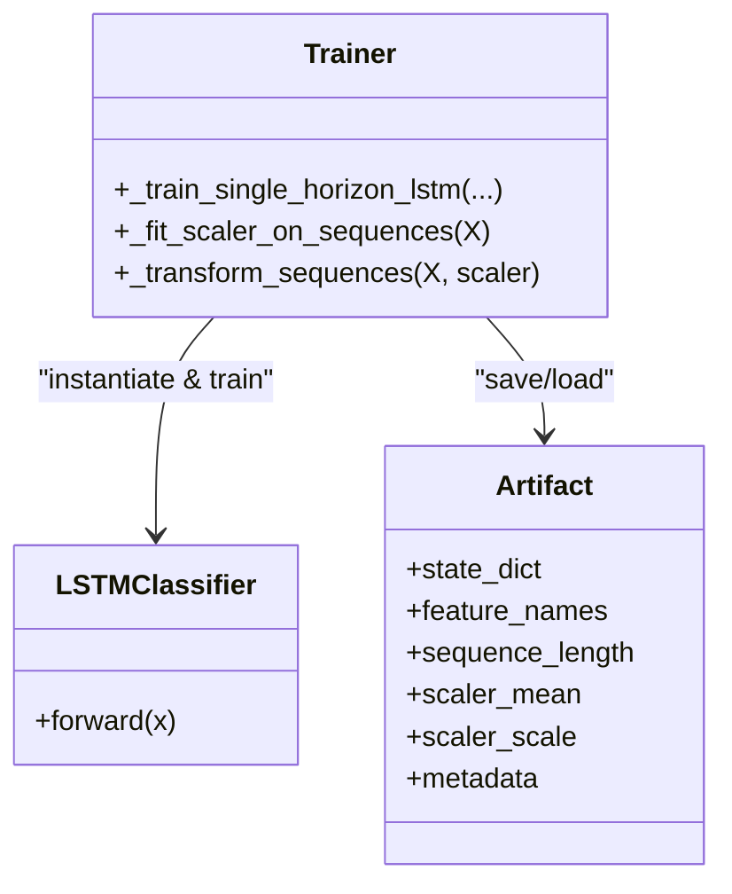
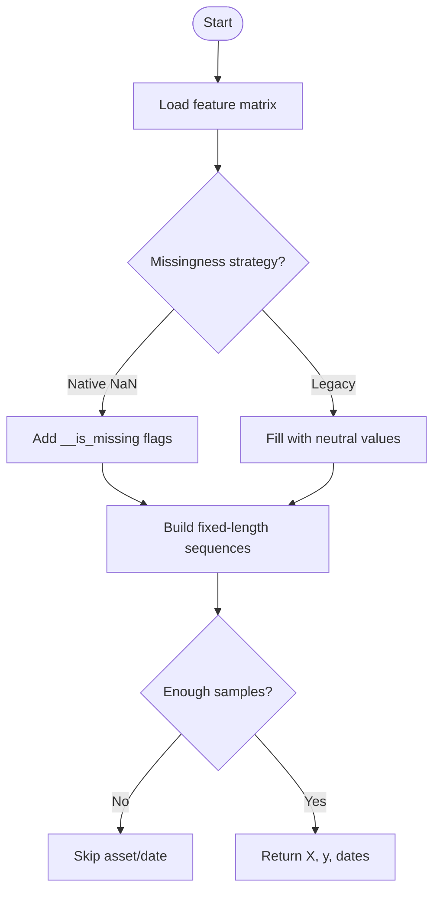
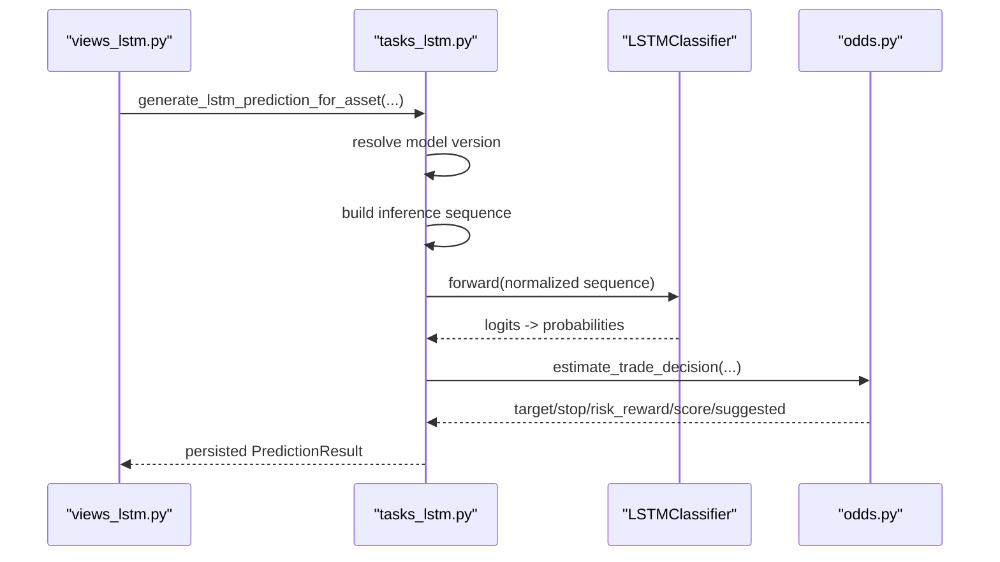
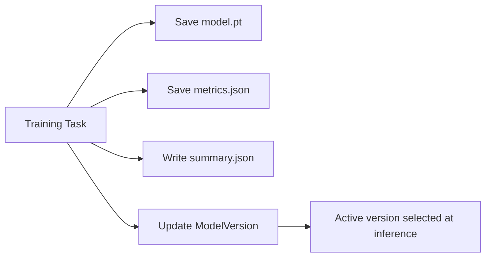
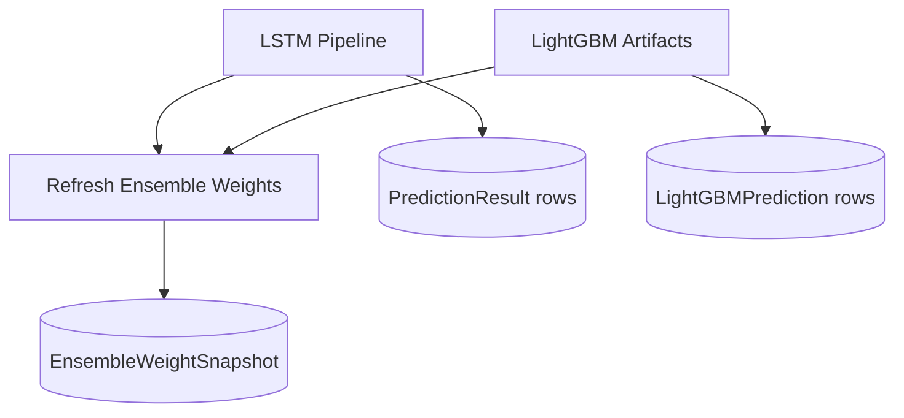
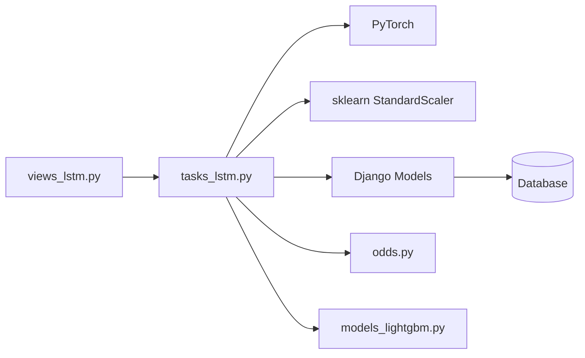

# LSTM Neural Network Model

<cite>
**Referenced Files in This Document**
- [tasks_lstm.py](file://apps/prediction/tasks_lstm.py)
- [views_lstm.py](file://apps/prediction/views_lstm.py)
- [models.py](file://apps/prediction/models.py)
- [odds.py](file://apps/prediction/odds.py)
- [models_lightgbm.py](file://apps/prediction/models_lightgbm.py)
- [summary.json](file://models/lstm/lstm-2024-12-31/summary.json)
- [3d_metrics.json](file://models/lstm/lstm-2024-12-31/3d_metrics.json)
</cite>

## Table of Contents
1. [Introduction](#introduction)
2. [Project Structure](#project-structure)
3. [Core Components](#core-components)
4. [Architecture Overview](#architecture-overview)
5. [Detailed Component Analysis](#detailed-component-analysis)
6. [Dependency Analysis](#dependency-analysis)
7. [Performance Considerations](#performance-considerations)
8. [Troubleshooting Guide](#troubleshooting-guide)
9. [Conclusion](#conclusion)
10. [Appendices](#appendices)

## Introduction
This document explains the PyTorch-based Long Short-Term Memory (LSTM) neural network model used for time series forecasting of stock price movements. It covers the training pipeline that prepares sequences, trains a three-class classifier (Down, Flat, Up), and validates performance; the inference workflow that builds historical sequences, generates forward-looking predictions, and converts outputs into trading signals; artifact management for saved weights, architecture configuration, and metrics; integration with the broader prediction framework including ensemble weighting with LightGBM; and guidance on retraining, hyperparameter tuning, and monitoring.

## Project Structure
The LSTM implementation is centered in the prediction application:
- Training and inference logic are implemented as Celery tasks in tasks_lstm.py.
- REST endpoints expose retrieval, recalculation, and training triggers in views_lstm.py.
- Persistent artifacts include model versions and prediction results in models.py.
- Trade signal conversion uses technical context in odds.py.
- Ensemble integration references LightGBM artifacts and weight snapshots in models_lightgbm.py.
- On-disk artifacts under models/lstm contain per-horizon model files and metrics summaries.

**Diagram sources**
- [views_lstm.py:19-171](file://apps/prediction/views_lstm.py#L19-L171)
- [tasks_lstm.py:41-967](file://apps/prediction/tasks_lstm.py#L41-L967)
- [models.py:7-107](file://apps/prediction/models.py#L7-L107)
- [odds.py:60-158](file://apps/prediction/odds.py#L60-L158)
- [models_lightgbm.py:7-137](file://apps/prediction/models_lightgbm.py#L7-L137)

**Section sources**
- [views_lstm.py:19-171](file://apps/prediction/views_lstm.py#L19-L171)
- [tasks_lstm.py:41-967](file://apps/prediction/tasks_lstm.py#L41-L967)
- [models.py:7-107](file://apps/prediction/models.py#L7-L107)
- [odds.py:60-158](file://apps/prediction/odds.py#L60-L158)
- [models_lightgbm.py:7-137](file://apps/prediction/models_lightgbm.py#L7-L137)

## Core Components
- LSTMClassifier: A PyTorch module implementing an LSTM layer followed by a small feed-forward classifier to predict Down/Flat/Up classes.
- Sequence builder: Converts feature matrices into fixed-length sequences aligned with labels for each horizon.
- Scaler: StandardScaler fitted on training sequences and applied consistently during training and inference.
- Trainer: Trains per-horizon models with cross-entropy loss, Adam optimizer, early best-validation accuracy selection, and saves artifacts.
- Inference: Builds sequences from recent features, normalizes using stored scaler parameters, runs the model, and produces probabilities and trade decisions.
- Artifacts: Per-horizon .pt files containing state dict, feature names, sequence length, scaler stats, and metadata; JSON metrics and summary files.
- Integration: Updates ModelVersion records, refreshes ensemble weights with LightGBM results, and persists PredictionResult rows.

**Section sources**
- [tasks_lstm.py:41-62](file://apps/prediction/tasks_lstm.py#L41-L62)
- [tasks_lstm.py:109-155](file://apps/prediction/tasks_lstm.py#L109-L155)
- [tasks_lstm.py:473-589](file://apps/prediction/tasks_lstm.py#L473-L589)
- [tasks_lstm.py:322-441](file://apps/prediction/tasks_lstm.py#L322-L441)
- [tasks_lstm.py:444-470](file://apps/prediction/tasks_lstm.py#L444-L470)
- [tasks_lstm.py:767-826](file://apps/prediction/tasks_lstm.py#L767-L826)

## Architecture Overview
End-to-end flow from data to trading signals:

**Diagram sources**
- [views_lstm.py:32-171](file://apps/prediction/views_lstm.py#L32-L171)
- [tasks_lstm.py:592-826](file://apps/prediction/tasks_lstm.py#L592-L826)
- [tasks_lstm.py:829-967](file://apps/prediction/tasks_lstm.py#L829-L967)
- [odds.py:60-158](file://apps/prediction/odds.py#L60-L158)

## Detailed Component Analysis

### LSTMClassifier and Training Loop
- Architecture: LSTM with batch-first tensors, optional dropout across layers, and a two-layer linear head with ReLU and dropout for classification into three classes.
- Training: Time-ordered split into train/validation, StandardScaler fit on training only, DataLoader batching, Adam optimizer, CrossEntropyLoss, validation accuracy tracking, and saving best state.
- Outputs: Metrics recorded include horizons, sample counts, accuracy, epochs, architecture settings, missing value strategy, and timestamps.

**Diagram sources**
- [tasks_lstm.py:41-62](file://apps/prediction/tasks_lstm.py#L41-L62)
- [tasks_lstm.py:473-589](file://apps/prediction/tasks_lstm.py#L473-L589)
- [tasks_lstm.py:444-470](file://apps/prediction/tasks_lstm.py#L444-L470)

**Section sources**
- [tasks_lstm.py:41-62](file://apps/prediction/tasks_lstm.py#L41-L62)
- [tasks_lstm.py:473-589](file://apps/prediction/tasks_lstm.py#L473-L589)

### Sequence Construction and Missingness Handling
- Sequences: For each asset, sliding windows of fixed length produce input tensors; labels are mapped to Down/Flat/Up based on horizon-specific label dictionaries.
- Missingness: Two strategies supported:
  - Native NaN strategy augments features with binary missing indicators and zeros out NaNs after scaling.
  - Legacy strategy fills missing values with neutral constants.
- Validation: Ensures sufficient history per asset and consistent feature set before building sequences.

**Diagram sources**
- [tasks_lstm.py:96-141](file://apps/prediction/tasks_lstm.py#L96-L141)
- [tasks_lstm.py:322-368](file://apps/prediction/tasks_lstm.py#L322-L368)

**Section sources**
- [tasks_lstm.py:96-141](file://apps/prediction/tasks_lstm.py#L96-L141)
- [tasks_lstm.py:322-368](file://apps/prediction/tasks_lstm.py#L322-L368)

### Inference Workflow and Trade Signal Conversion
- Model resolution: Selects active READY LSTM version, with fallbacks and stub handling.
- Feature preparation: Retrieves recent features for the asset and date, applies missingness augmentation if needed, and ensures exact sequence length.
- Normalization and prediction: Uses stored scaler mean/scale, converts to tensor, runs model, and computes softmax probabilities.
- Trade decision: Converts probabilities into actionable signals (target price, stop loss, risk-reward ratio, trade score, suggestion) using recent OHLCV and technical indicators.

**Diagram sources**
- [views_lstm.py:32-91](file://apps/prediction/views_lstm.py#L32-L91)
- [tasks_lstm.py:234-319](file://apps/prediction/tasks_lstm.py#L234-L319)
- [tasks_lstm.py:322-441](file://apps/prediction/tasks_lstm.py#L322-L441)
- [odds.py:60-158](file://apps/prediction/odds.py#L60-L158)

**Section sources**
- [tasks_lstm.py:234-319](file://apps/prediction/tasks_lstm.py#L234-L319)
- [tasks_lstm.py:322-441](file://apps/prediction/tasks_lstm.py#L322-L441)
- [odds.py:60-158](file://apps/prediction/odds.py#L60-L158)

### Model Artifacts and Metadata Management
- Saved artifacts per horizon include:
  - Torch payload with state dict, feature names, sequence length, hidden size, num layers, dropout, scaler statistics, and missing value strategy.
  - Metrics JSON with accuracy, sample sizes, architecture settings, and training timestamp.
  - Summary JSON aggregating results across horizons and recording versioning and training window.
- ModelVersion registry tracks active versions, artifact paths, metrics, feature schema, and training windows.

**Diagram sources**
- [tasks_lstm.py:444-470](file://apps/prediction/tasks_lstm.py#L444-L470)
- [tasks_lstm.py:746-804](file://apps/prediction/tasks_lstm.py#L746-L804)
- [models.py:7-41](file://apps/prediction/models.py#L7-L41)
- [summary.json:1-41](file://models/lstm/lstm-2024-12-31/summary.json#L1-L41)
- [3d_metrics.json:1-13](file://models/lstm/lstm-2024-12-31/3d_metrics.json#L1-L13)

**Section sources**
- [tasks_lstm.py:444-470](file://apps/prediction/tasks_lstm.py#L444-L470)
- [tasks_lstm.py:746-804](file://apps/prediction/tasks_lstm.py#L746-L804)
- [models.py:7-41](file://apps/prediction/models.py#L7-L41)
- [summary.json:1-41](file://models/lstm/lstm-2024-12-31/summary.json#L1-L41)
- [3d_metrics.json:1-13](file://models/lstm/lstm-2024-12-31/3d_metrics.json#L1-L13)

### Integration with Broader Prediction Framework
- Ensemble weighting: After LSTM training, the system refreshes ensemble weights using LightGBM model artifacts’ metrics to balance contributions across models.
- Prediction persistence: Results are stored alongside LightGBM predictions, enabling unified querying and comparison.
- API exposure: Endpoints allow per-stock retrieval, batch generation, recalculation, and triggering training.

**Diagram sources**
- [tasks_lstm.py:806-816](file://apps/prediction/tasks_lstm.py#L806-L816)
- [models_lightgbm.py:97-106](file://apps/prediction/models_lightgbm.py#L97-L106)
- [views_lstm.py:93-171](file://apps/prediction/views_lstm.py#L93-L171)

**Section sources**
- [tasks_lstm.py:806-816](file://apps/prediction/tasks_lstm.py#L806-L816)
- [models_lightgbm.py:97-106](file://apps/prediction/models_lightgbm.py#L97-L106)
- [views_lstm.py:93-171](file://apps/prediction/views_lstm.py#L93-L171)

## Dependency Analysis
Key dependencies and coupling:
- tasks_lstm.py depends on:
  - Django ORM for Asset, ModelVersion, PredictionResult.
  - PyTorch for model definition, training loop, and artifact I/O.
  - scikit-learn StandardScaler for normalization.
  - pandas/numpy for data manipulation.
  - odds.py for trade signal computation using OHLCV and technical indicators.
  - models_lightgbm.py to read LightGBM artifacts and refresh ensemble weights.
- views_lstm.py exposes REST actions that trigger tasks and return serialized results.
- models.py defines persistent registries for model versions and prediction outcomes.

**Diagram sources**
- [tasks_lstm.py:1-31](file://apps/prediction/tasks_lstm.py#L1-L31)
- [tasks_lstm.py:473-589](file://apps/prediction/tasks_lstm.py#L473-L589)
- [views_lstm.py:1-17](file://apps/prediction/views_lstm.py#L1-L17)
- [models.py:7-107](file://apps/prediction/models.py#L7-L107)
- [odds.py:1-158](file://apps/prediction/odds.py#L1-L158)
- [models_lightgbm.py:7-137](file://apps/prediction/models_lightgbm.py#L7-L137)

**Section sources**
- [tasks_lstm.py:1-31](file://apps/prediction/tasks_lstm.py#L1-L31)
- [tasks_lstm.py:473-589](file://apps/prediction/tasks_lstm.py#L473-L589)
- [views_lstm.py:1-17](file://apps/prediction/views_lstm.py#L1-L17)
- [models.py:7-107](file://apps/prediction/models.py#L7-L107)
- [odds.py:1-158](file://apps/prediction/odds.py#L1-L158)
- [models_lightgbm.py:7-137](file://apps/prediction/models_lightgbm.py#L7-L137)

## Performance Considerations
- Data volume: The trainer enforces minimum sample thresholds and caps samples per horizon to control runtime and memory usage.
- Batch sizing: Training uses moderate batch sizes to balance throughput and GPU memory; validation uses larger batches for speed.
- Sequence length: Fixed-length windows ensure stable tensor shapes; insufficient history leads to skipped samples.
- Device selection: Automatic CPU/GPU detection optimizes resource use.
- Scaling: StandardScaler prevents feature scale drift; NaN/inf handling avoids numerical instability.
- Caching: Runtime caches reduce repeated feature frame construction during batch inference.

[No sources needed since this section provides general guidance]

## Troubleshooting Guide
Common issues and resolutions:
- No READY model available: Ensure a ModelVersion with status READY exists for LSTM; training must complete successfully and mark the version active.
- Insufficient data: If fewer than required samples are collected for a horizon, training returns insufficient_data; verify feature availability and sequence length relative to lookback.
- Empty feature frames: Check that assets have enough historical bars and that missingness strategy matches training configuration.
- Prediction failures: Confirm that the latest feature snapshot has the expected number of features and that scaler parameters match the loaded artifact.
- Ensemble weights not updated: Verify LightGBM artifacts are present and marked READY so weights can be refreshed post-training.

**Section sources**
- [tasks_lstm.py:234-263](file://apps/prediction/tasks_lstm.py#L234-L263)
- [tasks_lstm.py:473-502](file://apps/prediction/tasks_lstm.py#L473-L502)
- [tasks_lstm.py:322-368](file://apps/prediction/tasks_lstm.py#L322-L368)
- [tasks_lstm.py:806-816](file://apps/prediction/tasks_lstm.py#L806-L816)

## Conclusion
The LSTM component provides a robust, production-ready pipeline for multi-horizon stock movement forecasting. It standardizes sequence construction, handles missing data explicitly, trains compact classifiers, and integrates seamlessly with the broader prediction framework through model versioning, artifact persistence, and ensemble weighting. The API enables on-demand inference and retraining, while metrics and summaries support ongoing monitoring and iterative improvement.

[No sources needed since this section summarizes without analyzing specific files]

## Appendices

### API Endpoints for LSTM
- GET /api/v1/lstm-predictions/{stock_code}/: Retrieve or trigger per-stock predictions for specified horizons.
- POST /api/v1/lstm-predictions/train/: Queue LSTM model training with configurable windows and parameters.
- POST /api/v1/lstm-predictions/recalculate/: Queue batch prediction generation for a target date.
- POST /api/v1/lstm-predictions/batch/: Generate predictions for multiple stocks on a given date.

**Section sources**
- [views_lstm.py:19-171](file://apps/prediction/views_lstm.py#L19-L171)

### Hyperparameter Tuning Guidance
- Sequence length: Adjust based on market regime and data frequency; longer sequences increase context but require more history.
- Hidden size and layers: Increase capacity cautiously; monitor overfitting via validation accuracy and sample size.
- Dropout: Regularization helps prevent overfitting when increasing depth or width.
- Learning rate and epochs: Tune learning rate for convergence stability; limit epochs to avoid overfitting.
- Missingness strategy: Prefer native NaN with missing indicators for robustness; ensure consistency between training and inference.

[No sources needed since this section provides general guidance]

### Monitoring and Retraining
- Monitor aggregate and per-horizon accuracy from summary and metrics files.
- Track changes in feature distributions and missingness rates to detect drift.
- Schedule periodic retraining with updated data windows; validate improvements before activating new versions.
- Use ensemble weights to assess LSTM contribution relative to LightGBM and heuristic models over time.

**Section sources**
- [summary.json:1-41](file://models/lstm/lstm-2024-12-31/summary.json#L1-L41)
- [3d_metrics.json:1-13](file://models/lstm/lstm-2024-12-31/3d_metrics.json#L1-L13)
- [tasks_lstm.py:806-816](file://apps/prediction/tasks_lstm.py#L806-L816)