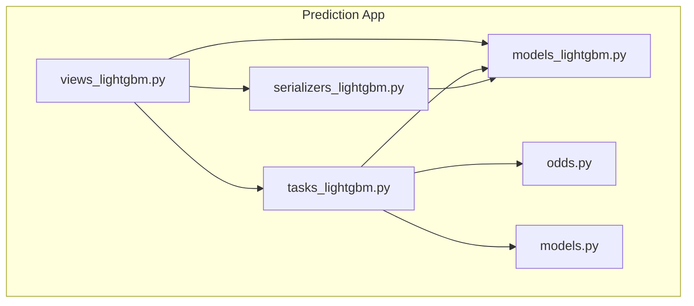
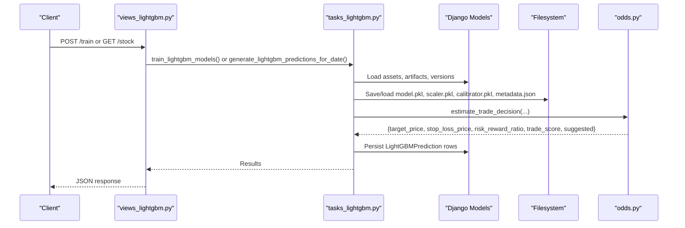
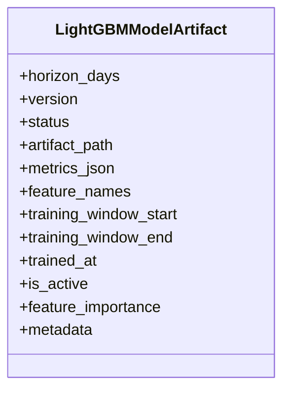
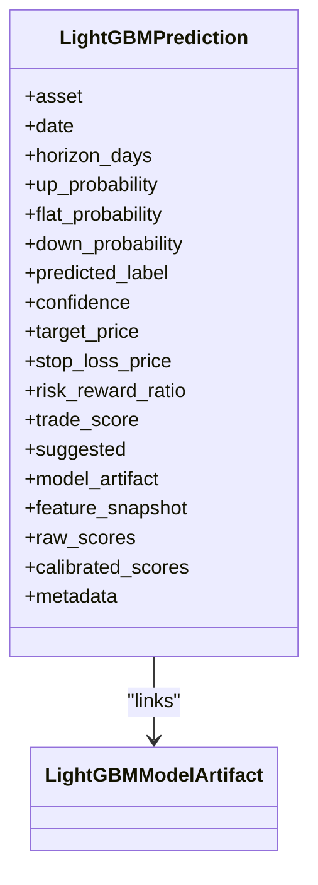
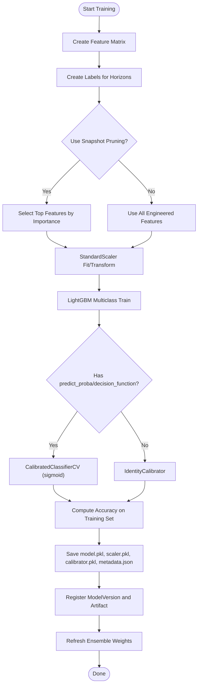
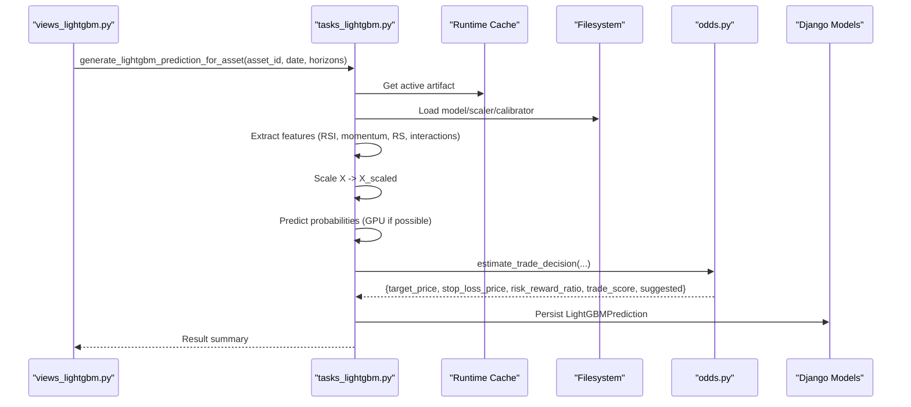
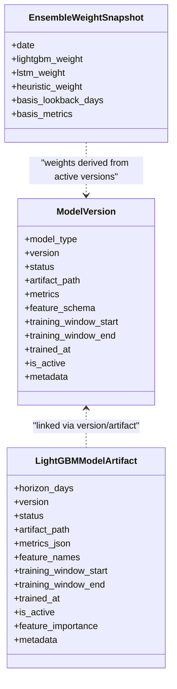
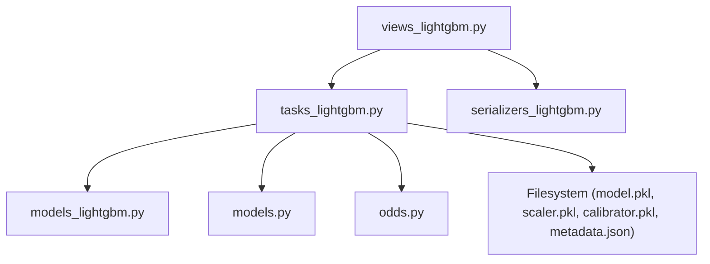

# LightGBM Gradient Boosting Model

<cite>
**Referenced Files in This Document**
- [models_lightgbm.py](file://apps/prediction/models_lightgbm.py)
- [tasks_lightgbm.py](file://apps/prediction/tasks_lightgbm.py)
- [views_lightgbm.py](file://apps/prediction/views_lightgbm.py)
- [serializers_lightgbm.py](file://apps/prediction/serializers_lightgbm.py)
- [odds.py](file://apps/prediction/odds.py)
- [models.py](file://apps/prediction/models.py)
</cite>

## Table of Contents
1. [Introduction](#introduction)
2. [Project Structure](#project-structure)
3. [Core Components](#core-components)
4. [Architecture Overview](#architecture-overview)
5. [Detailed Component Analysis](#detailed-component-analysis)
6. [Dependency Analysis](#dependency-analysis)
7. [Performance Considerations](#performance-considerations)
8. [Troubleshooting Guide](#troubleshooting-guide)
9. [Conclusion](#conclusion)
10. [Appendices](#appendices)

## Introduction
This document explains the LightGBM gradient boosting model implementation used to generate probabilistic trading signals for assets across multiple horizons (3, 7, and 30 days). It covers:
- The LightGBMModelArtifact model that stores trained artifacts, hyperparameters, feature importance, and metrics.
- The LightGBMPrediction model that extends base predictions with LightGBM-specific fields such as raw and calibrated scores and feature snapshots.
- The training workflow: feature preparation, label creation, model fitting, validation, artifact serialization, and versioning.
- The prediction pipeline: loading active models, processing features, generating probabilities, and calculating trading signals.
- The model versioning system tracking configurations, training windows, and performance comparisons.
- Configuration options for hyperparameter tuning, feature selection, and ensemble weighting strategies.

## Project Structure
The LightGBM functionality is implemented under the prediction app with clear separation between data models, tasks (training and inference), views (API endpoints), serializers, and utilities.

**Diagram sources**
- [views_lightgbm.py:30-282](file://apps/prediction/views_lightgbm.py#L30-L282)
- [tasks_lightgbm.py:1850-2304](file://apps/prediction/tasks_lightgbm.py#L1850-L2304)
- [models_lightgbm.py:7-137](file://apps/prediction/models_lightgbm.py#L7-L137)
- [serializers_lightgbm.py:11-59](file://apps/prediction/serializers_lightgbm.py#L11-L59)
- [odds.py:60-158](file://apps/prediction/odds.py#L60-L158)
- [models.py:7-107](file://apps/prediction/models.py#L7-L107)

**Section sources**
- [views_lightgbm.py:30-282](file://apps/prediction/views_lightgbm.py#L30-L282)
- [tasks_lightgbm.py:1850-2304](file://apps/prediction/tasks_lightgbm.py#L1850-L2304)
- [models_lightgbm.py:7-137](file://apps/prediction/models_lightgbm.py#L7-L137)
- [serializers_lightgbm.py:11-59](file://apps/prediction/serializers_lightgbm.py#L11-L59)
- [odds.py:60-158](file://apps/prediction/odds.py#L60-L158)
- [models.py:7-107](file://apps/prediction/models.py#L7-L107)

## Core Components
- LightGBMModelArtifact: Registry for trained LightGBM models per horizon with status, artifact path, metrics, feature names, training window, importance, and metadata.
- LightGBMPrediction: Daily predictions per asset and horizon including probabilities, labels, confidence, target/stop-loss prices, risk-reward ratio, trade score, suggestion flag, and detailed feature/score snapshots.
- EnsembleWeightSnapshot: Tracks dynamic ensemble weights over time for LightGBM, LSTM, and heuristic components.
- FeatureImportanceSnapshot: Historical per-feature importance for each artifact, enabling pruning and analysis.
- ModelVersion: Central registry for all model types (LightGBM, LSTM, Ensemble) with versioning, status, metrics, schema, and training windows.

Key responsibilities:
- Training orchestrates feature matrix creation, label alignment, model fitting, calibration, validation accuracy, artifact persistence, and version registration.
- Inference loads active artifacts, extracts features, scales inputs, predicts probabilities, computes trade decisions, and persists results.

**Section sources**
- [models_lightgbm.py:7-137](file://apps/prediction/models_lightgbm.py#L7-L137)
- [models.py:7-107](file://apps/prediction/models.py#L7-L107)

## Architecture Overview
The system separates concerns into API, task orchestration, data models, and utility functions.

**Diagram sources**
- [views_lightgbm.py:124-282](file://apps/prediction/views_lightgbm.py#L124-L282)
- [tasks_lightgbm.py:1850-2304](file://apps/prediction/tasks_lightgbm.py#L1850-L2304)
- [odds.py:60-158](file://apps/prediction/odds.py#L60-L158)

## Detailed Component Analysis

### LightGBMModelArtifact Model
Stores trained model artifacts and associated metadata:
- Horizon days (3, 7, 30), version string, status (TRAINING/READY/FAILED/ARCHIVED), artifact path, metrics JSON, feature names, training window dates, trained timestamp, active flag, feature importance snapshot, and arbitrary metadata.
- Unique constraint on horizon_days + version ensures one active artifact per horizon/version pair.

**Diagram sources**
- [models_lightgbm.py:7-39](file://apps/prediction/models_lightgbm.py#L7-L39)

**Section sources**
- [models_lightgbm.py:7-39](file://apps/prediction/models_lightgbm.py#L7-L39)

### LightGBMPrediction Model
Extends base predictions with LightGBM-specific fields:
- Probabilities for UP/FLAT/DOWN, predicted label, confidence, target/stop-loss prices, risk-reward ratio, trade score, suggestion flag.
- Links to a specific LightGBMModelArtifact via foreign key.
- Stores feature snapshot, raw scores (before calibration), calibrated scores (after Platt scaling), and metadata.

**Diagram sources**
- [models_lightgbm.py:41-95](file://apps/prediction/models_lightgbm.py#L41-L95)

**Section sources**
- [models_lightgbm.py:41-95](file://apps/prediction/models_lightgbm.py#L41-L95)

### Training Workflow
End-to-end training process for each horizon:
- Feature matrix creation using stored technical indicators and factor/sentiment/macro data; includes interaction features and lagged values.
- Label creation aligned to point-in-time membership and trading calendar gaps.
- Optional feature pruning based on historical importance snapshots to retain top features by cumulative importance thresholds.
- Scaling via StandardScaler, LightGBM multiclass training, optional probability calibration (Platt scaling via CalibratedClassifierCV or identity fallback).
- Validation accuracy computed on training set; feature importance recorded; artifacts persisted to disk; model version registered; ensemble weights refreshed.

**Diagram sources**
- [tasks_lightgbm.py:1850-2099](file://apps/prediction/tasks_lightgbm.py#L1850-L2099)

**Section sources**
- [tasks_lightgbm.py:1850-2099](file://apps/prediction/tasks_lightgbm.py#L1850-L2099)

### Prediction Pipeline
Inference for a given asset and date across horizons:
- Loads active LightGBMModelArtifact and corresponding artifacts from disk (with in-process cache).
- Extracts features using the same logic as training, respecting missing value strategy and interaction features.
- Scales input vector, predicts probabilities (GPU-accelerated if available and compatible), applies calibration.
- Computes trade decision (target/stop-loss, risk-reward ratio, trade score, suggestion) using odds estimation.
- Persists LightGBMPrediction records with full feature snapshot and raw/calibrated scores.

**Diagram sources**
- [views_lightgbm.py:124-193](file://apps/prediction/views_lightgbm.py#L124-L193)
- [tasks_lightgbm.py:2105-2304](file://apps/prediction/tasks_lightgbm.py#L2105-L2304)
- [odds.py:60-158](file://apps/prediction/odds.py#L60-L158)

**Section sources**
- [views_lightgbm.py:124-193](file://apps/prediction/views_lightgbm.py#L124-L193)
- [tasks_lightgbm.py:2105-2304](file://apps/prediction/tasks_lightgbm.py#L2105-L2304)
- [odds.py:60-158](file://apps/prediction/odds.py#L60-L158)

### Model Versioning System
Tracks different LightGBM configurations, training windows, and performance:
- ModelVersion centralizes versioning across model types; LightGBM entries include artifact path, metrics, feature schema, training window dates, trained timestamp, active flag, and metadata.
- During training, new versions are created/updated and previous active versions deactivated per horizon prefix.
- Ensemble weights are refreshed based on recent accuracies of LightGBM, LSTM, and heuristic models, persisting daily snapshots and updating active ensemble version.

**Diagram sources**
- [models.py:7-41](file://apps/prediction/models.py#L7-L41)
- [models_lightgbm.py:7-137](file://apps/prediction/models_lightgbm.py#L7-L137)
- [tasks_lightgbm.py:586-730](file://apps/prediction/tasks_lightgbm.py#L586-L730)

**Section sources**
- [models.py:7-41](file://apps/prediction/models.py#L7-L41)
- [tasks_lightgbm.py:586-730](file://apps/prediction/tasks_lightgbm.py#L586-L730)

### Configuration Options
- Hyperparameters: Default LightGBM parameters include objective multiclass, num_class=3, num_leaves=15, learning_rate=0.05, feature_fraction=0.6, bagging_fraction=0.8, bagging_freq=5, lambda_l1=1.0, lambda_l2=1.0, min_data_in_leaf=50, random_state=42, verbose=-1. These can be extended or overridden in training calls.
- Feature selection: Interaction features are automatically engineered (e.g., RSI × relative volume, factor composite × sentiment). Optional snapshot-based pruning retains top features by cumulative importance within configured bounds.
- Missing value strategy: Supports legacy neutral fill and native NaN preservation; strategy is stored in artifact metadata and applied consistently during training and inference.
- Ensemble weighting: Weights are dynamically updated based on recent accuracies of LightGBM, LSTM, and heuristic models; basis lookback defaults to 60 days.

**Section sources**
- [tasks_lightgbm.py:1966-1982](file://apps/prediction/tasks_lightgbm.py#L1966-L1982)
- [tasks_lightgbm.py:380-408](file://apps/prediction/tasks_lightgbm.py#L380-L408)
- [tasks_lightgbm.py:477-584](file://apps/prediction/tasks_lightgbm.py#L477-L584)
- [tasks_lightgbm.py:631-730](file://apps/prediction/tasks_lightgbm.py#L631-L730)

## Dependency Analysis
Key dependencies and relationships:
- Views depend on tasks for training and inference, and on serializers for API responses.
- Tasks depend on Django models for assets, artifacts, predictions, and versions; they also use market data, macro context, sentiment, and technical indicators.
- Inference depends on odds estimation for trade signal generation.
- Artifacts are persisted to filesystem with metadata and cached in memory for performance.

**Diagram sources**
- [views_lightgbm.py:30-282](file://apps/prediction/views_lightgbm.py#L30-L282)
- [tasks_lightgbm.py:1850-2304](file://apps/prediction/tasks_lightgbm.py#L1850-L2304)
- [models_lightgbm.py:7-137](file://apps/prediction/models_lightgbm.py#L7-L137)
- [models.py:7-107](file://apps/prediction/models.py#L7-L107)
- [odds.py:60-158](file://apps/prediction/odds.py#L60-L158)

**Section sources**
- [views_lightgbm.py:30-282](file://apps/prediction/views_lightgbm.py#L30-L282)
- [tasks_lightgbm.py:1850-2304](file://apps/prediction/tasks_lightgbm.py#L1850-L2304)
- [models_lightgbm.py:7-137](file://apps/prediction/models_lightgbm.py#L7-L137)
- [models.py:7-107](file://apps/prediction/models.py#L7-L107)
- [odds.py:60-158](file://apps/prediction/odds.py#L60-L158)

## Performance Considerations
- GPU acceleration: Prediction path probes for GPU-capable LightGBM backends and uses them when available to speed up probability inference.
- Caching: In-memory caches reduce repeated artifact loading and runtime queries; artifact cache size is configurable via environment variable.
- Feature pruning: Snapshot-based pruning reduces feature dimensionality while retaining high-importance features, improving inference speed and stability.
- Batch operations: Prediction tasks iterate over effective universe assets efficiently; batch endpoints group results for client consumption.

[No sources needed since this section provides general guidance]

## Troubleshooting Guide
Common issues and resolutions:
- No active artifact found: Ensure at least one LightGBMModelArtifact exists with READY status and is_active=True for the requested horizon.
- Insufficient training data: Training requires minimum samples; ensure sufficient historical coverage and valid point-in-time membership.
- Missing features: Verify that technical indicators and factors are populated for the requested date; interaction features require both component features to exist.
- Calibration mismatch: If model lacks predict_proba/decision_function, identity calibration is used; verify LightGBM booster type and compatibility.
- Ensemble weights stale: Refresh ensemble weights after retraining to reflect updated accuracies; check latest EnsembleWeightSnapshot entries.

**Section sources**
- [tasks_lightgbm.py:1850-2099](file://apps/prediction/tasks_lightgbm.py#L1850-L2099)
- [tasks_lightgbm.py:2105-2304](file://apps/prediction/tasks_lightgbm.py#L2105-L2304)

## Conclusion
The LightGBM implementation provides a robust, versioned, and scalable approach to generating probabilistic trading signals across multiple horizons. It integrates feature engineering, model training, calibration, artifact management, and trade decision logic into a cohesive pipeline with strong observability through metrics, importance snapshots, and ensemble weight tracking.

[No sources needed since this section summarizes without analyzing specific files]

## Appendices

### API Endpoints Summary
- Train: POST /api/v1/lightgbm-predictions/train/ — queues model retraining with optional training window and version tag.
- Recalculate: POST /api/v1/lightgbm-predictions/recalculate/ — queues inference for a target date and horizons.
- Batch: POST /api/v1/lightgbm-predictions/batch/ — generates or retrieves predictions for multiple stocks on a date.
- Stock: GET /api/v1/lightgbm-predictions/{stock_code}/ — returns predictions for a single stock across horizons.
- Model artifacts: GET /api/v1/lightgbm-models/ — lists artifacts; supports filtering by horizon and feature importance trends.

**Section sources**
- [views_lightgbm.py:30-282](file://apps/prediction/views_lightgbm.py#L30-L282)