# Prediction Application

<cite>
**Referenced Files in This Document**
- [models.py](file://apps/prediction/models.py)
- [tasks.py](file://apps/prediction/tasks.py)
- [views.py](file://apps/prediction/views.py)
- [historical_features.py](file://apps/prediction/historical_features.py)
- [odds.py](file://apps/prediction/odds.py)
- [models_lightgbm.py](file://apps/prediction/models_lightgbm.py)
- [tasks_lightgbm.py](file://apps/prediction/tasks_lightgbm.py)
- [tasks_lstm.py](file://apps/prediction/tasks_lstm.py)
- [views_lightgbm.py](file://apps/prediction/views_lightgbm.py)
- [views_lstm.py](file://apps/prediction/views_lstm.py)
- [models.py (backtest)](file://apps/backtest/models.py)
- [tasks.py (backtest)](file://apps/backtest/tasks.py)
- [celery.py](file://config/celery.py)
</cite>

## Table of Contents
1. [Introduction](#introduction)
2. [Project Structure](#project-structure)
3. [Core Components](#core-components)
4. [Architecture Overview](#architecture-overview)
5. [Detailed Component Analysis](#detailed-component-analysis)
6. [Dependency Analysis](#dependency-analysis)
7. [Performance Considerations](#performance-considerations)
8. [Troubleshooting Guide](#troubleshooting-guide)
9. [Conclusion](#conclusion)

## Introduction
This document explains the Prediction application that orchestrates machine learning model training and inference for trading signals. It supports a multi-model architecture combining:
- Heuristic rules baseline
- LightGBM gradient boosting models
- LSTM neural networks

It documents how predictions are stored, how ensemble weights are optimized over time, how historical features are constructed from derived data sources, how raw probabilities are converted into probabilistic trade decisions with target and stop-loss levels, how model artifacts are versioned with metadata and metrics, and how Celery task queues orchestrate training, feature engineering, and batch prediction generation. It also covers integration with the backtesting engine for strategy validation and the API endpoints used to access predictions.

## Project Structure
The Prediction app is organized by capability:
- Data models for model versions, heuristic predictions, LightGBM artifacts and predictions, ensemble weight snapshots, and feature importance snapshots
- Feature extraction utilities that read technical indicators, factors, sentiment, and OHLCV history
- Probability engines: heuristic baseline and ML-based inference
- Odds calculation that converts probabilities into trade decisions
- Task queues for training and inference
- REST API views exposing retrieval, batch generation, and retraining triggers
- Backtest integration that recomputes candidates at runtime using active artifacts and features

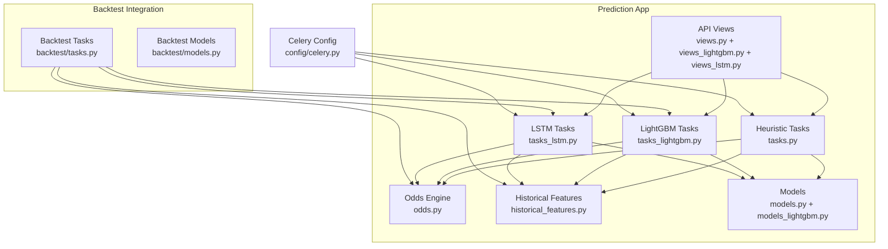

**Diagram sources**
- [tasks.py:149-243](file://apps/prediction/tasks.py#L149-L243)
- [tasks_lightgbm.py:586-729](file://apps/prediction/tasks_lightgbm.py#L586-L729)
- [tasks_lstm.py:592-800](file://apps/prediction/tasks_lstm.py#L592-L800)
- [odds.py:60-158](file://apps/prediction/odds.py#L60-L158)
- [historical_features.py:182-397](file://apps/prediction/historical_features.py#L182-L397)
- [models.py:7-106](file://apps/prediction/models.py#L7-L106)
- [models_lightgbm.py:7-137](file://apps/prediction/models_lightgbm.py#L7-L137)
- [views.py:27-161](file://apps/prediction/views.py#L27-L161)
- [views_lightgbm.py:30-282](file://apps/prediction/views_lightgbm.py#L30-L282)
- [views_lstm.py:19-171](file://apps/prediction/views_lstm.py#L19-L171)
- [tasks.py (backtest):1-800](file://apps/backtest/tasks.py#L1-L800)
- [models.py (backtest):24-168](file://apps/backtest/models.py#L24-L168)
- [celery.py:1-17](file://config/celery.py#L1-L17)

**Section sources**
- [tasks.py:149-243](file://apps/prediction/tasks.py#L149-L243)
- [tasks_lightgbm.py:586-729](file://apps/prediction/tasks_lightgbm.py#L586-L729)
- [tasks_lstm.py:592-800](file://apps/prediction/tasks_lstm.py#L592-L800)
- [odds.py:60-158](file://apps/prediction/odds.py#L60-L158)
- [historical_features.py:182-397](file://apps/prediction/historical_features.py#L182-L397)
- [models.py:7-106](file://apps/prediction/models.py#L7-L106)
- [models_lightgbm.py:7-137](file://apps/prediction/models_lightgbm.py#L7-L137)
- [views.py:27-161](file://apps/prediction/views.py#L27-L161)
- [views_lightgbm.py:30-282](file://apps/prediction/views_lightgbm.py#L30-L282)
- [views_lstm.py:19-171](file://apps/prediction/views_lstm.py#L19-L171)
- [tasks.py (backtest):1-800](file://apps/backtest/tasks.py#L1-L800)
- [models.py (backtest):24-168](file://apps/backtest/models.py#L24-L168)
- [celery.py:1-17](file://config/celery.py#L1-L17)

## Core Components
- ModelVersion: Tracks all model types (LightGBM, LSTM, Ensemble) with status, artifact path, metrics, feature schema, training window, and active flag.
- PredictionResult: Stores heuristic and LSTM outputs including probabilities, label, confidence, target/stop prices, risk-reward ratio, trade score, suggestion flag, macro context, event tag, feature payload, and metadata.
- LightGBMModelArtifact: Registry for trained LightGBM models per horizon with metrics, feature names, training window, active flag, feature importance, and metadata.
- LightGBMPrediction: Parallel storage for LightGBM predictions with probabilities, label, confidence, trade decision fields, feature snapshot, raw/calibrated scores, and model artifact link.
- EnsembleWeightSnapshot: Daily snapshot of dynamic weights assigned to LightGBM, LSTM, and heuristic models based on recent accuracy.
- FeatureImportanceSnapshot: Historical per-feature importance for each LightGBM artifact, enabling pruning and interpretability.

These components enable:
- Multi-model training and inference pipelines
- Dynamic ensemble weighting
- Robust feature construction from multiple data sources
- Probabilistic conversion to actionable trade decisions
- Versioned artifacts with performance tracking

**Section sources**
- [models.py:7-106](file://apps/prediction/models.py#L7-L106)
- [models_lightgbm.py:7-137](file://apps/prediction/models_lightgbm.py#L7-L137)

## Architecture Overview
The system combines three prediction sources:
- Heuristic baseline: Computes probabilities from factor composites, sentiment, momentum, RSI, and relative strength, adjusted by macro phase and horizon scaling.
- LightGBM: Trains gradient boosting classifiers per horizon, stores artifacts, performs calibrated probability inference, and optionally prunes features based on importance snapshots.
- LSTM: Trains sequence models per horizon, stores PyTorch artifacts, builds sequences from feature matrices, and infers probabilities via softmax.

An ensemble layer dynamically weights these sources based on recent accuracy and persists the active ensemble version. All predictions flow through an odds calculator that derives target price, stop loss, risk-reward ratio, trade score, and suggestion flags.

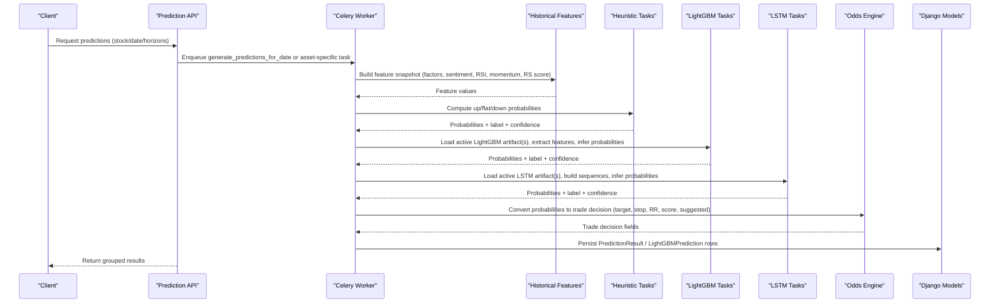

**Diagram sources**
- [views.py:27-161](file://apps/prediction/views.py#L27-L161)
- [tasks.py:149-243](file://apps/prediction/tasks.py#L149-L243)
- [tasks_lightgbm.py:586-729](file://apps/prediction/tasks_lightgbm.py#L586-L729)
- [tasks_lstm.py:592-800](file://apps/prediction/tasks_lstm.py#L592-L800)
- [odds.py:60-158](file://apps/prediction/odds.py#L60-L158)
- [historical_features.py:182-397](file://apps/prediction/historical_features.py#L182-L397)
- [models.py:43-106](file://apps/prediction/models.py#L43-L106)
- [models_lightgbm.py:41-95](file://apps/prediction/models_lightgbm.py#L41-L95)

## Detailed Component Analysis

### Heuristic Baseline Pipeline
- Feature snapshot: Aggregates composite factor score, bottom probability, sentiment score, RSI, 5-day momentum, and relative strength score.
- Probability computation: Combines signals with horizon scaling and macro phase adjustments; normalizes to valid probabilities.
- Label and confidence: Derives predicted label from dominant probability and computes confidence from margin between top two classes.
- Persistence: Writes PredictionResult rows linked to an active ensemble model version.

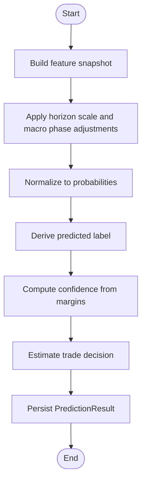

**Diagram sources**
- [tasks.py:55-127](file://apps/prediction/tasks.py#L55-L127)
- [tasks.py:177-243](file://apps/prediction/tasks.py#L177-L243)
- [odds.py:60-158](file://apps/prediction/odds.py#L60-L158)
- [models.py:43-106](file://apps/prediction/models.py#L43-L106)

**Section sources**
- [tasks.py:55-127](file://apps/prediction/tasks.py#L55-L127)
- [tasks.py:177-243](file://apps/prediction/tasks.py#L177-L243)

### LightGBM Training and Inference
- Artifact management: Saves model, scaler, calibrator, and metadata per horizon/version; loads with process-level cache; supports GPU detection when applicable.
- Feature engineering: Extracts technical indicators, factors, sentiment, returns, volatility, and interaction features; supports missing value strategies and parameter compatibility checks.
- Training: Builds sequences/matrix, splits train/validation, trains with early stopping logic, saves artifacts and metrics, registers ModelVersion.
- Inference: Loads active artifact(s), extracts features, scales, predicts probabilities, computes trade decisions, and persists LightGBMPrediction rows.
- Feature pruning: Uses importance snapshots to retain top features within bounds, improving efficiency and stability.

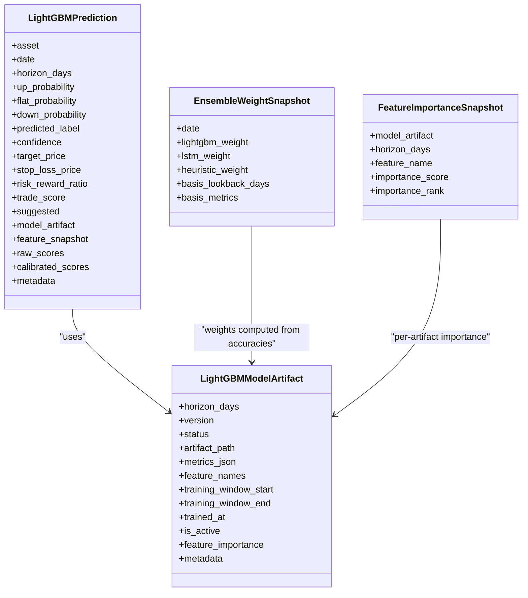

**Diagram sources**
- [models_lightgbm.py:7-137](file://apps/prediction/models_lightgbm.py#L7-L137)
- [tasks_lightgbm.py:586-729](file://apps/prediction/tasks_lightgbm.py#L586-L729)

**Section sources**
- [tasks_lightgbm.py:586-729](file://apps/prediction/tasks_lightgbm.py#L586-L729)
- [models_lightgbm.py:7-137](file://apps/prediction/models_lightgbm.py#L7-L137)

### LSTM Training and Inference
- Sequence construction: Builds sliding windows over feature matrices per asset, augments missingness indicators, and aligns labels by horizon.
- Training: Splits sequences into train/validation, fits StandardScaler, trains LSTM classifier with Adam optimizer, saves best state, and persists metrics and artifacts.
- Inference: Resolves active LSTM model version, loads artifact, builds sequence for target date, normalizes, runs forward pass, applies softmax, and computes trade decisions.
- Persistence: Stores results in PredictionResult rows with model_type=LSTM and links to ModelVersion.

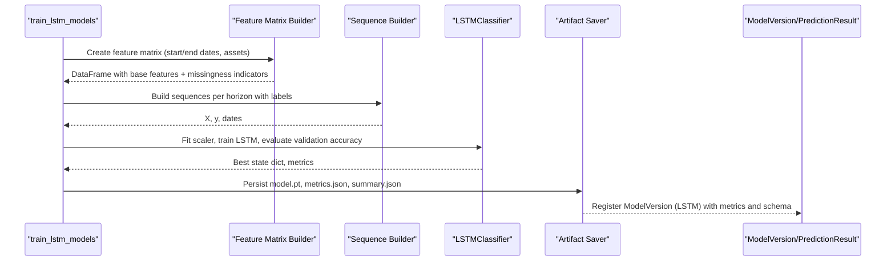

**Diagram sources**
- [tasks_lstm.py:41-800](file://apps/prediction/tasks_lstm.py#L41-L800)

**Section sources**
- [tasks_lstm.py:41-800](file://apps/prediction/tasks_lstm.py#L41-L800)

### Ensemble Weighting System
- Accuracy aggregation: Collects success accuracies from LightGBM results and reads heuristic and LSTM accuracies from active ModelVersion records.
- Weight normalization: Normalizes weighted contributions across models to produce daily ensemble weights.
- Snapshot persistence: Records EnsembleWeightSnapshot with basis lookback days and metrics used for weighting.
- Active ensemble version: Updates active Ensemble ModelVersion with weights and metadata for downstream consumption.

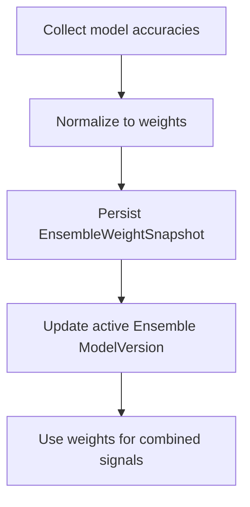

**Diagram sources**
- [tasks_lightgbm.py:631-729](file://apps/prediction/tasks_lightgbm.py#L631-L729)
- [models_lightgbm.py:97-111](file://apps/prediction/models_lightgbm.py#L97-L111)

**Section sources**
- [tasks_lightgbm.py:631-729](file://apps/prediction/tasks_lightgbm.py#L631-L729)

### Historical Features Pipeline
- Trading context resolution: Determines current trade date and position mapping per asset.
- Indicator matching: Finds latest TechnicalIndicator entries with parameter compatibility and staleness checks.
- Feature extraction: Retrieves RSI, momentum, BBANDS, SMA, RS score, returns, relative volume, realized volatility, and OHLCV data.
- Caching: Uses runtime caches keyed by asset, date, parameters, and limits to reduce repeated queries.

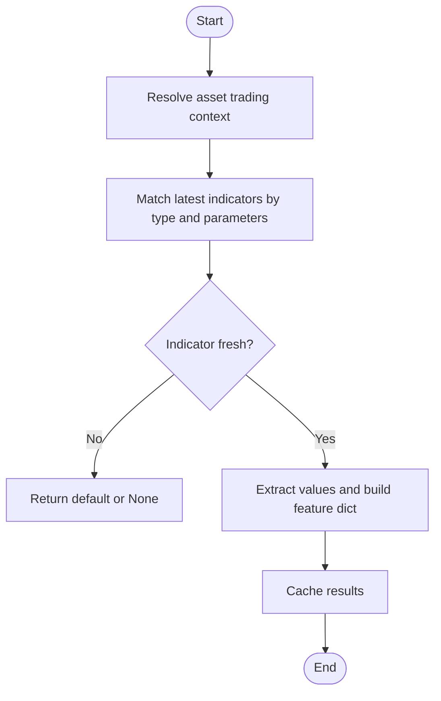

**Diagram sources**
- [historical_features.py:36-179](file://apps/prediction/historical_features.py#L36-L179)
- [historical_features.py:182-397](file://apps/prediction/historical_features.py#L182-L397)

**Section sources**
- [historical_features.py:36-179](file://apps/prediction/historical_features.py#L36-L179)
- [historical_features.py:182-397](file://apps/prediction/historical_features.py#L182-L397)

### Odds Calculation System
- Inputs: Asset ID, as-of date, horizon, up probability, predicted label, optional policy options.
- Resistance/support estimation: Uses recent highs/lows, Bollinger Bands, moving averages, and rounding heuristics to propose target and stop-loss prices.
- Risk-reward and trade score: Computes reward/risk and a normalized trade score considering down-side risk.
- Suggestion rule: Flags trades when label is UP and thresholds for risk-reward and trade score are met.

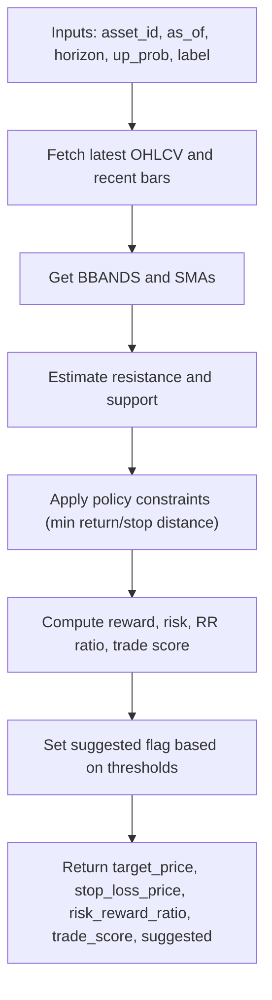

**Diagram sources**
- [odds.py:60-158](file://apps/prediction/odds.py#L60-L158)

**Section sources**
- [odds.py:60-158](file://apps/prediction/odds.py#L60-L158)

### Model Artifact Versioning System
- ModelVersion: Central registry for all model types with status, artifact paths, metrics, feature schemas, training windows, active flags, and metadata.
- LightGBMModelArtifact: Horizon-specific artifacts with metrics, feature names, training windows, active flags, feature importance, and metadata.
- LSTM artifacts: Per-horizon PyTorch model files with scaler stats, feature names, sequence length, and training metadata; summary.json aggregates results.
- Ensemble snapshots: Track dynamic weights and basis metrics for retrospective analysis.

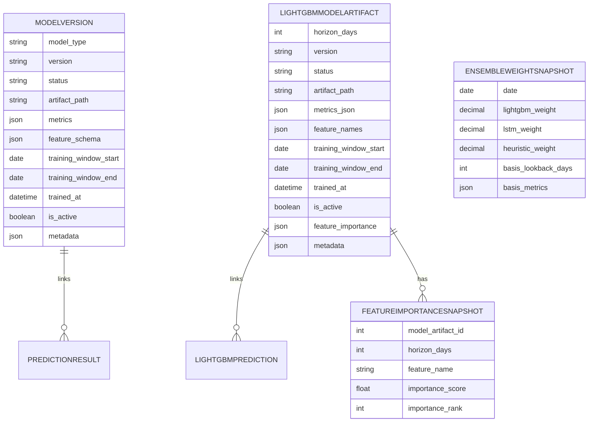

**Diagram sources**
- [models.py:7-106](file://apps/prediction/models.py#L7-L106)
- [models_lightgbm.py:7-137](file://apps/prediction/models_lightgbm.py#L7-L137)

**Section sources**
- [models.py:7-106](file://apps/prediction/models.py#L7-L106)
- [models_lightgbm.py:7-137](file://apps/prediction/models_lightgbm.py#L7-L137)

### Task Queues for Training, Feature Engineering, and Batch Predictions
- Celery configuration: Initializes Celery app with Django settings and autodiscovers tasks across apps.
- Heuristic tasks: Generate predictions for a date or single asset; ensure active ensemble version; persist results.
- LightGBM tasks: Train models per horizon, register artifacts, refresh ensemble weights, generate predictions, and manage feature pruning.
- LSTM tasks: Train sequence models per horizon, save artifacts, generate predictions, and integrate with ensemble weighting.

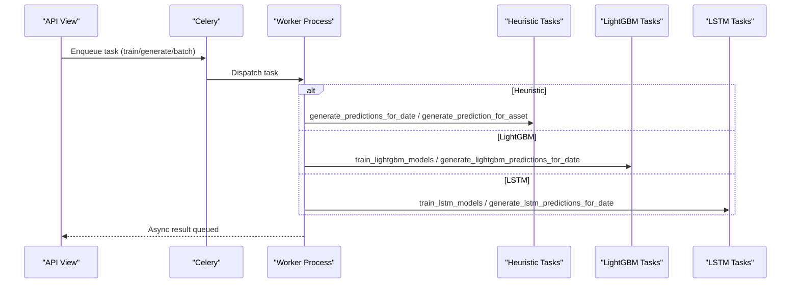

**Diagram sources**
- [celery.py:1-17](file://config/celery.py#L1-L17)
- [views.py:27-161](file://apps/prediction/views.py#L27-L161)
- [views_lightgbm.py:124-282](file://apps/prediction/views_lightgbm.py#L124-L282)
- [views_lstm.py:19-171](file://apps/prediction/views_lstm.py#L19-L171)
- [tasks.py:149-327](file://apps/prediction/tasks.py#L149-L327)
- [tasks_lightgbm.py:586-729](file://apps/prediction/tasks_lightgbm.py#L586-L729)
- [tasks_lstm.py:592-800](file://apps/prediction/tasks_lstm.py#L592-L800)

**Section sources**
- [celery.py:1-17](file://config/celery.py#L1-L17)
- [views.py:27-161](file://apps/prediction/views.py#L27-L161)
- [views_lightgbm.py:124-282](file://apps/prediction/views_lightgbm.py#L124-L282)
- [views_lstm.py:19-171](file://apps/prediction/views_lstm.py#L19-L171)
- [tasks.py:149-327](file://apps/prediction/tasks.py#L149-L327)
- [tasks_lightgbm.py:586-729](file://apps/prediction/tasks_lightgbm.py#L586-L729)
- [tasks_lstm.py:592-800](file://apps/prediction/tasks_lstm.py#L592-L800)

### Backtesting Integration
- Strategy types include prediction threshold strategies that use live candidate generation from heuristic, LightGBM, and LSTM sources.
- Candidates are recomputed at runtime per trading day using active artifacts and feature tables, ensuring comparability across runs.
- Backtest execution is chunked and resumable, persisting progress in report.runtime_state and supporting control actions like pause/restart/delete.
- Trades record signal payloads capturing candidate rank, metric, selection state, trade-decision levels, and model provenance.

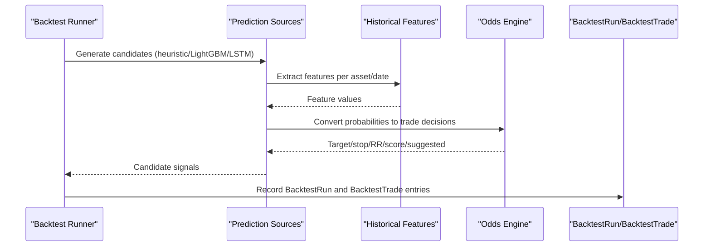

**Diagram sources**
- [tasks.py (backtest):1-800](file://apps/backtest/tasks.py#L1-L800)
- [models.py (backtest):24-168](file://apps/backtest/models.py#L24-L168)
- [odds.py:60-158](file://apps/prediction/odds.py#L60-L158)
- [tasks_lightgbm.py:586-729](file://apps/prediction/tasks_lightgbm.py#L586-L729)
- [tasks_lstm.py:592-800](file://apps/prediction/tasks_lstm.py#L592-L800)

**Section sources**
- [tasks.py (backtest):1-800](file://apps/backtest/tasks.py#L1-L800)
- [models.py (backtest):24-168](file://apps/backtest/models.py#L24-L168)

### API Endpoints for Accessing Predictions
- Heuristic predictions:
  - GET /api/v1/prediction/{stock_code}/: Returns per-stock predictions for specified horizons; auto-generates if missing.
  - POST /api/v1/prediction/batch/: Generates and returns grouped predictions for multiple stocks.
  - POST /api/v1/prediction/recalculate/: Queues retraining and inference.
- LightGBM predictions:
  - GET /api/v1/lightgbm-predictions/{stock_code}/: Returns LightGBM predictions per stock; auto-generates if missing.
  - POST /api/v1/lightgbm-predictions/train/: Queues LightGBM training.
  - POST /api/v1/lightgbm-predictions/recalculate/: Queues LightGBM inference.
  - POST /api/v1/lightgbm-predictions/batch/: Batch LightGBM predictions.
  - GET /api/v1/lightgbm-models/: Lists artifacts; includes feature-importance-trends action.
- LSTM predictions:
  - GET /api/v1/lstm-predictions/{stock_code}/: Returns LSTM predictions per stock; auto-generates if missing.
  - POST /api/v1/lstm-predictions/train/: Queues LSTM training.
  - POST /api/v1/lstm-predictions/recalculate/: Queues LSTM inference.
  - POST /api/v1/lstm-predictions/batch/: Batch LSTM predictions.

**Section sources**
- [views.py:27-161](file://apps/prediction/views.py#L27-L161)
- [views_lightgbm.py:30-282](file://apps/prediction/views_lightgbm.py#L30-L282)
- [views_lstm.py:19-171](file://apps/prediction/views_lstm.py#L19-L171)

## Dependency Analysis
Key dependencies and relationships:
- Prediction tasks depend on historical features, market universe selection, macro context, and odds calculation.
- LightGBM tasks depend on technical indicators, factors, sentiment, OHLCV, and model artifacts; they update ensemble weights and register ModelVersion entries.
- LSTM tasks depend on feature matrices, labels, and PyTorch artifacts; they also update ModelVersion entries and integrate with ensemble weighting.
- Backtest tasks depend on prediction sources and odds calculation but recompute candidates at runtime rather than reading stored predictions.

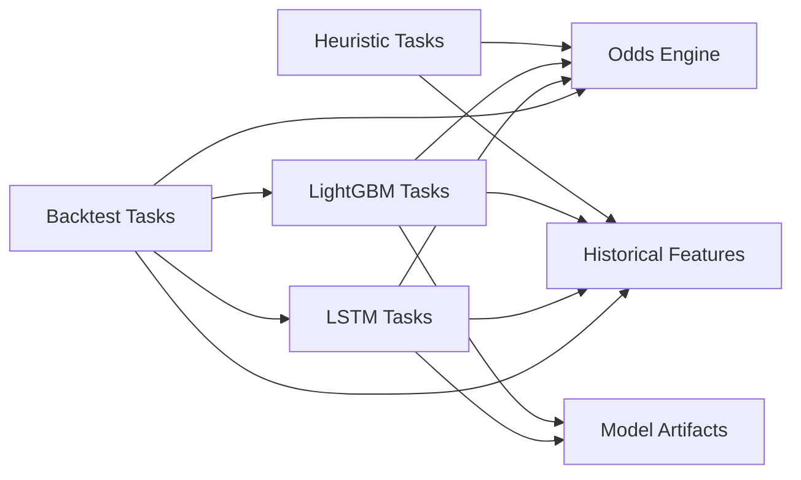

**Diagram sources**
- [tasks.py:149-243](file://apps/prediction/tasks.py#L149-L243)
- [tasks_lightgbm.py:586-729](file://apps/prediction/tasks_lightgbm.py#L586-L729)
- [tasks_lstm.py:592-800](file://apps/prediction/tasks_lstm.py#L592-L800)
- [tasks.py (backtest):1-800](file://apps/backtest/tasks.py#L1-L800)

**Section sources**
- [tasks.py:149-243](file://apps/prediction/tasks.py#L149-L243)
- [tasks_lightgbm.py:586-729](file://apps/prediction/tasks_lightgbm.py#L586-L729)
- [tasks_lstm.py:592-800](file://apps/prediction/tasks_lstm.py#L592-L800)
- [tasks.py (backtest):1-800](file://apps/backtest/tasks.py#L1-L800)

## Performance Considerations
- Caching: Runtime caches for indicator matches, OHLCV rows, and LSTM feature frames reduce database load during batch operations.
- Batch inference: LightGBM supports CPU batched and Windows GPU inference paths; backtest tasks track runtime metrics for optimization.
- Feature pruning: Importance-based pruning retains top features within bounds to improve throughput without sacrificing predictive power.
- Chunked backtests: Long-running backtests execute in chunks and resume safely, limiting memory usage and tolerating worker restarts.
- Staleness checks: Indicator freshness validation prevents stale signals from contaminating predictions.

[No sources needed since this section provides general guidance]

## Troubleshooting Guide
Common issues and resolutions:
- Missing indicators: If required indicators are absent or stale, functions return defaults; verify technical indicator backfills and parameter compatibility.
- No active model version: Ensure at least one READY model exists for the desired type; training tasks must complete successfully and set is_active=True.
- Insufficient data: LSTM training requires enough sequences; check sequence_length and available historical data coverage.
- GPU inference failures: If GPU predict fails, fallback to CPU; inspect device probing logs and environment setup.
- Ensemble weights not updating: Verify that accurate results exist for all model types; ensure ModelVersion records have metrics populated.

**Section sources**
- [historical_features.py:142-179](file://apps/prediction/historical_features.py#L142-L179)
- [tasks_lstm.py:234-263](file://apps/prediction/tasks_lstm.py#L234-L263)
- [tasks_lightgbm.py:202-247](file://apps/prediction/tasks_lightgbm.py#L202-L247)
- [tasks_lightgbm.py:631-729](file://apps/prediction/tasks_lightgbm.py#L631-L729)

## Conclusion
The Prediction application implements a robust, multi-model pipeline that integrates heuristic rules, LightGBM gradient boosting, and LSTM neural networks. It constructs high-quality features from diverse data sources, converts probabilities into actionable trade decisions, and maintains a dynamic ensemble weighting system backed by performance metrics. The artifact versioning system ensures traceability and reproducibility, while Celery task queues provide scalable training and inference workflows. Backtesting integration validates strategies using live candidate generation, and the API exposes convenient endpoints for accessing predictions and triggering retraining.