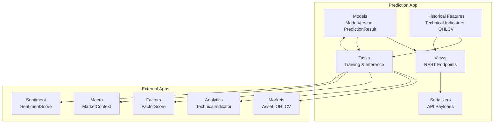
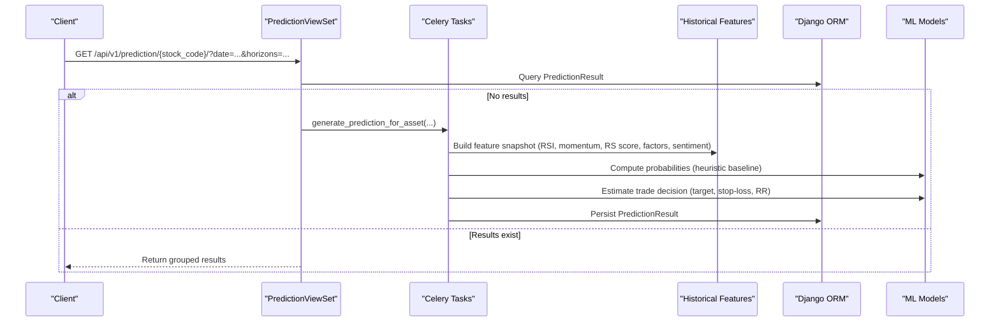
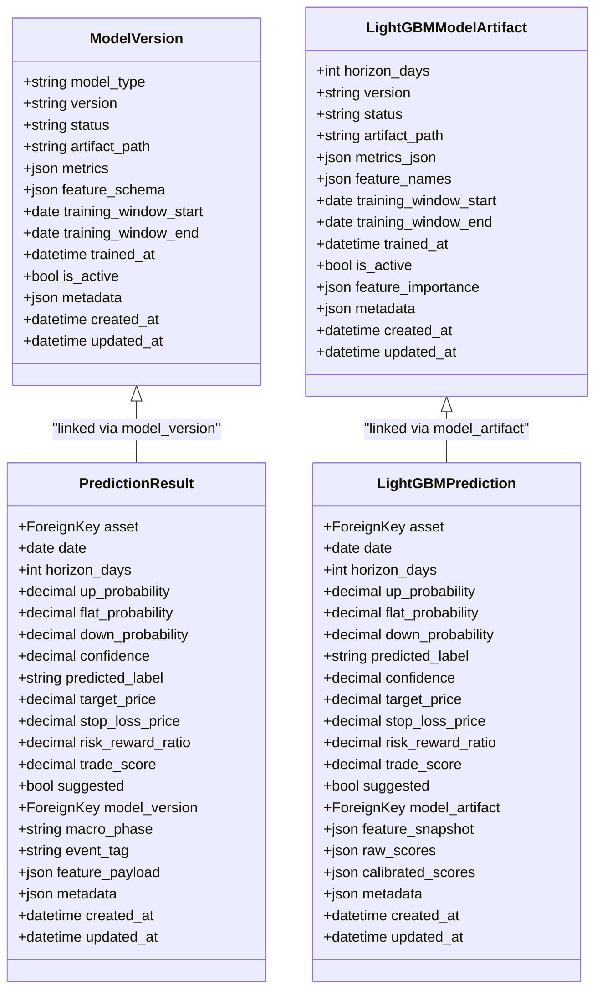
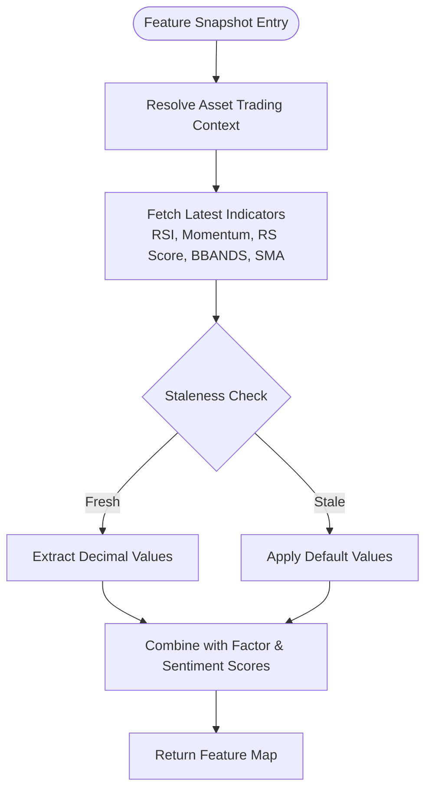
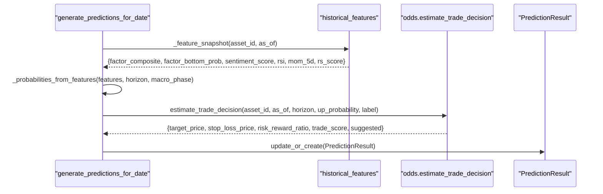
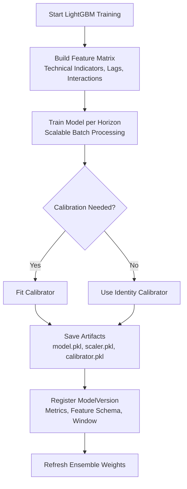
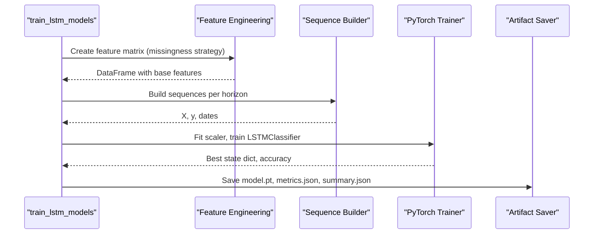
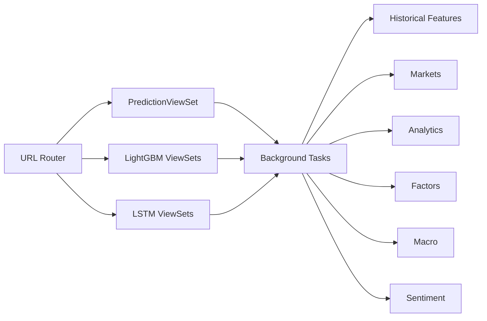
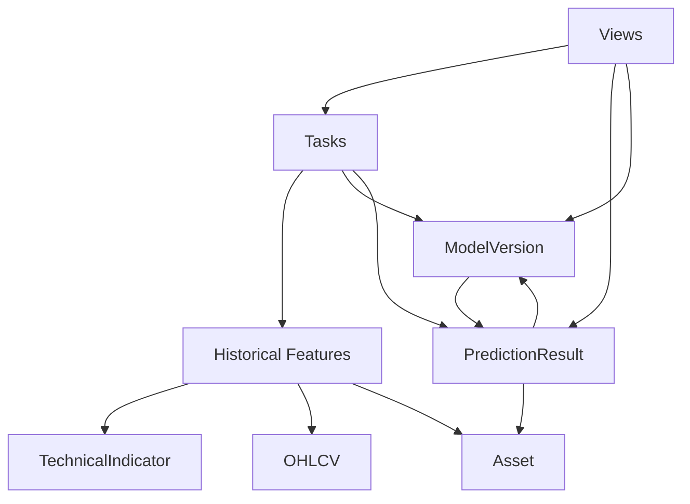

# Prediction Framework & Core Models

<cite>
**Referenced Files in This Document**
- [models.py](file://apps/prediction/models.py)
- [models_lightgbm.py](file://apps/prediction/models_lightgbm.py)
- [historical_features.py](file://apps/prediction/historical_features.py)
- [tasks.py](file://apps/prediction/tasks.py)
- [tasks_lightgbm.py](file://apps/prediction/tasks_lightgbm.py)
- [tasks_lstm.py](file://apps/prediction/tasks_lstm.py)
- [odds.py](file://apps/prediction/odds.py)
- [views.py](file://apps/prediction/views.py)
- [views_lightgbm.py](file://apps/prediction/views_lightgbm.py)
- [views_lstm.py](file://apps/prediction/views_lstm.py)
- [serializers.py](file://apps/prediction/serializers.py)
- [urls.py](file://config/urls.py)
</cite>

## Table of Contents
1. Introduction
2. Project Structure
3. Core Components
4. Architecture Overview
5. Detailed Component Analysis
6. Dependency Analysis
7. Performance Considerations
8. Troubleshooting Guide
9. Conclusion

## Introduction
This document explains the core prediction framework that orchestrates machine learning model training and inference across LightGBM, LSTM, and an ensemble baseline. It documents:
- The ModelVersion model for tracking ML models (LightGBM, LSTM, Ensemble) with lifecycle status, artifact paths, metrics, and feature schemas.
- The PredictionResult model storing model outputs including probability distributions (up/flat/down), confidence scores, trade decisions, target prices, stop-loss levels, and risk-reward ratios.
- The historical features pipeline that constructs training datasets from derived data sources across markets, analytics, factors, macro, and sentiment applications.
- The task orchestration system managing model training workflows, batch prediction generation, and feature engineering pipelines.
- Integration patterns with other applications and API endpoints for accessing predictions and model metadata.

## Project Structure
The prediction subsystem is organized under apps/prediction with clear separation of concerns:
- Data models define persistent entities for model versions, artifacts, and predictions.
- Feature utilities build consistent inputs from technical indicators, OHLCV, factors, sentiment, and macro context.
- Task modules implement Celery-based training and inference for LightGBM and LSTM, plus a heuristic ensemble baseline.
- Views expose REST APIs to query results, trigger retraining, and run batch inference.
- URL configuration wires all viewsets into the application router.

**Diagram sources**
- [models.py:7-97](file://apps/prediction/models.py#L7-L97)
- [models_lightgbm.py:7-137](file://apps/prediction/models_lightgbm.py#L7-L137)
- [historical_features.py:15-397](file://apps/prediction/historical_features.py#L15-L397)
- [tasks.py:149-327](file://apps/prediction/tasks.py#L149-L327)
- [tasks_lightgbm.py:54-730](file://apps/prediction/tasks_lightgbm.py#L54-L730)
- [tasks_lstm.py:41-442](file://apps/prediction/tasks_lstm.py#L41-L442)
- [views.py:15-162](file://apps/prediction/views.py#L15-L162)
- [views_lightgbm.py:30-282](file://apps/prediction/views_lightgbm.py#L30-L282)
- [views_lstm.py:19-171](file://apps/prediction/views_lstm.py#L19-L171)
- [serializers.py:6-33](file://apps/prediction/serializers.py#L6-L33)

**Section sources**
- [models.py:7-97](file://apps/prediction/models.py#L7-L97)
- [models_lightgbm.py:7-137](file://apps/prediction/models_lightgbm.py#L7-L137)
- [historical_features.py:15-397](file://apps/prediction/historical_features.py#L15-L397)
- [tasks.py:149-327](file://apps/prediction/tasks.py#L149-L327)
- [tasks_lightgbm.py:54-730](file://apps/prediction/tasks_lightgbm.py#L54-L730)
- [tasks_lstm.py:41-442](file://apps/prediction/tasks_lstm.py#L41-L442)
- [views.py:15-162](file://apps/prediction/views.py#L15-L162)
- [views_lightgbm.py:30-282](file://apps/prediction/views_lightgbm.py#L30-L282)
- [views_lstm.py:19-171](file://apps/prediction/views_lstm.py#L19-L171)
- [serializers.py:6-33](file://apps/prediction/serializers.py#L6-L33)
- [urls.py:74-107](file://config/urls.py#L74-L107)

## Core Components
- ModelVersion: Tracks model type (LIGHTGBM, LSTM, ENSEMBLE), version string, lifecycle status (TRAINING, READY, FAILED, ARCHIVED), artifact path, metrics, feature schema, training window dates, trained timestamp, active flag, and arbitrary metadata.
- PredictionResult: Stores per-asset, per-date, per-horizon predictions with up/flat/down probabilities, confidence, predicted label, optional target price, stop loss, risk-reward ratio, trade score, suggestion flag, linked model version, macro phase, event tag, feature payload, and timestamps.
- LightGBM-specific models: LightGBMModelArtifact (per horizon, versioned artifacts with metrics and feature names), LightGBMPrediction (parallel to PredictionResult for LightGBM), EnsembleWeightSnapshot (time-varying weights), FeatureImportanceSnapshot (feature importance history).

These models provide a unified registry for model lineage and outputs, enabling traceability from raw features to final predictions and trade signals.

**Section sources**
- [models.py:7-97](file://apps/prediction/models.py#L7-L97)
- [models_lightgbm.py:7-137](file://apps/prediction/models_lightgbm.py#L7-L137)

## Architecture Overview
The framework integrates multiple data sources to produce predictions via three strategies:
- Heuristic ensemble baseline using factor scores, sentiment, technical indicators, and macro context.
- LightGBM gradient boosting models trained on engineered features with calibration and optional GPU acceleration.
- LSTM sequence models trained on time-series feature sequences with missingness-aware handling.

**Diagram sources**
- [views.py:37-97](file://apps/prediction/views.py#L37-L97)
- [tasks.py:177-243](file://apps/prediction/tasks.py#L177-L243)
- [historical_features.py:182-397](file://apps/prediction/historical_features.py#L182-L397)
- [odds.py:60-158](file://apps/prediction/odds.py#L60-L158)

## Detailed Component Analysis

### ModelVersion and PredictionResult
- ModelVersion centralizes model identity and provenance:
  - Fields include model_type, version, status, artifact_path, metrics, feature_schema, training_window_start/end, trained_at, is_active, metadata, and timestamps.
  - Unique constraints ensure one active version per model_type/version combination; indexes optimize queries by model_type and activity.
- PredictionResult captures outputs:
  - Probability distribution over UP/FLAT/DOWN, confidence, predicted_label, optional target_price, stop_loss_price, risk_reward_ratio, trade_score, suggested flag.
  - Links to ModelVersion, records macro_phase and event_tag, stores feature_payload and metadata for auditability.
  - Indexes support efficient retrieval by date, horizon, label, and asset combinations.

**Diagram sources**
- [models.py:7-97](file://apps/prediction/models.py#L7-L97)
- [models_lightgbm.py:7-137](file://apps/prediction/models_lightgbm.py#L7-L137)

**Section sources**
- [models.py:7-97](file://apps/prediction/models.py#L7-L97)
- [models_lightgbm.py:7-137](file://apps/prediction/models_lightgbm.py#L7-L137)

### Historical Features Pipeline
The historical features module builds consistent inputs from:
- Markets: OHLCV latest bars and trading calendar alignment.
- Analytics: Technical indicators (RSI, BBANDS, SMA, momentum, relative volume, realized volatility) with staleness checks and parameter matching.
- Factors: Composite and bottom-probability scores.
- Sentiment: Asset-level sentiment scores.
- Macro: Current market context used to adjust probabilities.

Key behaviors:
- Resolves asset trading context and ensures indicator freshness based on trading positions and gaps.
- Parameterized indicator selection supports exact or compatible parameters and ranks best matches per date.
- Caches lookups to reduce repeated database queries during batch processing.

**Diagram sources**
- [historical_features.py:36-179](file://apps/prediction/historical_features.py#L36-L179)
- [historical_features.py:182-397](file://apps/prediction/historical_features.py#L182-L397)

**Section sources**
- [historical_features.py:36-179](file://apps/prediction/historical_features.py#L36-L179)
- [historical_features.py:182-397](file://apps/prediction/historical_features.py#L182-L397)

### Heuristic Ensemble Baseline
The baseline computes probabilities from:
- Factor composite and bottom probability.
- Sentiment score.
- Technical indicators (RSI, momentum, RS score).
- Horizon scaling and macro phase adjustments.

Trade decision estimation uses recent OHLCV ranges, Bollinger Bands, moving averages, and policy thresholds to derive target price, stop-loss, risk-reward ratio, trade score, and suggestion flags.

**Diagram sources**
- [tasks.py:55-147](file://apps/prediction/tasks.py#L55-L147)
- [tasks.py:177-243](file://apps/prediction/tasks.py#L177-L243)
- [odds.py:60-158](file://apps/prediction/odds.py#L60-L158)

**Section sources**
- [tasks.py:55-147](file://apps/prediction/tasks.py#L55-L147)
- [tasks.py:177-243](file://apps/prediction/tasks.py#L177-L243)
- [odds.py:60-158](file://apps/prediction/odds.py#L60-L158)

### LightGBM Training and Inference
LightGBM components:
- Model artifacts store model.bin, scaler.pkl, calibrator.pkl, and metadata per horizon and version.
- Feature engineering includes technical indicators, lags, interactions, and optional pruning based on feature importance snapshots.
- Calibration supports identity calibrators when models already emit probabilities; GPU detection optimizes inference when available.
- Ensemble weight snapshots are refreshed based on accuracies across models.

**Diagram sources**
- [tasks_lightgbm.py:54-157](file://apps/prediction/tasks_lightgbm.py#L54-L157)
- [tasks_lightgbm.py:163-409](file://apps/prediction/tasks_lightgbm.py#L163-L409)
- [tasks_lightgbm.py:586-730](file://apps/prediction/tasks_lightgbm.py#L586-L730)

**Section sources**
- [tasks_lightgbm.py:54-157](file://apps/prediction/tasks_lightgbm.py#L54-L157)
- [tasks_lightgbm.py:163-409](file://apps/prediction/tasks_lightgbm.py#L163-L409)
- [tasks_lightgbm.py:586-730](file://apps/prediction/tasks_lightgbm.py#L586-L730)

### LSTM Training and Inference
LSTM components:
- Sequence construction from feature matrices with configurable sequence length and missingness handling.
- Training splits sequences into train/validation, fits StandardScaler, trains PyTorch LSTMClassifier, and saves artifacts with scaler statistics and metadata.
- Inference loads model artifacts, builds sequences per asset, normalizes, and predicts probabilities; trade decisions computed similarly to baseline.

**Diagram sources**
- [tasks_lstm.py:41-142](file://apps/prediction/tasks_lstm.py#L41-L142)
- [tasks_lstm.py:473-589](file://apps/prediction/tasks_lstm.py#L473-L589)
- [tasks_lstm.py:592-800](file://apps/prediction/tasks_lstm.py#L592-L800)

**Section sources**
- [tasks_lstm.py:41-142](file://apps/prediction/tasks_lstm.py#L41-L142)
- [tasks_lstm.py:473-589](file://apps/prediction/tasks_lstm.py#L473-L589)
- [tasks_lstm.py:592-800](file://apps/prediction/tasks_lstm.py#L592-L800)

### API Endpoints and Integration
Exposed endpoints:
- Model versions: Read-only access to ModelVersion entries filtered by model_type.
- Predictions: Per-stock and batch retrieval; auto-trigger inference if missing; recalculate triggers background tasks.
- LightGBM: Dedicated endpoints for model artifacts, predictions, training, recalculation, and feature importance trends.
- LSTM: Dedicated endpoints for predictions, training, recalculation, and batch operations.

Integration points:
- Markets: Asset universe and OHLCV data feed feature computation and trade decision logic.
- Analytics: Technical indicators supply RSI, BBANDS, SMA, momentum, and returns.
- Factors: Composite and bottom-probability scores influence probabilities.
- Macro: Market context adjusts probabilities based on macro phases.
- Sentiment: Asset sentiment scores contribute to signal strength.

**Diagram sources**
- [urls.py:74-107](file://config/urls.py#L74-L107)
- [views.py:15-162](file://apps/prediction/views.py#L15-L162)
- [views_lightgbm.py:30-282](file://apps/prediction/views_lightgbm.py#L30-L282)
- [views_lstm.py:19-171](file://apps/prediction/views_lstm.py#L19-L171)

**Section sources**
- [urls.py:74-107](file://config/urls.py#L74-L107)
- [views.py:15-162](file://apps/prediction/views.py#L15-L162)
- [views_lightgbm.py:30-282](file://apps/prediction/views_lightgbm.py#L30-L282)
- [views_lstm.py:19-171](file://apps/prediction/views_lstm.py#L19-L171)

## Dependency Analysis
- ModelVersion depends on Asset indirectly through PredictionResult relationships and is queried by views and tasks to manage active versions.
- PredictionResult depends on ModelVersion and Asset; it also records macro_phase and event_tag sourced from MarketContext.
- Historical features depend on TechnicalIndicator, OHLCV, Asset, and staleness utilities to ensure data quality and timeliness.
- Tasks depend on external apps for data: markets, analytics, factors, macro, sentiment; they persist results back to prediction models.
- Views depend on serializers to format responses and on tasks to trigger asynchronous work.

**Diagram sources**
- [models.py:7-97](file://apps/prediction/models.py#L7-L97)
- [historical_features.py:11-13](file://apps/prediction/historical_features.py#L11-L13)
- [tasks.py:8-16](file://apps/prediction/tasks.py#L8-L16)
- [views.py:9-12](file://apps/prediction/views.py#L9-L12)

**Section sources**
- [models.py:7-97](file://apps/prediction/models.py#L7-L97)
- [historical_features.py:11-13](file://apps/prediction/historical_features.py#L11-L13)
- [tasks.py:8-16](file://apps/prediction/tasks.py#L8-L16)
- [views.py:9-12](file://apps/prediction/views.py#L9-L12)

## Performance Considerations
- Caching:
  - Historical features cache key-based lookups for asset trading context and indicator rows to avoid repeated queries.
  - LightGBM artifact cache limits memory usage while improving load times.
  - Feature importance trends endpoint caches aggregated results for one hour.
- Staleness checks:
  - Indicator freshness validated against trading positions and max gap thresholds to prevent stale inputs.
- Efficient queries:
  - Select_related and indexed fields optimize retrieval for assets, horizons, and labels.
- GPU acceleration:
  - LightGBM inference probes for GPU device types and uses them when supported by identity-calibrated models.
- Sequence batching:
  - LSTM training uses DataLoader with batch sizes tuned for throughput and memory constraints.

[No sources needed since this section provides general guidance]

## Troubleshooting Guide
Common issues and resolutions:
- Missing predictions:
  - If no results exist for a stock/date/horizon, the API triggers background inference; verify task execution and data availability.
- Stale indicators:
  - Ensure technical indicators are up-to-date; staleness checks may return defaults if data is behind trading calendar positions.
- Model artifacts not found:
  - For LightGBM/LSTM, confirm artifact paths exist and model files are present; check ModelVersion artifact_path and file system permissions.
- Insufficient data:
  - LSTM training requires minimum sequence samples; insufficient data returns status messages indicating reasons like no assets or empty feature matrix.
- Macro context:
  - Probabilities adjust based on macro phase; ensure MarketContext has active current entries for expected behavior.

**Section sources**
- [views.py:60-73](file://apps/prediction/views.py#L60-L73)
- [historical_features.py:170-179](file://apps/prediction/historical_features.py#L170-L179)
- [tasks_lightgbm.py:121-156](file://apps/prediction/tasks_lightgbm.py#L121-L156)
- [tasks_lstm.py:620-709](file://apps/prediction/tasks_lstm.py#L620-L709)

## Conclusion
The prediction framework provides a robust, extensible system for training and serving ML models across multiple algorithms and horizons. It maintains strong data provenance via ModelVersion and PredictionResult, constructs high-quality features from diverse sources, and exposes clean APIs for consumption. The integration of heuristic baselines, LightGBM, and LSTM enables comparative analysis and ensemble weighting, while caching and staleness checks ensure reliability and performance.

[No sources needed since this section summarizes without analyzing specific files]