# Sentiment Application

<cite>
**Referenced Files in This Document**
- [models.py](file://apps/sentiment/models.py)
- [providers.py](file://apps/sentiment/providers.py)
- [tasks.py](file://apps/sentiment/tasks.py)
- [views.py](file://apps/sentiment/views.py)
- [serializers.py](file://apps/sentiment/serializers.py)
- [admin.py](file://apps/sentiment/admin.py)
- [backfill_news.py](file://apps/sentiment/management/commands/backfill_news.py)
- [views.py](file://apps/analytics/views.py)
- [tasks_lightgbm.py](file://apps/prediction/tasks_lightgbm.py)
</cite>

## Table of Contents
1. [Introduction](#introduction)
2. [Project Structure](#project-structure)
3. [Core Components](#core-components)
4. [Architecture Overview](#architecture-overview)
5. [Detailed Component Analysis](#detailed-component-analysis)
6. [Dependency Analysis](#dependency-analysis)
7. [Performance Considerations](#performance-considerations)
8. [Troubleshooting Guide](#troubleshooting-guide)
9. [Conclusion](#conclusion)
10. [Appendices](#appendices)

## Introduction
The Sentiment application ingests Chinese-language financial news from multiple providers, normalizes and deduplicates it, scores sentiment per article, attributes articles to assets, aggregates time-series sentiment indicators, and exposes them via APIs for dashboards and downstream models. It also tracks trending concepts through a heat mapping system and provides management commands to backfill historical data safely with throttling and retries.

## Project Structure
The sentiment module is organized as a Django app with clear separation between persistence (models), ingestion and scoring (tasks), provider adapters (providers), API surface (views + serializers), admin tools, and a backfill command.

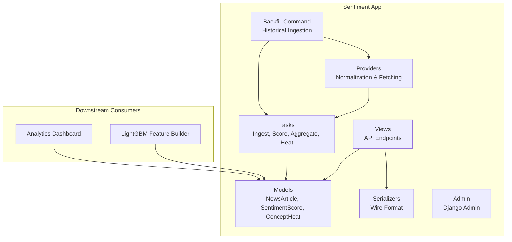

**Diagram sources**
- [models.py:35-125](file://apps/sentiment/models.py#L35-L125)
- [providers.py:221-312](file://apps/sentiment/providers.py#L221-L312)
- [tasks.py:283-565](file://apps/sentiment/tasks.py#L283-L565)
- [views.py:36-122](file://apps/sentiment/views.py#L36-L122)
- [serializers.py:20-54](file://apps/sentiment/serializers.py#L20-L54)
- [admin.py:6-28](file://apps/sentiment/admin.py#L6-L28)
- [backfill_news.py:43-176](file://apps/sentiment/management/commands/backfill_news.py#L43-L176)
- [views.py:260-350](file://apps/analytics/views.py#L260-L350)
- [tasks_lightgbm.py:1036-1051](file://apps/prediction/tasks_lightgbm.py#L1036-L1051)

**Section sources**
- [models.py:1-27](file://apps/sentiment/models.py#L1-L27)
- [providers.py:1-26](file://apps/sentiment/providers.py#L1-L26)
- [tasks.py:1-30](file://apps/sentiment/tasks.py#L1-L30)
- [views.py:1-21](file://apps/sentiment/views.py#L1-L21)

## Core Components
- NewsArticle: stores raw ingested content, source attribution, publication timestamp, language, related assets, concept tags, and metadata. Deduplicated by URL.
- SentimentScore: unified table storing three scopes:
  - ARTICLE: per-article score used for inspection and QA.
  - ASSET_7D: rolling 7-day per-asset aggregation consumed by models and dashboards.
  - MARKET_7D: rolling market-wide aggregation for dashboard surfaces only.
- ConceptHeat: daily aggregation of inferred concept tags to identify trending themes.

Key design notes:
- Unique constraint on (article, asset, date, score_type) makes aggregation idempotent.
- Asset attribution uses name aliases rather than ticker mentions because Chinese news commonly refers to companies by name or abbreviation.
- Provider normalization handles different record shapes, datetime formats, and synthetic URLs when no stable URL exists.

**Section sources**
- [models.py:35-125](file://apps/sentiment/models.py#L35-L125)
- [tasks.py:183-222](file://apps/sentiment/tasks.py#L183-L222)
- [providers.py:46-80](file://apps/sentiment/providers.py#L46-L80)

## Architecture Overview
The pipeline has four stages: fetch/normalize, ingest, score, aggregate.

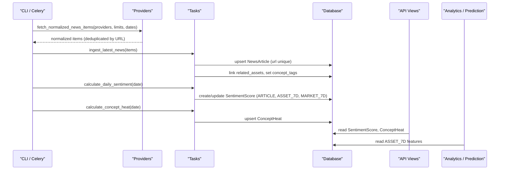

**Diagram sources**
- [providers.py:284-312](file://apps/sentiment/providers.py#L284-L312)
- [tasks.py:283-351](file://apps/sentiment/tasks.py#L283-L351)
- [tasks.py:393-522](file://apps/sentiment/tasks.py#L393-L522)
- [tasks.py:524-565](file://apps/sentiment/tasks.py#L524-L565)
- [views.py:36-122](file://apps/sentiment/views.py#L36-L122)
- [views.py:260-350](file://apps/analytics/views.py#L260-L350)
- [tasks_lightgbm.py:1036-1051](file://apps/prediction/tasks_lightgbm.py#L1036-L1051)

## Detailed Component Analysis

### Data Models
- NewsArticle
  - Fields: source, title, url (unique), published_at, content, summary, language, related_assets (M2M), concept_tags (JSON), metadata, created_at.
  - Indexes optimize queries by source and published_at.
- SentimentScore
  - Fields: optional article, optional asset, date, score_type, positive/neutral/negative scores, overall sentiment_score, sentiment_label, metadata, created_at.
  - Unique together ensures idempotent upserts during aggregation.
  - Indexes support efficient time-series queries by asset/date and score_type/date.
- ConceptHeat
  - Fields: concept_name, date, heat_score, article_count, up_limit_count, net_inflow, metadata, created_at.
  - Unique together on (concept_name, date).

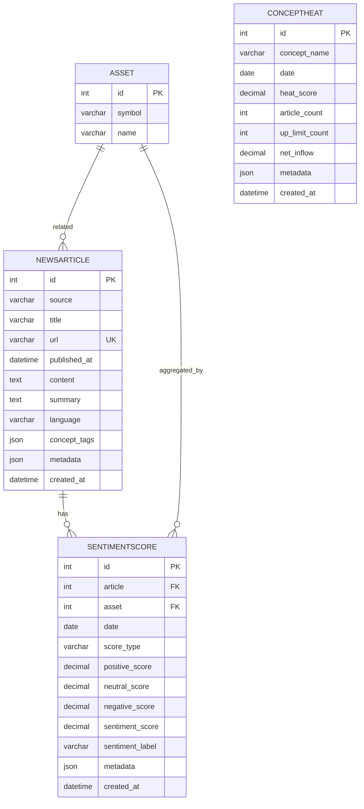

**Diagram sources**
- [models.py:35-125](file://apps/sentiment/models.py#L35-L125)

**Section sources**
- [models.py:35-125](file://apps/sentiment/models.py#L35-L125)

### Provider Abstraction and Normalization
- Providers supported: Eastmoney, Sina, Tonghuashun, and Tushare-based major/CCTV feeds.
- Each provider returns different fields and datetime formats; normalization maps them into a common shape with source label, title, summary, content, url, published_at, language, concept_tags, and metadata.
- Synthetic URLs are generated deterministically when providers do not supply stable URLs, enabling deduplication across runs.
- Date coercion supports multiple formats and timezone-aware datetimes.
- fetch_normalized_news_items collects records from configured providers, filters by date window, deduplicates by URL, sorts by published_at descending.

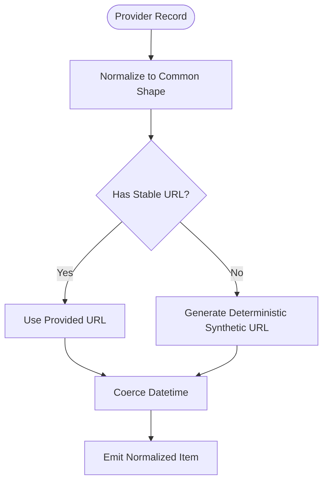

**Diagram sources**
- [providers.py:46-80](file://apps/sentiment/providers.py#L46-L80)
- [providers.py:82-218](file://apps/sentiment/providers.py#L82-L218)
- [providers.py:284-312](file://apps/sentiment/providers.py#L284-L312)

**Section sources**
- [providers.py:1-26](file://apps/sentiment/providers.py#L1-L26)
- [providers.py:46-80](file://apps/sentiment/providers.py#L46-L80)
- [providers.py:82-218](file://apps/sentiment/providers.py#L82-L218)
- [providers.py:221-312](file://apps/sentiment/providers.py#L221-L312)

### Article Scoring Algorithms
- Tokenization: uses jieba if available; otherwise falls back to regex-based token extraction for Chinese and Latin characters.
- Lexicon scoring: counts positive and negative tokens against curated word lists; computes a normalized sentiment score in [-1, 1] and splits into positive/neutral/negative components.
- Labeling: thresholds classify sentiment as POSITIVE, NEUTRAL, or NEGATIVE.
- Important caveat: the scorer is neutral-heavy; neutral often means “no evidence” rather than “no signal.”

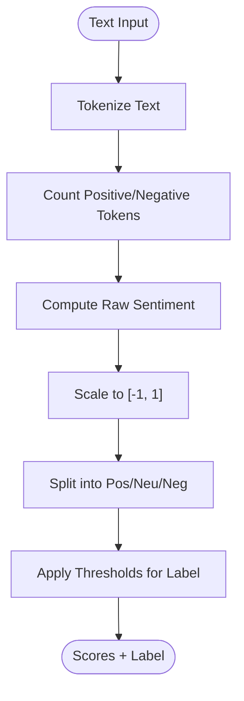

**Diagram sources**
- [tasks.py:97-139](file://apps/sentiment/tasks.py#L97-L139)

**Section sources**
- [tasks.py:52-70](file://apps/sentiment/tasks.py#L52-L70)
- [tasks.py:97-139](file://apps/sentiment/tasks.py#L97-L139)

### Asset Attribution and Concept Tagging
- Asset matching builds an index of active assets using names, symbols, codes, stripped legal suffixes, and overrides; matches against normalized title/summary/content with caps to avoid over-attribution.
- Concept tagging infers theme tags by matching predefined keyword sets for sectors and topics.

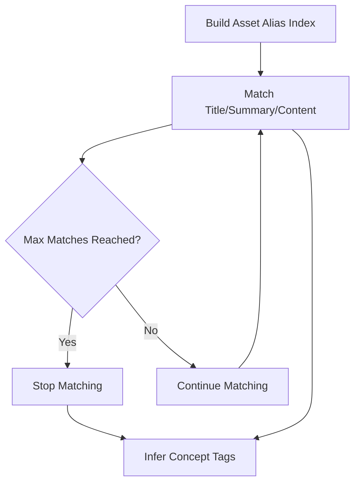

**Diagram sources**
- [tasks.py:147-222](file://apps/sentiment/tasks.py#L147-L222)

**Section sources**
- [tasks.py:147-222](file://apps/sentiment/tasks.py#L147-L222)

### Aggregation and Time-Series Indicators
- Daily scoring creates ARTICLE-level scores for each article and per-asset links.
- Rolling 7-day ASSET_7D aggregation averages sentiment per asset over the lookback window; ensures every historically listed asset has a row even if no articles matched.
- MARKET_7D aggregates all ARTICLE scores over the same window for a market-wide indicator.
- All writes use update_or_create keyed by (article, asset, date, score_type) to guarantee idempotency.

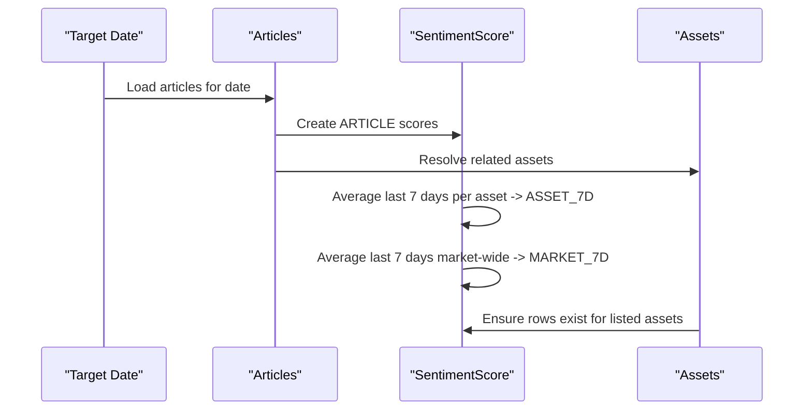

**Diagram sources**
- [tasks.py:393-522](file://apps/sentiment/tasks.py#L393-L522)

**Section sources**
- [tasks.py:393-522](file://apps/sentiment/tasks.py#L393-L522)

### Concept Heat Mapping
- Counts daily occurrences of concept tags across articles and persists heat_score and article_count per concept per day.
- Provides a top concepts endpoint for dashboards.

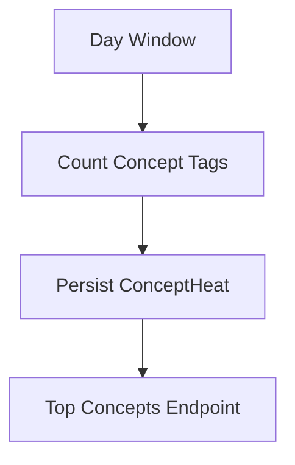

**Diagram sources**
- [tasks.py:524-558](file://apps/sentiment/tasks.py#L524-L558)
- [views.py:100-122](file://apps/sentiment/views.py#L100-L122)

**Section sources**
- [tasks.py:524-558](file://apps/sentiment/tasks.py#L524-L558)
- [views.py:100-122](file://apps/sentiment/views.py#L100-L122)

### Task Queue System
- Celery tasks orchestrate:
  - fetch_latest_market_news: pulls normalized items from providers and queues ingestion.
  - ingest_latest_news: persists NewsArticle and links assets/tags.
  - run_hourly_historical_news_backfill: advances through history in bounded chunks respecting a floor date.
  - run_daily_sentiment_pipeline: triggers daily scoring and heat calculation asynchronously.
- Quota errors from providers are detected and treated as retryable conditions to avoid false “no news” signals.

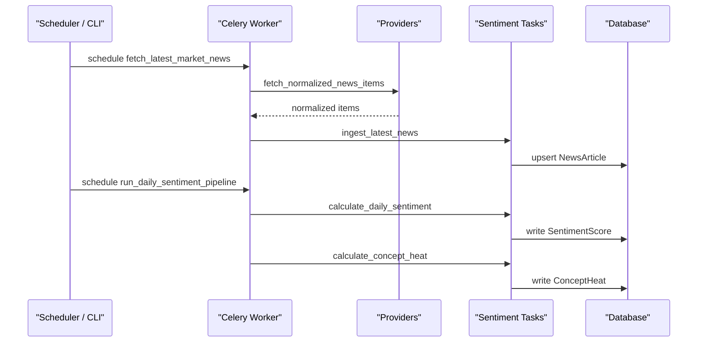

**Diagram sources**
- [tasks.py:283-391](file://apps/sentiment/tasks.py#L283-L391)
- [tasks.py:560-565](file://apps/sentiment/tasks.py#L560-L565)

**Section sources**
- [tasks.py:1-30](file://apps/sentiment/tasks.py#L1-L30)
- [tasks.py:283-391](file://apps/sentiment/tasks.py#L283-L391)
- [tasks.py:560-565](file://apps/sentiment/tasks.py#L560-L565)

### Management Command: Backfill Historical News
- Supports precise datetime windows (--start-at, --end-at) due to intraday timestamps and provider rate limits.
- Chunks large ranges by configurable days, sleeps between chunks, retries on quota errors, and can queue work via Celery.
- Dry-run mode previews fetched rows without writing.
- Optional pipeline execution after ingest to compute sentiment and concept heat.

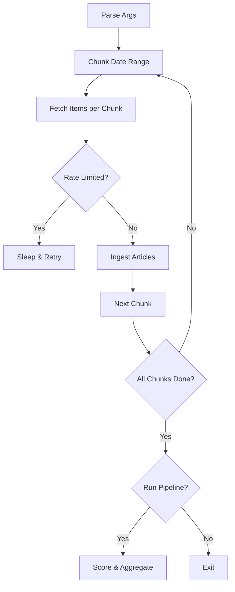

**Diagram sources**
- [backfill_news.py:43-176](file://apps/sentiment/management/commands/backfill_news.py#L43-L176)

**Section sources**
- [backfill_news.py:1-27](file://apps/sentiment/management/commands/backfill_news.py#L1-L27)
- [backfill_news.py:43-176](file://apps/sentiment/management/commands/backfill_news.py#L43-L176)

### API Surface and Integration Points
- Read-only viewsets:
  - NewsArticleViewSet: list/filter by source; async ingest endpoint.
  - SentimentScoreViewSet: filter by score_type and asset; latest convenience action; recalculate trigger.
  - ConceptHeatViewSet: list/filter; top endpoint for latest day’s ranked concepts.
- Serializers ensure Decimal precision is preserved on the wire.
- Downstream consumers:
  - Analytics dashboard reads latest ASSET_7D sentiment per asset to enrich factor views.
  - LightGBM feature builder reads ASSET_7D sentiment series to construct features like sentiment_7d and sentiment_7d_avg_20d.

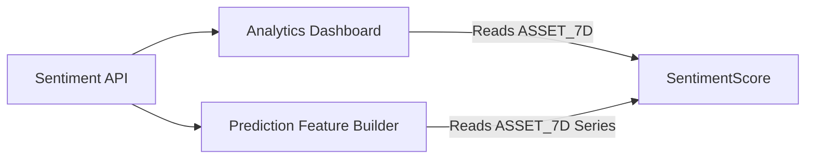

**Diagram sources**
- [views.py:36-122](file://apps/sentiment/views.py#L36-L122)
- [serializers.py:20-54](file://apps/sentiment/serializers.py#L20-L54)
- [views.py:260-350](file://apps/analytics/views.py#L260-L350)
- [tasks_lightgbm.py:1036-1051](file://apps/prediction/tasks_lightgbm.py#L1036-L1051)

**Section sources**
- [views.py:36-122](file://apps/sentiment/views.py#L36-L122)
- [serializers.py:20-54](file://apps/sentiment/serializers.py#L20-L54)
- [views.py:260-350](file://apps/analytics/views.py#L260-L350)
- [tasks_lightgbm.py:1036-1051](file://apps/prediction/tasks_lightgbm.py#L1036-L1051)

## Dependency Analysis
- Internal dependencies:
  - tasks depend on providers for fetching and on models for persistence.
  - views depend on models and serializers; some actions enqueue tasks.
  - backfill command depends on providers and tasks.
  - analytics and prediction apps consume SentimentScore directly for features and dashboards.
- External dependencies:
  - akshare and tushare for provider data retrieval.
  - jieba for tokenization (optional).
  - Celery for asynchronous task execution.

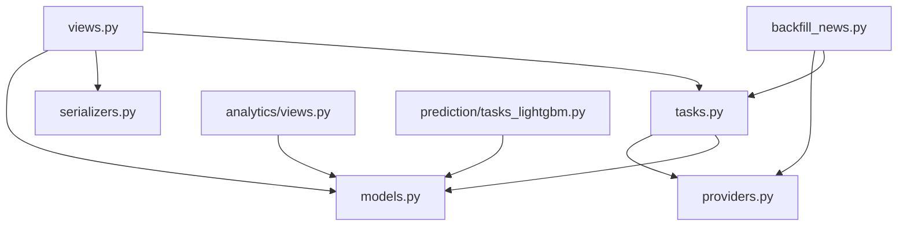

**Diagram sources**
- [tasks.py:32-45](file://apps/sentiment/tasks.py#L32-L45)
- [providers.py:28-35](file://apps/sentiment/providers.py#L28-L35)
- [views.py:31-34](file://apps/sentiment/views.py#L31-L34)
- [backfill_news.py:34-40](file://apps/sentiment/management/commands/backfill_news.py#L34-L40)
- [views.py:260-350](file://apps/analytics/views.py#L260-L350)
- [tasks_lightgbm.py:1036-1051](file://apps/prediction/tasks_lightgbm.py#L1036-L1051)

**Section sources**
- [tasks.py:32-45](file://apps/sentiment/tasks.py#L32-L45)
- [providers.py:28-35](file://apps/sentiment/providers.py#L28-L35)
- [views.py:31-34](file://apps/sentiment/views.py#L31-L34)
- [backfill_news.py:34-40](file://apps/sentiment/management/commands/backfill_news.py#L34-L40)
- [views.py:260-350](file://apps/analytics/views.py#L260-L350)
- [tasks_lightgbm.py:1036-1051](file://apps/prediction/tasks_lightgbm.py#L1036-L1051)

## Performance Considerations
- Deduplication by URL prevents duplicate ingestion and keeps storage lean.
- Idempotent aggregation via unique constraints avoids double-counting on re-runs.
- Asset matching is capped to prevent one article from being attributed to the entire market.
- Provider calls are chunked and throttled; quota errors are retried to avoid false negatives.
- Decimal precision is preserved in serializers to maintain reproducibility for model features.

[No sources needed since this section provides general guidance]

## Troubleshooting Guide
- Provider quota exhaustion:
  - Errors containing specific markers are treated as retryable; backfill and hourly tasks handle retries and deferral.
  - Use --max-retries and --sleep-seconds in the backfill command to pace requests.
- Missing sentiment rows:
  - Ensure daily pipeline ran for the target date; use the recalculate action to re-run aggregation.
  - Verify that articles were ingested and related assets linked; check NewsArticle entries and metadata.
- Neutral-heavy scores:
  - Neutral often indicates no matching lexicon terms; treat as “no evidence” rather than “no signal.”
  - Consider replacing the lexicon scorer with a finance-oriented Chinese BERT model in future iterations.
- Synthetic URLs:
  - If providers omit URLs, deterministic synthetic IDs enable deduplication; verify metadata flags indicating synthetic origin.

**Section sources**
- [tasks.py:58-66](file://apps/sentiment/tasks.py#L58-L66)
- [tasks.py:269-281](file://apps/sentiment/tasks.py#L269-L281)
- [backfill_news.py:117-143](file://apps/sentiment/management/commands/backfill_news.py#L117-L143)
- [providers.py:77-80](file://apps/sentiment/providers.py#L77-L80)

## Conclusion
The Sentiment application provides a robust, idempotent pipeline for ingesting, scoring, and aggregating Chinese financial news into actionable market sentiment indicators. Its provider abstraction, deduplication strategy, and throttling make it resilient to external variability. The resulting ASSET_7D and MARKET_7D series power dashboards and predictive models, while ConceptHeat offers thematic trend monitoring. The backfill command enables safe historical reconstruction with careful pacing and retries.

[No sources needed since this section summarizes without analyzing specific files]

## Appendices

### API Quick Reference
- NewsArticleViewSet
  - List: GET /api/v1/news/ (filter by source)
  - Ingest: POST /api/v1/news/ingest/ (async)
- SentimentScoreViewSet
  - List: GET /api/v1/sentiment/ (filter by score_type, asset)
  - Latest: GET /api/v1/sentiment/latest/?score_type=ASSET_7D&date=YYYY-MM-DD
  - Recalculate: POST /api/v1/sentiment/recalculate/ (async)
- ConceptHeatViewSet
  - List: GET /api/v1/concept-heat/ (filter by concept_name)
  - Top: GET /api/v1/concept-heat/top/?limit=N

[No sources needed since this section provides general guidance]