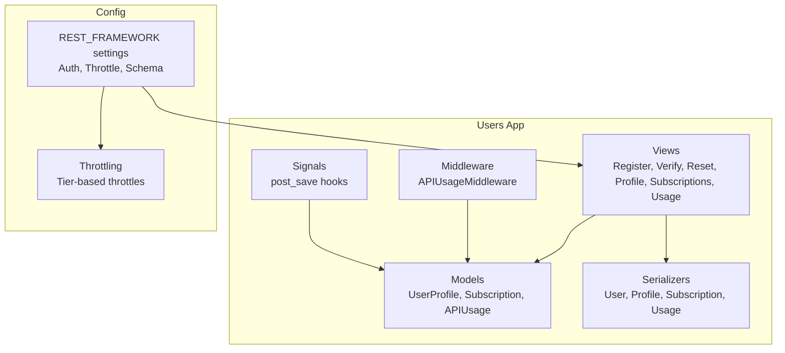
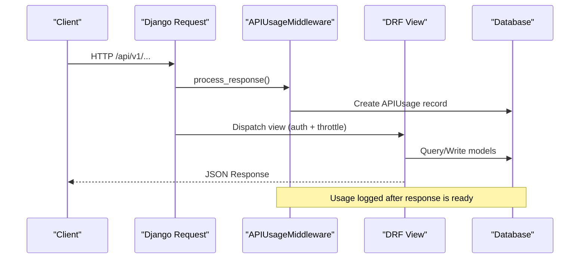
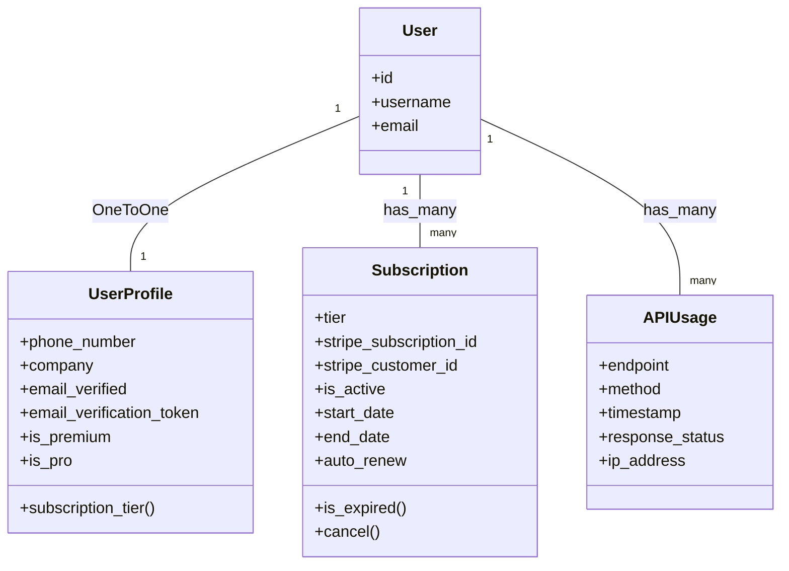
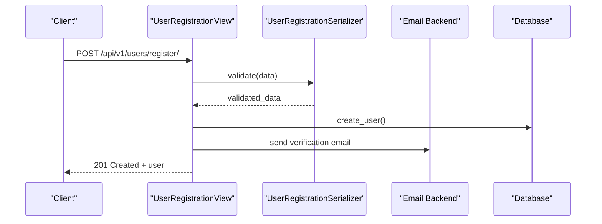
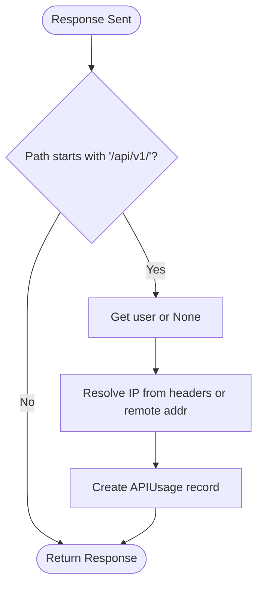
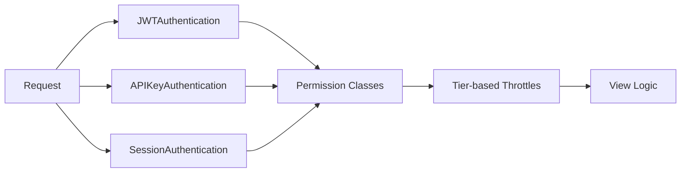
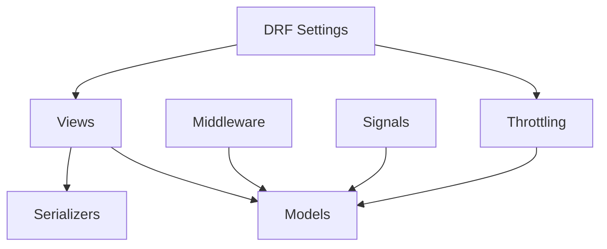

# Users Application

<cite>
**Referenced Files in This Document**
- [models.py](file://apps/users/models.py)
- [views.py](file://apps/users/views.py)
- [serializers.py](file://apps/users/serializers.py)
- [middleware.py](file://apps/users/middleware.py)
- [signals.py](file://apps/users/signals.py)
- [apps.py](file://apps/users/apps.py)
- [base.py](file://config/settings/base.py)
- [throttling.py](file://apps/core/throttling.py)
- [authentication.py](file://apps/developer/authentication.py)
</cite>

## Table of Contents
1. [Introduction](#introduction)
2. [Project Structure](#project-structure)
3. [Core Components](#core-components)
4. [Architecture Overview](#architecture-overview)
5. [Detailed Component Analysis](#detailed-component-analysis)
6. [Dependency Analysis](#dependency-analysis)
7. [Performance Considerations](#performance-considerations)
8. [Troubleshooting Guide](#troubleshooting-guide)
9. [Conclusion](#conclusion)

## Introduction
This document explains the Users application that provides authentication, authorization, and user management for the platform. It covers:
- Custom user model extensions with subscription tiers, usage metering, and API access controls
- Middleware for request logging and usage tracking
- Signal handlers for user lifecycle events
- Serializers for validation and transformation
- Views for registration, email verification, password reset, profile management, subscriptions, and usage analytics
- Integration with Django REST Framework (DRF) including JWT and API key authentication
- Cross-cutting concerns such as rate limiting and security headers

## Project Structure
The Users app is organized into standard Django components:
- Models define user profiles, subscriptions, and API usage tracking
- Serializers validate input and shape responses
- Views implement REST endpoints for user flows
- Middleware logs API usage across requests
- Signals automate profile creation on user creation
- App configuration wires signals into Django’s startup

**Diagram sources**
- [models.py:13-186](file://apps/users/models.py#L13-L186)
- [serializers.py:8-217](file://apps/users/serializers.py#L8-L217)
- [views.py:44-284](file://apps/users/views.py#L44-L284)
- [middleware.py:6-33](file://apps/users/middleware.py#L6-L33)
- [signals.py:7-22](file://apps/users/signals.py#L7-L22)
- [base.py:264-301](file://config/settings/base.py#L264-L301)
- [throttling.py:5-88](file://apps/core/throttling.py#L5-L88)

**Section sources**
- [apps.py:4-9](file://apps/users/apps.py#L4-L9)
- [base.py:64-99](file://config/settings/base.py#L64-L99)

## Core Components
- User profile extension: Adds phone number, company, email verification state, and computed subscription tier properties to the built-in User via a OneToOne relationship.
- Subscription model: Tracks tier, Stripe identifiers, active status, start/end dates, auto-renewal, and expiration logic.
- API usage model: Records endpoint, HTTP method, timestamp, response status, and IP address per request for analytics and limits.
- Serializers: Validate registration, password reset, and profile updates; expose derived fields like tier display and expiration flags.
- Views: Provide endpoints for registration, email verification, password reset, profile CRUD, subscription listing/current, and usage stats.
- Middleware: Logs every /api/v1/ request to APIUsage for both authenticated and anonymous users.
- Signals: Automatically create and persist UserProfile when User is created or saved.

**Section sources**
- [models.py:13-186](file://apps/users/models.py#L13-L186)
- [serializers.py:8-217](file://apps/users/serializers.py#L8-L217)
- [views.py:44-284](file://apps/users/views.py#L44-L284)
- [middleware.py:6-33](file://apps/users/middleware.py#L6-L33)
- [signals.py:7-22](file://apps/users/signals.py#L7-L22)

## Architecture Overview
The Users app integrates tightly with DRF and Django’s auth stack:
- Authentication: JWT Bearer tokens via SimpleJWT, optional API keys, and session authentication for admin/browsable API.
- Authorization: Per-view permission classes enforce IsAuthenticated where needed; default policy allows read-only for anonymous.
- Rate limiting: Tier-based throttles bound to subscription tier determine daily request quotas.
- Logging: Middleware records all API calls under /api/v1/ to support analytics and limit enforcement.

**Diagram sources**
- [middleware.py:6-33](file://apps/users/middleware.py#L6-L33)
- [base.py:264-301](file://config/settings/base.py#L264-L301)
- [views.py:44-284](file://apps/users/views.py#L44-L284)

## Detailed Component Analysis

### Data Models
- UserProfile: Extends User with contact info, verification token, and computed subscription tier helpers. Provides convenience properties for premium/pro checks.
- Subscription: Represents a user’s plan with Stripe linkage, active window, and cancellation support. Includes indexes for efficient queries by user and stripe id.
- APIUsage: Captures per-request metadata for analytics and quota calculations. Indexed by user+timestamp and endpoint+timestamp for fast aggregation.

**Diagram sources**
- [models.py:13-186](file://apps/users/models.py#L13-L186)

**Section sources**
- [models.py:13-186](file://apps/users/models.py#L13-L186)

### Serializers
- UserRegistrationSerializer: Validates password strength and confirmation, ensures unique email, creates User and initializes profile with a verification token.
- EmailVerificationSerializer: Validates token and marks profile verified.
- PasswordResetRequestSerializer and PasswordResetConfirmSerializer: Handle secure reset flows without revealing user existence.
- UserProfileSerializer: Exposes profile fields plus computed subscription tier flags.
- SubscriptionSerializer and APIUsageSerializer: Read-only exposure of subscription state and usage history.

Key behaviors:
- Write-only password fields with validators
- Context passing for token lookups
- Read-only fields for timestamps and system-managed values

**Section sources**
- [serializers.py:8-217](file://apps/users/serializers.py#L8-L217)

### Views and Endpoints
- Registration: POST /api/v1/users/register/ creates user, sends verification email, returns user data.
- Email Verification: POST /api/v1/users/verify-email/ validates token and verifies email.
- Password Reset Request: POST /api/v1/users/password-reset/ generates reset token and emails link; safe response to prevent enumeration.
- Password Reset Confirm: POST /api/v1/users/password-reset-confirm/ sets new password and clears token.
- Profile Management: GET/PUT/PATCH /api/v1/users/profile/me/ for current user profile.
- Subscriptions: GET /api/v1/users/subscriptions/ lists user subscriptions; GET /api/v1/users/subscriptions/current/ returns active or free tier fallback.
- Usage Analytics: GET /api/v1/users/usage/ lists usage; GET /api/v1/users/usage/stats/ computes daily/monthly usage, top endpoints, and remaining quota based on tier.

Authentication and throttling:
- Auth endpoints use dedicated throttling for login/refresh/verify to protect against abuse.
- Protected views require authentication; public endpoints are explicitly marked.

**Diagram sources**
- [views.py:44-71](file://apps/users/views.py#L44-L71)
- [serializers.py:45-110](file://apps/users/serializers.py#L45-L110)

**Section sources**
- [views.py:32-284](file://apps/users/views.py#L32-L284)

### Middleware: API Usage Tracking
- APIUsageMiddleware runs on every response for paths starting with /api/v1/.
- Extracts user (or None), resolves real IP from X-Forwarded-For or REMOTE_ADDR, and persists an APIUsage record with endpoint, method, status code, and IP.
- Does not alter request processing; only observes responses.

**Diagram sources**
- [middleware.py:6-33](file://apps/users/middleware.py#L6-L33)

**Section sources**
- [middleware.py:6-33](file://apps/users/middleware.py#L6-L33)

### Signals: User Lifecycle Events
- post_save(User): Creates UserProfile automatically when a new User is created.
- post_save(User): Persists related UserProfile when User is saved, ensuring consistency.

These signals ensure that every User has a profile and keeps it synchronized with user changes.

**Section sources**
- [signals.py:7-22](file://apps/users/signals.py#L7-L22)
- [apps.py:4-9](file://apps/users/apps.py#L4-L9)

### DRF Integration: Authentication and Throttling
- Authentication classes:
  - JWT Bearer via SimpleJWT
  - API Key via custom authenticator
  - Session authentication for admin/browsable API
- Default permissions: IsAuthenticatedOrReadOnly
- Throttling:
  - Anonymous: anon scope
  - Auth endpoints: auth scope (dedicated throttle)
  - Tier-based: free, pro, premium scopes using subscription tier
- Token lifetimes and rotation configured via SIMPLE_JWT settings

**Diagram sources**
- [base.py:264-301](file://config/settings/base.py#L264-L301)
- [authentication.py:10-52](file://apps/developer/authentication.py#L10-L52)
- [throttling.py:5-88](file://apps/core/throttling.py#L5-L88)

**Section sources**
- [base.py:264-301](file://config/settings/base.py#L264-L301)
- [authentication.py:10-52](file://apps/developer/authentication.py#L10-L52)
- [throttling.py:5-88](file://apps/core/throttling.py#L5-L88)

## Dependency Analysis
- Views depend on serializers for validation and on models for persistence.
- Middleware depends on APIUsage model to log requests.
- Signals depend on UserProfile model and are wired via AppConfig.ready().
- DRF settings centralize authentication, throttling, and schema generation used across all views.
- Throttling depends on subscription tier resolution from UserProfile.

**Diagram sources**
- [views.py:44-284](file://apps/users/views.py#L44-L284)
- [serializers.py:8-217](file://apps/users/serializers.py#L8-L217)
- [models.py:13-186](file://apps/users/models.py#L13-L186)
- [middleware.py:6-33](file://apps/users/middleware.py#L6-L33)
- [signals.py:7-22](file://apps/users/signals.py#L7-L22)
- [base.py:264-301](file://config/settings/base.py#L264-L301)
- [throttling.py:5-88](file://apps/core/throttling.py#L5-L88)

**Section sources**
- [base.py:264-301](file://config/settings/base.py#L264-L301)
- [throttling.py:5-88](file://apps/core/throttling.py#L5-L88)

## Performance Considerations
- Indexes on APIUsage and Subscription improve query performance for usage stats and active subscription lookups.
- Tier-based throttling uses cache keys scoped by user ID and tier to minimize overhead.
- Middleware writes only after response completion to avoid blocking request handling.
- Aggregation queries for usage stats are bounded by date ranges and limited result sets.

[No sources needed since this section provides general guidance]

## Troubleshooting Guide
Common issues and resolutions:
- Email verification not working: Ensure FRONTEND_URL is set correctly so generated links resolve; verify email backend configuration and that tokens are stored in UserProfile.
- Password reset not received: Check DEFAULT_FROM_EMAIL and EMAIL_* settings; confirm that reset token is generated and cleared after use.
- Rate limiting errors: Review tier assignment and throttle rates; ensure subscription tier is correctly resolved from UserProfile.
- Usage stats missing: Confirm middleware is enabled and path matches /api/v1/; check database connectivity and write permissions.

**Section sources**
- [views.py:44-157](file://apps/users/views.py#L44-L157)
- [middleware.py:6-33](file://apps/users/middleware.py#L6-L33)
- [base.py:341-347](file://config/settings/base.py#L341-L347)

## Conclusion
The Users application provides a robust foundation for authentication, authorization, and user management. It extends Django’s User with subscription tiers and usage tracking, enforces cross-cutting concerns through middleware and DRF settings, and exposes clear APIs for account lifecycle and analytics. The design separates concerns cleanly between models, serializers, views, and middleware, enabling maintainability and scalability.

[No sources needed since this section summarizes without analyzing specific files]