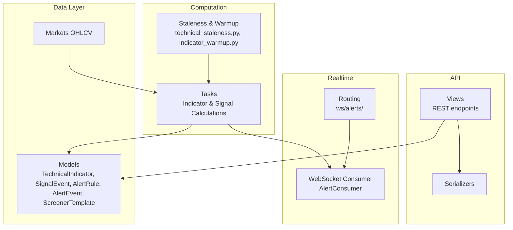
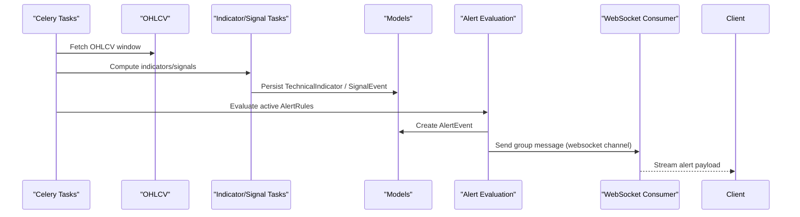
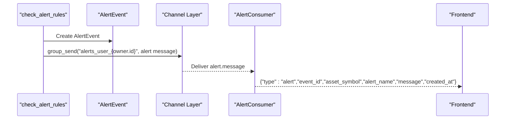
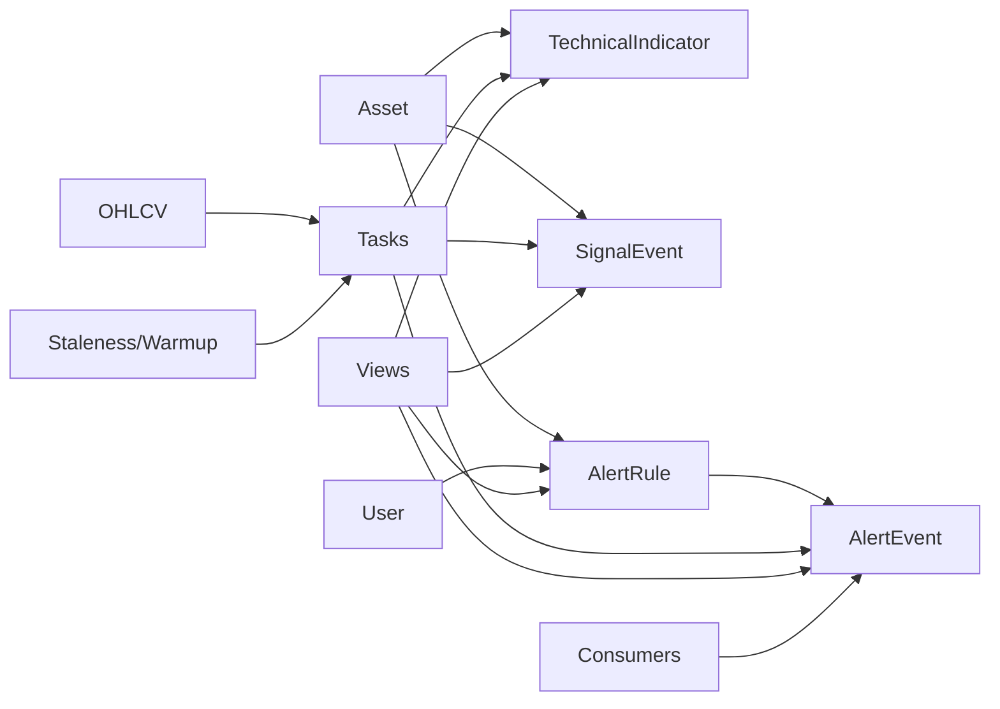

# Analytics & Technical Analysis Models

<cite>
**Referenced Files in This Document**
- [models.py](file://apps/analytics/models.py)
- [technical_staleness.py](file://apps/analytics/technical_staleness.py)
- [indicator_warmup.py](file://apps/analytics/indicator_warmup.py)
- [tasks.py](file://apps/analytics/tasks.py)
- [views.py](file://apps/analytics/views.py)
- [serializers.py](file://apps/analytics/serializers.py)
- [consumers.py](file://apps/analytics/consumers.py)
- [routing.py](file://apps/analytics/routing.py)
</cite>

## Table of Contents
1. [Introduction](#introduction)
2. [Project Structure](#project-structure)
3. [Core Components](#core-components)
4. [Architecture Overview](#architecture-overview)
5. [Detailed Component Analysis](#detailed-component-analysis)
6. [Dependency Analysis](#dependency-analysis)
7. [Performance Considerations](#performance-considerations)
8. [Troubleshooting Guide](#troubleshooting-guide)
9. [Conclusion](#conclusion)

## Introduction
This document describes the data models and workflows that power analytics and technical analysis across the platform. It focuses on:
- How technical indicators are stored with staleness policies tied to trading calendars
- How signal events capture trading signals with precise timestamps
- How alert rules evaluate conditions against market data and dispatch notifications via email, SMS, and WebSocket streaming
- The relationships between indicators, OHLCV data, signal generation, and real-time alerts
- Screener functionality for filtering assets by technical criteria

The goal is to provide a clear, code-mapped understanding of how these components interact end-to-end.

## Project Structure
The analytics subsystem centers around:
- Data models for indicators, signals, alerts, and screeners
- Staleness and warm-up logic ensuring reliable indicator freshness
- Background tasks computing indicators and signals from OHLCV
- API views exposing indicators, screeners, and dashboards
- WebSocket consumer delivering real-time alert notifications

**Diagram sources**
- [models.py:8-255](file://apps/analytics/models.py#L8-L255)
- [tasks.py:28-66](file://apps/analytics/tasks.py#L28-L66)
- [technical_staleness.py:64-190](file://apps/analytics/technical_staleness.py#L64-L190)
- [indicator_warmup.py:4-86](file://apps/analytics/indicator_warmup.py#L4-L86)
- [views.py:424-735](file://apps/analytics/views.py#L424-L735)
- [consumers.py:18-59](file://apps/analytics/consumers.py#L18-L59)
- [routing.py:6-8](file://apps/analytics/routing.py#L6-L8)

**Section sources**
- [models.py:8-255](file://apps/analytics/models.py#L8-L255)
- [tasks.py:28-66](file://apps/analytics/tasks.py#L28-L66)
- [technical_staleness.py:64-190](file://apps/analytics/technical_staleness.py#L64-L190)
- [indicator_warmup.py:4-86](file://apps/analytics/indicator_warmup.py#L4-L86)
- [views.py:424-735](file://apps/analytics/views.py#L424-L735)
- [consumers.py:18-59](file://apps/analytics/consumers.py#L18-L59)
- [routing.py:6-8](file://apps/analytics/routing.py#L6-L8)

## Core Components
- TechnicalIndicator: Stores per-asset, per-timestamp indicator values and parameters; indexed for efficient queries; unique constraints prevent duplicates.
- SignalEvent: Captures discrete trading signals (e.g., golden cross, Bollinger breakout, volume spike) with timestamp and metadata; unique per asset/timestamp/signal_type.
- AlertRule: User-defined rules evaluating price or indicator thresholds with cooldown and notification channels.
- AlertEvent: Records each triggered alert event, including status, trigger value, message, and dispatched channels.
- ScreenerTemplate: Saved screener configurations owned by users or public.

Key relationships:
- TechnicalIndicator links to Asset and stores time-series values used by screens and dashboards.
- SignalEvent links to Asset and represents derived signals computed from OHLCV and/or indicators.
- AlertRule links to Asset and Owner; AlertEvent links back to AlertRule and Asset.

**Section sources**
- [models.py:8-46](file://apps/analytics/models.py#L8-L46)
- [models.py:198-255](file://apps/analytics/models.py#L198-L255)
- [models.py:87-146](file://apps/analytics/models.py#L87-L146)
- [models.py:148-196](file://apps/analytics/models.py#L148-L196)
- [models.py:48-85](file://apps/analytics/models.py#L48-L85)

## Architecture Overview
The system computes indicators from OHLCV using TA-Lib, enforces staleness checks against trading calendars, persists results, generates signals, and evaluates alert rules. Real-time notifications are streamed via WebSocket groups keyed by user.

**Diagram sources**
- [tasks.py:28-66](file://apps/analytics/tasks.py#L28-L66)
- [tasks.py:67-615](file://apps/analytics/tasks.py#L67-L615)
- [tasks.py:740-1159](file://apps/analytics/tasks.py#L740-L1159)
- [tasks.py:1186-1317](file://apps/analytics/tasks.py#L1186-L1317)
- [consumers.py:18-59](file://apps/analytics/consumers.py#L18-L59)

## Detailed Component Analysis

### TechnicalIndicator Model
- Purpose: Time-series storage of computed technical indicators per asset.
- Fields:
  - asset: FK to Asset
  - timestamp: DateTime, indexed
  - indicator_type: String, indexed
  - value: Decimal(24,8)
  - parameters: JSON (e.g., timeperiod, bands deviations)
- Constraints:
  - Unique together on (asset, timestamp, indicator_type, parameters)
  - Composite index on (asset, timestamp, indicator_type)
- Usage:
  - Queried by dashboards and screeners
  - Updated by background tasks after staleness checks

Validation and performance:
- High precision decimals support accurate financial calculations
- Indexes optimize frequent queries by asset and date ranges
- Parameters allow multiple variants (e.g., SMA-5 vs SMA-20) without schema changes

**Section sources**
- [models.py:8-46](file://apps/analytics/models.py#L8-L46)
- [views.py:424-475](file://apps/analytics/views.py#L424-L475)

### SignalEvent Model
- Purpose: Immutable record of actionable signals generated from indicator combinations or raw OHLCV patterns.
- Fields:
  - asset: FK to Asset
  - signal_type: Enumerated choices (golden/death crosses, BB breakouts, volume spikes, momentum, reversal combos)
  - timestamp: DateTime, indexed
  - description: Human-readable context
  - metadata: JSON (values used to generate the signal)
- Constraints:
  - Unique together on (asset, timestamp, signal_type)
  - Indexes on (asset, timestamp, signal_type) and (signal_type, timestamp)
- Generation:
  - Computed by dedicated tasks that check staleness and exact trading windows before persisting

Validation and performance:
- Enumerated types constrain signal taxonomy
- Bulk create paths used for high-throughput ranking signals
- Timestamp-based ordering supports real-time feeds

**Section sources**
- [models.py:198-255](file://apps/analytics/models.py#L198-L255)
- [tasks.py:622-737](file://apps/analytics/tasks.py#L622-L737)
- [tasks.py:740-1159](file://apps/analytics/tasks.py#L740-L1159)

### AlertRule and AlertEvent Models
- AlertRule:
  - owner: FK to User
  - asset: FK to Asset
  - condition_type: Price above/below or Indicator above/below
  - indicator_type: Required for indicator-based conditions
  - threshold: Decimal threshold
  - custom_condition: JSON for advanced logic
  - channels: Allowed channels include email, sms, websocket
  - cooldown_minutes: Prevents rapid re-triggering
  - is_active: Toggle
  - last_triggered_at: For cooldown enforcement
- AlertEvent:
  - alert_rule: FK to AlertRule
  - asset: FK to Asset
  - status: Triggered/Sent/Failed
  - trigger_value: Snapshot of value at trigger
  - message: Human-readable alert text
  - metadata: Condition details
  - dispatched_channels: Which channels were used
  - notified_at: When delivery completed

Evaluation workflow:
- Periodic task scans active rules
- Compares latest price or latest indicator value against threshold
- Creates AlertEvent if triggered and cooldown passed
- Dispatches notifications via configured channels

**Section sources**
- [models.py:87-196](file://apps/analytics/models.py#L87-L196)
- [tasks.py:1186-1317](file://apps/analytics/tasks.py#L1186-L1317)
- [serializers.py:90-122](file://apps/analytics/serializers.py#L90-L122)

### ScreenerTemplate and Screener Functionality
- ScreenerTemplate:
  - owner: Optional user ownership
  - name, description
  - screener_type: Prebuilt or Custom
  - config: JSON configuration defining filters and scoring
  - is_public: Shareable templates
- Screener API:
  - Prebuilt screeners: overbought_oversold, breakout_candidates, high_volume, trend_reversal
  - Run endpoint executes filters against TechnicalIndicator and other data sources
  - Supports parameterized thresholds (e.g., RSI thresholds)

Integration points:
- Uses TechnicalIndicator values for RSI-based screens
- Can be extended to incorporate signals and predictions

**Section sources**
- [models.py:48-85](file://apps/analytics/models.py#L48-L85)
- [views.py:738-800](file://apps/analytics/views.py#L738-L800)

### Staleness Policies and Indicator Warmup
- Staleness:
  - Each indicator type has a maximum allowed gap in trading days since the current trade date
  - Moving averages use period-based buckets to determine acceptable gaps
  - Functions compute whether trailing windows are fresh and whether exact trading windows are available
- Warmup:
  - Defines minimum lookback periods required for stable indicator computation
  - Ensures prefill history covers enough calendar days to avoid cold-start issues

Practical effect:
- Tasks skip stale computations to avoid unreliable signals
- Guarantees that signals and alerts are only produced when sufficient recent data exists

**Section sources**
- [technical_staleness.py:9-190](file://apps/analytics/technical_staleness.py#L9-L190)
- [indicator_warmup.py:4-86](file://apps/analytics/indicator_warmup.py#L4-L86)
- [tasks.py:67-615](file://apps/analytics/tasks.py#L67-L615)

### Indicator Calculation Tasks
- RSI, MACD, Bollinger Bands, SMA, EMA, Stochastic, ADX, OBV, Fibonacci Retracement
- Each task:
  - Loads OHLCV window
  - Validates staleness and required points
  - Computes indicator(s) using TA-Lib
  - Persists TechnicalIndicator with parameters
- Signal tasks:
  - MA signals (golden/death cross, alignment)
  - Bollinger Band signals (squeeze, breakouts, combined RSI)
  - Volume signals (spikes, divergence)
  - Momentum signals (5/10/20-day momentum, flags)
  - Reversal signals (oversold combination)
  - Cross-asset RS scores and top-20% flagging

Performance considerations:
- Batch creation for large sets (RS scores)
- Use of indexes and selective fields
- Avoid recomputation when data is stale

**Section sources**
- [tasks.py:67-615](file://apps/analytics/tasks.py#L67-L615)
- [tasks.py:740-1159](file://apps/analytics/tasks.py#L740-L1159)

### Alert Notification Mechanism and WebSocket Streaming
- Channels:
  - Email: send_mail with owner’s email
  - SMS: POST to configured webhook URL
  - WebSocket: Group message sent to user-specific channel
- WebSocket flow:
  - Client connects to ws/alerts/ with token or session
  - Consumer authenticates user and joins group alerts_user_{id}
  - On alert, server sends structured JSON payload to client

**Diagram sources**
- [tasks.py:1283-1317](file://apps/analytics/tasks.py#L1283-L1317)
- [consumers.py:18-59](file://apps/analytics/consumers.py#L18-L59)
- [routing.py:6-8](file://apps/analytics/routing.py#L6-L8)

**Section sources**
- [tasks.py:1212-1317](file://apps/analytics/tasks.py#L1212-L1317)
- [consumers.py:18-59](file://apps/analytics/consumers.py#L18-L59)
- [routing.py:6-8](file://apps/analytics/routing.py#L6-L8)

## Dependency Analysis
- Models depend on Asset and User
- Tasks depend on OHLCV, ExchangeTradingCalendar, and TA-Lib
- Views depend on serializers and tasks for recalculation actions
- Consumers depend on Django Channels and JWT tokens for authentication
- Staleness depends on trading calendar and warmup lookbacks

**Diagram sources**
- [models.py:8-255](file://apps/analytics/models.py#L8-L255)
- [tasks.py:28-66](file://apps/analytics/tasks.py#L28-L66)
- [technical_staleness.py:64-190](file://apps/analytics/technical_staleness.py#L64-L190)
- [consumers.py:18-59](file://apps/analytics/consumers.py#L18-L59)

**Section sources**
- [models.py:8-255](file://apps/analytics/models.py#L8-L255)
- [tasks.py:28-66](file://apps/analytics/tasks.py#L28-L66)
- [technical_staleness.py:64-190](file://apps/analytics/technical_staleness.py#L64-L190)
- [consumers.py:18-59](file://apps/analytics/consumers.py#L18-L59)

## Performance Considerations
- Staleness checks prevent unnecessary recomputation and ensure reliability
- Exact trading window validation avoids false signals during holidays or gaps
- Bulk operations used for cross-asset rankings to minimize database writes
- Indexes on frequently filtered fields (asset, timestamp, indicator_type, signal_type)
- Caching in views for dashboard and indicator list endpoints reduces load
- Parameterized warmup lookbacks ensure correct initialization for different indicator variants

[No sources needed since this section provides general guidance]

## Troubleshooting Guide
Common issues and resolutions:
- Missing or stale indicators:
  - Verify trading calendar coverage and staleness thresholds
  - Ensure OHLCV history is complete up to the current trade date
- No signals generated:
  - Check that required indicator windows are fresh and exact trading windows are satisfied
  - Confirm that tasks are scheduled and workers are running
- Alerts not delivered:
  - Validate channels configuration and cooldown settings
  - Check email/SMS/webhook availability and permissions
  - Confirm WebSocket group routing and client connection with valid token

Operational checks:
- Inspect AlertEvent status and dispatched_channels to diagnose delivery failures
- Review logs for skipped calculations due to insufficient data or staleness
- Use API endpoints to verify latest indicator values and signal presence

**Section sources**
- [technical_staleness.py:64-190](file://apps/analytics/technical_staleness.py#L64-L190)
- [tasks.py:1186-1317](file://apps/analytics/tasks.py#L1186-L1317)
- [consumers.py:18-59](file://apps/analytics/consumers.py#L18-L59)

## Conclusion
The analytics subsystem integrates robust data models with disciplined computation and delivery pipelines:
- TechnicalIndicator captures precise, parameterized indicator values with staleness safeguards
- SignalEvent records actionable signals derived from multi-indicator logic and OHLCV patterns
- AlertRule and AlertEvent enable configurable, user-targeted notifications with cooldowns and multi-channel delivery
- ScreenerTemplate and Screener APIs provide flexible asset filtering based on technical criteria
- WebSocket streaming ensures real-time alert delivery to authenticated clients

Together, these components form a scalable foundation for high-frequency indicator calculations, reliable signal generation, and timely alerting across markets.