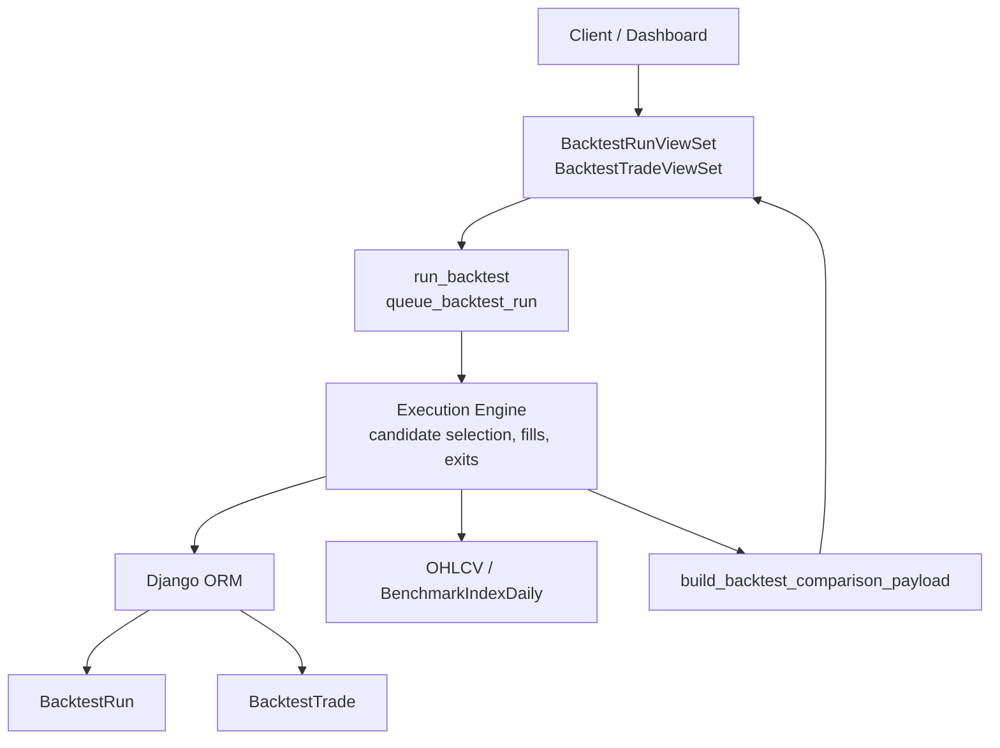
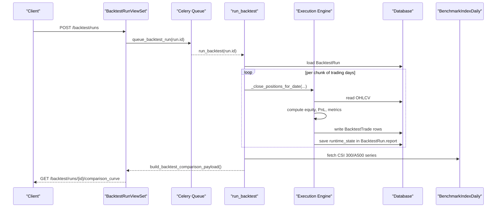
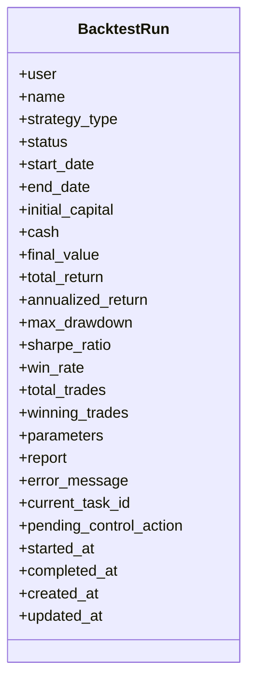
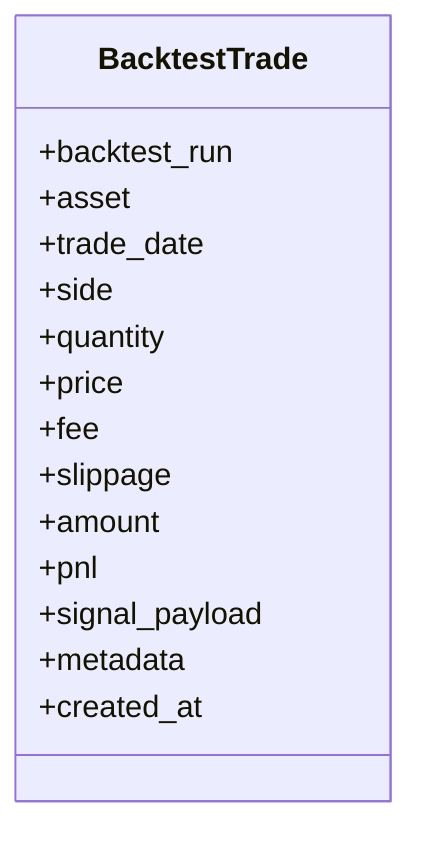
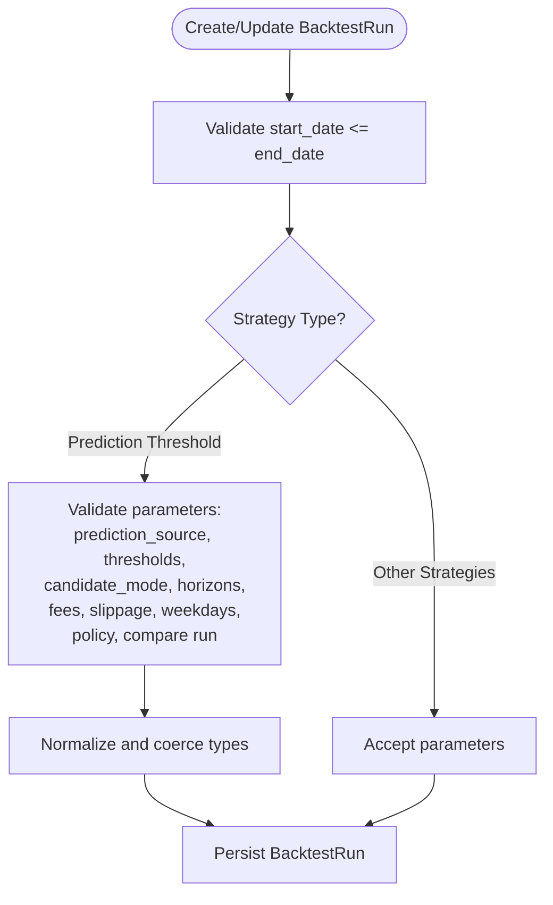
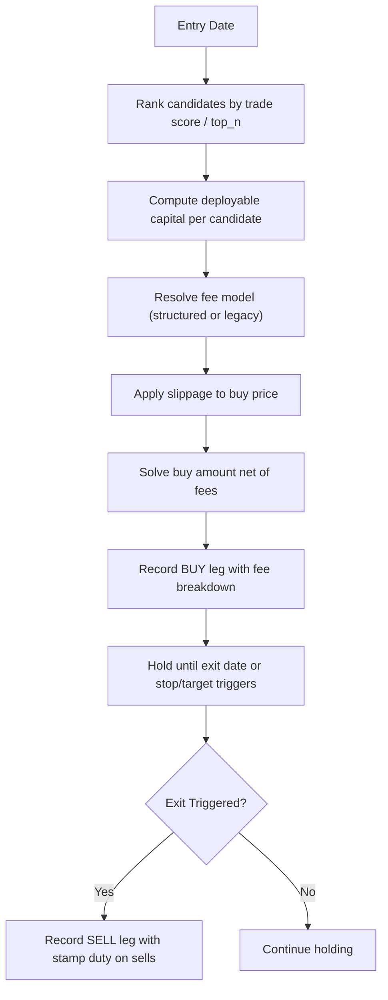
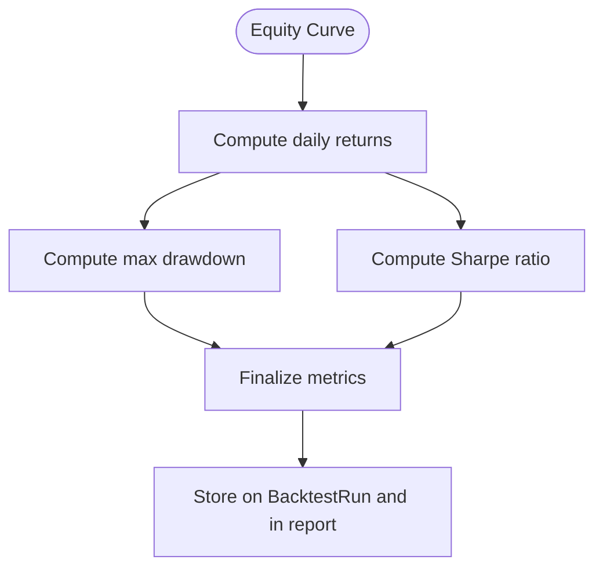
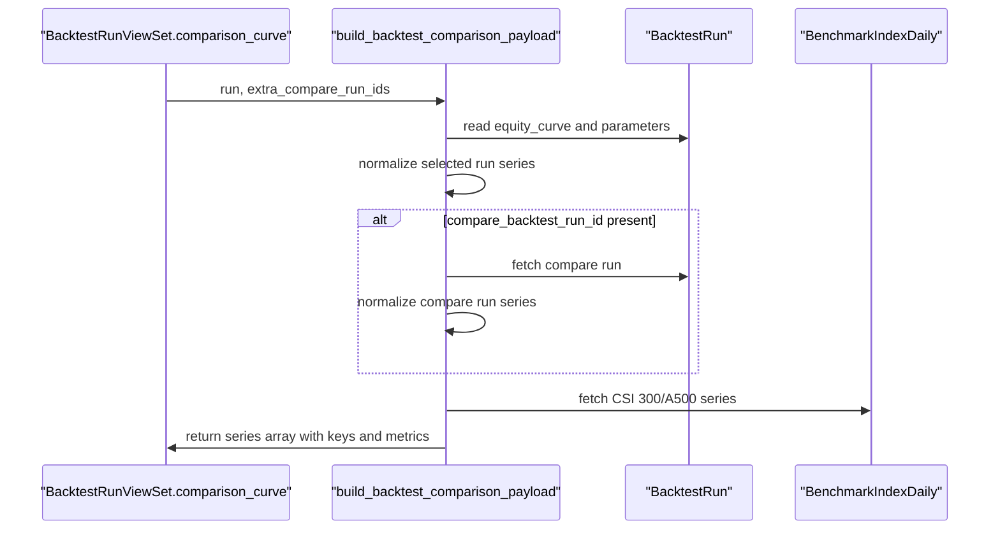
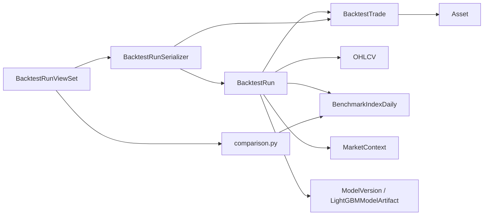

# Backtesting & Strategy Models

<cite>
**Referenced Files in This Document**
- [models.py](file://apps/backtest/models.py)
- [tasks.py](file://apps/backtest/tasks.py)
- [serializers.py](file://apps/backtest/serializers.py)
- [comparison.py](file://apps/backtest/comparison.py)
- [views.py](file://apps/backtest/views.py)
- [models.py](file://apps/markets/models.py)
</cite>

## Table of Contents
1. Introduction
2. Project Structure
3. Core Components
4. Architecture Overview
5. Detailed Component Analysis
6. Dependency Analysis
7. Performance Considerations
8. Troubleshooting Guide
9. Conclusion
10. Appendices

## Introduction
This document provides comprehensive data model documentation for backtesting and strategy simulation entities. It focuses on the following core models and concepts:
- BacktestRun: represents a complete backtest execution, including parameters, lifecycle state, and final performance metrics.
- BacktestTrade (PositionHistory): records each executed leg (buy/sell) with timing precision, fees, slippage, and signal provenance.
- StrategyConfiguration: defined via BacktestRun.parameters; validated by serializers to ensure consistent strategy behavior across runs.
- Performance Metrics: total return, annualized return, maximum drawdown, Sharpe ratio, win rate, and trade counts stored on BacktestRun.
- Comparison Framework: side-by-side evaluation of multiple runs against each other and official benchmarks (CSI 300, CSI A500).

The system captures realistic cost modeling (commission, exchange/regulatory/transfer fees, stamp duty on sells only), slippage, and position lifecycle management. Results integrate into analytics through exported reports and comparison payloads that feed dashboards and opportunity identification workflows.

## Project Structure
Backtesting is implemented as a dedicated Django app with:
- Data models for runs and trades
- An asynchronous execution engine (Celery tasks) that generates candidates, executes trades, and computes metrics
- Serializers that validate strategy parameters and expose task health
- A comparison module that builds normalized equity curves vs benchmarks
- API views that orchestrate run creation, lifecycle control, and retrieval of comparison curves and trade ledgers

**Diagram sources**
- [views.py:75-208](file://apps/backtest/views.py#L75-L208)
- [tasks.py:2299-2578](file://apps/backtest/tasks.py#L2299-L2578)
- [comparison.py:177-245](file://apps/backtest/comparison.py#L177-L245)
- [models.py:24-168](file://apps/backtest/models.py#L24-L168)
- [models.py:201-226](file://apps/markets/models.py#L201-L226)
- [models.py:147-171](file://apps/markets/models.py#L147-L171)

**Section sources**
- [views.py:1-221](file://apps/backtest/views.py#L1-L221)
- [tasks.py:1-800](file://apps/backtest/tasks.py#L1-L800)
- [models.py:24-168](file://apps/backtest/models.py#L24-L168)
- [models.py:201-226](file://apps/markets/models.py#L201-L226)
- [models.py:147-171](file://apps/markets/models.py#L147-L171)

## Core Components
- BacktestRun
  - Lifecycle: PENDING → RUNNING → COMPLETED or FAILED (with PAUSED reachable from RUNNING)
  - Time-bounded chunked execution with resume via runtime_state persisted in report JSON
  - Stores initial capital, cash, final value, and computed metrics: total_return, annualized_return, max_drawdown, sharpe_ratio, win_rate, total_trades, winning_trades
  - Parameters JSON holds strategy configuration (prediction source, candidate mode, thresholds, fee overrides, macro context, etc.)
  - Report JSON stores equity curve, benchmark metadata, and runtime bookkeeping

- BacktestTrade (PositionHistory)
  - Leg-level records (BUY/SELL) with asset, date, side, quantity, price, fee, slippage, amount, pnl
  - signal_payload carries candidate rank, metric, threshold pass/fail, selection state, trade-decision levels, and model provenance
  - metadata includes fee model and breakdown used at execution time

- StrategyConfiguration (parameters)
  - Validated at create/update via serializers to enforce allowed values and types
  - Supports prediction_source (heuristic, lightgbm, lstm), candidate_mode (top_n, trade_score), horizon_days, up_threshold, entry_weekdays, holding_period_days, capital_fraction_per_entry, structured fees, slippage_bps, macro context toggles, stop/target exit policy, and LightGBM inference backend/batch size

- Performance Metrics
  - Computed from equity curve and closed PnLs: total_return, annualized_return, max_drawdown, sharpe_ratio, win_rate, trade counts
  - Stored on BacktestRun and included in final report

**Section sources**
- [models.py:24-118](file://apps/backtest/models.py#L24-L118)
- [models.py:120-168](file://apps/backtest/models.py#L120-L168)
- [serializers.py:48-300](file://apps/backtest/serializers.py#L48-L300)
- [tasks.py:2499-2578](file://apps/backtest/tasks.py#L2499-L2578)

## Architecture Overview
The backtesting pipeline is event-driven and chunked:
- Clients create runs via REST API; runs are enqueued asynchronously
- Celery worker executes chunks of trading days, persisting progress and resuming after interruptions
- Each day: close positions first (respecting stop/target rules), then open new positions based on ranked candidates
- Equity curve is built daily; metrics are computed at completion
- Comparison payload normalizes strategy equity curve against benchmarks and optional compare runs

**Diagram sources**
- [views.py:34-41](file://apps/backtest/views.py#L34-L41)
- [views.py:75-208](file://apps/backtest/views.py#L75-L208)
- [tasks.py:2299-2578](file://apps/backtest/tasks.py#L2299-L2578)
- [comparison.py:177-245](file://apps/backtest/comparison.py#L177-L245)
- [models.py:201-226](file://apps/markets/models.py#L201-L226)
- [models.py:147-171](file://apps/markets/models.py#L147-L171)

## Detailed Component Analysis

### BacktestRun Model
- Purpose: one backtest execution with parameters, results, and chunked execution state
- Key fields:
  - user, name, strategy_type, status, pending_control_action
  - start_date, end_date, initial_capital, cash, final_value
  - total_return, annualized_return, max_drawdown, sharpe_ratio, win_rate
  - total_trades, winning_trades
  - parameters (JSON), report (JSON), error_message
  - current_task_id, timestamps
- Indexes optimize queries by strategy/status/time ranges

**Diagram sources**
- [models.py:24-118](file://apps/backtest/models.py#L24-L118)

**Section sources**
- [models.py:24-118](file://apps/backtest/models.py#L24-L118)

### BacktestTrade (PositionHistory) Model
- Purpose: ledger of executed legs (BUY/SELL) with precise timing and costs
- Key fields:
  - backtest_run (FK), asset (FK), trade_date, side, quantity, price
  - fee, slippage, amount, pnl
  - signal_payload (JSON) capturing why an entry happened
  - metadata (JSON) including fee model and breakdown
- Indexes optimize lookups by run/date and asset/date

**Diagram sources**
- [models.py:120-168](file://apps/backtest/models.py#L120-L168)

**Section sources**
- [models.py:120-168](file://apps/backtest/models.py#L120-L168)

### StrategyConfiguration (Parameters) Validation
- Enforced via serializer validation to ensure consistent strategy behavior:
  - prediction_source must be heuristic/lightgbm/lstm
  - lightgbm_inference_backend and batch size constraints when using lightgbm
  - required keys for prediction threshold strategies: top_n, horizon_days, up_threshold
  - numeric validations for fee_rate or structured fee components; mutual exclusivity enforced
  - candidate_mode, top_n_metric alignment with horizon_days
  - boolean flags like use_macro_context and enable_stop_target_exit
  - trade_decision_policy structure and bounds
  - entry_weekdays normalization and validation
  - compare_backtest_run_id cross-checks (exists, completed, same strategy_type, same prediction_source)

**Diagram sources**
- [serializers.py:86-300](file://apps/backtest/serializers.py#L86-L300)

**Section sources**
- [serializers.py:86-300](file://apps/backtest/serializers.py#L86-L300)

### Execution Engine and Cost Modeling
- Fee model supports two modes:
  - Structured CN A-share defaults: commission with minimum, exchange/transaction handling, regulatory, transfer fees on both sides; stamp duty applies to sells only
  - Legacy flat fee: symmetric fee_rate applied to both sides
- Slippage modeled as basis points added to buy price; sell fills use available close prices
- Position sizing uses budget-aware allocation net of fees; minimum commission branch handled explicitly
- Exits prefer conservative outcomes: if both stop and target would trigger, stop wins; missing non-positive close leaves position open for retry

**Diagram sources**
- [tasks.py:338-479](file://apps/backtest/tasks.py#L338-L479)
- [tasks.py:2000-2113](file://apps/backtest/tasks.py#L2000-L2113)

**Section sources**
- [tasks.py:338-479](file://apps/backtest/tasks.py#L338-L479)
- [tasks.py:2000-2113](file://apps/backtest/tasks.py#L2000-L2113)

### Performance Metrics Calculation
- Equity curve: daily portfolio value = cash + sum(position quantities × latest close)
- Total return: (final_value - initial_capital) / initial_capital
- Annualized return: derived from total return over period length
- Maximum drawdown: peak-to-trough decline computed from equity curve
- Sharpe ratio: mean daily return divided by standard deviation, annualized using sqrt(252)
- Win rate: proportion of closed positions with positive PnL

**Diagram sources**
- [tasks.py:2116-2148](file://apps/backtest/tasks.py#L2116-L2148)
- [tasks.py:2499-2578](file://apps/backtest/tasks.py#L2499-L2578)

**Section sources**
- [tasks.py:2116-2148](file://apps/backtest/tasks.py#L2116-L2148)
- [tasks.py:2499-2578](file://apps/backtest/tasks.py#L2499-L2578)

### Comparison Framework
- Builds normalized series for:
  - Selected run’s equity curve
  - Optional compare run(s)
  - Benchmarks: CSI 300 and CSI A500
- Normalization scales series onto the selected run’s baseline value for point-by-point comparison
- Includes per-series total_return and max_drawdown, plus drawdown series for visualization

**Diagram sources**
- [views.py:198-208](file://apps/backtest/views.py#L198-L208)
- [comparison.py:177-245](file://apps/backtest/comparison.py#L177-L245)
- [models.py:147-171](file://apps/markets/models.py#L147-L171)

**Section sources**
- [comparison.py:177-245](file://apps/backtest/comparison.py#L177-L245)
- [views.py:198-208](file://apps/backtest/views.py#L198-L208)

## Dependency Analysis
- BacktestRun depends on:
  - Asset (via trades)
  - OHLCV (for trading dates and prices)
  - BenchmarkIndexDaily (for comparisons)
  - MarketContext (optional macro context adjustments)
  - Prediction artifacts and model versions (LightGBM/LSTM/heuristic)
- BacktestTrade depends on:
  - BacktestRun (FK)
  - Asset (FK)
- Serializers depend on:
  - BacktestRun and BacktestTrade models
  - Task health utilities for exposing live execution state
- Views depend on:
  - Serializers, models, comparison module, and tasks

**Diagram sources**
- [models.py:24-168](file://apps/backtest/models.py#L24-L168)
- [models.py:201-226](file://apps/markets/models.py#L201-L226)
- [models.py:147-171](file://apps/markets/models.py#L147-L171)
- [serializers.py:48-300](file://apps/backtest/serializers.py#L48-L300)
- [views.py:75-208](file://apps/backtest/views.py#L75-L208)
- [comparison.py:177-245](file://apps/backtest/comparison.py#L177-L245)

**Section sources**
- [models.py:24-168](file://apps/backtest/models.py#L24-L168)
- [models.py:201-226](file://apps/markets/models.py#L201-L226)
- [models.py:147-171](file://apps/markets/models.py#L147-L171)
- [serializers.py:48-300](file://apps/backtest/serializers.py#L48-L300)
- [views.py:75-208](file://apps/backtest/views.py#L75-L208)
- [comparison.py:177-245](file://apps/backtest/comparison.py#L177-L245)

## Performance Considerations
- Chunked execution:
  - Runs process BACKTEST_CHUNK_TRADING_DAYS per chunk, persisting runtime_state to survive timeouts and restarts
  - Reduces memory pressure and enables long-running backtests
- Caching:
  - Process-level caches for trading dates, price maps, and matrix signals improve throughput
  - Bounded cache sizes prevent unbounded memory growth between unrelated batches
- Inference optimization:
  - LightGBM supports cpu_serial, cpu_batched, and windows_gpu backends with configurable batch sizes
  - Matrix signal caching reduces repeated feature extraction and inference workloads
- Fee and slippage realism:
  - Asymmetric stamp duty on sells prevents underestimating turnover costs
  - Budget-aware sizing ensures allocations respect minimum commissions and variable fees

[No sources needed since this section provides general guidance]

## Troubleshooting Guide
- Run lifecycle issues:
  - If a run appears stuck, check current_task_id and pending_control_action; stale task ownership can be recovered via pause/resume/restart endpoints
  - Use task_health integration exposed via serializers to detect genuine execution vs disappeared workers
- Parameter validation errors:
  - Ensure prediction_source matches allowed values; LightGBM-specific keys only valid when prediction_source is lightgbm
  - Avoid mixing fee_rate with structured fee parameters; all numeric fee fields must be non-negative
  - Validate entry_weekdays format and supported values
- Missing data:
  - Not enough OHLCV data in selected date range will fail early
  - Compare runs must be completed and share the same strategy_type and prediction_source
- Export and comparison:
  - Comparison curves require completed runs with stored equity curves; otherwise messages indicate unavailability

**Section sources**
- [views.py:99-196](file://apps/backtest/views.py#L99-L196)
- [serializers.py:86-300](file://apps/backtest/serializers.py#L86-L300)
- [tasks.py:2275-2297](file://apps/backtest/tasks.py#L2275-L2297)
- [comparison.py:177-245](file://apps/backtest/comparison.py#L177-L245)

## Conclusion
The backtesting system provides robust, realistic simulation of strategy executions with detailed cost modeling, precise trade records, and comprehensive performance metrics. The comparison framework enables side-by-side evaluation against benchmarks and alternative runs, supporting informed decision-making and opportunity identification within the broader analytics pipeline.

[No sources needed since this section summarizes without analyzing specific files]

## Appendices

### Field Definitions Summary

- BacktestRun
  - Strategy parameters: prediction_source, candidate_mode, top_n, horizon_days, up_threshold, entry_weekdays, holding_period_days, capital_fraction_per_entry, use_macro_context, enable_stop_target_exit, trade_decision_policy, compare_backtest_run_id, lightgbm_inference_backend, lightgbm_batch_size
  - Risk metrics: total_return, annualized_return, max_drawdown, sharpe_ratio, win_rate, total_trades, winning_trades
  - Result analysis: report.equity_curve, report.strategy, report.prediction_source, report.candidate_mode, report.trade_score_scope, report.use_macro_context, report.horizon_days, report.entry_weekdays, report.holding_period_days, report.enable_stop_target_exit, report.fee_model, report.fee_parameters, report.macro_context_monthly, report.model_references

- BacktestTrade
  - Timing precision: trade_date, created_at
  - Execution details: side, quantity, price, fee, slippage, amount, pnl
  - Provenance: signal_payload (rank, metric, threshold pass/fail, selection state, trade-decision levels, model version/artifact), metadata (fee model and breakdown)

- Benchmarks
  - Official index series: CSI 300 (000300.SH), CSI A500 (000510.CSI)
  - Daily OHLC and close used for normalization and comparison

**Section sources**
- [models.py:24-168](file://apps/backtest/models.py#L24-L168)
- [serializers.py:86-300](file://apps/backtest/serializers.py#L86-L300)
- [tasks.py:2524-2553](file://apps/backtest/tasks.py#L2524-L2553)
- [comparison.py:22-25](file://apps/backtest/comparison.py#L22-L25)
- [models.py:147-171](file://apps/markets/models.py#L147-L171)