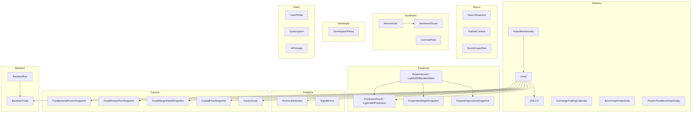
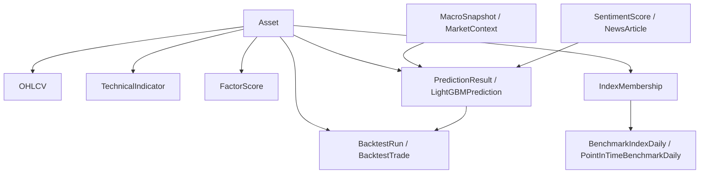
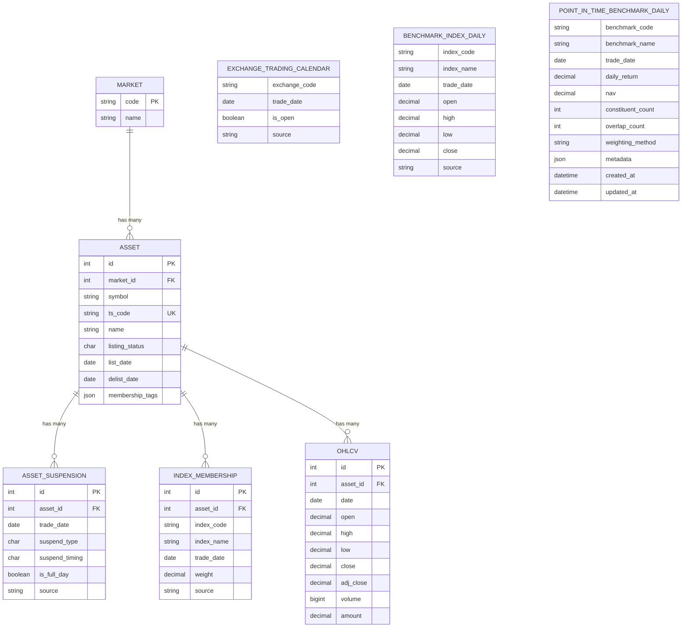
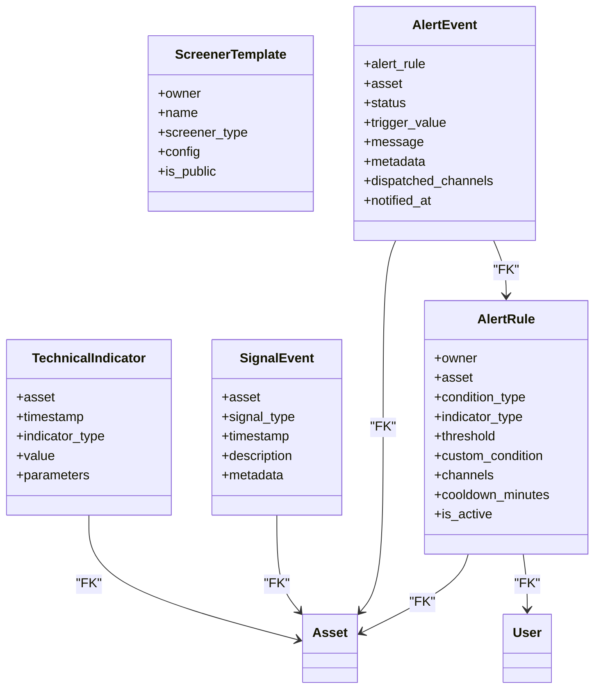
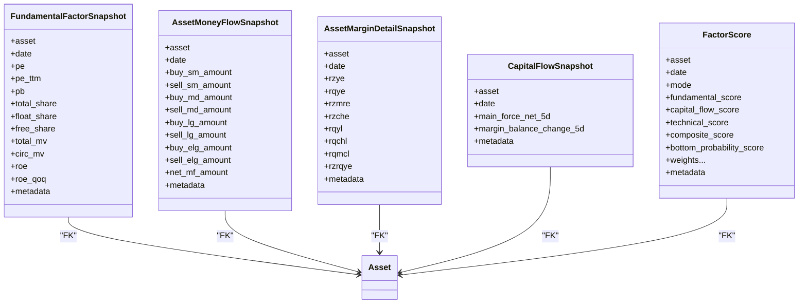
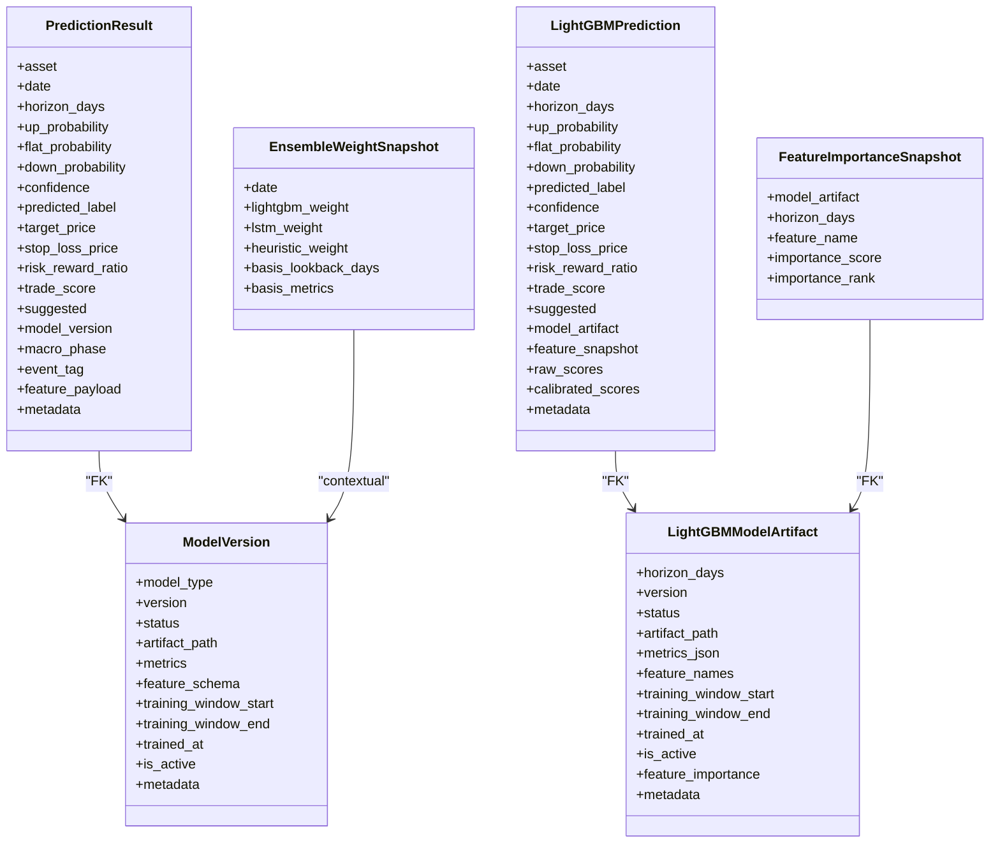
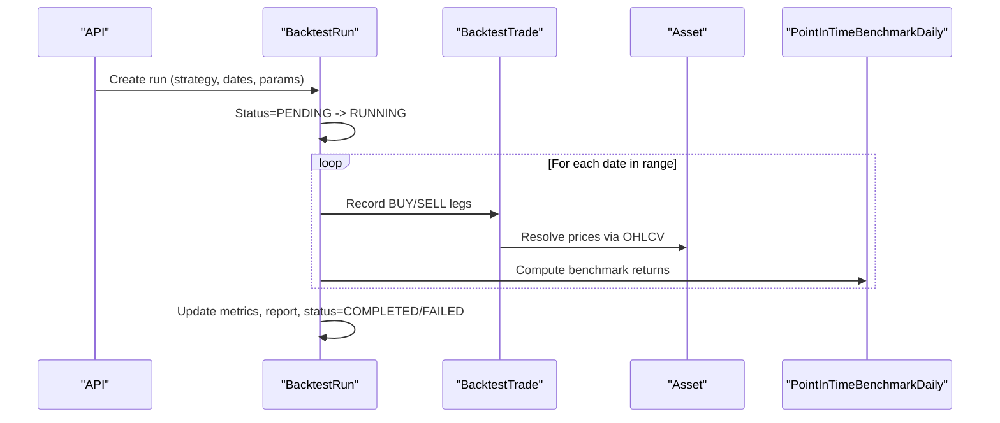
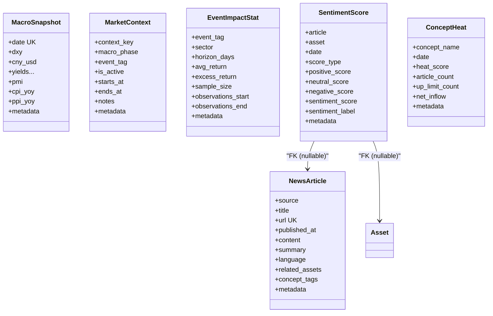
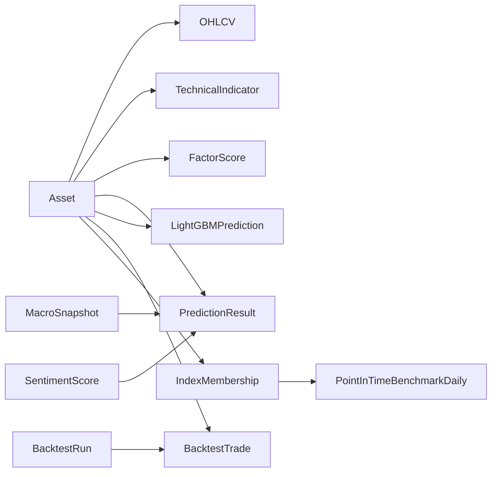
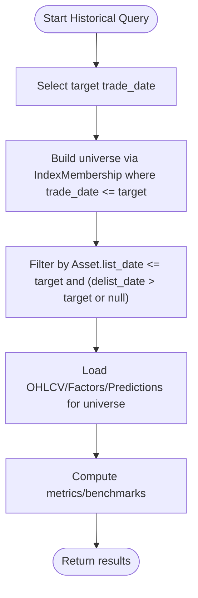

# Data Models & Database Schema

<cite>
**Referenced Files in This Document**
- [apps/markets/models.py](file://apps/markets/models.py)
- [apps/analytics/models.py](file://apps/analytics/models.py)
- [apps/factors/models.py](file://apps/factors/models.py)
- [apps/prediction/models.py](file://apps/prediction/models.py)
- [apps/prediction/models_lightgbm.py](file://apps/prediction/models_lightgbm.py)
- [apps/backtest/models.py](file://apps/backtest/models.py)
- [apps/macro/models.py](file://apps/macro/models.py)
- [apps/sentiment/models.py](file://apps/sentiment/models.py)
- [apps/developer/models.py](file://apps/developer/models.py)
- [apps/users/models.py](file://apps/users/models.py)
</cite>

## Table of Contents
1. Introduction
2. Project Structure
3. Core Components
4. Architecture Overview
5. Detailed Component Analysis
6. Dependency Analysis
7. Performance Considerations
8. Troubleshooting Guide
9. Conclusion
10. Appendices

## Introduction
This document provides a comprehensive data model and database schema reference for the FinanceAnalysis platform. It covers entity relationships across all applications, including Asset, OHLCV, TechnicalIndicator, FactorScore, PredictionResult, BacktestRun, and related models. It documents primary/foreign keys, indexes, constraints, validation rules, point-in-time integrity patterns (notably IndexMembership and asset lifecycle), data access patterns, caching strategies, performance considerations for large-scale financial datasets, data lifecycle policies (historical floors, staleness detection, archival), and security/access control mechanisms implemented at the model level.

## Project Structure
The platform is organized into Django apps that each own their domain models:
- markets: core market entities (Asset, OHLCV, calendars, index membership, benchmarks)
- analytics: technical indicators, alerts, signal events
- factors: fundamental snapshots, money flow, margin detail, capital flow, factor scores
- prediction: model versions, predictions, LightGBM artifacts and predictions, ensemble weights, feature importance
- backtest: run orchestration and trade ledger
- macro: macro snapshots, market context, event impact statistics
- sentiment: news articles, sentiment scores, concept heat
- developer: API key management and changelog
- users: user profiles, subscriptions, API usage tracking



**Diagram sources**
- [apps/markets/models.py:19-226](file://apps/markets/models.py#L19-L226)
- [apps/analytics/models.py:8-255](file://apps/analytics/models.py#L8-L255)
- [apps/factors/models.py:7-176](file://apps/factors/models.py#L7-L176)
- [apps/prediction/models.py:7-107](file://apps/prediction/models.py#L7-L107)
- [apps/prediction/models_lightgbm.py:7-137](file://apps/prediction/models_lightgbm.py#L7-L137)
- [apps/backtest/models.py:24-168](file://apps/backtest/models.py#L24-L168)
- [apps/macro/models.py:5-77](file://apps/macro/models.py#L5-L77)
- [apps/sentiment/models.py:35-125](file://apps/sentiment/models.py#L35-L125)
- [apps/developer/models.py:10-156](file://apps/developer/models.py#L10-L156)
- [apps/users/models.py:13-186](file://apps/users/models.py#L13-L186)

**Section sources**
- [apps/markets/models.py:1-226](file://apps/markets/models.py#L1-L226)
- [apps/analytics/models.py:1-255](file://apps/analytics/models.py#L1-L255)
- [apps/factors/models.py:1-176](file://apps/factors/models.py#L1-L176)
- [apps/prediction/models.py:1-107](file://apps/prediction/models.py#L1-L107)
- [apps/prediction/models_lightgbm.py:1-137](file://apps/prediction/models_lightgbm.py#L1-L137)
- [apps/backtest/models.py:1-168](file://apps/backtest/models.py#L1-L168)
- [apps/macro/models.py:1-77](file://apps/macro/models.py#L1-L77)
- [apps/sentiment/models.py:1-125](file://apps/sentiment/models.py#L1-L125)
- [apps/developer/models.py:1-156](file://apps/developer/models.py#L1-L156)
- [apps/users/models.py:1-186](file://apps/users/models.py#L1-L186)

## Core Components
This section summarizes the most critical entities and their roles:
- Asset: canonical identity for tradable instruments with listing/delisting dates and current index memberships.
- OHLCV: daily price/volume series per asset.
- TechnicalIndicator: time-stamped indicator values per asset.
- FactorScore: composite and component scores used for screening and modeling.
- PredictionResult/LightGBMPrediction: forward-looking probabilities and trade signals by horizon.
- BacktestRun/BacktestTrade: strategy execution state and trade ledger.
- MacroSnapshot/MarketContext: macroeconomic context and phase tagging.
- SentimentScore/NewsArticle: text-derived sentiment features and raw inputs.
- DeveloperAPIKey: secure API authentication primitives.
- UserProfile/Subscription/APIUsage: user account and usage telemetry.

**Section sources**
- [apps/markets/models.py:19-226](file://apps/markets/models.py#L19-L226)
- [apps/analytics/models.py:8-255](file://apps/analytics/models.py#L8-L255)
- [apps/factors/models.py:7-176](file://apps/factors/models.py#L7-L176)
- [apps/prediction/models.py:7-107](file://apps/prediction/models.py#L7-L107)
- [apps/prediction/models_lightgbm.py:7-137](file://apps/prediction/models_lightgbm.py#L7-L137)
- [apps/backtest/models.py:24-168](file://apps/backtest/models.py#L24-L168)
- [apps/macro/models.py:5-77](file://apps/macro/models.py#L5-L77)
- [apps/sentiment/models.py:35-125](file://apps/sentiment/models.py#L35-L125)
- [apps/developer/models.py:10-156](file://apps/developer/models.py#L10-L156)
- [apps/users/models.py:13-186](file://apps/users/models.py#L13-L186)

## Architecture Overview
The data architecture separates raw market data, derived features, predictive outputs, and execution results while preserving point-in-time correctness through explicit membership and benchmark histories.



**Diagram sources**
- [apps/markets/models.py:117-226](file://apps/markets/models.py#L117-L226)
- [apps/analytics/models.py:8-255](file://apps/analytics/models.py#L8-L255)
- [apps/factors/models.py:7-176](file://apps/factors/models.py#L7-L176)
- [apps/prediction/models.py:7-107](file://apps/prediction/models.py#L7-L107)
- [apps/prediction/models_lightgbm.py:7-137](file://apps/prediction/models_lightgbm.py#L7-L137)
- [apps/backtest/models.py:24-168](file://apps/backtest/models.py#L24-L168)
- [apps/macro/models.py:5-77](file://apps/macro/models.py#L5-L77)
- [apps/sentiment/models.py:35-125](file://apps/sentiment/models.py#L35-L125)

## Detailed Component Analysis

### Markets Domain
- Asset: identifies instruments; unique on (market, symbol); includes listing/delisting dates and current index membership tags to support lifecycle-aware queries.
- ExchangeTradingCalendar: official trading days per exchange; indexed and unique on (exchange_code, trade_date).
- AssetSuspension: daily suspension flags per asset; indexed on (asset, trade_date) and (trade_date, is_full_day); unique on (asset, trade_date).
- IndexMembership: historical membership snapshots enabling point-in-time universe construction; indexed on (index_code, trade_date) and (asset, index_code); unique on (asset, index_code, trade_date).
- BenchmarkIndexDaily: official index daily series; indexed on (index_code, trade_date); unique on (index_code, trade_date).
- PointInTimeBenchmarkDaily: internal union benchmark for backtests; indexed on (benchmark_code, trade_date); unique on (benchmark_code, trade_date).
- OHLCV: daily price/volume per asset; indexed on (asset, date); unique on (asset, date).



**Diagram sources**
- [apps/markets/models.py:4-226](file://apps/markets/models.py#L4-L226)

**Section sources**
- [apps/markets/models.py:4-226](file://apps/markets/models.py#L4-L226)

### Analytics Domain
- TechnicalIndicator: per-asset indicator values with parameters; unique on (asset, timestamp, indicator_type, parameters); indexed on (asset, timestamp, indicator_type).
- SignalEvent: discrete technical signals; unique on (asset, timestamp, signal_type); indexed on (asset, timestamp, signal_type) and (signal_type, timestamp).
- ScreenerTemplate/AlertRule/AlertEvent: user-defined screens and alerting; AlertEvent tracks status transitions and channels.



**Diagram sources**
- [apps/analytics/models.py:8-255](file://apps/analytics/models.py#L8-L255)

**Section sources**
- [apps/analytics/models.py:8-255](file://apps/analytics/models.py#L8-L255)

### Factors Domain
- FundamentalFactorSnapshot, AssetMoneyFlowSnapshot, AssetMarginDetailSnapshot, CapitalFlowSnapshot: daily snapshots keyed by (asset, date) with indexes for efficient slicing.
- FactorScore: composite and component scores; unique on (asset, date, mode); optimized indexes for ranking queries.



**Diagram sources**
- [apps/factors/models.py:7-176](file://apps/factors/models.py#L7-L176)

**Section sources**
- [apps/factors/models.py:7-176](file://apps/factors/models.py#L7-L176)

### Prediction Domain
- ModelVersion/LightGBMModelArtifact: registry of trained models with status, metrics, training windows, and active flag.
- PredictionResult/LightGBMPrediction: per-asset, per-date, per-horizon predictions with probabilities, labels, risk metrics, and optional trade decision fields; linked to model version/artifact.
- EnsembleWeightSnapshot: time-varying ensemble weights.
- FeatureImportanceSnapshot: per-model artifact feature importance history.



**Diagram sources**
- [apps/prediction/models.py:7-107](file://apps/prediction/models.py#L7-L107)
- [apps/prediction/models_lightgbm.py:7-137](file://apps/prediction/models_lightgbm.py#L7-L137)

**Section sources**
- [apps/prediction/models.py:7-107](file://apps/prediction/models.py#L7-L107)
- [apps/prediction/models_lightgbm.py:7-137](file://apps/prediction/models_lightgbm.py#L7-L137)

### Backtest Domain
- BacktestRun: stores strategy type, date range, capitalization, summary metrics, JSON parameters/report, and async control fields; indexed on strategy/status/date ranges.
- BacktestTrade: leg-level trades linked to runs and assets; indexed on (backtest_run, trade_date) and (asset, trade_date).



**Diagram sources**
- [apps/backtest/models.py:24-168](file://apps/backtest/models.py#L24-L168)
- [apps/markets/models.py:173-226](file://apps/markets/models.py#L173-L226)

**Section sources**
- [apps/backtest/models.py:24-168](file://apps/backtest/models.py#L24-L168)

### Macro and Sentiment Domains
- MacroSnapshot: monthly/daily macro variables; unique date key.
- MarketContext: macro phases and event tags with active windows.
- EventImpactStat: historical impact stats by event tag, sector, horizon.
- NewsArticle: raw ingested articles deduplicated by URL.
- SentimentScore: three scopes (ARTICLE, ASSET_7D, MARKET_7D) with unique constraints ensuring idempotent upserts.
- ConceptHeat: aggregated concept theme metrics.



**Diagram sources**
- [apps/macro/models.py:5-77](file://apps/macro/models.py#L5-L77)
- [apps/sentiment/models.py:35-125](file://apps/sentiment/models.py#L35-L125)

**Section sources**
- [apps/macro/models.py:5-77](file://apps/macro/models.py#L5-L77)
- [apps/sentiment/models.py:35-125](file://apps/sentiment/models.py#L35-L125)

### Security and Access Control Models
- DeveloperAPIKey: secure API key storage using SHA-256 hash; only prefix stored in plaintext; supports sandbox mode and expiration.
- UserProfile/Subscription: subscription tiers and activation status.
- APIUsage: endpoint/method/timestamp logs for rate limiting and analytics.

```mermaid
classDiagram
class DeveloperAPIKey {
+user
+name
+key_prefix
+key_hash UK
+is_active
+is_sandbox
+expires_at
+last_used_at
}
class UserProfile {
+user
+phone_number
+company
+email_verified
+email_verification_token
}
class Subscription {
+user
+tier
+stripe_subscription_id UK
+stripe_customer_id
+is_active
+start_date
+end_date
+auto_renew
}
class APIUsage {
+user
+endpoint
+method
+timestamp
+response_status
+ip_address
}
DeveloperAPIKey --> User : "FK"
UserProfile --> User : "1 : 1"
Subscription --> User : "FK"
APIUsage --> User : "FK (nullable)"
```

**Diagram sources**
- [apps/developer/models.py:10-156](file://apps/developer/models.py#L10-L156)
- [apps/users/models.py:13-186](file://apps/users/models.py#L13-L186)

**Section sources**
- [apps/developer/models.py:10-156](file://apps/developer/models.py#L10-L156)
- [apps/users/models.py:13-186](file://apps/users/models.py#L13-L186)

## Dependency Analysis
Cross-app dependencies are intentionally minimal and centered around Asset as the universal identifier. Predictions depend on model versions/artifacts; backtests depend on assets and benchmarks; factors and analytics depend on assets; sentiment depends on articles and optionally assets.



**Diagram sources**
- [apps/markets/models.py:19-226](file://apps/markets/models.py#L19-L226)
- [apps/analytics/models.py:8-255](file://apps/analytics/models.py#L8-L255)
- [apps/factors/models.py:7-176](file://apps/factors/models.py#L7-L176)
- [apps/prediction/models.py:7-107](file://apps/prediction/models.py#L7-L107)
- [apps/prediction/models_lightgbm.py:7-137](file://apps/prediction/models_lightgbm.py#L7-L137)
- [apps/backtest/models.py:24-168](file://apps/backtest/models.py#L24-L168)
- [apps/macro/models.py:5-77](file://apps/macro/models.py#L5-L77)
- [apps/sentiment/models.py:35-125](file://apps/sentiment/models.py#L35-L125)

**Section sources**
- [apps/markets/models.py:19-226](file://apps/markets/models.py#L19-L226)
- [apps/prediction/models.py:7-107](file://apps/prediction/models.py#L7-L107)
- [apps/backtest/models.py:24-168](file://apps/backtest/models.py#L24-L168)

## Performance Considerations
- Indexing strategy:
  - Time-series tables use composite indexes on (entity, date) or (entity, timestamp) to optimize range scans and joins.
  - High-cardinality filters (e.g., predicted_label, score_type, horizon_days) are indexed to speed up dashboards and exports.
- Unique constraints:
  - Enforce idempotency for daily snapshots and predictions (e.g., (asset, date), (asset, date, horizon_days, model_version)).
- Partitioning and archival:
  - Large tables (OHLCV, TechnicalIndicator, SentimentScore) benefit from partitioning by date ranges and archiving older periods to cold storage.
- Query optimization:
  - Use covering indexes for frequent read paths (e.g., asset+date+indicator_type).
  - Avoid full-table scans by filtering on indexed columns (e.g., index_code, trade_date).
- Caching:
  - Cache hot aggregates (factor scores, top signals) with short TTLs.
  - Cache model artifacts and feature schemas at application layer.
- Bulk operations:
  - Prefer bulk_create/update for backfills; batch by asset and date ranges to minimize transaction size.
- Staleness detection:
  - Monitor last_updated timestamps and compare against expected refresh cadence; trigger recomputation when gaps are detected.

[No sources needed since this section provides general guidance]

## Troubleshooting Guide
Common issues and remedies grounded in the schema:
- Duplicate rows:
  - Violations of unique_together constraints indicate duplicate ingestion; ensure idempotent upserts and deduplicate by natural keys (e.g., asset+date).
- Missing point-in-time data:
  - If IndexMembership lacks entries for a date, universe construction may be incomplete; verify sync tasks and backfill pipelines.
- Stale indicators:
  - Check TechnicalIndicator timestamps and recompute if behind schedule; leverage staleness utilities to detect gaps.
- Backtest inconsistencies:
  - Validate BacktestRun.status and report.runtime_state; inspect BacktestTrade legs for missing prices or incorrect sides.
- API key misuse:
  - Verify DeveloperAPIKey.is_active and expiration; confirm key_hash matches provided key prefix.

**Section sources**
- [apps/analytics/models.py:8-255](file://apps/analytics/models.py#L8-L255)
- [apps/markets/models.py:117-145](file://apps/markets/models.py#L117-L145)
- [apps/backtest/models.py:24-168](file://apps/backtest/models.py#L24-L168)
- [apps/developer/models.py:10-156](file://apps/developer/models.py#L10-L156)

## Conclusion
The FinanceAnalysis platform’s data model emphasizes robust point-in-time integrity, clear separation of concerns across domains, and strong indexing and constraints to support large-scale financial analytics. Asset-centric design enables consistent joins across market data, derived features, predictions, and backtests. Lifecycle management via IndexMembership and asset dates ensures accurate historical analysis. Security and access controls are enforced at the model level through hashed API keys and user-scoped resources.

[No sources needed since this section summarizes without analyzing specific files]

## Appendices

### Point-in-Time Integrity Patterns
- IndexMembership records which indices an asset belonged to on each trade_date, enabling correct historical universe construction.
- PointInTimeBenchmarkDaily provides a union benchmark reflecting constituents available at each date, avoiding look-ahead bias in backtests.
- Asset.list_date and .delist_date gate inclusion/exclusion in analyses based on effective dates.



**Diagram sources**
- [apps/markets/models.py:19-226](file://apps/markets/models.py#L19-L226)

**Section sources**
- [apps/markets/models.py:117-226](file://apps/markets/models.py#L117-L226)

### Data Lifecycle Policies
- Historical floors: maintain immutable historical snapshots (e.g., OHLCV, FactorScore) with strict append-only semantics; corrections should be handled via new revisions rather than in-place updates.
- Staleness detection: monitor last_updated fields and expected refresh schedules; alert on gaps exceeding thresholds.
- Archival rules: archive data beyond retention windows to cold storage; keep lightweight indexes for recent hot data.

[No sources needed since this section provides general guidance]

### Security and Privacy Requirements
- Store only hashed API keys; expose safe prefixes for identification.
- Enforce sandbox vs production modes for API keys to limit exposure.
- Scope user-specific data via foreign keys to User/UserProfile; restrict access through application-layer authorization.
- Log API usage for auditability and rate limiting.

**Section sources**
- [apps/developer/models.py:10-156](file://apps/developer/models.py#L10-L156)
- [apps/users/models.py:13-186](file://apps/users/models.py#L13-L186)