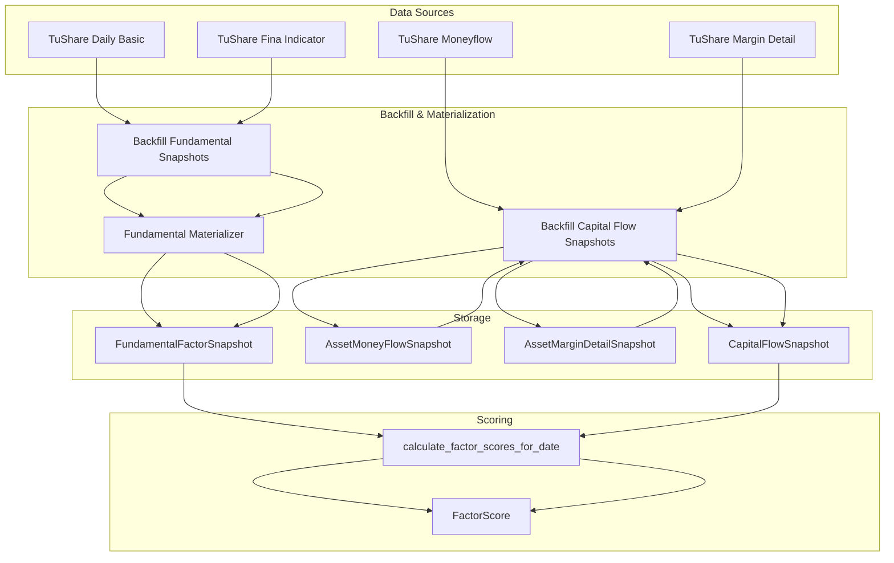
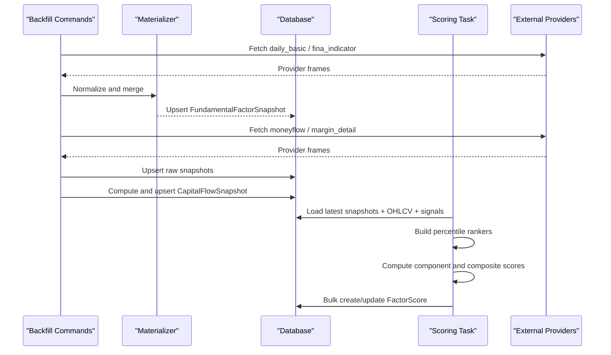
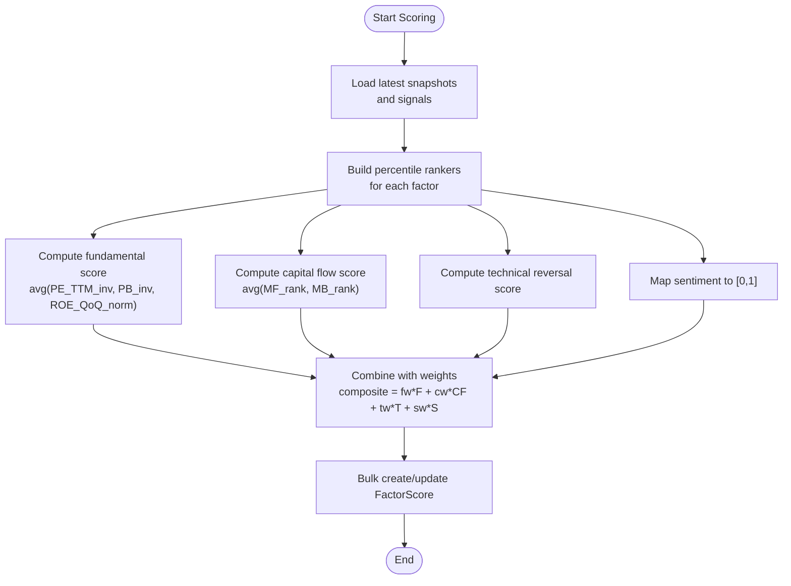
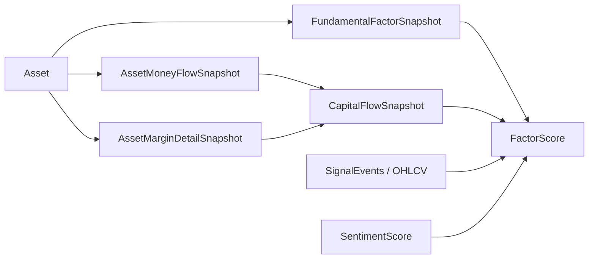

# Factor Scoring Models

<cite>
**Referenced Files in This Document**
- [models.py](file://apps/factors/models.py)
- [fundamental_materialization.py](file://apps/factors/fundamental_materialization.py)
- [tasks.py](file://apps/factors/tasks.py)
- [serializers.py](file://apps/factors/serializers.py)
- [backfill_fundamental_snapshots.py](file://apps/factors/management/commands/backfill_fundamental_snapshots.py)
- [backfill_capital_flow_snapshots.py](file://apps/factors/management/commands/backfill_capital_flow_snapshots.py)
- [0005_fundamentalfactorsnapshot_market_cap_fields.py](file://apps/factors/migrations/0005_fundamentalfactorsnapshot_market_cap_fields.py)
- [0006_add_pe_ttm_fields.py](file://apps/factors/migrations/0006_add_pe_ttm_fields.py)
- [models.py (sentiment)](file://apps/sentiment/models.py)
</cite>

## Table of Contents
1. Introduction
2. Project Structure
3. Core Components
4. Architecture Overview
5. Detailed Component Analysis
6. Dependency Analysis
7. Performance Considerations
8. Troubleshooting Guide
9. Conclusion
10. Appendices

## Introduction
This document describes the data models and processing pipeline that materialize fundamental, capital flow, and margin data into daily snapshots and combine them into composite factor scores for assets. It explains how raw fundamentals from external sources are normalized and backfilled into FundamentalFactorSnapshot, how institutional activity is tracked via AssetMoneyFlowSnapshot and AssetMarginDetailSnapshot and summarized into CapitalFlowSnapshot, and how a scoring engine computes component and composite scores with percentile normalization and configurable weighting. It also documents field definitions for key metrics such as P/E ratios, market cap fields, and sentiment scores, and outlines performance strategies for large-scale computations.

## Project Structure
The factor scoring system spans several modules:
- Data models define snapshots and final scores.
- A materialization module normalizes and merges provider data into daily fundamental snapshots.
- Management commands backfill historical data from external providers and compute derived capital flow features.
- A Celery task orchestrates daily factor score computation across all assets using latest snapshots, technical indicators, and sentiment signals.
- Serializers expose selected fields for API consumption.

**Diagram sources**
- [backfill_fundamental_snapshots.py:40-171](file://apps/factors/management/commands/backfill_fundamental_snapshots.py#L40-L171)
- [backfill_capital_flow_snapshots.py:57-372](file://apps/factors/management/commands/backfill_capital_flow_snapshots.py#L57-L372)
- [fundamental_materialization.py:123-190](file://apps/factors/fundamental_materialization.py#L123-L190)
- [tasks.py:283-460](file://apps/factors/tasks.py#L283-L460)
- [models.py:7-176](file://apps/factors/models.py#L7-L176)

**Section sources**
- [models.py:7-176](file://apps/factors/models.py#L7-L176)
- [fundamental_materialization.py:1-190](file://apps/factors/fundamental_materialization.py#L1-190)
- [tasks.py:1-461](file://apps/factors/tasks.py#L1-L461)
- [backfill_fundamental_snapshots.py:1-265](file://apps/factors/management/commands/backfill_fundamental_snapshots.py#L1-L265)
- [backfill_capital_flow_snapshots.py:1-392](file://apps/factors/management/commands/backfill_capital_flow_snapshots.py#L1-L392)

## Core Components
- FundamentalFactorSnapshot: Daily fundamental metrics per asset used for valuation and quality factors. Includes P/E, P/E TTM, P/B, share counts, market values, ROE, and quarter-over-quarter ROE change.
- AssetMoneyFlowSnapshot: Raw per-stock daily money flow amounts by size category and net main flow amount.
- AssetMarginDetailSnapshot: Raw per-stock daily margin detail including financing and securities lending balances and flows.
- CapitalFlowSnapshot: Derived daily snapshot summarizing institutional activity via rolling main force net flow and margin balance changes.
- FactorScore: Composite daily score combining fundamental, capital flow, technical reversal, and sentiment components with configurable weights and percentile-normalized inputs.

Key responsibilities:
- Backfilling and materializing raw provider data into consistent daily snapshots.
- Computing normalized component scores and aggregating them into composite scores.
- Persisting results with metadata for traceability.

**Section sources**
- [models.py:7-176](file://apps/factors/models.py#L7-L176)
- [serializers.py:6-44](file://apps/factors/serializers.py#L6-L44)

## Architecture Overview
The pipeline has three stages:
1. Data ingestion and normalization:
   - Fundamental data from TuShare daily_basic and fina_indicator is fetched, normalized, and merged onto trading dates to produce FundamentalFactorSnapshot rows.
   - Moneyflow and margin_detail are ingested into raw snapshots and then aggregated into CapitalFlowSnapshot features.
2. Feature enrichment:
   - Technical reversal scores are computed from OHLCV-derived indicators and signal events.
   - Sentiment scores are mapped to a 0–1 range for inclusion in the composite.
3. Scoring and persistence:
   - Percentile ranks are built across the universe for each factor input.
   - Component scores are averaged within categories and combined using normalized weights.
   - Results are bulk-created or updated per date and mode.

**Diagram sources**
- [backfill_fundamental_snapshots.py:128-171](file://apps/factors/management/commands/backfill_fundamental_snapshots.py#L128-L171)
- [backfill_capital_flow_snapshots.py:120-372](file://apps/factors/management/commands/backfill_capital_flow_snapshots.py#L120-L372)
- [fundamental_materialization.py:123-190](file://apps/factors/fundamental_materialization.py#L123-L190)
- [tasks.py:283-460](file://apps/factors/tasks.py#L283-L460)

## Detailed Component Analysis

### FundamentalFactorSnapshot
Purpose:
- Stores daily fundamental metrics aligned to trading dates, enabling valuation and quality factor computation.

Key fields:
- pe: Price-to-earnings ratio.
- pe_ttm: Trailing-twelve-month P/E.
- pb: Price-to-book ratio.
- total_share: Total number of shares.
- float_share: Float shares outstanding.
- free_share: Free float shares.
- total_mv: Total market value.
- circ_mv: Circulating market value.
- roe: Return on equity (normalized).
- roe_qoq: Quarter-over-quarter change in ROE.
- metadata: Source provenance and alignment dates.

Normalization and lineage:
- Daily basic fields are normalized and aligned to trading dates; missing columns are filled with None.
- Financial indicator fields (ROE) are normalized to rates and deduplicated by report period; ROE QoQ is computed as sequential differences.
- The materializer merges daily and financial indicator series using backward-looking joins so each trading date carries the most recent available fundamentals.

Performance notes:
- Uses pandas merge_asof for efficient time-aligned joins.
- Batch upserts with update_conflicts to ensure idempotent re-runs.

**Section sources**
- [models.py:7-37](file://apps/factors/models.py#L7-L37)
- [fundamental_materialization.py:61-121](file://apps/factors/fundamental_materialization.py#L61-L121)
- [fundamental_materialization.py:123-190](file://apps/factors/fundamental_materialization.py#L123-L190)
- [backfill_fundamental_snapshots.py:128-171](file://apps/factors/management/commands/backfill_fundamental_snapshots.py#L128-L171)
- [0005_fundamentalfactorsnapshot_market_cap_fields.py:1-36](file://apps/factors/migrations/0005_fundamentalfactorsnapshot_market_cap_fields.py#L1-L36)
- [0006_add_pe_ttm_fields.py:1-21](file://apps/factors/migrations/0006_add_pe_ttm_fields.py#L1-L21)

### AssetMoneyFlowSnapshot and AssetMarginDetailSnapshot
Purpose:
- Capture granular daily institutional activity and leverage positions at the asset level.

AssetMoneyFlowSnapshot fields:
- buy_sm_amount, sell_sm_amount: Small order inflows/outflows.
- buy_md_amount, sell_md_amount: Medium order inflows/outflows.
- buy_lg_amount, sell_lg_amount: Large order inflows/outflows.
- buy_elg_amount, sell_elg_amount: Extra-large order inflows/outflows.
- net_mf_amount: Net main flow amount.

AssetMarginDetailSnapshot fields:
- rzye: Financing balance.
- rqye: Securities lending balance.
- rzmre: Financing buy amount.
- rzche: Financing repayment amount.
- rqyl: Securities lending volume.
- rqchl: Securities lending repayment volume.
- rqmcl: Securities lending sell volume.
- rzrqye: Combined margin balance.

Lineage:
- Raw provider frames are cleaned, deduplicated by date, and upserted per asset-date.
- These tables serve as the foundation for derived CapitalFlowSnapshot features.

**Section sources**
- [models.py:39-98](file://apps/factors/models.py#L39-L98)
- [backfill_capital_flow_snapshots.py:190-310](file://apps/factors/management/commands/backfill_capital_flow_snapshots.py#L190-L310)

### CapitalFlowSnapshot
Purpose:
- Summarizes institutional activity over short windows to feed capital flow factors.

Fields:
- main_force_net_5d: Rolling 5-day sum of large and extra-large net inflows (buy minus sell), representing institutional buying pressure.
- margin_balance_change_5d: 5-day difference in combined margin balance, indicating leverage trend changes.

Computation:
- Main force daily is derived from large and extra-large buy/sell amounts; a 5-day rolling sum is stored.
- Margin balance change is computed as a 5-day difference of the combined margin balance.
- History is merged with current day data to ensure sufficient lookback for rolling calculations.

**Section sources**
- [models.py:100-122](file://apps/factors/models.py#L100-L122)
- [backfill_capital_flow_snapshots.py:312-372](file://apps/factors/management/commands/backfill_capital_flow_snapshots.py#L312-L372)

### FactorScore and Composite Scoring Engine
Purpose:
- Produces daily composite scores that rank assets for “bottom” candidates by combining fundamental, capital flow, technical, and sentiment factors.

Component inputs:
- Fundamental: PE, PE TTM, PB percentiles; ROE trend (derived from ROE QoQ).
- Capital flow: Main force flow and margin balance change percentiles.
- Technical: Reversal score based on RSI, Bollinger Bands lower band proximity, oversold signals, and volume confirmation.
- Sentiment: 7-day asset sentiment mapped from [-1, 1] to [0, 1].

Normalization and weighting:
- Percentile ranks are built across the asset universe for each numeric input; lower valuation multiples are inverted so higher scores indicate better “bottom” candidates.
- Component aggregates:
  - Fundamental score: average of PE TTM percentile score, PB percentile score, and ROE trend score.
  - Capital flow score: average of main force flow percentile score and margin balance change percentile score.
- Composite score: weighted sum of fundamental, capital flow, technical, and sentiment scores. Weights are normalized to sum to 1 if provided.

Persistence:
- Scores are created or updated per asset-date-mode with metadata capturing target date and source.

**Diagram sources**
- [tasks.py:40-69](file://apps/factors/tasks.py#L40-L69)
- [tasks.py:124-253](file://apps/factors/tasks.py#L124-L253)
- [tasks.py:283-460](file://apps/factors/tasks.py#L283-L460)

**Section sources**
- [models.py:124-176](file://apps/factors/models.py#L124-L176)
- [tasks.py:40-69](file://apps/factors/tasks.py#L40-L69)
- [tasks.py:124-253](file://apps/factors/tasks.py#L124-L253)
- [tasks.py:283-460](file://apps/factors/tasks.py#L283-L460)

### Sentiment Integration
- SentimentScore stores article-level and aggregated scores. For factor scoring, the ASSET_7D score type is used.
- The raw sentiment score in [-1, 1] is linearly mapped to [0, 1] before inclusion in the composite.

**Section sources**
- [models.py (sentiment):64-107](file://apps/sentiment/models.py#L64-L107)
- [tasks.py:85-98](file://apps/factors/tasks.py#L85-L98)
- [tasks.py:241-253](file://apps/factors/tasks.py#L241-L253)

## Dependency Analysis
- FundamentalFactorSnapshot depends on Asset and is populated by backfill commands that call external APIs and normalize via the materializer.
- CapitalFlowSnapshot depends on raw moneyflow and margin detail snapshots; it is derived during backfill using rolling and diff operations.
- FactorScore depends on:
  - Latest FundamentalFactorSnapshot and CapitalFlowSnapshot per asset.
  - Technical indicators and signal events from other apps.
  - SentimentScore for the 7-day asset aggregation.
- Serializers expose selected fields for API access without leaking internal metadata.

**Diagram sources**
- [models.py:7-176](file://apps/factors/models.py#L7-L176)
- [tasks.py:283-460](file://apps/factors/tasks.py#L283-L460)

**Section sources**
- [models.py:7-176](file://apps/factors/models.py#L7-L176)
- [tasks.py:283-460](file://apps/factors/tasks.py#L283-L460)

## Performance Considerations
- Windowed fetching: Backfill commands iterate over date windows to avoid oversized API payloads and respect rate limits.
- Efficient joins: Fundamental materialization uses merge_asof to align daily and financial indicator series efficiently.
- Bulk operations: All upserts use bulk_create with update_conflicts and unique_fields to minimize database round-trips and ensure idempotency.
- Batch sizing: Factor score creation uses a configurable batch size to optimize throughput.
- Lookback optimization: Technical scoring uses minimal necessary lookback windows for RSI, Bollinger Bands, and volume checks.
- Indexes: Database indexes on asset-date pairs and date fields accelerate queries for latest rows and time-series scans.

[No sources needed since this section provides general guidance]

## Troubleshooting Guide
Common issues and resolutions:
- Missing fundamentals: If core fields like PE, PB, ROE, or market cap fields are null, re-run the fundamental backfill command for the affected date range. Check metadata for alignment dates and upstream availability.
- Rate limiting: External provider calls implement retry logic with sleeps; adjust request sleep and retry settings if encountering frequent throttling.
- Stale ROE announcements: A repair flag can detect and reprocess assets where stored ROE rows point to older report periods for the same announcement date.
- Incomplete capital flow history: Ensure raw moneyflow and margin detail snapshots exist for the required lookback windows; the backfill merges existing history with current data to compute rolling features.
- Score anomalies: Verify percentile rankers include non-null values; check for assets with missing fundamentals or flows which may result in default averages.

**Section sources**
- [backfill_fundamental_snapshots.py:40-171](file://apps/factors/management/commands/backfill_fundamental_snapshots.py#L40-L171)
- [backfill_capital_flow_snapshots.py:57-372](file://apps/factors/management/commands/backfill_capital_flow_snapshots.py#L57-L372)
- [tasks.py:283-460](file://apps/factors/tasks.py#L283-L460)

## Conclusion
The factor scoring system materializes diverse fundamental and market microstructure data into standardized daily snapshots and combines them into composite scores through robust normalization and weighting. The design emphasizes idempotent backfills, efficient time-aligned joins, and scalable bulk operations suitable for large universes. Sentiment and technical signals enrich the composite, while metadata ensures full traceability from raw sources to final scores.

[No sources needed since this section summarizes without analyzing specific files]

## Appendices

### Field Definitions Summary
- FundamentalFactorSnapshot:
  - pe, pe_ttm, pb: Valuation multiples.
  - total_share, float_share, free_share: Share structure metrics.
  - total_mv, circ_mv: Market capitalization measures.
  - roe, roe_qoq: Profitability and momentum.
- AssetMoneyFlowSnapshot:
  - Size-stratified buy/sell amounts and net main flow.
- AssetMarginDetailSnapshot:
  - Financing and securities lending balances and flows; combined margin balance.
- CapitalFlowSnapshot:
  - main_force_net_5d: Institutional buying pressure (rolling sum).
  - margin_balance_change_5d: Leverage trend (5-day difference).
- FactorScore:
  - Component percentile scores and aggregates.
  - Configurable weights for fundamental, flow, technical, and sentiment.
  - composite_score and bottom_probability_score.

**Section sources**
- [models.py:7-176](file://apps/factors/models.py#L7-L176)
- [serializers.py:6-44](file://apps/factors/serializers.py#L6-L44)