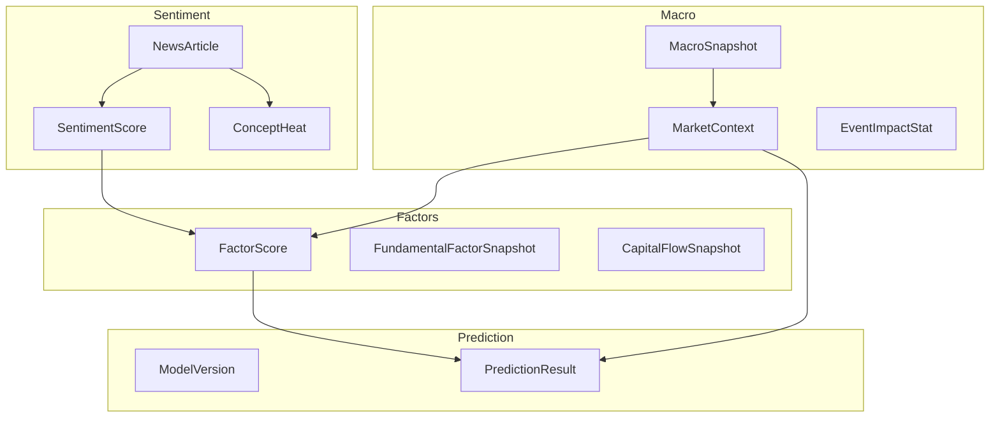
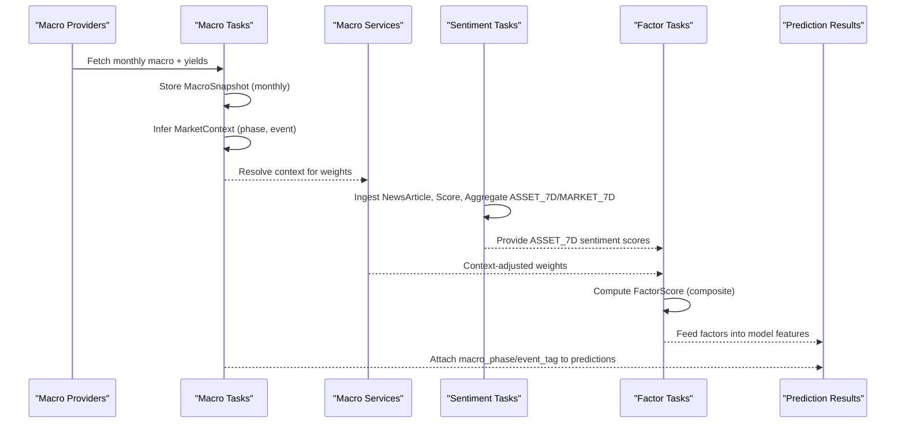
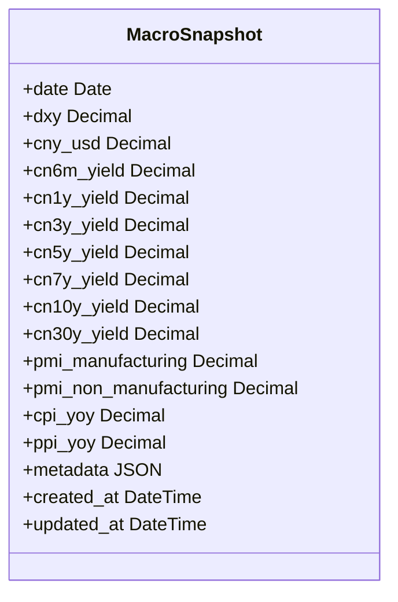
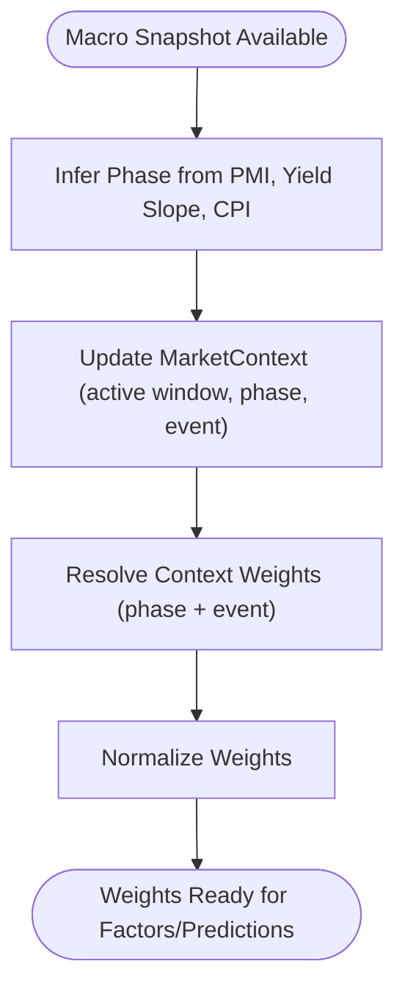
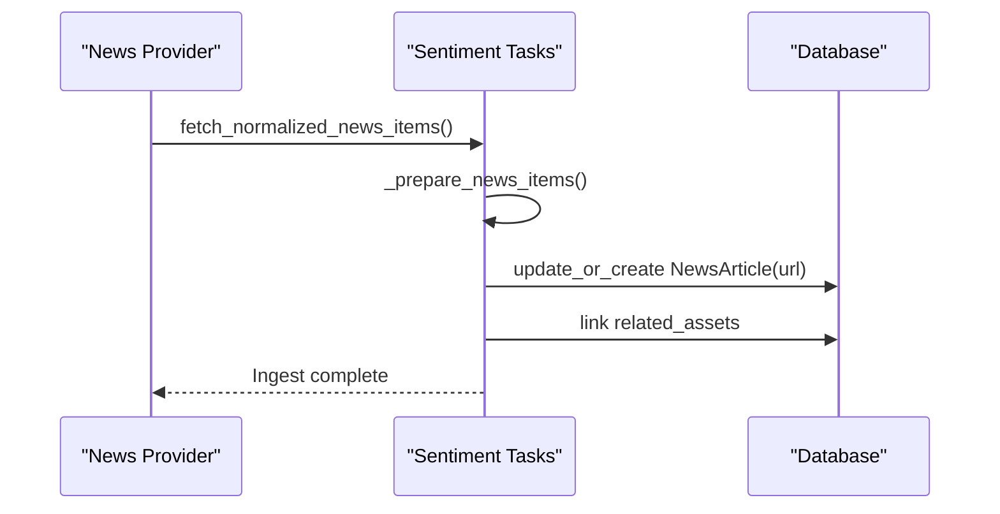
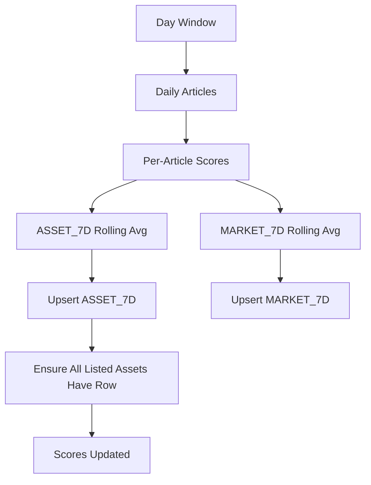
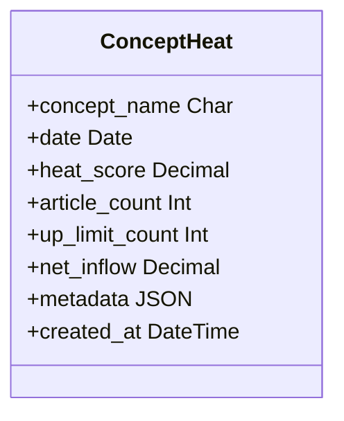
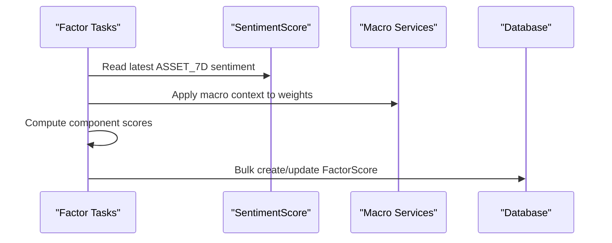
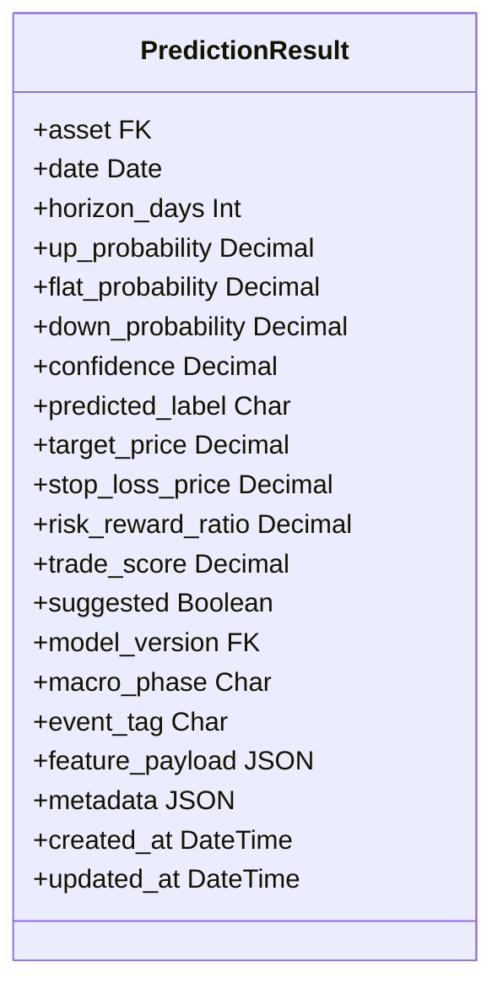
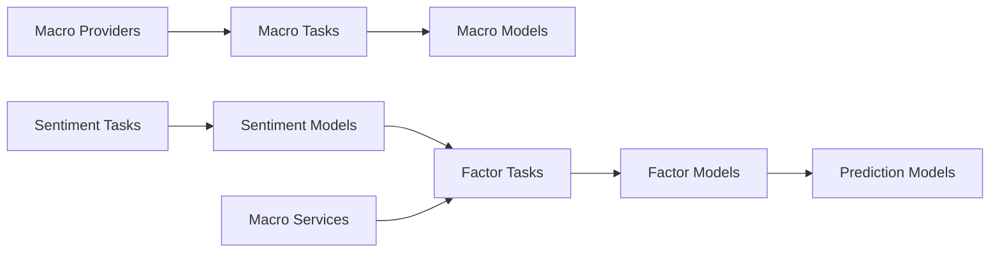

# Macro & Sentiment Models

<cite>
**Referenced Files in This Document**
- [models.py](file://apps/macro/models.py)
- [providers.py](file://apps/macro/providers.py)
- [tasks.py](file://apps/macro/tasks.py)
- [services.py](file://apps/macro/services.py)
- [models.py](file://apps/sentiment/models.py)
- [tasks.py](file://apps/sentiment/tasks.py)
- [models.py](file://apps/factors/models.py)
- [tasks.py](file://apps/factors/tasks.py)
- [models.py](file://apps/prediction/models.py)
</cite>

## Table of Contents
1. [Introduction](#introduction)
2. [Project Structure](#project-structure)
3. [Core Components](#core-components)
4. [Architecture Overview](#architecture-overview)
5. [Detailed Component Analysis](#detailed-component-analysis)
6. [Dependency Analysis](#dependency-analysis)
7. [Performance Considerations](#performance-considerations)
8. [Troubleshooting Guide](#troubleshooting-guide)
9. [Conclusion](#conclusion)

## Introduction
This document describes the data models and processing pipelines that capture macroeconomic context, sentiment from financial news, and how these inputs influence asset-level factor scores and predictions. It focuses on:
- MacroSnapshot for monthly macro indicators with temporal consistency
- Yield surface fields embedded within MacroSnapshot to represent interest rate term structure points
- NewsArticle as the raw ingestion layer for financial news
- SentimentScore aggregations at article, per-asset 7-day rolling, and market-wide 7-day rolling scopes
- ConceptHeat for trending topic and theme monitoring
- FactorScore integration of macro context via weights and sentiment signals into composite scoring
- PredictionResult linkage to macro phase and event tags for broader economic conditioning

## Project Structure
The relevant code is organized across Django apps:
- apps/macro: macro snapshots, yield curve handling, market context inference, and weight adjustments
- apps/sentiment: news ingestion, lexicon-based scoring, asset attribution, aggregation, and concept heat mapping
- apps/factors: fundamental, capital flow, technical, and sentiment components aggregated into daily factor scores
- apps/prediction: model versions and prediction results that carry macro phase and event tags

**Diagram sources**
- [models.py:5-77](file://apps/macro/models.py#L5-L77)
- [models.py:35-125](file://apps/sentiment/models.py#L35-L125)
- [models.py:7-176](file://apps/factors/models.py#L7-L176)
- [models.py:7-107](file://apps/prediction/models.py#L7-L107)

**Section sources**
- [models.py:5-77](file://apps/macro/models.py#L5-L77)
- [models.py:35-125](file://apps/sentiment/models.py#L35-L125)
- [models.py:7-176](file://apps/factors/models.py#L7-L176)
- [models.py:7-107](file://apps/prediction/models.py#L7-L107)

## Core Components
- MacroSnapshot: Monthly snapshot storing DXY, CNY/USD, China yield curve tenors (6M, 1Y, 3Y, 5Y, 7Y, 10Y, 30Y), PMI manufacturing/non-manufacturing, CPI YoY, PPI YoY, plus metadata and timestamps.
- MarketContext: Current macro phase (Recovery, Overheat, Stagflation, Recession), event tag, active window, notes, and metadata used to adjust factor weights and annotate predictions.
- NewsArticle: Ingested news items with source, title, URL, published_at, content, summary, language, related assets, concept tags, and metadata.
- SentimentScore: Three scopes—ARTICLE, ASSET_7D, MARKET_7D—with positive/neutral/negative scores, overall sentiment score, label, and metadata. Unique key ensures idempotent upserts.
- ConceptHeat: Daily concept name to heat_score, article_count, up_limit_count, net_inflow, and metadata for trending themes.
- FactorScore: Composite scoring combining fundamental, capital flow, technical, and sentiment components with weights; includes component percentile scores and bottom probability.
- PredictionResult: Per-asset horizon predictions with probabilities, labels, risk metrics, model version, macro_phase, event_tag, feature payload, and metadata.

**Section sources**
- [models.py:5-77](file://apps/macro/models.py#L5-L77)
- [models.py:35-125](file://apps/sentiment/models.py#L35-L125)
- [models.py:7-176](file://apps/factors/models.py#L7-L176)
- [models.py:7-107](file://apps/prediction/models.py#L7-L107)

## Architecture Overview
End-to-end flows:
- Macro data collection: Providers fetch CPI, PPI, PMI, FX quotes, and yield curve points; payloads are merged with fallback logic and stored as MacroSnapshot. Market context is inferred and updated.
- Sentiment pipeline: News articles are ingested, scored via a lexicon, attributed to assets by name aliases, aggregated into ASSET_7D and MARKET_7D, and concept heat is computed.
- Factor scoring: Fundamental, capital flow, technical reversal, and sentiment signals are combined using configurable weights; macro context can adjust weights via services.
- Predictions: Model outputs include macro phase and event tags to reflect broader economic conditions.

**Diagram sources**
- [providers.py:359-616](file://apps/macro/providers.py#L359-L616)
- [tasks.py:91-151](file://apps/macro/tasks.py#L91-L151)
- [services.py:51-90](file://apps/macro/services.py#L51-L90)
- [tasks.py:283-565](file://apps/sentiment/tasks.py#L283-L565)
- [tasks.py:283-461](file://apps/factors/tasks.py#L283-L461)
- [models.py:43-98](file://apps/prediction/models.py#L43-L98)

## Detailed Component Analysis

### MacroSnapshot and Yield Surface Fields
- Purpose: Capture monthly macro indicators and yield curve points for temporal consistency. Each row represents one month’s snapshot keyed by date.
- Yield surface representation: Tenor-specific yield fields (cn6m_yield through cn30y_yield) form discrete points along the term structure. The provider builds monthly yield points from yield curve queries and selects preferred rows by curve type and trade date.
- Temporal consistency: Snapshots are created or updated monthly; missing fields are filled via fallback providers; metadata records field sources and errors.

**Diagram sources**
- [models.py:5-28](file://apps/macro/models.py#L5-L28)

**Section sources**
- [models.py:5-28](file://apps/macro/models.py#L5-L28)
- [providers.py:203-228](file://apps/macro/providers.py#L203-L228)
- [providers.py:359-616](file://apps/macro/providers.py#L359-L616)
- [tasks.py:91-131](file://apps/macro/tasks.py#L91-L131)

### MarketContext and Macro Phase Inference
- Purpose: Maintain current macro phase and optional event tag with an active time window. Used to adjust factor weights and annotate predictions.
- Inference logic: Uses PMI values, yield curve slope (10Y - 3Y), and CPI thresholds to classify Recovery, Overheat, Stagflation, or Recession.
- Weight adjustment: Services apply preset weights per phase and event-specific multipliers, then normalize to sum to 1.

**Diagram sources**
- [tasks.py:11-88](file://apps/macro/tasks.py#L11-L88)
- [services.py:6-90](file://apps/macro/services.py#L6-L90)

**Section sources**
- [models.py:31-57](file://apps/macro/models.py#L31-L57)
- [tasks.py:11-88](file://apps/macro/tasks.py#L11-L88)
- [services.py:51-90](file://apps/macro/services.py#L51-L90)

### NewsArticle Processing and Asset Attribution
- Ingestion: Deduplicated by URL; stores source, title, URL, published_at, content, summary, language, concept_tags, metadata.
- Asset matching: Builds alias index from asset names, symbols, and codes; matches titles/summaries/content to related assets with caps to avoid over-attribution.
- Concept tagging: Infers concepts via keyword sets; merges with provided tags.

**Diagram sources**
- [tasks.py:224-325](file://apps/sentiment/tasks.py#L224-L325)
- [models.py:35-62](file://apps/sentiment/models.py#L35-L62)

**Section sources**
- [models.py:35-62](file://apps/sentiment/models.py#L35-L62)
- [tasks.py:183-256](file://apps/sentiment/tasks.py#L183-L256)

### SentimentScore Aggregation and Labels
- Scoring: Lexicon-based tokenization counts positive/negative words; computes normalized positive/neutral/negative scores and sentiment score; maps to POSITIVE/NEUTRAL/NEGATIVE labels.
- Aggregation: For each day, compute ASSET_7D rolling average per asset and MARKET_7D market-wide average; ensure all listed assets have a 7D row even if no related articles exist.
- Idempotency: Unique key (article, asset, date, score_type) prevents double-counting on re-runs.

**Diagram sources**
- [tasks.py:393-521](file://apps/sentiment/tasks.py#L393-L521)
- [models.py:64-108](file://apps/sentiment/models.py#L64-L108)

**Section sources**
- [models.py:64-108](file://apps/sentiment/models.py#L64-L108)
- [tasks.py:97-139](file://apps/sentiment/tasks.py#L97-L139)
- [tasks.py:393-521](file://apps/sentiment/tasks.py#L393-L521)

### ConceptHeat Trending Topics
- Computation: Counts concept tags per article for the day; persists heat_score equal to count, article_count, and placeholder fields for up_limit_count and net_inflow.
- Usage: Dashboard and monitoring of trending themes; not consumed by predictive models.

**Diagram sources**
- [models.py:110-125](file://apps/sentiment/models.py#L110-L125)

**Section sources**
- [models.py:110-125](file://apps/sentiment/models.py#L110-L125)
- [tasks.py:524-558](file://apps/sentiment/tasks.py#L524-L558)

### FactorScore Integration of Macro and Sentiment
- Inputs: Fundamental ratios (PE, PB, ROE trends), capital flow metrics, technical reversal signals, and sentiment scores (mapped from [-1,1] to [0,1]).
- Weights: Configurable financial, flow, technical, sentiment weights; macro context can adjust weights via services before normalization.
- Outputs: Composite score and bottom probability; component percentile scores stored for transparency.

**Diagram sources**
- [tasks.py:283-461](file://apps/factors/tasks.py#L283-L461)
- [services.py:51-90](file://apps/macro/services.py#L51-L90)
- [models.py:124-176](file://apps/factors/models.py#L124-L176)

**Section sources**
- [models.py:124-176](file://apps/factors/models.py#L124-L176)
- [tasks.py:85-99](file://apps/factors/tasks.py#L85-L99)
- [tasks.py:241-254](file://apps/factors/tasks.py#L241-L254)
- [tasks.py:283-461](file://apps/factors/tasks.py#L283-L461)
- [services.py:51-90](file://apps/macro/services.py#L51-L90)

### PredictionResult Macro Conditioning
- Fields: Probabilities (up/flat/down), confidence, predicted label, target/stop-loss prices, risk-reward ratio, trade score, suggested flag.
- Macro linkage: Stores macro_phase and event_tag alongside predictions to reflect broader economic conditions influencing model behavior.
- Model versioning: Links to ModelVersion artifacts and feature schemas.

**Diagram sources**
- [models.py:43-98](file://apps/prediction/models.py#L43-L98)

**Section sources**
- [models.py:43-98](file://apps/prediction/models.py#L43-L98)

## Dependency Analysis
- Macro app depends on external providers (TuShare, AkShare) and core date floor utilities to project historical availability.
- Sentiment app depends on markets.Asset for alias matching and persistence of related assets.
- Factors app depends on analytics.SignalEvent for oversold signals, markets.OHLCV for technical indicators, and sentiment.SentimentScore for sentiment input.
- Prediction app depends on markets.Asset and macro MarketContext for macro_phase/event_tag linkage.

**Diagram sources**
- [providers.py:359-616](file://apps/macro/providers.py#L359-L616)
- [tasks.py:91-151](file://apps/macro/tasks.py#L91-L151)
- [tasks.py:283-565](file://apps/sentiment/tasks.py#L283-L565)
- [tasks.py:283-461](file://apps/factors/tasks.py#L283-L461)
- [models.py:43-98](file://apps/prediction/models.py#L43-L98)

**Section sources**
- [providers.py:359-616](file://apps/macro/providers.py#L359-L616)
- [tasks.py:283-565](file://apps/sentiment/tasks.py#L283-L565)
- [tasks.py:283-461](file://apps/factors/tasks.py#L283-L461)
- [models.py:43-98](file://apps/prediction/models.py#L43-L98)

## Performance Considerations
- Macro data fetching uses retry logic and sleep intervals to handle provider throttling; critical fields are prioritized and missing fields are filled via fallback sources.
- Sentiment aggregation runs daily with rolling windows; unique constraints ensure idempotent upserts preventing duplicate computations.
- Factor scoring batches writes to reduce database overhead and normalizes weights to avoid numerical issues.
- Concept heat computation is lightweight, counting tags per day.

[No sources needed since this section provides general guidance]

## Troubleshooting Guide
- Macro sync failures: Check provider errors recorded in MacroSnapshot.metadata (e.g., cpi_error, ppi_error, pmi_error, yield errors). Verify TUSHARE_TOKEN configuration and AkShare availability.
- Missing macro fields: Inspect metadata.field_sources and metadata.fallback_source to understand which fields were filled by fallback providers.
- Sentiment quota errors: Provider quota exhaustion is detected and treated as retryable; ensure backfill jobs respect NEWS_BACKFILL_FLOOR and chunk sizes.
- No sentiment signal for an asset: If no related articles exist, ASSET_7D defaults to neutral with zero sentiment; verify asset listing status and alias matching.
- Factor score anomalies: Confirm that fundamental, capital flow, and technical data are available for the target date; check weight configurations and macro context adjustments.

**Section sources**
- [providers.py:276-321](file://apps/macro/providers.py#L276-L321)
- [providers.py:540-616](file://apps/macro/providers.py#L540-L616)
- [tasks.py:58-66](file://apps/sentiment/tasks.py#L58-L66)
- [tasks.py:477-494](file://apps/sentiment/tasks.py#L477-L494)
- [tasks.py:283-461](file://apps/factors/tasks.py#L283-L461)

## Conclusion
The system integrates macroeconomic context, news sentiment, and asset-level factors to produce informed predictions. MacroSnapshot captures monthly indicators and yield curve points with robust fallbacks and metadata tracking. SentimentScore aggregates article-level signals into rolling windows for assets and the market, while ConceptHeat monitors trending topics. FactorScore combines fundamentals, flows, technicals, and sentiment with macro-aware weights, and PredictionResult annotates outcomes with macro phase and event tags to reflect broader economic conditions.

[No sources needed since this section summarizes without analyzing specific files]