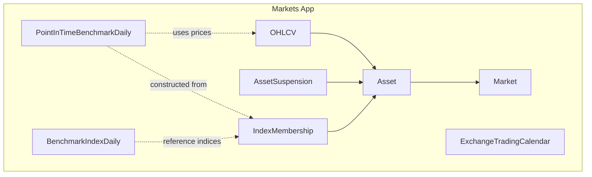
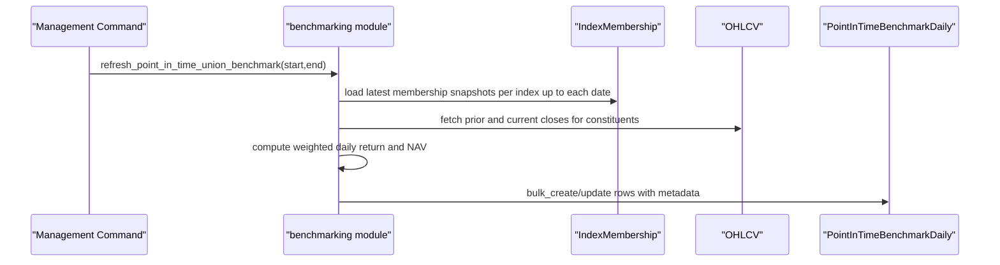
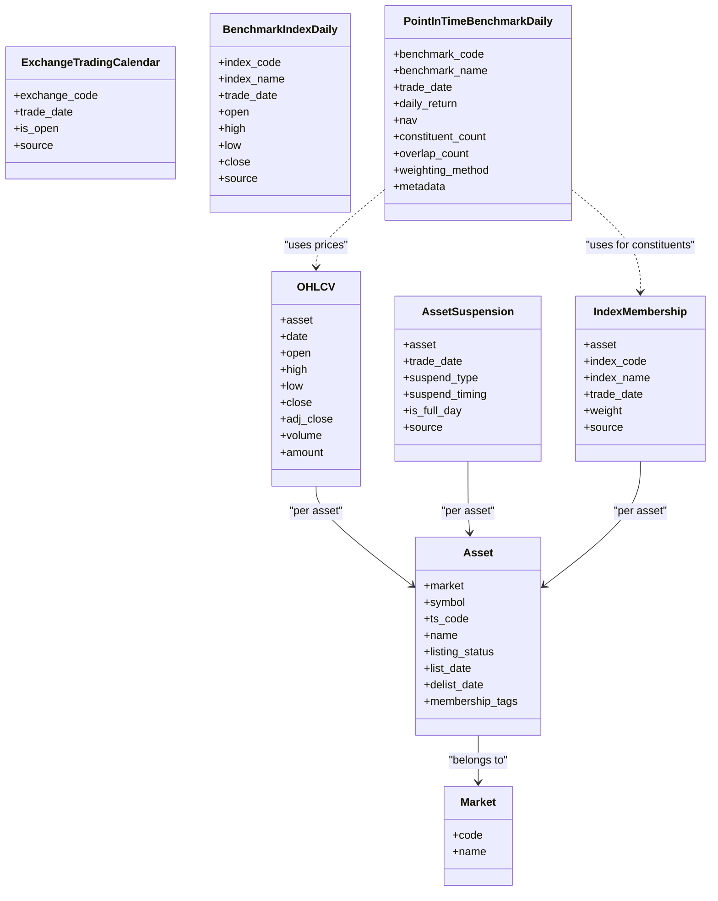
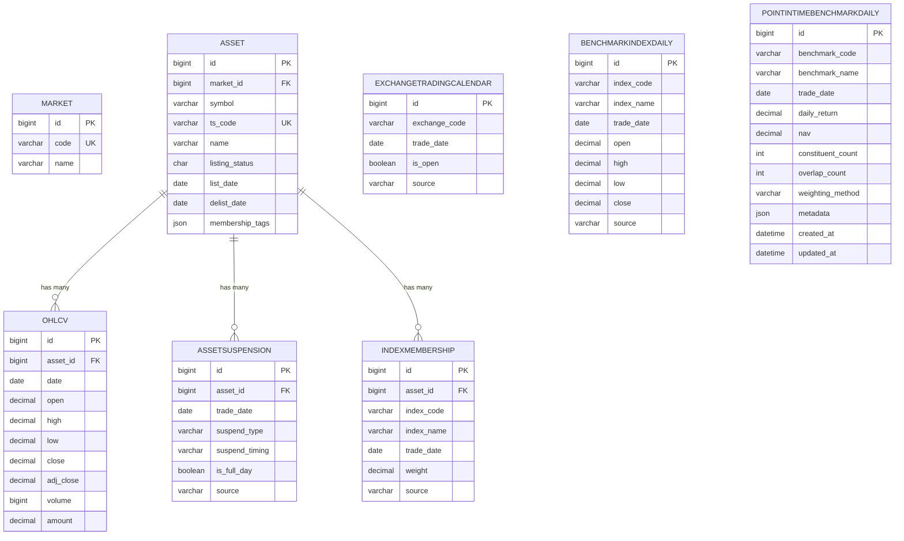
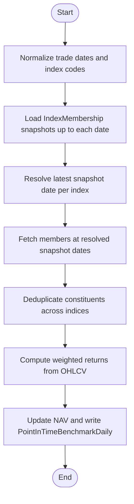

# Market Data Models

<cite>
**Referenced Files in This Document**
- [models.py](file://apps/markets/models.py)
- [0001_initial.py](file://apps/markets/migrations/0001_initial.py)
- [0002_asset_list_date.py](file://apps/markets/migrations/0002_asset_list_date.py)
- [0003_asset_membership_tags_indexmembership.py](file://apps/markets/migrations/0003_asset_membership_tags_indexmembership.py)
- [0006_benchmarkindexdaily.py](file://apps/markets/migrations/0006_benchmarkindexdaily.py)
- [0008_pointintimebenchmarkdaily.py](file://apps/markets/migrations/0008_pointintimebenchmarkdaily.py)
- [0009_asset_lifecycle_support.py](file://apps/markets/migrations/0009_asset_lifecycle_support.py)
- [0010_exchangetradingcalendar_is_open.py](file://apps/markets/migrations/0010_exchangetradingcalendar_is_open.py)
- [benchmarking.py](file://apps/markets/benchmarking.py)
- [build_pit_union_benchmark.py](file://apps/markets/management/commands/build_pit_union_benchmark.py)
- [sync_index_constituents.py](file://apps/markets/management/commands/sync_index_constituents.py)
- [validate_data_quality.py](file://apps/core/management/commands/validate_data_quality.py)
</cite>

## Table of Contents
1. [Introduction](#introduction)
2. [Project Structure](#project-structure)
3. [Core Components](#core-components)
4. [Architecture Overview](#architecture-overview)
5. [Detailed Component Analysis](#detailed-component-analysis)
6. [Dependency Analysis](#dependency-analysis)
7. [Performance Considerations](#performance-considerations)
8. [Troubleshooting Guide](#troubleshooting-guide)
9. [Conclusion](#conclusion)
10. [Appendices](#appendices)

## Introduction
This document provides comprehensive data model documentation for market data entities in the FinanceAnalysis platform. It focuses on Asset, OHLCV, Market, ExchangeTradingCalendar, AssetSuspension, IndexMembership, BenchmarkIndexDaily, and PointInTimeBenchmarkDaily models. It explains point-in-time (PIT) data integrity patterns used across these models, how historical benchmark constituents are tracked via IndexMembership, and how Asset lifecycle management handles listing/delisting dates. It also documents primary/foreign key relationships, indexes, constraints, validation rules, database schema diagrams, optimized access patterns for large-scale financial datasets, and how suspension handling integrates with OHLCV to prevent look-ahead bias in backtesting scenarios.

## Project Structure
The market data models live under the markets application and are extended by migrations that evolve the schema over time. Supporting logic for PIT benchmarks and index membership synchronization is implemented in dedicated modules and management commands.

**Diagram sources**
- [models.py:4-226](file://apps/markets/models.py#L4-L226)

**Section sources**
- [models.py:4-226](file://apps/markets/models.py#L4-L226)

## Core Components
- Market: Canonical reference for exchanges/markets.
- Asset: Represents a tradable instrument with listing status and lifecycle dates; current index memberships are tagged as JSON.
- OHLCV: Daily price bars per asset with open/high/low/close/adjusted close/volume/amount.
- ExchangeTradingCalendar: Official exchange trading days and open/closed flags.
- AssetSuspension: Per-asset daily suspension records including full-day vs timed suspensions.
- IndexMembership: Historical snapshot of an asset’s membership in one or more indices at a given trade date.
- BenchmarkIndexDaily: Official daily index series used for comparisons.
- PointInTimeBenchmarkDaily: Internal union benchmark constructed from PIT index memberships and OHLCV returns.

Key relationships and constraints:
- Asset belongs to Market; unique (market, symbol).
- OHLCV, AssetSuspension, IndexMembership each have composite unique constraints to ensure one row per entity per date.
- IndexMembership and BenchmarkIndexDaily use composite indexes for efficient PIT queries and time-series scans.
- PointInTimeBenchmarkDaily stores computed union benchmark NAV and metadata for auditability.

**Section sources**
- [models.py:4-226](file://apps/markets/models.py#L4-L226)
- [0001_initial.py:15-66](file://apps/markets/migrations/0001_initial.py#L15-L66)
- [0002_asset_list_date.py:12-17](file://apps/markets/migrations/0002_asset_list_date.py#L12-L17)
- [0003_asset_membership_tags_indexmembership.py:14-37](file://apps/markets/migrations/0003_asset_membership_tags_indexmembership.py#L14-L37)
- [0006_benchmarkindexdaily.py:11-34](file://apps/markets/migrations/0006_benchmarkindexdaily.py#L11-L34)
- [0008_pointintimebenchmarkdaily.py:11-37](file://apps/markets/migrations/0008_pointintimebenchmarkdaily.py#L11-L37)
- [0009_asset_lifecycle_support.py:12-62](file://apps/markets/migrations/0009_asset_lifecycle_support.py#L12-L62)
- [0010_exchangetradingcalendar_is_open.py:11-19](file://apps/markets/migrations/0010_exchangetradingcalendar_is_open.py#L11-L19)

## Architecture Overview
The system separates canonical reference data (Market), instrument master data (Asset), price history (OHLCV), calendar (ExchangeTradingCalendar), corporate events (AssetSuspension), index membership history (IndexMembership), official index series (BenchmarkIndexDaily), and internal PIT union benchmark (PointInTimeBenchmarkDaily). The PIT union benchmark is computed using historical IndexMembership snapshots and OHLCV returns, ensuring no future information leaks into any historical date.

**Diagram sources**
- [build_pit_union_benchmark.py:9-43](file://apps/markets/management/commands/build_pit_union_benchmark.py#L9-L43)
- [benchmarking.py:312-428](file://apps/markets/benchmarking.py#L312-L428)

**Section sources**
- [benchmarking.py:1-462](file://apps/markets/benchmarking.py#L1-L462)
- [build_pit_union_benchmark.py:9-43](file://apps/markets/management/commands/build_pit_union_benchmark.py#L9-L43)

## Detailed Component Analysis

### Market
- Purpose: Reference table for exchanges/markets.
- Key fields: code (unique), name.
- Relationships: One-to-many with Asset.
- Constraints: Unique code.

**Section sources**
- [models.py:4-17](file://apps/markets/models.py#L4-L17)
- [0001_initial.py:15-26](file://apps/markets/migrations/0001_initial.py#L15-L26)

### Asset
- Purpose: Master record for instruments with lifecycle state.
- Key fields:
  - market (FK to Market)
  - symbol (string)
  - ts_code (unique)
  - name
  - listing_status (Active/Delisted)
  - list_date (nullable)
  - delist_date (nullable)
  - membership_tags (JSON array of current index tags)
- Relationships:
  - One-to-many with OHLCV, AssetSuspension, IndexMembership.
- Constraints:
  - Unique (market, symbol).
  - Unique ts_code.
- Validation notes:
  - Listing/delisting dates enable pre/post-listing filtering and delisting-aware backtests.

**Section sources**
- [models.py:19-62](file://apps/markets/models.py#L19-L62)
- [0001_initial.py:27-44](file://apps/markets/migrations/0001_initial.py#L27-L44)
- [0002_asset_list_date.py:12-17](file://apps/markets/migrations/0002_asset_list_date.py#L12-L17)
- [0003_asset_membership_tags_indexmembership.py:14-18](file://apps/markets/migrations/0003_asset_membership_tags_indexmembership.py#L14-L18)
- [0009_asset_lifecycle_support.py:12-16](file://apps/markets/migrations/0009_asset_lifecycle_support.py#L12-L16)

### OHLCV
- Purpose: Daily price bars per asset.
- Key fields: asset (FK), date, open, high, low, close, adj_close, volume, amount.
- Constraints:
  - Unique (asset, date).
  - Composite index on (asset, date).
- Access pattern:
  - Time-range scans per asset; join with Asset for universe filters.

**Section sources**
- [models.py:201-226](file://apps/markets/models.py#L201-L226)
- [0001_initial.py:45-66](file://apps/markets/migrations/0001_initial.py#L45-L66)

### ExchangeTradingCalendar
- Purpose: Official exchange trading days and open/closed flags.
- Key fields: exchange_code, trade_date, is_open, source.
- Constraints:
  - Unique (exchange_code, trade_date).
  - Indexes on exchange_code, trade_date, and composite (exchange_code, trade_date).
- Evolution:
  - Added is_open flag; removed previous_trade_date field.

**Section sources**
- [models.py:65-84](file://apps/markets/models.py#L65-L84)
- [0009_asset_lifecycle_support.py:17-32](file://apps/markets/migrations/0009_asset_lifecycle_support.py#L17-L32)
- [0010_exchangetradingcalendar_is_open.py:11-19](file://apps/markets/migrations/0010_exchangetradingcalendar_is_open.py#L11-L19)

### AssetSuspension
- Purpose: Records when assets are suspended, including full-day vs timed suspensions.
- Key fields: asset (FK), trade_date, suspend_type, suspend_timing, is_full_day, source.
- Constraints:
  - Unique (asset, trade_date).
  - Indexes on (asset, trade_date) and (trade_date, is_full_day).
- Integration:
  - Used to exclude or adjust OHLCV usage during backtests to avoid look-ahead bias.

**Section sources**
- [models.py:87-114](file://apps/markets/models.py#L87-L114)
- [0009_asset_lifecycle_support.py:33-62](file://apps/markets/migrations/0009_asset_lifecycle_support.py#L33-L62)

### IndexMembership
- Purpose: Historical snapshot of an asset’s membership in an index at a specific trade date.
- Key fields: asset (FK), index_code, index_name, trade_date, weight, source.
- Constraints:
  - Unique (asset, index_code, trade_date).
  - Indexes on (index_code, trade_date) and (asset, index_code).
- PIT role:
  - Provides “as-of” membership for any historical date, enabling correct constituent sets without future leakage.

**Section sources**
- [models.py:117-144](file://apps/markets/models.py#L117-L144)
- [0003_asset_membership_tags_indexmembership.py:19-37](file://apps/markets/migrations/0003_asset_membership_tags_indexmembership.py#L19-L37)

### BenchmarkIndexDaily
- Purpose: Official daily index series for comparison purposes.
- Key fields: index_code, index_name, trade_date, open, high, low, close, source.
- Constraints:
  - Unique (index_code, trade_date).
  - Index on (index_code, trade_date).

**Section sources**
- [models.py:147-170](file://apps/markets/models.py#L147-L170)
- [0006_benchmarkindexdaily.py:11-34](file://apps/markets/migrations/0006_benchmarkindexdaily.py#L11-L34)

### PointInTimeBenchmarkDaily
- Purpose: Internal union benchmark built from PIT index memberships and OHLCV returns.
- Key fields: benchmark_code, benchmark_name, trade_date, daily_return, nav, constituent_count, overlap_count, weighting_method, metadata, created_at, updated_at.
- Constraints:
  - Unique (benchmark_code, trade_date).
  - Index on (benchmark_code, trade_date).
- Construction:
  - Uses IndexMembership to resolve effective constituents at each historical date, then computes weighted returns from OHLCV and updates NAV.

**Section sources**
- [models.py:173-199](file://apps/markets/models.py#L173-L199)
- [0008_pointintimebenchmarkdaily.py:11-37](file://apps/markets/migrations/0008_pointintimebenchmarkdaily.py#L11-L37)
- [benchmarking.py:312-428](file://apps/markets/benchmarking.py#L312-L428)

## Dependency Analysis
The following diagram shows core dependencies among market data models and supporting logic.

**Diagram sources**
- [models.py:4-226](file://apps/markets/models.py#L4-L226)

**Section sources**
- [models.py:4-226](file://apps/markets/models.py#L4-L226)

## Performance Considerations
- Indexing strategy:
  - Composite indexes on (asset, date) for OHLCV accelerate time-series queries per instrument.
  - Indexes on (index_code, trade_date) and (asset, index_code) support efficient PIT membership lookups and constituent set resolution.
  - Indexes on (exchange_code, trade_date) optimize calendar scans.
  - Indexes on (trade_date, is_full_day) speed up suspension-based filtering.
- Bulk operations:
  - Point-in-time benchmark construction uses bulk_create with update_conflicts to minimize round-trips and enforce idempotency.
- Query patterns:
  - Effective universe resolution loads only necessary fields and deduplicates asset sets per date to reduce memory footprint.
  - Fundamental factor snapshots are fetched once per date window and cached in-memory for weight computation.
- Partitioning considerations:
  - For very large datasets, consider partitioning OHLCV and IndexMembership by date ranges to improve query performance and maintenance.

[No sources needed since this section provides general guidance]

## Troubleshooting Guide
Common issues and resolutions related to data integrity and backtesting:

- Missing PIT membership coverage:
  - If required index membership history is missing for a target date range, the system raises a coverage error instructing to backfill IndexMembership before proceeding.
- OHLCV on full-day suspension:
  - Validation detects OHLCV rows on full-day suspension dates and reports them as warnings; reconciliation commands can delete or adjust such rows to maintain integrity.
- Listing/delisting gaps:
  - Validation checks for OHLCV outside listed windows and excuses gaps where suspensions cover the period; ensures backtests do not assume availability of unlisted or suspended assets.

Operational commands:
- Build or refresh the PIT union benchmark over a date range.
- Sync index constituents and update current membership tags.
- Validate data quality across OHLCV, suspensions, and index/benchmark history.

**Section sources**
- [benchmarking.py:110-146](file://apps/markets/benchmarking.py#L110-L146)
- [build_pit_union_benchmark.py:9-43](file://apps/markets/management/commands/build_pit_union_benchmark.py#L9-L43)
- [sync_index_constituents.py:9-76](file://apps/markets/management/commands/sync_index_constituents.py#L9-L76)
- [validate_data_quality.py:523-558](file://apps/core/management/commands/validate_data_quality.py#L523-L558)
- [validate_data_quality.py:1224-1315](file://apps/core/management/commands/validate_data_quality.py#L1224-L1315)

## Conclusion
The market data models provide a robust foundation for storing and querying financial reference data, price history, calendars, and index memberships. The point-in-time approach enforced through IndexMembership and the PIT union benchmark ensures accurate historical analysis and backtesting without look-ahead bias. Lifecycle fields on Asset and suspension records integrate cleanly with OHLCV to maintain realistic trading conditions. Proper indexing and bulk operations support large-scale datasets while preserving data integrity.

[No sources needed since this section summarizes without analyzing specific files]

## Appendices

### Database Schema Diagram

**Diagram sources**
- [models.py:4-226](file://apps/markets/models.py#L4-L226)

### Point-in-Time Membership Resolution Flow

**Diagram sources**
- [benchmarking.py:65-90](file://apps/markets/benchmarking.py#L65-L90)
- [benchmarking.py:149-208](file://apps/markets/benchmarking.py#L149-L208)
- [benchmarking.py:312-428](file://apps/markets/benchmarking.py#L312-L428)